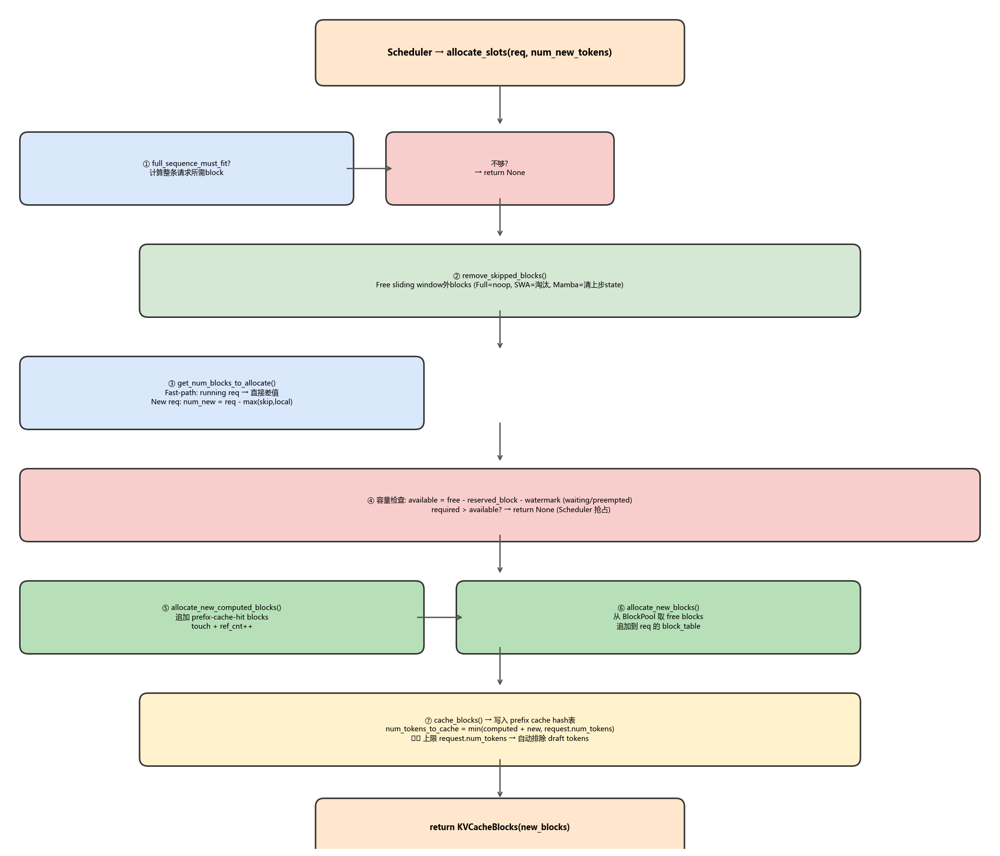
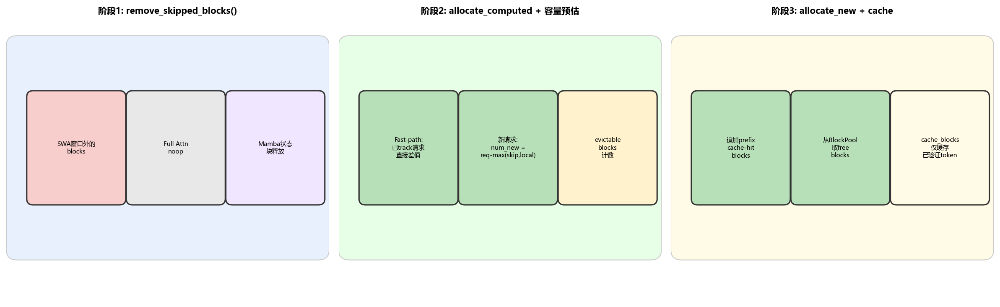
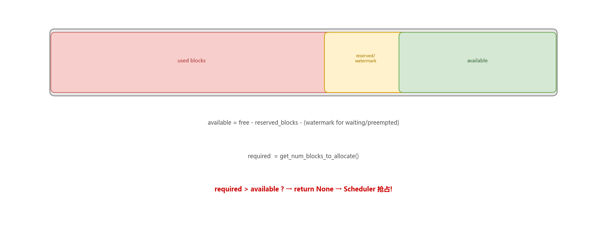

# vLLM allocate_slots 深度解剖

> 版本：vLLM V1 (2026-07)
> 核心文件：`vllm/v1/core/kv_cache_manager.py:248-464`
> 前置阅读：[KV Cache Manager 骨干分析](./kv_cache_manager_backbone.md)

## 目录

- [0. 前置知识：allocate_slots 是什么](#0-前置知识allocate_slots-是什么)
- [1. 完整决策树](#1-完整决策树)
- [2. 三阶段分配详解](#2-三阶段分配详解)
- [3. 容量预估：get_num_blocks_to_allocate](#3-容量预估get_num_blocks_to_allocate)
- [4. 三层保护机制](#4-三层保护机制)
- [5. 分支路径：11 个参数的控制矩阵](#5-分支路径11-个参数的控制矩阵)
- [6. 代码逐段解读](#6-代码逐段解读)
- [7. 关键数据结构](#7-关键数据结构)
- [8. FAQ](#8-faq)

---

## 0. 前置知识：allocate_slots 是什么

`allocate_slots` 是 KVCacheManager 最核心的方法——每步调度必调，负责将 Scheduler 的**逻辑决策**（"给这个请求分配 N 个 token"）翻译成**物理资源分配**（"分配哪些 block、复用哪些前缀缓存、释放哪些过期块"）。

**核心矛盾**：有限的 GPU block pool 中，为不断到来的请求高效分配/回收 block，同时维护前缀缓存一致性。

---

## 1. 完整决策树



```python
def allocate_slots(self, request, num_new_tokens, num_new_computed_tokens=0,
                   new_computed_blocks=None, num_lookahead_tokens=0,
                   num_external_computed_tokens=0, delay_cache_blocks=False,
                   num_encoder_tokens=0, full_sequence_must_fit=False,
                   reserved_blocks=0, has_scheduled_reqs=True):
```

**入口**：Scheduler 在 `schedule()` 中为每个请求调用此方法。

**返回值**：
- `KVCacheBlocks` — 成功，返回新分配的 block（含前缀命中 + 全新分配）
- `None` — 失败，资源不足，Scheduler 需抢占其他请求

---

## 2. 三阶段分配详解



### 阶段 1: 移除过期 block + 全序列准入检查

```
full_sequence_must_fit=True 时：
  → 计算整个请求序所需的 block 数
  → 不够 → return None（防止分块预填充过度接纳请求）

remove_skipped_blocks():
  FullAttention  → noop (返回0)
  SlidingWindow  → 释放窗口外的 block
  Mamba (align)  → 清空上一步的状态块
  目的: 释放过期 block → 减少后续 eviction 压力
```

### 阶段 2: 容量预估

```python
num_blocks_to_allocate = coordinator.get_num_blocks_to_allocate(
    request_id, num_tokens, new_computed_blocks, total_computed_tokens, ...
)

watermark_blocks = int(watermark * num_blocks) if request is WAITING else 0
available = free_blocks - reserved_blocks
required = num_blocks_to_allocate + watermark_blocks

if required > available:
    return None  # → Scheduler 抢占
```

### 阶段 3: 分配 + 缓存

```python
# 3a: 追加前缀缓存命中的 block
coordinator.allocate_new_computed_blocks(
    request_id, new_computed_blocks, ...
)

# 3b: 从 pool 分配全新 block
new_blocks = coordinator.allocate_new_blocks(
    request_id, num_tokens_need_slot, ...
)

# 3c: 写入前缀缓存（仅已验证 token）
num_tokens_to_cache = min(
    total_computed + num_new_tokens,
    request.num_tokens,       # ← 关键！自动排除 draft tokens
)
coordinator.cache_blocks(request, num_tokens_to_cache)
```

---

## 3. 容量预估：get_num_blocks_to_allocate

**文件**：`single_type_kv_cache_manager.py:158-246`

这是阶段 2 的核心——精确计算本请求在该 KV cache group 还需要多少 block。

### 三种路径

```
① Running 请求 (已 track, fast-path):
   num_required = ceil(num_tokens / block_size)
   num_req = len(req_to_blocks[request_id])
   return max(num_required - num_req, 0)
   // 注意: 推测解码下 rejected tokens 可能导致 required < req
    
② 新请求 + 无窗口淘汰:
   num_new = max(required - max(skipped, local_computed), 0)
   + 被skip的 prefix-cache-hit block 若 evictable 则计入
    
③ 新请求 + SWA 窗口淘汰:
   num_skipped_tokens = max(0, computed - sliding_window + 1)
   num_skipped_blocks = num_skipped_tokens // block_size
   // 窗口外的 block 可回收 → 减少需求
```

### CoW (Copy-on-Write) 特殊处理

如果 prefix-cache-hit block 只被当前请求独享（ref_cnt == 0），且即将被 skip 的 token 不是 block 对齐的 → 该 block 需要 **CoW 复制**，因此额外计入 1 个 block 需求。

### 回收感知上限 (Recycling-aware cap)

```python
if apply_admission_cap and self._max_admission_blocks_per_request:
    num_required_blocks = min(num_required_blocks, self._max_admission_blocks_per_request)
```

用于 SWA/ChunkedLocal attention：`remove_skipped_blocks` 运行在 `get_num_blocks_to_allocate` **之前**，所以实际持有的 block 不会超过 `_max_admission_blocks_per_request`。防止 admission 和 pool sizing 不匹配导致的死锁（issue #39734）。

---

## 4. 三层保护机制



### 4.1 Watermark（水位线）

```python
watermark_blocks = int(watermark * num_blocks)  # 如 watermark=0.01 → 1% 预留
```

**仅对 WAITING/PREEMPTED 请求生效**。保证 running 请求有足够 block 继续运行，防止新请求过度消耗资源导致频繁抢占。

### 4.2 Reserved Blocks（预留块）

```python
available = free_blocks - reserved_blocks
```

用于异步 KV connector 加载场景：防止 connector 的初始分配吃掉 in-flight prefill 需要的 block。

### 4.3 Full Sequence Must Fit（全序列准入）

```python
if full_sequence_must_fit:
    full_num_tokens = min(request.num_tokens, max_model_len)
    blocks_needed = get_num_blocks_to_allocate(full_num_tokens, ...)
    if blocks_needed > free:
        return None  # 整条请求装不下，别接纳
```

防止分块预填充时只检查第一个 chunk 就接纳请求，后续 chunk 可能因为 block 不够而卡住。

---

## 5. 分支路径：11 个参数的控制矩阵

| 参数 | 默认值 | 触发条件 | 效果 |
|------|-------|---------|------|
| `num_new_tokens` | (必传) | 每步调度 | 本次需分配的核心 token 数 |
| `num_new_computed_tokens` | 0 | prefix cache hit > 0 | 新命中的缓存 token 数 |
| `new_computed_blocks` | None | 同上 | 命中 block 列表 |
| `num_lookahead_tokens` | 0 | spec decode (EAGLE/MTP) | 额外预留 speculative slot |
| `num_external_computed_tokens` | 0 | KV connector (P/D分离) | 外部已计算的 token 数 |
| `delay_cache_blocks` | False | P/D KV transfer | 延迟写入前缀缓存 |
| `num_encoder_tokens` | 0 | encoder-decoder模型 | 跨注意力 encoder 缓存 |
| `full_sequence_must_fit` | False | `scheduler_reserve_full_isl` | 全序列准入检查 |
| `reserved_blocks` | 0 | async KV connector | 额外预留 block 数 |
| `has_scheduled_reqs` | True | 每步调度 | 控制 watermark 是否生效 |
| `watermark` | 0.0 | 配置 | 水位线比例 |

---

## 6. 代码逐段解读

### 6.1 入口校验 (lines 346-350)

```python
if num_new_tokens == 0 and num_external_computed_tokens == 0:
    raise ValueError("num_new_tokens must be > 0 ...")
```
至少有一个新 token 或外部 token，否则没必要分配。

### 6.2 全序列准入 (lines 376-391)

```python
if full_sequence_must_fit:
    full_num_tokens = min(request.num_tokens, self.max_model_len)
    # 计算整条请求所需 block（含回收感知上限）
    num_blocks = coordinator.get_num_blocks_to_allocate(..., apply_admission_cap=True)
    required = num_blocks + watermark_blocks
    if required > free:
        return None  # 装不下
```

### 6.3 移除过期块 (lines 398-408)

```python
self.coordinator.remove_skipped_blocks(
    request.request_id, total_computed_tokens, num_prompt_tokens
)
```

### 6.4 容量检查 (lines 410-426)

```python
num_blocks_to_allocate = coordinator.get_num_blocks_to_allocate(...)
available = free_blocks - reserved_blocks
required = num_blocks_to_allocate + watermark_blocks
if required > available:
    return None  # 不够
```

### 6.5 分配 + 缓存 (lines 428-464)

```python
# 追加前缀缓存块
if new_computed_block_list or num_external > 0:
    coordinator.allocate_new_computed_blocks(...)

# 分配全新块
new_blocks = coordinator.allocate_new_blocks(...)

# 延迟缓存或禁用 → 直接返回
if not enable_caching or delay_cache_blocks:
    return create_kv_cache_blocks(new_blocks)

# 缓存（仅已验证 token）
num_tokens_to_cache = min(
    total_computed + num_new_tokens,
    request.num_tokens,  # cap: 排除 draft tokens!
)
coordinator.cache_blocks(request, num_tokens_to_cache)
```

---

## 7. 关键数据结构

| 数据结构 | 作用 |
|---------|------|
| `KVCacheBlocks` | Scheduler ↔ KVCacheManager 接口，隐藏内部结构 |
| `BlockPool` | 物理 block 池 + LRU 淘汰 + 前缀缓存哈希表 |
| `SingleTypeKVCacheManager` | 每种 attention 类型独立管理（Full/SWA/Chunked/Mamba） |
| `FreeKVCacheBlockQueue` | 按 block_id 排序的空闲队列 |
| `BlockHashToBlockMap` | hash → block 的映射表 |
| `req_to_blocks` | request_id → 已分配 block 列表 |

---

## 8. FAQ

**Q1: allocate_slots 返回 None 后 Scheduler 做什么？**

Scheduler 尝试抢占 low-priority running 请求（PRIORITY 策略取 max priority，FCFS 取末尾）。被抢占请求移入 WAITING 队列头部。

**Q2: 为什么要把 remove_skipped_blocks 放在分配之前？**

先释放过期的 block → 可能腾出空间 → 减少后续 eviction 触发。如果在分配后再释放，可能已经触发不必要的 eviction。

**Q3: delay_cache_blocks 什么时候 True？**

P/D 分离场景：prefill 节点的 block 需要通过 KV transfer 发送到 decode 节点。传输完成前不缓存，因为 hash 可能还没计算。

**Q4: num_tokens_to_cache = min(computed + new, request.num_tokens) 为什么用 min？**

`request.num_tokens` = 只有已验证的 token（不含 draft/spec token）。这保证前缀缓存永远不会混入未验证的 draft tokens。

**Q5: get_num_blocks_to_allocate 的三种路径哪个最常用？**

路径 1（running 请求 fast-path）最常见——decode 阶段每步只需 1 个新 token，所需 block 数基本不变。路径 2/3 用于新接纳的请求或首次调度。

---

*报告生成时间: 2026-07-13 | 工具: source-analyzer skill*
