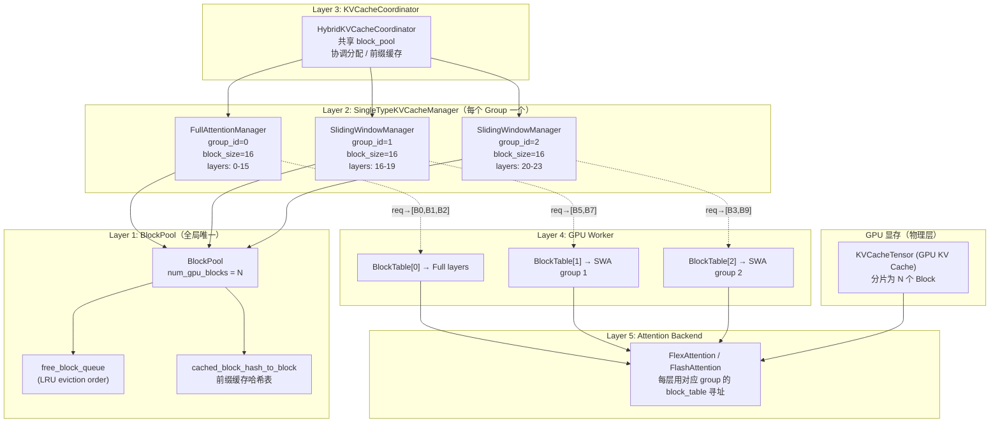
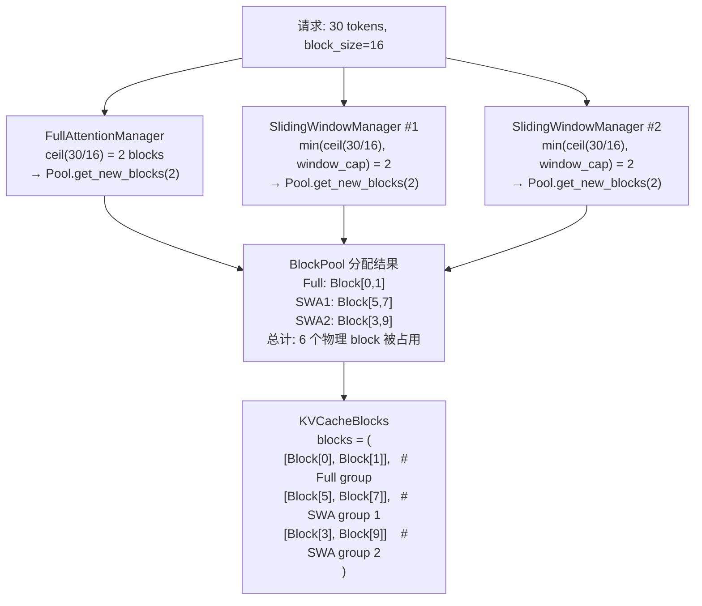
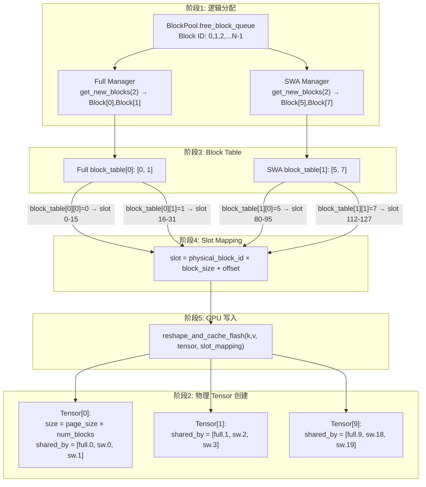
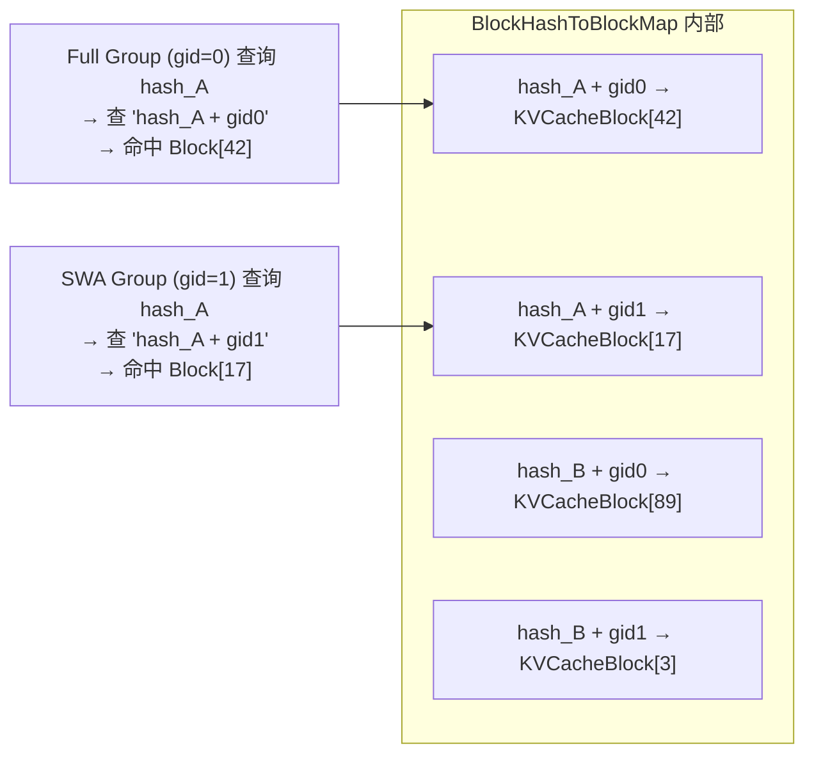
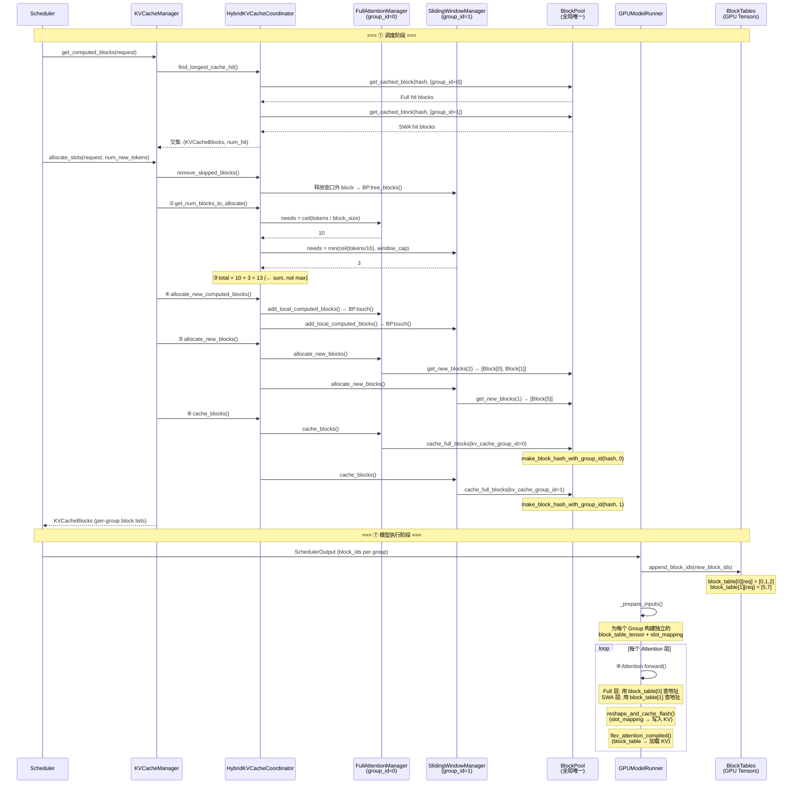

# vLLM 单 BlockPool 服务多 Attention Group 深度解剖

> **Mermaid 图渲染**：GitHub / GitLab 原生支持；VS Code 安装 "Markdown Preview Mermaid Support" 插件；**PyCharm 安装 "Mermaid" 插件**（Settings → Plugins → 搜索 Mermaid）即可在预览中渲染。

## 目录

1. [前置知识：设计思想与核心概念](#1-前置知识设计思想与核心概念)
2. [全景架构概览](#2-全景架构概览)
3. [Layer 1: BlockPool — 全局唯一的物理块池](#3-layer-1-blockpool--全局唯一的物理块池)
4. [Layer 2: 单 BlockPool 到多 Group 的分配逻辑](#4-layer-2-单-blockpool-到多-group-的分配逻辑)
5. [物理 Tensor 布局与 Slot Mapping：逻辑 Block 到 GPU 地址的完整链路](#5-物理-tensor-布局与-slot-mapping逻辑-block-到-gpu-地址的完整链路)
6. [前缀缓存的多 Group 隔离机制](#6-前缀缓存的多-group-隔离机制)
7. [Layer 4: GPU Worker 端 — 独立 Block Table](#7-layer-4-gpu-worker-端--独立-block-table)
8. [完整调用链时序图](#8-完整调用链时序图)
9. [关键数据结构速查表](#9-关键数据结构速查表)
10. [快速问题解答（FAQ）](#10-快速问题解答faq)

---

## 1. 前置知识：设计思想与核心概念

### 1.1 为什么需要单 BlockPool 服务多 Group？

混合注意力模型（如 Gemma3：10 Full + 52 SWA 层）中，不同注意力类型对 KV Cache 的需求差异极大：

- **Full Attention** 层：需要保存全部历史 token，block 数随序列长度线性增长
- **Sliding Window Attention** 层：只需最近 `sliding_window` 个 token，block 数有固定上限

如果每种注意力类型独立管理各自的 block 池，会导致：
- 显存碎片化：Full 层需要很多 block 时 SWA 的预留 block 却空闲
- 内存利用率低：无法在组间动态平衡

**vLLM 的解决方案**：所有注意力类型共享**同一个物理 BlockPool**，各自从池中独立分配 block，按需竞争。这就像多个进程共享同一块物理内存，但各自有独立的页表。

### 1.2 核心设计原则

| 原则 | 说明 |
|------|------|
| **物理池共享** | 所有 Group 从同一个 `free_block_queue` 取 block |
| **逻辑键隔离** | 每个 Group 的前缀缓存 key 编码了自己的 `group_id`，天然不碰撞 |
| **Block 需求加和** | 总需求 = Full 需求 + SWA1 需求 + SWA2 需求 + ...，不是取 max |
| **独立 Block Table** | GPU 端每个 Group 有独立的 block_table tensor + slot_mapping |

### 1.3 与单 Attention 模型的本质区别

```
单 Attention:  一个 block = 所有层共享同一个物理 block 号
                              ┌──────────────────┐
                请求 A         │ Block[5] = 层0..31 的 tokens 30-35 │
                              └──────────────────┘

Hybrid Attention:  一个 block = 只属于一个 Group 的层
                              ┌─────────────┐   ┌──────────────┐
                请求 A         │ Full Group:   │   │ SWA Group:    │
                              │ Block[0,1,2] │   │ Block[5,7]    │
                              │ 层 0..15      │   │ 层 16..23     │
                              └─────────────┘   └──────────────┘
```

**关键洞察**：在 Hybrid Attention 中，没有一个"代表所有层"的 block。Block 是 per-group 的概念。

---

## 2. 全景架构概览



**职责速览**：

| 层 | 组件 | 职责 |
|----|------|------|
| Layer 1 | `BlockPool` | 管理 N 个 `KVCacheBlock` 的分配/释放/前缀缓存 |
| Layer 2 | `SingleTypeKVCacheManager` | 每个 Group 从 BlockPool 中独立分配 block |
| Layer 3 | `KVCacheCoordinator` | 协调多 Group 的分配策略，取交集做前缀缓存 |
| Layer 4 | `BlockTables`（GPU Worker） | 为每个 Group 维护独立的 block_table tensor |
| Layer 5 | Attention Backend | 每层用对应 group 的 block_table + slot_mapping 计算 |

---

## 3. Layer 1: BlockPool —— 全局唯一的物理块池

### 3.1 核心数据结构

**文件**: `vllm/v1/core/block_pool.py:163-197`

```python
class BlockPool:
    def __init__(self, num_gpu_blocks: int, enable_caching: bool,
                 hash_block_size: int, ...):
        self.num_gpu_blocks = num_gpu_blocks
        # 所有物理 block
        self.blocks: list[KVCacheBlock] = [
            KVCacheBlock(idx) for idx in range(num_gpu_blocks)
        ]
        # 空闲 block 队列（LRU 淘汰顺序）
        self.free_block_queue = FreeKVCacheBlockQueue(self.blocks)
        # 前缀缓存：hash → block 的映射
        self.cached_block_hash_to_block = BlockHashToBlockMap()
        # 多 hash 关联：block_id → set of additional hashes
        self.cached_block_hashes_by_block: dict[int, set[BlockHashWithGroupId]] = {}
```

**KVCacheBlock** (`kv_cache_utils.py:118-176`)：

```python
@dataclass(slots=True)
class KVCacheBlock:
    block_id: int                    # 物理 block ID（0..N-1）
    ref_cnt: int = 0                 # 引用计数（被几个请求引用）
    _block_hash: BlockHashWithGroupId | None = None  # 主 hash
    _block_hash_num_tokens: int | None = None        # 主 hash 覆盖的 token 数
    is_null: bool = False            # null block 标记
```

### 3.2 物理 Block 数如何计算

**文件**: `vllm/v1/core/kv_cache_utils.py:1318-1400`

```python
def get_kv_cache_config_from_groups(..., available_memory: int):
    page_size = max(len(g.layer_names) for g in kv_cache_groups)
               * block_size * kv_hidden_size
    
    num_blocks = available_memory // page_size  # 单一数字，不分 group
    
    return KVCacheConfig(num_blocks=num_blocks, ...)
```

所有 Group 共享同一个 `num_blocks` 数字，BlockPool 只有一个，持有 N 个物理 block。

### 3.3 Block 创建时的隔离

**文件**: `vllm/v1/core/kv_cache_coordinator.py:92-122`

```python
# 创建唯一的 BlockPool
self.block_pool = BlockPool(
    num_gpu_blocks=kv_cache_config.num_blocks,  # 单一数字
    enable_caching=enable_caching,
    hash_block_size=hash_block_size,
)

# 所有 Manager 共享同一个 block_pool，但各有不同的 group_id
self.single_type_managers = tuple(
    get_manager_for_kv_cache_spec(
        kv_cache_spec=kv_cache_group.kv_cache_spec,
        block_pool=self.block_pool,    # ← 同一个 BlockPool
        kv_cache_group_id=i,           # ← 不同的 group_id
        ...
    )
    for i, kv_cache_group in enumerate(kv_cache_config.kv_cache_groups)
)
```

### 3.4 设计决策

```
为什么用单一 BlockPool 而不是每个 Group 一个？

  ┌──────────────────────────────────────────────────────────────┐
  │  方案 A: 多 BlockPool（每个 Group 独立）                      │
  │  Full Pool (N1 blocks) | SWA Pool (N2 blocks) | ...          │
  │  ✗ 内存割裂：Full 需要很多 block 时 SWA 的空闲不能用         │
  │  ✗ 需要预估各 Group 的 block 需求比例                        │
  ├──────────────────────────────────────────────────────────────┤
  │  ✅ 方案 B: 单 BlockPool（所有 Group 共享）                   │
  │  Pool (N blocks), Full 和 SWA 各自分配                       │
  │  ✅ 内存利用最大化：Full 和 SWA 按需竞争                      │
  │  ✅ 简单：只有一个 LRU 队列、一个哈希表                      │
  │  ✅ 前缀缓存隔离通过 group_id 编码到 hash key 实现            │
  └──────────────────────────────────────────────────────────────┘
```

---

## 4. Layer 2: 单 BlockPool 到多 Group 的分配逻辑

### 4.1 Block 需求计算：Sum, Not Max

**文件**: `vllm/v1/core/kv_cache_coordinator.py:132-194`

```python
def get_num_blocks_to_allocate(self, request_id, num_tokens, ...):
    # 关键注释（line 166-167）:
    # "Each group has its own dedicated block pool"
    # "the total demand is the sum (not max) of every group's
    #  per-manager requirement."
    
    num_blocks_to_allocate = 0
    for i, manager in enumerate(self.single_type_managers):
        num_blocks_to_allocate += manager.get_num_blocks_to_allocate(
            request_id, num_tokens, new_computed_blocks[i], ...
        )
    return num_blocks_to_allocate
```

**示例**（Full = 10 blocks, SWA1 = 3 blocks, SWA2 = 3 blocks）：

```
总需求 = 10 + 3 + 3 = 16 blocks  ← 不是 max(10, 3, 3) = 10
```

### 4.2 每个 Group 独立分配 Block

**文件**: `vllm/v1/core/kv_cache_coordinator.py:242-275`

```python
def allocate_new_blocks(self, request_id, num_tokens, ...):
    return tuple(
        manager.allocate_new_blocks(request_id, num_tokens, ...)
        for manager in self.single_type_managers  # 逐个 Group 调用
    )
```

每个 Manager 的内部逻辑 (`single_type_kv_cache_manager.py:360-387`)：

```python
def allocate_new_blocks(self, request_id, num_tokens, ...):
    req_blocks = self.req_to_blocks[request_id]
    num_required_blocks = cdiv(num_tokens, self.block_size)
    num_new_blocks = num_required_blocks - len(req_blocks)
    if num_new_blocks <= 0:
        return []
    new_blocks = self.block_pool.get_new_blocks(num_new_blocks)  # 从共享池取
    req_blocks.extend(new_blocks)
    return new_blocks
```

### 4.3 分配流程图示



### 4.4 KVCacheBlocks：多 Group 分配结果的载体

**文件**: `vllm/v1/core/kv_cache_manager.py:30-59`

```python
@dataclass
class KVCacheBlocks:
    blocks: tuple[Sequence[KVCacheBlock], ...]
    """
    blocks[i][j] = i-th kv_cache_group, j-th block of tokens
    
    例如:
    blocks[0] = [KVCacheBlock(0), KVCacheBlock(1)]  ← Full Attention
    blocks[1] = [KVCacheBlock(5), KVCacheBlock(7)]  ← SWA Group 1
    blocks[2] = [KVCacheBlock(3), KVCacheBlock(9)]  ← SWA Group 2
    """
```

---

## 5. 物理 Tensor 布局与 Slot Mapping：逻辑 Block 到 GPU 地址的完整链路

> 这是整个系统最容易被误解的一环。BlockPool 中的 block ID 不仅是逻辑标识，同时也是 GPU tensor 中的**物理偏移索引**。

### 5.1 物理 Tensor 的创建：`shared_by` 机制

**文件**: `vllm/v1/core/kv_cache_utils.py:1368-1394`

```python
group_size = max(len(group.layer_names) for group in kv_cache_groups)

for i in range(group_size):
    shared_by = []
    for j in range(len(kv_cache_groups)):
        if i < len(kv_cache_groups[j].layer_names):
            shared_by.append(kv_cache_groups[j].layer_names[i])
    kv_cache_tensors.append(
        KVCacheTensor(size=page_size * num_blocks, shared_by=shared_by)
    )
```

**以 10 Full + 20 SWA（分成 3 个 Group，每组 10 层）为例**：

```
group_size = max(10, 10, 10) = 10

创建 10 个物理 Tensor，每个都被 3 个不同 Group 的层共享：
  Tensor[0]: shared_by = [full.0,  sw.0,  sw.1]
  Tensor[1]: shared_by = [full.1,  sw.2,  sw.3]
  ...
  Tensor[9]: shared_by = [full.9,  sw.18, sw.19]
```

每个 Tensor 大小 = `page_size * num_blocks`，即每个 tensor 都有 num_blocks 个 block 槽位。

### 5.2 同一个 Block ID = 同一个物理位置

**这是核心洞察**：BlockPool 分配给不同 Group 的 block ID，直接就是 GPU tensor 中的**物理 block 偏移**。

```
BlockPool 给 Full Manager 分配了 Block[0], Block[1]
BlockPool 给 SWA Manager  分配了 Block[5], Block[7]

→ Tensor[0]（被 full.0 + sw.0 + sw.1 共享）的布局：

  Block[0]    Block[1]    Block[2]    Block[3]    Block[4]    Block[5]    Block[6]    Block[7]    ...
  ┌──────────┬──────────┬──────────┬──────────┬──────────┬──────────┬──────────┬──────────┬─────┐
  │ full.0   │ full.0   │ (其他请求) │          │          │ sw.0     │ (其他请求) │ sw.0     │     │
  │ 使用     │ 使用     │          │          │          │ sw.1     │          │ sw.1     │     │
  │          │          │          │          │          │ 使用     │          │ 使用     │     │
  └──────────┴──────────┴──────────┴──────────┴──────────┴──────────┴──────────┴──────────┴─────┘
   ↑                            ↑ 不同 Group 的 block_table 指向同一个 tensor 的不同 block 偏移 ↑
   full.0 查自己的 block_table           sw.0 查自己的 block_table
   → 读/写 Block[0] 和 Block[1]         → 读/写 Block[5] 和 Block[7]
```

**物理上不重叠，因为 BlockPool 保证同一个 block ID 不会分配给两个不同的请求/Group。**

### 5.3 Slot Mapping 公式

**文件**: `vllm/v1/worker/gpu/block_table.py:160-185`

```
slot = block_table[logical_block_idx] * block_size + offset_in_block
```

```python
# 伪代码
for each new_token in request:
    logical_block_idx = token_pos // block_size
    offset_in_block   = token_pos % block_size
    physical_block_id = block_table[logical_block_idx]
    slot = physical_block_id * block_size + offset_in_block
    slot_mapping[token_idx] = slot
```

**具体例子**（请求 A 写 token 18）：

```
Full 层 (group 0):
  logical_block = 18 // 16 = 1
  physical_block = block_table[0][1] = 1  ← Full 的 table 里存的是 Block[1]
  offset = 18 % 16 = 2
  slot = 1 * 16 + 2 = 18
  → 写入 Tensor[0] 的 slot 18 位置（在 Block[1] 区域内）

SWA 层 (group 1):
  logical_block = 18 // 16 = 1
  physical_block = block_table[1][1] = 7  ← SWA 的 table 里存的是 Block[7]
  offset = 18 % 16 = 2
  slot = 7 * 16 + 2 = 114
  → 写入 Tensor[0] 的 slot 114 位置（在 Block[7] 区域内）
```

**同一个 token，Full 层写到 Tensor[0] 的 slot 18，SWA 层写到 Tensor[0] 的 slot 114——完全不同区域，永不冲突。**

### 5.4 不同 Group 层数不同的处理

**问题**：Full Group 只有 10 层，SWA Group 有 20 层（拆成 2 个子 Group），页面大小怎么统一？

**答案**：`group_size = max(各 group 的层数)`，不足的用 padding。

```
page_size_per_block = group_size * (每层一个 block 的字节数)
num_blocks = GPU总可用内存 // page_size_per_block
```

既然所有 Tensor 的 size 都基于同一个 `num_blocks`，每个 Tensor 拥有的 block 槽位数量一致。

对于 SWA 层更多的模型（如 Gemma3: 10 Full + 52 SWA）：

```
group_size = max(1, 6) = 6  (Full 1组10层 → padding成6组? 不...)
```

实际上分组算法更精细，见 `_get_kv_cache_groups_uniform_page_size`，但最终效果是：所有 Tensor 的 block 数量一致，大 group 通过 padding 填满。

### 5.5 完整映射链路总结



| 阶段 | 做了什么 | 关键公式 |
|------|---------|---------|
| ① 逻辑分配 | BlockPool 给每个 Manager 独立的 block ID | Full:[0,1], SWA:[5,7] |
| ② 物理 Tensor | 同 index 的层共享 Tensor | Tensor[i] = [full.i, sw.2i, sw.2i+1] |
| ③ Block Table | 每个 Group 维护独立的映射表 | `block_table[gid][req][logical]` |
| ④ Slot Mapping | 物理 block ID → GPU 线性地址 | `slot = block_id × block_size + offset` |
| ⑤ GPU 写入 | 直接用 slot 索引写入 tensor 对应位置 | `tensor[slot, head, ...]` |

**核心认识**：BlockPool 中的 block ID **不是**抽象的"逻辑块号"，它直接对应 GPU tensor 中的**物理偏移索引**。不同 Group 分配到不同的 block ID → 自然映射到 tensor 中不重叠的物理区域。`shared_by` 让同一 Tensor 被多层共享，而独立的 `block_table` 确保每层只访问自己被分配的区域。

### 5.6 不均匀层数：Padding 与内存浪费

**不是所有模型都能刚好均分。** 以 10 Full + 21 SWA 为例，追踪代码到底发生了什么。

**文件**: `vllm/v1/core/kv_cache_utils.py:1173-1227`

**Step 1: 按类型分组**

```
same_type_layers = {
    FullAttentionSpec: [full.0, ..., full.9],       # 10 层
    SlidingWindowSpec:  [sw.0, ..., sw.20],          # 21 层
}
```

**Step 2: 计算 group_size**

```
min_num_layers = min(10, 21) = 10
max_num_layers = max(10, 21) = 21

21 < 10 * 1.5 (=15)?  21 > 15 → NO
→ group_size = min_num_layers = 10
```

**Step 3: 拆分 Full（10 层 / 10 = 1 组，无 padding）**

```
num_groups = ceil(10/10) = 1
Group 0: [full.0, full.1, ..., full.9]   (10 层，无需 padding)
```

**Step 4: 拆分 SWA（21 层 / 10 = 3 组，需 padding）**

```
num_groups = ceil(21/10) = 3
padding_per_group = 10 - 21 % 10 = 10 - 1 = 9 (总共需 9 个 padding 层)

交错分配 (layers[i::num_groups])：
  Group 1: sw[0::3] = [sw.0, sw.3, sw.6, sw.9, sw.12, sw.15, sw.18] + 3 padding → 10 层
  Group 2: sw[1::3] = [sw.1, sw.4, sw.7, sw.10, sw.13, sw.16, sw.19] + 3 padding → 10 层
  Group 3: sw[2::3] = [sw.2, sw.5, sw.8, sw.11, sw.14, sw.17, sw.20] + 3 padding → 10 层
```

**Step 5: 最终 4 个 Group，`group_size = max(10,10,10,10) = 10`**

```
Group 0 (Full): [full.0, full.1, ..., full.9]              → 10 层，0 padding
Group 1 (SWA):  [sw.0, sw.3, ..., sw.18] + 3 padding       → 10 层，3 padding
Group 2 (SWA):  [sw.1, sw.4, ..., sw.19] + 3 padding       → 10 层，3 padding
Group 3 (SWA):  [sw.2, sw.5, ..., sw.20] + 3 padding       → 10 层，3 padding
```

**Step 6: 创建 10 个物理 Tensor（`group_size = 10`）**

```python
for i in range(10):  # 创建 10 个 Tensor
    shared_by = []
    for j in range(4):  # 遍历 4 个 Group
        if i < len(group[j].layer_names):  # 每个 Group 都是 10 层
            shared_by.append(group[j].layer_names[i])
    kv_cache_tensors.append(KVCacheTensor(size=page_size*num_blocks, shared_by=shared_by))
```

结果：

```
Tensor[0]: shared_by = [full.0, sw.0,  sw.1,  sw.2]   ← 4 个真实层
Tensor[1]: shared_by = [full.1, sw.3,  sw.4,  sw.5]   ← 4 个真实层
...
Tensor[6]: shared_by = [full.6, sw.18, sw.19, sw.20]  ← 4 个真实层
Tensor[7]: shared_by = [full.7, PAD,   PAD,   PAD]    ← 1 真实 + 3 padding ❌
Tensor[8]: shared_by = [full.8, PAD,   PAD,   PAD]    ← 1 真实 + 3 padding ❌
Tensor[9]: shared_by = [full.9, PAD,   PAD,   PAD]    ← 1 真实 + 3 padding ❌
```

**内存浪费分析**：

浪费的本质不是 padding 机制本身，而是 **SWA 总层数铺不满拆分后的层槽位**。即使不加 padding，结果是一样的：

```
不加 padding：group_size = max(10, 7, 7, 7) = 10  ← 还是 10 个 Tensor
加 padding：  group_size = max(10, 10, 10, 10) = 10  ← 也是 10 个 Tensor
```

关键在于每个 Tensor 内的利用率：

```
Tensor[0-6]：4 层全是真实层 → 100% 利用
Tensor[7-9]：只有 full.7/8/9 是真的，SWA 侧 3 个槽位空洞 → 25% 利用

总有效利用率 = (7×100% + 3×25%) / 10 = 77.5%
浪费比例 = 22.5%
```

> padding 只是让 SWA Group 有占位名字便于 bookkeeping，不额外增加 Tensor 数量也不额外分配显存。浪费的来源是 `group_size = max(...)`——只要不同 Group 层数不一致，较短 Group 缺失位置的 Tensor 就会有空洞。

**代码中的日志警告**（line 1208-1212）：

```python
logger.warning(
    "Add %d padding layers, may waste at most %.2f%% KV cache memory",
    num_padding_layers,  # 9
    num_padding_layers / len(layers) * 100,  # 9/21*100 = 42.9%
)
```

> 警告描述的是"最多浪费 42.9%"，指 padding 槽位相对 SWA 总层数（9/21=42.9%），而非全局（9/40=22.5%）。这是理论最坏值——实际浪费取决于模型各 Group 层数的分布。

**什么时候可以不拆分？** 代码有一个启发式优化（line 1195-1203）：

```
if max_num_layers < min_num_layers * 1.5:
    group_size = max_num_layers  # 直接取最大值，padding 更少
```

例如 12 SWA + 13 Full：`13 < 12 * 1.5 = 18` → YES → `group_size = 13`。这样 12 SWA 只需 pad 1 层（而非拆成 12+12 再 pad），pading 开销极小。但 10 Full + 21 SWA 不满足（`21 > 15`），只能拆分 + padding。

**实际例子**：Gemma3-27B 有 10 Full + 52 SWA → 拆分后 6 个 Group，padding 开销可接受。极端不均的模型（如 5 Full + 50 SWA）可能更适合用 `--disable-hybrid-kv-cache-manager` 关闭混合管理，避免大量 padding 浪费。

---

## 6. 前缀缓存的多 Group 隔离机制

### 5.1 核心机制：Group ID 编码进 Hash Key

**文件**: `vllm/v1/core/kv_cache_utils.py:57-66`

```python
BlockHash            = NewType("BlockHash", bytes)
BlockHashWithGroupId = NewType("BlockHashWithGroupId", bytes)

def make_block_hash_with_group_id(block_hash: BlockHash, group_id: int):
    """把 group_id (4字节大端) 追加到 block_hash 末尾"""
    return BlockHashWithGroupId(
        block_hash + group_id.to_bytes(4, "big", signed=False)
    )
```

**效果**：同一个 token 前缀在不同 Group 中产生完全不同的 hash key：

```
FullAttention (gid=0):  SHA256("hello world") + \x00\x00\x00\x00
SlidingWindow (gid=1):  SHA256("hello world") + \x00\x00\x00\x01
ChunkedLocal  (gid=2):  SHA256("hello world") + \x00\x00\x00\x02
```

### 5.2 写入缓存时

**文件**: `vllm/v1/core/block_pool.py:287-316`

```python
def cache_full_blocks(self, request, blocks, num_cached_blocks,
                      num_full_blocks, block_size, kv_cache_group_id, ...):
    for i, blk in enumerate(new_full_blocks):
        block_hash = new_block_hashes[i]
        
        # ★ 编码 group_id 到 hash key
        block_hash_with_group_id = make_block_hash_with_group_id(
            block_hash, kv_cache_group_id
        )
        
        # 如果 block 之前有 partial hash，先清理
        if blk.block_hash is not None:
            removed_hashes = self._remove_cached_block_hashes(blk)
            self._emit_block_removed_events(removed_hashes)
        
        # 写入（key 已包含 group_id）
        self._insert_block_hash(block_hash_with_group_id, blk, num_tokens=...)
```

### 5.3 _insert_block_hash：一个 Block 可挂多个 Hash

**文件**: `vllm/v1/core/block_pool.py:551-575`

```python
def _insert_block_hash(self, block_hash_with_group_id, block, num_tokens):
    if block.block_hash == block_hash_with_group_id:
        return
    
    if self.cached_block_hash_to_block.contain(
        block_hash_with_group_id, block.block_id
    ):
        return
    
    # ⚠️ 一个 KVCacheBlock 只有一个主 _block_hash 属性
    # ⚠️ 但可以有多个通过 cached_block_hashes_by_block 关联的副 hash
    if block.block_hash is None:
        block.set_block_hash(block_hash_with_group_id, num_tokens=num_tokens)
    else:
        self.cached_block_hashes_by_block.setdefault(
            block.block_id, set()
        ).add(block_hash_with_group_id)
    
    self.cached_block_hash_to_block.insert(block_hash_with_group_id, block)
```

**多 Hash 示意图**：

```
KVCacheBlock(block_id=5)
  ├── _block_hash = "hash_4tokens" + gid0     ← 主 hash
  └── cached_block_hashes_by_block[5]
       └── {"hash_8tokens" + gid0, "hash_12tokens" + gid0}  ← 副 hash
```

### 5.4 查询缓存时

**文件**: `vllm/v1/core/block_pool.py:199-224`

```python
def get_cached_block(self, block_hash: BlockHash, kv_cache_group_ids: list[int]):
    cached_blocks = []
    for group_id in kv_cache_group_ids:
        # 每个 group_id 构造不同的 key
        key = make_block_hash_with_group_id(block_hash, group_id)
        block = self.cached_block_hash_to_block.get_one_block(key)
        if not block:
            return None  # 任何 group miss → 整体 miss
        cached_blocks.append(block)
    return cached_blocks
```

### 5.5 隔离保证



**Full Group 的缓存命中和 SWA Group 的缓存命中完全隔离**，因为 key 不同。

---

## 7. Layer 4: GPU Worker 端 —— 独立 Block Table

### 7.1 BlockTables 多 Group 管理

**文件**: `vllm/v1/worker/gpu/block_table.py:17-76`

```python
class BlockTables:
    def __init__(self, block_sizes, max_num_reqs, ...):
        self.num_kv_cache_groups = len(self.block_sizes)
        
        # 每个 Group 一个独立的 block_table tensor
        self.block_tables: list[StagedWriteTensor] = []
        for i in range(self.num_kv_cache_groups):
            max_num_blocks = max_num_blocks_per_group[i] * self.blocks_per_kv_block[i]
            self.block_tables.append(StagedWriteTensor(
                shape=(max_num_reqs, max_num_blocks), dtype=torch.int32
            ))
```

```python
def append_block_ids(self, new_block_ids: tuple[list[int], ...], ...):
    # 每个 Group 的 block_ids 独立写入各自的 block_table
    for group_idx, ids in enumerate(new_block_ids):
        if ids:
            self.block_tables[group_idx].append(ids)
```

### 7.2 GPU Model Runner 中的使用

**文件**: `vllm/v1/worker/gpu_model_runner.py`

```python
# 为每个 kv_cache_group 构建独立的 attention metadata
for kv_cache_gid, kv_cache_group in enumerate(kv_cache_groups):
    cm = copy(cm_base)
    cm.block_table_tensor = block_table(kv_cache_gid)   # 该 group 的 block_table
    cm.slot_mapping = slot_mappings[kv_cache_gid]        # 该 group 的 slot_mapping
    
    # 分发给该 group 内的所有 attention 层
    for attn_gid in range(len(attn_groups[kv_cache_gid])):
        _build_attn_group_metadata(kv_cache_gid, attn_gid, cm)
```

### 7.3 单 Attention vs 混合 Attention 的 GPU 对比

```
单 Attention:
  ┌──────────────────────────────────────┐
  │  block_table: [num_reqs, max_blocks] │  ← 所有层共享
  │  slot_mapping: [num_tokens]          │
  └──────────────────────────────────────┘

混合 Attention:
  ┌────────────────────┐ ┌────────────────────┐ ┌────────────────────┐
  │ block_table[0]:    │ │ block_table[1]:    │ │ block_table[2]:    │
  │ Full Attn layers   │ │ SWA Group 1 layers │ │ SWA Group 2 layers │
  │ [num_reqs, N_0]    │ │ [num_reqs, N_1]    │ │ [num_reqs, N_2]    │
  └────────────────────┘ └────────────────────┘ └────────────────────┘
  
  Full 层使用 block_table[0] 查物理地址 → 写/读 Block[0,1,2] 对应位置
  SWA 层使用 block_table[1] 查物理地址 → 写/读 Block[5,7] 对应位置
```

---

## 8. 完整调用链时序图



### 关键编号快速导航

| 编号 | 步骤 | 关键文件 | 行号 |
|------|------|---------|------|
| ① | 前缀缓存查询 | `kv_cache_coordinator.py` | 674-730 |
| ② | 容量预估（sum 非 max） | `kv_cache_coordinator.py` | 132-194 |
| ③ | 总需求 = 各 Group 累加 | `kv_cache_coordinator.py` | 166-167 |
| ④ | 前缀块追加 | `kv_cache_coordinator.py` | 211-240 |
| ⑤ | 新 Block 分配 | `kv_cache_coordinator.py` | 242-275 |
| ⑥ | 写入前缀哈希 | `block_pool.py` | 226-366 |
| ⑦ | Worker 更新 Block Table | `block_table.py` | 17-76 |
| ⑧ | Attention 计算寻址 | `flex_attention.py` | — |

---

## 9. 关键数据结构速查表

| 数据结构 | 位置 | 关键字段 | 作用 |
|---------|------|---------|------|
| `BlockPool` | `block_pool.py:144` | `blocks`, `free_block_queue`, `cached_block_hash_to_block` | 全局唯一的物理 block 管理池 |
| `KVCacheBlock` | `kv_cache_utils.py:118` | `block_id`, `ref_cnt`, `_block_hash`, `_block_hash_num_tokens` | 单个物理 block 的元数据 |
| `BlockHashToBlockMap` | `block_pool.py:34` | `_cache: dict[BlockHashWithGroupId, ...]` | 前缀缓存哈希表（key 含 group_id） |
| `SingleTypeKVCacheManager` | `single_type_kv_cache_manager.py:36` | `block_pool`, `kv_cache_group_id`, `block_size`, `req_to_blocks` | 单个 Group 的 block 管理器 |
| `KVCacheBlocks` | `kv_cache_manager.py:30` | `blocks: tuple[Sequence[KVCacheBlock], ...]` | 跨 Group 的 block 分配结果 |
| `BlockTables` | `gpu/block_table.py:17` | `block_tables: list[Tensor]` | GPU 端每个 Group 的 block_table |
| `KVCacheGroupSpec` | `kv_cache_interface.py:905` | `layer_names`, `kv_cache_spec` | 一个 Group 包含哪些层 |
| `KVCacheConfig` | `kv_cache_interface.py:919` | `num_blocks`, `kv_cache_groups` | 全局 KV cache 配置 |
| `BlockHashWithGroupId` | `kv_cache_utils.py:53-55` | `bytes`（hash + 4字节 group_id） | 编码了 group_id 的 hash key |

---

## 10. 快速问题解答（FAQ）

**Q1: 单 Attention 模式下，一个 Block 代表什么？**

> 一个 Block 是所有 layer 的 KV cache 的逻辑单元。当 Block[5] 被分配给请求 A，A 的每一层（layer 0, 1, ..., 31）都把自己的 tokens 30-35 的 KV 写到 Block[5] 对应的物理位置。Block 横跨所有层。

**Q2: 混合 Attention 模式下，一个 Block 代表什么？**

> 一个 Block 只属于一个 Group。Full Attention Group 的 Block[0] 服务于 layers 0-15，SWA Group 的 Block[5] 服务于 layers 16-23。两个 Group 的 Block 来自同一个 BlockPool，但互不相干——就像 Java 的不同内存区域。

**Q3: 为什么 Block 需求是 Sum 而不是 Max？**

> 因为每个 Group 从 BlockPool 中取的是**不同的物理 block**。Full 需要 10 个物理 block，SWA 需要 3 个物理 block → 总共从池中取出 13 个。如果取 max=10，那 SWA 的 3 个 block 无从分配。

**Q4: 前缀缓存如何做到 Group 间隔离？**

> `make_block_hash_with_group_id(hash, group_id)` 把 4 字节的 `group_id` 直接拼在 hash 后面。`BlockHashToBlockMap` 是 key=str 的 dict，`hash+"gid0"` 和 `hash+"gid1"` 是两个完全不同的 key，永远不会碰撞。

**Q5: Block 大小不同怎么办？**

> `hash_block_size` 是所有 Group 中 block_size 的最小值（或公约数）。`BlockHashListWithBlockSize` 把 hash_block_size 粒度的 hash 映射到 group block_size 粒度的 block。例如 hash_block_size=16，SWA block_size=32 → 取每两个 hash block 的最后一个作为该 Group 的 block hash。

**Q6: GPU 端 Full 层和 SWA 层如何找到自己的 KV cache？**

> 每层通过自己被分配的 `kv_cache_group_id` 找到对应的 `block_table[group_id]` 和 `slot_mapping[group_id]`。Full 层查 `block_table[0]`，SWA 层查 `block_table[1]`。虽然不同的 block_table 指向同一个物理 tensor 的不同位置，但通过独立的索引矩阵实现逻辑隔离。

---

*报告生成日期: 2026年7月*  
*分析的代码基线: vllm-project/vllm v0.25.1*
