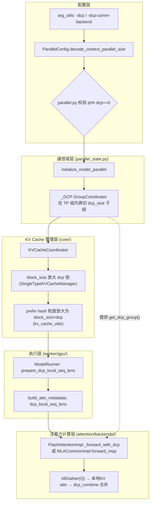
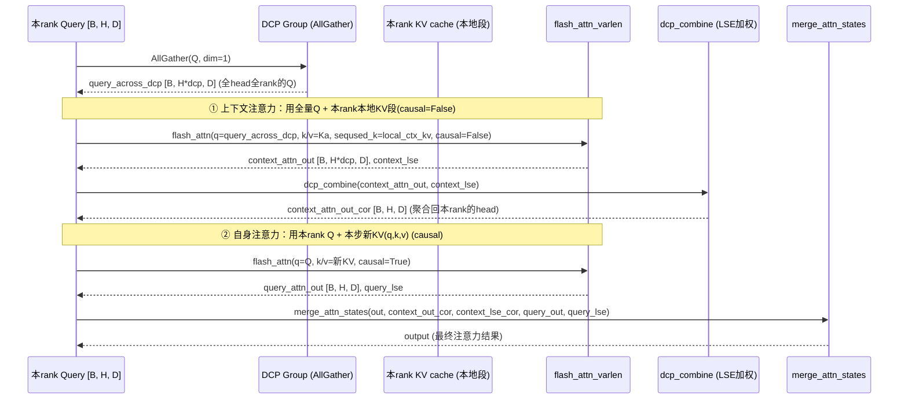
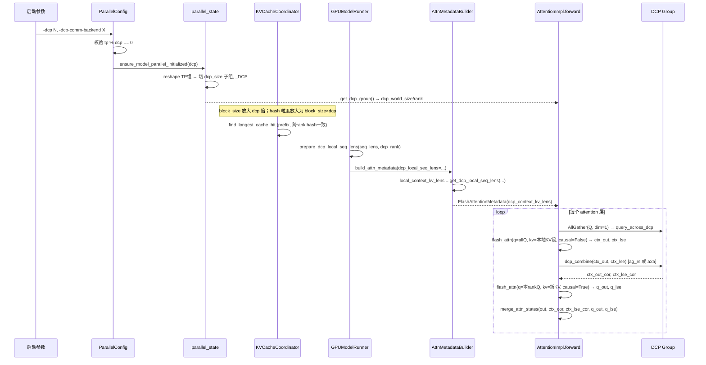

# vLLM Decode Context Parallel (DCP) 深度解剖

> 分析对象：vLLM v1 的 **Decode Context Parallel（DCP，解码上下文并行）**。
> 版本基线：本仓库 `comments-on-v0.25.1` 分支（近似 v0.25.x）。
> 关联文档：`.codebuddy/analysis/attn_group.md`（注意力组）、`vllm_async_scheduler.md`（异步调度）。

---

## 目录

- [0. 前置知识：设计思想与核心概念](#0-前置知识设计思想与核心概念)
- [1. 全景架构概览](#1-全景架构概览)
- [2. Layer 1：并行配置与通信域创建](#2-layer-1并行配置与通信域创建)
- [3. Layer 2：KV Cache 切分与 Prefix Caching 集成](#3-layer-2kv-cache-切分与-prefix-caching-集成)
- [4. Layer 3：Attention Backend 中的 DCP 集成](#4-layer-3attention-backend-中的-dcp-集成)
- [5. Layer 4：Model Forward 中的通信时机与结果聚合](#5-layer-4model-forward-中的通信时机与结果聚合)
- [6. Layer 5：MLA 路径的 DCP](#6-layer-5mla-路径的-dcp)
- [7. 完整调用链时序图](#7-完整调用链时序图)
- [8. 关键数据结构速查表](#8-关键数据结构速查表)
- [9. 快速问题解答（FAQ）](#9-快速问题解答faq)

---

## 0. 前置知识：设计思想与核心概念

### 0.1 为什么需要 DCP

长上下文推理有两个瓶颈，且 **prefill 阶段** 与 **decode 阶段** 的瓶颈不同：

- **Prefill**：compute-bound（大矩阵乘），需要切 **序列长度（seq）** 和加 GPU → 对应 **PCP（Prefill Context Parallel）**。
- **Decode**：memory-bandwidth-bound（每步只产 1 token，但要读整段 KV cache），KV cache 越大能并发的请求越少 → 需要切 **KV cache 序列维度** 来减少单卡 KV 占用 → 对应 **DCP（Decode Context Parallel）**。

vLLM 的 Context Parallel 因此拆成两个独立维度：**PCP 给 prefill 切 seq + 加 GPU；DCP 给 decode 切 KV seq + 复用 TP 的 GPU**。

> 直觉：TP 按 **head（注意力头）** 切，所有卡都持有**完整的 KV 序列**（于是 KV 被复制了 `tp_size / num_kv_heads` 份）。DCP 进一步按 **KV token 位置** 切，让同一 TP 组内的 `dcp_size` 张卡**各持有 KV 序列的一段**，从而消除 KV 复制。

### 0.2 DCP 的核心约束与收益

- **约束**：`tp_size % dcp_size == 0`（世界规模不变，只是把 TP 组再切成 `tp_size/dcp_size` 个 DCP 子组）。
- **收益**：KV cache 复制度从 `tp_size/num_kv_heads` 降到 `(tp_size/num_kv_heads)/dcp_size`。
  - 例：Qwen3-235B-A22B（`num_kv_heads=4`）用 `-tp 8` 时 KV 复制 2×；加 `-dcp 2` 即可消除复制；`-dcp 4` 则 KV 完全不复制（但通信开销变大）。
- **典型用法**：先尽量加大 `-tp` 到满意性能，再加 `-dcp` 减 KV 复制（`-dcp` 越大通信越多）。

### 0.3 两种通信策略

| 策略 | 含义 | 通信次数/层 | 默认 |
| --- | --- | --- | --- |
| `ag_rs` | **AllGather(Q) + ReduceScatter(Out)** | 3 次 NCCL | ✅ 默认 |
| `a2a` | **All-to-All** 交换部分输出+LSE，Triton 加权合并 | 1 次 A2A（打包） | 可选 |

`a2a` 来自 arXiv:2507.07120，把 partial output 和 LSE 打包进一个 A2A payload，减少 MLA 模型每层 NCCL 调用数（3→2）。要求 `dcp_size > 1`。

---

## 1. 全景架构概览

**图1：DCP 全景架构**



一句话职责：
- **配置层**：把 `-dcp` 变成 `ParallelConfig` 字段并校验整除。
- **通信域层**：在 TP 组内部创建 DCP 子通信组，**不新增 GPU**。
- **KV Cache 管理层**：把 block_size 放大 `dcp` 倍，使 KV 分片在 block 边界对齐，prefix hash 跨 rank 一致。
- **执行层**：每个 rank 按自己 `dcp_rank` 算出"本地 KV 段长"喂给 attention。
- **注意力计算层**：AllGather 全部 Q 头 → 每 rank 只用本地 KV 算 → LSE 加权合并出最终结果。

---

## 2. Layer 1：并行配置与通信域创建

### 2.1 配置入口与校验

`-dcp` / `-dcp-comm-backend` 经 `arg_utils.py` 落到 `ParallelConfig`（`config/parallel.py:339-357`）：

```python
# 339:357:vllm/config/parallel.py
    decode_context_parallel_size: int = Field(default=1, ge=1)
    """Number of decode context parallel groups, because the world size does
    not change by dcp, it simply reuse the GPUs of TP group, and tp_size
    needs to be divisible by dcp_size."""

    dcp_kv_cache_interleave_size: int = 1
    """Interleave size of kv_cache storage while using DCP. ..."""

    dcp_comm_backend: DCPCommBackend = "ag_rs"
    """Communication backend for Decode Context Parallel (DCP).
    - "ag_rs": AllGather + ReduceScatter (default, existing behavior)
    - "a2a": All-to-All exchange of partial outputs + LSE, then
      combine with Triton kernel. Reduces NCCL calls from 3 to 2
      per layer for MLA models.
    """
```

校验 `tp % dcp == 0`（`config/parallel.py:498-512`）：

```python
# 498:512:vllm/config/parallel.py
        # Note(hc): In the current implementation of decode context
        # parallel(DCP), tp_size needs to be divisible by dcp_size,
        # because the world size does not change by dcp, it simply
        # reuses the GPUs of TP group, and split one TP group into
        # tp_size//dcp_size DCP groups.
        if self.tensor_parallel_size % self.decode_context_parallel_size != 0:
            raise ValueError(
                f"tp_size={self.tensor_parallel_size} must be divisible by"
                f"dcp_size={self.decode_context_parallel_size}."
            )
        if self.dcp_comm_backend == "a2a" and self.decode_context_parallel_size <= 1:
            raise ValueError(
                "dcp_comm_backend='a2a' requires decode_context_parallel_size > 1."
            )
```

### 2.2 通信域创建（关键：在 TP 组内再切）

`gpu_worker.py` 调 `ensure_model_parallel_initialized(..., decode_context_parallel_size)`，最终进 `parallel_state.py:initialize_model_parallel`，在 `:1813-1833` 创建 `_DCP`：

```python
# 1813:1833:vllm/distributed/parallel_state.py
# Build the DCP model-parallel groups.
global _DCP
assert _DCP is None, "decode context model parallel group is already initialized"
# Note(hc): In the current implementation of decode context parallel,
# dcp_size must not exceed tp_size, because the world size does not
# change by DCP, it simply reuses the GPUs of TP group, and split one
# TP group into tp_size//dcp_size DCP groups.
# 【DCP 通信域 = TP 组的子组】
# - DCP 不新增任何 GPU，只是把一个 TP 组内连续的 dcp_size 张卡编成一个 DCP 子组
#   （组数 = tp_size / dcp_size，故要求 tp_size % dcp_size == 0）
# - all_ranks 的最内维本身就是 TP 维，reshape(-1, dcp_size) 相当于沿 TP 维再切一刀
# - 同一 DCP 组内的 rank 仍共享同一份 TP 权重分片，只是各持 KV 序列的一段
# - 访问器见 get_dcp_group()；attention impl 在 __new__ 里据此注入 dcp_world_size / dcp_rank
group_ranks = all_ranks.reshape(-1, decode_context_model_parallel_size).unbind(0)
group_ranks = [x.tolist() for x in group_ranks]
...
_DCP = init_model_parallel_group(
    group_ranks, get_world_group().local_rank, backend,
    use_message_queue_broadcaster=True, group_name="dcp",
)
```

> **关键结论（回答"创建了怎么样的通信域"）**：DCP 通信域 = **TP 组的子组**。`all_ranks.reshape(-1, dcp_size).unbind(0)` 把连续 `dcp_size` 张卡编为一个 DCP 组，组数 = `tp_size / dcp_size`。**世界规模不变**，只是复用 TP 的 GPU。访问器是 `get_dcp_group()`（`parallel_state.py:1376`）。

### 2.3 AttentionImpl 基类自动注入 DCP 成员

所有 attention impl 在 `__new__`（`attention/backend.py:834-860`）自动拿到 `dcp_world_size / dcp_rank / pcp_world_size` 等，并通过 `need_to_return_lse_for_decode` 确定是否需要返回 LSE：

```python
# 834:860:vllm/v1/attention/backend.py
    def __new__(cls, *args, **kwargs):
        self = super().__new__(cls)
        try:
            from vllm.distributed.parallel_state import get_dcp_group
            self.dcp_world_size = get_dcp_group().world_size
            self.dcp_rank = get_dcp_group().rank_in_group
        except AssertionError:
            self.dcp_world_size = 1
            self.dcp_rank = 0
        ...
        self.need_to_return_lse_for_decode = (
            self.dcp_world_size > 1 and self.can_return_lse_for_decode
        )
        return self
```

> 注意 `dcp_world_size > 1` 时 `need_to_return_lse_for_decode = True`——因为 DCP 跨 shard 合并需要 LSE 做 softmax 分母对齐（见 §5）。`cp_utils.py:check_attention_cp_compatibility` 会断言 backend 必须能返回 LSE，否则报错提示换 backend 或关 DCP。

---

## 3. Layer 2：KV Cache 切分与 Prefix Caching 集成

### 3.1 KV 怎么拆到不同 rank

**切分维度是 KV token 位置（round-robin / interleave）**，不是 head（head 由 TP 切）。每个 DCP rank 持有 KV 序列的 `1/dcp_size` 段（按 `cp_interleave` 交错）。

计算"本 rank 本地 KV 段长"的函数 `get_dcp_local_seq_lens`（`attention/backends/utils.py:885-922`）和 Triton kernel `prepare_dcp_local_seq_lens`（`worker/gpu/cp_utils.py:8-62`）：

```python
# 51:58:vllm/v1/worker/gpu/cp_utils.py
    # Distribute KV cache among different ranks, in a round-robin manner.
    # cp_interleave每次，一个rank一次放cp_interleave个kv，交错放
    # 【DCP 的 KV 切分规则】
    # - 按 token 位置 round-robin（而非按 head，head 由 TP 切）
    # - 每 dcp_size*cp_interleave 个 token 为一"轮"，轮内第 r 段(长 cp_interleave)归 rank r
    # - 本 kernel 只做一件事：不通信地从"全局 seq_len + 自己的 dcp_rank"推出本 rank
    #   实际持有多少个 KV token，供 attention 的 seqused_k 使用
    #   rounds：完整轮数，每轮本 rank 稳拿 cp_interleave 个
    rounds = seq_lens // (dcp_size * cp_interleave)
    #   remainder：最后一轮不足一整轮的尾巴，需要判断落在哪些 rank 上
    remainder = seq_lens % (dcp_size * cp_interleave)
    # 尾巴中属于本 rank 的部分 = clamp(remainder - dcp_rank*cp_interleave, 0, cp_interleave)
    # 即：尾巴没轮到本 rank → 0；正好横跨本 rank → 部分；已越过本 rank → 满 cp_interleave
    remainder = tl.maximum(remainder - dcp_rank * cp_interleave, 0)
    remainder = tl.minimum(remainder, cp_interleave)
    local_seq_lens = rounds * cp_interleave + remainder
    # 各 rank 的 local_seq_lens 求和恰好等于全局 seq_lens，且差值不超过 cp_interleave，
    # 所以 DCP 天然负载均衡，无需额外调度
```

> 关键：**各 rank 无需通信**，只从"全局 seq_len + 自己 dcp_rank"独立算出本地段长。所有 rank 喂进相同的全局 `seq_lens`，各自得到不同的 `dcp_local_seq_lens`，跨 rank 求和为完整长度（`model_runner.py:976-989`）。

### 3.2 Prefix Caching 怎么集成才能正常工作

这是用户最关心的问题。DCP 下 KV 被切到不同 rank，**prefix caching 仍能正常工作的原因**是：**把 block_size 放大 `dcp` 倍，使 KV 分片在 block 边界对齐，从而 block hash 跨 rank 一致**。

**a) block_size 放大**（`single_type_kv_cache_manager.py:143-146`）：

```python
# 143:146:vllm/v1/core/single_type_kv_cache_manager.py
        self.dcp_world_size = dcp_world_size
        self.pcp_world_size = pcp_world_size
        # 【DCP/PCP 与 prefix caching 的兼容关键】
        # - CP 下每张卡只持有 KV 序列的 1/(dcp*pcp)，物理 block 里存的 token 数不变，
        #   但它们对应的"逻辑 token 数"被放大了 dcp*pcp 倍
        # - 调度侧看到的 block_size 也放大同样倍数：一个逻辑 block = block_size*dcp*pcp
        #   个逻辑 token，恰好切成每 rank 一份 block_size 个真实 KV
        # - 收益：KV 分片天然在 block 边界对齐 → 所有 rank 共用同一张 block hash 表，
        #   前缀命中是整块命中且跨 rank 一致，无需任何跨 rank 的 hash 同步
        #   （参见 kv_cache_utils.resolve_kv_cache_block_sizes）
        if dcp_world_size * pcp_world_size > 1:
            self.block_size *= dcp_world_size * pcp_world_size
```

`UnitaryKVCacheCoordinator`（`kv_cache_coordinator.py:474-477`）和 `KVCacheCoordinator` 构造也都做同样的 `block_size *= dcp`。

**b) hash 粒度放大**（`kv_cache_utils.py:610-638`，`resolve_block_hash_block_size`）：

```python
# 610:638:vllm/v1/core/kv_cache_utils.py
    """Resolve (scheduler_block_size, hash_block_size).
    ... Single group: cache_config.block_size * dcp * pcp. ...
    """
    ...
    if len(groups) <= 1:  # Single group: block_size * dcp * pcp
        # 单组(纯 full attention，GQA 或 MLA)：调度粒度与 hash 粒度同时放大 dcp*pcp 倍，
        # 与 SingleTypeKVCacheManager 里的 block_size *= dcp*pcp 保持一致。
        # 这是 prefix caching 在 CP 下仍然正确的根本原因：每个被 hash 的逻辑 block
        # 覆盖 block_size*dcp*pcp 个 token，各 rank 恰好各持其中 block_size 个，
        # 于是同一个 block hash 在所有 rank 上指向同一段逻辑上下文。
        bs = cache_config.block_size * dcp * pcp
        return bs, bs

    # 多组(混合注意力：full + SWA / mamba 等)各组 block_size 不同，
    # 无法找到统一的放大倍数使各组分片都在 block 边界对齐，故禁止与 CP 同时开启。
    # 这也是当前版本 DCP 不支持 hybrid attention 的根源之一
    # （另一处硬约束在 kv_cache_coordinator.HybridKVCacheCoordinator 的 assert）。
    if dcp != 1 or pcp != 1:
        raise ValueError(
            "Hybrid KV cache groups with multiple block sizes do not "
            "support context parallelism (dcp_world_size/pcp_world_size > 1)."
        )
```

> **这就是 prefix caching 与 DCP 兼容的核心**：每个 prefix block 现在包含 `block_size*dcp` 个 token，而每个 DCP rank 恰好持有这些 token 在自己分片里的那一段。所有 rank 用**相同的 block hash 表**（`cached_block_hash_to_id`），命中时是整块命中，且各 rank 命中的是"自己那段 KV 对应的同一逻辑 block"。因此无需跨 rank 同步 hash，prefix 命中语义与普通 TP 完全一致——只是每个 rank 的 block 物理上只存了 `1/dcp` 的真实 KV。

**c) 调度侧视角**（`model_runner.py:430-434`）：`max_num_blocks` 按 `block_size * dcp_size` 计算，一个请求"匹配一个 block"需要 `block_size*dcp` 个 token 才计为命中，与 hash 粒度一致。

---

## 4. Layer 3：Attention Backend 中的 DCP 集成

### 4.1 集成方式：是"特化"而非"副本"

> 用户问"集成在 flash attn 还是 triton attn"——答案是：**两者都支持，且通过继承/特化现有 backend 实现，不是另写一份**。

DCP 以 **mixin + builder 字段** 的形式挂到各 backend 的 `AttentionMetadataBuilder` 上（见 `vllm-ascend` 文档："DCP is implemented as a specialization of the corresponding v1 attention backend rather than as a parallel copy of it: DCPMetadataBuilderMixin owns DCP group/rank discovery and access to the ..."）。

各 backend 在 builder 中：
1. 读 `get_dcp_group()` 拿 `dcp_world_size / dcp_rank`（`flash_attn.py:362-370`）。
2. 选定 `dcp_combine` 函数（`flash_attn.py:748-751`）：

```python
# 748:751:vllm/v1/attention/backends/flash_attn.py
            and vllm_config.parallel_config.decode_context_parallel_size > 1
            and vllm_config.parallel_config.dcp_comm_backend == "a2a"
        )
        # 【DCP 通信策略选择】在 impl 构造期一次性绑定跨 rank 聚合算子，
        # forward 里直接调 self.dcp_combine，避免每层每步再做分支判断：
        #   - cp_lse_ag_out_rs   (--dcp-comm-backend ag_rs，默认)：AllGather + ReduceScatter
        #   - dcp_a2a_lse_reduce (--dcp-comm-backend a2a)：out 与 LSE 打包成一次 all_to_all，
        #     Triton kernel 内完成 LSE 加权合并，MLA 模型每层 NCCL 调用 3 次降到 2 次
        self.dcp_combine = dcp_a2a_lse_reduce if dcp_a2a else cp_lse_ag_out_rs
```

即在 builder 初始化时就把"用 ag_rs 还是 a2a"绑定到 `self.dcp_combine`，forward 时直接调。

`CommonAttentionMetadata` 也新增了 DCP 字段（`attention/backend.py:437-439`）：

```python
# 437:439:vllm/v1/attention/backend.py
    dcp_local_seq_lens: torch.Tensor | None = None
    dcp_local_seq_lens_cpu: torch.Tensor | None = None
    """Sequence lengths of the local rank in decode context parallelism world"""
```

### 4.2 builder 中计算"本地上下文 KV 段长"

`FlashAttentionMetadataBuilder.build`（`flash_attn.py:530-550`）在 `dcp_world_size > 1` 时：

```python
# 530:550:vllm/v1/attention/backends/flash_attn.py
        if self.dcp_world_size > 1:
            # 【DCP metadata 构建】给 _forward_with_dcp 准备"本 rank 本地历史 KV 段长"。
            # 注意先剔除本步 query 对应的新 KV：新 KV 在 forward 里单独算(causal=True)，
            # 只有真正落进 paged cache 的历史部分才被 DCP 切分。
            query_lens = query_start_loc[1:] - query_start_loc[:-1]
            context_kv_lens = seq_lens - query_lens
            # 无通信地按 dcp_rank 切出本地段长（规则同 cp_utils 的 round-robin）
            local_context_kv_lens = get_dcp_local_seq_lens(
                context_kv_lens,
                self.dcp_world_size,
                self.dcp_rank,
                self.cp_kv_cache_interleave_size,
            )
            self._dcp_context_kv_lens[:num_reqs] = local_context_kv_lens
            ...
            # After DCP distribution, the maximum number of tokens for any rank is
            # ceil(L / (N * I)) * I, where L is max_seq_len, N is dcp_world_size,
            # and I is cp_kv_cache_interleave_size.
            # This eliminates GPU->CPU sync while minimizing workspace over-allocation.
            num_partitions = self.dcp_world_size * self.cp_kv_cache_interleave_size
            max_dcp_context_kv_len = (
                (max_seq_len + num_partitions - 1) // num_partitions
            ) * self.cp_kv_cache_interleave_size
```

这里 `context_kv_lens = seq_lens - query_lens`（即"历史 KV 长度"，不含本步新 query），再按 DCP 切成 `local_context_kv_lens`——attention kernel 只需要算"本 rank 持有的那段历史 KV"。

---

## 5. Layer 4：Model Forward 中的通信时机与结果聚合

### 5.1 新 KV 与上下文 KV 是否分开计算

**是分开计算的**，这是 DCP 的数学基础（Ring/Sequence-Parallel attention 的标准做法）。核心实现 `FlashAttentionImpl._forward_with_dcp`（`flash_attn.py:1052-1149`）：

**图2：DCP 单步 decode attention 数据流**



### 5.2 关键代码（通信时机 + 聚合）

**① AllGather Query**（`flash_attn.py:1073-1074`）——这是用户问的"query 怎么通信得到"：

```python
# 1073:1074:vllm/v1/attention/backends/flash_attn.py
        # 【通信点 1/2】AllGather Query：
        # TP 把 head 切开，本 rank 只有 num_heads 个 Q head；沿 dim=1(head 维)
        # all_gather 后得到 [n, num_heads*dcp_world_size, head_size]，
        # 即"整个 DCP 组的全部 Q head"。这样每张卡都能用全部 Q 去打自己那段本地 KV。
        query = query.contiguous()
        query_across_dcp = get_dcp_group().all_gather(query, dim=1)
```

> 每个 rank 只持有自己的 Q head 子集；AllGather 后每个 rank 都拿到**全部 DCP rank 的全部 Q head**，于是每个 rank 都能独立计算"所有 query 对本 rank 本地 KV 段"的注意力。

**② 上下文注意力（causal=False，只看本地 KV 段）**（`flash_attn.py:1085-1107`）：

```python
# 1085:1107:vllm/v1/attention/backends/flash_attn.py
        # ① 上下文注意力：全部 Q(query_across_dcp) × 本 rank 本地历史 KV 分片
        context_attn_out, context_lse = flash_attn_varlen_func(
            q=query_across_dcp,
            k=key_cache,
            v=value_cache,
            out=dcp_context_out,
            ...
            # 只喂"本 rank 持有的历史 KV 段长"（builder 里由 get_dcp_local_seq_lens
            # 从 seq_lens - query_lens 切出来），不含本步新 KV
            seqused_k=attn_metadata.dcp_context_kv_lens,   # 本rank本地KV段长
            max_seqlen_k=attn_metadata.max_dcp_context_kv_len,
            # causal=False：本地这段历史 KV 全都早于当前 query，无需再做因果 mask；
            # 因果性由 ② 中的新 KV 段负责。
            causal=False,                                  # 非因果：KV段内全可见
            # 必须返回 LSE(log-sum-exp)：它是各 rank partial softmax 的分母，
            # 跨 rank 合并与后续 merge_attn_states 都靠它做加权。
            return_softmax_lse=True,                        # 必须返回LSE用于合并
            ...
        )
```

**③ 跨 rank 聚合（ag_rs 或 a2a）**（`flash_attn.py:1109-1115`）：

```python
# 1109:1115:vllm/v1/attention/backends/flash_attn.py
        # FA returns LSE in shape [ H, B ] but DCP combine wants [ B, H ]
        # 【通信点 2/2】跨 rank 聚合上下文 partial 结果：
        # self.dcp_combine 在 builder 初始化时已按 --dcp-comm-backend 绑定：
        #   - "ag_rs" → cp_lse_ag_out_rs：AllGather(partial out + LSE) 后本地 LSE 加权归约
        #   - "a2a"   → dcp_a2a_lse_reduce：把 out 和 LSE 打包成一次 all_to_all，
        #                Triton kernel 内做 LSE 加权合并（MLA 每层 NCCL 3→2 次）
        # 输出 shape 从 [n, num_heads*dcp, D] 归约回本 rank 的 [n, num_heads, D]。
        context_attn_out_cor, context_lse_cor = self.dcp_combine(
            context_attn_out,
            context_lse.transpose(0, 1),
            get_dcp_group(),
            return_lse=True,
        )
        context_lse_cor = context_lse_cor.transpose(0, 1).contiguous()
```

- `ag_rs`（`cp_lse_ag_out_rs`）：AllGather 各 rank 的 partial output + LSE → 在本地按 LSE 加权求和（ReduceScatter 或直接本地 reduce）。数学上等价于"把所有 rank 的本地 KV 段拼成一个完整 KV 再算"——因为 softmax 的可分性，partial output 用 LSE 加权即可精确还原。
- `a2a`（`dcp_a2a_lse_reduce`，`attention/ops/dcp_alltoall.py:392-457`）：把 partial output 和 LSE **打包**进一个 buffer，一次 `dist.all_to_all_single`，然后在 Triton kernel `_dcp_a2a_unpack_combine_kernel` 里做 LSE 加权合并（见 §5.3）。

**④ 自身（新 KV）注意力 + 最终 merge**（`flash_attn.py:1120-1149`）：

```python
# 1120:1149:vllm/v1/attention/backends/flash_attn.py
        # ② 新 KV 段注意力：本 rank Q × 本步刚算出的 key/value（未切分，本地就有全量），
        # 因此这一步完全不需要通信。
        query_attn_out, query_lse = flash_attn_varlen_func(
            q=query, k=key, v=value,            # 本步新算出的KV
            ...
            # k 的 cu_seqlens 复用 q 的：新 KV 与 query 一一对应（同一批新 token）
            cu_seqlens_k=cu_seqlens_q,
            # 这一段才需要因果 mask（prefill chunk 内部 token 之间的先后关系）
            causal=attn_metadata.causal,        # 因果：只看到自己及之前
            return_softmax_lse=True,
            ...
        )
        assert context_attn_out_cor.shape == query_attn_out.shape
        assert context_lse_cor.shape == query_lse.shape
        # ③ 用两段各自的 LSE 做加权，把"历史 KV 部分"和"新 KV 部分"合并成完整注意力，
        # 结果与"把新 KV 写回上下文后一次性算完整序列"完全等价。
        merge_attn_states(                      # 用LSE把"上下文部分"和"新KV部分"合并
            output,
            context_attn_out_cor, context_lse_cor,
            query_attn_out, query_lse,
        )
```

> **回答"新 KV 和上下文 KV 是否分开计算"**：是的。DCP 把注意力拆成两部分：
> - **上下文部分**：全部 Q × 本 rank 本地 KV 历史段（causal=False），然后跨 rank 用 LSE 聚合 → 等价于"全部 Q 对完整 KV 历史"的注意力。
> - **新 KV 部分**：本 rank Q × 本步新生成的 KV（causal=True，普通因果注意力）。
> 最后 `merge_attn_states` 用 LSE 把这两部分拼成一个完整的注意力输出。

> **关于"attn 计算前不是会把新 KV 存进上下文统一算吗"的澄清**：常规（无 DCP）下确实如此——新 KV 先 `reshape_and_cache` 写进 paged KV cache，再和上下文一起算。但 **DCP 下是有意拆开**的：新 KV 只在"本 rank"产生，无需跨 rank 通信它，所以单独算（query_attn_out）更高效；上下文 KV 已分布在各 rank，只能"各自算本地段 + LSE 聚合"。两者用 merge 拼回完整结果。这是数学等价拆分，不是 bug。

### 5.3 a2a 合并的 Triton 实现

`_dcp_a2a_unpack_combine_kernel`（`dcp_alltoall.py:195-316`）对每个 (token, head) 遍历所有 rank 的 partial output，按 LSE 做 `softmax` 加权求和：

```python
# 277:316:vllm/v1/attention/ops/dcp_alltoall.py
    # 第一遍循环已用 max-shift 稳定地累出 sum(exp(lse_i - lse_max))，
    # 这里还原出全局 LSE，即"把所有 rank 的 KV 分片拼成完整序列后"的 softmax 分母。
    if IS_BASE_E:  # noqa: SIM108
        global_lse = tl.log(lse_sum) + lse_max
    else:
        global_lse = tl.log2(lse_sum) + lse_max

    # 第二遍循环：按 LSE 加权把各 rank 的 partial output 求和。
    # 数学依据：softmax 可分性——rank i 的输出已经用自己的局部分母 exp(lse_i) 归一化过，
    # 乘以 exp(lse_i - global_lse) 即把分母换成全局分母，逐 rank 相加就精确等于
    # 在完整 KV 序列上做的一次注意力。这里 base(e / 2) 必须与 backend 的
    # AttentionImplBase.lse_base_on_e 一致，否则会静默算错。
    acc = tl.zeros([HEAD_DIM], dtype=tl.float32)
    for rank_idx in tl.static_range(N):
        ...
        if IS_BASE_E:   # base e：weight = exp(lse_val - global_lse)
            weight = tl.exp(lse_val - global_lse)
        ...
        # 用全局 LSE 归一化的权重，把本 rank 的 partial output 累加进最终结果
        acc += (tl.load(recv_ptr + recv_base + d_offsets*recv_stride_D).to(tl.float32) * weight)
    ...
    tl.store(out_ptr + final_offsets, acc)
```

这就是为什么 `AttentionImplBase.lse_base_on_e`（`backend.py:803`）必须正确——base e 还是 base 2 搞错会静默破坏跨 shard 的 softmax 分母。

---

## 6. Layer 5：MLA 路径的 DCP

MLA（如 DeepSeek）同样支持 DCP，且**所有 MLA backend 共享 `MLACommonImpl` 基类的 forward 逻辑**：

- **builder 层**：`FlashMLAMetadataBuilder.build`（`flashmla.py:174-177`）在 `dcp_world_size > 1` 时 `num_q_heads *= dcp_world_size`，即把 query head 维度放大以容纳 AllGather 后的全部 Q head。
- **forward 层**：`TritonMLAImpl` 等通过 `dcp_world_size` 调整 workspace 预留（`triton_mla.py:69-70`：`q_num_heads = self.num_heads * self.dcp_world_size`）。
- **稀疏索引（DeepSeek V4）**：`indexer.py` 在 DCP 下也用 `get_dcp_local_seq_lens` 算本地 KV 段（`indexer.py:388-393`、`:794-799`），且**限制 `cp_kv_cache_interleave_size==1` 和 `compress_ratio==1`**（`:261-265`、`:360-364`），即稀疏索引 + 大 interleave 暂不支持 DCP。

MLA 的"上下文部分 / 新 KV 部分"拆分与 GQA 同构，只是 KV 维度是 `kv_lora_rank` 而非 `num_kv_heads*head_dim`，底层由 `MLACommonImpl` 统一处理 LSE 加权 merge。

---

## 7. 完整调用链时序图

**图3：DCP 端到端（从配置到 attention 输出）**



---

## 8. 关键数据结构速查表

| 数据结构 / 字段 | 位置 | 作用 |
| --- | --- | --- |
| `_DCP: GroupCoordinator` | `parallel_state.py:1373` | DCP 通信域（TP 组内子组） |
| `get_dcp_group()` | `parallel_state.py:1376` | 取 DCP 组 |
| `decode_context_parallel_size` | `config/parallel.py:339` | DCP 大小配置 |
| `dcp_comm_backend: "ag_rs"\|"a2a"` | `config/parallel.py:351` | 通信策略 |
| `AttentionImplBase.dcp_world_size/rank` | `attention/backend.py:825-826` | impl 自动注入 |
| `AttentionImplBase.need_to_return_lse_for_decode` | `attention/backend.py:857` | DCP>1 时为 True |
| `CommonAttentionMetadata.dcp_local_seq_lens` | `attention/backend.py:437` | 本 rank 本地 KV 段长 |
| `get_dcp_local_seq_lens()` | `attention/backends/utils.py:885` | 计算分片长度（无通信） |
| `_dcp_local_seq_lens_kernel` | `worker/gpu/cp_utils.py:36` | Triton 版分片计算 |
| `SingleTypeKVCacheManager.block_size *= dcp` | `single_type_kv_cache_manager.py:145` | KV 分片 block 对齐 |
| `resolve_block_hash_block_size → block_size*dcp*pcp` | `kv_cache_utils.py:631` | prefix hash 粒度 |
| `FlashAttentionImpl.dcp_combine` | `flash_attn.py:751` | `cp_lse_ag_out_rs` 或 `dcp_a2a_lse_reduce` |
| `cp_lse_ag_out_rs` | `attention/ops/common.py` | ag_rs 合并算子 |
| `dcp_a2a_lse_reduce` | `attention/ops/dcp_alltoall.py:392` | a2a 合并算子 |
| `merge_attn_states` | `attention/ops/merge_attn_states.py` | 上下文部分 + 新KV部分 合并 |

---

## 9. 快速问题解答（FAQ）

**Q1：DCP 应用于什么场景？**
A：长上下文 decode 阶段，KV cache 成为内存瓶颈、限制并发数时。典型：`tp` 已拉满但 KV 仍复制严重（如 `tp/num_kv_heads > 1`），加 `-dcp` 削减 KV 复制。prefill 阶段对应的是 PCP（切 seq），不是 DCP。

**Q2：DCP 创建了怎样的通信域？是在 TP 内进一步创建的吗？**
A：是的。**世界规模不变**，DCP 通信域是 **TP 组的子组**：把连续 `dcp_size` 张卡编为一个 DCP 组，组数 = `tp_size/dcp_size`（`parallel_state.py:1820` 的 `reshape(-1, dcp_size).unbind(0)`）。所有 DCP rank 仍属于同一个 TP 组（共享同一份 weights 分片），只是额外建立一个子通信组用于交换 Q/KV 分片。

**Q3：KV cache 怎么拆分在不同 rank？**
A：按 **KV token 位置**（round-robin / interleave），不是 head（head 由 TP 切）。每 rank 持 `1/dcp_size` 段，用 `get_dcp_local_seq_lens` 按 `dcp_rank` 算出本地段长，**无需通信**。

**Q4：DCP 只用于 decode 阶段吗？**
A：本功能（DCP）专为 **decode** 设计。长序列的 prefill 用 PCP。两者是 Context Parallel 的两个独立维度，可分别配置 `decode_context_parallel_size` 与 `prefill_context_parallel_size`。

**Q5：只用于 GQA 和 MLA 吗？只用于一种注意力架构吗？不支持混合注意力架构吗？**
A：
- **GQA 和 MLA 都支持**（FlashAttention backend、各 MLA backend 都接了 DCP）。
- **单组注意力架构**（纯 full attention，GQA 或 MLA 任一）完全支持。
- **混合注意力架构（hybrid, 如 Mamba+Full、Full+SWA）**：**当前代码版本（v0.25.1 分支）的 core 层 `HybridKVCacheCoordinator` 仍 `assert dcp_world_size == 1`（`kv_cache_coordinator.py:565`）**——即真正在用的 KV cache 管理层**尚未支持**混合注意力的 DCP。sliding window / chunked local / mamba / cross-attention 的 manager 也都 `assert dcp_world_size == 1`（`single_type_kv_cache_manager.py:766, 1026, 1147, 1148`）。社区后续 PR（如 #40996 "hybrid attention support"）在更高版本推进了部分支持，但本基线以 core 层 assert 为准。
- Sparse MLA（DeepSeek V4 索引）支持 DCP，但限制 `cp_kv_cache_interleave_size==1` 且 `compress_ratio==1`（`indexer.py:261, 360`）。

**Q6：model fwd 时新 KV 和上下文 KV 是分开计算的吗？**
A：**是**（见 §5.1/§5.2）。注意力拆成两部分：① 全部 Q × 本 rank 本地 KV 历史段（causal=False）→ 跨 rank LSE 聚合；② 本 rank Q × 本步新 KV（causal=True）。最后 `merge_attn_states` 合并。这是数学等价的拆分，不是把新 KV 先写回上下文再统一算（那样反而要跨 rank 通信新 KV）。

**Q7：query 怎么通信得到？什么时候通信？什么时候计算？结果怎么聚合？有几种通信策略？**
A：
- **query 通信**：`_forward_with_dcp` 第一步 `get_dcp_group().all_gather(query, dim=1)`（`flash_attn.py:1074`），每个 rank 拿到全部 DCP rank 的全部 Q head。
- **什么时候通信**：每层的 attention forward 开始时先 AllGather Q；算完本地上下文注意力后，再 `dcp_combine` 做一次跨 rank 通信（ag_rs 或 a2a）。
- **什么时候计算**：AllGather 后立即用本地 KV 段算上下文注意力（causal=False）；同时/之后算新 KV 自身注意力（causal=True）。
- **结果聚合**：用 **LSE 加权**（softmax 可分性）把各 rank 的 partial output 精确合并。数学上等于"全部 Q 对完整 KV"的注意力。
- **通信策略两种**：`ag_rs`（AllGather Q + ReduceScatter/本地 reduce 输出，默认 3 次 NCCL）和 `a2a`（一次 All-to-All 打包输出+LSE，Triton 加权合并，MLA 下 3→2 次 NCCL）。

**Q8：DCP 是怎么解耦/集成的？集成在 flash attn 还是 triton attn？**
A：DCP 是作为**对应 v1 attention backend 的特化（specialization）**集成的，不是另写一份副本（DCPMetadataBuilderMixin 模式）。具体：
- **FlashAttention backend**（`flash_attn.py`）：builder 读 DCP 组、选 `dcp_combine`，forward 走 `_forward_with_dcp`。
- **Triton MLA / FlashMLA / 其他 MLA backend**：在 builder 把 `num_q_heads *= dcp_world_size`，forward 由 `MLACommonImpl` 基类统一处理，同样走 AllGather Q + 本地 KV + LSE 合并。
- 因此 **flash attn 和 triton attn（MLA）都支持 DCP**，区别在于各自 backend 内特化，而非某个独立模块。配置开关是 `--dcp` / `--dcp-comm-backend`。

**Q9：DCP 下怎么考虑 KV 负载均衡？**
A：因为 decode 阶段**每个请求的 KV 对所有 DCP rank 都是可见的上下文**（round-robin 均匀切分），且 `get_dcp_local_seq_lens` 按 `seq_len` 均匀分片，所以**负载天然均衡**——不需要额外调度。注意这与 TP 不同：TP 下每 rank 持有完整 KV（复制），而 DCP 下每 rank 只持一段，但所有 rank 都参与每个请求的注意力计算（通过 AllGather Q + 本地 KV 段），所以计算量均匀分布。prefix caching 命中也是跨 rank 一致的整块命中，不破坏均衡。

---

## 附：本报告与源码的对照索引

> 本报告中所有 ```` ```起始行号:结束行号:文件路径 ```` 形式的代码块，都是从对应源码文件**原样截取**并补了行间中文注释的。读文档时遇到不理解的代码，直接按文件+行号去源码定位即可（行号为 `comments-on-v0.25.1` 分支当前基线）。

源码位置 → 本报告章节对照：

| 源码位置 | 报告章节 | 关键内容 |
| --- | --- | --- |
| `config/parallel.py:339-357` | §2.1 | `decode_context_parallel_size` / `dcp_comm_backend` 配置字段 |
| `config/parallel.py:498-512` | §2.1 | `tp % dcp == 0` 校验 |
| `parallel_state.py:1813-1833` | §2.2 | DCP 通信域 = TP 组内子组（`reshape(-1, dcp_size).unbind(0)`） |
| `attention/backend.py:834-860` | §2.3 | `AttentionImplBase.__new__` 自动注入 `dcp_world_size/rank` |
| `worker/gpu/cp_utils.py:51-58` | §3.1 | KV 按 token 位置 round-robin 切分，无通信算本地段长 |
| `single_type_kv_cache_manager.py:143-146` | §3.2 | `block_size *= dcp`：KV 分片在 block 边界对齐 |
| `kv_cache_utils.py:610-638` | §3.2 | hash 粒度放大 `block_size*dcp*pcp`，保证 prefix hash 跨 rank 一致 |
| `flash_attn.py:748-751` | §4.1 | `dcp_combine` 绑定（ag_rs / a2a） |
| `flash_attn.py:530-550` | §4.2 | builder 计算"本 rank 本地上下文 KV 段长" |
| `flash_attn.py:1073-1149` | §5.2 | `_forward_with_dcp`：AllGather Q → 上下文注意力(causal=False) → dcp_combine → 新KV注意力(causal=True) → merge |
| `dcp_alltoall.py:277-316` | §5.3 | a2a 的 LSE 加权合并 Triton kernel |
