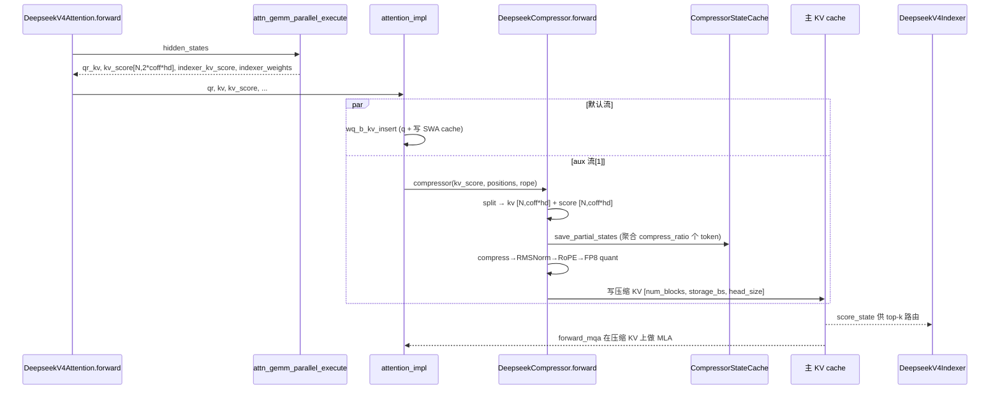

# DeepSeek-V4 Compressor 深度解剖（v0.25.1）

> 基于 `comments-on-v0.25.1` 分支源码（2026-08-06 快照）
> 调研范围：`vllm/models/deepseek_v4/compressor.py`、`attention.py`、`common/ops/fused_compress_quant_cache.py`、`nvidia/ops/sparse_attn_compress_cutedsl.py`、`vllm/v1/kv_cache_interface.py`
> 关联文档：`.codebuddy/analysis/`（KV offloading、attention 等前置阅读）
> 核心结论：compressor 是 DeepSeek-V4「混合注意力（Hybrid Attention）」的 KV 压缩枢纽，把每 `compress_ratio` 个 token 的 KV 压缩成 1 个「压缩 KV 块」，写入独立的 compressor KV cache，供后续 MLA 注意力（CSA/HCA）消费。

---

## 目录

- [0. 前置知识：为什么需要 Compressor](#0-前置知识为什么需要-compressor)
- [1. 全景架构概览](#1-全景架构概览)
- [2. Compressor 在模型中的位置与创建](#2-compressor-在模型中的位置与创建)
- [3. DeepseekCompressor 类字段与维度推导](#3-deepseekcompressor-类字段与维度推导)
- [4. CompressorStateCache：压缩状态的物理存储](#4-compressorstatecache压缩状态的物理存储)
- [5. forward：compress → norm → RoPE → store 全流程](#5-forwardcompress--norm--rope--store-全流程)
- [6. 完整调用链时序图](#6-完整调用链时序图)
- [7. 关键数据结构速查表](#7-关键数据结构速查表)
- [8. 与 attention / indexer 的交互接口](#8-与-attention--indexer-的交互接口)
- [9. 量化布局与对齐（576/584/656）](#9-量化布局与对齐576584656)
- [10. 快速问题解答（FAQ）](#10-快速问题解答faq)

---

## 0. 前置知识：为什么需要 Compressor

### 0.1 DeepSeek-V4 的混合注意力（Hybrid Attention）

根据社区资料（CSDN/知乎/腾讯云对 V4 技术报告的解读），V4 不再用单一 MLA，而是**双轴记忆**：

- **HCA（Heavily Compressed Attention，重度压缩注意力）**：每 128 个 token 强力压缩成 1 个全局模糊上下文（`compress_ratio=128`）。
- **CSA（Compressed Sparse Attention，压缩稀疏注意力）**：每 4 个 token 压缩成 1 个压缩条目（`compress_ratio=4`），再用「闪电索引器（Lightning Indexer）」精准召回几千 token 外的关键局部块。
- 两者都建立在 **MLA 低秩 KV 压缩** 之上，并配合超大 `head_dim=512` 与滑动窗口注意力（SWA）。

**Compressor 就是实现「每 N 个 token → 1 个压缩 KV 条目」的物理模块。**

### 0.2 核心设计思想

| 设计点 | 机制 | 收益 |
|--------|------|------|
| KV 压缩 | 每 `compress_ratio` 个 token 算一次「压缩 KV + score」，写入独立 cache | KV cache 体积 ÷ compress_ratio，长上下文显存爆降 |
| 双状态 | `kv_state`（压缩 KV）+ `score_state`（路由打分）并存 | score 让 indexer 能按相关性召回压缩块，不必全扫 |
| 重叠 token（overlap） | C4 时 `coff=2`，压缩窗口含 1 个重叠 token | 边界平滑，避免压缩块间信息断裂 |
| 融合 kernel | compress→RMSNorm→RoPE→FP8 quant→cache write 一次完成 | 减少显存读写，适配 FlashMLA packed 布局 |

### 0.3 演进

- V3.2：引入 DSA（动态稀疏注意力）+ 主 MLA（`head_size=576`，656B 布局）。
- V4：HCA(128×) + CSA(4×) 双轴，compressor 成为每层标配（`compress_ratio>1` 的层都有），indexer 仅 C4A 层有。

---

## 1. 全景架构概览

**图1：DeepSeek-V4 Compressor 在混合注意力中的位置**

```mermaid
graph TD
    subgraph "输入"
        H[hidden_states [N, hidden_size]]
    end
    subgraph "DeepseekV4Attention.forward"
        GEMM[attn_gemm_parallel_execute<br/>并行投影]
        GEMM -->|kv_score [N,2*coff*head_dim]| COMP[compressor.forward]
        GEMM -->|qr,kv| QINS[_fused_qnorm_rope_kv_insert<br/>写 SWA cache]
    end
    subgraph "DeepseekCompressor"
        COMP --> SPLIT[kv_score split → kv + score]
        SPLIT --> SPS[save_partial_states<br/>写 state_cache]
        SPS --> CNS[compress_norm_rope_store<br/>压缩→norm→RoPE→量化→写 KV cache]
    end
    subgraph "缓存"
        SC[(CompressorStateCache<br/>[num_blocks, block_size, state_dim])]
        KC[(主 KV cache / fp8_ds_mla<br/>[num_blocks, storage_block_size, head_size])]
    end
    COMP -. 读 .-> SC
    COMP -. 写 .-> KC
    subgraph "消费端"
        IDX[DeepseekV4Indexer<br/>用 score 做 top-k 路由]
        MQA[forward_mqa<br/>在压缩 KV 上做 MLA 注意力]
    end
    KC --> IDX
    KC --> MQA
```

一句话：compressor 把 `kv_score`（来自输入投影）**压缩并落盘**到两块 cache（state_cache 存中间状态、主 KV cache 存最终压缩 KV），供 indexer 路由与 MLA 注意力消费。

---

## 2. Compressor 在模型中的位置与创建

### 2.1 创建时机

`DeepseekV4Attention.__init__`（`attention.py`）中：

```330:340:vllm/models/deepseek_v4/attention.py
        # 仅 compress_ratio > 1 的层才建 compressor（SWA-only 层 compress_ratio==1 不建）
        self.compressor = None
        if self.compress_ratio > 1:
            self.compressor = DeepseekCompressor(
                vllm_config=vllm_config,
                compress_ratio=self.compress_ratio,   # 来自 config.compress_ratios[layer_id]
                hidden_size=self.hidden_size,
                head_dim=self.head_dim,               # 512（主 MLA）或 128（indexer 路径）
                rotate=True,
                prefix=f"{prefix}.compressor",
                k_cache_prefix=self.prefix,           # 指向主 KV cache
            )
```

- `compress_ratio` 由 `config.compress_ratios[layer_id]` 决定（L187-190），每层可不同：4（CSA）、128（HCA）、1（SWA-only，无 compressor）。
- `k_cache_prefix=self.prefix`：compressor 写的主 KV cache 就是 attention 层自己的 KV cache（共享物理张量）。

### 2.2 调用时机

在 `attention_impl`（`attention.py`）中，与 `wq_b_kv_insert`、indexer 并行：

```538:538:vllm/models/deepseek_v4/attention.py
                lambda: compressor(kv_score, positions, self.rotary_emb),
```

`kv_score` 来自 `attn_gemm_parallel_execute` 的 `compressor_kv_score`（形状 `[N, 2*coff*head_dim]`）。

---

## 3. DeepseekCompressor 类字段与维度推导

类定义：`compressor.py` **第 174–269 行**（`__init__`）。

| 字段 | 行号 | 来源/值 | 含义与维度推导 |
|------|------|---------|----------------|
| `compress_ratio` | 197 | `config.compress_ratios[layer_id]` | 压缩比：**4**（C4A 稀疏）或 **128**（HCA 主线）；MTP 层=1 |
| `head_dim` | 199 | `config.head_dim` | KV 头维度：**512**（主 MLA）或 **128**（indexer 路径），决定走哪条 kernel |
| `rope_head_dim` | 206 | `config.qk_rope_head_dim` | RoPE 维，典型 **64** |
| `nope_head_dim` | 207 | `head_dim - rope_head_dim` | 非 RoPE 维：512→**448**，128→**64** |
| `overlap` | 213 | `compress_ratio == 4` | C4A 时为 `True` |
| `coff` | 214 | `1 + overlap` | C4A→**2**（含 1 个重叠 token），否则→**1** |
| `state_dim` | 238 | `2 * coff * head_dim` | state_cache 宽度 = `kv_state(coff*head_dim)` + `score_state(coff*head_dim)` |
| `sliding_window` | 139 | `coff * compress_ratio` | C4→**8**，C128→**128**（state 的滑动窗口大小） |
| `_quant_block` | 250-265 | head_dim 分支 | fp8 量化的 block 大小：head_dim=512→64，head_dim=128→128 |
| `_token_stride` | 254-264 | head_dim 分支 | 每 token 的 KV 字节步长：512→`448+64*2=576`，128→`128` |
| `_scale_dim` | 256-265 | head_dim 分支 | scale 维：512→`448//64+1=8`，128→`4`（单 fp32 scale） |
| `ape` | 217-224 | `(compress_ratio, coff*head_dim)` fp32 | 每压缩窗口的 APE（绝对位置偏置）参数 |

### 数值实例

**C4A 路径（compress_ratio=4, head_dim=512）**：
- `coff=2`, `state_dim = 2*2*512 = 2048`
- `sliding_window = 2*4 = 8`
- `_token_stride = 576`（每 token 压缩 KV 字节数，见 §9）

**C128 路径（compress_ratio=128, head_dim=512）**：
- `coff=1`, `state_dim = 2*1*512 = 1024`
- `sliding_window = 1*128 = 128`

**Indexer 路径（head_dim=128, compress_ratio=4）**：
- `coff=2`, `state_dim = 2*2*128 = 512`
- `_token_stride = 128`, `_scale_dim = 4`（见 L830 `132 = 128 fp8 + 4 scale`）

---

## 4. CompressorStateCache：压缩状态的物理存储

`CompressorStateCache`（`compressor.py` 第 118–171 行）是 compressor 的**中间状态缓存**，也是 `AttentionLayerBase`（拥有自己的 KV cache 与 metadata builder）。

### 4.1 block_size 推导（L143-152）

```143:152:vllm/models/deepseek_v4/compressor.py
        # The KV block shape [256//4, head_dim] = [64, 584] determines:
        # - C4 compressor block shape [4, 2*512*2*4] -> block_size = 4
        # - C128 compressor block shape [8, 512*2*4] -> block_size = 8
        if compress_ratio == 4:
            self.block_size = 4
        elif compress_ratio == 128:
            self.block_size = 8
```

关键：**compressor state 与主 KV block 共享同一物理张量**，page size 必须一致。主 KV block 形状 `[storage_block_size, head_dim]`，而 storage_block_size = `block_size // compress_ratio`（见 `kv_cache_interface.py` L407）。C4 时主 KV `storage_block_size = 64`，state block_size = 4（每 state block 含 4 个压缩条目，覆盖 4*4=16 原始 token）。

### 4.2 形状与布局

- `state_cache.kv_cache` 形状：`[num_blocks, block_size, state_dim]`，其中 `state_dim = 2*coff*head_dim`。
- 前半 `state_dim//2` 存 `kv_state`，后半存 `score_state`（L299-302）。
- `get_kv_cache_spec` 返回 `SlidingWindowMLASpec`（L154-166）：
  - `num_kv_heads=1`（压缩 KV 只有 1 个「头」向量）
  - `head_size=self.state_dim`
  - `alignment=576`（fp8_ds_mla）或 `512`（普通）
  - `sliding_window=self.sliding_window`

---

## 5. forward：compress → norm → RoPE → store 全流程

`DeepseekCompressor.forward`（`compressor.py` 第 271–396 行）。

### 5.1 输入

```271:278:vllm/models/deepseek_v4/compressor.py
    def forward(
        self,
        # [num_tokens, 2 * self.coff * self.head_dim]
        kv_score: torch.Tensor,
        # [num_tokens]
        positions: torch.Tensor,
        rotary_emb,
    ) -> None:
```

`kv_score` 形状 `[N, 2*coff*head_dim]`：由 attention 层的 `compressor_kv_score` GEMM 产出（输入 `hidden_states`，权重 `fused_wkv_wgate`）。

### 5.2 步骤分解

**① split 成 kv 与 score**（L281-283）

```281:283:vllm/models/deepseek_v4/compressor.py
        kv, score = kv_score.split(
            [self.coff * self.head_dim, self.coff * self.head_dim], dim=-1
        )
```

- `kv`: `[N, coff*head_dim]` —— 待压缩的 KV 表示
- `score`: `[N, coff*head_dim]` —— 路由打分（供 indexer 召回）

**② save_partial_states：写中间 state**（L315-326）

`save_partial_states(kv, score, ape, positions, state_cache, slot_mapping, ...)` 把 `[kv, score+ape]` 写入 `state_cache`，按 `compress_ratio` 把连续 token 聚合成压缩条目（注释 L309-314 说明 PDL 被禁用以避免读写竞态）。

**③ compress_norm_rope_store：融合压缩 kernel**（L372-396）

调用 `compress_norm_rope_store_cutedsl`（CUDA + head_dim=512）或 `compress_norm_rope_store_triton`（其余），一次性完成：

- **compress**：把 `state_cache` 中每 `compress_ratio` 个 token 的 state 聚合成 1 个压缩 KV 条目
- **RMSNorm**：用 `self.norm.weight` 归一（L390）
- **RoPE**：GPT-J 风格（`is_neox_style=False`），作用于 `head_dim` 末尾 `rope_head_dim` 个元素，位置用 `(positions // compress_ratio) * compress_ratio`（L329-334）
- **FP8 quant + cache write**：按 `head_dim` / `cache_dtype` 走不同路径写入主 KV cache（L340-348）

### 5.3 路径分支（L342-370）

| 条件 | kernel | cache 布局 |
|------|--------|-----------|
| CUDA + head_dim==512 | `compress_norm_rope_store_cutedsl` | fp8_ds_mla（UE8M0 uint8）或 plain bf16/fp8 full-cache |
| 其余（head_dim==128 indexer / AMD / XPU） | `compress_norm_rope_store_triton` | 同左 |

`store_full_kv = head_dim==512 and cache.dtype != uint8`（L342）：head_dim=512 且非 fp8_ds_mla 时走「full-cache」（不压缩成 single vector，存完整 KV 行）。

---

## 6. 完整调用链时序图

**图2：Compressor 在一次前向中的调用链**



---

## 7. 关键数据结构速查表

| 数据结构 | 关键字段 | 形状 | 作用 |
|---------|---------|------|------|
| `DeepseekCompressor` | compress_ratio, head_dim, coff, state_dim, sliding_window | — | KV 压缩枢纽 |
| `CompressorStateCache` | kv_cache, block_size, state_dim | `[num_blocks, block_size, 2*coff*head_dim]` | 中间 state（kv+score）缓存 |
| `CompressorMetadata` | block_table, slot_mapping, block_size, token_to_req_indices | — | 压缩 state 的寻址元数据 |
| `kv_score`（输入） | — | `[N, 2*coff*head_dim]` | compressor 原料（kv+score 拼接） |
| 主 KV cache（输出） | — | `[num_blocks, storage_block_size, head_size]` | 最终压缩 KV（storage_block_size = block_size//compress_ratio） |

---

## 8. 与 attention / indexer 的交互接口

### 8.1 谁创建
- **attention 层创建**（`attention.py` L331-340）：`self.compressor = DeepseekCompressor(...)`，仅 `compress_ratio > 1` 的层。

### 8.2 谁调用、传什么
- **attention_impl 调用**（`attention.py` L538）：`compressor(kv_score, positions, self.rotary_emb)`
  - `kv_score`: `[N, 2*coff*head_dim]`（来自 `attn_gemm_parallel_execute` 的 `compressor_kv_score`）
  - `positions`: `[N]`（int64）
  - `rotary_emb`: 旋转位置编码（GPT-J 风格）

### 8.3 indexer 复用 compressor
- `DeepseekV4Indexer` 内部持有 `self.compressor`（`attention.py` L819, 839），indexer 的 `forward` 把 `indexer_kv_score` 喂给 `indexer.compressor` 做同样的压缩→写 KV cache（见前文 indexer 剖析）。即 **indexer 不自己压缩，复用 compressor 的压缩逻辑**。

### 8.4 输出去哪
- 压缩 KV 写入**主 KV cache**（`k_cache_prefix` 指向 attention 层的 KV cache）。
- `score_state` 供 **indexer 做 top-k 路由**（Lightning Indexer 召回相关压缩块）。
- 最终 MLA 注意力（`forward_mqa`）在压缩 KV 上计算。

---

## 9. 量化布局与对齐（576/584/656）

`compressor.py` L143-165 与 `kv_cache_interface.py` L411-419 共同定义：

| 数值 | 含义 | 出处 |
|------|------|------|
| **584 B/token** | V4 fp8_ds_mla **实际单 token KV 字节** = 448B NoPE + 128B RoPE + 8B fp8 scale | `kv_cache_interface.py` L413 |
| **576** | fp8_ds_mla 的 `alignment`（分配对齐边界，64B 对齐的 round 值）；也是 V3.2 语义 `head_size=576`（512+64） | `attention.py` L719, `kv_cache_interface.py` L418 |
| **656 B/token** | V3.2 主 MLA fp8_ds_mla 实际布局（kv_lora_rank=512 + qk_rope_head_dim=64 → head_size=576，加 scale 后 656） | `kv_cache_interface.py` L417-419 |

`CompressorStateCache.get_kv_cache_spec`（L154-166）用 `alignment=576`（fp8_ds_mla）或 `512`（普通），是因为 state 与主 KV 共享物理页，必须按同一对齐。

Indexer 路径（head_dim=128）的 `132 = 128 fp8 + 4 fp32 scale`（L830），因 `quant_block_size=128 == head_dim`，每 head 单独 1 个 scale。

---

## 10. 快速问题解答（FAQ）

**Q1：compressor 和主 MLA 注意力是什么关系？**
A：compressor 是「前置压缩器」。它把连续 `compress_ratio` 个 token 的 KV 压成 1 个条目写入主 KV cache；MLA 注意力（`forward_mqa`）在这个**已压缩**的 KV 上做计算，复杂度从 O(N²) 降到 O(N²/compress_ratio)。

**Q2：为什么 C4 有 overlap（coff=2）而 C128 没有（coff=1）？**
A：C4 压缩比小、块多，重叠 1 个 token 能让相邻压缩块边界平滑；C128 压缩比极大，单块已覆盖很长上下文，无需重叠。

**Q3：state_cache 和主 KV cache 为什么要共享物理张量？**
A：注释 L140-145 明确——两者 page size 必须一致才能共用 block 分配器，避免双套分页导致的碎片与不匹配。

**Q4：fp8_ds_mla 的 584 和 alignment 576 为什么不一样？**
A：584 是真实落盘字节（含 scale），576 是分配器对齐边界（64B 对齐的 round 值），FlashMLA packed kernel 要求按 576 对齐寻址。

**Q5：indexer 的 compressor 和 attention 的 compressor 是同一个吗？**
A：不是同一个实例，但 `DeepseekV4Indexer` 内部持有自己的 `self.compressor`（`DeepseekCompressor`），复用同一套压缩逻辑与权重结构，分别写 indexer cache 与主 KV cache。
