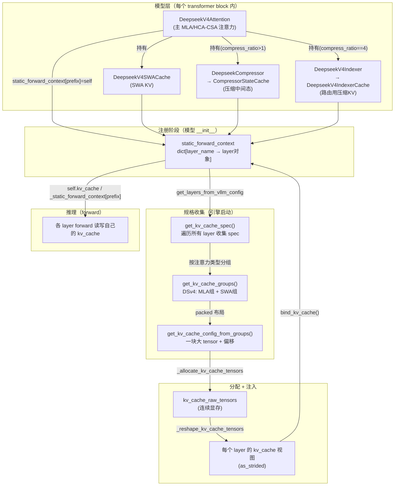
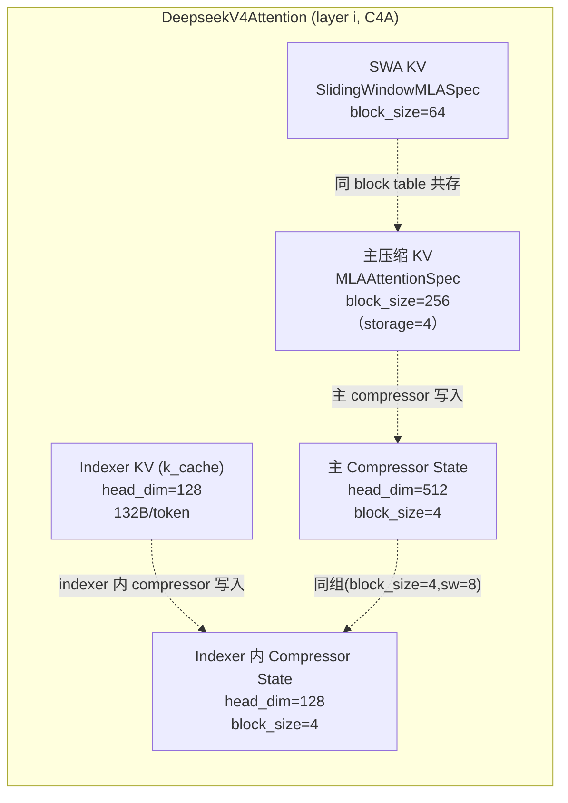
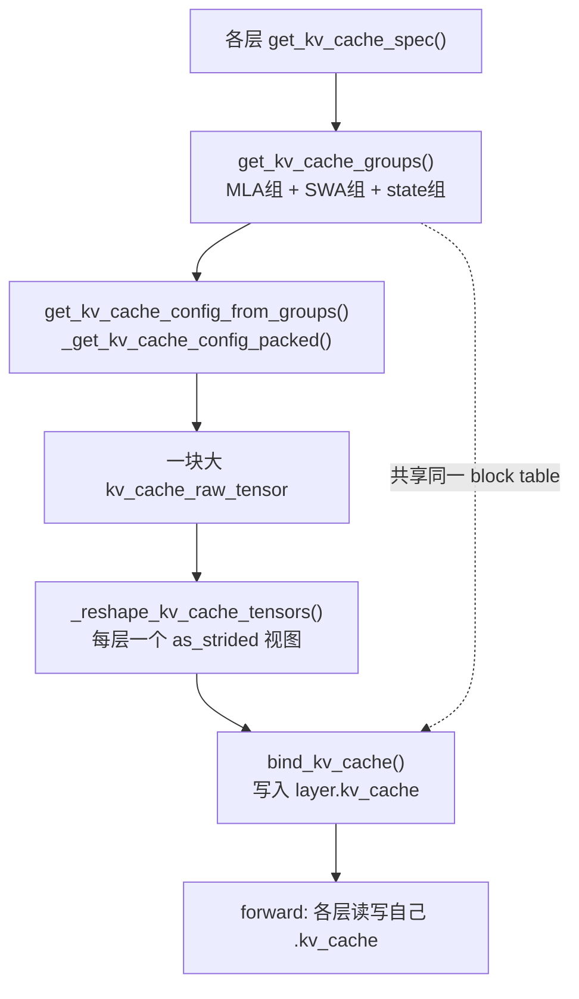
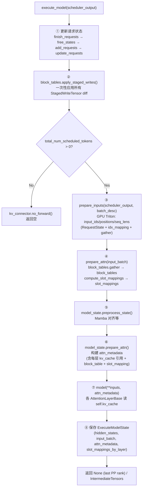
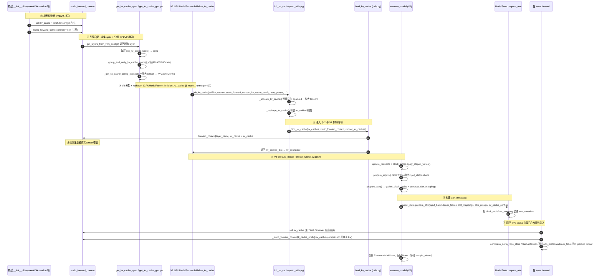

# DeepSeek-V4 KV Cache 布局与全局管理机制深度解剖

> 目标：理清 DeepSeek-V4 为什么用了这么多不同的 KV cache、它们各自是什么、怎么被 vLLM 统一管理，以及 `AttentionLayerBase` / `kv_cache` 属性 / `static_forward_context` 在其中扮演的角色。
>
> 配套文档：`.codebuddy/analysis/deepseek_v4_compressor.md`（Compressor 单独剖析）。

## 目录

- [0. 前置知识：为什么 DeepSeek-V4 需要这么多 cache](#0-前置知识为什么-deepseek-v4-需要这么多-cache)
- [1. 全景架构概览](#1-全景架构概览)
- [2. AttentionLayerBase 定义与 kv_cache 属性](#2-attentionlayerbase-定义与-kv_cache-属性)
- [3. static_forward_context 是什么、怎么参与](#3-static_forward_context-是什么怎么参与)
- [4. DeepSeek-V4 定义了哪几种 cache](#4-deepseek-v4-定义了哪几种-cache)
- [5. 这些 cache 如何集成（分组 / 打包 / 共享 block table）](#5-这些-cache-如何集成分组--打包--共享-block-table)
- [6. 分配与注入的两条主线：V1 vs V2（本文以 V2 为主线）](#6-分配与注入的两条主线v1-vs-v2本文以-v2-为主线)
- [7. V2 执行期：KV cache 如何参与 forward](#7-v2-执行期kv-cache-如何参与-forward)
- [8. 完整调用链时序图（ModelRunnerV2 主线）](#8-完整调用链时序图modelrunnerv2-主线)
- [9. 关键数据结构速查表](#9-关键数据结构速查表)
- [10. 快速问题解答（FAQ）](#10-快速问题解答faq)

---

## 0. 前置知识：为什么 DeepSeek-V4 需要这么多 cache

DeepSeek-V4 是 **混合注意力（Hybrid Attention）+ MLA 低秩压缩** 架构，目的是在保持长上下文能力的同时把 KV cache 显存压到极低。它的核心设计思想：

- **MLA（Multi-head Latent Attention）**：KV 先被低秩投影成 latent 向量（head_dim 远小于传统 MHA 的 num_kv_heads*head_dim），KV cache 只存 latent，不是完整 K/V。
- **分层注意力类型**：不同层用不同压缩比，形成三种主 KV cache：
  - **HCA（Heavy-Compressed Attention）**：compress_ratio=128，每 128 个 token 压成 1 个状态。
  - **CSA（Compressed-Sliding Attention）**：compress_ratio=4，每 4 个 token 压成 1 个状态，且带滑动窗口重叠。
  - **SWA（Sliding Window Attention）**：最细粒度，最近窗口内的原始 token KV，不做压缩。
- **Lightning Indexer**：CSA 层（C4）额外有一个稀疏路由模块，它自己也缓存一份压缩 KV（供路由查询），即 **indexer cache**。
- **Compressor State Cache**：压缩不是"一次 GEMM 完事"，它需要在多个原始 token 上累加局部状态（kv_state + score_state），这些中间态也要缓存，即 **compressor state cache**。

所以一个 transformer block（CSA 层）里同时活着 **4 类 KV cache**：主压缩 KV（MLA spec）、SWA KV、indexer KV、compressor state。这正是让人"混乱"的根源——但 vLLM 把它们统一抽象成"多个 `AttentionLayerBase` 子类，各自声明自己的 spec，由 KV cache 管理器统一分配与寻址"。

**关键 tradeoff**：这么多 cache 如果不特殊管理，每个都独立分配一块显存、各自一张 block table，会极其浪费且调度复杂。vLLM 的解法是 **packed layout（打包布局）**：所有层共享同一张 block table、同一块大 tensor，按 block 内偏移寻址。

---

## 1. 全景架构概览

**图1：DeepSeek-V4 KV cache 全局管理全景**



**一句话职责**：
- **模型层**：声明"我需要什么样的 cache"（spec）并持有子 cache 对象。
- **static_forward_context**：全局登记表，key=layer_name，value=layer 对象，是 spec 收集与 kv_cache 注入的枢纽。
- **get_kv_cache_groups / get_kv_cache_config**：把众多 layer 按注意力类型分组、用 packed 布局统一分配一块显存。
- **bind_kv_cache**：把分配好的张量写回每个 layer 对象的 `.kv_cache` 属性。
- **forward**：各层从自己对象的 `.kv_cache` 读出张量进行读写。

---

## 2. AttentionLayerBase 定义与 kv_cache 属性

### 2.1 基类非常精简

**文件**：`vllm/model_executor/layers/attention_layer_base.py`

```python
12: class AttentionLayerBase(ABC):
23:     @abstractmethod
24:     def get_attn_backend(self) -> type[AttentionBackend]: ...
28:     @abstractmethod
29:     def get_kv_cache_spec(self, vllm_config) -> KVCacheSpec | None: ...
```

关键事实：

- **`self.kv_cache` 不在基类里声明**。它是一个"约定属性"（convention），由每个子类在 `__init__` 里自行赋值（通常是先放占位空张量 `torch.tensor([])`，引擎启动时再被注入真实张量）。
- `get_attn_backend()` 与 `get_kv_cache_spec()` 是抽象方法，强制子类实现。
- `get_kv_cache_spec()` 返回 `KVCacheSpec | None`；**返回 `None` 表示该层不需要 KV cache**（例如 SWA-only 层的主 cache、`forward()` 是空操作的辅助层）。
- 注意：`AttentionLayerBase` 本身**没有 `forward` 方法**，forward 由各子类（如 `DeepseekV4Attention`、各 backend 的 attention）自行实现。

### 2.2 继承 AttentionLayerBase 的类（grep 结果）

| 类 | 文件 | 角色 |
|---|---|---|
| `DeepseekV4Attention` | `vllm/models/deepseek_v4/attention.py:101` | 主 MLA/HCA-CSA 注意力层，**持有** SWA cache、compressor、indexer |
| `DeepseekV4IndexerCache` | `vllm/models/deepseek_v4/attention.py:728` | indexer 的压缩 KV cache |
| `CompressorStateCache` | `vllm/models/deepseek_v4/compressor.py:118` | 压缩中间态（kv_state+score_state）cache |
| `DeepseekV4SWACache` | `vllm/v1/attention/backends/mla/sparse_swa.py:51` | SWA 原始 KV cache |
| `Attention` / `MLAAttention` | `vllm/model_executor/layers/attention/*` | 通用注意力层 |
| `Mamba`（抽象） | `vllm/model_executor/layers/.../mamba/abstract.py` | SSM 状态 cache（非 KV） |

### 2.3 kv_cache 属性的"占位 → 注入"生命周期

每个子类 `__init__` 都做同样三件事（以 `CompressorStateCache` 为例，`compressor.py:133-150`）：

```python
        # 占位空张量
        self.kv_cache = torch.tensor([])
        # 注册进 static_forward_context
        compilation_config = get_current_vllm_config().compilation_config
        compilation_config.static_forward_context[prefix] = self
```

- **占位**：`self.kv_cache = torch.tensor([])` 只是个空壳，此时没有真实显存。
- **注册**：把自己（对象引用）以 `prefix` 为 key 放进 `static_forward_context`。
- **注入**：引擎启动时，`bind_kv_cache()` 执行 `forward_context[layer_name].kv_cache = kv_cache`，直接改写这个对象的 `.kv_cache` 属性（详见第 3、6 节）。

> 为什么用"占位 + 注入"而不是 `__init__` 直接分配？因为 KV cache 大小取决于全局显存预算、block_size、量化 dtype 等，只有引擎启动、完成 profile 后才知道。模型构建（`__init__`）时根本无法分配。所以 vLLM 把"对象创建"和"显存分配"解耦：对象先占位，全局管理器后续注入。

---

## 3. static_forward_context 是什么、怎么参与

### 3.1 它是什么

`static_forward_context` 是 `CompilationConfig` 的一个字段（`vllm/config/vllm.py`）：

```python
# 类型：dict[str, Any]，即 dict[layer_name → layer 对象]
compilation_config.static_forward_context: dict[str, Any]
```

它是一个**全局静态登记表**，在**模型构建期**（`__init__`）建立：每个 `AttentionLayerBase` 子类主动把自己注册进去。key 是层的全名（如 `model.layers.0.self_attn`、`model.layers.0.self_attn.swa_cache`、`model.layers.0.self_attn.compressor.state_cache`），value 是层对象本身。

### 3.2 它在哪里被读取

**(a) 收集 spec（引擎启动）** —— `vllm/v1/worker/gpu/attn_utils.py:50` 的 `get_kv_cache_spec()`：

```python
attn_layers = get_layers_from_vllm_config(vllm_config, AttentionLayerBase)
for attn_module in attn_layers:
    if spec := attn_module.get_kv_cache_spec(vllm_config):
        kv_cache_spec[layer_name] = spec
```

`get_layers_from_vllm_config`（`vllm/config/vllm.py:2313`）就是遍历 `static_forward_context.values()`，按 `layer_type` 过滤出所有 `AttentionLayerBase` 子类。

**(b) forward 时取用** —— 两个方向：
- 主注意力层直接读 `self.kv_cache`（因为注入改的就是自己的属性）。
- `DeepseekCompressor.forward` 通过保存的引用反查主 KV cache 层（读别人的 cache）：

```python
# compressor.py:291
self._static_forward_context = vllm_config.compilation_config.static_forward_context
# compressor.py:416（forward 内）
k_cache_layer = self._static_forward_context[self.k_cache_prefix]
kv_cache = k_cache_layer.kv_cache   # 取出主 KV cache 写入压缩结果
```

注意：`DeepseekV4Attention` 在 `__init__` 里保存了 `self._static_forward_context` 吗？不——它自己就是注册对象，直接 `self.kv_cache` 即可。但 compressor 是"子模块"，它要写的是**父层（主 KV cache）**的 `kv_cache`，所以必须靠 `k_cache_prefix` 反查那个父对象。这就是为什么 compressor 也存了 `static_forward_context` 引用（`__init__` 时还能拿到 vllm_config，forward 时拿不到）。

### 3.3 与 ForwardContext / bind_kv_cache 的关系

- `static_forward_context` 是**模型构建期建立的全局静态字典**（key=layer_name，value=layer 对象）。
- `bind_kv_cache`（`vllm/v1/worker/utils.py:516`）在推理启动时，把分配好的张量写入 `forward_context[layer_name].kv_cache`。这里的 `forward_context` 参数**传的就是 `static_forward_context`**（见 `gpu_model_runner.py:7371`：`bind_kv_cache(kv_caches, self.compilation_config.static_forward_context, ...)`）。
- 因为两者指向**同一批 layer 对象**，所以"注入"等价于改写这些对象的 `.kv_cache` 属性——覆盖掉 `__init__` 的占位空张量。

---

## 4. DeepSeek-V4 定义了哪几种 cache

一个 transformer block（以 CSA/C4 层为例）里同时存在 **4 类** KV cache。下面逐个说明角色、`get_kv_cache_spec()` 返回的 spec、形状语义。

### 4.1 主压缩 KV cache（MLA spec）—— `DeepseekV4Attention.kv_cache`

- **持有者**：`DeepseekV4Attention` 自身（注意：它既是注意力层，也自己持有主 KV cache）。
- **get_kv_cache_spec**（`attention.py:702`）：
  - `compress_ratio <= 1`（SWA-only 层）：返回 `None`（主 cache 不分配，只用 SWA cache）。
  - 否则返回 `MLAAttentionSpec`，形状为 fp8_ds_mla 的 UE8M0 paged 布局（`[num_blocks, block_size, 584]`，其中 584 = 448 NoPE + 128 RoPE + 8 fp8 scale，对齐到 576B）。
- **语义**：压缩后的 latent KV（不是完整 K/V），供 HCA/CSA 注意力读取。

### 4.2 SWA KV cache —— `DeepseekV4SWACache`

- **持有者**：`DeepseekV4Attention.__init__` 里创建 `self.swa_cache_layer = DeepseekV4SWACache(...)`（`attention.py:311`）。
- **get_kv_cache_spec**（`sparse_swa.py:82`）：返回 `SlidingWindowMLASpec`，`block_size=64`，`sliding_window=window_size`，同样 576B 对齐。
- **形状**（`sparse_swa.py:132`）：`[num_blocks, block_size, 584]`（fp8_ds_mla）或 `[num_blocks, block_size, head_size]`（plain）。
- **语义**：最近窗口内**未压缩**的原始 token KV。SWA 层（compress_ratio<=1）的主 cache 不存在，完全靠它；压缩层则用它补充局部细节。

### 4.3 Compressor State Cache —— `CompressorStateCache`（**有两份！**）

> ⚠️ **重要遗漏修正**：一个 CSA(C4A) block 里其实有**两个** `CompressorStateCache`，不是一份。除了主 compressor 的，indexer 内部也持有自己的 `DeepseekCompressor`（见 4.4）。两者都是 `CompressorStateCache` 子类，spec 类型相同（`SlidingWindowMLASpec`），且对 C4A 层 `(block_size, sliding_window)` 同为 `(4, 8)`（见下），因此 `group_and_unify_kv_cache_specs` 会把它们归到**同一组**。

**(a) 主 compressor 的 state cache**
- **持有者**：`DeepseekV4Attention` 在 `compress_ratio > 1` 时创建 `self.compressor = DeepseekCompressor(...)`，compressor 内部持有 `self.state_cache = CompressorStateCache(...)`（`compressor.py:280`）。
- **key**：`model.layers.{i}.self_attn.compressor.state_cache`
- **get_kv_cache_spec**（`compressor.py:174`）：`SlidingWindowMLASpec`，`head_size=self.state_dim`（= `2*coff*head_dim`，即 kv_state + score_state 拼接，head_dim=512 走主 KV 路径），`sliding_window=coff*compress_ratio`（C4→8，C128→128）。
- **语义**：主压缩过程的**中间累加态**。

**(b) indexer 内部的 compressor 的 state cache**
- **持有者**：`DeepseekV4Indexer` 在 `compress_ratio == 4` 时创建 `self.compressor = DeepseekCompressor(..., head_dim=128, rotate=True, k_cache_prefix=self.k_cache.prefix)`（`attention.py:855`），其内部同样持有 `self.state_cache = CompressorStateCache(...)`。
- **key**：`model.layers.{i}.self_attn.indexer.compressor.state_cache`
- **get_kv_cache_spec**：同样是 `SlidingWindowMLASpec`，但 `head_dim=128`（走 indexer 路径，`compressor.py:310`），`sliding_window=coff*compress_ratio`（C4→8）。
- **语义**：indexer 路由用的压缩中间态（head_dim 比主 compressor 小，因为它只需给 indexer 的 128 维 KV 做压缩）。两组 state cache 的 `(block_size=4, sliding_window=8)` **完全一致**，故被分桶到同一 group，但组内 `head_size` 不同（`UniformTypeKVCacheSpecs` 允许逐层 spec 不同）。

两个 state cache 都和各自的主 KV block **共享物理 tensor**（见第 5 节），block_size 必须与主 KV block 一致（C4→4，C128→8）。

### 4.4 Indexer Cache —— `DeepseekV4IndexerCache` + indexer 自己的 compressor

- **持有者**：`DeepseekV4Attention` 在 `compress_ratio == 4`（CSA 层）时创建 `self.indexer = DeepseekV4Indexer(...)`（`attention.py:277`)。indexer **内部还持有两样东西**：
  1. `self.k_cache = DeepseekV4IndexerCache(...)`（`attention.py:846`，key `self_attn.indexer.k_cache`）——indexer 的压缩 KV 缓存。
  2. `self.compressor = DeepseekCompressor(...)`（`attention.py:855`，key `self_attn.indexer.compressor`）——**indexer 自己的 compressor**，负责把 indexer 的 KV 压缩写入 `k_cache`。
- **get_kv_cache_spec**（`attention.py:750`）：`DeepseekV4IndexerCache` 返回 `MLAAttentionSpec`，`head_dim=128`（indexer 自带降秩），单 token 132B（128 fp8 + 4 fp32 scale），对齐 576B。
- **语义**：Lightning Indexer 的稀疏路由模块缓存一份压缩 KV（head_dim=128），用于决定"查询时该去哪个压缩块找信息"。indexer 不是简单"复用"主 compressor 的缓存，而是**有自己的 compressor 实例 + 自己的 state cache + 自己的 k_cache**，三者配套。indexer 的 compressor 把压缩结果写入 `k_cache`（而非主 MLA cache）。

### 4.5 五种 cache 关系总览

**图2：单个 C4A transformer block 的 5 类 cache（注意有两个 CompressorStateCache）**



| Cache | 压缩? | block_size | 维度 | 给谁用 | key |
|---|---|---|---|---|---|
| 主压缩 KV | 是 (ratio 4/128) | 256（storage=4 C4 / 2 C128） | 584B/token (fp8_ds_mla) | HCA/CSA 注意力 | `self_attn` |
| SWA KV | 否 | 64 | 584B/token | 局部窗口注意力 | `self_attn.swa_cache` |
| 主 Compressor State | 中间态 | 4/8（共享物理 tensor） | 2*coff*512 (fp32) | 主 compressor→主 KV 写入 | `self_attn.compressor.state_cache` |
| Indexer KV | 是 | 256（storage=64） | 132B/token (head_dim=128)；**page=8640**（不传 `cache_dtype_str`，走通用公式，非 584） | Lightning Indexer 路由 | `self_attn.indexer.k_cache` |
| Indexer 内 Compressor State | 中间态 | 4（共享物理 tensor） | 2*coff*128 (fp32) | indexer 内 compressor→indexer KV 写入 | `self_attn.indexer.compressor.state_cache` |

> **C4A 层 vs C128A 层 vs SWA-only 层 的 key 数量**：
> - **C4A（compress_ratio=4）**：5 个 key（主 KV + SWA + 主 state + indexer KV + indexer state）。
> - **C128A（compress_ratio=128）**：3 个 key（主 KV + SWA + 主 state），**无 indexer**（indexer 仅 C4 创建）。
> - **SWA-only（compress_ratio<=1）**：1 个 key（仅 SWA，主 KV 返回 None），无 compressor、无 indexer。

### 4.6 验证：`get_kv_cache_configs` 的输入 `kv_cache_specs` 里到底有没有全部 5 类 cache 的信息？

**结论：有且完整。** `get_kv_cache_configs(vllm_config, kv_cache_specs, available_memory)` 的第一个参数 `kv_cache_specs: list[dict[str, KVCacheSpec]]` 是**每个 worker 一份**的 `{layer_name -> KVCacheSpec}` 字典，DeepSeek-V4 每一种 cache 都作为独立 `AttentionLayerBase` 子模块**显式注册**进了 `static_forward_context`，并在收集时被逐个取出。验证链路如下：

**① 收集入口（engine-core 进程）**
```python:247,294:vllm/v1/engine/core.py
kv_cache_specs = self.model_executor.get_kv_cache_specs()   # list[dict]，每 worker 一份
...
kv_cache_configs = get_kv_cache_configs(vllm_config, kv_cache_specs, available_gpu_memory)
```
`get_kv_cache_specs` → `gpu_worker.get_kv_cache_spec()` → `model_runner.get_kv_cache_spec()` → `attn_utils.get_kv_cache_spec(vllm_config)`。

**② 收集机制不是递归遍历模块树，而是查 `static_forward_context` 字典**
```python:50,55,57,63:vllm/v1/worker/gpu/attn_utils.py
def get_kv_cache_spec(vllm_config) -> dict[str, KVCacheSpec]:
    kv_cache_spec: dict[str, KVCacheSpec] = {}
    attn_layers = get_layers_from_vllm_config(vllm_config, AttentionLayerBase)
    for layer_name, attn_module in attn_layers.items():
        if spec := attn_module.get_kv_cache_spec(vllm_config):   # 返回 None 则跳过
            ...
            kv_cache_spec[layer_name] = spec
    return kv_cache_spec
```
```python:2327,2331,2334:vllm/config/vllm.py
forward_context = vllm_config.compilation_config.static_forward_context
return {layer_name: layer for layer_name, layer in forward_context.items()
        if isinstance(layer, layer_type)}   # 直接按 prefix 字典查，不递归
```
即：**每个 DSv4 cache 模块在 `__init__` 时都执行了 `compilation_config.static_forward_context[prefix] = self`**，收集阶段按 prefix 原样取出。所以"有没有进 `kv_cache_specs`"等价于"模块有没有注册 + 其 `get_kv_cache_spec()` 是否返回非 None"。

**③ 5 类 cache 在源码中的注册点与 get_kv_cache_spec 返回值**

| # | Cache 类型 | 模块类 | 注册语句 | `get_kv_cache_spec()` 返回 | 何时实例化 |
|---|---|---|---|---|---|
| 1 | 主压缩 KV | `DeepseekV4Attention` | `attention.py:324` | `MLAAttentionSpec`（`compress_ratio<=1` 时返回 **None** 被跳过） | 所有层（`self_attn`） |
| 2 | SWA KV | `DeepseekV4SWACache` | `sparse_swa.py:70` | `SlidingWindowMLASpec`(block_size=64) | 所有层（`self_attn.swa_cache`） |
| 3 | 主 Compressor State | `CompressorStateCache` | `compressor.py:150` | `SlidingWindowMLASpec`(block_size=4/8, sw=8/128) | `compress_ratio>1` 时构建（`self_attn.compressor.state_cache`） |
| 4 | Indexer KV | `DeepseekV4IndexerCache` | `attention.py:748` | `MLAAttentionSpec`(head_dim=128) | **仅 `compress_ratio==4`**（`self_attn.indexer.k_cache`） |
| 5 | Indexer 内 Compressor State | `CompressorStateCache` | `compressor.py:150`（indexer 内那份） | `SlidingWindowMLASpec`(block_size=4, sw=8) | **仅 `compress_ratio==4`**（`self_attn.indexer.compressor.state_cache`） |

> `DeepseekV4Indexer`（`attention.py:770`）和主 `DeepseekCompressor`（`compressor.py:199`）本身**不是** `AttentionLayerBase`、不注册，但其子模块 `k_cache`、`state_cache` 都是 `AttentionLayerBase` 并各自注册——所以 indexer 的 2 份 cache（#4、#5）以及主 compressor 的 1 份 state（#3）都进了 `kv_cache_specs`。

**④ 因此一个典型 ~59 层 DeepSeek-V4 的 `kv_cache_specs` 内容**

- **C4A 层（compress_ratio=4）**：5 个 key → `self_attn`(MLA) + `self_attn.swa_cache`(SWA) + `self_attn.compressor.state_cache`(state) + `self_attn.indexer.k_cache`(MLA) + `self_attn.indexer.compressor.state_cache`(state)
- **C128A 层（compress_ratio=128）**：3 个 key → `self_attn` + `self_attn.swa_cache` + `self_attn.compressor.state_cache`（无 indexer 两项）
- **SWA-only 层（compress_ratio<=1）**：1 个 key → `self_attn.swa_cache`（`self_attn` 返回 None 被跳过，无 compressor/indexer）

> 注意：主 `DeepseekV4Attention.get_kv_cache_spec` 在 `compress_ratio<=1` 时返回 `None`（见 `attention.py:704-707`），所以该层的主 KV 条目不会进入字典；其余 cache 的 key 仍按 prefix 完整列出。**没有任何一类 DSv4 声明的 cache 被遗漏**——`get_kv_cache_configs` 拿到的就是模型全部层的全部 cache 声明。

---

## 5. 这些 cache 如何集成（分组 / 打包 / 共享 block table）

这是最让人困惑的部分：**这么多不同的 cache，vLLM 怎么统一管理？** 答案是"**分组 + packed 布局 + 共享 block table**"。

### 5.1 配置主流程：`get_kv_cache_configs` 与 DSv4 支线

源码里这几个函数（`get_kv_cache_configs` / `get_kv_cache_groups` / `group_and_unify_kv_cache_specs` / `_get_kv_cache_groups_uniform_groups`）有大量 `⚠️` 注释，它们其实串起了一条**专为 DSv4 设计**的分支。下面逐个函数系统剖析。

#### 5.1.1 `get_kv_cache_configs`（kv_cache_utils.py:2262）—— 总调度

签名：`get_kv_cache_configs(vllm_config, kv_cache_specs, available_memory) -> list[KVCacheConfig]`。输入 `kv_cache_specs` 就是 §4.6 验证过的 `{layer_name -> KVCacheSpec}` 字典列表（每 worker 一份）。整个函数 5 步，DSv4 在每个步骤都有特殊行为：

1. **合并所有 worker 的 spec（2305-2314）**：把各 PP stage / TP rank 的字典合并成"整模型"一张表 `merged_kv_cache_specs`。同一层在不同 worker 的 spec 必须完全一致，否则 `assert` 失败（KV cache 分配需全局一致）。这是 DSv4 多 group 的前提——先把分散的 layer 聚合成完整模型视图。
2. **注册表防呆（2320）**：`KVCacheSpecRegistry.check_kv_cache_spec_registry` 确保所有 spec 都在注册表登记过（MLAAttentionSpec / SlidingWindowMLASpec），防止 `__init__` 漏调 `register`。
3. **★ 生成全局分组（2333）**：`global_kv_cache_groups = get_kv_cache_groups(vllm_config, merged_kv_cache_specs)` —— **这是 DSv4 支线的真正入口**（见 5.1.2）。
4. **逐 worker 投影 + auto-fit + 内存检查（2343-2393）**：`_project_kv_cache_groups_to_worker` 把全局 group 投影到每 worker 自有层（PP 场景裁剪）；`max_model_len=-1` 时 `_auto_fit_max_model_len` 二分搜索；`_check_enough_kv_cache_memory` 校验显存。DSv4 多 group 下这两处的字节预算走 `_max_memory_usage_bytes_from_groups` 的 `all groups are UniformTypeKVCacheSpecs` 特例（kv_cache_utils.py:2037），按 **layer_tuple 共享布局** + 全局最大 layer_tuple 数算字节，正确反映 packed 浪费。
5. **逐 worker 生成 config + 木桶收缩（2409-2452）**：每个 worker 调 `get_kv_cache_config_from_groups`（内部落到 `_get_kv_cache_config_packed` 别名 `_get_kv_cache_config_deepseek_v4`）；最后取**全局最小 num_blocks**，按比例收缩每个 tensor 的 `size`（DSv4 下就是那块 packed 大 tensor，page 偏移关系不变）。

> 关键认知：`get_kv_cache_configs` **本身不绑定 KV cache**，它只产出 `KVCacheConfig`（含分组、block_size、num_blocks、tensor 布局）。真正的"注入"（把物理 tensor 写进各层 `.kv_cache`）发生在后续 `bind_kv_cache`（见 §6）。

#### 5.1.2 `get_kv_cache_groups`（kv_cache_utils.py:1880）—— DSv4 分派

内部按 spec 差异分派（1928 起）：

- 全部层 spec 相同 → 1 个 group（绝大多数模型）
- 父类相同且 block_size 一致（仅 hidden 不同）→ 1 个 `UniformTypeKVCacheSpecs`
- **★ DeepSeekV4**：类型/窗口各异但 token 数需求相同 → 调 `group_and_unify_kv_cache_specs()`，把层切成多个 `UniformTypeKVCacheSpecs`，再 `_get_kv_cache_groups_uniform_groups()` 展开成共享一张大 tensor 的 `KVCacheGroupSpec` 列表（顺序固定，是 packed 布局的前提）。

#### 5.1.3 `group_and_unify_kv_cache_specs`（kv_cache_utils.py:1633）—— 按 (block_size, sliding_window) 分桶

这是 DSv4 把 5 类 cache 收拢成"组"的核心。逻辑（1702-1749）：

- 若没有任何 `SlidingWindowMLASpec` → 返回 `None`（非 DSv4，走其他分支）。
- 遍历 `merged_kv_cache_specs`，**分两类收集**：
  - `MLAAttentionSpec` → 全放进 `mla_specs` 字典（主压缩 KV + indexer KV 都是 MLA，token 数需求相同，合并为**第 ① 组**）。
  - `SlidingWindowMLASpec` → 按 `(block_size, sliding_window)` **分桶**到 `grouped_swa_mla_specs`：
    - `(64, WS)` → SWA 组（第 ② 组，来自 `swa_cache`）
    - `(4, 8)` → C4 压缩状态组（第 ③ 组，含**主 compressor state + indexer 内 compressor state 两份**，见 §4.6 第 5 类）
    - `(8, 128)` → C128 压缩状态组（第 ④ 组，来自 C128A 的主 compressor state）
- 每个桶调 `UniformTypeKVCacheSpecs.from_specs()` 统一；返回值顺序固定 `[mla_uniform_spec, *swa_uniform_specs]`，对应上面 ①/②/③/④。

> 所以 DSv4 的 5 类 cache 最终落进 **4 个 UniformTypeKVCacheSpecs**（第 ⑤ 类 indexer state 因 `(block_size, sliding_window)` 与主 state 相同，被并入第 ③ 组）。
> ⚠️ **但注意**：这是 `group_and_unify_kv_cache_specs` 按 `(block_size, sliding_window)` 分桶的**组容器**层面。

> **这 4 个组就是一些文章（如知乎 DSv4 解读）说的"四个 KV cache group"**。把它们和你的理解精确对齐（注意 `UniformTypeKVCacheSpecs` 是"容器类型"，每个组都是它；下面说的 MLA/SWA 是指组内 spec 的**种类**，不是容器名）：
> | 组 | 真实内容 | 类型 | 对应你的描述 |
> |---|---|---|---|
> | ① 全 MLA | 主压缩 KV（C4+C128）+ indexer 的 k_cache（MLA, hd=128） | `MLAAttentionSpec` | ✅ "Uniform（C4+C128+indexer）" |
> | ② SWA | 所有层的 `swa_cache` | `SlidingWindowMLASpec`(64,WS) | ✅ "SWA" |
> | ③ C4-state | 主 compressor state（C4）+ **indexer 内 compressor state**（同样 (4,8)，并入同组） | `SlidingWindowMLASpec`(4,8) | ⚠️ 你写的"④ Uniform（C4+Index state）"实际就**是这一组**，不是独立组④ |
> | ④ C128-state | 主 compressor state（C128） | `SlidingWindowMLASpec`(8,128) | ✅ "C128 State" |
>

这一步把 §5.1.3 得到的 **4 个 `UniformTypeKVCacheSpecs`** 进一步展开成最终真正交给 packed 布局的 **`KVCacheGroupSpec` 列表**。它做两件最难懂的事：**layer tuple 对齐** 和 **page_size 填充对齐**。下面用一个贯穿例子彻底讲透。

##### 5.1.4.0 输入回顾

§5.1.3 产出 4 个 spec（`grouped_specs`），顺序固定：
```
grouped_specs = [
    full_mla_spec,          # ① 全 MLA：主KV(C4+C128)+indexer KV
    swa_spec_64,            # ② SWA：swa_cache (block_size=64)
    swa_spec_c4state,       # ③ C4-state：主C4 state + indexer内C4 state (block_size=4)
    swa_spec_c128state,     # ④ C128-state：主C128 state (block_size=8)
]
```
注意：② ③ ④ 都是 `SlidingWindowMLASpec`，统称 "SWA 类 spec"；只有 ① 是 MLA。

##### 5.1.4.1 什么是 layer tuple（最该搞懂的概念）

**layer tuple = "在第 i 个位置上，每个 page_size 各取一个层"凑成的一组。**

看 ① full_mla_group 内部（用真实 DSv4 量级示意）：假设它有两类 MLA 层——C4 主KV（page_size=37440，出现 11 次）和 C128 主KV（page_size=1728，出现 10 次，=2×584 向上对齐 576）。那么：

```
位置:  0    1   ...  10   
C4 :  L0   L1  ...  L10  
C128: L11  L12 ...  空
```

- 每一"列"（位置 0、1…10）里 C4 和 C128 各有一个层 → 这是一个 **layer tuple**。
- `num_layer_tuples = Counter(page_size).most_common(1)` = **最常出现的 page_size 的次数** = 11（C4 出现 11 次）。
- C128 只有 10 个，比 11 少 → 用 **padding** 补到 11（第 11 个 tuple 里 C128 位置为空，但占位）。

**为什么要用 tuple 这个概念？** 因为 packed 布局里，一个物理 block 是"所有 group 在同一位置上各贡献一个 page"拼起来的（见 §5.2）。

要保证不同 group 能拼到同一张 block 上，**每个 group 必须有相同数量的 tuple，且每个 tuple 位置对应的 page_size 一致**。这就是"对齐"二字的由来。

##### 5.1.4.2 Step 1（1810-1827）：统一 num_layer_tuples

```python
num_layer_tuples_per_group = [g.get_num_layer_tuples() for g in grouped_specs]
# 例：[11(MLA), 21(SWA64), 11(C4state), 10(C128state)]
#     ↑ MLA=11 个 C4/C128 层位；SWA=全部层(11 C4 + 10 C128)=21，全同 page → 21 tuple
#       C4state spec 共 22 层 KV cache（11 主C4 state + 11 indexer内C4 state），
#         但按 page 分两桶：37440 桶 11 层、8640 桶 11 层 → most_common=11 tuple（不切）
#       C128state=每个 C128 层 1 份=10 → 10 tuple（padding 到 11）
# 注意 get_num_layer_tuples() 返回"most_common page 的出现次数"（=layer tuple 数），
# 不是总层数。所以 C4state 虽 22 层，但 tuple 数=11。
num_layer_tuples = _approximate_gcd(num_layer_tuples_per_group,
                                    lower_bound=num_layer_tuples_per_group[0])
# lower_bound=11 → 统一取 11（gcd 不会小于最多的那个）
# 各组向上取整到 11 的整数倍：11→11, 21→22(2×11), 10→11(padding 补 1)
```

- `lower_bound` 是全 MLA group 的 tuple 数（11）——**任何组不能少于此值**，否则 MLA 自己拼不齐。
- `_approximate_gcd` 在 `[11, 21]` 之间选 padding 最小的值（这里就是 11：21 对齐到 2×11=22 仅 pad 1，10 对齐到 11 pad 1；若取 21 则 MLA 11→21 pad 10，总 pad 暴涨）。
- 结果：MLA=11、C4state=11（**不切子 group**，但 spec 内含 22 层 KV cache：11 主C4 state + 11 indexer内C4 state，按 page 分 37440/8640 两桶）、C128state=11（10→11，第 11 位 padding）、**SWA=22（切 2 个子 group）**。即只有 SWA 这份 tuple 数超过 11 需切，其余都 ≤11 不切。

##### 5.1.4.3 Step 2（1830-1894）：page_size 填充对齐 + 切成子 group

对每个 SWA 类 spec（② ③ ④）做两件事：

**(a) page_size 填充对齐（1850-1861）**
SWA 的 page_size 必须**填充到全 MLA group 的某个 page_size**（取"不小于它的最近 MLA page_size"）。原因：packed 布局里同一 block 的同一 tuple 位置，所有 group 的 page 必须紧挨着、stride 一致。如果 SWA page 比 MLA page 小，就用 `page_size_padded` 补齐到候选值，这样不同 group 的同位置 page 占用字节数一致，block 内偏移才能对齐。

```python
for ps in sm_page_sizes:
    size_to_candidate[ps] = min(x for x in all_page_sizes if x >= ps)
# 例：SWA page=1000 → 对齐到 MLA 的 1000（相等则不变）
#     C4-state page 较小 → 对齐到最近的 MLA page_size
assert max(sm_page_sizes) <= max(all_page_sizes)   # SWA 不能比 MLA 大，否则交错崩
```

**(b) 按 num_layer_tuples 切成多个子 group（1867-1894）**
只有**某个 page_size 桶的层数超过 11** 的 spec 才会被切（注意 `num_layers_per_size` 是**每个 page 桶**的层数，不是 spec 总层数）。把它的层按 tuple 配对（`zip(*layers_per_size.values())`），再用步长 `i::num_tuple_groups` 交错分到各子 group，保证每个子 group 层分布均匀：

```python
num_tuple_groups = cdiv(num_layers_per_size, num_layer_tuples)   # 按每 page 桶算
# SWA: 单桶 21 层 /11 → 2；C4state: 37440桶11层、8640桶11层，各 /11 → 1（虽 spec 总 22 层，但每桶都≤11）；C128state: 单桶10→11 /11 → 1
layer_tuples = list(zip(*layers_per_size.values()))              # [(L0,L3),(L1,L4),...]  # 按 page 桶配对
for i in range(num_tuple_groups):
    group_layer_tuples = layer_tuples[i::num_tuple_groups]       # 步长交错取
    # 每个子 group 是一个 KVCacheGroupSpec
```
> 例：SWA spec 单桶 21 层 → `num_tuple_groups=2` → 切 2 个子 group（各 11 层）；C4state spec 虽总 22 层 KV cache，但分 37440/8640 两桶各 11 层 → 每桶 `num_tuple_groups=1` → **不切**，1 个 group 含 22 层；C128state spec 10 层 → padding 到 11 → 不切。这就是 §5.1.4.4 只有 SWA 被切成 2 份的原因。

##### 5.1.4.4 DSv4 经过这一步，最终得到的 kv cache group 是什么样的

最终 `return [full_mla_group, *swa_mla_groups]`（`kv_cache_utils.py:1896`）。按上面的真实层数（MLA=11、SWA=21、C4state=11、C128state=10，统一 tuple 数=11）：

```
最终 KVCacheGroupSpec 列表（共 5 个）：
  ├─ [0] full_mla_group           # ① 整体 = 所有 MLA 类层（C4主KV+C128主KV+indexer KV），含 11 个层位
  ├─ [1] swa_64_subgroup_0        # ② SWA 前 11 层（swa_cache，全 37440）
  ├─ [2] swa_64_subgroup_1        # ② SWA 后 11 层（padding 补到 22，全 37440）
  ├─ [3] c4state_group            # ③ C4-state：共 22 层 KV cache
  │                              #    = 11 主C4 compressor state(37440) + 11 indexer内C4 compressor state(8640)
  │                              #    按 page 分两桶、每桶 11 层 → zip 配对成 11 个 tuple → 1 个 KVCacheGroupSpec，不切子组
  └─ [4] c128state_group          # ④ C128-state（10 层，padding 补到 11，全 37440）
```

> ⚠️ **[3] c4state_group 按 tuple 分是 11 个 tuple，不用拆成两个子组**。原因：`_get_kv_cache_groups_uniform_groups` 的切分是对**每个 page_size 桶**分别算 `cdiv(桶层数, 11)`（源码 1847/1867）：37440 桶 11 层→`cdiv(11,11)=1`，8640 桶 11 层→`cdiv(11,11)=1`，两桶都只需 1 个子 group；再 `zip(*两桶)` 配对成 **11 个 tuple**（每个 tuple = (主C4state_i, indexer内C4state_i)）。所以组③是 **1 个 KVCacheGroupSpec、内部 11 个 tuple**，不拆。
> 对比 SWA：它只有 1 个 page 桶（全 37440）共 21 层 → `cdiv(21,11)=2` → 才切成 2 个子 group。c4state 虽总 22 层，但分两桶后每桶都不超 11，所以不切。

> ⚠️ **只有 SWA 被切成 2 个子 group**（单桶 21 层 → 对齐 22 → 2×11）。C4-state **总共 22 层 KV cache**（主 state 11 + indexer 内 state 11，你强调的这点不能漏！），但按 page 分 37440/8640 两桶、每桶都只有 11 层 → 每桶 `cdiv(11,11)=1` → **不切子 group**（1 个 group 内含 22 层、11 个 tuple）。C128-state 10 层 → padding 到 11，不切。所以"7 个 group"旧画法是错的——它误把 C4state 也按 21 层切 2 份，但 C4state 是 22 层且按 page 分两桶。

**关键结论**：
1. **① 始终是 1 个 group**（MLA 类不被切块，因为它本来就是 packed 的基准）。
2. **只有 SWA spec 被切成 `cdiv(21, 11)=2` 个子 group**；C4state（22 层，但分两桶各 11 → 每桶 `cdiv(11,11)=1`）、C128state（10 层→padding 11 → `cdiv(10→11,11)=1`）都**各 1 个 group 不切**。所以最终 `KVCacheGroupSpec` 数量 = `1 + 2 + 1 + 1 = 5`（不是 4 个，也不是 2 个，也不是 7 个）。
3. 所有这些子 group 的 **层位数都是 11、page_size 都对齐到 MLA 的 page_size**——这正是 §5.2 packed 布局能"多 group 共用一张大 tensor、共用一张 block table"的**前置约束**。没有这一步对齐，不同 group 的 page 就无法在同一个物理 block 里交错摆放。

> ⚠️ 再次区分粒度：
> - **4 个** = §5.1.3 的 `UniformTypeKVCacheSpecs`（spec 级，文章说的"四个 group"）
> - **5 个** = 本节产出的 `KVCacheGroupSpec`（真正喂给 packed 的：full_mla 1 + SWA 切 2 + C4state 1 + C128state 1；只有 SWA 超 11 层才切）
> - **"2 个"** = `_get_kv_cache_config_packed` docstring 说的 `[mla类, *swa类]` 结构二分（不是数量）
>
> 三者不矛盾，是同一份 DSv4 配置在不同处理阶段的三种视图。

### 5.2 每个 block 具体怎么规划：packed 布局的落地点

你标出的 `get_kv_cache_configs` 的 2396-2414 这层循环，调用 `get_kv_cache_config_from_groups`，它的分支判断（`kv_cache_utils.py:1474-1500`）决定走哪种布局：

```python
if len(kv_cache_groups) == 1 and isinstance(..., UniformTypeKVCacheSpecs):
    # 1️⃣ 单 uniform group：每层的 page_size_bytes 可能不同，把单 block 内所有层
    #    page 融合，num_blocks = available_memory // page_size_bytes
elif _use_packed_kv_cache_config(vllm_config, kv_cache_groups):
    # 2️⃣ ★ DSv4（或 --enable-cross-layers）：走 _get_kv_cache_config_packed
    num_blocks, kv_cache_tensors = _get_kv_cache_config_packed(...)
else:
    # 3️⃣ general 混合：每个 group 的每 i 层共享一张 KVCacheTensor，group_size 张 tensor
```

DSv4 默认命中 **分支 2️⃣**（别名 `_get_kv_cache_config_deepseek_v4`，`kv_cache_utils.py:1444`）。这正是"每个 block 怎么规划"的核心实现。

#### 5.2.1 `_get_kv_cache_config_packed`（kv_cache_utils.py:1343）的核心算法

入口先调 `_bucket_layers_by_page_size(kv_cache_groups)`，产出一个分桶结构：

```
buckets = { page_size: [ [layer_names], [layer_names], ... ] }   # 外层 key=页字节数，内层每个 list 是一个 slot
```

**buckets 的构造规则（这是 packed 布局的灵魂）**：
- 不同 **group**、**相同 slot 位置**、**相同 page_size** 的层 → 放进**同一个 slot 列表**（跨 group 共享同一段内存）。
- 同一 **group** 内的多个层，因共用一张 block table（block-id 命名空间相同），**不能**共享同一 slot，必须分到不同 slot。

为什么跨 group 能共享、同 group 不行？因为**每个 group 有独立的 block table**，Group0 用 block-id=5 与 Group1 用 block-id=5 指向的是不同物理 block，永不撞车；而同 group 内 L0、L2 共用一张表，block-id=5 对两者是同一块，会互相覆盖，所以必须拆成 slot0 / slot1。

#### 5.2.2 DSv4 真实示例（基于 §5.1.4 真实机制，不假设具体层数）

> 本节直接套用 §5.1.4 已建立的真实事实，不再编造层数、也不用符号：
> 1. **真实层结构**：DSv4 是混合注意力，按 `compress_ratios` 分三类层——C4A 层（ratio=4，含 5 类 cache）、C128A 层（ratio=128，含 3 类）、SWA-only 层（ratio≤1，仅 1 类 swa_cache）。其中 **C4 层出现 11 次**（占多数），**C128 层出现 10 次**；C128 比 11 少 1 个，所以第 11 个层位用 **padding** 补位（§5.1.4.1）。因此 `num_layer_tuples = 11`，每个层位对应一个物理 block 里的一组 page。
> 2. **5 类 cache 的真实 page_size（fp8_ds_mla，对齐 576）已全部确证**：C4 主KV=37440、C128 主KV=1728、SWA=37440、indexer k_cache=8640、主/C128 compressor state→填充 37440、indexer 内 compressor state→8640（详见 §5.2.1 上方注释与 §5.4 汇总表）。

> ⚠️ **关于测试桩数字（重要）**：你贴的官方示例 `tests/v1/core/test_contiguous_kv_packing.py:57`
> 里 `PS_C4_MLA/PS_C4_IDX/PS_C128/PS_SWA = 37440/8640/1728/37440` 是**为验证 bucket 切分算法手填的桩值**，
> 但**四个 page_size 全等于真实 DSv4**（结构+数值都真实，非假值）：
> - `PS_C4_MLA=37440`、`PS_SWA=37440`、`PS_C128=1728`：与真实一致（C128 真实就是 2×584 对齐 576 = 1728；SWA 真实 block_size=64 走 584 公式 = 37440）。
> - `PS_C4_IDX=8640`：**也是真实值**。原因：`DeepseekV4IndexerCache.get_kv_cache_spec`（`attention.py:754`）**不传 `cache_dtype_str`/`model_version`**，所以 `real_page_size_bytes` 走**通用公式** `storage_block_size × head_size × dtype_size = 64 × 132 × 1(uint8) = 8448 → 对齐576 → 8640`，**不进 584 分支**。测试桩注释写的公式 `(256/4+1)×576=37440` 反而是**错的**（它误把 indexer 当 584 布局），真实 indexer=8640。
>
> 所以下面全部按**真实 DSv4**（源码 `real_page_size_bytes` + 对齐 576）给值：C4 主 KV=37440，C128=1728，**SWA=37440**（`block_size=64`，`sparse_swa.py:77` 写死，与 C4 主 KV 同 page），**indexer k_cache=8640**（注意：indexer 不传 `cache_dtype_str`，走通用公式 `64×132×1`，**不进 584 分支**，故不与 C4 主 KV 同 page）。
>
> 各 spec 真实参数（详见 §5.4 汇总表）：
> - C4 主 KV：`block_size=256, storage_block_size=64, page=64×584=37376→37440`
> - C128 主 KV：`block_size=256, storage_block_size=2, page=2×584=1168→1728`（round_up 向上对齐）
> - SWA KV：`block_size=64（源码 `sparse_swa.py:77` 写死，因与 C4A 共享物理 tensor 必须同 page_size，C4A 块形状=[64,head_dim] 故取 64）, storage_block_size=64(=64//compress_ratio1), page=64×584=37376→37440`（**和 C4 主 KV 同 page，会被 bucket 并入同一 slot**）
> - **compressor state（主/C128 + indexer 内）全是 `SlidingWindowMLASpec`，且 `CompressorStateCache.get_kv_cache_spec`（`compressor.py:184`）都**不传 `cache_dtype_str`/`model_version`** → 走 `SlidingWindowMLASpec.real_page_size_bytes` 的**通用公式**（653行），**不进 584 分支**。dtype = fp32（`compressor.py:152` assert fp32），对齐 576。**
>   - C4 主 compressor state：`block_size=4, state_dim=2×2×512=2048, fp32` → 裸 `4×1×2048×4 = 32768` → 对齐576 `round_up(32768,576)=32832` → `page_size_padded=32832`。**它属 SWA group，进 packed Step 2a 被填充到最近的 MLA page = 37440**（`32832` 的候选 ≥32832 最小 = 37440）。**最终 page = 37440（与 C4 主 KV 同 slot）**。
>   - C128 主 compressor state：`block_size=8, state_dim=2×1×512=1024, fp32` → 裸 `8×1×1024×4 = 32768` → 同样对齐32832 → 填充到 **37440**（与 C4 主 KV 同 slot）。
>   - **indexer 内 compressor state（仅 C4A）**：`block_size=4, state_dim=2×2×128=512`（它压缩的是 indexer 的 128 维 K，**不是** 512 维主 KV！），fp32 → 裸 `4×1×512×4 = 8192` → 对齐576 `round_up(8192,576)=8640` → `page_size_padded=8640`。属 SWA group，候选 ≥8640 最小 MLA page = **8640**（不填充）。**最终 page = 8640（与 indexer k_cache 同 slot）**。
> - indexer k_cache（仅 C4A）：`block_size=256, head_dim=132(含fp8 scale padding), storage_block_size=64, dtype=uint8`；**关键**：`DeepseekV4IndexerCache.get_kv_cache_spec`（`attention.py:754`）**不传 `cache_dtype_str`/`model_version`**，所以 `real_page_size_bytes` 走**通用公式**而非 584 分支：`64 × 132 × 1(uint8) = 8448 → 对齐576 → 8640`。**即 indexer page=8640，不是 37440**（测试桩 `PS_C4_IDX=8640` 正是真实值，反而是测试注释公式写错成 37440）。
>
> ⚠️ **常见坑（全部 compressor state 都不传 cache_dtype_str，故都不进 584 分支）**：
> - 主/C128 compressor state：裸32768 → 对齐32832 → packed 填充到 **37440**（与 C4 主 KV **同 slot**，不是独立 32768 slot！）
> - indexer 内 compressor state：裸8192 → 对齐8640 → packed 不填充，保持 **8640**（与 indexer k_cache **同 slot**）
> - 所以"compressor state"既不是文档旧版写的 32768/8192 独立 slot，也不是 584 布局；它们因不传 `cache_dtype_str` 走通用公式 + fp32 dtype + 576 对齐 + SWA→MLA 填充，最终被并入 37440 / 8640 两个既有 slot。

> ⚠️ **先消歧义**：下面这「Group 0 / Group 1」是 `_get_kv_cache_config_packed` **分桶时的结构二分**（所有 MLA 类归一堆、所有 SWA 类归一堆），**不是最终 `KVCacheGroupSpec` 数量**。真正喂进来的 `KVCacheGroupSpec` 列表是 §5.1.4 产出的 **5 个**（full_mla 1 + SWA 切 2 + C4state 1 + C128state 1）。这里把 5 个 group 按「MLA vs SWA」归并成 2 类来画，第 0 号 = Group 0（full_mla），第 1–4 号合并 = Group 1（3 个 SWA 类 group）。分桶时仍整体算 SWA 类。

分桶结果（`buckets`，按 `_get_kv_cache_groups_buckets` @ `kv_cache_utils.py:1299` 的真实算法；层位总数 = 11，来自 §5.1.4.1）：

> ⚠️ **算法精确语义**：`slot_count` 在**每个 group 内部独立重置**（1305行 for-group 循环内创建），而 `buckets[ps]` 跨 group **累积共享**。某层 `slot_idx = slot_count[ps]`（= 该 group 内同 ps 第几次出现）→ 指向 `buckets[ps][slot_idx]`；若该下标 slot 还不存在才新建。因此"跨 group 共享 slot"**只在「同 ps 在该 group 内出现次序 ≤ 已建 slot 数」时成立**——而不是"同 page 就无条件共享同一个 slot"。

输入 `kv_cache_groups = [full_mla_group, *swa_mla_groups]`（`kv_cache_utils.py:1896`），共 5 个 group（见 §5.1.4.4）：
- group0 = full_mla（11 层位：C4主KV/ C128主KV/ indexer KV）
- group1/2 = SWA 两个子 group（各 11 层 swa_cache，全 37440）
- group3 = c4state_group（**共 22 层 KV cache**：11 主C4 compressor state(37440) + 11 indexer内C4 compressor state(8640)，按 page 分两桶）
- group4 = c128state_group（10 层 → padding 11，全 37440）

> 注：group3 在 Step 2a 按 page 拆成 37440 桶（主C4 state）和 8640 桶（indexer内C4 state），但**同属一个 KVCacheGroupSpec**（③），不切子 group（每桶都 11 层 ≤11）。下游 `_get_kv_cache_groups_buckets` 按 page 分别入 37440 / 8640 两个 slot 列表。

**用真实算法推演（每个 group 内 `slot_count` 独立、跨 group `buckets[ps]` 累积共享；`slot_idx` = 该 group 内同 ps 第几次出现）**：

- **group0 = full_mla_group**（含 11 个层位，每个层位 = [C4主KV(37440) 或 padding, C128主KV(1728) 或 padding, C4 indexer k_cache(8640)]）：
  - 第 0 位：37440 出现 → `slot_idx=0` 建 `buckets[37440][0]`；8640 出现 → `slot_idx=0` 建 `buckets[8640][0]`；C128 主KV(1728) 出现 → `slot_idx=0` 建 `buckets[1728][0]`。
  - 第 1 位：37440 → `slot_idx=1` 建 `[1]`；8640 → `slot_idx=1` 建 `[1]`；1728 → `slot_idx=1` 建 `[1]`。
  - …… 第 10 位（最后一位）：37440 → `slot_idx=10`；8640 → `slot_idx=10`；1728（C128 只有 10 个，第 11 位无真实 C128 层，是 padding 占位）→ `slot_idx=9`。
  - ⇒ full_mla 建出 **11 个 37440 slot、11 个 8640 slot、10 个 1728 slot**（互不共享，因同 group 内不同层位必须不同 slot；第 11 个层位的 C128 位置是 padding）。
- **group1/2 = SWA 两个子 group**（各含 11 个 SWA 层，全 37440）：第 1 次 37440 → `slot_idx=0` → 复用 `buckets[37440][0]`（full_mla 第 0 位所在）→ **共享**；……第 11 次 → 复用 `[10]`。两个 SWA 子 group 都复用同一批 slot0~10，**不新建 slot**。
  - ⇒ **SWA 的 22 个 37440 段全部回填进 full_mla 已建的 11 个 37440 slot**（每个 slot 含 1 个 full_mla 段 + 2 个 SWA 段）。
- **group3 = c4state_group**（**共 22 层 KV cache**：11 主C4 compressor state + 11 indexer内C4 compressor state，page 分两份）：37440 部分 11 次 → 复用 `buckets[37440][0~10]`；8640 部分 11 次 → 复用 `buckets[8640][0~10]`。**不新建 slot**（这就是你说的"c4state 含 22 层"——不能漏掉 indexer 内 state 那 11 层）。
- **group4 = c128state_group**（10 层 → padding 到 11，全 37440）：前 10 次 37440 → 复用 `buckets[37440][0~9]`；第 11 位 padding 无真实层。**不新建 slot**。

```
# 最终 buckets（slot 列表，层名标注「第 i 位」；段数 = 各 group 同 page 层之和）：
37440:  [ slot0:[C4主KV@0, SWA_sub0@0, SWA_sub1@0, 主C4state@0, C128state@0],   # 5 段（C128state 仅前10位有，第11位 padding）
           slot1:[C4主KV@1, SWA_sub0@1, SWA_sub1@1, 主C4state@1, C128state@1],
           ...
           slot9:[C4主KV@9, SWA_sub0@9, SWA_sub1@9, 主C4state@9, C128state@9],   # 5 段
           slot10:[C4主KV@10, SWA_sub0@10, SWA_sub1@10, 主C4state@10, (C128state=padding)] ]  # 4 段
         # 共 11 个 slot；slot 内段数 = 10×5 + 1×4 = 54 段（但这些段全挤在 11 个 slot 里，物理只占 11 份 37440 字节）
8640:   [ slot0:[C4 indexer k_cache@0, indexer内C4state@0],
           slot1:[C4 indexer k_cache@1, indexer内C4state@1],
           ...
           slot10:[C4 indexer k_cache@10, indexer内C4state@10] ]   # 共 11 个 slot；slot 内 2 段 → 共 22 段（物理只占 11 份 8640 字节）
1728:   [ slot0:[C128主KV@0], slot1:[C128主KV@1], ... slot9:[C128主KV@9] ]   # 共 10 个 slot，10 段（物理占 10 份 1728 字节）
```

> ⚠️ **上一版文档的坑（已修）**：曾编造 `n_c4=2,n_c128=1,n_swa=3`，并误以为 37440 只有 11 段（仅 full_mla）。但 SWA 有 21 层→对齐 22，加上 full_mla 的 11 段、c4state 的 11 段（主C4 state）、c128state 的 10 段，**37440 的段数共 54 段，但只分布在 11 个 slot 里**（每个 slot 含 full_mla 1 段 + SWA 2 段 + c4state 1 段 + c128state 0/1 段）。同 group 内不同层位必须不同 slot，但**跨 group 同 page 按出现次序回填进同一批 slot**（顺序对齐，非零散合并）——这就是"跨 group 共享 slot"的真实发生方式。
> **`total_num_bytes_per_block` 按「slot 个数」求和、每个 slot 只算一次**（源码 `kv_cache_utils.py:1414`），与 slot 内塞了几段无关——见 §5.2.3。段数 54 只是 slot 内部的内容计数，不能拿去乘 page_size。

> **⚠️ 关于"注释里没画 indexer / compressor"的澄清**：你可能会疑惑——DSv4 明明有 indexer KV 和 compressor state，为什么上面示例的 mla_group 既画了 `c4_mla` 又画了 `c4_idx_kv / c4_state`？
> - **pack 这一层（`_get_kv_cache_config_packed`）只认 `page_size`，不区分 MLA/SWA/indexer/compressor**。它接收的 `kv_cache_groups` 在上游 `get_kv_cache_groups → _get_kv_cache_groups_uniform_groups`（`kv_cache_utils.py:1896`）就已经被归并成 **`[full_mla_group, *swa_mla_groups]`** 这 2 个 group：
>   - **full_mla_group（第①组）**：含所有 `MLAAttentionSpec` 层 = 主压缩 KV（C4/C128）+ indexer 的 k_cache（MLA，head_dim=128）。本例画了 `c4_mla / c4_idx_kv / c128_mla`。
>   - **swa_mla_groups（第②组起）**：含所有 `SlidingWindowMLASpec` 层 = SWA KV + 主 compressor state（C4/C128，fp32）+ indexer 内 compressor state（C4，与主 state 同 `(block_size=4, sliding_window=8)`，已并入同一 slot）。
> - **indexer 和 compressor 100% 参与了 packed 布局**，只是它们在更上游就以"MLA 或 SWA MLA"的身份被归进了第①/②组，pack 函数看到的永远是归并后的 2 类 group，而非 5 类 cache。
> - **§5.1.4 里的 `1000/2000` 是 `kv_cache_interface.py` docstring 的纯示意数字，与真实 DSv4 无关**；测试桩 `37440/8640/1728/37440`（见 §5.2.5）**四个值全是真实 DSv4 page_size**：C4 主 KV=37440、indexer=8640（走通用公式，非 584）、C128=1728、SWA=37440。测试桩注释写的公式 `(256/4+1)×1×576=37440` 把 indexer 误算成 37440 才是**错的**，真实 indexer=`64×132×1=8448→8640`。三者来源不同，请勿混为一谈。

#### 5.2.3 单个物理 block 的内存布局 & 寻址

> ⚠️ **`total_num_bytes_per_block` 按「slot」算，不是按「段」算**！源码 `kv_cache_utils.py:1414`：
> ```python
> total_num_bytes_per_block = sum(ps * len(slots) for ps, slots in buckets.items())
> ```
> `len(slots)` 是**该 page_size 的 slot 个数**，每个 slot 只数**一次**。同一 slot 跨 group 复用（如 full_mla 建的 37440 slot 被 SWA/c4state/c128state 多个 group 回填），物理上只占**一份字节**——绝不能把各 group 的段数全加起来再乘 page_size（那样会把复用的 slot 重复算多次）。

**buckets 的 slot 个数**（见 §5.2.2，跨 group 共享后最终只有这些 slot）：

- `37440`：11 个 slot（由 full_mla 第 0~10 位建出，SWA 22 段 + 主C4state 11 段 + C128state 10 段全部回填进这 11 个 slot）
- `8640`：11 个 slot（由 full_mla 第 0~10 位建出，indexer KV 11 段 + indexer 内 C4state 11 段回填）
- `1728`：10 个 slot（由 full_mla 第 0~9 位建出，C128 主 KV）

**总字节**（slot 求和，每个 slot 只算一次）：
```
total_num_bytes_per_block = 37440×11 + 8640×11 + 1728×10
                          = 411,840 + 95,040 + 17,280
                          = 524,160 字节/block
```
（若模型无 indexer——即部署关掉 indexer——则去掉 8640 这 11 个 slot：`= 37440×11 + 1728×10 = 411,840 + 17,280 = 429,120`。）

一个物理 block 的**结构**（按 slot 连续排布，共 32 个 slot：11 个 37440 + 11 个 8640 + 10 个 1728；每个 slot 内各 group 回填的层各占一段 `ps`，但 slot 本身只占一份 `ps` 字节）：

```
每个层位 i（0..10）对应：  [37440×3(+1若i<10)] [1728 若 i<10] [8640×2]
                           ↑C4主KV ↑SWA×2 ↑主C4state [↑C128state]   ↑C128主KV    ↑idxKV ↑idx内state
# 一个 block = 11 个层位顺次拼接；11 个 37440 slot 各含「C4主KV@i + SWA_sub0@i + SWA_sub1@i + 主C4state@i [+ C128state@i]」，
# 11 个 8640 slot 各含「idxKV@i + idx内state@i」，10 个 1728 slot 各含「C128主KV@i」（第 11 位无真实 C128，padding）。
```
> 图注：
> - 37440 slot 共 11 个，每个含 4~5 段（C4主KV + SWA×2 + 主C4state + [C128state 若 i<10]），跨 full_mla / SWA 两个子group / C4-state / C128-state **共享同一 slot**。虽然一个 slot 内物理上塞了多个 group 的段，但 slot 只占**一份 37440 字节**——这是 `total_num_bytes_per_block` 只数 11 个 slot 而非 54 段的关键。
> - 8640 slot 共 11 个，每个含 2 段（C4 indexer KV + indexer 内 C4 state），因都不传 `cache_dtype_str`、走通用公式 page=8640 与 37440 不同，**独立 slot**。
> - 1728 slot 共 10 个（C128 主 KV，第 11 位 padding 占位）。
> - `total_num_bytes_per_block` 按 **slot 个数** 求和（每个 slot 一次），与 slot 内部塞了几段无关 → 上面 **524,160** 即真实值（无 indexer 时 429,120）。

每个 `KVCacheTensor` 的字段（`kv_cache_utils.py:1428-1437`）：
- `size = total_size`（**所有 tensor 都指向同一块大 backing 分配**，尺寸相同）
- `shared_by = slot`（这个 slot 里有哪些层）
- `offset = byte_offset`（该 slot 在 block 内的起始字节）
- `block_stride = total_num_bytes_per_block`（相邻 block 同一 slot 的字节间隔）

**访问公式**：层 X 在某个 block 内的那段 = `backing_tensor[ block_id × block_stride + offset : +ps ]`。即"一张大 tensor + 每 block 固定 stride + 每层固定 offset"。

`num_blocks = available_memory // total_num_bytes_per_block`（再经 `may_override_num_blocks` 覆盖）。最后回到 §5.1 的 2418-2432：取**全局最小 num_blocks** 木桶值，按比例收缩每个 `KVCacheTensor.size`（page 偏移关系不变）。

#### 5.2.4 packed 的 tradeoff

- **优点**：所有 group（MLA / SWA / state）共用同一张 block table、同一块大 tensor，调度与前缀缓存只需管一套逻辑；跨 group 同 slot 复用显存，减少碎片。
- **缺点**：每个 block 因要对齐到统一 `block_stride`，**可能存在显存浪费**（padding）。这是 packed 布局换"统一管理"的代价。

#### 5.2.5 官方测试示例（可直接运行对照）

光看代码确实绕。vLLM 自带测试 `tests/v1/core/test_contiguous_kv_packing.py` 就是 DSv4 分组 + packed 布局的**具体示例**，可以直接跑、对照上面的理论。核心构造函数是 `_make_groups(n_c4, n_c128, n_swa)`：

```python
# tests/v1/core/test_contiguous_kv_packing.py:57
def _make_groups(n_c4, n_c128, n_swa):
    PS_C4_MLA = 37440      # (256/4 + 1) x 1 x 576
    PS_C4_IDX = 8640
    PS_C128   = 1728       # (256/128 + 1) x 1 x 576
    PS_SWA    = 37440

    mla_specs = {}
    for i in range(n_c4):
        mla_specs[f"c4_mla.{i}"] = _make_mla_spec(PS_C4_MLA)
        mla_specs[f"c4_idx.{i}"] = _make_mla_spec(PS_C4_IDX)
    for i in range(n_c128):
        mla_specs[f"c128_mla.{i}"] = _make_mla_spec(PS_C128)
    mla_group = KVCacheGroupSpec(
        layer_names=list(mla_specs.keys()),
        kv_cache_spec=UniformTypeKVCacheSpecs(block_size=256, kv_cache_specs=mla_specs),
    )

    swa_specs = {}
    for i in range(n_swa):
        swa_specs[f"swa.{i}"] = _make_mla_spec(PS_SWA)   # 注意：SWA 在测试里也用 MLAAttentionSpec
    swa_group = KVCacheGroupSpec(
        layer_names=list(swa_specs.keys()),
        kv_cache_spec=UniformTypeKVCacheSpecs(block_size=256, kv_cache_specs=swa_specs),
    )
    return [mla_group, swa_group]
```

**跑一个具体例子**（测试桩参数 `n_c4=2, n_c128=1, n_swa=3`，注意这是测试桩、非真实模型层数）：
```bash
cd c:/Data/Code/nlp/vllm
.venv/bin/python -m pytest tests/v1/core/test_contiguous_kv_packing.py -v
```
测试里 `test_strided_views_are_independent` 用 `n_c4=3, n_c128=2, n_swa=5` 构造 10 个 `KVCacheTensor`（`max(n_swa, n_c4) + n_c4 + n_c128 = 5 + 3 + 2 = 10`），并通过 `torch.as_strided` 从同一块 `backing` 切出各层视图、互相 fill 后断言不串扰——这正是"§5.2.3 一张大 tensor + block_stride + offset"的可运行证明。

**测试覆盖的三类布局**（对应 §5.1.1 三分支）：
| 测试 | 构造 | 命中分支 | 验证点 |
|---|---|---|---|
| `test_strided_views_are_independent` | DSv4 `_make_groups(3,2,5)` | ② packed | 10 个 strided view 互不串扰 |
| `test_hma_attention_groups_keep_default_backing` | Full+SW 三组 | ③ general | 2 张 tensor，`shared_by` 跨 group 拼接 |
| `test_hma_attention_groups_use_packed_backing_with_enable_cross_layers` | 同上 + `--enable-cross-layers` | ② packed | 2 个 slot `[full.0,sw.0,sw.1]`/`[full.1,sw.2,sw.3]` |

> **怎么读这个测试最快**：`_make_groups` 的 `mla_group` / `swa_group` 对应 §5.2.2 的"Group 0 / Group 1"。这是官方为 DSv4 写的测试，**结构和真实一致，但 page_size 数字是手填的桩值**（见 `tests/v1/core/test_contiguous_kv_packing.py:57`）：
> - `PS_C4_MLA=37440`、`PS_SWA=37440`、`PS_C128=1728` —— **这三者和真实 DSv4 page_size 一致**（C128 真实就是 2×584 向上对齐 576 = 1728；SWA 真实 block_size=64 走 584 公式 = 37440）。
> - `PS_C4_IDX=8640` —— **也是真实值**，不是桩假值。原因：`DeepseekV4IndexerCache.get_kv_cache_spec`（`attention.py:754`）**不传 `cache_dtype_str`**，所以 `real_page_size_bytes` 走**通用公式** `storage_block_size×head_size×dtype_size = 64×132×1(uint8) = 8448 → 对齐576 → 8640`，**不进 584 分支**（真实 indexer=8640，不是 37440）。测试桩注释写的公式 `(256/4+1)×576=37440` 反而是**错的**（把 indexer 误当 584 布局），数值填对、注释写错。
>
> 所以：文档 §5.2.2 用真实值（indexer=8640、C4 主 KV/SWA=37440、C128=1728）与官方测试桩**完全一致**。你贴的官方示例"对不上"的错觉，源于我之前误把 8640 说成桩假值——实际四个桩值都是真实的（PS_C4_IDX=8640 是走通用公式算出的真值）。

### 5.3 分配与 reshape：从大 tensor 切出每层的视图

> **主线说明**：本文以 **ModelRunnerV2** 为主线讲分配与注入。V2 把这套逻辑从 `gpu_model_runner.py`（V1）挪到了独立模块 `vllm/v1/worker/gpu/attn_utils.py` 的 `init_kv_cache()`，由 `gpu/model_runner.py` 的 `initialize_kv_cache()` 调用。核心四步（分配 → reshape → 跨层共享 → 注入）与 V1 完全一致，**KV cache 的 layout 与寻址没有任何变化**，变的是"谁调用、在哪个文件、配合 V2 的哪些新结构"。

**V2 调用点**：`vllm/v1/worker/gpu/model_runner.py:498`（`GPUModelRunner.initialize_kv_cache`）

```python
# V2: initialize_kv_cache(kv_cache_config) 内
self.kv_caches: list[torch.Tensor] = []          # ① 占位空 list
kv_caches_dict = init_kv_cache(
    self.kv_caches,                               #     runner 持有的 kv cache 列表
    self.compilation_config.static_forward_context,  # ② forward_context = static_forward_context
    self.kv_cache_config,                         #     分组/packed 配置（来自引擎启动）
    self.attn_groups,                             #     init_attn_backend 发现的注意力组
    self.device,
    self.cache_config.cache_dtype,
    self.kernel_block_sizes,
    self.vllm_config,
)
# ③ KV connector 拿到 dict（用于 P/D 分离、offloading 等）
self.kv_connector = get_kv_connector(self.vllm_config, kv_caches_dict)
```

**V2 实现**：`vllm/v1/worker/gpu/attn_utils.py:530`（`init_kv_cache`）

```python
def init_kv_cache(runner_kv_caches, forward_context, kv_cache_config,
                  attn_groups, device, cache_dtype, kernel_block_sizes, vllm_config):
    # 1) 分配连续显存（packed 一块大 tensor）
    kv_cache_raw_tensors = _allocate_kv_cache(kv_cache_config, shared_kv_cache_layers, device)
    # 2) 按每层 spec 形状 reshape（as_strided，零拷贝），返回 {layer_name: tensor}
    kv_caches = _reshape_kv_cache(attn_groups, kv_cache_raw_tensors,
                                  kernel_block_sizes, cache_dtype, ...)
    # 3) 注入：写回每个 layer 对象的 .kv_cache，并填充 runner_kv_caches
    bind_kv_cache(kv_caches, forward_context, runner_kv_caches)
    return kv_caches
```

`_reshape_kv_cache`（`attn_utils.py:267`）对每个 layer 用 `_reshape_attention_kv_cache` 从大 raw tensor 切出 `[num_blocks, block_size, head_bytes]` 的视图（基于 `get_kv_cache_shape`，如 SWA 的 `[num_blocks, block_size, 584]`）。下面是**带中文行间注释的 `_reshape_kv_cache` 全貌**（`attn_utils.py:267-398`），重点解释 DSv4 的压缩/打包怎么在这里落地：

```python:267:398:vllm/v1/worker/gpu/attn_utils.py
def _reshape_kv_cache(
    attn_groups, kv_cache_raw_tensors, cache_dtype,
    kernel_block_sizes, shared_kv_cache_layers, kv_cache_config=None,
) -> dict[str, Any]:
    kv_caches: dict[str, Any] = {}
    has_attn, has_mamba = False, False

    # ① 从 packed 配置里提取每个层的 (offset, block_stride)。
    #    kv_cache_config.kv_cache_tensors 是 §5.2 产出的 packed 张量列表，
    #    block_stride>0 说明是 packed（多 slot 共享同一块 backing）。
    #    layer_packing[layer_name] = (offset, block_stride) 即 §5.2.3 的寻址参数。
    layer_packing: dict[str, tuple[int, int]] = {}
    if kv_cache_config is not None:
        for kv_tensor in kv_cache_config.kv_cache_tensors:
            if kv_tensor.block_stride > 0:
                for ln in kv_tensor.shared_by:
                    layer_packing[ln] = (kv_tensor.offset, kv_tensor.block_stride)

    for group in attn_groups:
        # group.kv_cache_group_id 越界（如被跳过的 eagle 组）直接跳过
        if group.kv_cache_group_id >= len(kernel_block_sizes):
            continue

        kv_cache_spec = group.kv_cache_spec
        # ② 决定 kernel 用的 block_size。
        #    DSv4 的 MLAAttentionSpec 有 storage_block_size != block_size
        #    （例如 compress_ratio=4：block_size=256 个 token，但压缩后只占
        #     storage_block_size=256//4=64 个 slot）。压缩类组必须用 storage_block_size
        #    作为 kernel 实际操作的 block 大小；普通组用 kernel_block_sizes[id]。
        if kv_cache_spec.storage_block_size != kv_cache_spec.block_size:
            kernel_block_size = kv_cache_spec.storage_block_size
        else:
            kernel_block_size = kernel_block_sizes[group.kv_cache_group_id]

        for layer_name in group.layer_names:
            # 共享层（kv_sharing）稍后别名到目标层，这里先跳过
            if layer_name in shared_kv_cache_layers:
                continue

            kv_raw_tensor = kv_cache_raw_tensors[layer_name]
            # ③ 计算这个 raw tensor 能容纳多少"物理 block"。
            #    packed 布局：num_blocks = 总字节 // block_stride（每 block 占 block_stride 字节）
            #    非 packed：num_blocks = 总字节 // page_size_bytes（每 block 占一页）
            packing = layer_packing.get(layer_name)
            if packing is not None:
                _, blk_stride = packing
                num_blocks = kv_raw_tensor.numel() // blk_stride
            else:
                assert kv_raw_tensor.numel() % kv_cache_spec.page_size_bytes == 0
                num_blocks = kv_raw_tensor.numel() // kv_cache_spec.page_size_bytes

            if isinstance(kv_cache_spec, AttentionSpec):
                has_attn = True
                # ④ ★ DSv4 压缩核心：每个"逻辑 KV block"实际只占
                #    storage_block_size // kernel_block_size 个物理 slot。
                #    例：compress_ratio=4 → 256//64 = 4，即 1 个逻辑 block = 4 个物理 block。
                #    kernel_num_blocks = num_blocks * num_blocks_per_kv_block
                #    才是真正喂给 attention kernel 的物理 block 数。
                num_blocks_per_kv_block = (
                    kv_cache_spec.storage_block_size // kernel_block_size
                )
                kernel_num_blocks = num_blocks * num_blocks_per_kv_block
                # 量化层用 cache_dtype 的 packed 布局；跳过的层保持原 dtype
                layer_cache_dtype = (
                    "auto"
                    if kv_cache_spec.kv_quant_mode == KVQuantMode.NONE
                    and not isinstance(kv_cache_spec, TQFullAttentionSpec)
                    else cache_dtype
                )
                # ⑤ 由 backend 算出 [kernel_num_blocks, kernel_block_size, heads, head_dim] 形状
                kv_cache_shape = group.backend.get_kv_cache_shape(
                    kernel_num_blocks, kernel_block_size,
                    kv_cache_spec.num_kv_heads, kv_cache_spec.head_size,
                    cache_dtype_str=layer_cache_dtype,
                )
                # stride_order：部分 backend（如 FlashMLA packed）需要维度重排
                try:
                    kv_cache_stride_order = group.backend.get_kv_cache_stride_order()
                    assert len(kv_cache_stride_order) == len(kv_cache_shape)
                except (AttributeError, NotImplementedError):
                    kv_cache_stride_order = tuple(range(len(kv_cache_shape)))

                # ⑥ 从大 raw tensor 切出本层视图（零拷贝 as_strided / view）
                #    packing != None（DSv4 packed）→ 按 offset + block_stride 切；
                #    否则按 page_size_padded 跳过 padding。
                kv_caches[layer_name] = _reshape_attention_kv_cache(
                    kv_raw_tensor, kv_cache_spec, kv_cache_shape,
                    kv_cache_stride_order, kernel_num_blocks, packing,
                )

            elif isinstance(kv_cache_spec, MambaSpec):
                has_mamba = True
                # Mamba 状态缓存：每个 (shape, dtype) 一段，按 storage_offset 拼接
                state_tensors = []
                storage_offset_bytes = 0
                for shape, dtype in zip(kv_cache_spec.shapes, kv_cache_spec.dtypes):
                    dtype_size = get_dtype_size(dtype)
                    num_element_per_page = kv_cache_spec.page_size_bytes // dtype_size
                    target_shape = (num_blocks, *shape)
                    stride = torch.empty(target_shape).stride()
                    target_stride = (num_element_per_page, *stride[1:])
                    assert storage_offset_bytes % dtype_size == 0
                    tensor = torch.as_strided(
                        kv_raw_tensor.view(dtype), size=target_shape,
                        stride=target_stride,
                        storage_offset=storage_offset_bytes // dtype_size,
                    )
                    state_tensors.append(tensor)
                    storage_offset_bytes += stride[0] * dtype_size
                kv_caches[layer_name] = state_tensors
            else:
                raise NotImplementedError(
                    f"Unsupported KV cache spec type: {type(kv_cache_spec)}"
                )

    # ⑦ hybrid（attn+mamba）或混合注意力需要额外对齐各 view 的 stride/layout
    if has_attn and has_mamba:
        _update_hybrid_attention_layout(
            attn_groups=attn_groups, kv_caches=kv_caches,
            kernel_block_sizes=kernel_block_sizes, cache_dtype=cache_dtype,
        )
    elif has_attn and kv_cache_config is not None:
        _align_mixed_attention_kv_cache_views(
            attn_groups=attn_groups, kv_caches=kv_caches,
            kernel_block_sizes=kernel_block_sizes, cache_dtype=cache_dtype,
            kv_cache_config=kv_cache_config,
        )

    # ⑧ 共享层别名到目标层（同一物理 tensor，不重复分配）
    for layer_name, target_layer_name in shared_kv_cache_layers.items():
        kv_caches[layer_name] = kv_caches[target_layer_name]

    return kv_caches
```

> **DSv4 关键三处**（都在上面注释 ②③④⑥ 标了 ★）：
> - **② storage_block_size**：DSv4 压缩组 `storage_block_size < block_size`（如 64 < 256），kernel 按压缩后的 slot 大小操作。
> - **④ num_blocks_per_kv_block**：`storage_block_size // kernel_block_size`，把"逻辑 block 数"放大成"物理 block 数"，是压缩 KV 占更少显存的数学来源。
> - **⑥ packing != None**：走 `_reshape_attention_kv_cache` 的 packed 分支 `kv_raw_tensor.view(-1, block_stride)[:, offset:offset+page_bytes]`——这正是 §5.2.3 寻址公式 `block_id*block_stride + offset` 的零拷贝实现。

---

### 5.4 真实 DSv4 各 spec 的 block_size / head_dim / page_size 汇总（回答"到底多少显存"）

经过 §5.1.4.4 分组归并后，DSv4 共有 **4 类 spec**（`UniformTypeKVCacheSpecs` 视角），归并进 **2 个 group**（packed 视角）：

| 真实 cache 类型 | spec 类 | block_size | head_dim（语义） | compress_ratio | storage_block_size | dtype | page_size_bytes（对齐 576） |
|---|---|---|---|---|---|---|---|
| **C4 主 KV** | `MLAAttentionSpec` | 256 | 512 | 4 | 64 | fp8(uint8) | 64×584 = 37376 → **37440** |
| **C128 主 KV** | `MLAAttentionSpec` | 256 | 512 | 128 | 2 | fp8(uint8) | 2×584 = 1168 → **1728** |
| **indexer k_cache**（仅 C4A） | `MLAAttentionSpec` | 256 | 132* | 4 | 64 | fp8(uint8) | **不进 584 分支**（未传 `cache_dtype_str`）→ 通用公式 `64×132×1`=8448 → 对齐576 → **8640** |
| **SWA KV** | `SlidingWindowMLASpec` | **64** | 512 | 1 | 64 | fp8(uint8) | 64×584 = 37376 → **37440** |
| **C4 compressor state** | `SlidingWindowMLASpec` | 4 | 2048（2×coff×512） | 4 | 1 | fp32 | 不传 `cache_dtype_str`→通用公式 `4×2048×4=32768`→对齐32832→填充到 MLA 候选 **37440**（与 C4 主 KV 同 slot） |
| **C128 compressor state** | `SlidingWindowMLASpec` | 8 | 1024（2×1×512） | 128 | 1 | fp32 | `8×1024×4=32768`→对齐32832→填充到 **37440**（与 C4 主 KV 同 slot） |
| **indexer 内 compressor state**（C4A） | `SlidingWindowMLASpec` | 4 | 512（2×coff×128，压缩的是 indexer 的 128 维 K） | 4 | 1 | fp32 | 不传 `cache_dtype_str`→通用公式 `4×512×4=8192`→对齐576→**8640**（与 indexer k_cache 同 slot） |

> \* indexer k_cache 的 `head_dim=132`（= 128 + 128//128×4，即 128 字节 fp8 + 每 head 1 个 fp32 scale=4 字节，`attention.py:845`）。**关键**：`DeepseekV4IndexerCache.get_kv_cache_spec`（`attention.py:754`）**没有传 `cache_dtype_str`/`model_version`**，所以 `real_page_size_bytes` 的 `if self.cache_dtype_str == "fp8_ds_mla"`（`kv_cache_interface.py:411`）判断为 False，走**通用公式** `storage_block_size × head_size × dtype_size = 64 × 132 × 1(uint8) = 8448 → 对齐576 → 8640`。即 indexer 的 page **不是** 37440（不像 C4 主 KV 那样走 584 分支），而是 **8640**。这是 DSv4 布局里最易踩的坑：indexer 和 C4 主 KV 同为 MLA、同 compress_ratio=4，但 page_size 因走不同公式而不同（8640 vs 37440）。

**关键公式与区分**（解答你最懵的点）：

1. **`block_size` 不是全都 256**：主 KV（C4/C128/indexer）和所有模型一致是 **256**；但 **SWA KV 的 block_size 被源码写死为 64**（`sparse_swa.py:77`），原因是 SWA 与 C4A 共享同一物理 tensor、必须同 page_size，而 C4A 的逻辑块形状是 `[256//4, head_dim]=[64, head_dim]`，于是 SWA 直接取 `block_size=64`；**compressor state** 也是例外（`4`/`8`），因为它和 KV 块共享同一物理 tensor 必须 page_size 相等（`compressor.py:160-172`）。
2. **`storage_block_size = block_size // compress_ratio`**——这才是物理存储的 token 槽数。压缩比决定"多少原始 token 压成多少槽"：C4→256//4=64，C128→256//128=2，**SWA→64//1=64**（compress_ratio=1，不压缩），compressor state→4//4=1 / 8//128=1。注意 SWA 的 storage_block_size 也是 64，但这是"逻辑块本就 64 且不压缩"的结果，不是"256 压缩得来"。
3. **`page_size_bytes`（主 KV / C128 / SWA，即传了 `cache_dtype_str="fp8_ds_mla"` 的 spec）= storage_block_size × 584**，再 `round_up(·, 576)` 对齐（`kv_cache_interface.py:416` + `_apply_alignment_padding:353`）。其中 584 = 448(NoPE) + 128(RoPE) + 8(fp8 scale)。⚠️ 注意：**compressor state 与 indexer KV 不传 `cache_dtype_str`，不走此公式**（见第 4 点及 §5.2.1 注释），它们走通用公式。
4. **compressor state 不走 584 公式**——它是 fp32 单向量（`compressor.py:152` assert fp32），且 `CompressorStateCache.get_kv_cache_spec`（`compressor.py:184`）**不传 `cache_dtype_str`**，所以走通用公式 `block_size × state_dim × 4`，再 576 对齐 + packed 填充：state_dim = `2 × coff × head_dim`（coff：C4=2 → 2048，C128=1 → 1024）。主/C128 state 裸 32768→对齐32832→填充到 **37440**；indexer state 裸 8192→对齐 **8640**。

**显存怎么算**：`总显存 = num_blocks × total_num_bytes_per_block`。`total_num_bytes_per_block` 见 §5.2.3 的真实计算（**按 slot 求和，每个 slot 只算一次**）：
`37440×11 + 8640×11 + 1728×10 = 524,160 字节/block`（含 indexer；37440 共 11 slot、8640 共 11 slot、1728 共 10 slot——注意各 group 的段是回填进这些共享 slot 的，不重复占字节）。无 indexer 时：`37440×11 + 1728×10 = 429,120 字节/block`。`num_blocks` 由可用显存 ÷ 单 block 字节得出（分支 ② packed 的 `num_blocks = available // total_bytes_per_block`）。

> ⚠️ **读文档数字的三个来源，别混**：
> - §5.1.4 的 `1000/2000`：仅是 `kv_cache_interface.py` docstring 的**纯示意**，与真实 DSv4 无关（已在本节上方替换为 37440/1728 示意）。
> - §5.2 旧版 `37440/8640/1728`（来自 `test_contiguous_kv_packing.py` 测试桩）：**这四个 page_size 全是真实 DSv4 值**（见 §5.4 表）。其中 indexer=8640 走通用公式（不传 cache_dtype_str），其余走 584 公式。注意测试桩**注释公式** `(256/compress_ratio+1)×576` 把 indexer 算成 37440 是**错的**，真实 indexer=8640。
> - **本节 §5.4 的表格 = 真实 DSv4 值**，以源码 `attention.py:702/754` / `compressor.py:184` / `kv_cache_interface.py:411-430` 为准。

最后 `bind_kv_cache`（`utils.py:462`）做两件事：

```python
# bind_kv_cache 两步
# (a) 按 layer_index 顺序把 dict 转成 runner_kv_caches 列表
for layer_name in kv_caches:
    runner_kv_caches.append(kv_caches[layer_name])
# (b) 注入：写回每个 layer 对象的 .kv_cache（覆盖占位空张量）
for layer_name, kv_cache in kv_caches.items():
    forward_context[layer_name].kv_cache = kv_cache
```

> **所以"共享物理 tensor"**：compressor state 与主 KV block 说"共享同一物理 tensor"，本质是它们在 packed 布局里属于同一个 `KVCacheTensor`（同一个 block 内不同 offset 的两段），所以必须 block_size 一致、page 对齐一致。SWA 与主 KV 也通过 `shared_by` 在同一 block 内共存。
>
> **V2 vs V1 差异小结**：V1 的 `_allocate_kv_cache_tensors` / `_reshape_kv_cache_tensors` 是 `gpu_model_runner.py` 的方法；V2 改名成模块级函数 `init_kv_cache` / `_reshape_kv_cache`（在 `attn_utils.py`），由 `initialize_kv_cache()` 调用。`static_forward_context` 仍作为 `forward_context` 传入 `bind_kv_cache`——**注入机制本身一模一样**。V2 新增 `runner_kv_caches` 列表（按 layer_index 排序）供 test/部分 backend 使用。

### 5.4 集成全貌

**图3：DSv4 多 cache 集成（packed + 共享 block table）**



---

## 6. 分配与注入的两条主线：V1 vs V2（本文以 V2 为主线）

前面第 2~5 章讲的是**与版本无关**的底层机制（AttentionLayerBase 约定属性、static_forward_context 登记表、packed 布局、共享 block table）。这些机制 V1 / V2 共用。本章专门讲"分配与注入"这段逻辑在 V1 / V2 分别由谁做、放在哪个文件——**重点看 V2**。

### 6.1 收集 spec 与分组（两者完全相同）

无论 V1 还是 V2，引擎启动时都走同一套：

- `get_kv_cache_spec(vllm_config)`（`attn_utils.py:50`）遍历 `static_forward_context` 收集 spec；
- `get_kv_cache_groups()`（`kv_cache_utils.py`）按类型分组、走 packed 布局得到 `KVCacheConfig`。

差异只在：V1 这一步在 `gpu_model_runner.py` 内联完成；V2 把 `get_kv_cache_spec` 抽到 `gpu/attn_utils.py`，由 engine core 调用后把 `KVCacheConfig` 传给 worker 的 `GPUModelRunner.initialize_kv_cache()`。

### 6.2 分配 + reshape + 注入

| 步骤 | V1（`gpu_model_runner.py`） | V2（`gpu/model_runner.py` + `gpu/attn_utils.py`） |
|------|------------------------------|---------------------------------------------------|
| 入口 | `initialize_kv_cache_tensors()` | `initialize_kv_cache(kv_cache_config)`（`model_runner.py:407`） |
| 分配+reshape+注入 | `_allocate_kv_cache_tensors` / `_reshape_kv_cache_tensors` / `bind_kv_cache` 三个方法 | `init_kv_cache()`（`attn_utils.py:530`）统一封装三步 |
| forward_context 来源 | `self.compilation_config.static_forward_context` | 同样 `self.compilation_config.static_forward_context`（`model_runner.py:500`） |
| runner 侧缓存 | `self.kv_caches`（list） | `self.kv_caches`（list，由 `bind_kv_cache` 填充，`model_runner.py:497`） |
| KV connector | `get_kv_connector(...)` | 同样 `get_kv_connector(self.vllm_config, kv_caches_dict)`（`model_runner.py:510`） |

**关键结论**：V2 没有改变 KV cache 的 layout、寻址、注入目标——`bind_kv_cache` 仍把张量写回 `static_forward_context[layer_name].kv_cache`。变的是**代码组织**：从 V1 单文件内联方法，拆成 V2 模块化函数；且 V2 在注入之外还多维护了 `kv_caches_dict`（供 KVConnector 做 P/D 分离、offloading）。

---

## 7. V2 执行期：KV cache 如何参与 forward

这是用户最关心的"ModelRunnerV2 主线"——推理阶段 KV cache 怎么被调度、寻址、读写。V2 与 V1 最大的执行期差异是 **`execute_model` 与 `sample_tokens` 拆成两次调用**（异步优先），以及 **请求状态与输入解耦**（`RequestState` 固定行 + `idx_mapping` + GPU gather）。

### 7.1 V2 的 KV cache 相关执行步骤

**文件**：`vllm/v1/worker/gpu/model_runner.py` 的 `execute_model`（`model_runner.py:1157`）



各步与 KV cache 的关系：

- **② `block_tables.apply_staged_writes()`**：V2 的 block table 用 `StagedWriteTensor` 增量更新（只传变化的行），一次性应用。block table 就是"逻辑 block → 物理 block"映射，forward 时 attention kernel 靠它定位每个请求在 packed 大 tensor 里的物理 block。
- **④ `prepare_attn`**（`model_runner.py:1063`）：从 `self.block_tables` 用 `gather_block_tables` 抽出当前 batch 的 block 表（`num_kv_cache_groups × [num_reqs_padded, max_num_blocks]`），并用 `compute_slot_mappings` 算出新 token 落盘位置（`slot_mappings`：`num_kv_cache_groups × num_tokens_padded`）。
- **⑥ `model_state.prepare_attn`**（`model_runner.py:1284`）：把 `block_tables` + `slot_mappings` + `attn_groups` + `kv_cache_config` 喂给 `ModelState`（DeepSeek-V4 走 `default.py` 或专用实现），构建 `attn_metadata`。**注意**：每个 `AttentionLayerBase` 子类的 `.kv_cache` 张量在 `bind_kv_cache` 阶段已被注入，forward 时直接 `self.kv_cache` 取用——**`attn_metadata` 只携带 block_table/slot_mapping/位置信息，不重复携带 kv_cache 张量本身**。
- **⑦ `model(**inputs)`**：模型 forward。DeepSeek-V4 各层在 forward 里：
  - 主/ SWA / indexer 层读 `self.kv_cache`（注入的真实张量）；
  - `DeepseekCompressor.forward` 通过 `_static_forward_context[k_cache_prefix].kv_cache` 反查主 KV cache 写入压缩结果（`compress_norm_rope_store`）；
  - attention kernel 用 `attn_metadata.block_table` 把请求的逻辑 block 翻译成 packed 大 tensor 里的物理偏移。
- **⑧ `ExecuteModelState`**：V2 把 `hidden_states`/`attn_metadata`/`slot_mappings_by_layer` 存进 `ExecuteModelState`，`execute_model` 返回 `None`，稍后 `sample_tokens()` 再取回采样——这是 V2 异步优先的体现，与 KV cache 本身无关但影响整体时序。

### 7.2 V2 新增的 KV cache 相关结构

| V2 结构 | 文件 | 与 KV cache 的关系 |
|---------|------|--------------------|
| `BlockTables`（`StagedWriteTensor`） | `gpu/block_table.py` | 多组 block table（每组一个 kv cache group），增量更新、GPU 原生 |
| `RequestState`（`idx_mapping`） | `gpu/states.py` | 固定行状态表，解耦输入；请求增删只动 `free_indices`，不影响 block table 重建 |
| `ModelState.prepare_attn` | `gpu/model_states/*.py` | 构建 `attn_metadata`（含 block_table/slot_mapping），KV cache 张量已在 bind 阶段就位 |
| `ExecuteModelState` | `gpu/model_runner.py:1602` | 两阶段传递 hidden_states/attn_metadata，与 KV cache 寻址无关 |
| `init_kv_cache` / `bind_kv_cache` | `gpu/attn_utils.py` / `worker/utils.py` | 分配+reshape+注入（等价于 V1 三步） |

> **一句话**：V2 执行期对 KV cache 的管理，就是把"packed 大 tensor + 每层的 `.kv_cache` 视图 + 分组共享的 block table"三者，通过 `prepare_attn` → `ModelState.prepare_attn` → `attn_metadata` 串起来喂给 attention kernel。DSv4 的四种 cache 在 V2 下与 V1 下行为完全一致，区别仅在 V2 的输入准备/状态管理走 GPU-native、异步优先。

---

## 8. 完整调用链时序图（ModelRunnerV2 主线）

**图4：以 ModelRunnerV2 为主线的端到端流程（从构建到 forward 读写 KV cache）**



---

## 9. 关键数据结构速查表

### 9.1 与版本无关的底层结构

| 数据结构 | 关键字段 | 作用 | 位置 |
|---|---|---|---|
| `AttentionLayerBase` | （抽象）`get_attn_backend` / `get_kv_cache_spec` | 所有 KV cache 层基类；`kv_cache` 为约定属性 | `attention_layer_base.py:12` |
| `static_forward_context` | `dict[layer_name → layer对象]` | 全局登记表；spec 收集与 kv_cache 注入枢纽 | `config/vllm.py` (CompilationConfig) |
| `KVCacheSpec`（基类） | `block_size`, `num_kv_heads`, `head_size`, `dtype` | 描述单层 KV cache 形状/对齐 | `v1/kv_cache_interface.py` |
| `MLAAttentionSpec` | `compress_ratio`, `alignment=576`, `model_version` | DSv4 主压缩 KV 规格 | `attention.py:702` |
| `SlidingWindowMLASpec` | `sliding_window`, `head_size=state_dim`, `alignment=576` | SWA / compressor state 规格 | `sparse_swa.py:82` / `compressor.py:174` |
| `KVCacheGroupSpec` | `layer_names`, `kv_cache_spec`, `kv_cache_group_id` | 一组共享 block table 的同类型层 | `kv_cache_utils.py:224` |
| `UniformTypeKVCacheSpecs` | 多个同类型 spec | DSv4 分组单元（MLA 组 / SWA 组） | `kv_cache_utils.py:1633` |
| `KVCacheTensor` | `size`, `shared_by`, `offset`, `block_stride` | packed 布局里一块大 tensor 的"共享描述" | `kv_cache_utils.py:1427` |
| `KVCacheConfig` | `num_blocks`, `kv_cache_tensors`, `kv_cache_groups` | 全局 KV cache 分配配置 | `kv_cache_utils.py:1462` |

### 9.2 ModelRunnerV2 特有的 KV cache 相关结构

| 数据结构 | 关键字段 | 作用 | 位置 |
|---|---|---|---|
| `GPUModelRunner` (V2) | `kv_caches`(list), `kv_cache_config`, `block_tables`, `attn_groups`, `execute_model_state` | 核心执行器（~1609 行） | `gpu/model_runner.py:120` |
| `init_kv_cache` | 封装分配+reshape+注入 | 等价于 V1 三步，模块级函数 | `gpu/attn_utils.py:530` |
| `bind_kv_cache` | `kv_caches`, `forward_context`, `runner_kv_caches` | 注入 layer.kv_cache + 填充 runner 列表 | `worker/utils.py:462` |
| `BlockTables` | `block_sizes`, `max_num_blocks_per_group`, 多组 `StagedWriteTensor` | 每组一个 kv cache group 的 block table，增量更新 | `gpu/block_table.py` |
| `ModelState.prepare_attn` | `input_batch`, `block_tables`, `slot_mappings`, `attn_groups`, `kv_cache_config` | 构建 `attn_metadata`（含 block_table/slot_mapping） | `gpu/model_states/interface.py` |
| `ExecuteModelState` | `input_batch`, `attn_metadata`, `hidden_states`, `slot_mappings_by_layer` | 两阶段传递（execute_model→sample_tokens） | `gpu/model_runner.py:1602` |
| `RequestState` | `req_id_to_index`, `free_indices`, `all_token_ids`(UVA), `num_computed_tokens` | 固定大小状态表，解耦输入/状态 | `gpu/states.py:9` |

---

## 10. 快速问题解答（FAQ）

**Q1：为什么 `kv_cache` 不在 `AttentionLayerBase` 里声明？**
A：因为分配时机晚于对象创建（需全局显存预算），且不同类型层的 cache 形状各异。vLLM 用"占位空张量 + 引擎启动注入"解耦，基类只约定子类的 `get_kv_cache_spec` 接口。

**Q2：DeepSeek-V4 到底有几种 KV cache？**
A：逻辑上 4 种——主压缩 KV（MLA spec）、SWA KV、compressor state、indexer KV。物理上它们通过 packed 布局共存于同一块大 tensor，共享同一张 block table。

**Q3：为什么 compressor state 的 block_size 是 4 或 8，不是别的？**
A：因为 compressor state 与主 KV block **共享同一物理 tensor**（packed 布局里同一 block 的不同 offset），必须 block_size / page 对齐完全一致。C4 主 KV block=4 → state=4；C128 主 KV block=8 → state=8（`compressor.py:139-150` 注释明确说明）。

**Q4：static_forward_context 和 forward_context 是同一个东西吗？**
A：注入时 `bind_kv_cache` 传入的 `forward_context` 参数就是 `static_forward_context`（`gpu/model_runner.py:500` V2 调用处；V1 是 `gpu_model_runner.py:7371`）。它们是同一批 layer 对象的字典。运行时还有一个 `ForwardContext`（含 `no_compile_layers` 等运行时元数据），但 kv_cache 注入目标就是 `static_forward_context`。

**Q5：compressor 怎么写到"主 KV cache"？**
A：`DeepseekCompressor.forward` 保存了 `static_forward_context` 引用，用 `k_cache_prefix`（父层 `DeepseekV4Attention` 的 prefix）反查出父层对象，取其 `.kv_cache` 张量，交给 `compress_norm_rope_store` 内核写入（`compressor.py:414-417`）。

**Q6：packed 布局有什么代价？**
A：每个物理 block 内要为不同层 padding 到统一 block stride，可能显存浪费（`kv_cache_utils.py:1416` 注释明确说明）。换来的是统一管理、共享 block table、简化调度。

**Q7：SWA-only 层（compress_ratio<=1）的主 KV cache 去哪了？**
A：`DeepseekV4Attention.get_kv_cache_spec()` 对 `compress_ratio<=1` 返回 `None`，即主 KV cache 不分配，该层注意力完全靠 `swa_cache_layer` 的 SWA KV（`attention.py:704-707`）。

**Q8：ModelRunnerV2 下 KV cache 的分配/注入和 V1 有什么本质区别？**
A：**没有本质区别**。底层机制（packed 布局、共享 block table、`static_forward_context` 注入）完全一致。V2 只是把 V1 内联在 `gpu_model_runner.py` 的 `_allocate/_reshape/bind_kv_cache` 三步，重构成 `gpu/attn_utils.py:init_kv_cache()` 模块级函数，由 `GPUModelRunner.initialize_kv_cache()`（`model_runner.py:407`）调用；并额外维护 `kv_caches_dict` 供 KVConnector 使用。

**Q9：V2 的 `execute_model` 和 `sample_tokens` 分离，对 KV cache 读写有影响吗？**
A：无直接影响。KV cache 的写入发生在模型 `forward` 内部（`compress_norm_rope_store` / attention kernel），全部在 `execute_model` 阶段完成；`sample_tokens` 只消费 `hidden_states`，不碰 KV cache。分离的意义是异步优先（前向与采样可分时执行），与 KV cache 寻址无关。

**Q10：V2 的 `prepare_attn` / `ModelState.prepare_attn` 和 KV cache 张量是什么关系？**
A：`attn_metadata` 只携带**寻址信息**（block_table、slot_mapping、位置），**不重复持有 kv_cache 张量**。各 `AttentionLayerBase` 子类的 `.kv_cache` 张量在 `bind_kv_cache` 阶段就已经注入到位，forward 时直接 `self.kv_cache` 取用；attention kernel 用 `attn_metadata.block_table` 把请求的逻辑 block 翻译成 packed 大 tensor 里的物理偏移。

---

> 本文档配套源码注释已落在 `vllm/models/deepseek_v4/compressor.py` 与 `attention.py` 的对应行。如需逐层逐行的 shape 注释，参见 `.codebuddy/analysis/deepseek_v4_compressor.md`。
