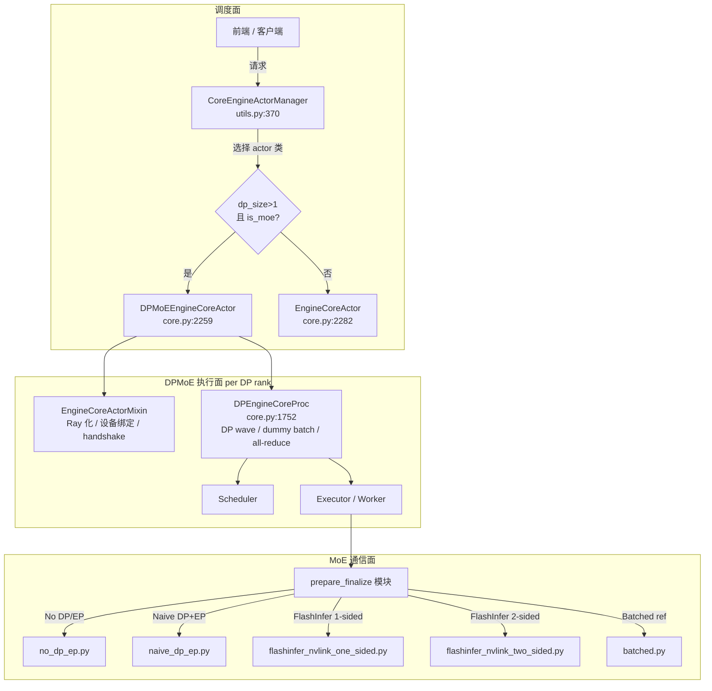
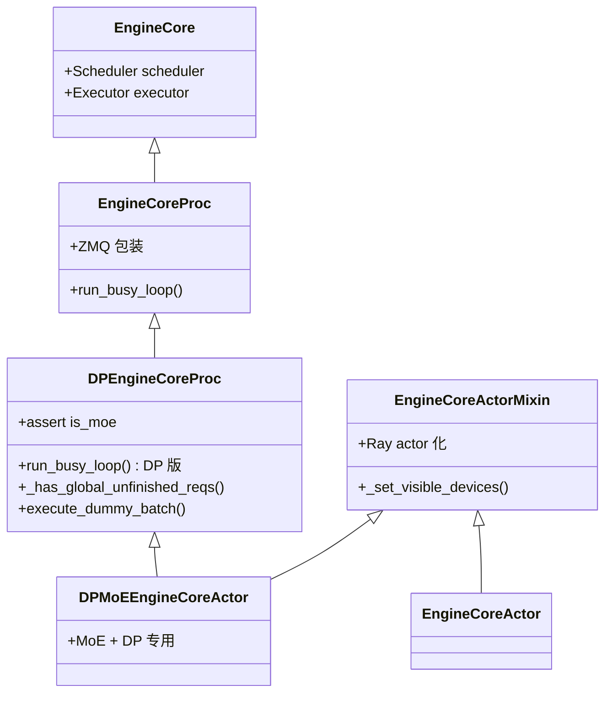
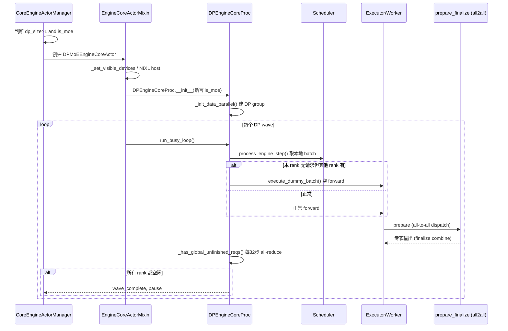

# vLLM DPMoE（Data Parallel MoE）深度解剖（v0.25.1）

> 分析对象：`vllm/v1/engine/core.py` 的 `DPMoEEngineCoreActor`、其父类 `DPEngineCoreProc`、
> 选择逻辑 `vllm/v1/engine/utils.py` 的 `CoreEngineActorManager`、
> 以及 MoE 的 all-to-all 通信实现 `vllm/model_executor/layers/fused_moe/prepare_finalize/`。

## 目录

- [0. 前置知识：DP / EP / TP 与 MoE 并行](#0-前置知识)
- [1. DPMoE 到底是什么场景](#1-dpmoe-到底是什么场景)
- [2. 全景架构概览](#2-全景架构概览)
- [3. EngineCore Actor 类继承体系](#3-enginecore-actor-类继承体系)
- [4. Actor 选择逻辑：何时用 DPMoEEngineCoreActor](#4-actor-选择逻辑)
- [5. DPEngineCoreProc：DPMoE 的真正逻辑载体](#5-dpenginecoreproc)
- [6. DPMoEEngineCoreActor：Ray actor 化与设备绑定](#6-dpmoeenginecoreactor)
- [7. prepare_finalize：MoE all-to-all 的几种拓扑](#7-prepare_finalize)
- [8. 完整调用链时序图](#8-完整调用链时序图)
- [9. 关键数据结构 / 配置速查表](#9-速查表)
- [10. 快速问答 FAQ](#10-faq)

---

## 0. 前置知识：DP / EP / TP 与 MoE 并行

> 本节先做"思想地图"，再看代码落地（source-analyzer Phase 0）。

MoE（Mixture-of-Experts）模型由「共享的注意力/稠密层」+「稀疏的专家层」组成。每个 token 只激活
top-k 个专家，因此专家参数可以分布到多张卡上，引出几种并行维度：

| 维度 | 含义 | 在 MoE 里的角色 |
|------|------|----------------|
| **TP**（Tensor Parallel） | 同一层的权重按 hidden 维切分到多卡，all-reduce 拼回 | 所有层（含专家）都做张量切分 |
| **EP**（Expert Parallel） | 不同专家分布到不同卡；token 经 all-to-all 发往专家所在卡 | MoE 专属：决定专家如何分布 |
| **DP**（Data Parallel） | 模型权重在多个**副本**间复制，各副本独立处理不同请求批次 | 提升吞吐、横向扩展 |
| **PP**（Pipeline Parallel） | 按层切分，多卡流水 | 非本次重点 |

**关键矛盾**：MoE 模型里，「注意力层」是稠密的全副本（天然适合 DP 复制），
但「专家层」已经被 EP 切分到了不同卡上，不再是完整副本。
如果直接对整个 MoE 模型做 DP（每张卡一份完整权重），专家权重会被完整复制，
**显存浪费且失去 EP 的扩展能力**。

于是 vLLM 在 v1 中引入了 **DPMoE** 这一特殊部署形态：
- **注意力部分**走 DP（各 DP rank 持有自己的 KV cache 与 attention 副本）；
- **专家部分**走 EP + 跨 DP 的 all-to-all（token 在 DP rank 之间按专家重新分发）。

也就是说 DPMoE = 「DP 负责 batch/请求维度复制，EP 负责专家维度切分，二者在同一个 rank 集合上叠加」。
每次 MoE 前向，token 既要跨 DP rank 做 all-to-all（把该专家负责的 token 送到对应卡），又要跨 EP 做专家分发。

> 参考：vLLM 官方 Data Parallel Deployment 文档、`All2AllBackend` 配置（parallel.py:40-53）。

---

## 1. DPMoE 到底是什么场景

**一句话**：当 `--data-parallel-size > 1`（启用数据并行）**且**模型是 **MoE**（`model_config.is_moe == True`）时，
vLLM 会启用 DPMoE 路径。普通稠密模型的 DP 用 `EngineCoreActor`，而 MoE 的 DP 必须用 `DPMoEEngineCoreActor`。

触发条件（源码硬约束）：

```python:859:863:vllm/config/parallel.py
if self.data_parallel_size > 1 and self.is_moe_model is False:
    raise ValueError(
        "Offline data parallel mode is not supported/useful"
        " for dense models."
    )
```

而 actor 分派逻辑（`utils.py:397-401`）正对应这个判断：

```python:397:401:vllm/v1/engine/utils.py
actor_class = (
    DPMoEEngineCoreActor
    if dp_size > 1 and vllm_config.model_config.is_moe
    else EngineCoreActor
)
```

**为什么需要专门一个 DPMoE 的 EngineCore actor？**
普通 DP 的 `EngineCoreActor` 只做「独立副本 + 全局完成同步」即可；
而 MoE + DP 的 `DPEngineCoreProc`（DPMoE 的父类）额外需要：

1. **dummy batch 机制**：当某个 DP rank 本地没有可跑的请求、但其他 rank 还有时，
   必须执行一次「空 batch」forward，否则跨 DP 的 all-to-all（MoE 专家通信）会卡住——
   因为 all-to-all 要求所有参与 rank 同时进入通信集合操作。
2. **wave（波次）协调**：所有 DP rank 必须以"波次"为单位对齐 prefill/decode 节奏，
   避免某个 rank 跑得快慢不一导致 all-to-all 死锁或负载倾斜。
3. **跨 DP 全局完成同步**：只有所有 rank 都没有未完成任务时才一起 pause。

这些都属于 **DP + MoE 特有的「集合通信同步」问题**，稠密 DP 不需要，所以单独成类。

---

## 2. 全景架构概览



**各模块职责一句话**：
- `CoreEngineActorManager`：在 Ray 下创建/管理各 DP rank 的 EngineCore actor，按条件选 `DPMoEEngineCoreActor`。
- `EngineCoreActorMixin`：把 EngineCore 包装成 Ray actor，处理 CUDA_VISIBLE_DEVICES、NIXL 旁路 host、handshake。
- `DPEngineCoreProc`：**DPMoE 真正逻辑所在**，负责 wave 协调 + dummy batch + 跨 DP all-reduce。
- `prepare_finalize/*`：MoE 前向里 token 的「分发（prepare）/ 收集（finalize）」all-to-all 实现，按硬件拓扑分多套。

---

## 3. EngineCore Actor 类继承体系



源码中的硬性断言（DP EngineCore 只允许 MoE）：

```python:1766:1768:vllm/v1/engine/core.py
assert vllm_config.model_config.is_moe, (
    "DPEngineCoreProc should only be used for MoE models"
)
```

---

## 4. Actor 选择逻辑

`vllm/v1/engine/utils.py` 的 `CoreEngineActorManager.__init__` 决定用哪个 actor 类（:394-401）：

```python:394:401:vllm/v1/engine/utils.py
from vllm.v1.engine.core import DPMoEEngineCoreActor, EngineCoreActor

dp_size = vllm_config.parallel_config.data_parallel_size
actor_class = (
    DPMoEEngineCoreActor
    if dp_size > 1 and vllm_config.model_config.is_moe
    else EngineCoreActor
)
```

注意 **`use_ray` 才是走 actor 的前提**——这段只在 Ray 后端下执行。MP（多进程）后端则走 `context.Process`
直接拉 `EngineCoreProc`（见 `utils.py:152-210`，那里没有 MoE 分支，因为 MP 模式下 DP 的 busy loop
就是 `DPEngineCoreProc` 本身，无需单独 actor 类）。

另外，每个 DP actor 还会被加上全局 rank 后缀，避免 Ray actor 名 / KV connector engine_id 冲突：

```python:358:367:vllm/v1/engine/utils.py
def _apply_dp_identity_suffix(dp_vllm_config, dp_rank: int) -> None:
    dp_vllm_config.instance_id = f"{dp_vllm_config.instance_id}_dp{dp_rank}"
    if dp_vllm_config.kv_transfer_config is not None:
        dp_vllm_config.kv_transfer_config.engine_id = (
            f"{dp_vllm_config.kv_transfer_config.engine_id}_dp{dp_rank}"
        )
```

---

## 5. DPEngineCoreProc

这是 DPMoE 的**核心逻辑载体**（Ray actor 只是把它包了一层）。关键成员：

| 行号 | 名称 | 作用 |
|------|------|------|
| :1775-1777 | `step_counter` / `current_wave` / `last_counts` | 跨 DP rank 的步数 / 波次同步 |
| :1784-1785 | `pending_pause` / `ignore_start_dp_wave` | 两阶段 DP-aware pause 协议状态 |
| :1804-1818 | `_init_data_parallel()` | 断言 `dp_size > 1`，建 stateless DP process group（gloo） |
| :1843-1857 | `add_request()` | wave 感知的请求接收 |
| :1859-1882 | `resume_scheduler()` | all-reduce barrier 同步恢复 |
| :1923-1930 | `_should_throttle_prefills()` | 用 `prefill_schedule_interval` 对齐各 rank prefill 节奏 |
| **:1932-1990** | **`run_busy_loop()`** | **DPMoE 核心：dummy batch + wave 协调** |
| :1992-2009 | `_has_global_unfinished_reqs()` | 每 32 步做一次跨 DP all-reduce |

### 5.1 dummy batch 机制（DPMoE 存在的根本原因）

```python:1950:1968:vllm/v1/engine/core.py
executed = self._process_engine_step()
local_unfinished_reqs = self.scheduler.has_unfinished_requests()
if not executed:
    if not local_unfinished_reqs and not self.engines_running:
        # All engines are idle.
        continue
    # Execute a dummy pass when no ready requests ran, unless the
    # engine is sleeping.
    elif not self.model_executor.is_sleeping:
        with self.log_iteration_details(None):
            self.execute_dummy_batch()

# 3) All-reduce operation to determine global unfinished reqs.
self.engines_running = self._has_global_unfinished_reqs(
    local_unfinished_reqs
)
```

**为什么必须 dummy batch？**
MoE 前向包含跨 DP rank 的 **all-to-all**（`prepare_finalize`）。集合通信要求**所有参与 rank 同时进入**。
如果 rank A 本地有请求、rank B 本地没有，B 若直接跳过 forward，A 的 all-to-all 会永远等不到 B → 死锁。
因此 B 即使没活干，也要跑一次 `execute_dummy_batch()`（空 token 的 forward），让 all-to-all 能成对完成。

### 5.2 全局完成同步（带 32 步优化）

```python:1992:2009:vllm/v1/engine/core.py
def _has_global_unfinished_reqs(self, local_unfinished: bool) -> bool:
    # Optimization - only perform finish-sync all-reduce every 32 steps.
    self.step_counter += 1
    if self.step_counter % 32 != 0:
        return True
    has_unfinished, pause_consensus = ParallelConfig.sync_dp_state(
        self.dp_group,
        has_unfinished=local_unfinished,
        pending_pause=self.pending_pause,
    )
    if pause_consensus:
        self.ignore_start_dp_wave = True
        self.pending_pause = False
    return has_unfinished
```

每 32 步才做一次跨 DP all-reduce（性能优化），平时保守返回 `True`（假设还有活），避免每次迭代都通信。

---

## 6. DPMoEEngineCoreActor

```python:2259:2281:vllm/v1/engine/core.py
class DPMoEEngineCoreActor(EngineCoreActorMixin, DPEngineCoreProc):
    """Used for MoE model data parallel cases."""

    def __init__(self, vllm_config, local_client, addresses,
                 executor_class, log_stats, dp_rank=0, local_dp_rank=0):
        vllm_config.parallel_config.data_parallel_rank = dp_rank  # L2272 保留真实 DP rank
        EngineCoreActorMixin.__init__(self, vllm_config, addresses, dp_rank, local_dp_rank)
        DPEngineCoreProc.__init__(self, vllm_config, local_client, "", executor_class, log_stats)
```

### 6.1 多重继承职责划分
- `EngineCoreActorMixin`：提供 Ray actor 生命周期——tracer 初始化、CUDA 设备绑定、NIXL 旁路 host、
  handshake（Ray 下是空操作，地址已知）、`wait_for_init()`、`run()`（调 `run_busy_loop`）。
- `DPEngineCoreProc`：提供 DPMoE 的业务逻辑（wave、dummy batch、all-reduce）。

### 6.2 设备绑定（Ray 下特有痛点）

```python:2150:2169:vllm/v1/engine/core.py
self._set_nixl_side_channel_host()
# ...（长注释解释 Ray 下 CUDA_VISIBLE_DEVICES 必须尽早设置的原因）
self._set_visible_devices(vllm_config, local_dp_rank)
```

Ray 会按 `num_gpus` 自动设 `CUDA_VISIBLE_DEVICES`，但这个值是 **sticky** 的，且 Ray worker 索引它时可能越界。
因此 DPMoE actor 在 `__init__` 最早期就通过 `_set_assigned_physical_gpu_ids` 把本 DP rank 的物理 GPU 映射
写回 `vllm_config.parallel_config.assigned_physical_gpu_ids`（core.py:2192-2215），确保后续 vLLM worker 正确绑定。

NIXL 旁路 host 也需在 actor 内重设（driver 端的值不会自动传给 Ray actor）：

```python:2171:2179:vllm/v1/engine/core.py
@staticmethod
def _set_nixl_side_channel_host():
    import ray
    os.environ.setdefault(
        "VLLM_NIXL_SIDE_CHANNEL_HOST", ray.util.get_node_ip_address()
    )
```

---

## 7. prepare_finalize：MoE all-to-all 的几种拓扑

MoE 前向里，`prepare`（dispatch，把 token 按专家路由发到对应 rank）和 `finalize`（combine，把专家输出收回）
由 `prepare_finalize` 模块实现。不同 DP/EP 拓扑用不同后端：

| 文件 | 类名 | 适用场景 | 关键点 |
|------|------|----------|--------|
| `no_dp_ep.py` | `MoEPrepareAndFinalizeNoDPEPModular` | **无 DP/EP**（单卡或纯 TP 的 MoE） | 不需要跨 rank all-to-all，`activation_format=Standard` |
| `naive_dp_ep.py` | （naive DP+EP） | 通用 DP+EP，用朴素 all-to-all | 需要 `get_ep_group()`，dispatch 前量化并按 EP group 分发 |
| `flashinfer_nvlink_one_sided.py` | `FlashInferNVLinkOneSidedPrepareAndFinalize` | NVLink + FlashInfer 单边 all-to-all（高吞吐） | 用 `All2AllManagerBase`，`get_chunk_sizes_across_dp_rank()` 切分 token |
| `flashinfer_nvlink_two_sided.py` | `FlashInferNVLinkTwoSidedPrepareAndFinalize` | NVLink + FlashInfer 双边（MNNVL 多节点） | 同上但双边通信，基类 |
| `batched.py` | `BatchedPrepareAndFinalize` | 参考实现，token 重排成 `E × max_tokens × K` 格式 | 供 batched dispatch/combine kernel 使用 |

对应 `All2AllBackend` 配置（parallel.py:40-53）：
- `"allgather_reducescatter"`（默认）
- `"deepep_high_throughput"` / `"deepep_low_latency"`
- `"nixl_ep"`
- `"flashinfer_nvlink_two_sided"` / `"flashinfer_nvlink_one_sided"` / `"flashinfer_all2allv"`
- `"mori_high_throughput"` / `"mori_low_latency"`

**与 DPMoE 的关系**：DPMoE 场景（DP>1 且 MoE）下，MoE 专家通信会跨 DP rank 做 all-to-all，因此会选择
DP+EP 感知的 prepare_finalize 实现（如 `naive_dp_ep` 或 FlashInfer NVLink 系列）。这正解释了为什么
`DPEngineCoreProc` 必须保证所有 rank 同步进入 forward（dummy batch）——否则这些 all-to-all 无法成对完成。

此外 `parallel.py:659-668` 还有一个相关属性 `use_batched_dp_moe`（注意：它控制的是 kernel 的 batched 形态，
不是选择 `DPMoEEngineCoreActor` 的条件）：

```python:659:668:vllm/config/parallel.py
@property
def use_batched_dp_moe(self) -> bool:
    return (
        self.all2all_backend
        in ("deepep_low_latency", "nixl_ep")
        and self.enable_expert_parallel
        and self.data_parallel_size > 1
    )
```

---

## 8. 完整调用链时序图



---

## 9. 速查表

| 数据结构 / 配置 | 关键字段 | 作用 |
|------|------|------|
| `DPMoEEngineCoreActor` | 多重继承（Mixin + Proc） | MoE + DP>1 的 Ray actor |
| `DPEngineCoreProc` | `current_wave`, `step_counter`, `engines_running` | DP wave 协调状态 |
| `ParallelConfig.data_parallel_size` | int | 触发 DPMoE 的开关之一（需 >1） |
| `ModelConfig.is_moe` | bool | 触发 DPMoE 的开关之二 |
| `ParallelConfig.all2all_backend` | All2AllBackend | 选择 prepare_finalize 实现 |
| `ParallelConfig.use_batched_dp_moe` | bool（property） | 是否用 batched DP-MoE kernel 形态 |
| `EngineCoreActorMixin._set_assigned_physical_gpu_ids` | → `assigned_physical_gpu_ids` | Ray 下 DP rank 的 GPU 绑定 |

---

## 10. FAQ

**Q1：DPMoE 是一个独立的并行策略（feature flag）吗？**
不是。代码里没有 `enable_dp_moe` 之类的开关。`DPMoE` 只是 `DPMoEEngineCoreActor` 类名里的词，
表达「MoE 模型的数据并行场景」。触发条件是 `data_parallel_size > 1 and model_config.is_moe`
（见 utils.py:397-401 与 parallel.py:859-863）。

**Q2：为什么 MoE 的 DP 不能用普通 EngineCoreActor？**
因为 MoE 前向含跨 DP rank 的 all-to-all，需要所有 rank 同步进入 forward（dummy batch）并做 wave 对齐，
普通 DP actor 不具备这套集合通信同步逻辑，会死锁。

**Q3：dummy batch 会不会浪费算力？**
会跑一次空 forward，但这是为了满足 all-to-all 的集合通信语义必须的。vLLM 通过「每 32 步才 all-reduce 一次」
和「全部空闲才 pause」来减少不必要的同步开销。

**Q4：`prepare_finalize` 那么多文件，怎么选？**
由 `all2all_backend` 配置决定：无 DP/EP 用 `no_dp_ep`；通用 DP+EP 用 `naive_dp_ep`；NVLink 机器用
FlashInfer 单边/双边；`batched.py` 是参考实现。`use_batched_dp_moe` 进一步决定是否用 batched kernel 形态。

**Q5：MP 后端也有 DPMoE 吗？**
有，但形态不同。MP 下 `utils.py:152-210` 直接 `context.Process` 拉 `DPEngineCoreProc`（它本身就是
DP 版的 busy loop），不需要单独的 actor 子类；只有 Ray 后端才用 `DPMoEEngineCoreActor` 这个 actor 包装。
