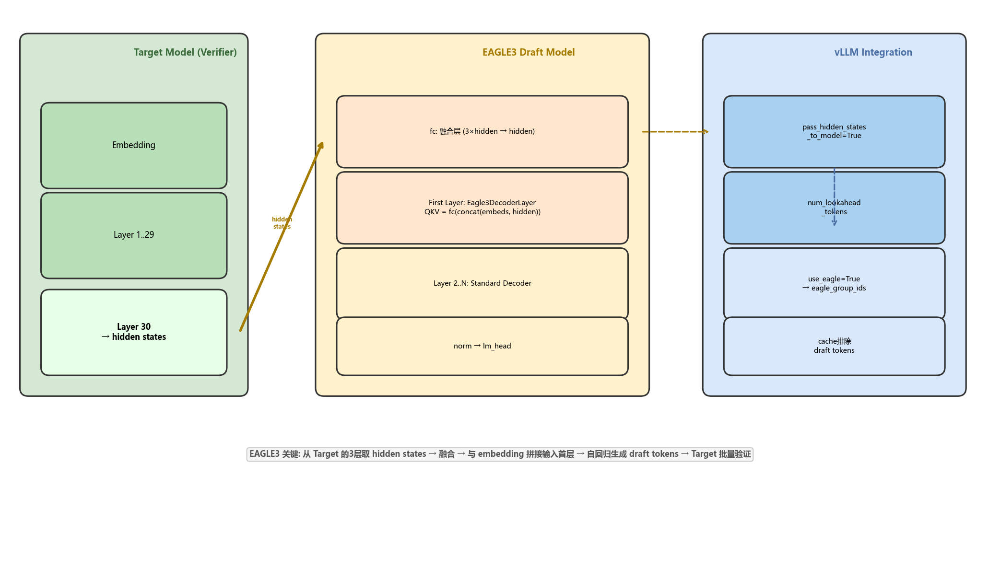
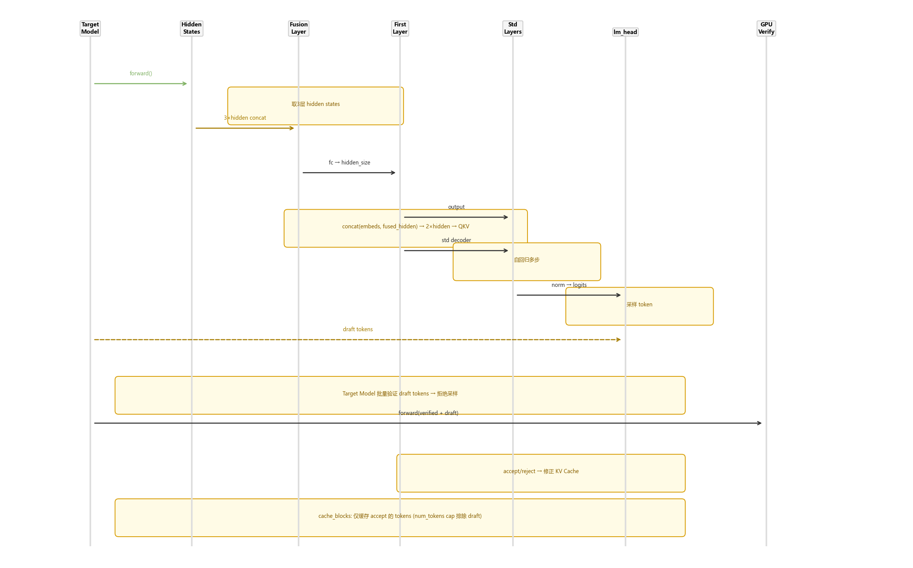
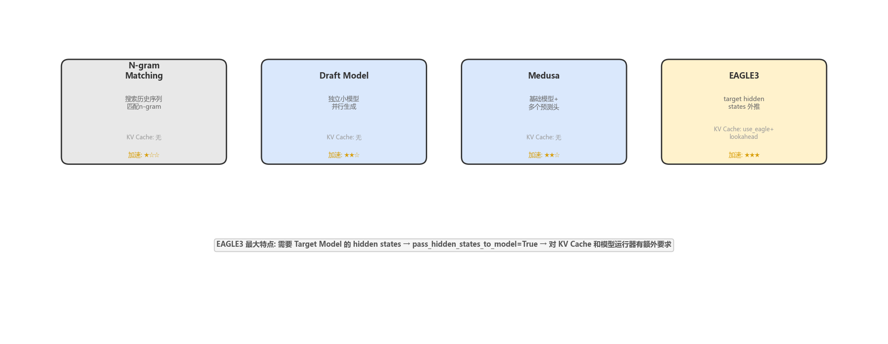

# vLLM EAGLE3 推测解码深度解剖

> 版本：vLLM V1 (2026-07)
> 核心文件：`vllm/v1/spec_decode/`、`vllm/v1/core/kv_cache_manager.py`、`vllm/v1/core/sched/async_scheduler.py`
> 前置阅读：[推测解码 KV Cache 集成](./spec_decode_kv_cache.md) | [allocate_slots 深度解剖](./allocate_slots_deep_dive.md)

## 目录

- [0. 前置知识：EAGLE3 是什么](#0-前置知识eagle3-是什么)
- [1. EAGLE3 模型架构](#1-eagle3-模型架构)
- [2. EAGLE3 在 vLLM 的完整推理流程](#2-eagle3-在-vllm-的完整推理流程)
- [3. KV Cache 的 EAGLE3 适配](#3-kv-cache-的-eagle3-适配)
- [4. 与其他推测解码方案的对比](#4-与其他推测解码方案的对比)
- [5. 关键代码集成点](#5-关键代码集成点)
- [6. FAQ](#6-faq)

---

## 0. 前置知识：EAGLE3 是什么

### 0.1 推测解码的核心矛盾

传统 decode 每步只生成 1 个 token —— GPU 利用率极低。推测解码通过"先猜后验"提速：

```
传统: [T1] → [T2] → [T3] → [T4]     (4 forwarded passes)
推测: [T1,T2,T3] → 验证 → accept 3     (1 forwarded pass!)
```

但关键问题是：**用什么来"猜"？** 不同方案的回答不同——N-gram 用历史匹配，Draft Model 用小模型，而 EAGLE3 用 **Target Model 自身的 hidden states**。

### 0.2 EAGLE3 的独特价值

EAGLE3（Extrapolation Algorithm for Greater Language-model Efficiency v3）是推测解码系列的最新一代（EAGLE → EAGLE2 → EAGLE3），其核心创新：

| 维度 | EAGLE/EAGLE2 | EAGLE3 |
|------|-------------|--------|
| Hidden states 来源 | 单一层 | **3 层拼接 + 融合层** |
| 首层输入 | embedding only | **embedding + fused hidden states（2×hidden_size）** |
| 训练损失 | cross-entropy | **KL 散度 + 指数衰减** |
| 加速效果 | 2-3x | **2-4x（SpecDecode-Bench 全能冠军）** |

### 0.3 为什么 EAGLE3 需要"改造 KV Cache"

EAGLE3 的特殊性在于：Draft Model 的输入包含 Target Model 的 hidden states。这意味着 **Target Model 必须执行到指定层**才能提取 hidden states → 目标模型的 KV Cache 必须保持完整 → 分配 lookahead slots 容纳 draft tokens → 但又不能缓存 draft 的 KV Cache。

---

## 1. EAGLE3 模型架构



### 1.1 模型结构

EAGLE3 Draft Model = 一个小型 Transformer 解码器，层数通常为 4-8 层，hidden_size 与 Target Model 相同或更小。

```
Eagle3DraftModel:
  ├── embed_tokens          → 从 Target Model 直接加载 (是否训练由 config 控制)
  ├── fc (融合层)            → Linear(3×hidden_size, hidden_size)
  ├── Layer 0 (First Layer)  → 特殊结构: QKV 投影接受 2×hidden_size
  ├── Layer 1..N-1           → 标准 Transformer Decoder
  └── norm + lm_head         → 输出 logits
```

### 1.2 融合层（Fusion Layer）

```python
# 从 Target Model 的 3 个不同层提取 hidden states
h1 = target_model.layers[10].output_hidden_state  # 例: 层10
h2 = target_model.layers[20].output_hidden_state  # 例: 层20
h3 = target_model.layers[30].output_hidden_state  # 例: 层30

# 拼接 → 线性投影
fused = fc(concat(h1, h2, h3))  # 3×hidden_size → hidden_size
```

### 1.3 First Layer 的特殊设计

首层不同于标准 Transformer：它的 QKV 投影接受 **embedding + fused hidden states 的拼接**（2×hidden_size 输入）。这让模型同时利用：
- **当前 token 的语义**（来自 embedding）
- **Target Model 的深层理解**（来自 fused hidden states）

```python
class Eagle3FirstLayer:
    def forward(self, embeds, hidden):
        # 分别归一化
        embeds_norm = self.input_layernorm(embeds)
        hidden_norm = self.hidden_norm(hidden)
        
        # 拼接后送入自注意力
        combined = concat(embeds_norm, hidden_norm)  # 2×hidden_size
        q, k, v = self.qkv_proj(combined)
        # ... 标准 attention + FFN
```

---

## 2. EAGLE3 在 vLLM 的完整推理流程



### Step-by-step

```
Step 1: Target Model Forward (第 N-1 层)
  → 提取 hidden states 从 3 个指定层

Step 2: 融合层 (Fusion Layer)
  → concat(3×hidden) → fc → fused_hidden (hidden_size)

Step 3: EAGLE3 Draft Model 自回归生成
  → 首层: concat(embeds, fused_hidden) → 特殊QKV
  → 后续层: 标准 decoder
  → norm → lm_head → sample → draft_token_1

Step 4: 迭代生成更多 draft tokens
  → 新增 token 的 embedding 作为下一轮的输入
  → 重复 Step 3, 每次生成 1 个新 draft token
  → 共生成 num_spec_tokens 个 draft tokens

Step 5: Target Model 批量验证
  → 将 verified_tokens + draft_tokens 一起送 GPU
  → 拒绝采样算法判定 accept/reject
  → 如果全部 accept → 额外 bonus token

Step 6: 状态修正
  → num_computed_tokens 回退到 accept 位置
  → cache_blocks 仅缓存到 num_tokens (排除 refused drafts)
```

---

## 3. KV Cache 的 EAGLE3 适配

### 3.1 初始化：use_eagle 标志

```python
# kv_cache_manager.py:139
self.use_eagle = use_eagle  # 传给 coordinator

# kv_cache_coordinator.py:100
self.eagle_group_ids = {
    i for i, g in enumerate(kv_cache_groups)
    if isinstance(g.kv_cache_spec, FullAttentionSpec)
}
```

标记哪些 KV cache group 是 Full Attention —— EAGLE3 只在 Full Attention 层需要完整保留 cache。

### 3.2 分配阶段：num_lookahead_tokens

```python
# scheduler → allocate_slots
num_lookahead_tokens = num_spec_tokens  # EAGLE3 draft token 数

# kv_cache_manager.py:393-396
num_tokens_need_slot = min(
    num_tokens_main_model + num_lookahead_tokens,  # 额外预留 slot
    max_model_len,
)
```

### 3.3 缓存保护：排除 draft tokens

```python
# kv_cache_manager.py:458-464
num_tokens_to_cache = min(
    total_computed_tokens + num_new_tokens,
    request.num_tokens,  # cap: 只包含 prompt + verified tokens
)
coordinator.cache_blocks(request, num_tokens_to_cache)
```

### 3.4 Worker 侧：hidden state 传递

```python
# GPUModelRunner 初始化
self.pass_hidden_states_to_model = True  # EAGLE3 必需

# 前向传播时
hidden_states = target_model.forward(token_ids)
# hidden_states 传给 EAGLE3 Draft Model
draft_logits = eagle3_model.forward(embeds, hidden_states)
```

### 3.5 异步调度下的占位

```python
# AsyncScheduler._update_after_schedule()
request.spec_token_ids = self._spec_token_placeholders  # [-1, -1, ...]
request.num_output_placeholders += (sampled + spec_tokens)
# Worker 侧在 execute 前替换为真实值
```

---

## 4. 与其他推测解码方案的对比



| 维度 | N-gram | Draft Model | Medusa | EAGLE3 |
|------|--------|-------------|--------|--------|
| **提议方式** | 历史匹配 | 独立小模型 | 多预测头 | hidden states 外推 |
| **KV Cache 需求** | 无额外 | 无额外 | 无额外 | use_eagle + lookahead slots |
| **Worker 改造** | 无 | 加载 extra model | 加载 extra heads | pass_hidden_states + eagle3 model |
| **加速效果** | 1.2-1.5x | 1.5-2x | 1.5-2x | 2-4x |
| **训练成本** | 零 | 中等 | 低 | 较高 |
| **部署复杂度** | 最低 | 中 | 中 | 高 |

---

## 5. 关键代码集成点

| 文件 | 关键内容 |
|------|---------|
| `vllm/v1/spec_decode/eagle.py` | EAGLE proposer: draft token 生成逻辑 |
| `vllm/v1/spec_decode/rejection_sampler.py` | 拒绝采样算法: accept/reject 判定 |
| `vllm/v1/worker/gpu/model_runner.py` | `init_speculator()`, `pass_hidden_states_to_model` |
| `vllm/v1/worker/gpu/input_batch.py` | `num_draft_tokens`, `expanded_idx_mapping` |
| `vllm/v1/core/kv_cache_manager.py` | `use_eagle`, `num_lookahead_tokens`, `num_tokens cap` |
| `vllm/v1/core/sched/async_scheduler.py` | `_spec_token_placeholders`, `num_output_placeholders` |
| `vllm/v1/core/single_type_kv_cache_manager.py` | `use_eagle` flag + eagle_group_ids 路由 |
| `speculators` 库 (独立 repo) | Eagle3DraftModel 训练 + 转换器 |

---

## 6. FAQ

**Q1: EAGLE3 为什么比 EAGLE2 更快？**

三个原因：(1) 3 层 hidden states 拼接比单层信息更丰富；(2) 首层 2×hidden_size 输入让 draft model 同时感知 token 语义和上下文；(3) KL 散度损失 + 指数衰减让训练更关注早期步骤的正确性。

**Q2: EAGLE3 对 GPU 显存有什么额外要求？**

Draft Model 的权重（通常 4-8 层 × hidden_size² 参数量）+ hidden states 传输显存。典型：Target 为 7B 模型时，EAGLE3 draft model 约 500M 额外参数。

**Q3: pass_hidden_states_to_model 如何影响 KV Cache？**

需要从 Target Model 的中间层提取 hidden states → 目标模型的 forward 不能跳过中间层 → KV Cache 保持完整。用 `eagle_group_ids` 标记 Full Attention 层确保这些层的 cache 不被滑动窗口截断。

**Q4: 如果所有 draft tokens 都被拒绝怎么办？**

拒绝采样保证：从修正后的分布重新采样 1 个 token。这次 forward pass 相当于只生成了 1 个 token（和传统 decode 一样），没有加速，但也不损失输出质量。

---

*报告生成时间: 2026-07-13 | 工具: source-analyzer skill*
