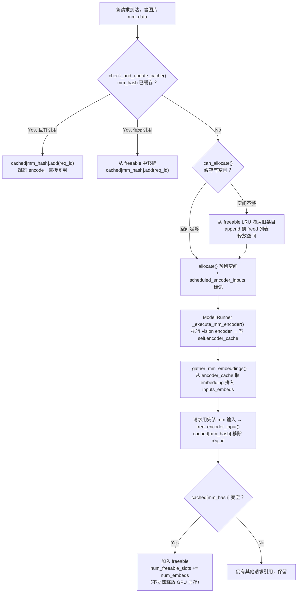
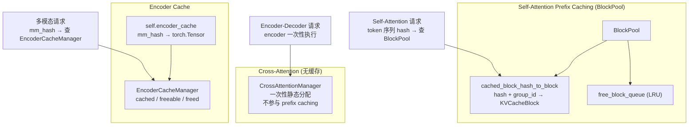

# vLLM Encoder 集成机制深度解剖

> **Mermaid 图渲染**：GitHub / GitLab 原生支持；VS Code 安装 "Markdown Preview Mermaid Support" 插件；**PyCharm 安装 "Mermaid" 插件**（Settings → Plugins → 搜索 Mermaid）即可在预览中渲染。

## 目录

1. [前置：两种 Encoder 的根本区别](#1-前置两种-encoder-的根本区别)
2. [多模态 Encoder：Vision/Audio Encoder 集成](#2-多模态-encodervisionaudio-encoder-集成)
3. [Encoder Cache：独立于 Prefix Caching 的缓存体系](#3-encoder-cache独立于-prefix-caching-的缓存体系)
4. [Encoder 调度机制](#4-encoder-调度机制)
5. [Encoder-Decoder 模型：Cross-Attention KV Cache](#5-encoder-decoder-模型cross-attention-kv-cache)
6. [EncoderOnlyAttentionSpec：纯 Encoder 层](#6-encoderonlyattentionspec纯-encoder-层)
7. [两套缓存体系对比](#7-两套缓存体系对比)
8. [关键代码路径速查](#8-关键代码路径速查)
9. [FAQ](#9-faq)

---

## 1. 前置：两种 Encoder 的根本区别

vLLM 中有两类 Encoder，架构和集成方式完全不同：

| | 多模态 Encoder | Encoder-Decoder |
|---|---|---|
| **代表模型** | LLaVA, Qwen2-VL, InternVL | Whisper, BART |
| **Encoder 做什么** | 图片/音频 → embedding tensor | 音频/文本 → cross-attention KV Cache |
| **Decoder 做什么** | LLM 自回归生成（self-attention only） | 自回归生成 + cross-attention |
| **Encoder 输出放哪** | 直接替换 decoder 输入的占位 token embedding | 作为 decoder cross-attention 的 K/V |
| **需要 KV Cache？** | ❌ Encoder 自身不需要 | ✅ cross-attention 需要 KV Cache |
| **用什么 Manager** | 不需要（encoder 无状态） | `CrossAttentionManager` |
| **用什么 Spec** | — | `CrossAttentionSpec` |

---

## 2. 多模态 Encoder：Vision/Audio Encoder 集成

### 2.1 工作原理

多模态 encoder（如 CLIP ViT、SigLIP）的输出是**已经算好的 embedding**，直接注入到 LLM 的输入序列中：

```
文本输入: "请描述这张图片 <image> 的内容"
                        ↓
         tokenizer → [请, 描述, 这, 张, 图, 片, <|image|>, 的, 内, 容]
                        ↓
         <|image|> 位置的 token_id → 被 vision encoder 的输出 embedding 替换
                        ↓
         inputs_embeds: [text_emb, text_emb, ..., image_emb, ..., text_emb]
                        ↓
         LLM forward(inputs_embeds)
```

**核心**：Encoder 是一次性的 stateless 计算，不需要维护 KV Cache。它的输出直接拼到 LLM 的 embedding 层输入中。

### 2.2 在 Model Runner 中的执行

**文件**: `vllm/v1/worker/gpu_model_runner.py:2940-3147`

```python
def _execute_mm_encoder(self, scheduler_output):
    # 1. 从 scheduler 批量收集待编码的 mm 输入
    mm_hashes, mm_kwargs, mm_lora_refs = self._batch_mm_inputs_from_scheduler(...)
    
    # 2. "prompt_embeds" 是直通 modality（已经是 embedding），直接写缓存
    for i in pe_indices:
        self.encoder_cache[mm_hashes[i]] = pe_tensor.to(self.device)
    
    # 3. 对需要真正 encode 的 inputs，走 CUDA Graph 或直接调用
    if self.encoder_cudagraph_manager:
        batch_outputs = self.encoder_cudagraph_manager(model.embed_multimodal, ...)
    else:
        batch_outputs = model.embed_multimodal(**mm_kwargs_batch)
    
    # 4. 缓存结果
    for mm_hash, output in zip(mm_hashes, encoder_outputs):
        self.encoder_cache[mm_hash] = output
```

### 2.3 Encoder CUDA Graph

**文件**: `vllm/v1/worker/encoder_cudagraph.py`

类似 decoder CUDA Graph，为常见的 encoder batch size 预录制 CUDA Graph 以加速 encoder 前向。由 `encoder_cudagraph_manager` 管理。

---

## 3. Encoder Cache：独立于 Prefix Caching 的缓存体系

> **关键认识**：Encoder Cache 和 Self-Attention 的 Prefix Caching 是两套**完全独立**的缓存机制。

### 3.1 数据结构

**Model Runner 端** (`gpu_model_runner.py:559`)：

```python
self.encoder_cache: dict[str, torch.Tensor] = {}
# mm_hash (多模态数据的 hash) → encoder 输出 tensor (GPU 显存中)
```

**Scheduler 端** (`encoder_cache_manager.py:17`)：

```python
class EncoderCacheManager:
    def __init__(self, cache_size: int):
        self.cache_size = cache_size           # 缓存容量（按 encoder embedding 数）
        self.num_free_slots = cache_size       # 当前空闲容量
        self.num_freeable_slots = cache_size   # 可回收容量
        self.cached: dict[str, set[str]] = {}  # mm_hash → {引用它的 req_id 集合}
        self.freeable: OrderedDict[str, int]   # mm_hash → num_embeds（零引用的条目）
        self.freed: list[str] = []             # 本轮实际被淘汰的 mm_hash
```

### 3.2 缓存生命周期



### 3.3 与 Prefix Caching (BlockPool) 的根本区别

| 维度 | Prefix Caching (Self-Attention) | Encoder Cache |
|------|-------------------------------|---------------|
| **缓存什么** | 增量 token 序列的 KV Cache block | 一次性的 encoder 输出 tensor |
| **粒度** | 16 tokens/block（hash block_size） | 整张图/整段音频 |
| **存储位置** | BlockPool 管理的物理显存 block | `self.encoder_cache` dict（独立 tensor） |
| **淘汰策略** | BlockPool LRU (`free_block_queue`) | `EncoderCacheManager` LRU (`freeable`) |
| **管理器** | `BlockPool` | `EncoderCacheManager` |
| **跨请求共享** | 相同 token 前缀 ⇒ 共享 KVCacheBlock | 相同图片 ⇒ 共享 encoder output tensor |
| **运行层面** | Scheduler + Core 层 | Scheduler + Model Runner 层 |

---

## 4. Encoder 调度机制

### 4.1 调度入口

**文件**: `vllm/v1/core/sched/scheduler.py:491-507`（prefill）和 `845-858`（decode）

在调度循环中，每处理一个请求，先尝试调度其 encoder 输入：

```python
# schedule() 主循环中，每个请求依次处理：
if request.has_encoder_inputs:
    encoder_inputs_to_schedule, num_new_tokens, new_encoder_compute_budget, \
        external_load_encoder_input = self._try_schedule_encoder_inputs(
            request, num_computed_tokens, num_new_tokens, encoder_compute_budget
        )
    if num_new_tokens == 0:
        # encoder 无法调度 → 请求本轮不能执行，break
        break
```

`encoder_compute_budget` 是全局共享的，每步从 `max_num_encoder_input_tokens` 开始递减，被该步所有请求的 encoder 输入消耗。

### 4.2 _try_schedule_encoder_inputs 详细流程

**文件**: `vllm/v1/core/sched/scheduler.py:1315-1473`

```python
def _try_schedule_encoder_inputs(request, num_computed_tokens, num_new_tokens,
                                  encoder_compute_budget):
    encoder_inputs_to_schedule = []
    
    # 1. 确定本轮需要处理的多模态输入范围
    lo, hi = get_mm_features_in_window(
        mm_features,
        start=num_computed_tokens,
        end=num_computed_tokens + num_new_tokens
    )
    # 对于 encoder-decoder: lo=0（所有输入在位置 0）
    
    for i in range(lo, hi):
        # 2. 已在 EncoderCacheManager 缓存中？→ 跳过
        if self.encoder_cache_manager.check_and_update_cache(request, i):
            continue
        
        # 3. ECConnector 远端已有？→ 跳过（标记为 external_load）
        if self.ec_connector and ...:
            external_load_encoder_input.append(i)
            continue
        
        # 4. 检查 budget 和缓存空间
        if not self.encoder_cache_manager.can_allocate(
            request, i, encoder_compute_budget, num_embeds_to_schedule
        ):
            # 不够 → num_new_tokens 回退到该 mm 输入之前
            num_new_tokens = max(0, start_pos - num_computed_tokens)
            break
        
        # 5. 可以调度
        num_embeds_to_schedule += num_encoder_embeds
        encoder_compute_budget -= num_encoder_embeds
        encoder_inputs_to_schedule.append(i)
    
    return encoder_inputs_to_schedule, num_new_tokens, encoder_compute_budget, ...
```

### 4.3 分块多模态处理（Chunked MM Input）

对于超大图片（如 4096 tokens），可以跨多个 step 处理：

```
Step 1: num_computed_tokens=0, num_new_tokens=10
  → 图片从 token 0 开始，占 3000 tokens
  → encoder_compute_budget 不够（假设 budget=1000）
  → num_new_tokens 回退到 0，只跑 encoder 不跑 decoder

Step 2: num_computed_tokens=0, num_new_tokens=10
  → encoder 已执行，encoder_cache 命中
  → 正常执行 decoder ← 这次 encoder 输出才真正被用到
```

---

## 5. Encoder-Decoder 模型：Cross-Attention KV Cache

### 5.1 CrossAttentionSpec

**文件**: `vllm/v1/kv_cache_interface.py:717-726`

```python
class CrossAttentionSpec(AttentionSpec):
    def max_memory_usage_bytes(self, vllm_config):
        max_encoder_len = scheduler_config.max_num_encoder_input_tokens
        # 例如 Whisper: max_encoder_len=1500, block_size=16
        # → 94 个 block
        return cdiv(max_encoder_len, self.block_size) * self.page_size_bytes
```

- Encoder 输出长度固定（如 Whisper 1500 tokens），所以 cross-attention KV cache 所需的 block 数是**静态可计算的**
- Block 分配是一次性的，因为 `num_encoder_tokens` 在整个请求生命周期内不变

### 5.2 CrossAttentionManager：为什么禁用 Prefix Caching

**文件**: `vllm/v1/core/single_type_kv_cache_manager.py:1461-1521`

```python
class CrossAttentionManager(SingleTypeKVCacheManager):
    def cache_blocks(self, ...):
        raise ValueError("Should not be called as prefix caching is disabled.")
    
    def get_num_common_prefix_blocks(self, ...):
        return 0  # cross-attention blocks 不跨请求共享
    
    def find_longest_cache_hit(self, ...):
        raise NotImplementedError("CrossAttentionManager does not support caching")
```

**三个根本原因**（代码 line 1515-1519）：

> 1. Encoder states are unique per request (different audio/image inputs)
> 2. Encoder states are computed once per request, not incrementally
> 3. No reusable prefix exists between different multimodal inputs

- ❌ 请求 A 的音频 encoder 输出 ≠ 请求 B 的音频 encoder 输出（内容不同）
- ❌ 不像 self-attention 那样 token 逐个增量产生，encoder 输出是**一次全量**计算
- ❌ 不同图片/音频之间没有"公共前缀"的概念

**因此**：cross-attention 虽然从 BlockPool 分配 block，但完全不走 prefix caching 路径。Block 分配是一次性静态分配，请求结束后直接释放。

### 5.3 Scheduler 中的特殊处理

**文件**: `vllm/v1/core/kv_cache_coordinator.py:134-182`

```python
# get_num_blocks_to_allocate 中：
if isinstance(manager, CrossAttentionManager):
    # CrossAttention 是一次性静态分配：encoder token 数固定，
    # 不参与 prefix caching，不需要增量分配
    num_blocks_to_allocate += manager.get_num_blocks_to_allocate(
        request_id, num_encoder_tokens, [], 0, num_encoder_tokens
    )
```

**文件**: `vllm/v1/core/sched/scheduler.py:1362-1387`

```python
# Encoder-decoder 模型：所有输入 start_pos=0
if self.is_encoder_decoder:
    lo = 0
    if num_computed_tokens > 0:
        # 已经执行过 encoder → 跳过
        continue
```

Encoder 只在 prefill 第一步执行，`num_computed_tokens > 0` 后不再重复。

### 5.4 Block 裁剪时的跳过

**文件**: `vllm/v1/core/kv_cache_manager.py:634-639`

```python
# 裁剪 block_ids 时跳过 CrossAttention 和 EncoderOnly 类型：
# 它们的 block 语义不同于普通 attention
if isinstance(spec, (CrossAttentionSpec, EncoderOnlyAttentionSpec)):
    continue  # 不裁剪
```

---

## 6. EncoderOnlyAttentionSpec：纯 Encoder 层

**文件**: `vllm/v1/kv_cache_interface.py:709-713`

```python
class EncoderOnlyAttentionSpec(AttentionSpec):
    def max_memory_usage_bytes(self, vllm_config) -> int:
        return 0  # Encoder-only layers do not need KV cache
```

- 用于纯 encoder 层的 self-attention（如 ViT 内部），不需要维护 KV Cache
- 返回 0 意味着不参与 BlockPool 的显存分配
- GPU 端 block_table 和 slot_mapping 全部填 0

与 `CrossAttentionSpec` 一样，在 block 裁剪时会被跳过。

---

## 7. 两套缓存体系对比



---

## 8. 关键代码路径速查

| 组件 | 文件 | 行号 | 职责 |
|------|------|------|------|
| `EncoderCacheManager` | `vllm/v1/core/encoder_cache_manager.py` | 17-266 | encoder 输出缓存管理（Scheduler 层） |
| `EncoderDecoderCacheManager` | `vllm/v1/core/encoder_cache_manager.py` | 323-381 | enc-dec 模型简化版（暂不使用缓存） |
| `CrossAttentionManager` | `vllm/v1/core/single_type_kv_cache_manager.py` | 1461-1521 | cross-attention KV cache 管理 |
| `CrossAttentionSpec` | `vllm/v1/kv_cache_interface.py` | 717-726 | cross-attention 的 block 内存计算 |
| `EncoderOnlyAttentionSpec` | `vllm/v1/kv_cache_interface.py` | 709-713 | encoder-only 层（返回 0 内存） |
| `_try_schedule_encoder_inputs` | `vllm/v1/core/sched/scheduler.py` | 1315-1473 | encoder 输入的调度决策 |
| `_execute_mm_encoder` | `vllm/v1/worker/gpu_model_runner.py` | 2940-3147 | GPU 端执行多模态 encoder |
| `_gather_mm_embeddings` | `vllm/v1/worker/gpu_model_runner.py` | 3149+ | 从 encoder_cache 取 embedding 拼入输入 |
| `self.encoder_cache` | `vllm/v1/worker/gpu_model_runner.py` | 559 | GPU 端 encoder 输出缓存 dict |
| `encoder_compute_budget` | `vllm/v1/core/sched/scheduler.py` | 423 | 每步 encoder 计算预算 |

---

## 9. FAQ

**Q1: Encoder Cache 和 Prefix Caching 是一回事吗？**

> 不是。Encoder Cache 是 `mm_hash → encoder_output_tensor` 的映射，管理多模态 encoder 的输出。Prefix Caching 是 `token_block_hash → KVCacheBlock` 的映射，管理 decoder self-attention 的 KV Cache。两者使用完全不同的数据结构、淘汰策略和代码路径。

**Q2: 为什么 cross-attention 不支持 prefix caching？**

> 因为 cross-attention 的 KV 来自 encoder 输出，每个请求的 encoder 输入（不同的音频/图片）完全不一样，没有"公共前缀"的概念。而且 encoder 输出是一次性全量计算的，不像 decoder token 是增量产生。

**Q3: 同一张图片出现在两个不同请求中，vision encoder 会执行两次吗？**

> 不会。EncoderCacheManager 按 `mm_hash` 缓存 encoder 输出。第二个请求到达时 `check_and_update_cache()` 发现已缓存 → 直接复用。只有当缓存被 LRU 淘汰后才需要重新编码。

**Q4: encoder-decoder 模型的 encoder 什么时候执行？**

> 只在请求的第一个 step（`num_computed_tokens == 0` 时）执行一次。Scheduler 检测到 `is_encoder_decoder and num_computed_tokens > 0` 就跳过。

**Q5: 一张超大图片会怎么处理？**

> 如果 `--disable-chunked-mm-input` 未设置，超大图片可以分块处理：调度器将 `num_new_tokens` 回退到 0（只跑 encoder 不跑 decoder），待 encoder 执行完毕缓存结果后，下个 step 再跑 decoder。这由 `_try_schedule_encoder_inputs` 中的回退逻辑控制。

**Q6: encoder 的 CUDA Graph 和 decoder 的 CUDA Graph 是同一个吗？**

> 不是。Encoder 有独立的 `EncoderCudaGraphManager`（`vllm/v1/worker/encoder_cudagraph.py`），为 encoder batch size 预录制 CUDA Graph，和 decoder 的 CUDA Graph 完全分开管理。

---

*报告生成日期: 2026年7月*
*分析的代码基线: vllm-project/vllm v0.25.1*
