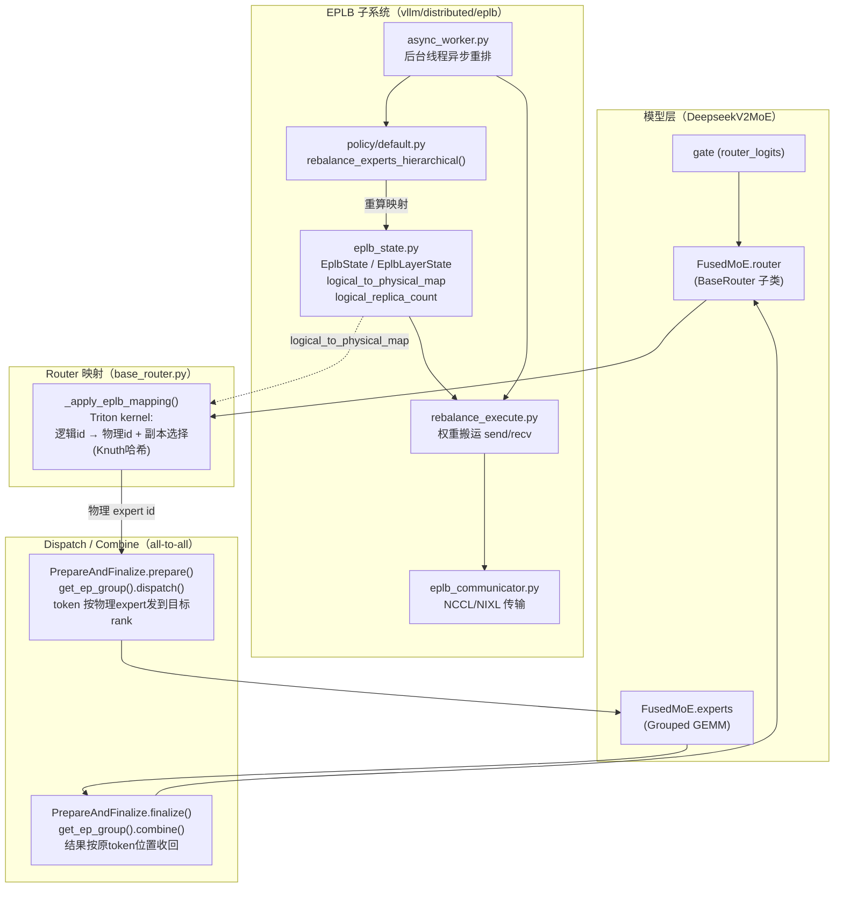
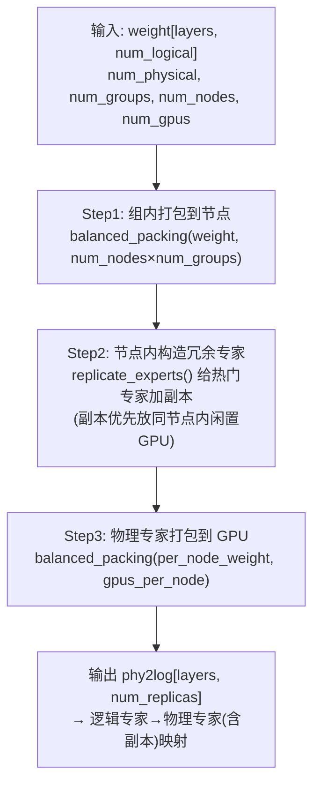
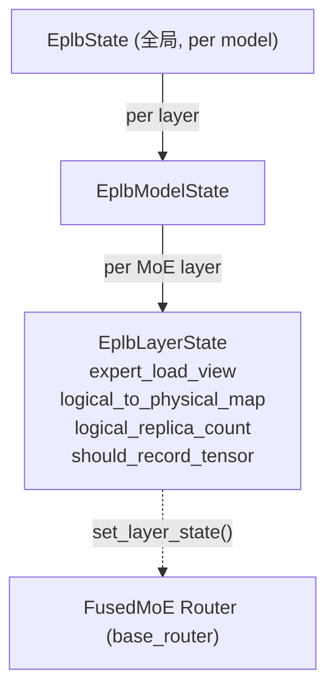
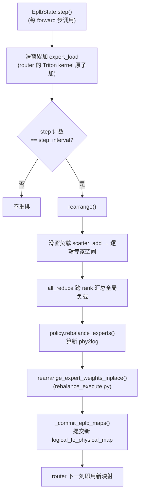
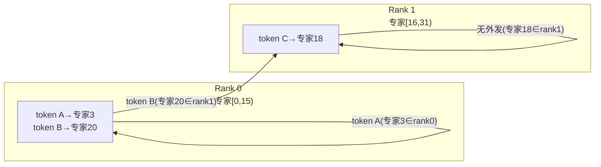
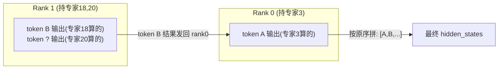
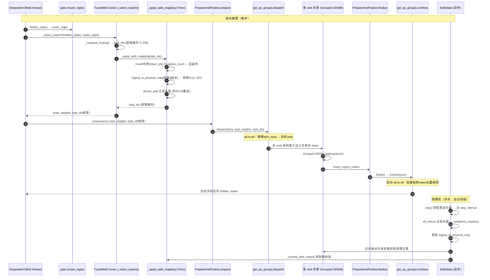

# vLLM EPLB 与 MoE 专家并行（EP）Dispatch/Combine 全流程深度解剖

> 目标：彻底讲清 vLLM 如何实现 DeepSeek EPLB（专家并行负载均衡器），以及 EP 模式下 token 如何被分发（dispatch）到各 rank 的专家、多个 rank 存在同一专家副本时如何选路、计算结果如何聚合回原 token（combine）。
>
> 前置文档：`.codebuddy/analysis/deepseek_v4_kv_cache_layout.md`（KV cache 全局管理）。本文聚焦 MoE 专家并行的另一半——**专家 placement + token 路由**。
>
> 代码基线：`comments-on-v0.25.1` 分支。

## 目录

- [0. 前置知识：为什么需要 EPLB + EP](#0-前置知识为什么需要-eplb--ep)
- [1. 全景架构概览](#1-全景架构概览)
- [2. Layer 1: EPLB 负载均衡器（重排算法）](#2-layer-1-eplb-负载均衡器重排算法)
- [3. Layer 2: EPLB 运行时状态与触发重排](#3-layer-2-eplb-运行时状态与触发重排)
- [4. Layer 3: Router 的逻辑→物理映射（副本选择核心）](#4-layer-3-router-的逻辑物理映射副本选择核心)
- [5. Layer 4: Dispatch —— token 如何跨 rank 分发](#5-layer-4-dispatch--token-如何跨-rank-分发)
- [6. Layer 5: 专家计算（Grouped GEMM）](#6-layer-5-专家计算grouped-gemm)
- [7. Layer 6: Combine —— 结果如何聚合回原 token](#7-layer-6-combine--结果如何聚合回原-token)
- [8. 完整调用链时序图（端到端）](#8-完整调用链时序图端到端)
- [9. 关键数据结构速查表](#9-关键数据结构速查表)
- [10. 快速问题解答（FAQ）：那些你不一定想到的场景](#10-快速问题解答faq那些你不一定想到的场景)

---

## 0. 前置知识：为什么需要 EPLB + EP

### 0.1 MoE 的负载不均问题

MoE（Mixture of Experts）每层有 N 个"专家"FFN，每个 token 只由 router 选中的 top-k 个专家处理。问题在于：**不同专家的 token 数差异极大**。以 DeepSeek-V3/R1 为例，256 个 routed 专家，但少数"热门专家"可能吃掉 10 倍于平均的 token，导致持这些专家的 GPU 成为瓶颈，其他 GPU 闲置。

### 0.2 两条互补的解决思路

| 思路 | 做法 | 代价 | 谁来做 |
|------|------|------|--------|
| **全局重排序**（group-limited routing） | 调整专家在 GPU 间的摆放位置，高低搭配 | 不占额外显存，但要全局重摆 | 模型结构/路由策略 |
| **冗余副本**（redundant experts） | 给热门专家在闲置 GPU 上复制副本，token 分流到负载轻的副本 | 占额外显存（副本权重），需重部署 | **EPLB** |

DeepSeek 的 **EPLB（Expert Parallelism Load Balancer）** 把两者结合：预测专家热度 → 计算逻辑专家到物理专家的映射（含副本）→ 由推理框架（vLLM）据此重排权重部署。

### 0.3 EP 是什么 & 为什么有 dispatch/combine

- **EP（Expert Parallelism）**：每个 rank（GPU）只持有全部专家的一个子集。例如 DeepSeek-V3 256 专家、`ep_size=16`，每 rank 持 16 个专家（含冗余副本时更多）。
- 因为 token 被 router 分到了**任意**专家，而专家分散在**不同 rank**，所以一个 token 的 hidden_state 必须先 **dispatch（all-to-all）** 到持有目标专家的 rank，专家算完后再 **combine（all-to-all）** 回原 rank 的原始 token 位置。
- 这与 TP（Tensor Parallel，hidden 维度切分、需要 all-reduce）完全不同：EP 是 expert 维度切分、靠 all-to-all 收发整块 token。

### 0.4 关键设计 tradeoff

- **副本越多 → 负载越均衡，但显存越费**（每副本一份专家权重）。DeepSeek-R1 用 256+32=288 物理专家（32 冗余）。
- **重排频率**：重排有通信/拷贝开销，不能每步都做。vLLM 用滑窗负载统计 + 步进间隔（`expert_rearrangement_step_interval`）触发。
- **分层 vs 全局**：prefill（小 EP）用分层均衡（同组专家放同节点，减跨节点通信）；decode（大 EP）用全局均衡（副本可能跨节点）。

---

## 1. 全景架构概览

**图1：EPLB + EP dispatch/combine 全景**



**一句话职责**：
- **EPLB 子系统**：周期性统计专家负载 → 用 `rebalance_experts_hierarchical` 算新的"逻辑专家→物理rank(含副本)"映射 → 异步搬运专家权重到新位置。
- **Router 映射**：每个 token 路由时，把 router 给的**逻辑专家编号**翻译成**物理专家编号**（多个副本时用哈希选一个），这是 dispatch 的路由依据。
- **Dispatch/Combine**：底层 all-to-all，按物理 expert id 把 token 发到正确 rank，算完再收回来。

---

## 2. Layer 1: EPLB 负载均衡器（重排算法）

**文件**：`vllm/distributed/eplb/policy/default.py`

### 2.1 三个基础工具

```python
# default.py:23  balanced_packing
def balanced_packing(weight, num_packs):
    # 贪心：把 n 个带权对象装入 m 个包，每次选当前最轻的包
    # → 各包总负载尽量均衡

# default.py:76  replicate_experts
def replicate_experts(weight, num_phy):
    num_redundant = num_phy - num_log            # 副本数
    for i in range(num_redundant):
        redundant_indices = np.argmax(weight / logcnt, axis=-1)  # 选"单位副本负载最高"的逻辑专家
        phy2log[:, i] = redundant_indices
        logcnt[arangen, redundant_indices] += 1  # 该专家副本数+1
```

### 2.2 分层均衡（核心，`rebalance_experts_hierarchical` @ default.py:104）

DeepSeek 的精髓。三步法，目标是"热门专家复制 + 同组放同节点 + GPU 高低搭配"：



- **Step 1**：先把逻辑专家按热度高低搭配分到各节点组（减少跨节点通信）。
- **Step 2**：在节点内给最热的逻辑专家造副本（副本留在同节点，跨节点带宽省）。
- **Step 3**：把物理专家（原+副本）均衡铺到各 GPU。

### 2.3 入口 `rebalance_experts` @ default.py:274

```python
def rebalance_experts(weight, num_replicas, num_groups, num_nodes, num_ranks, old_global_expert_indices):
    if num_groups % num_nodes == 0:
        # 分层策略（prefill 小 EP 常用）
        phy2log = rebalance_experts_hierarchical(...)
    else:
        # 退化成全局策略（decode 大 EP）：num_groups=1, num_nodes=1
        phy2log = rebalance_experts_hierarchical(..., num_groups=1, num_nodes=1)
    # preserve_intragpu_slots: 尽量让同 GPU 内专家位置不变，减少同卡内权重拷贝
    return phy2log
```

> **设计决策**：分层 vs 全局由 `num_groups % num_nodes == 0` 决定——这与 DeepSeek 论文一致：prefill 用分层（组=节点倍数），decode 用全局。

---

## 3. Layer 2: EPLB 运行时状态与触发重排

**文件**：`vllm/distributed/eplb/eplb_state.py`

### 3.1 三层状态对象



- `EplbState`（`eplb_state.py:224`）：持有 `policy`、`expert_load_window_size`、`expert_rearrangement_step_interval`，通过 `add_model()`（L351）把 `logical_to_physical_map` 等视图下发到每个 MoE 层。
- `EplbLayerState`（L1028）：每层运行时数据，含 `expert_load_view`（负载统计张量）、`logical_to_physical_map`、`logical_replica_count`（某逻辑专家有几个副本）。`set_layer_state()`（L1052）建立张量视图。

### 3.2 重排触发流程



- `rearrange()`（L721）：跨 rank `all_reduce` 是为了拿到**全局**专家负载（各 rank 只见自己 token 的局部负载）。
- 异步模式下 `async_worker.py` 在后台线程跑 `transfer_layer()`（权重 send/recv），主线程通过 `CpuGpuEvent` 同步。

### 3.3 权重怎么搬（`rebalance_execute.py`）

- `move_to_buffer()`（L172）：根据 `old_indices`/`new_indices` 算哪些专家需 send/recv，用 `eplb_communicator` 传输。
- 冗余副本的"二次复制"：若新映射要求某逻辑专家在本地有 2 个物理副本，`move_from_buffer()`（L350）会把主副本权重再拷一份到副本槽（`duplicate_mask`）。

---

## 4. Layer 3: Router 的逻辑→物理映射（副本选择核心）

**文件**：`vllm/model_executor/layers/fused_moe/router/base_router.py`

这是用户最关心的"多个 rank 有同一专家时怎么选"的答案所在。

### 4.1 调用顺序（template method）

```python
# base_router.py:260  _select_experts
def _select_experts(self, hidden_states, router_logits, ...):
    # Step 2: 子类算路由（产生 逻辑 专家编号 topk_ids）
    topk_weights, topk_ids = self._compute_routing(...)   # e.g. grouped_topk
    # Step 3: ★ EPLB 映射：逻辑 → 物理（含副本选择）
    topk_ids = self._apply_eplb_mapping(topk_ids)
    # Step 4: dtype 转换
    return topk_weights, topk_ids
```

注意：**`_compute_routing` 产生的是逻辑专家编号**（0~255 for DeepSeek），EPLB 映射后才变成物理编号（0~287），而物理编号直接决定 token 去哪个 rank。

### 4.2 副本选择的 Triton kernel（核心）

**文件**：`base_router.py:18` `_eplb_map_and_record_i32_kernel`

```python
# 1. 取该逻辑专家的副本数
replica_count = tl.load(logical_replica_count_ptr + safe_expert_id)  # 如热门专家=2
replica_count = tl.maximum(replica_count, 1)

# 2. ★ 用 token 索引做 Knuth 乘法哈希，选副本
KNUTH_MULTIPLIER = 2654435769
token_idx = (offs // num_active_experts).to(tl.int64)   # 该 token 在 batch 中的位置
hashed = (token_idx * KNUTH_MULTIPLIER) & 0xFFFFFFFF
replica_idx = hashed % replica_count                    # 0 或 1

# 3. 查表得物理专家 id
map_index = safe_expert_id * map_slots + replica_idx
physical_id = tl.load(logical_to_physical_ptr + map_index)

# 4. 同时原子累加负载统计（供 EPLB 后续重排用）
tl.atomic_add(out_ptr + safe_physical_id, 1, mask=valid)
```

**关键结论（回答"同一专家在多个 rank 怎么办"）**：
- 一个逻辑专家若有 `replica_count` 个副本，每个 token 用**自己 batch 内的位置 `token_idx`** 做 Knuth 哈希，确定性地选一个副本（replica_idx）。
- 哈希保证：**同一 token 每次选同一副本**（确定性、可复现），不同 token 大致均匀打散到各副本——天然负载均衡，无需中心调度。
- 物理 id 通过 `logical_to_physical_map[逻辑专家][副本号]` 查出，该表由 EPLB 维护。

> **为什么用哈希而不是"哪个副本空闲选哪个"**：在线推理无法预知各副本实时队列长度，且要保持确定性（同输入同输出）。哈希打散是最简单有效的近似均衡，且 token→副本 映射稳定。

### 4.3 DeepSeek 接入点

```python
# deepseek_v2.py:322  DeepseekV2MoE.__init__
self.n_logical_experts = self.n_routed_experts          # 256
self.n_physical_experts = self.n_logical_experts + self.n_redundant_experts  # 256+32=288
self.n_local_physical_experts = self.n_physical_experts // self.ep_size      # 每 rank 物理专家数
self.physical_expert_start = self.ep_rank * self.n_local_physical_experts    # 本 rank 物理专家区间
self.physical_expert_end = self.physical_expert_start + self.n_local_physical_experts
```

`FusedMoE`（`layer.py:246`）在 `enable_eplb=True` 时创建 `EplbLayerState`，通过 `set_eplb_state()` 注入 router，router 的 `_apply_eplb_mapping` 才能拿到 `logical_to_physical_map`。

---

## 5. Layer 4: Dispatch —— token 如何跨 rank 分发

**文件**：`vllm/model_executor/layers/fused_moe/prepare_finalize/naive_dp_ep.py` + `vllm/distributed/device_communicators/all2all.py`

### 5.1 为什么能靠物理 expert id 路由

因为每个 rank 持有的物理专家是**连续区间**：

```
rank 0: 物理专家 [0, n_local)
rank 1: 物理专家 [n_local, 2*n_local)
...
目标 rank = 物理 expert_id // n_local_physical_experts
```

所以 dispatch 只要看 `topk_ids`（已是物理 id），就知道 token 该发往哪个 rank。

### 5.2 Dispatch 实现（naive torch 路径）

```python
# naive_dp_ep.py:158  prepare()
a1q, scales, _ = _quantize_and_setup_dispatch(a1, quant_config, ...)
res = get_ep_group().dispatch(
    a1q,            # 量化后的 hidden_states
    topk_weights,   # router 权重
    topk_ids,       # ★ 物理专家编号（EPLB 映射后）
    is_sequence_parallel=self.is_sequence_parallel,
)
a1q, topk_weights, topk_ids = res
```

`get_ep_group().dispatch` 最终走到 `all2all.py` 的 DeepEP/FlashInfer/NIXL 等管理器的 `dispatch()`，内部是 **all-to-all**：每个 rank 把自己的 token 按 `topk_ids` 归属切分，发到对应 rank；接收方把来自各 rank 的、属于自己专家的 token 拼成连续张量。



> token B 的物理 expert=20，`20 // 16 = 1` → 发到 rank 1。token A 的物理 expert=3 ∈ rank 0 → 留在本地。

### 5.3 多种 dispatch 后端对比

| 后端 | 文件 | 通信 | 适用 |
|------|------|------|------|
| Naive (torch) | `prepare_finalize/naive_dp_ep.py` | torch all-to-all / all-reduce | 通用、无 DeepEP 时 |
| DeepEP HT | `prepare_finalize/deepep_ht.py` | DeepEP 高吞吐 a2a | 非 cudagraph 大 batch |
| DeepEP LL | `prepare_finalize/deepep_ll.py` | DeepEP 低延迟 a2a | decode 小 batch、cudagraph |
| NIXL EP | `prepare_finalize/nixl_ep.py` | RDMA/NIXL | 跨节点弹性 EP |
| FlashInfer NVLink | `prepare_finalize/flashinfer_nvlink_*.py` | NVLink 单边/双边 | 同节点 NVLink |

---

## 6. Layer 5: 专家计算（Grouped GEMM）

dispatch 后，每个 rank 手里的 token 全部属于自己持有的物理专家。专家计算用 **Grouped GEMM**（一次 kernel 处理所有专家、所有 token，按专家分组）：

- `FusedMoEKernelModularImpl._fused_experts`（`modular_kernel.py:1118` 之后的 apply 中段）调用 `routed_experts.forward_modular`。
- 每个物理专家看到的是"分配到它的 token 子集"，kernel 内部按 `topk_ids` 分组，gate/up/down 三次 GEMM 融合。
- **无 TP 时**：专家内部不切分（`moe_tp=1`），纯本地计算。
- **有 TP 时**：专家权重按 hidden 维度切分，计算后需 all-reduce（见 §7 late reduce）。

> **EP vs TP 区别**：EP 切 expert 维度（靠 all-to-all），TP 切 hidden 维度（靠 all-reduce）。DeepSeek 部署常 `tp=1, ep=16`，专家完全不切 hidden，只靠 EP+all-to-all。

---

## 7. Layer 6: Combine —— 结果如何聚合回原 token

**文件**：`vllm/model_executor/layers/fused_moe/prepare_finalize/naive_dp_ep.py:187`

### 7.1 加权求和 + 收回

```python
# naive_dp_ep.py:187  finalize()
out = weight_and_reduce_impl.apply(
    output=None,
    fused_expert_output=fused_expert_output,   # 各专家算完的 token 输出
    topk_weights=topk_weights,                 # router 权重
    topk_ids=topk_ids,
    apply_router_weight_on_input=...,
)
# 按原 token 位置 all-to-all 收回，并（若需要）reduce
output.copy_(get_ep_group().combine(out, is_sequence_parallel=...))
```

- **加权求和**：一个 token 可能被路由到多个专家（top-k），`weight_and_reduce_impl` 把各专家输出按 `topk_weights` 加权加起来，得到该 token 的最终 hidden_state（此时仍在"专家所在 rank"上，按目标专家顺序排）。
- **combine（all-to-all）**：反向 all-to-all，把每个 token 的结果从"专家所在 rank"发回"原始 token 所在 rank"，并按原始 token 顺序排好。

### 7.2 为什么 combine 后可能还要 all-reduce

- DeepEP 后端 `output_is_reduced()` 返回 `True`：combine 时已顺便做完 all-reduce（结果已是全量求和）。
- Naive/torch 后端返回 `False`：`moe_runner._maybe_reduce_final_output`（`moe_runner.py:436`）做"late all-reduce"补上。
- 这步 all-reduce 与 TP 的 all-reduce 是不同的事：这是 EP combine 的收尾（把各 rank 算的 token 拼全），TP 的 all-reduce 是专家内 hidden 维求和。



---

## 8. 完整调用链时序图（端到端）

**图：从 forward 到 token 回到原位置的完整流程（含 EPLB 副本选择）**



---

## 9. 关键数据结构速查表

| 数据结构 | 关键字段 | 作用 | 位置 |
|---------|---------|------|------|
| `DefaultEplbPolicy` | `rebalance_experts` / `rebalance_experts_hierarchical` | 分层/全局均衡算法 | `eplb/policy/default.py:21,104,274` |
| `EplbState` | `policy`, `expert_load_window_size`, `step_interval` | 全局 EPLB 状态、触发重排 | `eplb/eplb_state.py:224` |
| `EplbLayerState` | `expert_load_view`, `logical_to_physical_map`, `logical_replica_count`, `should_record_tensor` | 每层运行时映射与负载 | `eplb/eplb_state.py:1028` |
| `RebalanceExecute` | `move_to_buffer` / `move_from_buffer` | 权重 send/recv + 副本二次复制 | `eplb/rebalance_execute.py:172,350` |
| `EplbCommunicator` | NCCL/NIXL 后端 | 跨 rank 权重传输 | `eplb/eplb_communicator.py:45` |
| `BaseRouter._apply_eplb_mapping` | 调 `eplb_map_to_physical_and_record` | 逻辑→物理 + 副本哈希选择 + 负载记录 | `router/base_router.py:204` |
| `_eplb_map_and_record_i32_kernel` | Knuth 哈希选副本 | Triton 实现映射+记录 | `router/base_router.py:18` |
| `FusedMoEPrepareAndFinalize.prepare` | `get_ep_group().dispatch` | dispatch（量化+all-to-all） | `prepare_finalize/naive_dp_ep.py:112` |
| `FusedMoEPrepareAndFinalize.finalize` | `get_ep_group().combine` | combine（加权+all-to-all） | `prepare_finalize/naive_dp_ep.py:187` |
| `DeepseekV2MoE` | `n_physical_experts`, `physical_expert_start/end`, `enable_eplb` | 物理专家区间、EPLB 开关 | `models/deepseek_v2.py:325-333` |
| `MoERunner._forward_impl` | `_maybe_dispatch` → `_apply_quant_method` → `_maybe_combine` | EP 编排 | `runner/moe_runner.py:792` |

---

## 10. 快速问题解答（FAQ）：那些你不一定想到的场景

**Q1：router 选出的是逻辑专家还是物理专家编号？**
A：**逻辑**。所有 router 子类（`_compute_routing`）产生 0~255 的逻辑编号；EPLB 映射（`_apply_eplb_mapping`）在路由之后、dispatch 之前把它翻译成 0~287 的物理编号。关闭 EPLB 时映射是恒等，物理=逻辑。

**Q2：同一个逻辑专家在多个 rank 有副本，一个 token 怎么决定去哪个副本？**
A：在 router 映射的 Triton kernel 里，用 **token 在 batch 内的位置 `token_idx` 做 Knuth 乘法哈希**（`token_idx * 2654435769`），再对 `replica_count` 取模得到 `replica_idx`，然后通过 `logical_to_physical_map[逻辑专家][replica_idx]` 查出物理 id（`base_router.py:43-62`）。哈希保证确定性 + 近似均匀打散，无需运行时查询副本负载。

**Q3：为什么不用"哪个副本现在最空闲就选哪个"的动态调度？**
A：在线推理无法低成本获知各副本实时队列长度，且会破坏确定性（同输入应同输出）。哈希打散是简单有效的近似，且 token→副本映射跨步稳定，EPLB 重排时只需重算映射表。

**Q4：dispatch 怎么知道 token 发往哪个 rank？**
A：每 rank 持连续物理专家区间 `[ep_rank*n_local, (ep_rank+1)*n_local)`。dispatch 拿到物理 expert id 后，`目标 rank = 物理id // n_local_physical_experts`，据此做 all-to-all 切分发送（`all2all.py` 各 manager 的 `dispatch`）。

**Q5：副本的权重从哪来？EPLB 重排时怎么处理副本？**
A：副本权重 = 主副本权重的拷贝。`rebalance_execute.move_from_buffer()`（L350）用 `duplicate_mask` 把主副本权重再拷一份到副本槽。重排是异步的（`async_worker.py` 后台线程），通过 `CpuGpuEvent` 与主线程同步，不阻塞前向。

**Q6：token 被多个专家处理（top-k），结果怎么合并？**
A：combine 阶段的 `weight_and_reduce_impl.apply` 按 `topk_weights` 把该 token 被路由到的各专家输出加权求和，得到一个 hidden_state。此时结果还在"各专家所在 rank"，再经 `combine` 的 all-to-all 按原 token 位置收回。

**Q7：EPLB 重排时正在跑的 forward 会不会用上半新半旧的映射？**
A：不会。EPLB 在后台线程算新映射并搬运权重，**主线程通过 event 同步**；`_commit_eplb_maps()`（L1224）一次性原子提交新 `logical_to_physical_map` 到 `model_state`，下一 forward 步才生效。映射表和权重在同一提交点一致。

**Q8：DeepSeek 的 group-limited routing 和 EPLB 副本是什么关系？**
A：group-limited routing（每组专家限制候选范围）是**路由策略**，减少跨组通信、让热门专家天然集中；EPLB 是**placement 优化**，在 group-limited 基础上给最热专家加副本并摆到闲置 GPU。两者互补：路由决定"token 想去找谁"，EPLB 决定"那个专家的物理副本在哪"。

**Q9：EP 和 TP 在 MoE 上怎么共存？**
A：EP 切 expert 维度（all-to-all），TP 切 hidden 维度（all-reduce）。DeepSeek 典型部署 `tp=1, ep=16`，专家不切 hidden，只 EP+all-to-all。若 `tp>1`，专家权重按 hidden 切分，计算后需额外 all-reduce（`moe_runner._maybe_reduce_final_output` 的 late reduce）。

**Q10：为什么 DeepSeek-V4 文档里说"MRV2 暂不支持 EPLB"，但代码里有 eplb_utils.py？**
A：旧文档那条是过时信息。当前分支 `vllm/v1/worker/gpu/eplb_utils.py` 已存在，DeepSeek 模型（`deepseek_v2.py`）也接了 `enable_eplb` / `num_redundant_experts`，EPLB 已可在 V2 runner 下工作。该 FAQ 需更新（见记忆备注）。

**Q11：prefill 和 decode 的 EPLB 策略为什么不同？**
A：prefill 用较小 EP（同组专家放同节点，分层均衡），通信省；decode 用大 EP（全局均衡，副本可能跨节点），因为 decode 每步 token 少、更吃专家并行度。由 `num_groups % num_nodes == 0` 自动选分层/全局（`default.py:274`）。

**Q12：token 数量超过 expert capacity 怎么办（token dropping）？**
A：vLLM 的 EPLB/dispatch 路径主要靠哈希均匀打散 + 冗余副本天然扩容来避免热点，而非硬丢 token。当前默认路径未启用传统 capacity-factor dropping（DeepEP 后端有 buffer 管理，溢出走 RDMA 而非丢弃）。具体 capacity 行为取决于所选 all2all 后端。

---

> 本文档配套源码行号均按 `comments-on-v0.25.1` 分支核对。EPLB 算法接口与 DeepSeek 官方 `deepseek-ai/EPLB` 仓库对齐（`policy/default.py:9` 注释引用）。
