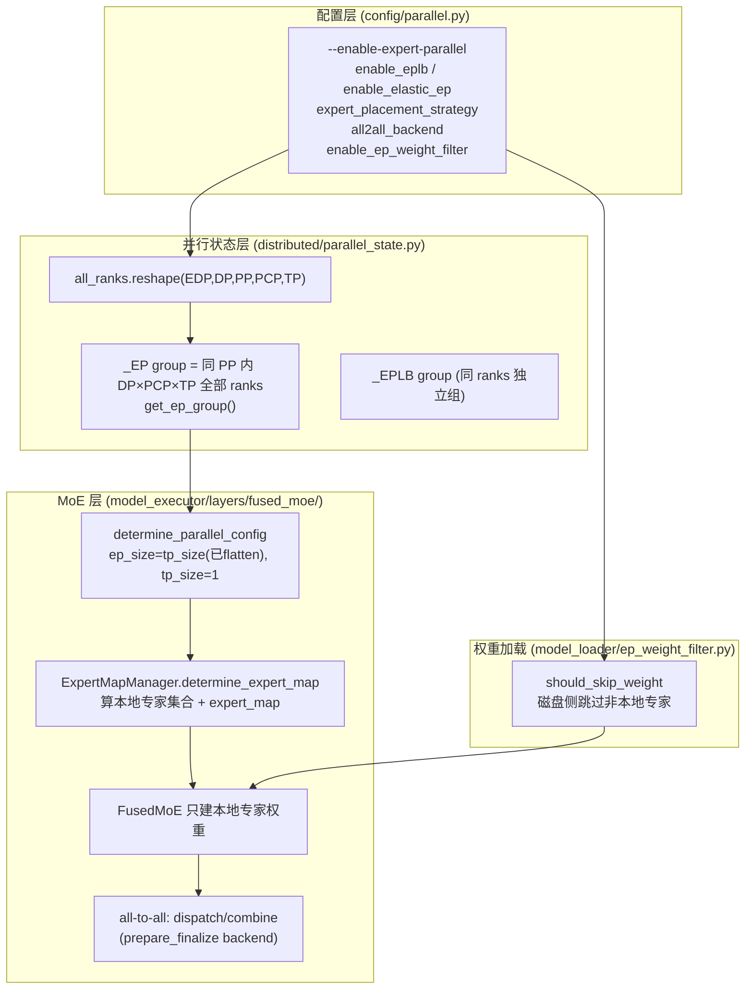
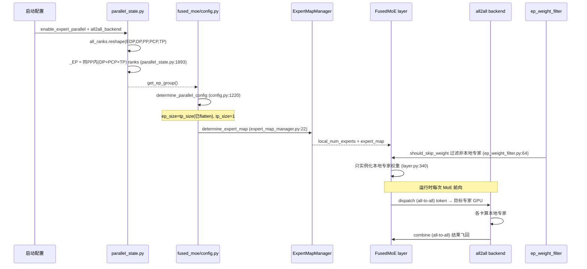

# vLLM Expert Parallelism (EP) / Wide-EP 深度解剖

> 版本基准：当前分支 `comments-on-v0.25.1`（vLLM v0.25.1 附近）
> 本文目标：讲清 **EP 是什么、它和 TP 到底是什么关系、Wide-EP 如何"进一步扩大 EP"**，并给出 vLLM 里 EP 从"并行状态建组 → 配置确定 → MoE 层按专家分片 → all-to-all 通信 → 权重过滤 → 跨节点 backend"的完整源码链路。所有源码片段带行号，方便按图索骥回 `vllm/` 阅读。

---

## 0. 前置知识：纠正一个常见误解（EP 不是"复用 TP"）

### 0.1 先说结论

**EP（Expert Parallelism，专家并行）是 MoE 模型专属、与 TP 并列独立的一种并行维度。** 它的核心做法是：

- MoE 层有 N 个专家（expert）。EP 把这 N 个专家**整体切分**到不同 GPU 上——每张卡持有完整的一批专家（整块权重，不再沿 hidden 维切片）。
- 某个 token 该交给哪个专家，由 router 决定；于是 token 需要**跨卡飞到对应专家所在的 GPU** 做计算，算完再把结果**飞回来**聚合。这个"飞过去 / 飞回来"就是 MoE 的 **all-to-all（dispatch / combine）** 通信。

而 **TP（Tensor Parallelism，张量并行）** 是把**单个专家内部**的权重沿 hidden 维切片到多卡，靠 **all-reduce** 聚合。

> ⚠️ **本文重点纠正**：我之前说过"EP 复用 TP 通信组 `ep_size = tp_size`"，这是**表述误导**。准确说法是：
> - 在 vLLM 的 rank 布局里，EP group 的 ranks = **同一个 PP stage 内 (DP × PCP × TP) 的全部 rank**。也就是说 **EP "吃掉"了 TP 维和 DP 维**（不是依附于 TP），把这三个维度的所有 GPU 重新编组为一个 EP 组。
> - 开启 EP 后，MoE 层内部把 `tp_size` 强制置 1（不再做专家内 TP 切分），改为按"专家整体"切分，切分度 = 原 `TP × DP × PCP` 的乘积。
> - 数值上 `ep_size = tp_size` 里的 `tp_size` 已经是 `flatten_tp_across_dp_and_pcp` 之后的值（即 DP×PCP×TP 的乘积），所以这句代码是"结果相等"，**绝不是"EP 依赖于 TP"**。

### 0.2 EP vs TP 对比

| 维度 | TP（张量并行） | EP（专家并行） |
| --- | --- | --- |
| 切谁 | 每个专家内部权重沿 hidden 维切 | 专家**整体**分到不同卡 |
| 每卡存什么 | 全专家但权重分片 | 自己那几个**完整**专家 |
| 通信原语 | all-reduce（通信量 ∝ hidden²） | all-to-all dispatch/combine（通信量 ∝ token×expert） |
| 显存 | 每卡放全专家（分片后） | 每卡只放本地专家，显存友好 |
| 适用 | 小模型 / 专家少 | 大模型 / 专家多（DeepSeek-V3 256 专家、Mixtral、Qwen3-MoE、Kimi） |

### 0.3 什么是 Wide-EP

**Wide-EP 不是 vLLM 独有的概念，也不是一种新并行维度**。它是社区对一种大规模 MoE 部署模式的俗称：

- 把 **EP 的维度 `ep_size` 放得很大**——大到**超过单机 8 卡、跨多个节点（multi-node）**；
- 同时把非 MoE 层（Attention / Embedding 等无法按专家切的层）交给 **DP（Data Parallel，数据并行）** 横向复制。

所以 Wide-EP 的真实形态是 **"DP + 超大 EP"**：MoE 层靠 EP 把几百个专家铺到几十上百张卡（常跨节点），非 MoE 层靠 DP 复制。vLLM 官方文档明确把 "one-pod-per-rank + MoE + EP" 列为一种 Wide-EP 部署（`config/parallel.py:146-152`）。

> **一句话**：EP 本就独立于 TP；Wide-EP = 把 EP 维度进一步放大到跨节点，EP 越大，单卡负责的专家越少、显存越省，但 all-to-all 通信越依赖高速跨节点互联（IB/RDMA/NVLink）。

---

## 1. 全景架构概览



**一句话职责**：
- `config/parallel.py`：把用户的 EP 意图变成配置字段。
- `parallel_state.py`：在 rank 网格上**真正建出 EP 通信组**（与 TP/DP/PP 正交的视图）。
- `fused_moe/`：根据 `ep_size/ep_rank` 决定"我这张卡负责哪些专家"，并把 MoE 计算切成 all-to-all。
- `ep_weight_filter.py`：加载时只从磁盘读本地专家，省 I/O。

---

## 2. Layer 1：并行状态层——EP group 是怎么建出来的

### 2.1 rank 网格是理解一切的起点

vLLM 把所有并行维度压进一个 5 维 rank 网格（`parallel_state.py:1788-1794`）：

```python
# vllm/distributed/parallel_state.py:1788
# 5 维顺序：ExternalDP × DP × PP × PCP × TP
all_ranks = torch.arange(world_size).reshape(
    -1,
    data_parallel_size,            # DP
    pipeline_model_parallel_size,  # PP
    prefill_context_model_parallel_size,  # PCP (prefill context parallel)
    tensor_model_parallel_size,   # TP
)
```

> 每个并行维度都是对这个网格做"转置到最后一维 + reshape 成 2D + unbind"来切出自己那组 ranks。这是 Megatron 风格并行组的通用做法。

### 2.2 EP group 的 ranks = 同 PP stage 内的 (DP × PCP × TP)

```python
# vllm/distributed/parallel_state.py:1889
global _EP
assert _EP is None, "expert parallel group is already initialized"
# Don't create EP group for dense models.
if config.model_config is None or config.model_config.is_moe:   # ← 只有 MoE 模型才建 EP
    group_ranks = (
        all_ranks.transpose(1, 2)        # 把 DP 维换到原来 PP 的位置
        .reshape(
            -1,
            data_parallel_size
            * prefill_context_model_parallel_size
            * tensor_model_parallel_size, # ← EP 组大小 = DP × PCP × TP
        )
        .unbind(0)
    )
    group_ranks = [x.tolist() for x in group_ranks]
    if enable_elastic_ep:
        _EP = _init_stateless_group(group_ranks, "ep", ...)   # 弹性 EP：无状态 NCCL 组
    else:
        _EP = init_model_parallel_group(group_ranks, ..., group_name="ep")
```

**关键点**：
- `transpose(1, 2)` 把 DP 和 PP 对调后展平 → 每个 EP 组固定在一个 **PP stage** 内，跨 PP stage 不混。
- EP 组的 rank 集合 = **DP × PCP × TP** 的全部 rank。所以 EP 与 PP 正交，但**覆盖（吃掉）了 TP 和 DP 这两个维度**——这正是"EP 独立于 TP、但建组时把 TP/DP 的卡收编进来"的准确含义。
- 只有 MoE 模型（`is_moe`）才建 `_EP`，dense 模型 `_EP` 保持 `None`，调用 `get_ep_group()` 会直接报错（`parallel_state.py:1400-1406`）。

### 2.3 EPLB 组：与 EP 同 ranks 的独立通信组

```python
# vllm/distributed/parallel_state.py:1917
# Create EPLB group with the same ranks as EP if EPLB is enabled.
# This is a separate process group to isolate EPLB communications
# from MoE forward pass collectives and prevent deadlocks when
# using torch.distributed in execution with torch.distributed in EPLB.
global _EPLB
if config.parallel_config.enable_eplb:
    _EPLB = init_model_parallel_group(group_ranks, ..., group_name="eplb")
```

> EPLB（专家负载均衡）会在运行期做专家重排/冗余复制，它复用 EP 的 ranks，但**单独建一个 process group**，目的是把"负载均衡的通信"和"MoE 前向的 all-to-all 通信"隔离，避免死锁。

---

## 3. Layer 2：配置层——EP 与 TP/DP/PP 的约束

### 3.1 核心配置字段（`config/parallel.py`）

```python
# vllm/config/parallel.py:162
enable_expert_parallel: bool = False
"""Use expert parallelism instead of tensor parallelism for MoE layers."""

# vllm/config/parallel.py:164
enable_ep_weight_filter: bool = False
"""Skip non-local expert weights during model loading when EP is active..."""

# vllm/config/parallel.py:171
enable_eplb: bool = False
"""Enable expert parallelism load balancing for MoE layers."""

# vllm/config/parallel.py:175
expert_placement_strategy: ExpertPlacementStrategy = "linear"
# "linear": 连续放置（rank0=[0,1], rank1=[2,3]）
# "round_robin": 轮询放置（rank0=[0,2], rank1=[1,3]，利于 grouped-expert 均衡）

# vllm/config/parallel.py:185
all2all_backend: All2AllBackend = "allgather_reducescatter"
```

`All2AllBackend` 白名单（`config/parallel.py:40-52`）列出了所有 EP 通信后端——**这是 Wide-EP 跨节点能力的关键**：

```python
# vllm/config/parallel.py:40
All2AllBackend = Literal[
    "naive",
    "pplx",
    "deepep_high_throughput",   # DeepEP 高吞吐（训练式大 batch）
    "deepep_low_latency",       # DeepEP 低延迟（在线推理 decode）
    "deepep_v2",
    "mori_high_throughput",     # MoRI：InterNodeV1，多节点
    "mori_low_latency",         # MoRI：InterNodeV1LL，多节点
    "nixl_ep",                  # 基于 NIXL（跨网络 / 解耦式 PD 分离）
    "flashinfer_all2allv",      # 别名
    "flashinfer_nvlink_two_sided",  # GB200 等 MNNVL 多节点 NVLink
    "flashinfer_nvlink_one_sided",
]
```

### 3.2 Wide-EP 的官方部署形态

```python
# vllm/config/parallel.py:146
data_parallel_external_lb: bool = False
"""Whether to use "external" DP LB mode. ... useful for a "one-pod-per-rank"
wide-EP setup in Kubernetes. Supported only for MoE deployments..."""
```

> 即 vLLM 把 "one-pod-per-rank（每 rank 一个 pod）+ MoE + EP" 作为一种**显式的 Wide-EP 部署模式**写进配置文档。每个 pod 是一个 EP rank，跨 pod 就是跨节点 EP。

---

## 4. Layer 3：MoE 层——`determine_parallel_config` 怎么把 EP 落到 `ep_size`

### 4.1 关键函数：EP 开启时 `tp_size` 退 1、`ep_size` 接管

```python
# vllm/model_executor/layers/fused_moe/config.py:1190
use_ep = (
    dp_size_ * pcp_size_ * tp_size_ > 1
    and vllm_parallel_config.enable_expert_parallel     # 必须显式开 EP
)

# ... 不开 EP 时 ep_size=1, tp_size 保持原值 ...

if not use_ep:
    return FusedMoEParallelConfig(
        tp_size=tp_size, tp_rank=tp_rank,
        ep_size=1, ep_rank=0, use_ep=False, ...)

# 开 EP 时（config.py:1220）
# In EP, each device owns a set of experts fully. There is no tensor
# parallel update tp_size, tp_rank, ep_size and ep_rank to reflect that.
ep_size = tp_size        # ← 注意：这里的 tp_size 已经是 flatten(DP×PCP×TP) 后的值
ep_rank = tp_rank
return FusedMoEParallelConfig(
    tp_size=1,           # ← MoE 层内部不再做专家内 TP 切分
    tp_rank=0,
    ep_size=ep_size,     # ← 切分度 = 原 DP×PCP×TP 乘积
    ep_rank=ep_rank,
    use_ep=True, ...)
```

> 源码注释自己说得很清楚："In EP, each device owns a set of experts fully. There is no tensor parallel." 这正是 EP 的定义——**每个设备持有完整的一批专家，没有张量并行**。

### 4.2 文档自带的例子（`config.py:1139-1188`）

```text
# TP=2, DP(PCP)=1, EP=False  → 专家权重沿 hidden 切（传统 TP-MoE）
#   device0: TP={2,0}  EP={1,0}
#   device1: TP={2,1}  EP={1,0}

# TP=2, DP=1, EP=True  → 2 卡各持一半专家
#   device0: TP={1,0}  EP={2,0}
#   device1: TP={1,0}  EP={2,1}

# TP=2, DP=2, EP=True  → 4 卡 EP=4，专家被切到 4 张卡 = Wide-EP 雏形
#   device0: EP={4,0}
#   device1: EP={4,1}
#   device2: EP={4,2}
#   device3: EP={4,3}
```

> **Wide-EP 的直觉**：把 `TP=2, DP=2` 的 4 张卡"收编"成一个 `EP=4` 的大组，专家铺到 4 张卡；如果扩到 `TP=2, DP=16`（32 卡，跨 4 节点），就是 `EP=32` 的 Wide-EP。

---

## 5. Layer 4：专家分片——`determine_expert_map` 算"我负责哪些专家"

### 5.1 本地专家集合的计算

```python
# vllm/model_executor/layers/fused_moe/expert_map_manager.py:22
def determine_expert_map(
    ep_size: int,
    ep_rank: int,
    global_num_experts: int,
    expert_placement_strategy: ExpertPlacementStrategy = "linear",
    num_redundant_experts: int = 0,
    num_fused_shared_experts: int = 0,
):
    assert ep_size > 0
    if ep_size == 1:
        return (global_num_experts, None, None)   # 不开 EP：本地有全部专家
    base_experts = global_num_experts // ep_size
    remainder = global_num_experts % ep_size
    local_num_experts = base_experts + 1 if ep_rank < remainder else base_experts
    expert_map = torch.full((global_num_experts,), -1, dtype=torch.int32)
    if expert_placement_strategy == "linear":
        start_idx = ep_rank * base_experts + min(ep_rank, remainder)
        expert_map[start_idx : start_idx + local_num_experts] = torch.arange(
            0, local_num_experts, dtype=torch.int32)
    elif expert_placement_strategy == "round_robin":
        expert_map[range(ep_rank, global_num_experts, ep_size)] = torch.arange(
            0, local_num_experts, dtype=torch.int32)
    # ...
    return (local_num_experts, expert_map, expert_mask)
```

- `expert_map`：长度 = 全局专家数，值 = 该专家在**本地**的索引（-1 表示不在本卡）。
- `linear`：连续分配（rank0 拿 [0,1]，rank1 拿 [2,3]）。
- `round_robin`：轮询分配（rank0 拿 [0,2]，rank1 拿 [1,3]）——利于 grouped-expert 模型的负载均衡。

### 5.2 FusedMoE 层用这个结果只建本地专家

```python
# vllm/model_executor/layers/fused_moe/layer.py:267
expert_map_manager = ExpertMapManager(
    global_num_experts=global_num_experts,
    num_redundant_experts=num_redundant_experts,
    moe_parallel_config=moe_parallel_config,
    placement_strategy=vllm_config.parallel_config.expert_placement_strategy,
    enable_eplb=eplb_state is not None,
    ...
)

# vllm/model_executor/layers/fused_moe/layer.py:340
moe_config = FusedMoEConfig(
    num_local_experts=expert_map_manager.local_num_experts,  # ← 只建本地专家权重
    ...
)
```

> 这就是 EP 显存友好的根因：每张卡只实例化 `local_num_experts` 个专家权重，而不是全部。

---

## 6. Layer 5：all-to-all 通信——token 怎么飞到专家、再飞回来

MoE 前向的核心两步（在 `fused_moe/` 的 `prepare_finalize/` 后端里实现）：

1. **dispatch（all-to-all）**：把每个 token 按 router 结果发到持有目标专家的 GPU。
2. **combine（all-to-all）**：各 GPU 算完自己本地专家后，把结果发回原始 token 所在的 GPU 聚合。

后端由 `all2all_backend` 选择。关键后端与"是否跨节点"的关系：

| backend | 跨节点能力 | 典型场景 |
| --- | --- | --- |
| `allgather_reducescatter`（默认） | 同节点（NCCL） | 单机 EP |
| `deepep_high_throughput` / `deepep_low_latency` | **支持 intra/inter-node** | DeepSeek 推广的高效 MoE a2a，low-latency 还支持 MNNVL 多节点 NVLink |
| `mori_high_throughput` / `mori_low_latency` | **multi-node 专用**（InterNodeV1 / V1LL） | 真正的跨节点 Wide-EP |
| `nixl_ep` | 跨网络（NIXL） | 解耦式 PD 分离 / 跨网络 |
| `flashinfer_nvlink_two_sided` / `one_sided` | MNNVL 多节点 NVLink（GB200） | 多节点 NVLink 互联 |

> **Wide-EP 能跨节点的真正支撑**就是这些后端：DeepEP / MoRI 专门做了跨节点 all-to-all kernel，用 IB/RDMA 或 NVLink 隐藏延迟、做通信-计算 overlap。没有它们，Wide-EP 的 all-to-all 会被节点间带宽卡死。

---

## 7. Layer 6：权重过滤——加载时只读本地专家（Wide-EP 必备）

Wide-EP + 几百个专家的模型（DeepSeek/Mixtral/Kimi），全部专家权重占模型 ~85-90% 字节。如果每卡都从磁盘读全量专家再丢弃，I/O 灾难。vLLM 提供磁盘侧过滤：

```python
# vllm/model_executor/model_loader/ep_weight_filter.py:31
def compute_local_expert_ids(
    num_experts: int, ep_size: int, ep_rank: int,
    placement: str = "linear",
) -> set[int] | None:
    if ep_size <= 1:
        return None                      # 不开 EP：全本地
    if placement == "linear":
        base = num_experts // ep_size
        remainder = num_experts % ep_size
        start = ep_rank * base + min(ep_rank, remainder)
        local_count = base + (1 if ep_rank < remainder else 0)
        return set(range(start, start + local_count))
    elif placement == "round_robin":
        return set(range(ep_rank, num_experts, ep_size))

# vllm/model_executor/model_loader/ep_weight_filter.py:64
def should_skip_weight(weight_name, local_expert_ids):
    if local_expert_ids is None:
        return False
    eid = parse_expert_id(weight_name)   # 解析 ".experts.42.gate_proj.weight" 中的 42
    if eid is None:
        return False                     # dense / shared-expert / embedding → 保留
    if not weight_name.endswith(".weight"):
        return False                     # scale 等小张量保留（某些后端需要全局 scale）
    return eid not in local_expert_ids   # 非本地专家 → 跳过，不读盘
```

> 该模块 docstring 明确写："In DP+EP deployments each rank only needs its own expert shard. Skipping non-local expert tensors before they are read from disk eliminates the majority of storage I/O." 这是 Wide-EP 可落地的关键配套。

---

## 8. 完整调用链时序图（EP 一次 MoE 前向）



---

## 9. 关键数据结构速查表

| 数据结构 / 字段 | 位置 | 作用 |
| --- | --- | --- |
| `all_ranks` 5D 网格 | `parallel_state.py:1788` | 所有并行维度的 rank 布局，EP 组由它 reshape 得来 |
| `_EP` / `get_ep_group()` | `parallel_state.py:1397 / 1400` | EP 通信组句柄（仅 MoE 模型创建） |
| `_EPLB` | `parallel_state.py:1409` | 与 EP 同 ranks 的独立负载均衡通信组 |
| `FusedMoEParallelConfig` | `fused_moe/config.py` | `ep_size`/`ep_rank`/`tp_size=1` 的承载结构 |
| `ExpertMapManager.determine_expert_map` | `expert_map_manager.py:22` | 算 `local_num_experts` + `expert_map` |
| `expert_map` | `expert_map_manager.py:77` | 全局专家→本地索引映射（-1=不在本卡） |
| `All2AllBackend` | `config/parallel.py:40` | all-to-all 后端白名单（含跨节点 DeepEP/MoRI/NIXL） |
| `should_skip_weight` / `compute_local_expert_ids` | `ep_weight_filter.py:64 / 31` | 磁盘侧跳过非本地专家 |

---

## 10. 快速问题解答（FAQ）

**Q1：EP 和 TP 到底什么关系？EP 是复用 TP 的通信组吗？**
A：**不是复用，是"收编/吃掉"。** EP group 的 ranks = 同一个 PP stage 内 (DP × PCP × TP) 的全部 rank（`parallel_state.py:1893`）。开启 EP 后，MoE 层把 `tp_size` 强制置 1（`config.py:1225`），不再做专家内 TP 切分，改为按专家整体切分到这整个 EP 组。数值上 `ep_size = tp_size` 的 `tp_size` 已经是 flatten(DP×PCP×TP) 之后的值，所以"相等"是结果，不是"依附"。

**Q2：Wide-EP 是 vLLM 独有的吗？**
A：**不是。** Wide-EP 是社区对"把 EP 维度放大到跨节点、配 DP 复制非 MoE 层"这种大规模 MoE 部署模式的俗称，由 DeepSeek/DeepEP 推广。vLLM、SGLang、TensorRT-LLM 都支持。vLLM 在 `config/parallel.py:146` 把 "one-pod-per-rank + MoE + EP" 写成了一种显式 Wide-EP 部署模式。

**Q3：Wide-EP 跨节点靠什么通信？**
A：靠 all-to-all 后端的跨节点实现：`deepep_high/low_latency`（支持 intra/inter-node）、`mori_high/low_latency`（InterNodeV1，多节点专用）、`nixl_ep`（跨网络）、`flashinfer_nvlink_*`（MNNVL 多节点 NVLink）。见 `config/parallel.py:40-52`。

**Q4：为什么 Wide-EP 还要 DP？**
A：MoE 层以外的 Attention/Embedding 无法按专家切，必须靠 DP 复制成多个 replica 各跑完整非 MoE 层。所以 Wide-EP 实际是 **DP + 超大 EP** 混合：非 MoE 层横向复制（DP），MoE 层纵向切分（EP）。

**Q5：EPLB 是干什么的？和 EP 什么关系？**
A：EPLB（Expert Parallelism Load Balancing）在运行期统计专家负载，把热门专家冗余复制/重排到多卡，避免"所有热点 token 都打到同一张卡"的木桶效应。`_EPLB` 复用 EP 的 ranks 但独立建组（`parallel_state.py:1917`）以隔离通信、防死锁。

---

## 11. 源码阅读导航（按图索骥）

| 想看什么 | 文件:行 |
| --- | --- |
| rank 网格定义 | `vllm/distributed/parallel_state.py:1788` |
| EP group 建组（吃 DP×PCP×TP） | `vllm/distributed/parallel_state.py:1893` |
| EPLB 独立组 | `vllm/distributed/parallel_state.py:1917` |
| `get_ep_group()` | `vllm/distributed/parallel_state.py:1400` |
| EP 配置字段 | `vllm/config/parallel.py:162-195` |
| Wide-EP 部署模式 | `vllm/config/parallel.py:146` |
| all2all 后端白名单 | `vllm/config/parallel.py:40` |
| `determine_parallel_config` (ep_size=tp_size, tp=1) | `vllm/model_executor/layers/fused_moe/config.py:1190-1237` |
| `determine_expert_map` | `vllm/model_executor/layers/fused_moe/expert_map_manager.py:22` |
| FusedMoE 用 local_num_experts 建权重 | `vllm/model_executor/layers/fused_moe/layer.py:267,340` |
| EP 权重过滤 | `vllm/model_executor/model_loader/ep_weight_filter.py:31,64` |
