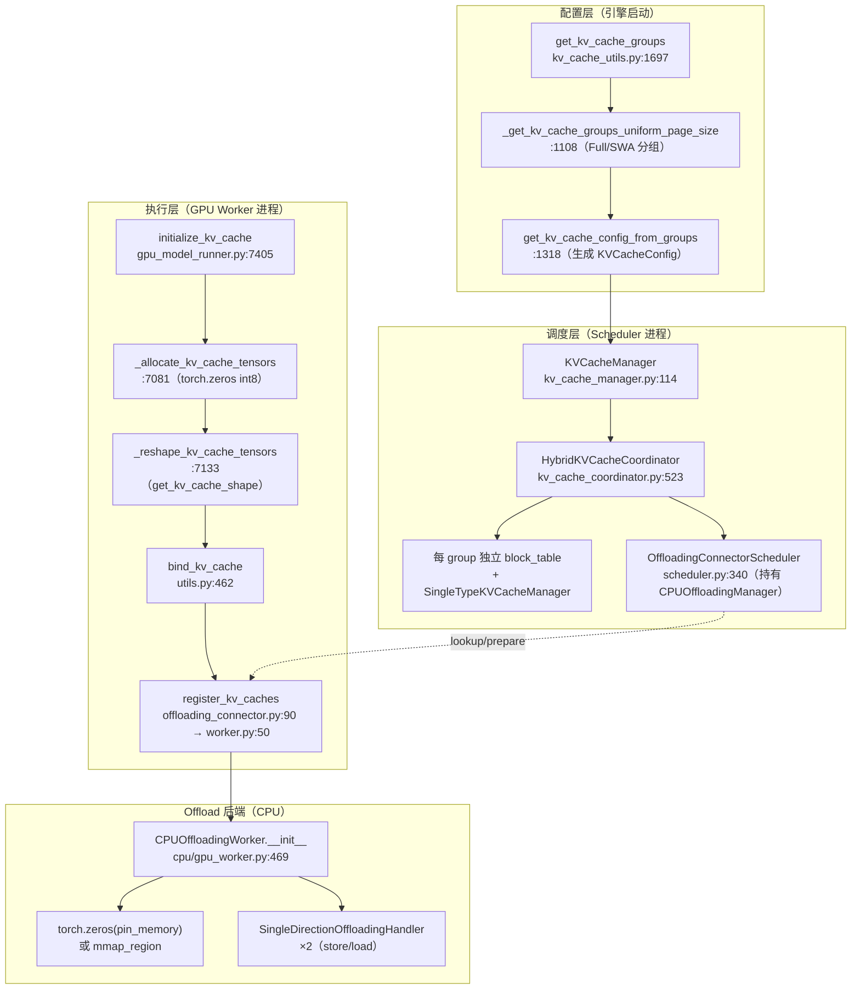
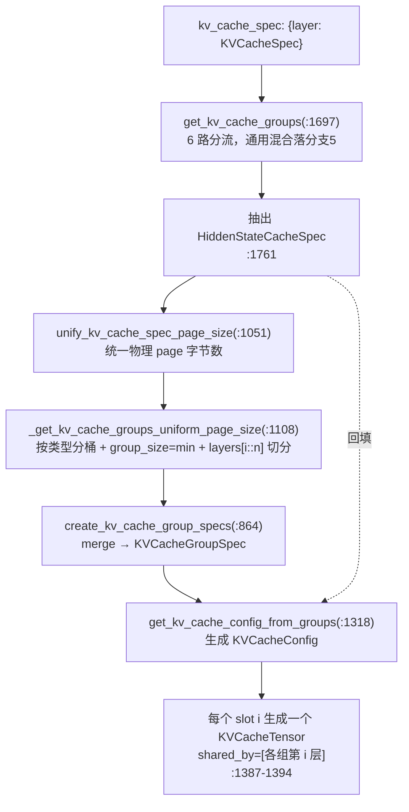
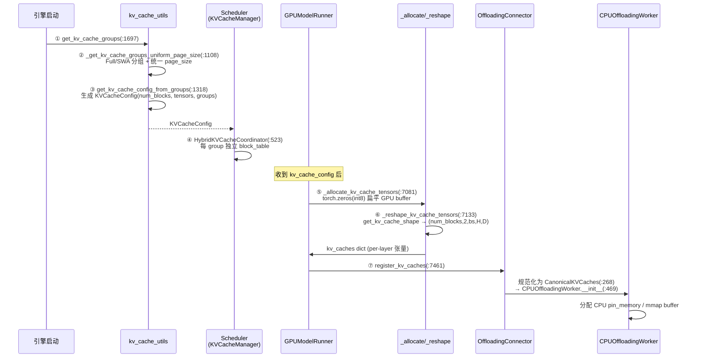

# vLLM KV Cache 创建全链路深度解剖：Full+SWA 混合注意力 + KV Offload

> 分析对象：`c:/Data/Code/nlp/vllm`（分支 `comments-on-v0.25.1`）
> 关注点：开启 KV Offload 时，混合注意力（Full Attention + Sliding Window Attention）模型在 **Model/GPU Worker** 中 KV cache 的**创建位置、创建方式、物理/逻辑布局**。
> 方法：网上调研（设计思想）+ 源码探索（调用链追踪）+ 总结报告。

---

## 目录

- [0. 前置知识：设计思想与核心概念](#0-前置知识设计思想与核心概念)
- [1. 全景架构概览](#1-全景架构概览)
- [2. Layer 1：Config 构建（kv_cache_utils）](#2-layer-1config-构建kv_cache_utils)
- [2.8 Packed 布局：到底是什么、什么场景触发](#28-packed-布局到底是什么什么场景触发)
- [3. Layer 2：Scheduler 侧（HybridKVCacheCoordinator）](#3-layer-2scheduler-侧hybridkvcachecoordinator)
- [4. Layer 3：Model/GPU Worker 分配](#4-layer-3modelgpu-worker-分配)
- [5. Layer 4：Offload 注册与 CPU 分配](#5-layer-4offload-注册与-cpu-分配)
- [6. 完整调用链时序图](#6-完整调用链时序图)
- [7. 关键数据结构速查表](#7-关键数据结构速查表)
- [8. 快速问题解答（FAQ）](#8-快速问题解答faq)

---

## 0. 前置知识：设计思想与核心概念

### 0.1 为什么需要 KV Offload（设计动机）

根据 vLLM 官方博客（KV Offloading Connector，vLLM 0.11.0 引入）：

1. **GPU 显存是瓶颈**：Prefill 阶段计算 KV 成本高，多请求共享前缀可复用 KV；但大量并发请求仍会让 GPU 显存耗尽，引擎被迫抢占请求并丢弃其 KV，重调度时又得重算，开销巨大。
2. **为何卸载到 CPU DRAM**：
   - **广泛可用**：CPU RAM 几乎处处存在；
   - **容量更大**：远超 GPU 显存，可存更大的 KV 池；
   - **高带宽低延迟**：CPU↔GPU 传输延迟低、吞吐高，适合处理请求抢占（避免重算）；
   - **分层暂存区**：CPU 可作为进一步卸载到外部存储（磁盘/对象存储）的中间层（GPU → CPU DRAM → 外部存储）。
3. **异步传输设计**：从 vLLM 0.9.0 起 Connector API 支持异步 KV 加载/存储。Offloading Connector 利用异步 API，GPU→CPU 卸载本身异步完成，请求可在传输结束前返回，对 TTFT 影响极小。底层用 `cudaMemcpyAsync`（DMA 硬件），对计算核心开销极小、可与计算并行。
4. **连续内存布局优化（vLLM 0.12.0）**：为让 DMA 发挥最佳吞吐，KV cache 默认从"按层/按 K.V 碎片化布局"改为**跨所有层的单一连续物理块**，物理块大小从几 KB 提升到 0.5–2 MB，使 DMA 远优于自定义 CUDA 内核。

### 0.2 为什么需要 Hybrid KV Cache Manager（Full + SWA）

根据 vLLM 官方设计文档（Hybrid KV Cache Manager）：

- **统一页大小假设（核心约束）**：所有层类型（Full / SWA）共用**单一内存池**，池内每个 block 的**物理字节数（page size）必须相同**。Full 层需缓存所有 token，SWA 层只需缓存最近窗口的 token——它们"逻辑上需要的 block 数不同"，但"物理块大小必须一致"才能共用内存池。
- **按注意力类型分块表**：KVCacheManager 为 Full 组和 SWA 组分配**不同的 block_ids**（独立 block table），例如 10 full + 20 sw（block_size=16, window=32, req_len=112）需 11 个块：full 组用 0-6（保留所有 token），sw 组 1 用 7-8（仅窗口），sw 组 2 用 9-10。
- **分组逻辑**：把异构层按"相同注意力类型 + 最小层数比例"划分为 KV Cache Groups（例：Gemma-3 52 sw + 10 full → 以 `min(52,10)=10` 为组大小，分成 7 个 sw 组 + 1 个 full 组，余下填充）。

### 0.3 关键 tradeoff

| 维度 | 选择 | 取舍 |
|------|------|------|
| 物理块大小 | 所有 group 强制统一 | 牺牲"精确按需分配"，换取单一内存池、无碎片化 |
| 分组粒度 | 按最小层数比例切分 | 少量填充层浪费内存，但大幅减少 group 数与分配开销 |
| Offload 传输 | 连续大块 + DMA（非 CUDA kernel） | 不占用 GPU 计算核心，但要求 KV 在物理上连续 |
| 跨层共享 | `prefer_cross_layer_blocks=True`（默认） | 把多层拼成单个连续 tensor，最大化 DMA 块大小；但改变了 model runner 的 KV 布局 |

---

## 1. 全景架构概览

**图1：KV Cache 创建全链路（Full+SWA + Offload）**



**一句话职责**：
- **配置层**：把模型各层按注意力类型分组，确定每块物理字节数 `page_size_bytes` 与 `num_blocks`，产出 `KVCacheConfig`。
- **调度层**：为每个 group 维护独立 block table，并驱动 KV offload 的前缀查找/淘汰策略。
- **执行层（即"module runner"）**：分配 GPU 扁平显存 → 按 backend reshape → 绑定到各 attention 层 → 注册给 offload connector。
- **Offload 后端**：在 CPU 侧分配对应 buffer，用两个单向 handler 做异步 GPU↔CPU 搬运。

---

## 2. Layer 1：Config 构建（kv_cache_utils）

本层把"模型每一层的 KV cache 规格"逐级归并，最终产出 `KVCacheConfig`，驱动调度层与执行层。整个过程是 **两段式**：

```
get_kv_cache_groups(:1697)          → list[KVCacheGroupSpec]   （逻辑分组）
        ↓
get_kv_cache_config_from_groups(:1318) → KVCacheConfig        （物理张量表 + num_blocks）
```

`KVCacheGroupSpec` 是"一个 KV cache group"：`layer_names`（同注意力类型的若干层）+ `kv_cache_spec`（该组的规格，决定物理 page 字节数）。`KVCacheConfig` 则在分组之上再决定"实际分配几块物理张量、每块多大、哪些层共享"。

---

### 2.1 总入口：`get_kv_cache_groups`（:1697）—— 一个 6 路分流器

输入 `kv_cache_spec` 是 `{层名: 该层 KVCacheSpec}` 的字典（如 `{"layer0": FullAttentionSpec, "layer1": SlidingWindowSpec, ...}`）。函数按"层间 spec 的混合程度"逐级收窄，选最合适的分组策略：

```python
def get_kv_cache_groups(vllm_config, kv_cache_spec):
    # 分支0：关闭 hybrid manager（老扁平化路径）
    if vllm_config.scheduler_config.disable_hybrid_kv_cache_manager:
        unify_hybrid_kv_cache_specs(kv_cache_spec)   # 把所有 SWA 强制转 Full

    # 分支1：无注意力（kv_cache_spec 为空字典）
    if is_kv_cache_type_attention_free(kv_cache_spec):
        return []

    # 分支2：所有层 spec 完全相同（含"带/不带 sliding window 的
    #        FullAttentionSpec 视为同一类型"）→ 全部塞进 1 个 group
    if is_kv_cache_spec_uniform(kv_cache_spec):
        return _get_kv_cache_groups_uniform_spec(kv_cache_spec)

    # 分支3：类型统一但 hidden size 不同（如全 Full 但 head 数各异，
    #        或全 SWA 且窗口一致）。from_specs 仅在类型一致时返回非 None
    elif uniform_spec := UniformTypeKVCacheSpecs.from_specs(kv_cache_spec):
        return _get_kv_cache_groups_uniform_type(uniform_spec)

    # 分支4：DeepSeekV4 特例（MLA + 多种 SWA，token 数需求相同）
    elif grouped_specs := group_and_unify_kv_cache_specs(kv_cache_spec):
        kv_cache_groups = _get_kv_cache_groups_uniform_groups(grouped_specs)
        _annotate_eagle_groups_deepseek_v4(vllm_config, kv_cache_spec, kv_cache_groups)
        return kv_cache_groups

    # 分支5：通用混合注意力（Full + SWA 类型不同，且非 DSv4）← 本文重点
    ...
```

**各分支走向**：

| 分支 | 触发条件 | 结果 group 数 | 说明 |
|------|---------|--------------|------|
| 0 | `disable_hybrid_kv_cache_manager` | 后续必走 uniform | SWA 被转成 Full，所有层共用一张 block table，窗口限制交给 attention metadata 兜底 |
| 1 | 空字典（attention-free） | 0 | 返回 `[]`，KVCacheManager 特殊处理 |
| 2 | `is_kv_cache_spec_uniform` | 1 | 绝大多数模型（纯 Full 或 Full+无窗 SWA） |
| 3 | `UniformTypeKVCacheSpecs.from_specs` 非 None | 1 | 类型同、hidden 异，group spec 保留逐层差异 |
| 4 | `group_and_unify_kv_cache_specs` 非 None | 多 | DSv4：按 layer-tuple 切分 |
| **5** | 以上都不满足（Full 与 SWA **类型不同**） | **多** | **本文重点：先统一物理 page，再按类型分组** |

---

### 2.2 通用混合分支（分支5）：先抽 HiddenStateCacheSpec，再统一 page，再分组

```python
# (a) 抽出 HiddenStateCacheSpec（投机解码 EAGLE 的 hidden-state 缓存层）
hidden_specs = {k: v for k, v in kv_cache_spec.items()
                if isinstance(v, HiddenStateCacheSpec)}
filtered_spec = {k: v for k, v in kv_cache_spec.items()
                 if not isinstance(v, HiddenStateCacheSpec)}

# (b) 强制所有注意力层物理 page 字节数相同
filtered_spec = unify_kv_cache_spec_page_size(filtered_spec)

# (c) 按注意力类型把层切成多个 group（每组独立 block_table，但 page 相同）
groups = _get_kv_cache_groups_uniform_page_size(filtered_spec)

# (d) 把 hidden-state 层加回来，对齐到公共 page，各自成一个 group
if hidden_specs:
    common_page = get_uniform_page_size([g.kv_cache_spec for g in groups])
    for name, spec in hidden_specs.items():
        per_token = spec.num_kv_heads * spec.head_size * get_dtype_size(spec.dtype)
        new_bs = max(common_page // per_token, 1)
        aligned = replace(spec, block_size=new_bs, page_size_padded=common_page)
        groups.append(KVCacheGroupSpec([name], aligned))
return groups
```

**为什么这么绕？** `HiddenStateCacheSpec`（定义在 `kv_cache_interface.py:434`，继承 `MLAAttentionSpec` 但只是个 marker）用于 EAGLE 类 `extract_hidden_states` 投机解码：它"借 KV cache 机制缓存 hidden states"，**不算注意力、没有 K/V 双份维度**，维度被偷换成 `(num_hidden_states, hidden_size)`（`extract_hidden_states.py` 里 `num_kv_heads←num_hidden_states`、`head_size←hidden_size`）。它的 page 语义和普通注意力层不同，所以**先剔除 → 让注意力层正常统一 page 并分组 → 最后再单独对齐加回**。

---

### 2.3 物理 page 统一：`unify_kv_cache_spec_page_size`（:1051）

这是 **Hybrid KV Cache Manager 核心约束"所有 group 物理 page 字节数必须相同"** 的真正执行点。KVCacheManager 只能分配单一大小的 block，所以必须把各层 page 拉齐：

```python
def unify_kv_cache_spec_page_size(kv_cache_spec):
    page_sizes = {layer.page_size_bytes for layer in kv_cache_spec.values()}
    if len(page_sizes) <= 1:
        return kv_cache_spec          # 已经一致，无需处理

    max_page_size = max(page_sizes)
    for layer_name, layer_spec in kv_cache_spec.items():
        if layer_spec.page_size_bytes == max_page_size:
            new_kv_cache_spec[layer_name] = layer_spec
        else:
            # 策略1：小的 page 能整除最大值 → 放大它的 block_size 追平
            if max_page_size % layer_spec.page_size_bytes == 0:
                ratio = max_page_size // layer_spec.page_size_bytes
                new_spec = replace(layer_spec, block_size=layer_spec.block_size * ratio)
            # 策略2：不能整除，但 backend 支持按 block stride 索引 → 用 padded page
            elif isinstance(layer_spec, AttentionSpec) and layer_spec.indexes_kv_by_block_stride:
                new_spec = replace(layer_spec, page_size_padded=max_page_size)
            # 策略3：都不行 → 直接报错
            else:
                raise NotImplementedError(...)
            assert new_spec.page_size_bytes == max_page_size
    return new_kv_cache_spec
```

> Full + SWA 同模型下 `head_dims/dtype` 本就相同，物理 page 天然相等（直接走 `len<=1` 早返回）。这个函数主要是为"MLA/不同 head 数"等异构情况兜底。

---

### 2.4 按注意力类型分组：`_get_kv_cache_groups_uniform_page_size`（:1108）

这是 Full+SWA 真正"切 group"的地方。核心思想（函数注释原文）：**模型层是"按 pattern 重复"的**，例如 10 full + 20 sw 可视为重复 `(1 full, 2 sw)` 10 次 → 分成 3 个 group，每组 10 层。

```python
# 1) 按 spec 类型分桶：full=[f0,f1], sw=[s0,s1,s2]
same_type_layers: dict[KVCacheSpec, list[str]] = defaultdict(list)
for layer_name, layer_spec in kv_cache_spec.items():
    same_type_layers[layer_spec].append(layer_name)

# 2) 选 group_size：默认取各类型层数的最小值（即 n:1 里的"1"）
min_num_layers = min(len(layers) for layers in same_type_layers.values())
group_size = min_num_layers
max_num_layers = max(len(layers) for layers in same_type_layers.values())
#     若 max < 1.5*min（如 12 sw + 13 full，speculative decoding 常加层），
#     改用 max 以减少 padding 层浪费
if max_num_layers < min_num_layers * 1.5:
    group_size = max_num_layers

# 3) 每类层切成若干 group；用 layers[i::num_groups] 交错分配（保证 PP 下一致）
grouped_layers = []
for layers in same_type_layers.values():
    num_groups = cdiv(len(layers), group_size)
    for i in range(num_groups):
        grouped_layers.append(layers[i::num_groups])

return create_kv_cache_group_specs(kv_cache_spec, grouped_layers)
```

**Gemma-3 实例（5 SWA : 1 Full，共 30 层，重复 5 次）**：
- 类型分桶：`full=[f0..f4]`（5 层），`sw=[s0..s24]`（25 层）
- `min_num_layers = 5`（full 层数）→ `group_size = 5`
- full 切：`cdiv(5,5)=1` 组 → `[f0,f1,f2,f3,f4]`
- sw 切：`cdiv(25,5)=5` 组 → `[s0,s5,s10,s15,s20]`、`[s1,s6,...]`、… 共 5 组，每组 5 层
- **最终 6 个 group**：1 个 full 组 + 5 个 sw 组，每组 5 层；KVCacheManager 给每个 group 维护**独立 block_table**，model runner 把对应 group 的 block_table 套到该组每一层。

**PP 交错（`layers[i::num_groups]`）细节**：若 stage0 有 `full.0,sw.0,sw.1`、stage1 有 `full.1,sw.2,sw.3`，正确分组应为 `(full.0,full.1),(sw.0,sw.2),(sw.1,sw.3)`。若用 `layers[i*group_size:(i+1)*group_size]` 顺序切，stage0 会变成 `(full.0),(sw.0,sw.1),(空)`，被 padding 成 `(full.0,pad),(sw.0,sw.1),(pad,pad)` 造成内存浪费。交错取法保证跨 stage 同位置层归入同 group。

**`_bucket_layers_by_page_size`（:1230）补充**：把"不同 group 中 `slot_idx` 相同的层"归到同一 bucket——它们底层共享同一块物理张量（因 block_table 独立、block-id 命名空间不冲突）。这正是 §2.5 物理张量共享的依据。

---

### 2.5 合并 spec：`create_kv_cache_group_specs`（:864）

每个 group 内所有层共享同一 `KVCacheSpec`，用 `merge` 合并：

```python
def create_kv_cache_group_specs(kv_cache_spec, grouped_layer_names):
    kv_cache_groups = []
    for layer_names_one_group in grouped_layer_names:
        layer_specs = [kv_cache_spec[n] for n in layer_names_one_group]
        merged_layer_spec = layer_specs[0].merge(layer_specs)
        kv_cache_groups.append(
            KVCacheGroupSpec(layer_names_one_group, merged_layer_spec))
    return kv_cache_groups
```

---

### 2.6 生成物理张量表：`get_kv_cache_config_from_groups`（:1318）

这是把"逻辑分组"落地的函数，产出最终的 `KVCacheConfig(num_blocks, kv_cache_tensors, kv_cache_groups)`。四个分支：

```python
def get_kv_cache_config_from_groups(vllm_config, kv_cache_groups, available_memory):
    if len(kv_cache_groups) == 0:                 # 分支A：attention-free
        return KVCacheConfig(num_blocks=1, kv_cache_tensors=[], ...)

    if len(kv_cache_groups) == 1 and isinstance(
            kv_cache_groups[0].kv_cache_spec, UniformTypeKVCacheSpecs):  # 分支B
        # 同类型异 hidden：每层拿自己独立的一块显存
        num_blocks = available_memory // kv_cache_groups[0].kv_cache_spec.page_size_bytes
        per_layer_specs = kv_cache_groups[0].kv_cache_spec.kv_cache_specs
        kv_cache_tensors = [
            KVCacheTensor(size=per_layer_specs[ln].page_size_bytes * num_blocks,
                          shared_by=[ln])
            for ln in kv_cache_groups[0].layer_names]

    elif _use_packed_kv_cache_config(vllm_config, kv_cache_groups):  # 分支C：packed
        num_blocks, kv_cache_tensors = _get_kv_cache_config_packed(
            vllm_config, kv_cache_groups, available_memory)

    else:                                         # 分支D：通用混合（Full+SWA）
        group_size = max(len(g.layer_names) for g in kv_cache_groups)
        page_size  = get_uniform_page_size([g.kv_cache_spec for g in kv_cache_groups])
        num_blocks = get_num_blocks(vllm_config, group_size, available_memory, page_size)
        kv_cache_tensors = []
        for i in range(group_size):
            shared_by = []
            for j in range(len(kv_cache_groups)):
                if i < len(kv_cache_groups[j].layer_names):
                    shared_by.append(kv_cache_groups[j].layer_names[i])
            kv_cache_tensors.append(
                KVCacheTensor(size=page_size * num_blocks, shared_by=shared_by))
    return KVCacheConfig(num_blocks=num_blocks, kv_cache_tensors=kv_cache_tensors, ...)
```

**分支D 是本文重点**。它创建 `group_size` 个物理张量，每个张量由"各组的第 i 层"共享。例如对 **2 个 Full + 3 个 SWA**（`_get_kv_cache_groups_uniform_page_size` 的源码示例）：逻辑分组为 `[full.0, full.1]`、`[sw.0, sw.2]`、`[sw.1]`（第三个组只有 1 层），`group_size=2`：

```
Tensor0 (size = available_memory//2)  shared_by = [full.0, sw.0, sw.1]   # slot 0 取各组第 0 层
Tensor1 (size = available_memory//2)  shared_by = [full.1, sw.2]         # slot 1：[sw.1] 组无第 2 层，被 if i<len 跳过
```

> 注意：源码注释（:1184）把第三个组记作 `(sw.1, padding)`，但 **`padding` 不是真实插入的层**——`:1206` 算出的 `num_padding_layers` 只用于打 warning（:1208），并未加入 `grouped_layers`。短 group 在物理张量交错时于缺失 slot 直接被跳过，**不分配任何 padding block**。

**为什么"跨组共享同一 tensor"不会冲突？** 这是理解整条链路的关键，也呼应你之前那张"4 阶段变形图"：
- 每个 group 有**自己独立的 block_table**（调度层为 Full 组一套、SWA 组另一套）。
- 当 `full.0`、`sw.0`、`sw.1` 共享 `Tensor0` 时，它们的 block_table 各自分配**互不重叠的物理 block 区间** → 同一段连续显存里 full.0 用 block `[0..x)`、sw.0 用 `[x..y)`、sw.1 用 `[y..z)`，**靠 block_table 的间接寻址做到物理隔离**。
- 因此 offload 只需要认 `(group, block_index, page_bytes)`，block_table 已保证目标物理位置不冲突——offload 完全不需要关心"共享 tensor"这件事。

`get_uniform_page_size`（:992）在此断言所有组 page 字节数相同（否则直接 assert 失败），这就是 §2.3 `unify_kv_cache_spec_page_size` 留下的硬约束。

---

### 2.7 `num_blocks` 计算

`vllm/v1/core/kv_cache_utils.py:972-989`：

```python
def get_num_blocks(vllm_config, num_layers, available_memory, page_size):
    num_blocks = int(available_memory // page_size // num_layers)
    num_blocks = max(num_blocks, 0)
    return may_override_num_blocks(vllm_config, num_blocks)  # 经 num_gpu_blocks_override 覆盖
```

即 `num_blocks = available_memory // page_size // group_size`。注意 `available_memory` 会被 `group_size` 等分成 `group_size` 份（§2.6 分支D 中每个 `KVCacheTensor.size = page_size*num_blocks = available_memory//group_size`），每块再切成 `num_blocks` 个物理 block。

---

### 2.8 Packed 布局：到底是什么、什么场景触发

> §2.6 分支 C 只点名了 `packed` 和"DSv4"，却没讲清它**物理上是什么、何时触发**。本节补全。

**物理形态**：普通布局下，一个物理 block = 某一层的 1 个 page（如 64KB）；packed 布局下，一个物理 block = **同 block-index 的多个层 page 首尾拼接**，因此单个物理 block 跨所有被打包层，`block_stride = total_num_bytes_per_block` 远大于单层 page。`KVCacheTensor.block_stride > 0` 即标记 packed（`kv_cache_interface.py:901`）。

`_get_kv_cache_config_packed`（:1277）的做法：
- `_bucket_layers_by_page_size`（:1230）按 `(page_size, slot_idx)` 把层分组：同一 slot（各组第 i 层）归一组。
- `total_num_bytes_per_block = Σ ps*len(slots)`：一个物理 block 的总字节 = 所有被打包层 page 之和。
- `num_blocks = available_memory // total_num_bytes_per_block`（:1293）。
- 对每个 `(ps, slot)` 发一个 `KVCacheTensor(size=total_size, shared_by=slot, offset=byte_offset, block_stride=total_num_bytes_per_block)`（:1302）。**关键：所有 KVCacheTensor 都 alias 同一块 `size=total_size` 的 backing**，只是各自 `offset` 不同（该层字节在 block 内的起点）、`block_stride` 相同（:1307）。
- worker 侧 `register_kv_caches` 检测到 `block_stride and shared_by` 后用 `as_strided((num_blocks, block_stride), (block_stride, 1))` 把整块 backing 展成"每行一个 manager-block、行宽=block_stride"的大视图（§5.2 packed 特例 / offloading.md §4.1）——这正是 packed 在搬运层的落点。

**为什么（动机）**：DMA copy engine 偏好大且连续的块。把多层 page 拼进一个 block，物理块从几 KB → 0.5–2 MB（§0.1.3），DMA 吞吐高、TTFT 降 4 倍。代价是改变了 model runner 的 KV 布局，offload worker 必须靠 `block_stride` + `offset` 才能正确跨层寻址。

**何时触发（`_use_packed_kv_cache_config`，:1255）**，满足其一即走 §2.6 分支 C：
1. `is_dsv4`：所有 KV group 都是 `UniformTypeKVCacheSpecs`（全 MLA/全同类型，DeepSeek V4 路径，默认 packed；`_get_kv_cache_config_deepseek_v4 = _get_kv_cache_config_packed`，:1315）。
2. `enable_cross_layers_blocks=true`（experimental，来自 `kv_connector_extra_config`）**且** `len(kv_cache_groups) > 1`（多 group 模型）。

**与"cross-layer 单 tensor"的关系（澄清 §5.4 的混淆）**：
- 配置层 `enable_cross_layers_blocks` → 触发 `_get_kv_cache_config_packed`（多 group、每层按 slot 交错打包，产生 `block_stride`）。
- Worker 层 `prefer_cross_layer_blocks=True`（OffloadingConnector 默认）→ 走 `register_cross_layers_kv_cache`，把所有层拼成**单个** `(num_blocks, page_size_bytes * num_layers)` tensor（§5.4）。这是另一条更激进的"跨层打包"路径，且是 offload 的**默认注册路径**。
- 二者都服务于"放大物理块、利于 DMA"，但机制不同：前者在 `KVCacheTensor.block_stride` 层面交错（保留 per-group block table），后者直接合成一个 group 单 tensor。§4.2 说"packed 是 DSv4 共享 backing"、§5.4 说"默认是 cross-layer"，未区别，易混。

---

**图2：Hybrid 分组与物理张量共享（总览）**



---

## 3. Layer 2：Scheduler 侧（HybridKVCacheCoordinator）

- `get_kv_cache_coordinator`（`kv_cache_coordinator.py:836`）：当 `len(kv_cache_groups) > 1` 时返回 **`HybridKVCacheCoordinator`**（`:876`）。
- `HybridKVCacheCoordinator`（`kv_cache_coordinator.py:523`）：为每个 group 建立一个 `SingleTypeKVCacheManager`（共享同一 `BlockPool`），按 spec 类型聚合 `attention_groups`，**Full attention 组排在最前**（`:602`）。
- **独立 block table**：`empty_kv_cache_blocks = KVCacheBlocks(tuple(() for _ in range(num_kv_cache_groups)))`（`kv_cache_manager.py:181`），即每个 group 有自己的 block 集合与分配逻辑（Full 需保留所有 token，SWA 仅保留窗口内 token）。

> 这一层的意义：**逻辑上** Full 和 SWA 的 KV 块是分开管理的；但**物理上**它们落在同一批 `KVCacheTensor`（同一内存池）的不同片段里。

---

## 4. Layer 3：Model/GPU Worker 分配

文件：`vllm/v1/worker/gpu_model_runner.py`。这是用户所问的 **"module runner 里的 kv caches"** 的核心。

### 4.1 调用链

| 步骤 | 函数 | 行号 |
|------|------|------|
| 顶层入口 | `initialize_kv_cache` | **7405** |
| ↓ 分配+reshape 编排 | `initialize_kv_cache_tensors` | **7322** |
| ↓ 原始显存分配 | `_allocate_kv_cache_tensors` | **7081** |
| ↓ reshape 成 backend 形状 | `_reshape_kv_cache_tensors` | **7133** |
| ↓ 绑定到 attention 层 | `bind_kv_cache` | `utils.py:462`（由 7369 调用）|

### 4.2 步骤一：分配扁平 GPU 缓冲（`_allocate_kv_cache_tensors`）

`vllm/v1/worker/gpu_model_runner.py:7081-7122`：

```python
for kv_cache_tensor in kv_cache_config.kv_cache_tensors:
    if kv_cache_tensor.block_stride > 0:
        # packed 布局：所有层共享同一块 backing
        if packed_backing is None:
            packed_backing = torch.zeros(
                kv_cache_tensor.size, dtype=torch.int8, device=self.device)
        tensor = packed_backing
    else:
        tensor = torch.zeros(
            kv_cache_tensor.size, dtype=torch.int8, device=self.device)
    for layer_name in kv_cache_tensor.shared_by:
        kv_cache_raw_tensors[layer_name] = tensor
```

**要点**：
- 此时分配的是 **一维、无形状的 `int8` 扁平 buffer**（大小为 `KVCacheTensor.size` 字节），形状尚未确定。
- 每个 `KVCacheTensor`（即第 2 节说的"共享块"）对应**一块**连续 GPU 显存；`shared_by` 列出的所有层都 `alias` 到这同一块（`kv_caches[layer] = 同一 tensor`）。
- packed 布局（`block_stride>0`，如 DSv4）下所有层进一步共享同一个 `packed_backing`。

### 4.3 步骤二：reshape 成 backend 形状（`_reshape_kv_cache_tensors`）

逐层调用 attention backend 的 `get_kv_cache_shape` 重塑（`:7202`）：

```python
kv_cache_shape = attn_backend.get_kv_cache_shape(
    kernel_num_blocks, shape_block_size,
    kv_cache_spec.num_kv_heads, kv_cache_spec.head_size, ...)
```

以 **FlashAttention** 为例（`vllm/v1/attention/backends/flash_attn.py:123-132`）：

```python
return (num_blocks, 2, block_size, num_kv_heads, head_size)
```

**即单层 KV cache 的真实 GPU 布局为**：

```
(num_blocks, 2, block_size, num_kv_heads, head_size)
              │  │                        │
              │  │                        └ 每个注意力头的维度
              │  └ K 和 V 拼接（dim=1：0=K，1=V）
              └ 每个 block 的 token 数（如 16）
```

- 这是 **view（不拷贝）**：直接在扁平 buffer 上 reshape/stride。
- **Full 层与 SWA 层的物理形状完全相同**（都遵循 `page_size_bytes` 一致的约束），区别只在注意力计算时的窗口（由 attention metadata 控制，不影响存储布局）。

### 4.4 步骤三：绑定（`bind_kv_cache`）

`vllm/v1/worker/utils.py:462`：把 `kv_caches` 按 `layer_index` 塞入 `runner_kv_caches` 并绑定到 `forward_context`，供各 attention 层运行时读写自己的 `kv_cache` 张量。

### 4.5 一个具体数值示例

假设 `block_size=16, num_kv_heads=8, head_size=128, dtype=fp16(2B)`：

- 每层每 block 物理字节：`page_size_bytes = 2(K+V) × 16 × 8 × 128 × 2 = 65536 B = 64 KB`
- 每层 GPU 张量形状：`(num_blocks, 2, 16, 8, 128)`
- offload 规范化视图：`(num_blocks, 65536)` 的 int8 视图

---

## 5. Layer 4：Offload 注册与 CPU 分配

### 5.1 注册触发点

`vllm/v1/worker/gpu_model_runner.py:7453-7462`：

```python
if has_kv_transfer_group() and not is_profiling:
    kv_transfer_group = get_kv_transfer_group()
    if self.cross_layers_kv_cache is not None:
        kv_transfer_group.register_cross_layers_kv_cache(...)
    else:
        kv_transfer_group.register_kv_caches(kv_caches)   # ← 用户关注路径
    kv_transfer_group.set_host_xfer_buffer_ops(copy_kv_blocks)
```

调用链：`gpu_model_runner.py:7461` → `OffloadingConnector.register_kv_caches`（`offloading_connector.py:90`）→ `OffloadingConnectorWorker.register_kv_caches`（`worker.py:50`）。

### 5.2 规范化为 `CanonicalKVCaches`（`worker.py:50-273`）

收到的 `kv_caches` 是 **per-layer 的 `(num_blocks, 2, block_size, H, D)` 张量字典**。offload worker 把它们重新解释为统一的 `(num_blocks, page_size_bytes)` int8 视图：

- 对 `AttentionSpec` 层：
  ```python
  byte_offset = layer_kv_cache.storage_offset() * elem_size
  block_stride_bytes = (layer_kv_cache.stride(0) * elem_size
                        if layer_is_packed[layer_name] else page)
  tensors_per_block[layer_name] = (
      torch.tensor([], dtype=torch.int8, device=layer_kv_cache.device)
      .set_(layer_kv_cache.untyped_storage(), byte_offset,
            (num_blocks, page), (block_stride_bytes, 1)))
  ```
  **仅 view，不拷贝**——复用 GPU 上已有的 KV 显存。
- **packed 特例**：若某 `kv_cache_tensor` 有 `block_stride` 且被多 layer 共享（如 DSv4），所有层落到 **1 个** `CanonicalKVCacheTensor`，用 `as_strided` 展成 `(num_blocks, block_stride)`。
- **普通混合路径**：去重出 `block_tensors: list[CanonicalKVCacheTensor]`（每个 = 一个物理连续存储块）与 `block_data_refs`（每层指回哪个 tensor + 真实 page 字节），再聚合成 `group_data_refs`（**每个 KV cache group 由哪些 tensor/layer 组成**）。
- 最终组装 `CanonicalKVCaches(tensors=block_tensors, group_data_refs=group_data_refs)` → `_init_worker` → `spec.get_worker(...)`。

### 5.3 CPU 侧分配（`CPUOffloadingWorker.__init__`）

`vllm/v1/kv_offload/cpu/gpu_worker.py:469-534`，对每个 GPU tensor：

```python
gpu_tensor = kv_cache_tensor.tensor.view(torch.int8).view((-1, gpu_page_size_bytes))
cpu_page_size_bytes = gpu_page_size_bytes * block_size_factor
if mmap_region is not None:
    cpu_tensor = mmap_region.create_next_view(cpu_page_size_bytes)   # 共享内存映射
else:
    cpu_tensor = torch.zeros((num_cpu_blocks, cpu_page_size_bytes),
                             dtype=torch.int8, device="cpu", pin_memory=pin_memory)
```

- **CPU buffer 形状**：`(num_cpu_blocks, page_size_bytes × block_size_factor)`。`block_size_factor` 表示 CPU 上一个 block 能装下几个 GPU block（默认 1，可配置放大以减少管理开销）。
- **pin_memory**：锁页内存让 GPU 的 DMA copy engine 直接访问，传输更快。
- **mmap_region**：多 worker/进程共享同一块 CPU 内存，避免重复分配。
- 最后构造两个 `SingleDirectionOffloadingHandler`：`_store_handler`（GPU→CPU）与 `_load_handler`（CPU→GPU），均传入 `group_data_refs`。

### 5.4 ⚠️ 重要注意：`prefer_cross_layer_blocks`

`OffloadingConnector.prefer_cross_layer_blocks` 返回 `True`（`offloading_connector.py:58`），因此**实际运行默认走 `register_cross_layers_kv_cache` 路径**（`offloading_connector.py:99` → `worker.py:224`）。此时 model runner 会把所有层拼成**单个跨层连续 tensor**（`register_cross_layers_kv_cache` 中 shape 为 `(num_blocks, page_size_bytes × num_layers)`），offload worker 也据此构造单个 `CanonicalKVCacheTensor`。

> 用户关注的 `register_kv_caches`（per-layer 路径）是在**未启用跨层 block** 时使用的。两条路径的规范化逻辑一致，只是"物理张量数量"不同（跨层 = 1 个，per-layer = 多层）。本报告以 per-layer 路径为主轴讲解，因为它更直观地展示了 Full/SWA 各自 KV 张量的布局。

---

## 6. 完整调用链时序图

**图3：端到端调用链（①~⑦）**



---

## 7. 关键数据结构速查表

| 数据结构 | 位置 | 关键字段 | 作用 |
|---------|------|---------|------|
| `KVCacheTensor` | `kv_cache_interface.py:892` | `size`, `shared_by`, `offset`, `block_stride` | 去重后的**物理张量**元数据；`shared_by` 列出共享它的层 |
| `KVCacheGroupSpec` | `kv_cache_interface.py:904` | `layer_names`, `kv_cache_spec` | 一个 KV cache group（同注意力类型的若干层） |
| `KVCacheConfig` | `kv_cache_interface.py:919` | `num_blocks`, `kv_cache_tensors`, `kv_cache_groups` | 全局 KV 配置，贯穿 scheduler/worker |
| `AttentionSpec.page_size_bytes` | `kv_cache_interface.py` | `block_size × kv_hidden_size` | 每 block 物理字节数（Full/SWA 必须一致） |
| GPU 单层张量 | `gpu_model_runner` reshape 后 | `(num_blocks, 2, block_size, num_kv_heads, head_size)` | FlashAttention 布局，K/V 沿 dim=1 拼接 |
| `CanonicalKVCacheTensor` | `base.py:401` | `tensor`, `page_size_bytes` | 规范化视图 `(num_blocks, page_bytes)` int8 |
| `CanonicalKVCaches` | `base.py:431` | `tensors`, `group_data_refs` | offload worker 使用的统一表示 |
| `CPUOffloadingWorker` | `cpu/gpu_worker.py:469` | `_store_handler`, `_load_handler` | 异步 GPU↔CPU 搬运，CPU buffer 分配 |

---

## 8. 快速问题解答（FAQ）

**Q1：module runner 里的 kv caches 是什么样？**
是一个 `dict[layer_name, torch.Tensor]`，每个值是该层在 GPU 上的 KV cache 张量，形状 `(num_blocks, 2, block_size, num_kv_heads, head_size)`（FlashAttention）。K 和 V 沿第 1 维拼接。`bind_kv_cache` 后各 attention 层通过 `forward_context` 拿到自己的张量。

**Q2：Full + SWA 下 KV cache 在哪创建？**
在 `GPUModelRunner._allocate_kv_cache_tensors`（`gpu_model_runner.py:7081`）以扁平 `int8` 显存块分配，再在 `_reshape_kv_cache_tensors`（`:7133`）按 backend 形状 reshape。**创建位置在 GPU Worker 进程**，但"分组与块数"由 scheduler 的 `KVCacheConfig` 决定。

**Q3：怎么创建的？**
两步：① `torch.zeros(size, int8, device)` 分配原始 buffer（packed 布局多层共享同一 backing）；② `attn_backend.get_kv_cache_shape(...)` + `get_kv_cache_stride_order()` reshape 成 `(num_blocks, 2, bs, H, D)` 的 view（零拷贝）。

**Q4：布局是怎样的？**
- **分配时**：一维扁平 `int8` buffer，大小 = `page_size_bytes × num_blocks`。
- **reshape 后（GPU）**：`(num_blocks, 2, block_size, num_kv_heads, head_size)`，K/V 拼接。
- **offload 规范化**：`(num_blocks, page_size_bytes)` int8 视图。
- **CPU 侧**：`(num_cpu_blocks, page_size_bytes × block_size_factor)`，pin_memory 或 mmap。
- Full 与 SWA **物理布局完全相同**（同 page_size），仅 block_table（逻辑块索引）与注意力窗口不同。

**Q5：开启 KV offload 后多做了什么？**
在 `initialize_kv_cache` 末尾调用 `register_kv_caches(kv_caches)`（`:7461`），把 per-layer GPU 张量规范化为 `CanonicalKVCaches`，驱动 `CPUOffloadingWorker` 在 CPU 侧分配对应 buffer，并用两个单向 handler 异步搬运。scheduler 侧同时启用 `OffloadingConnectorScheduler` + `CPUOffloadingManager` 管理 CPU 块池与淘汰策略。

---

> **版本说明**：本报告基于工作区实际代码（分支 `comments-on-v0.25.1`）分析。文中引用的 KV Offloading / Hybrid KV Cache Manager 能力在 vLLM 社区主线的 0.11.0+ 引入；若本地分支号为 v0.25.1，可能是内部版本命名，功能实现与主线路径一致。
