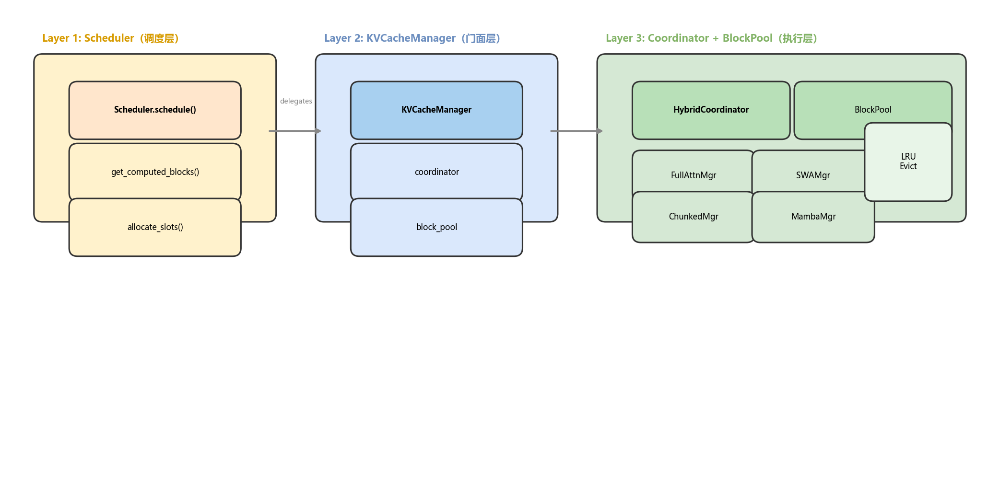
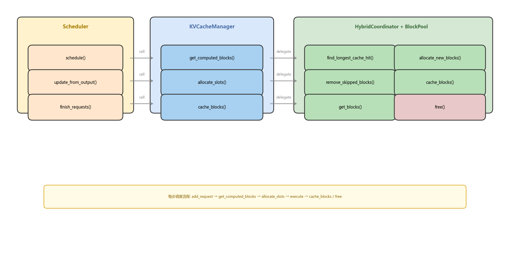
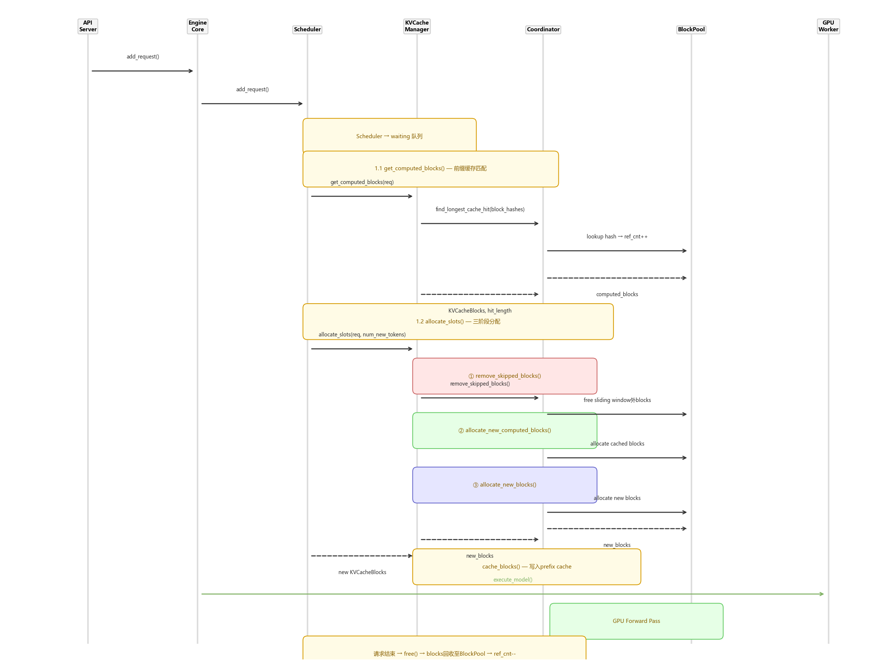
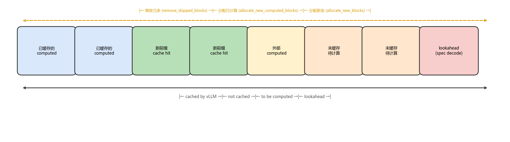

# vLLM KV Cache Manager —— 推理引擎的骨干

> 版本：vLLM V1 (2026-07)
> 核心文件：`vllm/v1/core/kv_cache_manager.py`、`kv_cache_coordinator.py`、`block_pool.py`

## 目录

- [0. 前置知识：为什么 KV Cache Manager 是骨干](#0-前置知识为什么-kv-cache-manager-是骨干)
- [1. 三层架构全景图](#1-三层架构全景图)
- [2. 请求的一生：与 KVCacheManager 的完整交互](#2-请求的一生与-kvcachemanager-的完整交互)
- [3. allocate_slots()——最核心方法深度解析](#3-allocate_slots最核心方法深度解析)
- [4. 前缀缓存（Prefix Caching）](#4-前缀缓存prefix-caching)
- [5. 资源回收与调度协作](#5-资源回收与调度协作)
- [6. 关键数据结构速查表](#6-关键数据结构速查表)
- [7. FAQ](#7-faq)

---

## 0. 前置知识：为什么 KV Cache Manager 是骨干

### 0.1 KV Cache 是什么？

大模型推理时，自注意力需要计算每个 token 对之前所有 token 的 Key-Value。如果不缓存，每次生成新 token 都要重算整个序列——O(n²) 复杂度。KV Cache 将这些中间结果缓存下来，使 decode 阶段只需计算增量。

### 0.2 为什么 KVCacheManager 是"骨干"？

在 vLLM 架构中，KVCacheManager 是**调度器和 GPU 之间的唯一资源管理者**：

- **Scheduler 做决策**："这个请求应该分配多少 token？"
- **KVCacheManager 执行落地**："有哪些物理 block？多少空闲？能否复用前缀缓存？"

没有 KVCacheManager，Scheduler 所有的调度决策都无法落实。它是**将逻辑调度翻译成物理资源分配**的桥梁。

### 0.3 核心能力一览

| 能力 | 方法 | 说明 |
|------|------|------|
| 前缀缓存匹配 | `get_computed_blocks()` | 新请求复用已有 KV Cache，跳过重复计算 |
| Block 分配 | `allocate_slots()` | 为请求分配物理 GPU block |
| Block 回收 | `free()` / `remove_skipped_blocks()` | 滑动窗口外淘汰、请求结束释放 |
| 缓存写入 | `cache_blocks()` | 将已验证的 block 加入前缀缓存哈希表 |
| 缓存失效 | `reset_prefix_cache()` | 权重更新后全部失效 |

---

## 1. 三层架构全景图



```
Layer 1: Scheduler（调度层）
  ↓ 调用 get_computed_blocks() / allocate_slots() / cache_blocks()
Layer 2: KVCacheManager（门面层）
  ↓ 委托给 coordinator
Layer 3: HybridKVCacheCoordinator + BlockPool（执行层）
  ├── BlockPool: 物理 block 池 + LRU 淘汰 + 前缀缓存哈希表
  └── SingleTypeKVCacheManager: 每种 attention 类型独立管理
       ├── FullAttentionManager（全注意力）
       ├── SlidingWindowManager（滑动窗口）
       ├── ChunkedLocalManager（分块局部注意力）
       └── MambaManager（线性注意力）
```

### 与 Scheduler 的紧密协作



每步调度的固定调用链：

```
Scheduler.schedule()
  → get_computed_blocks(req)      # 查前缀缓存
  → allocate_slots(req, N)        # 分配新 block
Scheduler.update_from_output()
  → cache_blocks(req, n_tokens)   # 缓存已验证 block
Scheduler.finish_requests()
  → free(req)                      # 释放结束请求的 block
```

---

## 2. 请求的一生：与 KVCacheManager 的完整交互



### 阶段 1：请求入引擎

```
API Server → EngineCore.add_request()
  → Scheduler.add_request()
  → waiting 队列等待调度
```

此时请求还没有任何 KV Cache block。

### 阶段 2：前缀缓存匹配

Scheduler 每次 pick up 一个 waiting 请求时，先调用 `get_computed_blocks()`：

```python
# kv_cache_manager.py:206-246
def get_computed_blocks(self, request):
    if not self.enable_caching or request.skip_reading_prefix_cache:
        return self.empty_kv_cache_blocks, 0  # 无缓存命中

    max_cache_hit_length = request.num_tokens - 1  # ⚠️ 必须留最后一个token算logits
    computed_blocks, num_new_computed_tokens = (
        self.coordinator.find_longest_cache_hit(
            request.block_hashes, max_cache_hit_length
        )
    )
    return KVCacheBlocks(computed_blocks), num_new_computed_tokens
```

**关键字前缀匹配**：每个 block 有一个 `block_hash`（基于 block 内 token 的哈希值）。`find_longest_cache_hit()` 从第一个 block 开始顺序匹配，找到最长连续匹配的前缀。

**为什么 max_cache_hit_length = num_tokens - 1**？因为最后一个 token 必须重新计算以获取 logits——即使全部命中缓存，也需要算最后一个 token 才能生成下一个。

### 阶段 3：分配资源（核心）

Scheduler 拿到缓存命中信息后，计算 `num_new_tokens`，然后调用 `allocate_slots()`。

### 阶段 4：执行 & 缓存

```
GPU 执行后：
  → update_from_output()
  → cache_blocks(req, num_computed_tokens)
  → 将已验证的 block 写入前缀缓存哈希表
```

### 阶段 5：请求结束 → 回收

```
request.stop / abort
  → Scheduler.finish_requests()
  → KVCacheManager.free(request)
  → 所有 block ref_cnt-- → 可被其他请求复用
```

---

## 3. allocate_slots()——最核心方法深度解析

`allocate_slots()` 是 KVCacheManager 最复杂的方法（`kv_cache_manager.py:248-464`，~216 行），每步调度必调。

### Block 布局



```
|   comp   | new_comp | ext_comp |   new   | lookahead |
|  已缓存   | 新命中   | 外部缓存   | 待计算   | spec解码   |
|          | 前缀缓存  | 来自connector |         |            |
|           cached by vLLM                  | to be computed | lookahead |
```

### 三阶段分配

```python
def allocate_slots(self, request, num_new_tokens, ...):
    # === 阶段 1: 释放滑动窗口外的冗余 block ===
    self.coordinator.remove_skipped_blocks(
        request.request_id, total_computed_tokens, ...

    # === 阶段 2: 检查容量 ===
    num_blocks_to_allocate = self.coordinator.get_num_blocks_to_allocate(...)
    if num_blocks_to_allocate > free_blocks:
        return None  # 资源不足，通知 Scheduler 抢占

    # === 阶段 3: 分配新 block ===
    # 3a: 追加前缀缓存命中的 block
    self.coordinator.allocate_new_computed_blocks(...)

    # 3b: 分配全新的 block
    new_blocks = self.coordinator.allocate_new_blocks(...)

    # 3c: 写入前缀缓存
    num_tokens_to_cache = min(
        total_computed + num_new_tokens,
        request.num_tokens,  # ⚠️ 排除未验证的 draft tokens
    )
    self.coordinator.cache_blocks(request, num_tokens_to_cache)

    return KVCacheBlocks(new_blocks)
```

### Watermark 保护机制

```python
if request.status in (RequestStatus.WAITING, RequestStatus.PREEMPTED):
    watermark_blocks = self.watermark_blocks  # 预留一定空余
    if required_blocks + watermark_blocks > free_blocks:
        return None  # 不让 waiting 请求消耗掉所有剩余 block
```

这防止新请求过度消耗资源，导致已有 running 请求无法被调度继续执行。

---

## 4. 前缀缓存（Prefix Caching）

### 工作原理

```
Block 1:  hash("A gentle breeze")  → {block_id: 0, ref_cnt: 2}
Block 2:  hash("stirred the garden") → {block_id: 1, ref_cnt: 3}
```

当新请求的前缀与已缓存的 block 匹配时：
1. `BlockPool.find_longest_cache_hit()` 按 hash 顺序查找
2. 命中 → 增加 `ref_cnt`
3. Scheduler 可以跳过这些 token 的计算

### HybridCoordinator 的多 Attention 类型协调

对于混合模型（如 Gemma 3——Full Attention + Sliding Window）：

```
HybridKVCacheCoordinator:
  ├── FullAttentionManager(groups=[0,1])    # 全注意力层
  │     ├── cache: 所有 block 都可缓存
  │     └── 命中粒度: block_size
  └── SlidingWindowManager(groups=[2,3])   # 滑动窗口层
        ├── cache: 只缓存最近 window_size 内的 block
        └── 命中: 需要连续窗口匹配
```

`find_longest_cache_hit()` 对每种类型分别查找，取**交集**作为最终命中长度。

---

## 5. 资源回收与调度协作

### 三种回收场景

| 场景 | 触发时机 | 方法 |
|------|---------|------|
| 滑动窗口淘汰 | 每次 `allocate_slots()` 前 | `remove_skipped_blocks()` |
| 请求结束 | `update_from_output()` 检测到 stop | `free()` |
| 前缀缓存淘汰 | LRU 自动触发 | `BlockPool.evict()` |

### 与 Scheduler 抢占的协作

```
Scheduler.schedule():
  allocate_slots(running_req) → 返回 None (资源不足)
  → Scheduler 抢占 running 末尾请求
  → preempted_req → WAITING 队列头部
  → 下次再调度
```

被抢占请求再调度时，KVCacheManager 通过前缀缓存找回之前缓存的 block，减少重复计算。

---

## 6. 关键数据结构速查表

| 数据结构 | 文件:行号 | 关键字段 | 作用 |
|---------|----------|---------|------|
| `KVCacheBlocks` | `kv_cache_manager.py:30` | `blocks: tuple[Sequence[KVCacheBlock], ...]` | Scheduler 与 KVCacheManager 之间的接口 |
| `KVCacheManager` | `kv_cache_manager.py:114` | `coordinator`, `block_pool`, `empty_kv_cache_blocks` | 顶层管理器，对外 API |
| `KVCacheBlock` | `kv_cache_utils.py` | `block_id`, `block_hash`, `ref_cnt`, `is_null` | 单个物理 block |
| `BlockPool` | `block_pool.py` | `free_blocks`, `hash_to_block`, `lru_list` | 物理 block 池 + 前缀缓存哈希表 |
| `HybridKVCacheCoordinator` | `kv_cache_coordinator.py` | `single_type_managers`, `eagle_group_ids` | 多 attention 类型协调器 |
| `SingleTypeKVCacheManager` | `single_type_kv_cache_manager.py` | `block_table`, `allocation_cap` | 单 attention 类型管理器 |
| `KVCacheConfig` | `kv_cache_interface.py` | `num_blocks`, `kv_cache_groups` | KV Cache 配置 |

---

## 7. FAQ

**Q1: 为什么 KVCacheManager 是"骨干"而不是 Scheduler？**

Scheduler 做**决策**（调度哪个请求、分配多少 token），KVCacheManager 做**落地**（实际分配物理 block、管理前缀缓存）。没有 KVCacheManager，Scheduler 的决策无法执行。两者是"大脑"和"躯干"的关系。

**Q2: allocate_slots 返回 None 后怎么处理？**

Scheduler 会尝试**抢占** low-priority running 请求，释放它的 block 后重试；如果抢占也无济于事，该请求保持 WAITING 状态直到有资源的 step。

**Q3: 前缀缓存何时失效？**

- RLHF 权重更新后：调用 `reset_prefix_cache()`
- LRU 淘汰：block pool 满时自动淘汰
- block 被 `free()` 后 ref_cnt 归零

**Q4: 混合模型的 cache 命中率为什么更低？**

因为 HybridCoordinator 取各 attention 类型的**交集**。Full attention 能命中 10 个 block 但 Sliding Window 只能命中 3 个 → 最终只命中 3 个。

---

*报告生成时间: 2026-07-13 | 工具: source-analyzer skill*
