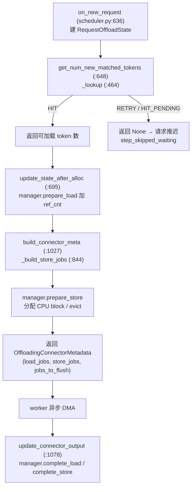
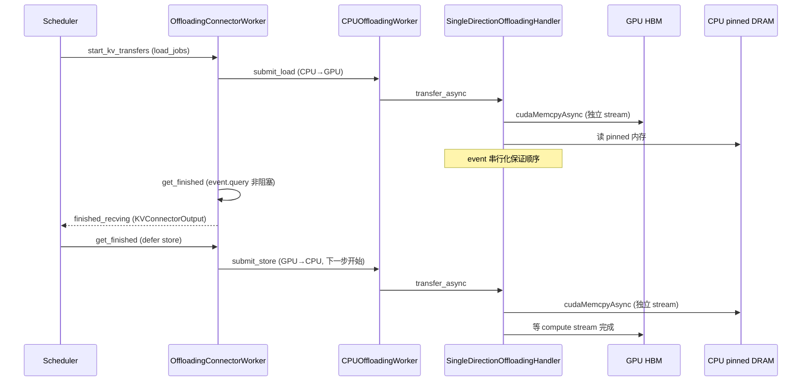
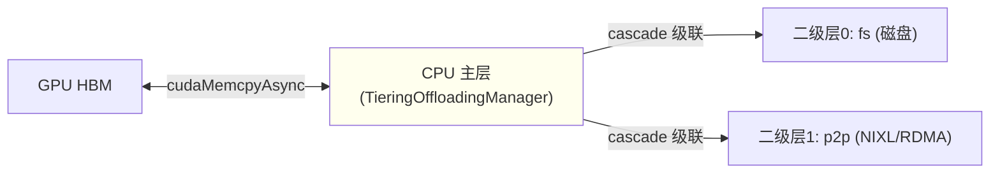
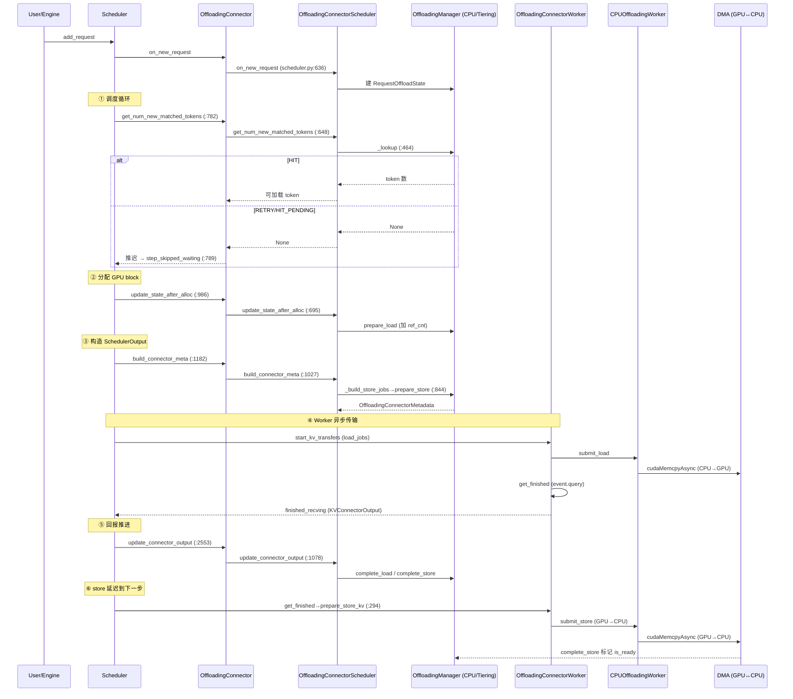

# vLLM KV Cache Offloading 深度解剖

> 基于 `comments-on-v0.25.1` 分支源码（2026-07-17 快照）
> 调研范围：`vllm/v1/kv_offload/`、`vllm/distributed/kv_transfer/kv_connector/v1/offloading*/`、`vllm/config/{cache,vllm}.py`
> 参考：vLLM Blog《Inside vLLM's New KV Offloading Connector》(2026-01-08, IBM Research)、官方 KV Offloading Usage Guide (2026-07-15)

---

## 目录

- [0. 前置知识：设计思想与核心概念](#0-前置知识设计思想与核心概念)
- [1. 全景架构概览](#1-全景架构概览)
- [2. Layer 1：配置与 Connector 桥接](#2-layer-1配置与-connector-桥接)
- [3. Layer 2：Scheduler 侧（OffloadingConnectorScheduler + Manager）](#3-layer-2scheduler-侧offloadingconnectorscheduler--manager)
- [4. Layer 3：Worker 侧（OffloadingConnectorWorker + CPU DMA）](#4-layer-3worker-侧offloadingconnectorworker--cpu-dma)
- [5. Layer 4：多层级 Tiering](#5-layer-4多层级-tiering)
- [6. 完整调用链时序图](#6-完整调用链时序图)
- [7. 关键数据结构速查表](#7-关键数据结构速查表)
- [8. 与 Prefix Cache / 异步调度的关系](#8-与-prefix-cache--异步调度的关系)
- [9. 关键设计点总结](#9-关键设计点总结)
- [10. 启用示例](#10-启用示例)
- [11. 源码文件索引](#11-源码文件索引)
- [12. 快速问题解答（FAQ）](#12-快速问题解答faq)

---

## 0. 前置知识：设计思想与核心概念

### 0.1 为什么需要 KV Offloading

LLM 推理中 **prefill 阶段计算 prompt 的 KV 值非常昂贵**（需 GPU 加速）。vLLM 早已通过 **prefix caching** 在 GPU 显存内跨请求复用前缀 KV。但 GPU 显存容量有限，当并发高、上下文长时：

1. **抢占重算**：显存不足触发 preemption，被丢弃的 KV 重调度时需重算，浪费算力。
2. **GPU prefix cache 容量天花板**：纯 GPU 内缓存装不下大量长共享前缀。

KV Offloading 的核心思想（来自 vLLM Blog）：**把 GPU 显存"延伸"到更大但更慢的存储层（CPU DRAM，可选二级层如本地磁盘 / 跨节点 RDMA）**。一个 KV block 在 GPU 上算完后，**异步拷贝**到 CPU；后续命中这些 block 的请求再把它们 **promotion 回 GPU**。本质上它**就是 prefix cache 的延伸**——数据来源从 GPU 显存变为 CPU/磁盘/网络，命中逻辑完全复用 block hash。

### 0.2 关键设计思想与 Tradeoff

| 设计决策 | 理由 / Tradeoff |
| --- | --- |
| **基于既有 Connector API 扩展** | vLLM 长期有"在请求生命周期前后导入/导出 KV"的 Connector API。Offloading Connector 复用它，对调度核心侵入极小 |
| **异步 API（vLLM 0.9.0 引入）** | 原 API 同步，加载/存储外部 KV 时引擎阻塞。异步化后卸载/加载与模型计算并行，**对用户面延迟无影响**（未命中时后台完成） |
| **`cudaMemcpyAsync` + DMA** | 用 GPU 的 DMA 引擎搬数据，几乎不占 CPU/GPU 计算核心。小物理块时自定义 CUDA kernel 的 TTFT 略优（<15ms），但 DMA 在并发吞吐上反超 5.5%–15%（kernel 占 GPU 核会干扰计算） |
| **跨层连续物理块布局（0.12.0 优化）** | 把按层/按 K-V 碎片化的物理块合并为跨所有层的连续块，块大小从几 KB 增至 0.5–2 MB，DMA 效率更高（TTFT 降 4 倍、吞吐增 5 倍） |
| **可插拔后端（pluggable backend）** | 只需定义 medium 间拷贝函数即可接入新后端（native CPU / LMCache / Tiering fs / p2p） |

### 0.3 性能收益（官方基准，Llama-3.1-8B / H100）

- **单请求 TTFT**：从 CPU 加载比 GPU 重算快 **2–22 倍**（随 prompt 增大）。
- **并发吞吐**：1 万请求、512 token，命中率提升带来**最高 9 倍**吞吐提升（主要收益在吞吐，而非 TTFT）。
- **DMA vs 自定义 kernel**：常见模型（块 ≥ 2MB）上 DMA 吞吐高 32% 且 TTFT 持平。

### 0.4 演进历史

- **vLLM 0.9.0**：Connector API 扩展为异步。
- **vLLM 0.11.0**：引入 Offloading Connector（旧布局，块太小性能差）。
- **vLLM 0.12.0**：跨层连续块布局优化。
- **vLLM 0.14.0 前后**：`--kv-offloading-backend` 参数（PR #24498）、抢占回载 / 竞态修复。

---

## 1. 全景架构概览

**图1：KV Offloading 全景架构**

```mermaid
graph TD
    subgraph L0["配置层"]
        CC["CacheConfig<br/>kv_offloading_size / backend"]
        VI["VllmConfig._post_init_kv_transfer_config<br/>(vllm.py:790)"]
        CC --> VI
    end

    subgraph L1["Connector 桥接层 (KVConnectorBase_V1)"]
        OC["OffloadingConnector<br/>(offloading_connector.py:51)"]
        VI -->|kv_connector=OffloadingConnector| OC
    end

    subgraph L2["Scheduler 进程"]
        OCS["OffloadingConnectorScheduler<br/>(scheduler.py:319)"]
        MGR["OffloadingManager<br/>CPUOffloadingManager / TieringOffloadingManager"]
        OC -->|role=SCHEDULER| OCS
        OCS -->|spec.get_manager()| MGR
    end

    subgraph L3["Worker 进程"]
        OCW["OffloadingConnectorWorker<br/>(worker.py:33)"]
        WKR["CPUOffloadingWorker<br/>(gpu_worker.py:468)"]
        H["SingleDirectionOffloadingHandler<br/>transfer_async (gpu_worker.py:240)"]
        OC -->|role=WORKER| OCW
        OCW -->|spec.get_worker()| WKR
        WKR --> H
    end

    subgraph L4["存储层"]
        GPU["GPU HBM"]
        CPU["CPU pinned DRAM"]
        SEC["二级层: fs / p2p(NIXL)"]
        CPU -.中转.-> SEC
    end

    OCS -.lookup/store 决策.-> MGR
    MGR -.地址/ref_cnt.-> OCS
    OCW -.load/store job.-> WKR
    H -.cudaMemcpyAsync DMA.-> CPU
    H -.cudaMemcpyAsync DMA.-> GPU
```

**各层职责一句话：**

- **配置层**：`--kv-offloading-size` 经 `_post_init_kv_transfer_config` 翻译成 `KVTransferConfig`（connector 名 + `cpu_bytes_to_use`）。
- **Connector 桥接层**：`OffloadingConnector` 把 scheduler 的 KVConnector 钩子**按 role 分派**给 scheduler 子对象或 worker 子对象。
- **Scheduler 侧**：`OffloadingConnectorScheduler` 跟踪每个请求的 offload 状态，调用 `OffloadingManager` 做地址分配 / 淘汰 / 引用计数，产出 load/store job。
- **Worker 侧**：`OffloadingConnectorWorker` 把 job 变成真实异步 DMA；`SingleDirectionOffloadingHandler` 用独立 CUDA stream + event 串行化传输。
- **存储层**：CPU pinned DRAM 是主层（直连 GPU）；fs/p2p 是二级层（经 CPU 中转）。

---

## 2. Layer 1：配置与 Connector 桥接

### 2.1 配置入口

`CacheConfig` 两个字段（`vllm/config/cache.py:182`、`:188`）：

```python
kv_offloading_size: float | None = None      # GiB；None = 不启用
kv_offloading_backend: KVOffloadingBackend = "native"  # "native" | "lmcache"
```

命令行经 `vllm/engine/arg_utils.py:1197` 注册 `--kv-offloading-size` / `--kv-offloading-backend`。

### 2.2 翻译成 KVConnector（`vllm/config/vllm.py:790`）

```python
# vllm/config/vllm.py:797-824
if kv_offloading_size is None:
    return                      # 不启用
...
if kv_offloading_backend == "native":
    config_connector = "SimpleCPUOffloadConnector" if envs.VLLM_USE_SIMPLE_KV_OFFLOAD \
                       else "OffloadingConnector"
    kv_transfer_config.kv_connector = config_connector
    kv_transfer_config.kv_connector_extra_config.update(
        {"cpu_bytes_to_use": kv_offloading_size * (1 << 30)})
elif kv_offloading_backend == "lmcache":
    kv_transfer_config.kv_connector = "LMCacheMPConnector"   # 不传播 size
kv_transfer_config.kv_role = "kv_both"
```

| 后端 | connector | 说明 |
| --- | --- | --- |
| `native`（默认） | `OffloadingConnector` | v1 新架构，CPU 单层级 + Tiering 多层级 |
| `native` + `VLLM_USE_SIMPLE_KV_OFFLOAD` | `SimpleCPUOffloadConnector` | 简化版（`vllm/v1/simple_kv_offload/`） |
| `lmcache` | `LMCacheMPConnector` | 外接 LMCache 服务进程，容量自管 |

### 2.3 `OffloadingConnector` 桥接（`offloading_connector.py:51`）

```python
# offloading_connector.py
class OffloadingConnector(KVConnectorBase_V1, SupportsHMA):
    def __init__(self, ...):
        spec = OffloadingSpecFactory.create_spec(...)   # :59
        if role == SchedulerRole.SCHEDULER:              # :63
            self.connector_scheduler = OffloadingConnectorScheduler(spec)
        elif role == SchedulerRole.WORKER:               # :65
            self.connector_worker = OffloadingConnectorWorker(spec)
```

**它实现的 KVConnectorBase_V1 钩子（全部委托给子对象）：**

| 钩子 | 行号 | 委托目标 |
| --- | --- | --- |
| `on_new_request` | `:127` | scheduler |
| `get_num_new_matched_tokens` | `:131` | scheduler（前缀匹配） |
| `update_state_after_alloc` | `:139` | scheduler |
| `build_connector_meta` | `:147` | scheduler |
| `update_connector_output` | `:157` | scheduler（worker 回报后） |
| `start_load_kv` | `:89` | worker.start_kv_transfers |
| `get_finished` | `:111` | worker（defer store 到下一步） |
| `request_finished` | `:161` | scheduler |

**Scheduler 中调用位置（`vllm/v1/core/sched/scheduler.py`）：**

- `:2098` `add_request` → `connector.on_new_request`
- `:782` 调度循环 → `connector.get_num_new_matched_tokens`；返回 `None` 时（`:789`）把请求推迟到 `step_skipped_waiting`
- `:986` `update_state_after_alloc`
- `:1182` `_build_kv_connector_meta` → `connector.build_connector_meta`
- `:2553` `_update_from_kv_xfer_finished` → `connector.update_connector_output`

> **边界/陷阱**：`get_num_new_matched_tokens` 返回 `None` 是**异步重试信号**，不是错误。Scheduler 据此跳过该请求（放入 `step_skipped_waiting`），下一步再查——这是 offload 异步性的核心入口。

---

## 3. Layer 2：Scheduler 侧（OffloadingConnectorScheduler + Manager）

**图2：Scheduler 侧一次调度步的 offload 流程**



### 3.1 `on_new_request`（`scheduler.py:636`）
建立 `RequestOffloadState`，内嵌每个 KV group 的 `RequestGroupState`（记录 `offload_keys`、`block_ids`、`next_stored_block_idx`）。

### 3.2 `get_num_new_matched_tokens` + `_lookup`（`scheduler.py:648` / `:464`）
- **full-attention group** 做 *maximal prefix lookup*（`:390`）：从前往后连续 `HIT` 计数，遇 `MISS` 即停。
- **sliding-window group** 做 *suffix lookup*（`:412`）：从后往前数 `sliding_window_size` 个连续命中。
- manager 返回 `RETRY`/`HIT_PENDING` 时，`_lookup` 返回 `None`（`:594`）→ 请求被推迟。
- 启用 GPU prefix caching 时，`_blocks_being_loaded` 集合（`:602`）去重，避免同一 block 重复 load。

### 3.3 `update_state_after_alloc`（`scheduler.py:695`）
计算需 load 的 offloaded block，调用 `manager.prepare_load`（**加 ref_cnt 防 evict**），生成 load job。不变量：`assert not req_status.transfer_jobs`（同一时刻要么一个 load job，要么多个 store job）。

### 3.4 `build_connector_meta`（`scheduler.py:1027`）
1. `_update_req_states`（`:1030`）：更新 block ids，处理 sliding window block 重分配（零化 stale）。
2. `_build_store_jobs`（`:844`）：对每个 scheduled request 准备卸载新算出的 prompt block。
   - `offload_prompt_only` 默认 `true` → 只卸 prefill block，decode block 被 clamp 跳过。
   - `manager.prepare_store` 分配 CPU block、evict、返回 `store_spec`。
   - **store job 延迟到下一步开始**才提交（`prepare_store_kv`），避免与 token sampling 争抢。
3. 处理被抢占 / block 重分配导致的 flush（`jobs_to_flush`）。

### 3.5 `update_connector_output`（`scheduler.py:1078`）
根据 `completed_jobs` 递减 pending_count（需等所有 worker 完成）；job 完成时 `manager.complete_load`（`:1142`）/ `complete_store`（`:1140`）（减 ref_cnt、标记可 evict / 可 load）。

### 3.6 `OffloadingManager` 抽象与 CPU 实现

`OffloadingManager(ABC)`（`base.py:177`）+ `OffloadingSpec(ABC)`（`base.py:486`，`get_manager()` `:569` / `get_worker()` `:578`）。工厂 `OffloadingSpecFactory`（`factory.py:17`）注册 `CPUOffloadingSpec` → `vllm.v1.kv_offload.cpu.spec`、`TieringOffloadingSpec` → `vllm.v1.kv_offload.tiering.spec`（`:66`）。

`CPUOffloadingManager`（`cpu/manager.py:36`）关键方法：

| 方法 | 行号 | 作用 |
| --- | --- | --- |
| `lookup` | `:116` | 返回 MISS / HIT_PENDING / HIT |
| `prepare_load` | `:133` | 加 ref_cnt，返回 load_spec |
| `prepare_store` | `:169` | 分配 CPU block / evict；返回 `None` 表示无法存储 |
| `complete_load` | `:156` | 减 ref_cnt |
| `complete_store` | `:240` | 标记 `is_ready`，block 可加载 |

---

## 4. Layer 3：Worker 侧（OffloadingConnectorWorker + CPU DMA）

**图3：Worker 侧异步 DMA 传输**



### 4.1 `OffloadingConnectorWorker`（`worker.py:33`）
- `start_kv_transfers`（`:281`）：提交 load job（`:288`）+ 上一步 deferred store（`:283`）。
- `prepare_store_kv`（`:294`）：把 store job **推迟到下一步开头**入 `_unsubmitted_store_jobs`（`:300`），避免阻塞 token 生成。
- `get_finished`（`:304`）：`mark_completed`（`:334`）+ 收集 `finished_recving`（`:335`），让 scheduler 恢复被阻塞请求。

### 4.2 `CPUOffloadingWorker`（`gpu_worker.py:468`）
组合两个 `SingleDirectionOffloadingHandler`（GPU→CPU store、CPU→GPU load）。
- `submit_store`（`:535`）→ `_store_handler.transfer_async`
- `submit_load`（`:541`）→ `_load_handler.transfer_async`
- `get_finished`（`:547`）：合并两 handler 完成结果

### 4.3 真实 DMA：`SingleDirectionOffloadingHandler.transfer_async`（`gpu_worker.py:240`）

**拷贝内核选择 `_select_swap_blocks_fn`（`:35`）：**
- GPU→CPU 带宽受限 → 用 `ops.swap_blocks_batch`（C++ CUDA copy engine，`:42`）。
- CPU→GPU 且 Triton 可用 + 小且 8 字节对齐 → 用 Triton `swap_blocks_batch`（`:51`）。
- XPU / 无 Triton 的 ROCm → 回退 C++ DMA（XPU 无 CUDA UVA，Triton `tl.load(cpu_ptr)` 无效）。

**流式串行化：**
- 每个 transfer 用独立 CUDA stream，stream 间用 event 串行化（`stream.wait_event(last_event)`）。
- GPU→CPU：先 `stream.wait_stream(compute)`，确保 KV 算完再搬。
- CPU→GPU：用 `CU_MEMCPY_SRC_ACCESS_ORDER_ANY`，驱动流水线化 host 读取（pinned 内存不被并发 GPU stream 写）。
- CPU 内存：`cudaHostRegister` 注册 mmap region 为 pinned，启用 DMA；`block_size_factor` 支持多 GPU block 合并成更大 offloaded block。

---

## 5. Layer 4：多层级 Tiering

**图4：Tiering 层级与数据流**



`TieringOffloadingSpec`（`tiering/spec.py:59`）= CPU 主层 + 0..N 二级层。**只有 CPU 主层能直连 GPU**，二级层传输都经 CPU 中转。

### 5.1 编排原则（`tiering/manager.py:123` 源码 docstring）
1. 总是级联到所有二级层；2. 主层是网关；3. staged promotion（二级层 block 必须先 promotion 到主层）；4. 透明 retry；5. ref_cnt 作 evict 保护。

### 5.2 关键方法
- `lookup`（`:238`）：先查主层（HIT 短路）；miss 查二级层，命中则 `_initiate_promotion`（`:282`）。
  - `_initiate_promotion`（`:282`）：**立即在主层分配 slot 并设 `ref_cnt=-1` 标记 in-flight**，推迟 `submit_load` 到 `on_schedule_end`（`:320`）批量提交 → 返回 `RETRY`。
- `complete_store`（`:498`）：主层存完后 cascade 到所有二级层（`:531` 起），每个二级层一次 `prepare_read` + `submit_store`。

### 5.3 二级层类型
- **fs**（`tiering/fs/`）：block 写本地目录，布局 `<root_dir>/<model>_<digest>/<model>_<digest>_r<rank>/<hhh>/<hh>_g<group_idx>/<hash>.bin`。跨进程共享须 `PYTHONHASHSEED=0`。
- **p2p**（含 P/D，`tiering/p2p/`）：通过 **NIXL over RDMA** 跨 vLLM 实例共享 KV block，无需共享文件系统。`backends` 可配 `UCX`/`MOONCAKE`/`GDS_MT`/`LIBFABRIC`。

---

## 6. 完整调用链时序图

**图5：端到端 offload 调用链（含异步重试）**



---

## 7. 关键数据结构速查表

| 数据结构 | 定义位置 | 关键字段 / 值 | 作用 |
| --- | --- | --- | --- |
| `OffloadKey` | `base.py:30` | `block_hash + group_idx.to_bytes(4)` | block 去重主键（bytes 避免 tuple GC） |
| `LookupResult` | `base.py:56` | `MISS`/`HIT`/`HIT_PENDING`/`RETRY` | lookup 结果；RETRY 触发异步重试 |
| `OffloadPolicy` | `base.py:65` | `BLOCK_LEVEL`/`REQUEST_LEVEL` | 卸载粒度：仅新 block / 整条请求 |
| `GPULoadStoreSpec` | `base.py:362` | `block_ids`/`group_sizes`/`block_indices` | 一次 load/store 的位置描述 |
| `CanonicalKVCaches` | `base.py:432` | `tensors`/`group_data_refs` | 规范化为 `(num_blocks, page_size_bytes)` int8，解耦 attention 布局 |
| `OffloadingManager` | `base.py:177` | `lookup`/`prepare_load`/`prepare_store`/`complete_*` | scheduler 侧跟踪/地址/evict/ref_cnt |
| `OffloadingWorker` | `base.py:459` | `submit_load`/`submit_store`/`get_finished` | worker 侧异步传输 |
| `OffloadingSpec` | `base.py:486` | `get_manager()`/`get_worker()` | 工厂，封装 CPU / Tiering 配置 |

---

## 8. 与 Prefix Cache / 异步调度的关系

- **复用 block hash**：offload 层命中逻辑与 prefix cache 完全一致，只是数据来源从 GPU 显存变为 CPU/磁盘/网络。官方基准**显式禁用 GPU prefix caching** 以纯评估 CPU 缓存命中（说明它可独立作为 prefix cache 层）。
- **异步延后 ↔ 调度器**：`lookup` 返回 `None`（RETRY/HIT_PENDING）时，scheduler 把请求推迟到 `step_skipped_waiting`（非 `WAITING_FOR_REMOTE_KVS` 路径），下一步重试。
- **真正的 load 完成信号走另一条路**：worker `get_finished` 收集 `finished_recving` → `KVConnectorOutput.finished_recving` → scheduler `_update_from_kv_xfer_finished`（`:2553`）→ 触发 `WAITING_FOR_REMOTE_KVS` 请求提升（`:2516`）。
- **store 也异步**：`prepare_store` 在 scheduler 步内完成地址分配，真实 DMA 推迟到下一步 `prepare_store_kv`，`complete_store` 在 worker 回报后标记可 load。

---

## 9. 关键设计点总结

| 设计点 | 实现 |
| --- | --- |
| 零核心开销 | DMA 异步 + 独立 CUDA stream，与计算并行 |
| block 级去重 | 基于 `block_hash`，与 prefix caching 共享命中逻辑 |
| evict 保护 | `ref_cnt`：load/store 期间 block 不被淘汰 |
| 淘汰策略 | LRU / ARC（CPU 主层）；`store_threshold` 控制出现次数才卸载 |
| `offload_prompt_only` | 默认只卸 prefill block（reasoning 模型丢弃 thinking 后 decode token 无意义） |
| per-request 控制 | `max_offload_tokens`：只卸前 N token |
| 混合模型兼容 | 按 KV group 处理；`alignment_block_count` 跳过不可达 SWA block；EAGLE/MTP draft group 排除 volatile 尾块 |
| 多层级 | CPU 主层 + fs/p2p 二级层，主层网关 + staged promotion + 透明 retry |

---

## 10. 启用示例

**单层级（仅 CPU）：**
```bash
vllm serve <model> \
  --kv-transfer-config '{
    "kv_connector": "OffloadingConnector",
    "kv_role": "kv_both",
    "kv_connector_extra_config": {"block_size": 64, "cpu_bytes_to_use": 1000000000}
  }'
```

**多层级（CPU + 本地磁盘）：**
```bash
vllm serve <model> \
  --kv-transfer-config '{
    "kv_connector": "OffloadingConnector",
    "kv_role": "kv_both",
    "kv_connector_extra_config": {
      "spec_name": "TieringOffloadingSpec",
      "cpu_bytes_to_use": 10737418240,
      "block_size": 16,
      "eviction_policy": "lru",
      "secondary_tiers": [{"type": "fs", "root_dir": "/mnt/kv_cache",
                           "n_read_threads": 32, "n_write_threads": 16}]
    }
  }'
```

**per-request 限制：**
```json
{"model": "<model>", "prompt": "...",
 "kv_transfer_params": {"max_offload_tokens": 1024}}
```

---

## 11. 源码文件索引

| 文件 | 职责 |
| --- | --- |
| `vllm/config/cache.py:182` | `kv_offloading_size` / `kv_offloading_backend` 定义 |
| `vllm/config/vllm.py:790` | `_post_init_kv_transfer_config`：开关 → KVConnector 映射 |
| `vllm/engine/arg_utils.py:1197` | `--kv-offloading-size` / `--kv-offloading-backend` 注册 |
| `vllm/distributed/kv_transfer/kv_connector/v1/offloading_connector.py:51` | `OffloadingConnector`（KVConnector 桥接） |
| `vllm/distributed/kv_transfer/kv_connector/v1/offloading/scheduler.py:319` | `OffloadingConnectorScheduler` |
| `vllm/distributed/kv_transfer/kv_connector/v1/offloading/worker.py:33` | `OffloadingConnectorWorker` |
| `vllm/v1/kv_offload/base.py` | `OffloadingManager` / `OffloadingWorker` / `OffloadingSpec` + 数据模型 |
| `vllm/v1/kv_offload/factory.py:17` | `OffloadingSpecFactory` 注册表 |
| `vllm/v1/kv_offload/cpu/spec.py` | `CPUOffloadingSpec` |
| `vllm/v1/kv_offload/cpu/manager.py:36` | `CPUOffloadingManager` |
| `vllm/v1/kv_offload/cpu/gpu_worker.py:468` | `CPUOffloadingWorker` + `SingleDirectionOffloadingHandler`（DMA） |
| `vllm/v1/kv_offload/tiering/spec.py:59` | `TieringOffloadingSpec` |
| `vllm/v1/kv_offload/tiering/manager.py:123` | `TieringOffloadingManager` |
| `vllm/v1/kv_offload/tiering/fs/` | 文件系统二级层 |
| `vllm/v1/kv_offload/tiering/p2p/` | NIXL/RDMA 二级层（含 P/D） |
| `vllm/v1/core/sched/scheduler.py` | 调度器侧 connector 钩子调用点（`:782`/`:986`/`:1182`/`:2553`） |
| `vllm/v1/simple_kv_offload/` | `SimpleCPUOffloadConnector`（简化版） |

---

## 12. 快速问题解答（FAQ）

**Q1：KV Offloading 和 GPU prefix caching 是什么关系？**
A：offload 层是 prefix cache 的**延伸**。两者共享同一套 `block_hash` 命中逻辑，区别仅在于数据落在 GPU 显存还是 CPU/磁盘/网络。可独立作为一层 prefix cache 使用（官方基准就禁用了 GPU prefix caching 来纯测 CPU 命中）。

**Q2：`get_num_new_matched_tokens` 返回 `None` 是报错吗？**
A：不是。它表示 manager 还在异步处理（RETRY/HIT_PENDING），scheduler 据此把请求放入 `step_skipped_waiting` 推迟到下一步重试。这是 offload 异步性的核心入口。

**Q3：为什么 store job 要延迟到下一步才开始？**
A：避免与 token sampling 争抢 DMA 带宽，拖慢生成。scheduler 步内只做地址分配（`prepare_store`），真实 `cudaMemcpyAsync` 推迟到下一步开头（`prepare_store_kv`）。

**Q4：Tiering 的二级层能直连 GPU 吗？**
A：不能。只有 CPU 主层能直连 GPU，所有 GPU↔二级层（fs/p2p）传输都经 CPU 主层中转（主层网关 + staged promotion）。

**Q5：`cpu_bytes_to_use` 是 per-worker 还是总和？**
A：是**所有 worker 共享的主机内存总量**，非 per-worker。

**Q6：跨进程 / 跨节点共享 KV 要注意什么？**
A：FS / P2P 层跨实例共享时必须固定 `PYTHONHASHSEED=0`（或一致值），否则 block hash 种子随机导致文件名/键不一致。

**Q7：为什么用 DMA 而不是自定义 CUDA copy kernel？**
A：DMA 走 GPU 的 copy engine，不占计算核心，并发吞吐反超自定义 kernel 5.5%–15%（kernel 会与模型计算争用）。仅极小物理块（<0.5MB）时 kernel 的 TTFT 略优（<15ms）。
