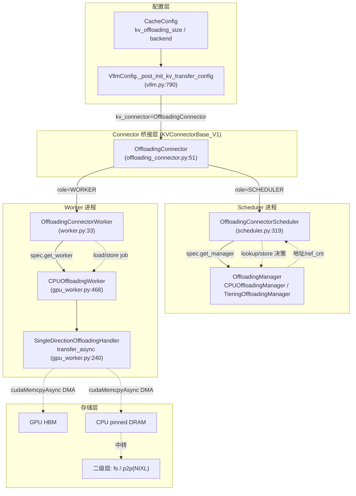
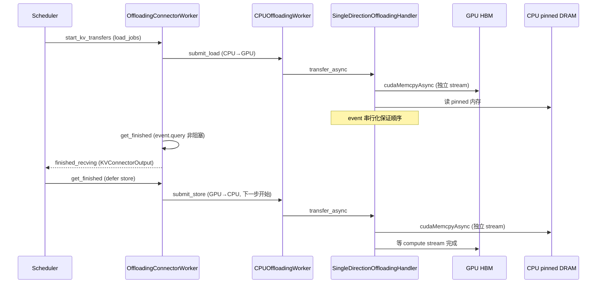
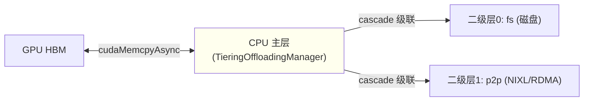
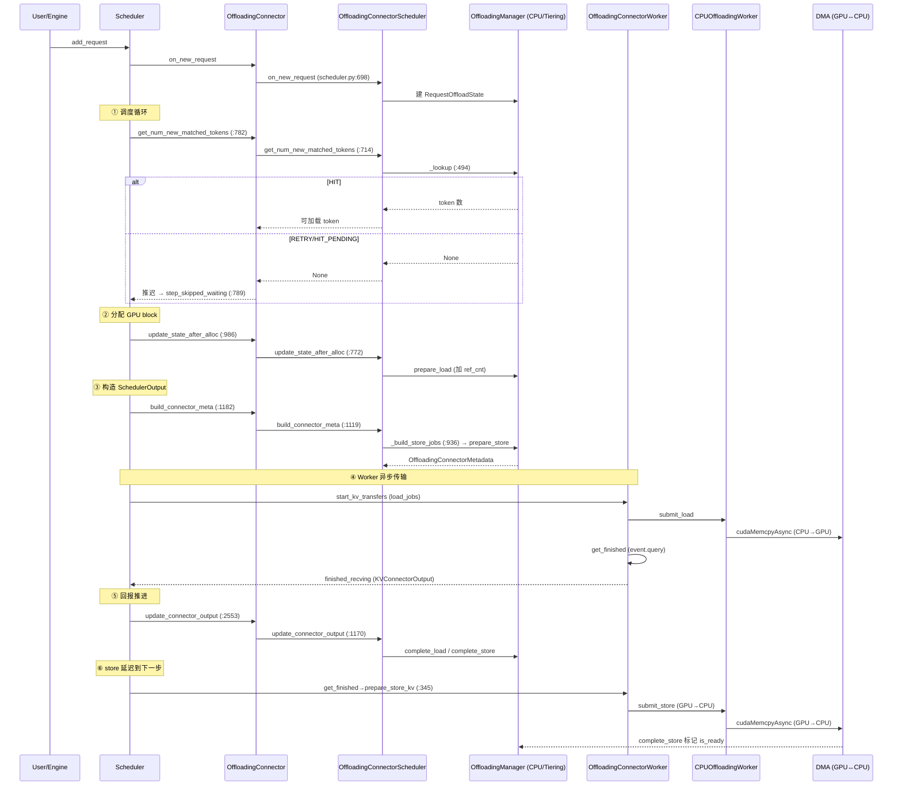

# vLLM KV Cache Offloading 深度解剖

> 基于 `comments-on-v0.25.1` 分支源码（2026-07-17 快照）
> 调研范围：`vllm/v1/kv_offload/`、`vllm/distributed/kv_transfer/kv_connector/v1/offloading*/`、`vllm/config/{cache,vllm}.py`
> 参考：vLLM Blog《Inside vLLM's New KV Offloading Connector》(2026-01-08, IBM Research)、官方 KV Offloading Usage Guide (2026-07-15)

---

## 目录

- [0. 前置知识：设计思想与核心概念](#0-前置知识设计思想与核心概念)
- [0.5 vLLM KV Cache 内部组织（理解 offload 的前提）](#05-vllm-kv-cache-内部组织理解-offload-的前提)
- [1. 全景架构概览](#1-全景架构概览)
- [2. Layer 1：配置与 Connector 桥接](#2-layer-1配置与-connector-桥接)
- [3. Layer 2：Scheduler 侧（OffloadingConnectorScheduler + Manager）](#3-layer-2scheduler-侧offloadingconnectorscheduler--manager)
- [4. Layer 3：Worker 侧（OffloadingConnectorWorker + CPU DMA）](#4-layer-3worker-侧offloadingconnectorworker--cpu-dma)
- [5. Layer 4：多层级 Tiering](#5-layer-4多层级-tiering)
- [6. 完整调用链时序图](#6-完整调用链时序图)
- [7. 关键数据结构速查表](#7-关键数据结构速查表)
- [8. 与 Prefix Cache / 异步调度的关系](#8-与-prefix-cache--异步调度的关系)
- [9. 关键设计点总结](#9-关键设计点总结)
- [10. 启用示例](#10-启用示例)
- [11. 源码文件索引](#11-源码文件索引)
- [12. 快速问题解答（FAQ）](#12-快速问题解答faq)

---

## 0. 前置知识：设计思想与核心概念

### 0.1 为什么需要 KV Offloading

LLM 推理中 **prefill 阶段计算 prompt 的 KV 值非常昂贵**（需 GPU 加速）。vLLM 早已通过 **prefix caching** 在 GPU 显存内跨请求复用前缀 KV。但 GPU 显存容量有限，当并发高、上下文长时：

1. **抢占重算**：显存不足触发 preemption，被丢弃的 KV 重调度时需重算，浪费算力。
2. **GPU prefix cache 容量天花板**：纯 GPU 内缓存装不下大量长共享前缀。

KV Offloading 的核心思想（来自 vLLM Blog）：**把 GPU 显存"延伸"到更大但更慢的存储层（CPU DRAM，可选二级层如本地磁盘 / 跨节点 RDMA）**。一个 KV block 在 GPU 上算完后，**异步拷贝**到 CPU；后续命中这些 block 的请求再把它们 **promotion 回 GPU**。本质上它**就是 prefix cache 的延伸**——数据来源从 GPU 显存变为 CPU/磁盘/网络，命中逻辑完全复用 block hash。

### 0.2 关键设计思想与 Tradeoff

| 设计决策 | 理由 / Tradeoff |
| --- | --- |
| **基于既有 Connector API 扩展** | vLLM 长期有"在请求生命周期前后导入/导出 KV"的 Connector API。Offloading Connector 复用它，对调度核心侵入极小 |
| **异步 API（vLLM 0.9.0 引入）** | 原 API 同步，加载/存储外部 KV 时引擎阻塞。异步化后卸载/加载与模型计算并行，**对用户面延迟无影响**（未命中时后台完成） |
| **`cudaMemcpyAsync` + DMA** | 用 GPU 的 DMA 引擎搬数据，几乎不占 CPU/GPU 计算核心。小物理块时自定义 CUDA kernel 的 TTFT 略优（<15ms），但 DMA 在并发吞吐上反超 5.5%–15%（kernel 占 GPU 核会干扰计算） |
| **跨层连续物理块布局（0.12.0 优化）** | 把按层/按 K-V 碎片化的物理块合并为跨所有层的连续块，块大小从几 KB 增至 0.5–2 MB，DMA 效率更高（TTFT 降 4 倍、吞吐增 5 倍） |
| **可插拔后端（pluggable backend）** | 只需定义 medium 间拷贝函数即可接入新后端（native CPU / LMCache / Tiering fs / p2p） |

### 0.3 性能收益（官方基准，Llama-3.1-8B / H100）

- **单请求 TTFT**：从 CPU 加载比 GPU 重算快 **2–22 倍**（随 prompt 增大）。
- **并发吞吐**：1 万请求、512 token，命中率提升带来**最高 9 倍**吞吐提升（主要收益在吞吐，而非 TTFT）。
- **DMA vs 自定义 kernel**：常见模型（块 ≥ 2MB）上 DMA 吞吐高 32% 且 TTFT 持平。

### 0.4 演进历史

- **vLLM 0.9.0**：Connector API 扩展为异步。
- **vLLM 0.11.0**：引入 Offloading Connector（旧布局，块太小性能差）。
- **vLLM 0.12.0**：跨层连续块布局优化。
- **vLLM 0.14.0 前后**：`--kv-offloading-backend` 参数（PR #24498）、抢占回载 / 竞态修复。

---

## 0.5 vLLM KV Cache 内部组织（理解 offload 的前提）

> offload 之前必须先把"GPU 上到底缓存了什么、怎么摆的"讲清楚。后续 §3/§4 里出现的每个术语——`block`、`page`、`kv_cache_groups`、`block_hashes`、`block_ids`——都源于此。本节源码锚点：`vllm/v1/kv_cache_interface.py`、`vllm/v1/core/kv_cache_utils.py`、`vllm/v1/core/kv_cache_coordinator.py`。

### 0.5.1 KV cache 是什么：per-token 的 K/V 张量

Transformer 自注意力中，第 `i` 个 token 的 Key/Value 向量只由它自己（及它之前的 token）决定。prefill / decode 时逐 token 算出 K、V，堆叠成该层的 K 张量、V 张量：

- **单层形状**：`(num_tokens, num_kv_heads, head_dim)`，dtype 多为 `fp16`/`bf16`，也可能 `fp8`/`nvfp4`（KV 量化）。
- **必须缓存**：下一步 decode 要复用之前所有 token 的 KV，不能每步重算。

offload 搬运的"字节"正是这些 K/V 张量（含 K 和 V 两份）。

### 0.5.2 PagedAttention：KV cache 以"块"为单位管理

vLLM 不把一条序列的 KV 存成连续大块，而是：

1. 预分配一块连续 GPU 显存，切成 `num_blocks` 个**定长 block**；每 block 装 `block_size`（默认 16）个 token 的 KV。
2. 序列的 KV 物理上**不要求连续**：每个请求持有一张 **block table**（物理 block id 列表）。逻辑位置 `pos` → 物理块 `block_table[pos // block_size]`，块内偏移 `pos % block_size`。

好处：按需分配、跨请求共享前缀块（prefix caching）、按块淘汰回收。**offload 的 load/store 正是以这些物理 block 为最小搬运单位**（`block_ids`）。

### 0.5.3 GPU 上每层的 KV 张量布局

单层 KV cache 张量形状大致为 `(num_blocks, block_size, num_kv_heads, head_dim)`——具体内层顺序（head 是否 interleave、是否转置）由 attention backend（FlashAttention / FlashInfer 等）决定，正是 §4.1 要把它规范化成 `(num_blocks, page_size_bytes) int8` 的原因。

- **一个 block 的字节数 = `page_size_bytes`**（含可能 padding）。`AttentionSpec.page_size_bytes`（`kv_cache_interface.py:173`）计算为：

  ```python
  # real_page_size_bytes (:196); K、V 各一份
  2 * block_size * num_kv_heads * head_dim * get_dtype_size(dtype)
  ```

- **SWA / MLA 层布局不同**：`SlidingWindowSpec`（`kv_cache_interface.py:518`）只保留窗口内 token，`real_page_size_bytes`（`:527`）公式变了；`SlidingWindowMLASpec`（`:590`）甚至 `storage_block_size = block_size // compress_ratio`（MLA 压缩）。这导致 `page_size_bytes`（含 padding）与 `real_page_size_bytes`（真实数据）可能不同——这是 §4.1「page vs real_page」的源头。
- **Mamba / SSM 层没有"注意力 KV"**：它是一组 state 张量（`MambaSpec.shapes/dtpyes`，`kv_cache_interface.py:669`），同样按 block 管理（`worker.py:135` 的 `state_tensors` 分支即处理它）。

### 0.5.4 KV cache groups：混合模型的分组

不是所有层的 KV 都一样大 / 同语义：

- **普通模型**：所有层同构 → `kv_cache_groups` 只有一个 group，含全部层（`KVCacheConfig.kv_cache_groups`，`kv_cache_interface.py:929`）。
- **混合模型**（如 DeepSeek V4：full-attn + sliding-window + Mamba）：每层 KV 大小/语义不同，无法共用一张 block table。vLLM 按"spec 相同的层"聚成多个 `KVCacheGroupSpec`（`kv_cache_interface.py:905`），**每个 group 共享一张 block table、有独立 `block_ids`**。

offload 严格按 group 遍历：`scheduler.py` 对每个 group 分别算 load/store、分别配 `GroupOffloadConfig`（§3.1）；worker 侧 `group_data_refs[group]` 把该 group 各层映射到规范化张量（§4.1）。`KVCacheGroupSpec.is_eagle_group`（`:916`）标记 speculative draft 层（§3.1 排除其 volatile 尾块）。

### 0.5.5 Packed 布局：多层拼进一块连续存储

为放大 DMA 块、提升吞吐，vLLM 0.12 起支持**跨层连续物理块**。某些模型（如 DSv4）把多层 KV 拼进同一个 `KVCacheTensor`，用两个字段描述（`kv_cache_interface.py:893`）：

- `block_stride`：每 manager-block 的**总字节数**（含所有被打包层），`0` 表示非 packed。
- `shared_by`：哪些层共享这块 tensor。

这正是 §4.1 `register_kv_caches` 检测 `block_stride and shared_by` 后走 packed 路径、用 `as_strided` 展开成「每行一个 block、行宽=block_stride」大视图的根本原因。

### 0.5.6 Block hashing：前缀指纹，prefix cache 与 offload 的共同基石

- 每个 block 的 token 内容被哈希成 `BlockHash`（`kv_cache_utils.py:hash_block_tokens:600`），且**链式**：第 `i` 个 block 的 hash = `f(第 i-1 个 block 的 hash, 本 block token ids)`（`:602`）。所以每个 hash 唯一指纹"到该边界为止的前缀"。
- `Request.block_hashes` 以 `hash_block_size` 个 token 为粒度。单 group 时 = `block_size`；多 group 时取各 group block_size 的 GCD 或 `cache_config.hash_block_size`（`resolve_kv_cache_block_sizes`，`kv_cache_utils.py:607`）。
- **两大用途**（呼应 §8 "offload 是 prefix cache 的延伸"）：
  1. GPU prefix caching 用 hash 命中复用显存内 KV；
  2. **offload 用同一个 hash 做块级去重 / 命中判定**——`make_offload_key(hash, group_idx)` 把 hash 升级成跨存储层的 offload 主键（§3.3）。数据从 GPU 显存换成 CPU/磁盘，命中逻辑完全复用 hash，这是整篇文档成立的前提。

### 0.5.7 GPU block ↔ offloaded block 的粒度关系

- **GPU block**：`block_size` token（如 16）。
- **offloaded block**：`offloaded_block_size = gpu_block_size * block_size_factor`（`block_size_factor` 来自 extra_config，≥1）。一个 offloaded block 打包 `f` 个 GPU 子 block，从而**减少 CPU↔GPU 传输次数、放大每块 DMA 字节数**（§3.1）。

于是 offload key 是 GPU hash 的「`f` 合 1」（取末哈希，§3.3），worker 搬运时要用 `group_sizes`/`block_indices` 在大 offloaded block 里对齐首个 GPU 子块（§4.5）。粒度关系是理解 §3/§4 全部"block 换算"的钥匙。

---

## 1. 全景架构概览

**图1：KV Offloading 全景架构**



**各层职责一句话：**

- **配置层**：`--kv-offloading-size` 经 `_post_init_kv_transfer_config` 翻译成 `KVTransferConfig`（connector 名 + `cpu_bytes_to_use`）。
- **Connector 桥接层**：`OffloadingConnector` 把 scheduler 的 KVConnector 钩子**按 role 分派**给 scheduler 子对象或 worker 子对象。
- **Scheduler 侧**：`OffloadingConnectorScheduler` 跟踪每个请求的 offload 状态，调用 `OffloadingManager` 做地址分配 / 淘汰 / 引用计数，产出 load/store job。
- **Worker 侧**：`OffloadingConnectorWorker` 把 job 变成真实异步 DMA；`SingleDirectionOffloadingHandler` 用独立 CUDA stream + event 串行化传输。
- **存储层**：CPU pinned DRAM 是主层（直连 GPU）；fs/p2p 是二级层（经 CPU 中转）。

---

## 2. Layer 1：配置与 Connector 桥接

### 2.1 配置入口

`CacheConfig` 两个字段（`vllm/config/cache.py:182`、`:188`）：

```python
kv_offloading_size: float | None = None      # GiB；None = 不启用
kv_offloading_backend: KVOffloadingBackend = "native"  # "native" | "lmcache"
```

命令行经 `vllm/engine/arg_utils.py:1197` 注册 `--kv-offloading-size` / `--kv-offloading-backend`。

### 2.2 翻译成 KVConnector（`vllm/config/vllm.py:790`）

```python
# vllm/config/vllm.py:797-824
if kv_offloading_size is None:
    return                      # 不启用
...
if kv_offloading_backend == "native":
    config_connector = "SimpleCPUOffloadConnector" if envs.VLLM_USE_SIMPLE_KV_OFFLOAD \
                       else "OffloadingConnector"
    kv_transfer_config.kv_connector = config_connector
    kv_transfer_config.kv_connector_extra_config.update(
        {"cpu_bytes_to_use": kv_offloading_size * (1 << 30)})
elif kv_offloading_backend == "lmcache":
    kv_transfer_config.kv_connector = "LMCacheMPConnector"   # 不传播 size
kv_transfer_config.kv_role = "kv_both"
```

| 后端 | connector | 说明 |
| --- | --- | --- |
| `native`（默认） | `OffloadingConnector` | v1 新架构，CPU 单层级 + Tiering 多层级 |
| `native` + `VLLM_USE_SIMPLE_KV_OFFLOAD` | `SimpleCPUOffloadConnector` | 简化版（`vllm/v1/simple_kv_offload/`） |
| `lmcache` | `LMCacheMPConnector` | 外接 LMCache 服务进程，容量自管 |

### 2.3 `OffloadingConnector` 桥接（`offloading_connector.py:51`）

```python
# offloading_connector.py
class OffloadingConnector(KVConnectorBase_V1, SupportsHMA):
    def __init__(self, ...):
        spec = OffloadingSpecFactory.create_spec(...)   # :59
        if role == SchedulerRole.SCHEDULER:              # :63
            self.connector_scheduler = OffloadingConnectorScheduler(spec)
        elif role == SchedulerRole.WORKER:               # :65
            self.connector_worker = OffloadingConnectorWorker(spec)
```

**它实现的 KVConnectorBase_V1 钩子（全部委托给子对象）：**

| 钩子 | 行号 | 委托目标 |
| --- | --- | --- |
| `on_new_request` | `:127` | scheduler |
| `get_num_new_matched_tokens` | `:131` | scheduler（前缀匹配） |
| `update_state_after_alloc` | `:139` | scheduler |
| `build_connector_meta` | `:147` | scheduler |
| `update_connector_output` | `:157` | scheduler（worker 回报后） |
| `start_load_kv` | `:89` | worker.start_kv_transfers |
| `get_finished` | `:111` | worker（defer store 到下一步） |
| `request_finished` | `:161` | scheduler |

**Scheduler 中调用位置（`vllm/v1/core/sched/scheduler.py`）：**

- `:2098` `add_request` → `connector.on_new_request`
- `:782` 调度循环 → `connector.get_num_new_matched_tokens`；返回 `None` 时（`:789`）把请求推迟到 `step_skipped_waiting`
- `:986` `update_state_after_alloc`
- `:1182` `_build_kv_connector_meta` → `connector.build_connector_meta`
- `:2553` `_update_from_kv_xfer_finished` → `connector.update_connector_output`

> **边界/陷阱**：`get_num_new_matched_tokens` 返回 `None` 是**异步重试信号**，不是错误。Scheduler 据此跳过该请求（放入 `step_skipped_waiting`），下一步再查——这是 offload 异步性的核心入口。

---

## 3. Layer 2：Scheduler 侧源码深剖

> 本层运行在 **Scheduler 进程**（集中式 controller），文件 `vllm/distributed/kv_transfer/kv_connector/v1/offloading/scheduler.py`。它不拷贝任何 KV 字节，只做**地址簿 + 状态机 + job 编排**：把"哪块从哪来、往哪去"算清楚，交给 worker 真正搬。

### 3.1 配置派生：`SchedulerOffloadConfig.from_spec`（`:128-221`）

构造 connector 时，从 `OffloadingSpec` 抽出每个 KV group 的传输元数据，封装为 `GroupOffloadConfig`（`:73-92`）元组。关键换算：

| 字段 | 计算 | 含义 |
| --- | --- | --- |
| `gpu_block_size` | `spec.gpu_block_size[i]`（`base.py:532`） | GPU 上一个 KV block 的 token 数（×CP factor） |
| `offloaded_block_size` | `gpu_block_size * block_size_factor` | CPU 上一个 offloaded block 的 token 数（`block_size_factor>1` 时一个 CPU block 打包多个 GPU 子 block） |
| `hash_block_size_factor` | `offloaded_block_size // spec.hash_block_size` | `f`：几个 GPU hash-block 合成 1 个 offloaded block（见 3.3） |
| `sliding_window_size_in_blocks` | `get_sliding_window_size_in_blocks` `:95` | SWA group 的窗口大小（full-attn 为 `None`） |
| `alignment_block_count` | `_alignment_block_count` `:158` | 仅 hybrid（如 DeepSeek V4）：每个 full-attn 对齐段内 SWA block 数；靠前的 SWA block 永远无法被 load 命中，store 时直接跳过（§3.6） |
| `is_eagle_group` | `:171-190` | EAGLE/MTP draft group 的尾部 block 不稳定、无稳定 hash，load/store 时排除 |

`block_size_factor` 来自 `extra_config["block_size"]`（`base.py:554-566`）：用户若指定更大的 offloaded block，则 `factor = offloaded_block_size / gpu_block_size`，从而减少 CPU↔GPU 传输次数、放大每块 DMA 字节数。

初始化时还把 group 分成 **full-attention 组** 与 **sliding-window 组**，并把后者按窗口大小降序排（`scheduler.py:352-370`），供 `_lookup` 先 full 后 SWA 遍历。

### 3.2 三类状态对象

- **`RequestOffloadState`（`:235-273`）**：每请求一个。持有 `group_states`（每组一个 `RequestGroupState`）、`transfer_jobs`（在途 job id 集合）、`max_offload_tokens`（per-request 上限）、`num_locally_computed_tokens`（本地 GPU prefix cache 命中长度）。
- **`RequestGroupState`（`:224-232`）**：每组一个。`offload_keys`（该组的 offload key 列表）、`block_ids`（GPU 上分配的 block id）、`next_stored_block_idx`（下次 store 从哪个 offloaded block 起）、`num_hit_blocks`。
- **`TransferJobStatus`（`:54-70`）**：每 job 一个。`pending_count`（初始 = `num_workers`，各 worker 回报后递减到 0 才算完成）、`keys`（该 job 覆盖的 offload key）、`is_store`、`non_sliding_window_block_ids` / `sliding_window_block_ids`（用于 §3.9 的 flush 跟踪）。

### 3.3 offload_key 粒度换算：`update_offload_keys`（`:274-305`）

GPU prefix cache 的 `request.block_hashes` 以 `hash_block_size` 个 token 为一块（细粒度）；而 offloaded block 跨 `offloaded_block_size` 个 token（粗粒度），二者关系 `f = hash_block_size_factor`。换算规则：**每 `f` 个 hash 合成 1 个 offloaded block，取其中"最后一个" hash 作为该 block 的代表键** `make_offload_key(hash, group_idx)`（`:35`）。

```python
# f=2, block_hashes=[h0..h5] → 3 个 offloaded block
# key = make_offload_key(h1, g), make_offload_key(h3, g), make_offload_key(h5, g)
for req_block_hash in islice(self.req.block_hashes,
                             f*len(offload_keys)+f-1, None, f):
    group_state.offload_keys.append(make_offload_key(req_block_hash, g))
```
只补"尚未处理的新 block"，幂等可重复调用。

### 3.4 `_lookup`：跨多 KV group 求最大可加载长度（`:494-696`）

这是 offload 命中判定的核心。**full-attention 组**走 `_maximal_prefix_lookup`（`:412`）：从前往后连续 `HIT` 累加，遇 `MISS` 即停；**sliding-window 组**走 `_sliding_window_lookup`（`:437`）：从后往前数满 `sliding_window_size` 个连续命中即返回。两种 lookup 都把 `HIT_PENDING`（已存但还没拷完）当作命中计入 streak，只把 `RETRY`（位置不确定）当作"不确定、不计 streak 但仍继续扫描以触发 manager 异步 lookup）。

关键细节：
1. **异步推迟信号**：只要任一 block 返回 `RETRY`/`HIT_PENDING`，`_lookup` 整体返回 `None`（`:607, :647`）→ scheduler 把请求放进 `step_skipped_waiting` 下一步重试（`scheduler.py:789`）。**`None` ≠ 0 命中**，它是"后端还在异步处理，稍后再问"。
2. **多 group 收敛循环**（`:525-645`）：full 组长、SWA 组短，每个 group 的命中长度会收紧 `max_hit_size_tokens`（取各组最小值）。一次 group 收紧了边界后，可能让前面 group 的"看似命中"失效，于是 loop 重新跑所有 group 直到收敛。EAGLE group 会多查一块再弹出尾部（`:596-612`）。
3. **`_blocks_being_loaded` 去重**（`:380, :657-686`）：仅在 `enable_prefix_caching` 时启用。若某 hit block 此刻正被别的请求从 CPU load 到 GPU，本请求就推迟（`return None`），避免对同一 prefix block 并发重复 load 造成 CUDA stream 竞态。

### 3.5 `update_state_after_alloc`：构造 load job（`:772-883`）

GPU 分配完 block 后调用。对每个 KV group：
- 算出 `num_gpu_blocks = cdiv(num_cached_tokens, gpu_block_size)`；其中前 `num_locally_computed_gpu_blocks` 块是 GPU prefix cache 命中（跳过 `is_null` / `block_hash is None` 的占位块，`:812`）。
- 剩余 `num_pending_gpu_blocks` 才是**需要从 CPU load** 的块；SWA 组还断言其不超过窗口大小（`:824`）。
- 收集 `keys_to_load`（CPU 上的 offload key）与 `dst_block_ids`（GPU 上待填充的空 block id），并记录 `group_sizes` / `block_indices`（每个 group 多少块、首块在请求内的逻辑位置）——这两个字段供 worker 在更大 offloaded block 里对齐首块（§4.4）。
- `manager.prepare_load(keys_to_load)` 加 `ref_cnt` 防 evict，返回 `src_spec`（CPU block id）。
- 生成 `load_job_id`，写入 `_current_batch_load_jobs`，并 `assert not req_status.transfer_jobs`——**同一请求在途要么 1 个 load、要么多个 store，不能混**（`:872`）。

### 3.6 `_build_store_jobs`：构造 store job（`:936-1117`）

对每一步被调度的请求，准备把"新算出的 prompt KV"卸到 CPU：
- **`offload_prompt_only` clamp**（`:960`）：`num_offloadable_tokens` 被夹到 `req.num_prompt_tokens`，decode 阶段生成的 KV 永不卸载（reasoning 模型丢弃 thinking 后 decode token 无意义）。
- **`max_offload_tokens`**（`:952`）：per-request 上限，进一步夹小。
- **`alignment_block_count` 跳块**（`:991-1009`）：hybrid 模型里，每个 full-attn 对齐段内只有尾部 `tail` 个 SWA block 能被 load 命中；靠前的 SWA block 永远用不上，直接 `continue` 跳过——DeepSeek V4 100K 下可省约 78% 的 SWA store。
- **`block_size_factor` 选子块**（`:984-988`）：一个 offloaded block 打包 `f` 个 GPU 子 block，取每个 offloaded block 对应的"最后一个 GPU 子 block id"作为源（`offload_block_ids = block_ids[start*f + f - 1 : num*f : f]`）；`block_id == 0` 表示 SWA/SSM 跳过或 stale，跳过。
- `manager.prepare_store(keys)` 在 CPU 池分配 block / 必要时 evict，返回 `store_spec`（CPU block id）。随后逐 key 记录 event、收集 `src_block_ids`、`group_sizes`、`block_indices`，生成 store job（`is_store=True`）。
- **SWA block 提前跟踪**（`:1089-1102`）：sliding window block 可能在请求结束前被回收，故 store 创建时就把其 block id 注册进 `_block_id_to_pending_jobs`；非 SWA block 只在请求结束时才注册（§3.9）。

### 3.7 `build_connector_meta` + flush（`:1119-1160`）

1. `_update_req_states`（`:885-934`）：更新 `offload_keys`；检测 **SWA block 被重分配**（KV manager 把 skip 掉的 block 重新分配了），把 `group_state.block_ids` 中 stale 位置零化，避免卸到错误地址。
2. `manager.on_schedule_end`（`:1127`）：Tiering 在此批量提交被延迟的 promotion。
3. **flush 触发**：
   - 被抢占请求 → 其 store job 全部 flush（`:1130`）；
   - 某 block id 同时出现在 `_block_id_to_pending_jobs` 与 `_current_batch_allocated_block_ids` → 这些 store job 必须 flush（`:1139-1150`），保证被重用的 block 在复用前完成 offload。
4. 打包成 `OffloadingConnectorMetadata(load_jobs, store_jobs, jobs_to_flush)`（`:1152`）。

### 3.8 `update_connector_output`：跨 worker 收敛（`:1170-1251`）

Worker 回报 `meta.completed_jobs`（每 worker 报 `{job_id:1}`，跨 worker 聚合）。Scheduler 对每个 job：
- `pending_count -= count`；若仍 >0（还有 worker 没完成）就跳过；
- 到 0 时调用 `manager.complete_load` / `complete_store`（减 ref_cnt、标记可 evict / 可 load），并从 `_blocks_being_loaded` 移除；
- 清理 `_block_id_to_pending_jobs`（SWA block 无条件清；非 SWA block 仅当请求已 finished 才清）；
- `del self._jobs[job_id]`、`req_status.transfer_jobs.remove(job_id)`；若请求无在途 job 且已 finished，删除 `req_status`。

> **陈旧 job 防护**：`reset_cache`（`:1323`）会抬高 `_stale_job_threshold`，使 reset 前的 worker 回报一律被忽略（`:1217`），避免跨 reset 的 job id 串台。

### 3.9 `request_finished` + `_block_id_to_pending_jobs`（`:1266-1308`）

请求结束时若仍有在途 job，必须保留 `req_status`（其 completion 还会调用 manager）。此时把非 SWA block id 注册进 `_block_id_to_pending_jobs`（`:1304-1307`）——这些 block 的 store 可能晚于请求 block 所有权释放，未来若被复用，靠 §3.7 的 flush 逻辑强制完成后再用。

### 3.10 `CPUOffloadingManager` 深度（scheduler 侧追踪核心，`cpu/manager.py:36-339`）

Manager 是真正的"地址簿 + 引用计数 + 淘汰"引擎，运行在 scheduler 进程：

| 方法 | 行号 | 行为 |
| --- | --- | --- |
| `lookup` | `:119` | 维护 `counts`（仅 `store_threshold>=2` 时存在，`OrderedDict`）：每次 lookup 把 key 访问计数 +1，用于后续只存"被访问足够多次"的 block。再查 `policy`：未存→`MISS`；已存但未 `is_ready`→`HIT_PENDING`；已 ready→`HIT` |
| `prepare_load` | `:142` | 取 block、若 `ref_cnt==0` 则 `mark_non_evictable`（`_num_evictable_cache_blocks-1`），`ref_cnt+=1` 防 evict，返回 `CPULoadStoreSpec`（CPU block id） |
| `complete_load` | `:170` | `ref_cnt-=1`；归零则 `mark_evictable`，`evictable+1` |
| `prepare_store` | `:184` | `store_threshold` 过滤（访问计数不足则跳过，统计 `stores_skipped`）；`policy` 里已存的直接跳过；CPU 不足时按 `protected=set(keys)` 调 `policy.evict` 淘汰空闲块（`evicted_cache_blocks` 不够则返回 `None`=无法存储）；分配新 block 并 `insert`（此时 `is_ready=False`） |
| `complete_store` | `:268` | 成功则把 block 置 `ref_cnt=0`、`mark_evictable`、`is_ready=True`（此后才可被 load）；失败则 `remove` + 回收 block |
| `reset_cache` | `:302` | 清空 policy 与 block 池 |

**ref_cnt 语义**：`ref_cnt>0` 表示"传输中或被 pinned"，不可淘汰；`==0` 才是 evictable。这正是 load/store 期间 block 不被覆盖的机制（与 §9 的 evict 保护对应）。

### 3.11 调度器钩子调用点（anchored to `vllm/v1/core/sched/scheduler.py`）

| 调度阶段 | 调用 | 作用 |
| --- | --- | --- |
| `add_request` | `:782` `connector.get_num_new_matched_tokens` | 查 CPU 命中；`ext_tokens is None` 时把请求移入 `step_skipped_waiting`（`:789`） |
| 分配 GPU block 后 | `:986` `connector.update_state_after_alloc` | 触发 load job 构造（§3.5） |
| 构造 `SchedulerOutput` | `:1182` `connector.build_connector_meta` → `_build_kv_connector_meta` | 打包 store/load/flush 元数据（§3.7） |
| 处理 worker 回报 | `:2553` `connector.update_connector_output` | 收敛 job、回收状态（§3.8）；`finished_recving` 的请求被加回可调度（`WAITING_FOR_REMOTE_KVS` → `finished_recving_kv_req_ids` `:2562`） |

---

## 4. Layer 3：Worker 侧源码深剖

> 本层运行在 **Worker 进程**，文件 `vllm/distributed/kv_transfer/kv_connector/v1/offloading/worker.py` + `vllm/v1/kv_offload/cpu/gpu_worker.py`。它真正发起异步 DMA，把 scheduler 算好的 job 变成 GPU↔CPU 字节搬运。



### 4.1 `register_kv_caches`：把 attention 布局规范化为 `(num_blocks, page)` 视图（`worker.py:50-273`）

Worker 在引擎初始化拿到 GPU 上各层 KV 张量后，先把它们**重新 view 成统一的 `(num_blocks, page_size_bytes) int8` 形状**（不分配新显存，纯 `torch.Tensor.set_()` 在已有 storage 上重解释），从而解耦五花八门的 attention backend 布局。三种路径：

> **`kv_caches` 参数结构 & 两个注册方法（先厘清，否则极易混淆）**
>
> `register_kv_caches`（`worker.py:50`）的入参是
> `dict[str, torch.Tensor | list[torch.Tensor]]`——**key = `layer_name`**（如
> `"model.layers.0.self_attn.attn"`），**每层一个 key**；value 是该层在 GPU 上的 KV 张量
> （attention 层 → 单个 `torch.Tensor`，Mamba/SSM 层 → `list[torch.Tensor]` 的 state 张量）。
> 它来自 `gpu_model_runner.py:7440` 的 `initialize_kv_cache_tensors` → `_reshape_kv_cache_tensors`
> （`attn_utils.py:333` 逐层 `kv_caches[layer_name] = ...` 填入）。所以**这个字典是逐层拆开的，
> 不是"把几层打包成的那一个张量"**。
>
> "好几层打包成一层"对应的是**另一个方法** `register_cross_layers_kv_cache`（`worker.py:295`），
> 它的参数**不是 dict，而是单个 `kv_cache` 张量**——即 N 层拼成的
> `(num_blocks, page_size_bytes * num_layers)` 一张视图（`:314`），且强约束 `len(kv_cache_groups)==1`
> （`:311`，仅单 group）。
>
> **谁决定走哪条**（`gpu_model_runner.py:7453-7461`）：
> ```python
> if self.cross_layers_kv_cache is not None:        # 打包成功
>     kv_transfer_group.register_cross_layers_kv_cache(...)
> else:                                              # 未打包
>     kv_transfer_group.register_kv_caches(kv_caches)
> ```
> 而 offloading connector **默认就是打包路径**：`offloading_connector.py:59` 的
> `prefer_cross_layer_blocks` 返回 `True` → 走 `register_cross_layers_kv_cache`。
> 因此 `register_kv_caches`（`worker.py:50`）实际是 **general / fallback 路径**
> （含 DSv4 的 packed config 回退），在你引的那行代码里它收到的仍是逐层字典。
>
> 注意 DSv4 的 **packed config（`block_stride>0`）仍走 `register_kv_caches`**：此时多个
> `layer_name` 的 value 会 **alias 同一块 storage backing**（靠 `untyped_storage()` 共享），
> 函数内用 `layer_is_packed` + `block_stride_bytes`（`worker.py:66-114`）在 per-layer 视图里
> 正确跨层寻址。"共享物理显存"和"字典按层拆开"是两回事——字典 key 始终是 `layer_name`，永不合并。

1. **Packed 布局（`block_stride>0`，`:167-197`）**：如 DeepSeek V4 多层拼进一块连续存储。检测到 `kv_cache_tensor.block_stride and shared_by` 后，取第一个共享层的张量，用 `as_strided((num_blocks, block_stride), (block_stride, 1))` 展开成"每行一个 offloaded block、行宽=block_stride"的大视图，**所有 KV group 共用 `CanonicalKVCacheTensor(tensor0, block_stride)`**（每个 group 的 `CanonicalKVCacheRef` 都指向 tensor 0）。这正是上一轮讨论的 `block_stride` 在这里的落点。

2. **普通布局（`:199-293`）**：逐 `kv_cache_tensor` 去重。对每个 layer 用 `set_(storage, byte_offset, (num_blocks, page), (block_stride_bytes, 1))` 构造视图，其中 `block_stride_bytes = stride(0)*elem_size`（packed）或 `page`（普通）。校验同物理张量上的所有 layer 必须有**完全相同**的 data_ptr / stride（`:223-230`），否则无法统一视图。最后聚合成 `CanonicalKVCaches(tensors, group_data_refs)`：`tensors` 是去重后的唯一物理张量列表，`group_data_refs[group]` 是该 group 各 layer 的 `CanonicalKVCacheRef(tensor_idx, 真实page字节)`。

3. **Cross-layers 布局（`register_cross_layers_kv_cache`，`:295-340`）**：offloading 默认的 `--enable-cross-layers`（单 group）场景，验证 `num_blocks` 在物理维 0，直接把单个合并张量 `(num_blocks, page_size_bytes*num_layers)` view 成 `CanonicalKVCacheTensor`，`group_data_refs=[[CanonicalKVCacheRef(tensor_idx=0, page_size_bytes*num_layers)]]`。与路径 1/2 的区别是它接收的是**单个拼接张量而非逐层字典**。

> **page vs real_page**：`page_size_bytes` 含 padding（传输拷贝量），`unpadded_page_size_bytes` 是真实数据量（`group_data_refs` 记录真实值），两者之差体现在 SWA/Mamba 的 padding 上。

### 4.2 `start_kv_transfers` / `prepare_store_kv`：job 提交与延迟（`worker.py:332-353`）

```python
def start_kv_transfers(self, metadata):
    # 先提交上一步被推迟的 store（handle_preemptions 也会触发）
    for job_id, src_spec, dst_spec in self._unsubmitted_store_jobs:
        self.worker.submit_store(job_id, src_spec, dst_spec)
    self._unsubmitted_store_jobs.clear()
    # 再提交本步的 load job
    for job_id, entry in metadata.load_jobs.items():
        self._load_jobs[job_id] = entry.req_id
        self.worker.submit_load(job_id, entry.src_spec, entry.dst_spec)
```
`prepare_store_kv`（`:345`）**刻意不立即提交 store**，而是把 `(job_id, src, dst)` 塞进 `_unsubmitted_store_jobs`，推迟到**下一步开头**的 `start_kv_transfers` 才真正 `submit_store`——这样 offload 的 GPU→CPU 传输在 token sampling 之后才开始，不拖慢生成延迟（与 §8、§9 对应）。

### 4.3 `get_finished`：非阻塞回收（`worker.py:355-390`）

每步结束时轮询 `self.worker.get_finished()`（见 §4.7）。对完成的 load job：`mark_completed(job_id)` 并收集 `finished_recving`（仅 load 才 resume 被阻塞请求；store 完成由 scheduler 通过 `completed_jobs` 感知，不发 `finished_sending`）。传输耗时/字节通过 `transfer_stats` 上报给 `Connectorkv_transfer_worker_meta`（供 §3.8 聚合进 `OffloadingConnectorStats`）。

### 4.4 `CPUOffloadingWorker.__init__`：CPU 张量分配（`gpu_worker.py:469-557`）

对 `CanonicalKVCaches` 中每个物理张量：
- **GPU 侧**：`kv_cache_tensor.tensor.view(int8).view(-1, gpu_page_size_bytes)`，即 `(num_blocks, page)`。
- **CPU 侧**：`cpu_page_size_bytes = gpu_page_size_bytes * block_size_factor`（一个 offloaded block 跨多个 GPU 子 block）。优先用 `mmap_region.create_next_view()` 共享大页内存（多 worker 共用同一份 CPU 池，靠 `block_size_factor`/`world_size` 切页），否则 `torch.zeros(pin_memory=True)` 分配独立 pinned 张量。
- `mmap_region` 存在时调用 `pin_mmap_region`（`:123`）→ `torch.cuda.cudart().cudaHostRegister` 把整段 mmap 注册成 **pinned memory**，启用 GPU DMA（注册失败仅告警、降级为慢速非 pinned 传输）。
- 组合两个 `SingleDirectionOffloadingHandler`：`_store_handler`（gpu_to_cpu=True）与 `_load_handler`（gpu_to_cpu=False）。

### 4.5 `transfer_async`：逐 block 传输（`gpu_worker.py:241-422`）

单个 job 可能跨多个 KV group（hybrid 模型）。核心是**按 group 解析 `group_sizes` / `block_indices`**（来自 scheduler 的 `GPULoadStoreSpec`，§3.5/§3.6），再对每个 `(group, data_ref)` 生成一次 copy op：

1. **首块对齐**：`src_logical_blocks_to_skip = block_idx % src_block_size_factor`（`:317`）。当 offloaded block 比 GPU block 大时，每个 group 的首个 GPU block 可能未对齐到 offloaded block 边界，需跳过首块的部分子块。
2. **`compute_sub_block_ptrs`**（`:73-120`）：向量化算出每个 block id 的字节指针 `base_ptr + block_id*row_stride + j*sub_block_size`；`block_size_factor>1` 时把父 block 展开成 `f` 个子块指针。`skip_count` 处理首块部分跳过。
3. **copy op 组装**：`num_copy_ops = Σ group_size * len(group_data_refs)`；为每个 op 填 `src/dst` 指针数组与 `sizes=data_ref.page_size_bytes`，`swap_blocks_batch(src, dst, sizes, is_src_access_order_any)` 一次发起整批拷贝。
4. **复用池**：`batch_src/dst/sizes` 指针缓冲区、`CUDA stream`、`event` 都从 pool 复用，避免每 job 重新分配。

### 4.6 流式串行化 + 内核选择

- **顺序保证**：每个 transfer 用独立 `torch.cuda.Stream`；新 transfer 的 stream 先 `stream.wait_event(last_transfer.end_event)`（`:384-388`），保证 job 按提交顺序完成。完成靠 `end_event.query()` 非阻塞轮询（§4.7）。
- **GPU→CPU（store）**：先 `stream.wait_stream(current_stream())`（`:383`），等模型计算把 KV 算完再搬；此时源是 live GPU KV，必须保持 STREAM 顺序。
- **CPU→GPU（load）**：源是 pinned host 内存、不会被并发 GPU stream 写，故 `is_src_access_order_any=True`（`CU_MEMCPY_SRC_ACCESS_ORDER_ANY`），让驱动流水线化 host 读取。
- **内核选择 `_select_swap_blocks_fn`（`:35-58`）**：
  - GPU→CPU 带宽受限 → 用 `ops.swap_blocks_batch`（C++ CUDA copy engine）；
  - CPU→GPU 且 Triton 可用 + page 小（`<THRESHOLD_BYTES`）且 8 字节对齐 → 用 Triton `swap_blocks_batch`（kernel 在极小块上 TTFT 略优）；
  - XPU / 无 Triton 的 ROCm → 回退 C++ DMA（XPU 无 CUDA UVA，Triton `tl.load(cpu_ptr)` 无效）。

### 4.7 handler `get_finished`：事件轮询（`gpu_worker.py:424-446`）

```python
def get_finished(self):
    while self._transfers and self._transfers[0].end_event.query():
        transfer = self._transfers.popleft()
        result = TransferResult(job_id, success=True,
                                transfer_size=transfer.num_bytes,
                                transfer_time=start.elapsed(end)*1e-3)
        # 回收 stream/event/buffer 回 pool
        ...
        yield result
```
用 `deque` 保证 FIFO 且只在队首事件完成时才出队（配合 §4.6 的顺序保证）。`CPUOffloadingWorker.get_finished` 合并 store + load 两 handler 的结果（`:549`）。`wait(job_ids)` 则 `event.synchronize()` 强制阻塞，用于 flush（§3.7 抢占/重分配）。

---

## 5. Layer 4：多层级 Tiering

**图4：Tiering 层级与数据流**



`TieringOffloadingSpec`（`tiering/spec.py:59`）= CPU 主层 + 0..N 二级层。**只有 CPU 主层能直连 GPU**，二级层传输都经 CPU 中转。

### 5.1 编排原则（`tiering/manager.py:123` 源码 docstring）
1. 总是级联到所有二级层；2. 主层是网关；3. staged promotion（二级层 block 必须先 promotion 到主层）；4. 透明 retry；5. ref_cnt 作 evict 保护。

### 5.2 关键方法
- `lookup`（`:238`）：先查主层（HIT 短路）；miss 查二级层，命中则 `_initiate_promotion`（`:282`）。
  - `_initiate_promotion`（`:282`）：**立即在主层分配 slot 并设 `ref_cnt=-1` 标记 in-flight**，推迟 `submit_load` 到 `on_schedule_end`（`:320`）批量提交 → 返回 `RETRY`。
- `complete_store`（`:498`）：主层存完后 cascade 到所有二级层（`:531` 起），每个二级层一次 `prepare_read` + `submit_store`。

### 5.3 二级层类型
- **fs**（`tiering/fs/`）：block 写本地目录，布局 `<root_dir>/<model>_<digest>/<model>_<digest>_r<rank>/<hhh>/<hh>_g<group_idx>/<hash>.bin`。跨进程共享须 `PYTHONHASHSEED=0`。
- **p2p**（含 P/D，`tiering/p2p/`）：通过 **NIXL over RDMA** 跨 vLLM 实例共享 KV block，无需共享文件系统。`backends` 可配 `UCX`/`MOONCAKE`/`GDS_MT`/`LIBFABRIC`。

---

## 6. 完整调用链时序图

**图5：端到端 offload 调用链（含异步重试）**



---

## 7. 关键数据结构速查表

| 数据结构 | 定义位置 | 关键字段 / 值 | 作用 |
| --- | --- | --- | --- |
| `OffloadKey` | `base.py:30` | `block_hash + group_idx.to_bytes(4)` | block 去重主键（bytes 避免 tuple GC）；由 `make_offload_key` 合成（取 offloaded block 末哈希） |
| `LookupResult` | `base.py:56` | `MISS`/`HIT`/`HIT_PENDING`/`RETRY` | lookup 结果；RETRY/HIT_PENDING → `_lookup` 返回 `None` 异步重试 |
| `OffloadPolicy` | `base.py:65` | `BLOCK_LEVEL`/`REQUEST_LEVEL` | 卸载粒度：仅新 block / 整条请求 |
| `GroupOffloadConfig` | `scheduler.py:73` | `gpu_block_size`/`offloaded_block_size`/`hash_block_size_factor`/`sliding_window_size_in_blocks`/`alignment_block_count`/`is_eagle_group` | 每 KV group 的传输元数据（§3.1） |
| `RequestOffloadState` | `scheduler.py:235` | `group_states`/`transfer_jobs`/`max_offload_tokens`/`num_locally_computed_tokens` | 每请求的 offload 状态机（§3.2） |
| `RequestGroupState` | `scheduler.py:224` | `offload_keys`/`block_ids`/`next_stored_block_idx`/`num_hit_blocks` | 每 KV group 的逐 block 进度（§3.2/§3.3） |
| `TransferJobStatus` | `scheduler.py:54` | `pending_count`/`keys`/`is_store`/`*_block_ids` | 每个 job 的跨 worker 收敛与 flush 跟踪（§3.8/§3.9） |
| `GPULoadStoreSpec` | `base.py:362` | `block_ids`/`group_sizes`/`block_indices` | 一次 load/store 的位置描述；`group_sizes`/`block_indices` 供 worker 对齐大 offloaded block 首块（§4.5） |
| `CanonicalKVCacheTensor` | `base.py:401` | `tensor`(num_blocks, page)/`page_size_bytes` | 规范化后的单物理 KV 张量视图 |
| `CanonicalKVCacheRef` | `base.py:418` | `tensor_idx`/`page_size_bytes`(unpadded) | 某 layer/group 指向 `tensors[tensor_idx]`，记真实页字节 |
| `CanonicalKVCaches` | `base.py:432` | `tensors`/`group_data_refs` | 规范化为 `(num_blocks, page_size_bytes)` int8，解耦 attention 布局（§4.1） |
| `TransferJob` | `common.py:53` | `req_id`/`src_spec`/`dst_spec` | scheduler 分配的 load/store job，worker 回报同 job_id |
| `OffloadingConnectorMetadata` | `common.py:67` | `load_jobs`/`store_jobs`/`jobs_to_flush` | scheduler→worker 的每步传输指令（§3.7） |
| `OffloadingWorkerMetadata` | `common.py:75` | `completed_jobs`/`transfer_stats` | worker→scheduler 的完成回报（跨 worker 聚合，§3.8） |
| `OffloadingManager` | `base.py:177` | `lookup`/`prepare_load`/`prepare_store`/`complete_*` | scheduler 侧跟踪/地址/evict/ref_cnt（§3.10） |
| `OffloadingWorker` | `base.py:459` | `submit_load`/`submit_store`/`get_finished` | worker 侧异步传输（§4） |
| `OffloadingSpec` | `base.py:486` | `get_manager()`/`get_worker()` | 工厂，封装 CPU / Tiering 配置 |

---

## 8. 与 Prefix Cache / 异步调度的关系

- **复用 block hash**：offload 层命中逻辑与 prefix cache 完全一致，只是数据来源从 GPU 显存变为 CPU/磁盘/网络。官方基准**显式禁用 GPU prefix caching** 以纯评估 CPU 缓存命中（说明它可独立作为 prefix cache 层）。
- **异步延后 ↔ 调度器**：`lookup` 返回 `None`（RETRY/HIT_PENDING）时，scheduler 把请求推迟到 `step_skipped_waiting`（非 `WAITING_FOR_REMOTE_KVS` 路径），下一步重试。
- **真正的 load 完成信号走另一条路**：worker `get_finished` 收集 `finished_recving` → `KVConnectorOutput.finished_recving` → scheduler `_update_from_kv_xfer_finished`（`:2553`）→ 触发 `WAITING_FOR_REMOTE_KVS` 请求提升（`:2516`）。
- **store 也异步**：`prepare_store` 在 scheduler 步内完成地址分配，真实 DMA 推迟到下一步 `prepare_store_kv`，`complete_store` 在 worker 回报后标记可 load。

---

## 9. 关键设计点总结

| 设计点 | 实现 |
| --- | --- |
| 零核心开销 | DMA 异步 + 独立 CUDA stream，与计算并行 |
| block 级去重 | 基于 `block_hash`，与 prefix caching 共享命中逻辑 |
| evict 保护 | `ref_cnt`：load/store 期间 block 不被淘汰 |
| 淘汰策略 | LRU / ARC（CPU 主层）；`store_threshold` 控制出现次数才卸载 |
| `offload_prompt_only` | 默认只卸 prefill block（reasoning 模型丢弃 thinking 后 decode token 无意义） |
| per-request 控制 | `max_offload_tokens`：只卸前 N token |
| 混合模型兼容 | 按 KV group 处理；`alignment_block_count` 跳过不可达 SWA block；EAGLE/MTP draft group 排除 volatile 尾块 |
| 多层级 | CPU 主层 + fs/p2p 二级层，主层网关 + staged promotion + 透明 retry |

---

## 10. 启用示例

**单层级（仅 CPU）：**
```bash
vllm serve <model> \
  --kv-transfer-config '{
    "kv_connector": "OffloadingConnector",
    "kv_role": "kv_both",
    "kv_connector_extra_config": {"block_size": 64, "cpu_bytes_to_use": 1000000000}
  }'
```

**多层级（CPU + 本地磁盘）：**
```bash
vllm serve <model> \
  --kv-transfer-config '{
    "kv_connector": "OffloadingConnector",
    "kv_role": "kv_both",
    "kv_connector_extra_config": {
      "spec_name": "TieringOffloadingSpec",
      "cpu_bytes_to_use": 10737418240,
      "block_size": 16,
      "eviction_policy": "lru",
      "secondary_tiers": [{"type": "fs", "root_dir": "/mnt/kv_cache",
                           "n_read_threads": 32, "n_write_threads": 16}]
    }
  }'
```

**per-request 限制：**
```json
{"model": "<model>", "prompt": "...",
 "kv_transfer_params": {"max_offload_tokens": 1024}}
```

---

## 11. 源码文件索引

| 文件 | 职责 |
| --- | --- |
| `vllm/config/cache.py:182` | `kv_offloading_size` / `kv_offloading_backend` 定义 |
| `vllm/config/vllm.py:790` | `_post_init_kv_transfer_config`：开关 → KVConnector 映射 |
| `vllm/engine/arg_utils.py:1197` | `--kv-offloading-size` / `--kv-offloading-backend` 注册 |
| `vllm/distributed/kv_transfer/kv_connector/v1/offloading_connector.py` | `OffloadingConnector`（KVConnector 桥接，按 role 分派 scheduler/worker 子对象） |
| `vllm/distributed/kv_transfer/kv_connector/v1/offloading/scheduler.py:340` | `OffloadingConnectorScheduler`（Scheduler 侧核心，§3 深剖） |
| `vllm/distributed/kv_transfer/kv_connector/v1/offloading/scheduler.py:128` | `SchedulerOffloadConfig.from_spec`（配置派生，§3.1） |
| `vllm/distributed/kv_transfer/kv_connector/v1/offloading/scheduler.py:494` | `_lookup`（跨 group 命中收敛，§3.4） |
| `vllm/distributed/kv_transfer/kv_connector/v1/offloading/scheduler.py:772` | `update_state_after_alloc`（load job，§3.5） |
| `vllm/distributed/kv_transfer/kv_connector/v1/offloading/scheduler.py:936` | `_build_store_jobs`（store job，§3.6） |
| `vllm/distributed/kv_transfer/kv_connector/v1/offloading/scheduler.py:1170` | `update_connector_output`（跨 worker 收敛，§3.8） |
| `vllm/distributed/kv_transfer/kv_connector/v1/offloading/worker.py:33` | `OffloadingConnectorWorker`（Worker 侧核心，§4） |
| `vllm/distributed/kv_transfer/kv_connector/v1/offloading/worker.py:50` | `register_kv_caches`（canonicalization，§4.1） |
| `vllm/distributed/kv_transfer/kv_connector/v1/offloading/worker.py:332` | `start_kv_transfers` / `prepare_store_kv`（延迟 store，§4.2） |
| `vllm/v1/kv_offload/base.py` | `OffloadingManager` / `OffloadingWorker` / `OffloadingSpec` + 数据模型（`OffloadKey`/`GPULoadStoreSpec`/`CanonicalKVCaches` 等） |
| `vllm/v1/kv_offload/factory.py` | `OffloadingSpecFactory` 注册表（`CPUOffloadingSpec`/`TieringOffloadingSpec`） |
| `vllm/v1/kv_offload/cpu/spec.py:54` | `CPUOffloadingSpec.__init__`：从 `cpu_bytes_to_use` 推导 `num_blocks` / `kv_bytes_per_offloaded_block` / `cpu_page_size_per_worker`（§3/§4.4 的容量换算） |
| `vllm/v1/kv_offload/cpu/manager.py:36` | `CPUOffloadingManager`（ref_cnt / store_threshold / eviction 引擎，§3.10） |
| `vllm/v1/kv_offload/cpu/manager.py:119` | `lookup`（`counts` + `policy` 返回 MISS/HIT_PENDING/HIT） |
| `vllm/v1/kv_offload/cpu/manager.py:184` | `prepare_store`（store_threshold 过滤 + evict + 分配） |
| `vllm/v1/kv_offload/cpu/gpu_worker.py:469` | `CPUOffloadingWorker`（CPU 张量分配，§4.4） |
| `vllm/v1/kv_offload/cpu/gpu_worker.py:166` | `SingleDirectionOffloadingHandler`（DMA + 流式串行化，§4.5/§4.6） |
| `vllm/v1/kv_offload/cpu/gpu_worker.py:73` | `compute_sub_block_ptrs`（子块字节指针计算，§4.5） |
| `vllm/v1/kv_offload/tiering/spec.py:59` | `TieringOffloadingSpec` |
| `vllm/v1/kv_offload/tiering/manager.py:123` | `TieringOffloadingManager` |
| `vllm/v1/kv_offload/tiering/fs/` | 文件系统二级层 |
| `vllm/v1/kv_offload/tiering/p2p/` | NIXL/RDMA 二级层（含 P/D） |
| `vllm/v1/core/sched/scheduler.py` | 调度器侧 connector 钩子调用点（`:782`/`:986`/`:1182`/`:2553`） |
| `vllm/v1/simple_kv_offload/` | `SimpleCPUOffloadConnector`（简化版） |

---

## 12. 快速问题解答（FAQ）

**Q1：KV Offloading 和 GPU prefix caching 是什么关系？**
A：offload 层是 prefix cache 的**延伸**。两者共享同一套 `block_hash` 命中逻辑，区别仅在于数据落在 GPU 显存还是 CPU/磁盘/网络。可独立作为一层 prefix cache 使用（官方基准就禁用了 GPU prefix caching 来纯测 CPU 命中）。

**Q2：`get_num_new_matched_tokens` 返回 `None` 是报错吗？**
A：不是。它表示 manager 还在异步处理（RETRY/HIT_PENDING），scheduler 据此把请求放入 `step_skipped_waiting` 推迟到下一步重试。这是 offload 异步性的核心入口。

**Q3：为什么 store job 要延迟到下一步才开始？**
A：避免与 token sampling 争抢 DMA 带宽，拖慢生成。scheduler 步内只做地址分配（`prepare_store`），真实 `cudaMemcpyAsync` 推迟到下一步开头（`prepare_store_kv`）。

**Q4：Tiering 的二级层能直连 GPU 吗？**
A：不能。只有 CPU 主层能直连 GPU，所有 GPU↔二级层（fs/p2p）传输都经 CPU 主层中转（主层网关 + staged promotion）。

**Q5：`cpu_bytes_to_use` 是 per-worker 还是总和？**
A：是**所有 worker 共享的主机内存总量**，非 per-worker。

**Q6：跨进程 / 跨节点共享 KV 要注意什么？**
A：FS / P2P 层跨实例共享时必须固定 `PYTHONHASHSEED=0`（或一致值），否则 block hash 种子随机导致文件名/键不一致。

**Q7：为什么用 DMA 而不是自定义 CUDA copy kernel？**
A：DMA 走 GPU 的 copy engine，不占计算核心，并发吞吐反超自定义 kernel 5.5%–15%（kernel 会与模型计算争用）。仅极小物理块（<0.5MB）时 kernel 的 TTFT 略优（<15ms）。
