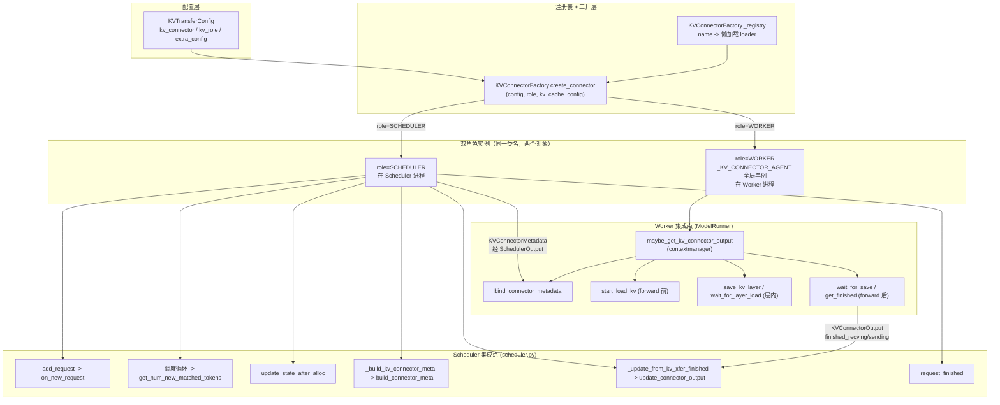
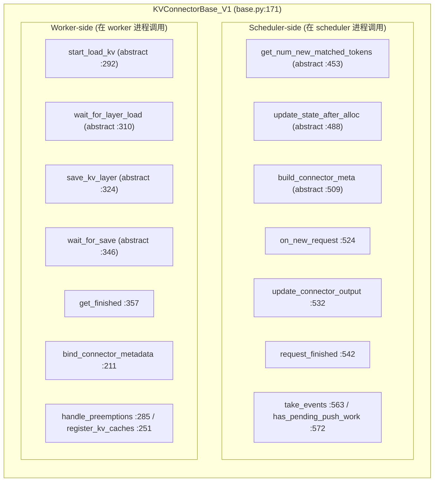
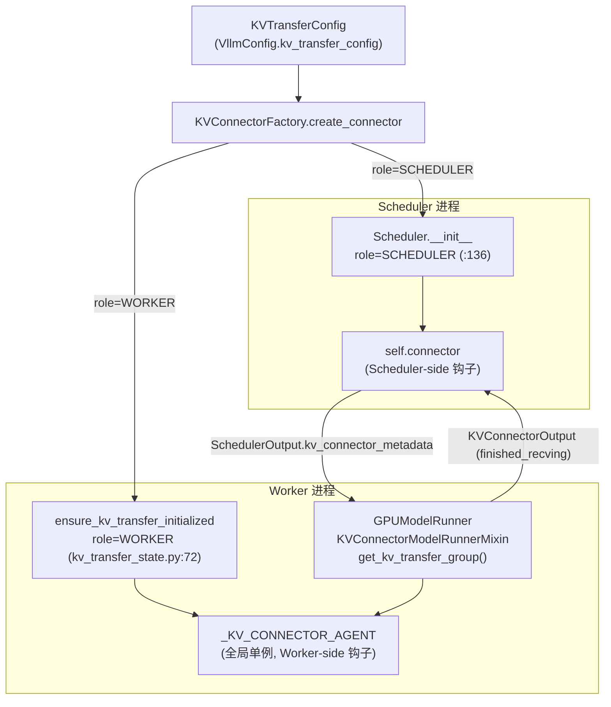
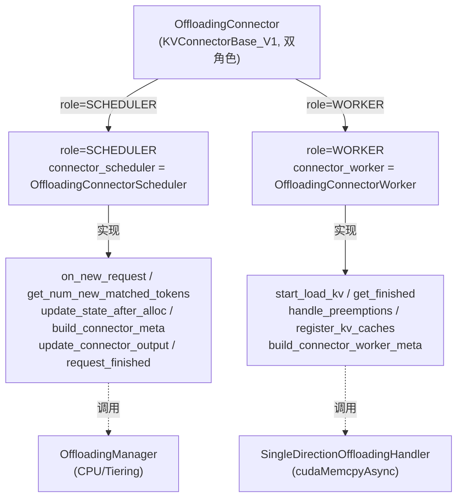
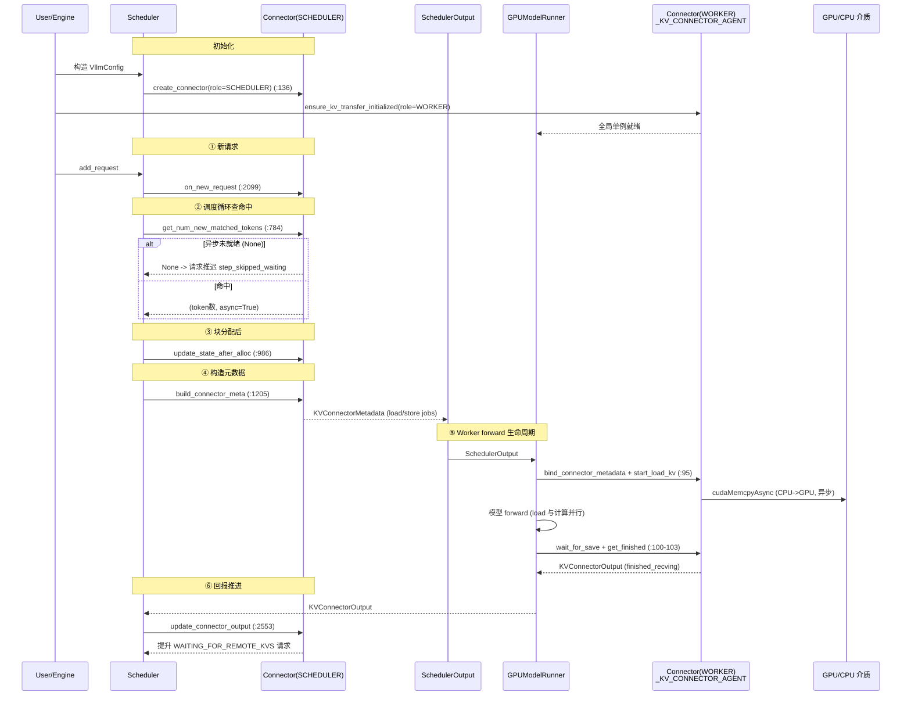

# vLLM KV Connector 解耦与集成机制深度解剖

> 基于 `comments-on-v0.25.1` 分支源码（2026-07-18 快照）
> 调研范围：`vllm/distributed/kv_transfer/`（基类/注册表/状态）、`vllm/config/kv_transfer.py`、`vllm/v1/core/sched/scheduler.py`、`vllm/v1/worker/gpu_model_runner.py`、`vllm/v1/worker/kv_connector_model_runner_mixin.py`、`vllm/v1/worker/gpu/kv_connector.py`
> 关联文档：`.codebuddy/analysis/kv_cache_offloading.md`（本机制的直接消费者）

---

## 目录

- [0. 前置知识：设计思想与核心概念](#0-前置知识设计思想与核心概念)
- [1. 全景架构概览](#1-全景架构概览)
- [2. Layer 1：抽象基类 KVConnectorBase_V1（双角色钩子划分）](#2-layer-1抽象基类-kvconnectorbasе_v1双角色钩子划分)
- [3. Layer 2：配置层 KVTransferConfig 与桥接](#3-layer-2配置层-kvtransferconfig-与桥接)
- [4. Layer 3：注册表 + 工厂（可插拔解耦的核心）](#4-layer-3注册表--工厂可插拔解耦的核心)
- [5. Layer 4：Scheduler 侧集成点](#5-layer-4scheduler-侧集成点)
- [5.2 前缀缓存写入时机：三条 cache_blocks 路径](#52-前缀缓存写入时机三条-cache_blocks-路径)
- [6. Layer 5：Worker / ModelRunner 侧集成点](#6-layer-5worker--modelrunner-侧集成点)
- [7. Layer 6：全局单例 _KV_CONNECTOR_AGENT（跨进程粘合）](#7-layer-6全局单例-_kv_connector_agent跨进程粘合)
- [8. 案例：OffloadingConnector 如何复用这套框架](#8-案例offloadingconnector-如何复用这套框架)
- [9. 完整调用链时序图](#9-完整调用链时序图)
- [10. 关键数据结构速查表](#10-关键数据结构速查表)
- [11. V0 同步封装 vs V1 异步框架 对比](#11-v0-同步封装-vs-v1-异步框架-对比)
- [12. 设计要点总结](#12-设计要点总结)
- [13. 源码文件索引](#13-源码文件索引)
- [14. 快速问题解答（FAQ）](#14-快速问题解答faq)

---

## 0. 前置知识：设计思想与核心概念

### 0.1 为什么需要 KV Connector 抽象

LLM 推理中，KV cache 的**导入（load）** 与 **导出（save）** 是一个横切关注点，出现在多种场景：

1. **Prefix Cache 延伸 / KV Offloading**：把 GPU 算好的 KV 搬到 CPU/磁盘/网络，需要时再搬回（见 `kv_cache_offloading.md`）。
2. **PD 分离（Disaggregated Serving）**：prefill 实例（P 端）算完 KV，通过网络传给 decode 实例（D 端），两端是不同 vLLM 进程。
3. **外部 KV Cache 服务**：如 LMCache、Mooncake、HF3FS 等第三方 KV 存储后端。

这些场景的**共同点**：在请求生命周期的边界（新请求到达、块分配后、forward 前/中/后、请求结束）插入"从外部介质取/存 KV"的逻辑。vLLM 把这些钩子抽象成统一的 **KV Connector 接口**，让具体介质（CPU、NIXL/RDMA、LMCache、磁盘）以**可插拔**方式接入，对调度核心与模型计算的侵入降到最低。

### 0.2 核心设计思想：解耦（Decoupling）

KV Connector 框架的精髓是**三层解耦**：

| 解耦维度 | 机制 | 收益 |
| --- | --- | --- |
| **决策 ↔ 执行** | Scheduler 侧只做"哪些 KV 可用/该存"的判定，Worker 侧只做"如何搬" | 调度逻辑不被 DMA/网络阻塞；可异步化 |
| **Scheduler 进程 ↔ Worker 进程** | 同一 connector 类名，按 `KVConnectorRole` 构建**两个独立实例**，严格分离 | 单进程内无交叉调用，状态不串 |
| **框架 ↔ 具体介质** | 注册表 + 工厂，字符串名映射到类 | 新增后端零侵入核心代码 |

### 0.3 演进历史

- **V0 同步 API**：connector 在 `pre_forward`/`post_forward` 同步 load/save，引擎阻塞。
- **vLLM 0.9.0**：引入 **V1 异步 API**（`KVConnectorBase_V1`），Scheduler 与 Worker 钩子分离，load/save 与模型计算并行。
- 本分支（`comments-on-v0.25.1`）：`KVConnectorBase` 已直接别名到 `KVConnectorBase_V1`，**全仓无 `KVConnectorBase_V0` 类**（搜索 0 命中）。所谓"V0"仅指 `gpu/kv_connector.py` 中 `ActiveKVConnector` 这套旧的同步风格封装（底层对象其实仍是 V1 实例）。

---

## 1. 全景架构概览

**图1：KV Connector 全景架构（解耦与集成）**



**各层职责一句话：**

- **配置层**：`KVTransferConfig` 用字符串名 + `kv_role` 描述"用哪个 connector、本实例是生产者还是消费者"。
- **注册表 + 工厂层**：字符串名 → 懒加载类；`create_connector` 按 `role` 构建对应实例，并强制 HMA 兼容性检查。
- **双角色实例层**：同一类被实例化成 SCHEDULER 与 WORKER 两个对象，物理上分处不同进程。
- **Scheduler 集成点**：在调度循环的关键节点回调 connector 的 scheduler-side 钩子，产出 `KVConnectorMetadata`。
- **Worker 集成点**：在 `execute_model` 的 forward 前/中/后回调 connector 的 worker-side 钩子，执行真实 KV 搬运，回报 `KVConnectorOutput`。

---

## 2. Layer 1：抽象基类 KVConnectorBase_V1（双角色钩子划分）

基类 `KVConnectorBase_V1(ABC)` 定义在 `vllm/distributed/kv_transfer/kv_connector/v1/base.py:171`。它把所有钩子**按角色分成两大组**，这是"解耦"在接口层面的直接体现。

**图2：基类钩子按角色划分**



### 2.1 角色分派机制

`KVConnectorRole` 枚举（`base.py:124`）：

```python
class KVConnectorRole(enum.Enum):
    SCHEDULER = 0   # Connector running in the scheduler process
    WORKER = 1      # Connector running in the worker process
```

基类构造（`base.py:184`）接收 `role` 并存为 `self._role`（`base.py:201`），通过 `role` 属性（`base.py:203`）暴露。具体 connector 在 `__init__` 里据 `role` 决定创建哪种子对象（见 §8 OffloadingConnector）。

### 2.2 Scheduler-side 钩子（抽象方法）

| 钩子 | 行号 | 语义 |
| --- | --- | --- |
| `get_num_new_matched_tokens(request, num_computed_tokens)` | `:453` | 返回 `(int|None, bool)`：可从外部 KV 加载的 token 数 + 是否异步。返回 `None` 表示还需时间，调度器稍后重试 |
| `update_state_after_alloc(request, blocks, num_external_tokens)` | `:488` | 块分配后更新状态（如加 ref_cnt 防 evict） |
| `build_connector_meta(scheduler_output)` | `:509` | 构建本步 `KVConnectorMetadata`（调用会 reset 状态） |

非抽象但有默认实现的：`on_new_request`（`:524` 默认 no-op）、`update_connector_output`（`:532`）、`request_finished`（`:542` 返回 `(False, None)`）、`take_events`（`:563`）、`has_pending_push_work`（`:572` 默认 False，P/D push 模式用）。

### 2.3 Worker-side 钩子（抽象方法）

| 钩子 | 行号 | 语义 |
| --- | --- | --- |
| `start_load_kv(forward_context, **kwargs)` | `:292` | forward 前启动 KV 加载（可异步，与计算并行） |
| `wait_for_layer_load(layer_name)` | `:310` | 层内等待该层 KV 加载完（支持逐层流水线） |
| `save_kv_layer(layer_name, kv_layer, attn_metadata, **kwargs)` | `:324` | 层内启动该层 KV 保存（可异步） |
| `wait_for_save()` | `:346` | forward 退出前等待所有 save 完成（防 paged buffer 被覆盖） |

非抽象：`get_finished(finished_req_ids)`（`:357` 返回 `(sending_ids, recving_ids)`）、`bind_connector_metadata`（`:211`）/ `clear_connector_metadata`（`:223`，由 model runner 每次 forward 前后调用）、`handle_preemptions`（`:285`）、`register_kv_caches`（`:251`）。

> **边界/陷阱**：`get_num_new_matched_tokens` 返回 `None` 是**异步重试信号**而非错误。Scheduler 据此把请求推迟到下一步（见 §5）。这是整个异步框架正确性的关键入口。

---

## 3. Layer 2：配置层 KVTransferConfig 与桥接

`KVTransferConfig`（`vllm/config/kv_transfer.py:23`）是 connector 的"身份证"：

| 字段 | 行号 | 作用 |
| --- | --- | --- |
| `kv_connector` | `:26` | connector 字符串名（如 `"OffloadingConnector"`） |
| `kv_role` | `:41` | `"kv_producer"` / `"kv_consumer"` / `"kv_both"` |
| `kv_connector_extra_config` | `:59` | 任意额外配置（如 `cpu_bytes_to_use`、`block_size`） |
| `kv_connector_module_path` | `:62` | 外部模块路径（动态加载第三方 connector，仅 V1） |
| `kv_buffer_device` | `:33` | KV 中转缓冲设备（`cuda`/`cpu`/`xpu`） |
| `kv_load_failure_policy` | `:69` | `"recompute"` / `"fail"`（load 失败处理策略） |
| `engine_id` | `:30` | 引擎实例 ID（跨 TP/PP 同步，见 `kv_transfer_state.py:51`） |

`__post_init__`（`:92`）强制约束：**设了 `kv_connector` 就必须设 `kv_role`**，否则报错。判断属性：`is_kv_transfer_instance`（`:108`）、`is_kv_producer`（`:113`）、`is_kv_consumer`（`:117`）。

**桥接到 connector 名**：以 KV Offloading 为例，`CacheConfig.kv_offloading_size` 经 `VllmConfig._post_init_kv_transfer_config`（`vllm/config/vllm.py:790`）翻译成 `KVTransferConfig`，把 `kv_connector` 设为 `"OffloadingConnector"` 或 `"SimpleCPUOffloadConnector"`、`kv_role="kv_both"`。

---

## 4. Layer 3：注册表 + 工厂（可插拔解耦的核心）

`KVConnectorFactory`（`vllm/distributed/kv_transfer/kv_connector/factory.py:27`）是"框架 ↔ 具体介质"解耦的核心。

### 4.1 注册表

```python
class KVConnectorFactory:
    _registry: dict[str, Callable[[], type[KVConnectorBase]]] = {}   # :28

    @classmethod
    def register_connector(cls, name, module_path, class_name):      # :30
        # 懒加载：存一个 loader 闭包，首次使用时才 importlib.import_module
        def loader():
            module = importlib.import_module(module_path)
            return getattr(module, class_name)
        cls._registry[name] = loader
```

**懒加载**是关键：只加载当前 connector 对应的文件，避免引入所有后端依赖（NIXL/LMCache 等）。

### 4.2 工厂创建（按 role 分派）

```python
@classmethod
def create_connector(cls, config, role, kv_cache_config):            # :42
    kv_transfer_config = config.kv_transfer_config
    connector_cls = cls.get_connector_class(kv_transfer_config)      # :52
    # HMA 兼容性检查
    hma_enabled = not config.scheduler_config.disable_hybrid_kv_cache_manager
    if hma_enabled and not cls.supports_hma_config(kv_transfer_config):
        raise ValueError(...)                                        # :57
    # NOTE: v1 connector 显式分成两个 role，构建两个独立实例以强制隔离
    return connector_cls(config, role, kv_cache_config)              # :75
```

`get_connector_class`（`:95`）解析逻辑：
1. 若 `kv_connector_module_path` 非空 → **外部模块路径优先**（动态加载第三方 connector），并校验其构造函数接受 `kv_cache_config` 三参签名（`:115` 弃用检查）。
2. 否则在 `_registry` 内查字符串名（`:124`）。
3. 都不命中 → 抛 `Unsupported connector type`。

### 4.3 已注册 connector 清单（factory.py:152-242）

`ExampleConnector`、`LMCacheConnectorV1`、`LMCacheMPConnector`、`NixlConnector`/`NixlPullConnector`/`NixlPushConnector`、`MultiConnector`、`MoRIIOConnector`、**`OffloadingConnector`（:206）**、`DecodeBenchConnector`、`MooncakeConnector`/`MooncakeStoreConnector`、`FlexKVConnectorV1`、`SimpleCPUOffloadConnector`（:233）、`HF3FSKVConnector`。

---

## 5. Layer 4：Scheduler 侧集成点

Scheduler 在 `__init__` 中据 `role=SCHEDULER` 创建 connector（`scheduler.py:136`）：

```python
# scheduler.py:124-140
# Create KVConnector for the Scheduler. Note that each Worker
# will have a corresponding KVConnector with Role=WORKER.
self.connector = None
...
if kv_transfer_config is not None:
    self.connector = KVConnectorFactory.create_connector(
        config=self.vllm_config,
        role=KVConnectorRole.SCHEDULER,
        kv_cache_config=self.kv_cache_config,
    )
```

### 5.1 六个回调点（scheduler.py）

| 调用位置 | 钩子 | 作用 |
| --- | --- | --- |
| `:2099` `add_request` | `connector.on_new_request(request)` | 新请求登记（建 per-request 状态） |
| `:784` 调度循环 | `connector.get_num_new_matched_tokens(...)` | 查外部 KV 命中；返回 `None` 时把请求推迟到 `step_skipped_waiting`（`:789`） |
| `:986` | `connector.update_state_after_alloc(request, blocks, ...)` | 块分配后更新状态（加 ref_cnt 等） |
| `:1205` `_build_kv_connector_meta` | `connector.build_connector_meta(scheduler_output)` | 产出 `KVConnectorMetadata` 挂到 `SchedulerOutput` |
| `:2553` `_update_from_kv_xfer_finished` | `connector.update_connector_output(kv_connector_output)` | worker 回报后推进被阻塞请求 |
| `:2450`/`:2452` | `connector.request_finished(...)` / `request_finished_all_groups(...)` | 请求结束、释放块前调用（异步释放时返回 True） |

另有 `ec_connector`（Encoder Connector）在 `:656`/`:662`/`:1061`/`:1068`/`:1187` 处理多模态 cross-attention KV，机制同源（同一框架的另一种用途）。

> **边界/陷阱**：`get_num_new_matched_tokens` 返回 `None` 时，Scheduler 不是报错，而是把请求放入 `step_skipped_waiting` 推迟到下一步重试（`:789`）。这是 offload/远程 KV 异步性的核心入口（详见 `kv_cache_offloading.md` §8）。

### 5.2 前缀缓存写入时机：三条 cache_blocks 路径

> 常见误解：在 `scheduler.py` 主流程里搜 `cache_blocks`，只看到 `_update_waiting_for_remote_kv`（`:2530`）这一处，于是以为"正常请求的 block 只能在那儿缓存"。**这是错觉**——正常请求（本地计算、prefix caching 开启）的缓存写入被封装在 `allocate_slots()` 内部，根本不出现在 scheduler 主流程里。

#### 5.2.1 正常本地计算：cache_blocks 在 allocate_slots 内部自动触发

调度任一步、给请求分配 KV block 时，都会进入 `KVCacheManager.allocate_slots()`（`vllm/v1/core/kv_cache_manager.py`）。分配完新 block 后，它**顺手**把"本次计算出的 block"写进前缀哈希表：

```python
# kv_cache_manager.py:487-504
487:        # P/D: delay caching blocks if we have to recv from
488:        # remote. Update state for locally cached blocks.
489:        if not self.enable_caching or delay_cache_blocks:
490:            return self.create_kv_cache_blocks(new_blocks)   # ← 不缓存（关 prefix / 远端未到）
491:
492:        # NOTE(woosuk): We want to commit (cache) up to num_local_computed_tokens
493:        # + num_external_computed_tokens + num_new_tokens, but must exclude
494:        # "non-committable" tokens (e.g., draft tokens that could be rejected).
495:        # Therefore, we cap the number at `request.num_tokens`, ensuring only
496:        # "finalized" tokens are cached.
497:        # 5️⃣
498:        num_tokens_to_cache = min(
499:            total_computed_tokens + num_new_tokens,
500:            request.num_tokens,                       # 封顶到"已定稿"token 数
501:        )
502:        self.coordinator.cache_blocks(request, num_tokens_to_cache)
503:
504:        return self.create_kv_cache_blocks(new_blocks)
```

关键点：

- **调用方（scheduler 主流程）看不到 `cache_blocks`**——它藏在 `allocate_slots()` 里，每次调度分配 block 时自动执行。这就是"搜不到"的原因。
- **`enable_caching=False`（没开 prefix caching）→ 跳过**（`:489`）。
- **`delay_cache_blocks=True`（P/D 分离，本地 block 还要从远端 recv）→ 跳过**（`:489`），等远端到了再在 §5.2.3 的路径缓存。
- **封顶到 `request.num_tokens`**（`:500`）：只缓存"已定稿"token。草稿 token（spec decode）可能被拒绝，不能提前进 cache。

#### 5.2.2 三路调用点全景

| 路径 | 位置 | 触发时机 | 适用场景 |
|---|---|---|---|
| **① 正常本地计算** | `kv_cache_manager.py:502` | `allocate_slots()` 分配 block 后 | 绝大多数请求（prefill + decode），prefix caching 开启 |
| **② KV Connector 异步收远端 KV** | `scheduler.py:2520` / `:2530` | `_update_waiting_for_remote_kv()` 远端 KV 到位后 | P/D、offloading 等需要 `delay_cache_blocks` 的场景 |
| **③ Async scheduler 收尾缓存** | `async_scheduler.py:94` | `update_from_output` 后 | async 模式下把新 token 的 block 标缓存；PREEMPTED（不再 RUNNING）的请求跳过 |

> 路径 ② 与 ③ 都和"异步"强相关：block 在结果回来之前就已分配/占位，所以缓存动作被推迟到 output 回来或远端到位之后。路径 ① 则在分配当下同步完成。

#### 5.2.3 路径 ② 详解：为什么 KV Connector 要单独调一次

`_update_waiting_for_remote_kv`（`scheduler.py:2505-2537`）处理的是"请求状态为 `WAITING_FOR_REMOTE_KV`、远端 KV 已 recv 完成"的收尾：

```python
# scheduler.py:2527-2535
2527:        else:
2528:            # Now that the blocks are ready, actually cache them.
2529:            # This will cache the blocks iff caching is enabled.
2530:            self.kv_cache_manager.cache_blocks(request, request.num_computed_tokens)
2531:
2532:            # on a full prompt hit, we need to re-compute the last token
2533:            # in order to be able to sample the next token
2534:            if request.num_computed_tokens == request.num_tokens:
2535:                request.num_computed_tokens = request.num_tokens - 1
```

注意 `:2534-2535` 的微调：若整段 prompt 全命中（KV 全从远端来，`num_computed_tokens == num_tokens`），调度器要回退 1 个 token——因为要采样"下一个 token"必须先重算最后一个 token 的 KV（避免采样自身）。这是 prefix caching + 远程 KV 叠加时的特殊修正。

> 对比 §5.2.1 的 `:500` 封顶逻辑：本地路径靠 `min(..., request.num_tokens)` 防止缓存未定稿 token；远端路径则靠 `:2534` 的回退 1 处理"全命中"边界。两条路径的封顶/回退策略不同，但目标一致：**进 cache 的必须是可安全复用的已定稿 KV**。

#### 5.2.4 一句话总结

正常请求**不需要**在 scheduler 主流程显式调 `cache_blocks`——它封装在 `allocate_slots()`（`kv_cache_manager.py:502`）里，每次分配 KV block 时自动把本次计算的 block 写入前缀哈希表（`enable_caching=True` 且非 `delay_cache_blocks`）。`scheduler.py:2530` 只是 KV Connector 异步收远端 KV 这条**平行**路径，与本地缓存不是唯一入口的关系，而是"本地同步缓存 vs 远端异步缓存"的两条独立通道。

---

## 6. Layer 5：Worker / ModelRunner 侧集成点

### 6.1 全局单例的创建

Worker 进程侧 connector 由 `ensure_kv_transfer_initialized`（`kv_transfer_state.py:72`）创建并存入全局单例 `_KV_CONNECTOR_AGENT`（`kv_transfer_state.py:16`），`role=WORKER`：

```python
# kv_transfer_state.py:79-94
global _KV_CONNECTOR_AGENT
if vllm_config.kv_transfer_config is None:
    return
if (vllm_config.kv_transfer_config.is_kv_transfer_instance
        and _KV_CONNECTOR_AGENT is None):
    _sync_engine_id_across_tp(vllm_config)        # 跨 TP/PP 同步 engine_id
    _KV_CONNECTOR_AGENT = KVConnectorFactory.create_connector(
        config=vllm_config, role=KVConnectorRole.WORKER,
        kv_cache_config=kv_cache_config,
    )
```

`get_kv_transfer_group()`（`:19`）返回该单例；`has_kv_transfer_group()`（`:26`）判断是否启用。

### 6.2 V1 主集成路径：KVConnectorModelRunnerMixin

`KVConnectorModelRunnerMixin`（`vllm/v1/worker/kv_connector_model_runner_mixin.py:34`）封装了 **forward 生命周期内的完整 connector 调用序列**，是 gpu_model_runner 采用的主路径。

核心 contextmanager `_get_kv_connector_output`（`:76`）：

```python
@contextmanager
def _get_kv_connector_output(scheduler_output, wait_for_save=True, defer_finalize=False):
    output = KVConnectorOutput()
    kv_connector = get_kv_transfer_group()                       # 取全局单例
    assert scheduler_output.kv_connector_metadata is not None
    kv_connector.bind_connector_metadata(
        scheduler_output.kv_connector_metadata)                 # ① 绑定 scheduler 下发的 metadata
    kv_connector.start_load_kv(get_forward_context())            # ② forward 前启动 load（异步）
    try:
        yield output                                             # ③ 模型 forward（load 与计算并行）
    finally:
        if wait_for_save and not defer_finalize:
            kv_connector.wait_for_save()                         # ④ forward 后等待 save
        output.finished_sending, output.finished_recving = (
            kv_connector.get_finished(scheduler_output.finished_req_ids))  # ⑤ 收集完成信号
        output.invalid_block_ids = kv_connector.get_block_ids_with_load_errors()
        output.kv_connector_stats = kv_connector.get_kv_connector_stats()
        output.kv_cache_events = kv_connector.get_kv_connector_kv_cache_events()
        output.kv_connector_worker_meta = kv_connector.build_connector_worker_meta()
        if not defer_finalize:
            kv_connector.clear_connector_metadata()              # ⑥ 清理 metadata
```

`maybe_get_kv_connector_output`（`:50`）在无 connector 时返回 `nullcontext()`（零开销短路）；`kv_connector_no_forward`（`:35`）用于"无 forward 但仍需做 KV send/recv"的步（如纯接收对端 KV）。

**gpu_model_runner 调用点**（gpu_model_runner.py）：
- `:4138` `kv_connector_no_forward(...)`：本步无 forward 时仍推进 KV 传输。
- `:4348` `self.maybe_get_kv_connector_output(...)`：包裹模型 forward，生命周期如上。
- `:925` `self.kv_connector_output`：保存本步 connector 输出，供后续（含 speculative drafting）消费（`:4431`/`:4666`）。

### 6.3 V0 风格封装：ActiveKVConnector（备选/兼容路径）

`vllm/v1/worker/gpu/kv_connector.py` 提供旧式同步风格封装 `ActiveKVConnector`（`gpu/kv_connector.py:47`），同样包裹 `get_kv_transfer_group()`：

- `pre_forward`（`:61`）：`handle_preemptions` → `bind_connector_metadata` → `start_load_kv`。
- `post_forward`（`:77`）：`wait_for_save` → `get_finished` → `clear_connector_metadata`。
- `get_kv_connector`（`:116`）：无 connector 时返回 `NO_OP_KV_CONNECTOR`（`:113`，全 no-op）。

> 注意：此封装底层的 connector 对象**仍是 V1 实例**（`KVConnectorBase` 已是 `KVConnectorBase_V1` 别名）。它只是另一种"forward 前后"的调用风格；gpu_model_runner 当前走 `KVConnectorModelRunnerMixin` 路径。两者都通过 `_KV_CONNECTOR_AGENT` 全局单例访问同一个 worker connector 对象。

---

## 7. Layer 6：全局单例 _KV_CONNECTOR_AGENT（跨进程粘合）

**图3：配置 → 双实例 → 跨进程数据流**



要点：
- **同一个 `KVTransferConfig`** 在 Scheduler 进程构建 `role=SCHEDULER` 实例，在 Worker 进程构建 `role=WORKER` 实例。
- 两实例**不共享状态**，靠 `SchedulerOutput.kv_connector_metadata`（scheduler→worker）与 `KVConnectorOutput`（worker→scheduler）传递信息。
- Worker 实例以全局单例形式存在，model runner 通过 `get_kv_transfer_group()` 取用，避免层层传参。

---

## 8. 案例：OffloadingConnector 如何复用这套框架

`OffloadingConnector`（`vllm/distributed/kv_transfer/kv_connector/v1/offloading_connector.py:46`）是"解耦框架"最典型的消费者——它**只实现桥接，把钩子按 role 委托给子对象**：

```python
class OffloadingConnector(KVConnectorBase_V1, SupportsHMA):
    def __init__(self, vllm_config, role, kv_cache_config):
        super().__init__(vllm_config, role, kv_cache_config)
        spec = OffloadingSpecFactory.create_spec(vllm_config, kv_cache_config)
        self.connector_scheduler = None
        self.connector_worker = None
        if role == KVConnectorRole.SCHEDULER:
            self.connector_scheduler = OffloadingConnectorScheduler(spec)   # :64
        elif role == KVConnectorRole.WORKER:
            self.connector_worker = OffloadingConnectorWorker(spec)         # :66

    # Scheduler-side 钩子全部委托给 connector_scheduler
    def get_num_new_matched_tokens(self, request, num_computed_tokens):
        assert self.connector_scheduler is not None
        return self.connector_scheduler.get_num_new_matched_tokens(...)

    def build_connector_meta(self, scheduler_output):
        assert self.connector_scheduler is not None
        return self.connector_scheduler.build_connector_meta(scheduler_output)

    # Worker-side 钩子全部委托给 connector_worker
    def start_load_kv(self, forward_context, **kwargs):
        assert self.connector_worker is not None
        self.connector_worker.start_kv_transfers(self._connector_metadata)

    def get_finished(self, finished_req_ids):
        assert self.connector_worker is not None
        self.connector_worker.prepare_store_kv(self._connector_metadata)  # store 延迟到下一步
        return self.connector_worker.get_finished(finished_req_ids)
```

**图4：OffloadingConnector 复用框架（委托关系）**



这正是理解 KV Offloading 的前置基础：**Offloading 的"决策（scheduler 查命中/分配地址/引用计数）"与"执行（worker DMA）"完全套在 KV Connector 的双角色钩子里**，offloading 自身只需填充分角色子对象，不碰调度核心与 forward 主路径。详见 `kv_cache_offloading.md`。

> 同类复用者还有 `MultiConnector`（复合连接器，把多个子 connector 串起来，同样走这套框架，`all_children_support_hma` 做 HMA 兼容性聚合）、NIXL/LMCache/Mooncake 等。

---

## 9. 完整调用链时序图

**图5：端到端 KV Connector 调用链（以 offload load 为例）**



### 6.1 调度器对 KV 完成信号是「纯被动接收」

整条回报链路的要害在于：**调度器从不主动轮询"传完了没"，它只能在 `update_from_output` 这个固定回灌点，从 `ModelRunnerOutput.kv_connector_output.finished_recving` 里读完成信号**。

完整路径（worker 侧 → 调度器侧）：

1. **worker 每步 forward 后收集**（`v1/worker/gpu/model_runner.py:1457`）
   ```python
   kv_connector_output = self.kv_connector.post_forward(finished_req_ids)
   ```
2. **`post_forward` 去问连接器谁传完了**（`v1/worker/gpu/kv_connector.py:91-99`）
   ```python
   output = KVConnectorOutput()
   ...
   output.finished_sending, output.finished_recving = (
       self.kv_connector.get_finished(finished_req_ids))
   ```
   `get_finished` 返回的是底层连接器 agent 在做异步收发时自己记录的完成集合
   （如 `v1/offloading/worker.py:389` 把本步 load 完成的 `req_id` 加入
   `finished_recving`；`mooncake_connector.py:1746` 的 `fetch_finished_recving_reqs()`）。
3. **挂进 `ModelRunnerOutput` 回传**（`v1/worker/gpu_model_runner.py:4676`）
   ```python
   output = ModelRunnerOutput(..., kv_connector_output=kv_connector_output, ...)
   ```
4. **调度器被动接收并推进**（`v1/core/sched/scheduler.py:2551-2567`）
   ```python
   for req_id in kv_connector_output.finished_recving or ():
       self.finished_recving_kv_req_ids.add(req_id)
   ```
   之后下一次 `schedule()` 才把请求从 `WAITING_FOR_REMOTE_KVS` 提升进 running。

> 含义：KV transfer 何时算"完成"，由 **worker 侧 KV 连接器 agent 异步检测**，
> 但"把这个完成告诉调度器"的动作只发生在 **`ModelRunnerOutput` 回传时**。
> 调度器是纯消费者，不轮询、不查状态。

### 6.2 测试印证：空 output 不推进

`tests/v1/core/test_scheduler.py` 的 `_step_until_kv_transfer_finished` 把
"调度"和"回灌信号"拆成两次，恰好印证了上面的被动性：

- 第一次 `schedule()`：请求被标 `WAITING_FOR_REMOTE_KVS`，不调度计算（`running==0`）。
- 接着 `update_from_output(output, EMPTY_OUTPUT)`——**空 output 没有
  `finished_recving`**。于是第二次 `schedule()` 时调度器仍只看到
  `WAITING_FOR_REMOTE_KVS`，`running` 依然是 0（请求继续赖在 waiting）。
- 直到 `update_from_output` 带上
  `KVConnectorOutput(finished_recving=req_ids)`（`:1580`），请求才进入
  `finished_recving_kv_req_ids`，**下一次 `schedule()` 才真正提升进 running**。

这说明：哪怕你调了 N 次 `schedule()`，只要 `update_from_output` 没把
`finished_recving` 信号喂回来，请求就不会被推进——调度器完全依赖 worker 的回报。

---

## 10. 关键数据结构速查表

| 数据结构 | 定义位置 | 关键字段 / 值 | 作用 |
| --- | --- | --- | --- |
| `KVConnectorBase_V1` | `v1/base.py:171` | 双角色钩子集合 | connector 抽象基类 |
| `KVConnectorRole` | `v1/base.py:124` | `SCHEDULER=0` / `WORKER=1` | 实例角色枚举 |
| `KVConnectorMetadata` | `v1/base.py:141` | （抽象） | scheduler→worker 元数据基类 |
| `KVConnectorWorkerMetadata` | `v1/base.py:150` | `aggregate()` | worker→scheduler 元数据基类（可聚合） |
| `KVConnectorFactory` | `factory.py:27` | `_registry` / `create_connector` | 注册表 + 工厂 |
| `KVTransferConfig` | `config/kv_transfer.py:23` | `kv_connector`/`kv_role`/`extra_config` | connector 配置身份证 |
| `_KV_CONNECTOR_AGENT` | `kv_transfer_state.py:16` | 全局单例 | worker 侧 connector 实例 |
| `KVConnectorOutput` | `v1/outputs.py` | `finished_sending`/`finished_recving`/`invalid_block_ids` | worker→scheduler 回报 |
| `KVConnectorModelRunnerMixin` | `kv_connector_model_runner_mixin.py:34` | `_get_kv_connector_output` | model runner 生命周期封装 |
| `SupportsHMA` | `v1/base.py:85` | `request_finished_all_groups` | 混合内存分配器兼容标记 |

---

## 11. V0 同步封装 vs V1 异步框架 对比

| 维度 | V0 同步风格（`ActiveKVConnector`） | V1 异步框架（`KVConnectorBase_V1`） |
| --- | --- | --- |
| 接口位置 | `gpu/kv_connector.py:47` | `v1/base.py:171` |
| 角色 | 单对象，scheduler/worker 混用同一实例 | 双实例，按 `role` 严格分离 |
| load/save 时机 | `pre_forward`/`post_forward` 同步阻塞 | `start_load_kv` 在 forward 前触发、`save_kv_layer` 在层内触发，与计算并行 |
| 异步重试 | 无（阻塞等） | `get_num_new_matched_tokens` 返回 `None` → 调度器推迟重试 |
| 元数据流 | 隐式（共享实例状态） | 显式 `KVConnectorMetadata` / `KVConnectorOutput` 跨进程传递 |
| 当前状态 | 仍作为封装存在，但底层对象已是 V1 实例 | 本分支默认框架（`KVConnectorBase` 别名指向它） |

> 结论：本分支已无独立 V0 基类。所谓"V0"只是 `ActiveKVConnector` 这套旧的 forward 前后调用封装；gpu_model_runner 实际走 `KVConnectorModelRunnerMixin`（V1 路径）。两者最终都通过 `_KV_CONNECTOR_AGENT` 访问同一 V1 实例。

---

## 12. 设计要点总结

| 设计点 | 实现 | 收益 |
| --- | --- | --- |
| 决策/执行解耦 | scheduler-side 钩子只判定，worker-side 钩子只搬运 | 调度不被 DMA/网络阻塞，可异步化 |
| 进程隔离 | 同类名按 `role` 建两实例，状态不串 | 单进程内无交叉调用，易推理 |
| 可插拔 | 注册表 + 懒加载 + 工厂 | 新增后端零侵入核心；外部模块路径优先 |
| 显式元数据流 | `KVConnectorMetadata` / `KVConnectorOutput` | 跨进程通信清晰、可序列化 |
| 异步重试 | `get_num_new_matched_tokens` 返回 `None` | 远程/卸载 KV 异步就绪，不卡调度 |
| HMA 兼容强制 | 工厂创建时 `supports_hma_config` 检查 | 混合内存分配器下 connector 不会静默出错 |
| 生命周期封装 | `KVConnectorModelRunnerMixin._get_kv_connector_output` | model runner 只需一行包裹 forward |

---

## 13. 源码文件索引

| 文件 | 职责 |
| --- | --- |
| `vllm/distributed/kv_transfer/kv_connector/base.py:7` | `KVConnectorBase = KVConnectorBase_V1` 别名 |
| `vllm/distributed/kv_transfer/kv_connector/v1/base.py:171` | `KVConnectorBase_V1` 基类 + 双角色钩子 + `KVConnectorRole`/`KVConnectorMetadata` |
| `vllm/distributed/kv_transfer/kv_connector/factory.py:27` | `KVConnectorFactory` 注册表 + 工厂 + 全部 connector 注册（`:152-242`） |
| `vllm/config/kv_transfer.py:23` | `KVTransferConfig` 定义 |
| `vllm/distributed/kv_transfer/kv_transfer_state.py:16` | `_KV_CONNECTOR_AGENT` 全局单例 + `ensure_kv_transfer_initialized`（`:72`） |
| `vllm/v1/core/sched/scheduler.py:136` | Scheduler 侧 connector 创建（`role=SCHEDULER`） |
| `vllm/v1/core/sched/scheduler.py:784/986/1205/2099/2450/2553` | 六个 scheduler-side 钩子调用点 |
| `vllm/v1/worker/kv_connector_model_runner_mixin.py:34` | `KVConnectorModelRunnerMixin` V1 生命周期封装 |
| `vllm/v1/worker/gpu_model_runner.py:4138/4348/925` | model runner 集成点 |
| `vllm/v1/worker/gpu/kv_connector.py:47` | `ActiveKVConnector` V0 风格封装（底层仍是 V1 实例） |
| `vllm/distributed/kv_transfer/kv_connector/v1/offloading_connector.py:46` | `OffloadingConnector`（框架复用范例） |
| `vllm/distributed/kv_transfer/kv_connector/v1/multi_connector.py` | `MultiConnector`（复合连接器，复用同一框架） |

---

## 14. 快速问题解答（FAQ）

**Q1：KV Connector 解决什么问题？**
A：把"在请求生命周期边界导入/导出 KV cache"的横切逻辑抽象成统一接口，支撑 KV Offloading、PD 分离、外部 KV 服务（LMCache/NIXL 等）三类场景，对调度核心与模型计算侵入最小。

**Q2：Scheduler 和 Worker 的 connector 是同一个对象吗？**
A：不是。同一个 connector 类名会被 `KVConnectorFactory.create_connector` 按 `role` 构建成**两个独立实例**——Scheduler 进程一个（`role=SCHEDULER`），Worker 进程一个（`role=WORKER`，存为 `_KV_CONNECTOR_AGENT` 全局单例）。两者不共享状态，靠 `KVConnectorMetadata` / `KVConnectorOutput` 跨进程通信。

**Q3：`get_num_new_matched_tokens` 返回 `None` 是报错吗？**
A：不是。它表示 connector 还需时间确定外部 KV 是否就绪（异步），Scheduler 据此把请求推迟到下一步重试（`step_skipped_waiting`）。这是异步框架正确性的关键入口。

**Q4：新增一个 KV 后端要改核心代码吗？**
A：不用。在 `factory.py` 用 `register_connector(name, module_path, class_name)` 注册即可（懒加载，零侵入）；也可通过 `KVTransferConfig.kv_connector_module_path` 动态加载外部模块，优先级更高。

**Q5：本分支还有 V0 同步 connector 吗？**
A：没有独立 V0 基类（`KVConnectorBase` 已别名到 `KVConnectorBase_V1`）。`gpu/kv_connector.py` 的 `ActiveKVConnector` 只是旧式 forward 前后调用封装，底层对象仍是 V1 实例；gpu_model_runner 实际走 `KVConnectorModelRunnerMixin`（V1 路径）。

**Q6：OffloadingConnector 和 KV Connector 框架是什么关系？**
A：OffloadingConnector 是框架的**消费者/复用者**：它继承 `KVConnectorBase_V1`，在 `__init__` 按 `role` 创建 `OffloadingConnectorScheduler` 或 `OffloadingConnectorWorker` 子对象，把所有钩子委托过去。offloading 的"决策 vs 执行"完全套在双角色钩子里，不碰调度核心。
