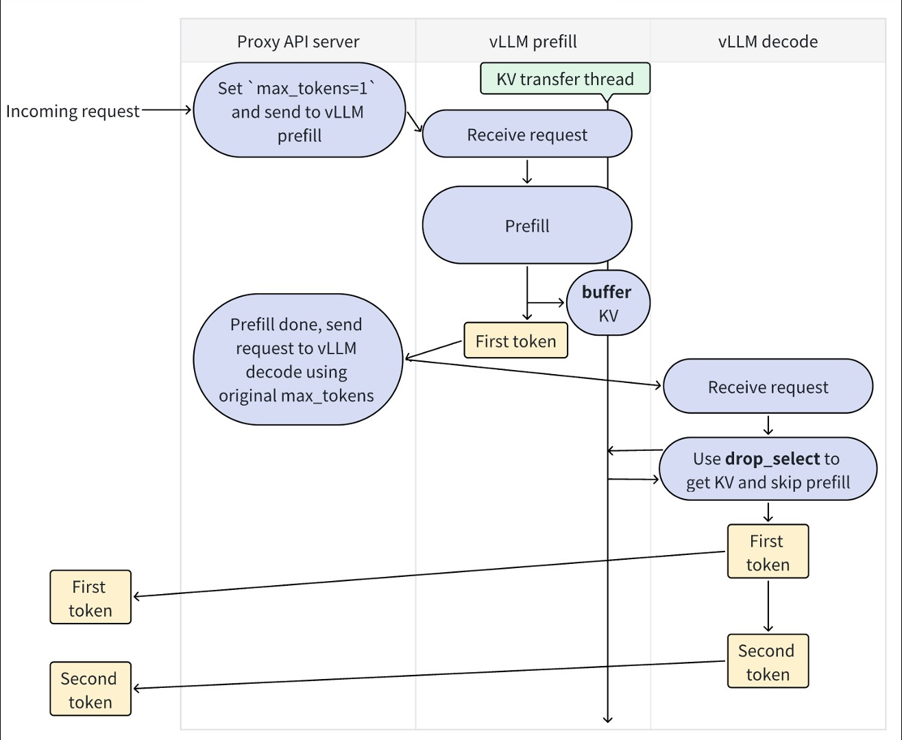

# 分布式 KV 缓存传输（Distributed KV cache transfer）

> 本文为 `vllm/distributed/kv_transfer/README.md` 的中文翻译。
> 原文路径：`vllm/distributed/kv_transfer/README.md`

本目录实现了 **跨 vLLM 实例的分布式 KV 缓存传输**。目前主要的应用场景是 **分离式预填充（disaggregated prefilling）**。

## 抽象分层（Abstractions）

KV 缓存传输包含 **三层抽象**：

- **KV pipe（KV 管道）**：一个用于传输 `torch.tensor` 的 FIFO 管道。核心 API：`send_tensor` 和 `recv_tensor`。
- **KV lookup buffer（KV 查找缓冲区）**：一个面向 KV 缓存的查找缓冲区。键（Key）：tokens；值（Value）：KV 缓存（以及/或者 hidden states）。核心 API：`insert` 和 `drop_select`（语义类似 SQL）。
- **KV connector（KV 连接器）**：将 KV pipe 与 KV lookup buffer 连接到 vLLM 的连接器。核心 API：`send_kv_caches_and_hidden_states` 和 `recv_kv_caches_and_hidden_states`。

**为什么需要 KV lookup buffer**：仅靠 FIFO 管道是不够的，因为 prefill（预填充）vLLM worker 处理请求的顺序可能与 decode（解码）vLLM worker 不同。假设 QPS 非常高，prefill worker 可能按 A → B → C 的顺序处理请求，但 decode worker 可能先处理请求 C。这种情况无法由 FIFO 管道自然处理，因此我们提供 KV lookup buffer，帮助把一个 FIFO 管道「翻译」成一个可查找的缓冲区。

**注意**：KV pipe 层是 **可绕过的（bypassable）**：如果你的分布式通信服务本身已经支持基于键值的查找（如 redis 或 RDMA 数据库），则可以跳过这一层。

**注意**：如果你不仅想传输 KV 缓存，还想 **调整 vLLM 的模型执行流程**（例如，允许 vLLM 在部分 token 上接收 KV 缓存、在其余 token 上执行 prefill），你可以同时绕过 KV pipe 层与 KV lookup buffer 层，直接在 **KV connector 层** 上实现。但请记住：由于 vLLM 的模型输入在持续变化，这类实现在 vLLM 有新更新时很可能会失效。

## 分离式预填充（Disaggregated prefilling）

用法示例见：[`examples/disaggregated/disaggregated_prefill.sh`](../../../examples/disaggregated/disaggregated_prefill.sh)。

下图展示了分离式预填充的运行方式：

---

## 补充说明（译者注）

- 上述三层抽象（KV pipe / KV lookup buffer / KV connector）对应的是 **早期（V0）** 的分离式预填充设计思路。在当前 v0.25.1 分支中，KV 传输已演进为以 `KVConnectorBase_V1` 为核心的可插拔框架（详见 `.codebuddy/analysis/kv_connector.md`），KV connector 层的地位得到强化，pipe/lookup buffer 更多作为具体后端的内部实现细节。
- 「KV connector 层可直接干预模型执行流程」这一设计理念，正是后续 V1 框架中 **Scheduler 侧决策 / Worker 侧执行** 双角色钩子解耦的雏形。
- 关于 KV Connector 的完整解耦与集成机制，参见 `.codebuddy/analysis/kv_connector.md`；关于 KV Cache Offloading 如何复用该框架，参见 `.codebuddy/analysis/kv_cache_offloading.md`。
