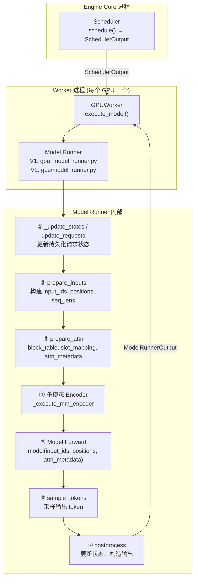
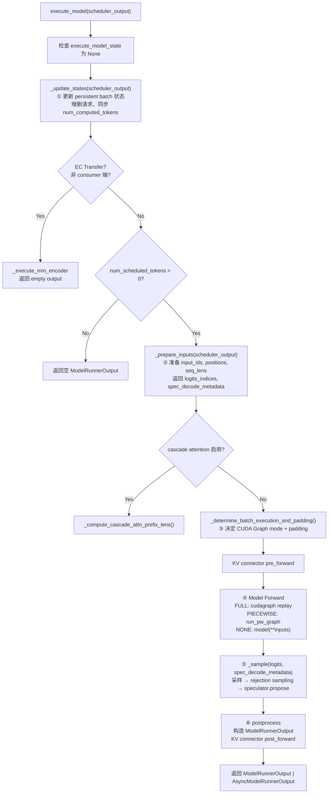
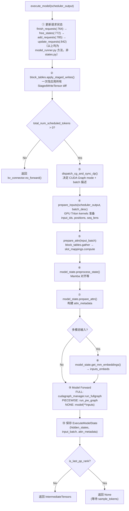
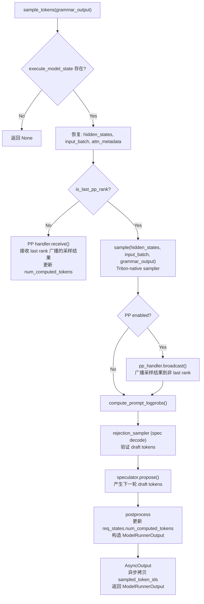
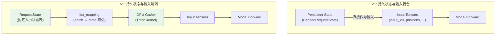
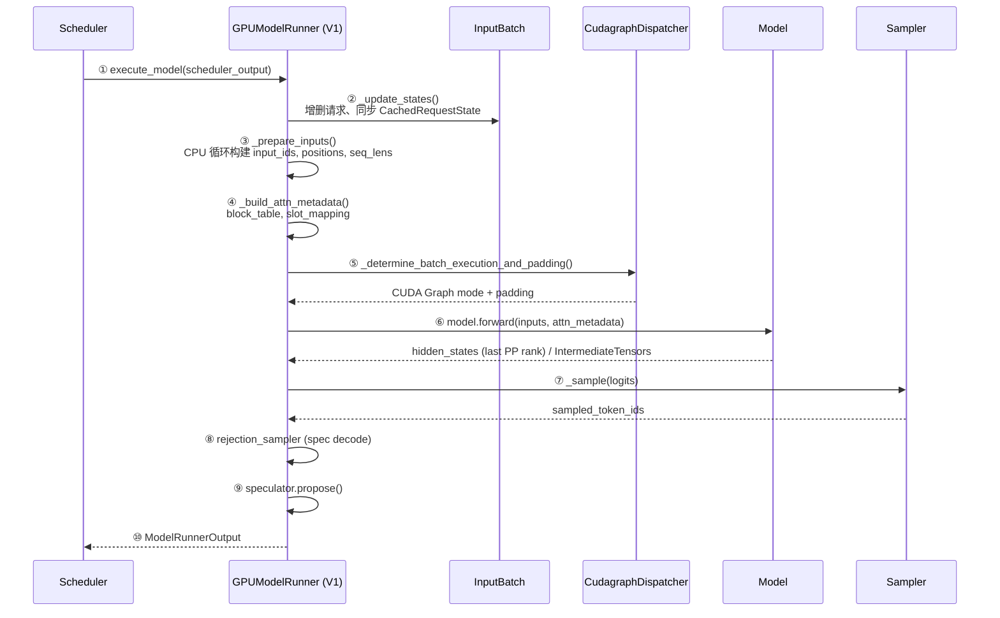
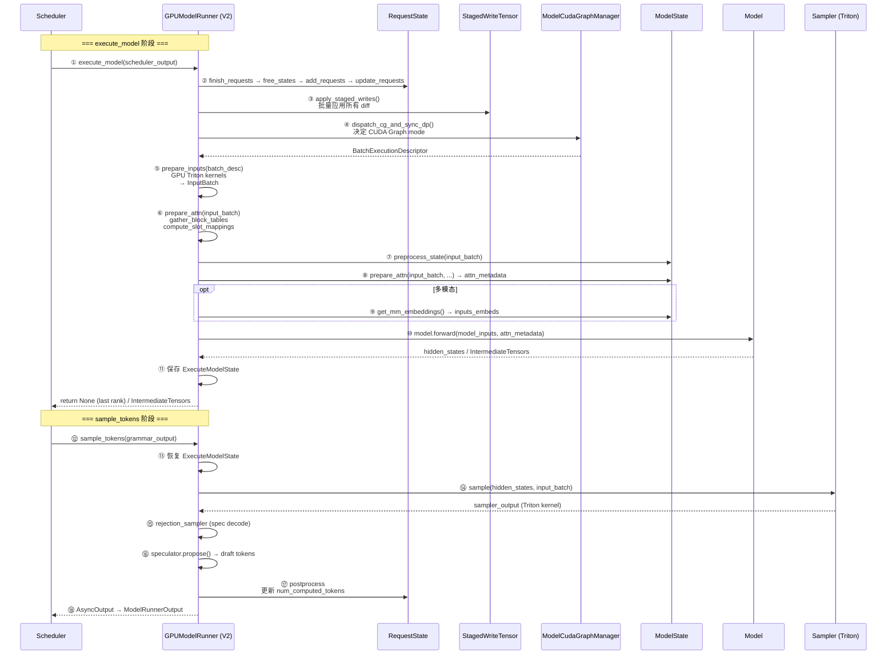

# vLLM Model Runner 深度解剖：V1 vs V2 对比分析

> **Mermaid 图渲染**：GitHub / GitLab 原生支持；VS Code 安装 "Markdown Preview Mermaid Support" 插件；**PyCharm 安装 "Mermaid" 插件"（Settings → Plugins → 搜索 Mermaid）即可在预览中渲染。

## 目录

1. [前置知识：设计思想与演进背景](#1-前置知识设计思想与演进背景)
2. [全景架构概览：Model Runner 在 vLLM 中的位置](#2-全景架构概览model-runner-在-vllm-中的位置)
3. [V1 GPUModelRunner 深度解剖](#3-v1-gpumodelrunner-深度解剖)
4. [V2 GPUModelRunner 深度解剖](#4-v2-gpumodelrunner-深度解剖)
   - [4.5 模块化的核心：ModelState 抽象](#45-模块化的核心modelstate-抽象官方变化)
5. [V1 vs V2 核心对比](#5-v1-vs-v2-核心对比)
6. [关键创新详解](#6-关键创新详解)
7. [完整调用链时序图](#7-完整调用链时序图)
8. [关键数据结构速查表](#8-关键数据结构速查表)
9. [FAQ](#9-faq)

---

## 1. 前置知识：设计思想与演进背景

### 1.1 什么是 Model Runner

Model Runner 是 vLLM 中**连接 Scheduler 和 GPU 执行的桥梁**。它的职责是：

> 接收 `SchedulerOutput`（调度结果），准备 GPU 输入张量、构建 attention metadata、执行模型前向传播、采样输出 token，最终返回 `ModelRunnerOutput`。

在 vLLM V1 架构中，Model Runner 是最核心的"执行引擎"——它是 Scheduler 的"消费者"，是所有 GPU 计算的编排者。

### 1.2 为什么要重构 V2？

vLLM 团队在 V1 的实践中发现了以下**根本性设计缺陷**：

| 问题 | 具体表现 | 影响 |
|------|---------|------|
| **持久状态与输入耦合** | 持久张量直接作为模型输入，请求增删时需重建整个输入张量 | 接近 O(n²) 复杂度的 CPU bookkeeping |
| **Async Barrier 竞态** | 使用 `async_barrier` 保护 CPU 与 GPU 之间的数据竞争 | 复杂、脆弱、有隐患 |
| **功能以补丁形式添加** | 异步调度、投机解码等后期功能是"打补丁"加上去的 | 代码纠缠，难以维护 |
| **CPU 瓶颈** | 输入准备（input_ids、positions、seq_lens 等）在 Python 中逐请求循环构建 | CPU 成为性能瓶颈 |
| **CUDA Graph 管理隐式** | 生命周期不清晰，`dummy_run` 承担过多职责 | 难以理解和扩展 |
| **采样器低效** | 使用 PyTorch/FlashInfer 采样 | 物化 softmax 带来额外显存开销 |

### 1.3 MRV2 的三大设计原则

```
┌─────────────────────────────────────────────────┐
│ ① Be Modular     模块化                          │
│    功能拆分到独立文件，核心 runner 保持最小化      │
│                                                 │
│ ② Be GPU-Native   GPU 原生                       │
│    输入准备、采样等 CPU 操作迁移到 Triton kernel   │
│                                                 │
│ ③ Be Async-First  异步优先                       │
│    从设计之初消除同步点，而非事后修补              │
└─────────────────────────────────────────────────┘
```

> **官方出处对齐**：本文（MRV2）的权威来源是 vLLM 官方博客 **《Model Runner V2: A Modular and Faster Core for vLLM》**（https://vllm.ai/blog/mrv2，发布于 2026-03-24，作者 vLLM Team）。下面 §4~§6 的"四大主要变化"均与该博客逐项对齐，并附 vLLM 当前分支（`comments-on-v0.25.1`）的真实源码行号，便于回源码核对。

### 1.4 官方博客的"四大主要变化"（与源码逐项对齐）

| # | 官方命名 | 核心内容 | 本文对应章节 + 源码 |
| --- | --- | --- | --- |
| ① | 更好的持久 Batch + GPU 原生输入准备 | 持久状态与单步输入解耦，固定大小状态表按请求分配**稳定行（stable row）**，每步用 GPU gather 抽出有序输入；`input_ids`/`positions`/`seq_lens` 等由 Triton kernel 在 GPU 上直接构建 | §4.1、§6.1、§6.3（`states.py:9`、`input_batch.py` Triton kernel） |
| ② | 异步优先（Async-First） | 异步调度成为核心假设，目标 CPU↔GPU **零同步**；GPU 准备 kernel 直接消费 GPU 端拒绝采样结果；每步输出经**独立 CUDA stream** 异步回传 CPU | §4.2、§6.4、`async_utils.py` |
| ③ | Triton 原生采样器 | Gumbel-Max（无状态 in-kernel RNG，避免显式 softmax 物化）、更高效 top-k logprobs、更省显存的 prompt logprobs、更好的投机兼容性（kernel 内用 `idx_mapping` 而非扩展请求状态） | §6.5（`sample/sampler.py:30`、`sample/gumbel.py`） |
| ④ | 更强模块化 | 引入 `ModelState` 抽象（ABC）隔离模型专属逻辑；原 6700+ 行单文件拆成最大不超过 1300 行的模块 | §4.4（`model_states/interface.py`） |

---

## 2. 全景架构概览：Model Runner 在 vLLM 中的位置



**职责速览**：

| 层级 | V1 文件 | V2 文件 | 职责 |
|------|---------|---------|------|
| 核心 Runner | `gpu_model_runner.py` (~6800 行) | `gpu/model_runner.py` (~1609 行) | 编排执行流程 |
| 请求状态 | `CachedRequestState`（内嵌） | `gpu/states.py` (~130 行) | 持久化请求元数据 |
| 输入批次 | `InputBatch`（内嵌类） | `gpu/input_batch.py` (~631 行) | 输入张量 + Triton kernels |
| Block Table | `block_table.py`（V1 风格） | `gpu/block_table.py` (~302 行) | `StagedWriteTensor` 增量更新 |
| CUDA Graph | `CudagraphDispatcher`（V1） | `gpu/cudagraph_utils.py` (~635 行) | `ModelCudaGraphManager` 显式管理 |
| 采样器 | PyTorch/FlashInfer | `gpu/sample/sampler.py` (~270 行) | Triton-native 采样 |
| 注意力 | 内嵌在 runner 中 | `gpu/attn_utils.py` (~700 行) | attention backend + metadata |
| Buffer | 无 | `gpu/buffer_utils.py` (~317 行) | `StagedWriteTensor`, UVA, pool |

---

## 3. V1 GPUModelRunner 深度解剖

**文件**: `vllm/v1/worker/gpu_model_runner.py` (~6800 行)

### 3.1 类结构与初始化

```python
class GPUModelRunner(
    LoRAModelRunnerMixin,        # LoRA 适配器
    KVConnectorModelRunnerMixin,  # P/D 分离 KV 传输
    ECConnectorModelRunnerMixin,  # 远程 Encoder Cache
):
```

V1 使用 **Mixin 多继承** 来组织功能。init 中预分配所有"形状最大可能"的 tensor：

```python
# 预分配的持久 GPU buffers（CUDA Graph 兼容）
self.input_ids = self._make_buffer(max_num_tokens, dtype=torch.int32)
self.positions = torch.zeros(max_num_tokens, dtype=torch.int64, device=device)
self.query_start_loc = self._make_buffer(max_num_reqs + 1, dtype=torch.int32)
self.seq_lens = torch.zeros(max_num_reqs, dtype=torch.int32, device=device)
# ... 更多 buffers

# 请求状态（冗余备份）
self.requests: dict[str, CachedRequestState] = {}
self.input_batch = InputBatch(max_num_reqs, max_num_batched_tokens, ...)
```

**关键特征**：
- 所有 tensor 在 init 时预分配到最大尺寸
- `CachedRequestState` 作为 CPU 端的冗余备份（每步都要同步）
- Mixin 多继承导致代码耦合度高

### 3.2 execute_model 流程



### 3.3 V1 的核心问题：Persistent Batch 耦合

```python
# V1: 持久状态张量直接作为模型输入
# 当请求集合变化时（增/删），需要重建整个输入张量

# _update_states 中的操作：
# 1. 从 input_batch 中移除已完成的请求
# 2. 添加新请求到 input_batch
# 3. 更新每个请求的 num_computed_tokens
# 4. 同步 CachedRequestState（冗余备份）

# 问题：请求增删导致 input_batch 内部重排
#      需要维护 CachedRequestState 作为 CPU 端副本
#      O(n²) 复杂度的张量重建
```

---

## 4. V2 GPUModelRunner 深度解剖

**文件**: `vllm/v1/worker/gpu/model_runner.py` (~1609 行)  
**模块目录**: `vllm/v1/worker/gpu/` (~81 个文件，总计 ~15000+ 行)

### 4.1 类结构与初始化

```python
class GPUModelRunner(LoRAModelRunnerMixin):  # 仅一个 Mixin！
    def __init__(self, vllm_config, device):
        # 配置
        self.vllm_config = vllm_config
        self.max_num_tokens = scheduler_config.max_num_batched_tokens
        self.max_num_reqs = scheduler_config.max_num_seqs

        # 请求状态表（固定大小，每请求一个固定行）
        self.req_states = RequestState(
            max_num_reqs, max_model_len, max_num_batched_tokens,
            num_speculative_steps, vocab_size, device
        )
        # 输入 buffers（预分配）
        self.input_buffers = InputBuffers(max_num_reqs, max_num_tokens, device)

        # 各组件延迟初始化
        self.sampler: Sampler | None = None         # Triton-native
        self.rejection_sampler: RejectionSampler | None = None
        self.cudagraph_manager: ModelCudaGraphManager | None = None

        # execute_model → sample_tokens 状态传递
        self.execute_model_state: ExecuteModelState | None = None
```

**关键变化**：
- ✅ 仅继承一个 Mixin（`LoRAModelRunnerMixin`），其他功能通过组合实现
- ✅ `RequestState` 使用固定大小的状态表，每个请求占用一个永久行
- ✅ 所有组件延迟初始化（在 `load_model()` 之后）
- ✅ `execute_model_state` 显式管理两阶段状态传递

### 4.2 execute_model 流程



### 4.3 sample_tokens 独立调用



### 4.4 模块化目录结构

```
vllm/v1/worker/gpu/
├── model_runner.py         # 核心 Runner (1609 行)
├── input_batch.py          # InputBatch + InputBuffers + Triton kernels (631 行)
├── block_table.py          # BlockTables (StagedWriteTensor) (302 行)
├── buffer_utils.py         # StagedWriteTensor, UVA, FusedStagedWriter (317 行)
├── states.py               # RequestState 持久状态表 (130 行)
├── attn_utils.py           # Attention backend + KV cache 构建 (~700 行)
├── cudagraph_utils.py      # ModelCudaGraphManager 显式管理 (635 行)
├── warmup.py               # V2 专用 warmup (319 行)
├── async_utils.py          # AsyncOutput, AsyncPoolingOutput (~140 行)
├── pp_utils.py             # Pipeline parallelism (~230 行)
├── dp_utils.py             # Data parallelism (~130 行)
├── cp_utils.py             # Context parallelism (~50 行)
├── kv_connector.py         # KV connector 接口 (~120 行)
├── lora_utils.py           # LoRA (~110 行)
├── eplb_utils.py           # Expert parallel load balancing (~150 行)
├── sample/
│   ├── sampler.py          # Triton-native Sampler (270 行)
│   ├── gumbel.py           # Triton Gumbel 采样 kernel (250 行)
│   ├── penalties.py        # 频率/存在惩罚 (300 行)
│   ├── logprob.py          # Top-K logprobs (270 行)
│   ├── prompt_logprob.py   # Prompt logprobs (260 行)
│   └── ...
├── model_states/           # 模型状态管理 (接口 + 多种实现)
│   ├── interface.py        # ModelState ABC 抽象（隔离模型专属逻辑）
│   ├── default.py          # 默认 ModelState
│   ├── encoder_decoder.py  # Encoder-decoder
│   ├── mamba_hybrid.py     # Mamba hybrid
│   ├── mm_pruning.py       # 多模态剪枝
│   └── ...
├── mm/                     # 多模态
│   ├── encoder_cache.py    # Encoder cache
│   └── encoder_runner.py   # Encoder runner
├── spec_decode/            # 投机解码 speculator
└── pool/                   # Pooling 模型 runner
```

### 4.5 模块化的核心：`ModelState` 抽象（官方变化④）

MRV2 把"模型专属逻辑"（多模态嵌入、额外输入、注意力元数据构建、CUDA Graph 捕获）从主 runner 抽离到一个抽象基类 `ModelState`（`gpu/model_states/interface.py`）。**主 runner 只负责通用执行路径**，模型差异全部下沉到 `ModelState` 的各实现。官方博客给出的接口签名：

```python
# vllm/v1/worker/gpu/model_states/interface.py  (MRV2 抽象基类，对应源码)
class ModelState(ABC):
    def add_request(self, ...): ...           # 请求加入时的状态初始化
    def remove_request(self, ...): ...        # 请求移除时的清理
    def get_mm_embeddings(self, ...): ...     # 多模态嵌入提取
    def prepare_inputs(self, ...): ...        # 构建模型专属输入
    def prepare_attn(self, ...): ...          # 构建注意力元数据
    def prepare_dummy_inputs(self, ...): ...  # dummy_run / warmup 用输入
    # ... 其余模型特定钩子
```

**具体实现**（按模型架构分文件，职责单一）：

| 实现文件 | 适用模型 |
| --- | --- |
| `model_states/default.py` | 默认（标准 decoder-only Transformer） |
| `model_states/encoder_decoder.py` | Encoder-Decoder（如 T5、Whisper） |
| `model_states/mamba_hybrid.py` | Mamba / 混合架构（需对齐隐性状态） |
| `model_states/mm_pruning.py` | 多模态剪枝变体 |

> 这正是 MRV2 能把核心 `model_runner.py` 从 6800 行压到 1609 行、且"最大文件不超过 1300 行"的根本原因——模型差异被 `ModelState` 吸收，主流程保持精简、可读、可维护。

---

## 5. V1 vs V2 核心对比



### 5.1 详细对比表

| 维度 | V1 | V2 (MRV2) |
|------|----|-----------|
| **主文件行数** | ~6800 行 | ~1609 行（核心） |
| **总代码量** | ~6800 行（单体） | ~15000+ 行（81 文件模块化） |
| **继承方式** | Mixin 多继承（3 个） | Mixin 单继承（1 个） + 组合 |
| **请求状态** | `CachedRequestState`（CPU 冗余备份） | `RequestState`（固定大小状态表，GPU 原生） |
| **状态与输入** | 紧耦合，增删请求需重建整个输入张量 | 解耦，`idx_mapping` → GPU gather |
| **输入准备** | Python CPU 循环 + numpy | **GPU Triton kernels** + UVA 直接访问 |
| **Block Table** | 直接操作 tensor | `StagedWriteTensor` 增量更新 |
| **Async 安全** | `async_barrier` 同步保护 | 临时 `pin_memory` 拷贝消除竞态 |
| **CUDA Graph** | `CudagraphDispatcher` 隐式管理 | `ModelCudaGraphManager` 显式管理 |
| **采样器** | PyTorch/FlashInfer | **Triton-native**（Gumbel kernel, 高效 top-k） |
| **执行模型** | `execute_model` 一体（含采样） | `execute_model` + `sample_tokens` 分离 |
| **dummy_run** | 承担 profiling/warmup/空前传等多职责 | 职责拆分，逻辑更清晰 |
| **启用方式** | 默认 | `VLLM_USE_V2_MODEL_RUNNER=1` 或特定模型默认启用 |
| **兼容性** | 全功能 | 部分高级功能暂不支持 |

---

## 6. 关键创新详解

### 6.1 Persistent Batch 解耦（最核心改进）

**V1 的问题**：
```python
# V1: 持久状态张量直接作为模型输入
# 请求增删 → input_batch 内部重排 → 所有相关张量需要重建
self.input_batch.block_table[:, :] = new_block_table  # 全量拷贝
self.input_batch.seq_lens[:] = new_seq_lens           # 全量拷贝
```

**V2 的方案**：
```python
# V2: RequestState 固定大小状态表 + idx_mapping 间接索引
# 请求增删 → 只需更新 idx_mapping（哪个 batch 位置用哪个状态行）

# Step 1: 在状态表中为每个请求分配固定行
self.req_states.add_request(req_id, prompt_len, token_ids, ...)
# → req_id 分配到固定行 req_idx（如行 3）

# Step 2: 每步通过 idx_mapping 指定当前 batch 用哪些行
idx_mapping = [3, 7, 1, 5]  # batch 位置 0→行3, 1→行7, ...

# Step 3: GPU gather 从状态表提取当前 batch 的数据
# 在 prepare_inputs 中用 Triton kernel 并行 gather
prepare_pos_seq_lens(idx_mapping, query_start_loc, 
    num_computed_tokens.gpu, positions, seq_lens)
```

**效果**：
- 请求增删是 O(1)（只改 `req_id_to_index` 映射 + 回收 free_indices）
- 输入准备从 CPU Python 循环 → GPU Triton kernel 并行
- 消除了 `CachedRequestState` 冗余备份

### 6.2 StagedWriteTensor：增量写入

**文件**: `vllm/v1/worker/gpu/buffer_utils.py:114-201`

```python
class StagedWriteTensor:
    """GPU 上保留基础张量，CPU 上暂存 diff，批量应用。
    
    适用场景：block_table, num_computed_tokens, all_token_ids 等大张量，
    每步只有少量行变化，全量拷贝浪费带宽。
    """
    
    def stage_write(self, index, start, x):
        """在 CPU 端暂存一次写入操作"""
        self._staged_write_indices.append(index)     # 目标行
        self._staged_write_starts.append(start)       # 起始列
        self._staged_write_contents.extend(x)         # 数据
        self._staged_write_cu_lens.append(...)        # 累积长度
    
    def apply_write(self):
        """一次性将所有 staged writes 应用到 GPU 张量"""
        # 1. 将 indices/starts/cu_lens 拷贝到 UVA buffer
        # 2. 将 write_contents 打包拷贝到 GPU
        # 3. 一个 Triton kernel 并行应用所有 diff
        _apply_write_kernel[(n,)](
            self.gpu, gpu_stride,
            indices_uva, starts_uva, write_contents, cu_lens_uva
        )
        self.clear_staged_writes()
```

**FusedStagedWriter**（line 210）进一步优化：将多个 `StagedWriteTensor` 的写入合并到一个 kernel。

### 6.3 GPU-Native 输入准备

**文件**: `vllm/v1/worker/gpu/input_batch.py`

```python
# prepare_pos_seq_lens: Triton kernel 在 GPU 上并行构建 positions 和 seq_lens
# 输入: idx_mapping (batch→state映射), query_start_loc, num_computed_tokens
# 输出: positions[num_tokens], seq_lens[num_reqs]

# combine_sampled_and_draft_tokens: 从 last_sampled_tokens + draft_tokens
# 直接在 GPU 上构建 input_ids（decode 场景）
```

**UVA (Universal Virtual Addressing)**：
```python
# all_token_ids 使用 UVA 而非 GPU 显存
self.all_token_ids = StagedWriteTensor(
    (max_num_reqs, max_model_len),
    dtype=torch.int32,
    device=device,
    uva_instead_of_gpu=True,  # ← 关键！
)
# UVA 允许 GPU kernel 直接访问 CPU 内存中的大张量
# 节省了数 GB 的 GPU 显存（max_num_reqs × max_model_len 可能非常大）
```

### 6.4 消除 Async Barrier 竞态

```python
# V1: 使用 async_barrier 保护（不安全、复杂）
self.states = torch.zeros(..., pin_memory=True)  # pinned buffer
states = self.states.to("cuda", non_blocking=True)  # CPU 可能同时修改！

# V2: 分离持久状态和临时拷贝（无竞态）
self.states = torch.zeros(..., pin_memory=False)     # 非 pinned
tmp_states = self.states.pin_memory()                 # 新分配 pinned buffer
states = tmp_states.to("cuda", non_blocking=True)    # 安全并行拷贝
```

通过每次分配新的 pinned memory buffer 进行 GPU 拷贝，而非复用持久化的 pinned buffer，从根本上消除了 CPU 与 GPU 之间的竞态条件。

### 6.5 Triton-Native 采样器（官方变化③）

**文件**：`vllm/v1/worker/gpu/sample/sampler.py:30`（`class Sampler`，普通 class 而非 `nn.Module`，聚合 penalties/logit_bias/bad_words/logprobs 各状态）；Gumbel kernel 在 `vllm/v1/worker/gpu/sample/gumbel.py`（`@triton.jit def _temperature_kernel` + `gumbel_sample` 入口）。

官方博客列出的四个具体改进，**源码逐条对应**：

| 官方要点 | 说明 | 源码落点 |
| --- | --- | --- |
| **Gumbel-Max 采样** | 用 kernel 内 **无状态 in-kernel RNG** 做 Gumbel-Max，避免显式 softmax 物化（不再物化 vocab_size 大小的完整分布），显著降低峰值显存 | `sampler.py:198 sample()` → 非 FlashInfer 路径调 `gumbel_sample(...)`（Triton，`sampler.py:235-243`）；FlashInfer 路径 `sampler.py:232` |
| **更高效 top-k logprobs** | 先找 top-k logits，再**仅对选中候选**计算 logprobs，而非对全词表算 | `sample/logprob.py`（Top-K logprobs 实现） |
| **更省显存的 prompt logprobs** | 更细粒度分块（包括单 prompt 内分块），减少临时 buffer | `sample/prompt_logprob.py` |
| **更好投机解码兼容性** | kernel 内使用**间接映射 `idx_mapping`**，而非扩展请求状态去匹配每个 logits 向量——异步/投机下 logits 与请求顺序错位时也能正确对齐 | `sample/sampler.py` 全程基于 `idx_mapping` 索引；与 §4.2 的 GPU gather 同源 |

```python
# V1: PyTorch softmax → top-k → sample
#     需要物化完整的 softmax 分布（vocab_size 大小）

# V2: Triton Gumbel kernel（gumbel.py）
#     @triton.jit def _temperature_kernel(...)
#     使用 kernel 内 RNG，避免显式 softmax 物化
#     显著降低峰值显存占用
```

### 6.6 显式 CUDA Graph 管理

```python
# V1: CudagraphDispatcher 隐式管理
#     capture_model() 负责捕获
#     运行时通过 dispatcher.dispatch() 选择 graph

# V2: ModelCudaGraphManager 显式管理
#     支持 FULL / PIECEWISE / NONE 三种模式
#     BatchExecutionDescriptor 描述当前 batch 特征
#     生命周期和执行模式清晰可见
```

---

## 7. 完整调用链时序图

### 7.1 V1 完整时序



### 7.2 V2 完整时序



---

## 8. 关键数据结构速查表

### V1

| 数据结构 | 文件/行号 | 关键字段 | 作用 |
|---------|----------|---------|------|
| `GPUModelRunner` | `gpu_model_runner.py:440` | `input_batch`, `kv_caches`, `attn_groups`, `cudagraph_dispatcher`, `requests: dict[str, CachedRequestState]` | 核心执行器 |
| `InputBatch` | `gpu_model_runner.py` (内嵌) | `req_ids`, `block_table`, `seq_lens`, `num_computed_tokens_cpu` | 持久化批次状态 |
| `CachedRequestState` | `gpu_model_runner.py` (内嵌) | `req_id`, `prompt_token_ids`, `mm_features`, `num_computed_tokens` | 请求状态 CPU 备份 |
| `CudagraphDispatcher` | `cudagraph_dispatcher.py` | `dispatch()`, `capture_graphs()` | CUDA Graph 调度 |
| `BlockTables` | `block_table.py:17` | `block_tables: list[StagedWriteTensor]` | 多 Group block table |

### V2

| 数据结构 | 文件/行号 | 关键字段 | 作用 |
|---------|----------|---------|------|
| `GPUModelRunner` | `gpu/model_runner.py:120` | `req_states`, `input_buffers`, `block_tables`, `cudagraph_manager`, `execute_model_state` | 核心执行器（~1609 行） |
| `RequestState` | `gpu/states.py:9` | `req_id_to_index`, `free_indices`, `all_token_ids (StagedWriteTensor, UVA, :36)`, `num_computed_tokens (StagedWriteTensor, :65)`, `last_sampled_tokens (torch.zeros, :73)`, `draft_tokens (:82)`；`add_request (:97)` / `remove_request (:133)` 在 states.py；`free_states (:772)` / `update_requests (:842)` 在 model_runner.py | 固定大小状态表，按 slot 管理，增删只动 `free_indices` |
| `InputBuffers` | `gpu/input_batch.py:12` | `input_ids`, `positions`, `is_padding`, `query_start_loc`, `seq_lens`, `dcp_local_seq_lens` | 预分配 GPU buffers |
| `InputBatch` | `gpu/input_batch.py:37` | `req_ids`, `idx_mapping`, `num_scheduled_tokens`, `query_start_loc`, `seq_lens`, `input_ids`, `positions`, `logits_indices` | 单步输入批次（dataclass） |
| `StagedWriteTensor` | `gpu/buffer_utils.py:114` | `gpu`, `_staged_write_*`, `stage_write()`, `apply_write()` | 增量写入 GPU 张量 |
| `FusedStagedWriter` | `gpu/buffer_utils.py:210` | `apply(tensors, output_ptrs, output_strides)` | 批量应用 StagedWriteTensor diff |
| `UvaBackedTensor` | `gpu/buffer_utils.py:71` | `np`, `uva`, `copy_to_uva()` | CPU + UVA 双缓冲 |
| `ModelCudaGraphManager` | `gpu/cudagraph_utils.py` | `run_fullgraph()`, `run_pw_graph()` | 显式 CUDA Graph 管理 |
| `BatchExecutionDescriptor` | `gpu/cudagraph_utils.py` | `num_reqs`, `num_tokens`, `cg_mode`, `num_active_loras` | 批次执行描述 |
| `ExecuteModelState` | `gpu/model_runner.py:1602` | `input_batch`, `attn_metadata`, `hidden_states`, `aux_hidden_states`, `finished_req_ids` | 两阶段状态传递 |
| `Sampler` | `gpu/sample/sampler.py:30` | `apply_sampling_params (:146)`, `sample (:198)` → `gumbel_sample` (Triton, :235-243) | Triton-native 采样器 |
| `ModelState` | `gpu/model_states/interface.py` | `add_request/remove_request`, `prepare_inputs()`, `prepare_attn()`, `get_mm_embeddings()`, `prepare_dummy_inputs()` | 模型特定行为抽象（ABC） |

---

## 9. FAQ

**Q1: 什么时候用 V1，什么时候用 V2？**

> V2 对非 MoE 模型和特定架构（DeepseekV2、Qwen2Moe、GraniteMoe）**默认启用**。通过 `VLLM_USE_V2_MODEL_RUNNER=1` 环境变量强制启用。如果模型有不兼容的特性（prefill context parallelism、stock torch.compile、sequence parallelism、ngram speculative decoding 等），会自动回退到 V1。

**Q2: V2 的 execute_model 为什么返回 None？**

> V2 将模型执行和采样分为两个独立调用：`execute_model()` 执行模型前向，返回 None 后将 `hidden_states` 保存在 `ExecuteModelState` 中；随后 `sample_tokens()` 从 state 中取出 hidden_states 进行采样。这种分离支持异步调度——模型前向和采样可以在不同时间点执行。

**Q3: StagedWriteTensor 和直接全量拷贝的区别？**

> 对于 block_table 这类大张量（`max_num_reqs × max_blocks_per_group`），每步只有少数请求的 block 发生变化。全量拷贝每步都要传输整个张量，StagedWriteTensor 只传输变化的行（diff），通过一个 Triton kernel 应用更新。在 1024 max_reqs 场景下，带宽节省可达 90%+。

**Q4: UVA (Universal Virtual Addressing) 解决了什么问题？**

> `all_token_ids` 是 `max_num_reqs × max_model_len` 的 int32 张量。以 1024 reqs × 131072 tokens 为例，占用 512 MB GPU 显存。使用 UVA 后，GPU kernel 可以直接访问 CPU 内存中的这个张量，节省了这部分 GPU 显存。

**Q5: V2 比 V1 快多少？（官方精确数据）**

> 官方博客（https://vllm.ai/blog/mrv2，2026-03-24）给出的两组 benchmark：
> - **小模型高主机开销场景**：Qwen3-0.6B × 1×GB200，吞吐 **16K → 25K output tok/s（+56.2%）**（特意选小模型以放大主机侧开销占比）。
> - **投机解码延迟**：GLM-4.7-FP8 + MTP=1 × 4×GB200，平均 **TPOT 降低 6.3%**（跨请求率）；改善来自零同步设计消除了 CPU–GPU 同步点。
> 注：文档旧版写的"GPU 利用率 45%→78%、碎片率 35%→8%"等数字为估算口径，官方博客未给出，请以官方两组数字为准。

**Q6: V2 的模块化拆分会不会增加代码复杂度？**

> 从行数看确实更多（6800 → 15000+），但核心 `model_runner.py` 从 6800 行缩减到 1609 行（且 MRV2 最大文件不超过 1300 行）。每个子模块职责单一、边界清晰，反而更容易理解和维护。类比：一个 6800 行的巨型类 vs 81 个平均 200 行的小模块，后者更符合单一职责原则。

**Q7: MRV2 当前（v0.18.0 实验阶段）不支持哪些功能？**

> 官方限制列表（与当前分支 `comments-on-v0.25.1` 一致）：
> - **线性注意力模型**（如 Qwen3.5、Nemotron 3 Super）
> - 除 **Eagle / Eagle3 / MTP** 之外的其他投机解码方法
> - **EPLB** 和 **DBO**
> - **Logits processors**
> - **LoRA**
>
> 其中 **EPLB（Expert Parallelism Load Balancer）暂不支持** 这一点，正好与我们另一份报告 `expert_parallel.md` 关联：EPLB 是 EP 的负载均衡配套机制，MRV2 尚未接入，意味着在 MRV2 路径下跑大规模 MoE（如 DeepSeek-V3 256 专家）的 EP 部署时，暂时无法使用动态专家重排。

**Q8: 如何启用 MRV2？官方来源是？**

> 启用：`export VLLM_USE_V2_MODEL_RUNNER=1`（无需任何 API 变更）；部分非 MoE / 特定架构（DeepseekV2、Qwen2Moe、GraniteMoe）已默认启用，遇到不兼容特性（prefill context parallelism、stock torch.compile、sequence parallelism、ngram speculative decoding 等）会自动回退 V1。
> 官方来源：vLLM Blog《Model Runner V2: A Modular and Faster Core for vLLM》——https://vllm.ai/blog/mrv2（2026-03-24）。

---

*报告生成日期: 2026年7月*
*分析的代码基线: vllm-project/vllm v0.25.1*
*官方对齐: 与 https://vllm.ai/blog/mrv2 (2026-03-24) 逐项核对*
