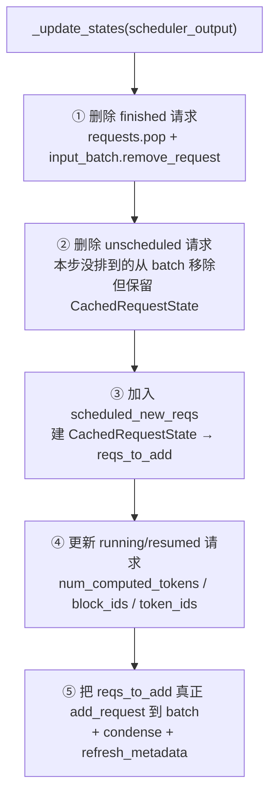
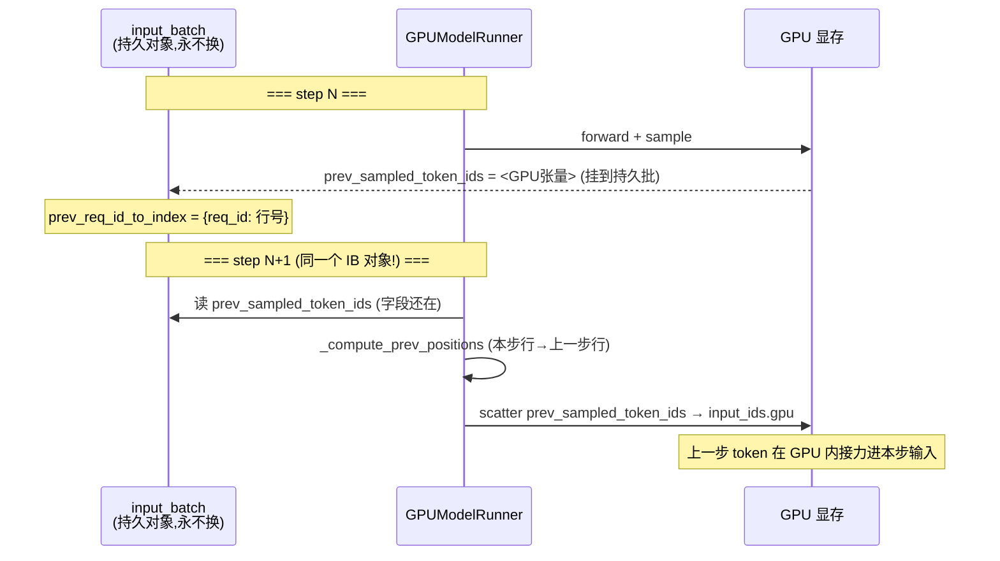
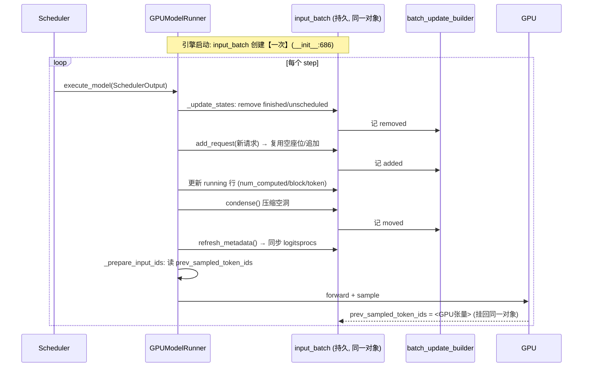

# vLLM Persistent Batch（持久批）深度解剖

> 基于 `comments-on-v0.25.1` 分支源码（2026-07-18 快照）
> 调研范围：`vllm/v1/worker/gpu_input_batch.py`、`vllm/v1/worker/gpu_model_runner.py`（`_update_states` / `_prepare_input_ids` / `_compute_prev_positions` / 初始化）
> 关联文档：`vllm_async_scheduler.md`（§4b.2 首次提出"input_batch 是同一个对象"）、`model_runner_v1_v2.md`（V1↔V2 解耦对比）
> 本报告要回答的核心疑问：**「异步调度里说 input_batch 是同一个」到底是什么意思？它凭什么能跨 step 保存上一步的采样结果？**

---

## 目录

- [0. 一句话结论](#0-一句话结论)
- [1. 什么是 Persistent Batch，为什么需要它](#1-什么是-persistent-batch为什么需要它)
- [2. 单例证据：创建一次，跨 step 复用，从不重建](#2-单例证据创建一次跨-step-复用从不重建)
- [3. 物理结构：预分配的"座位表"](#3-物理结构预分配的座位表)
- [4. 座位分配核心：req_id_to_index 映射](#4-座位分配核心req_id_to_index-映射)
- [5. 每步增量更新：_update_states 全流程](#5-每步增量更新_update_states-全流程)
- [6. 三大槽位操作：add / remove / condense / swap](#6-三大槽位操作add--remove--condense--swap)
- [7. Persistent Batch 与异步调度的连接点（回答用户疑问）](#7-persistent-batch-与异步调度的连接点回答用户疑问)
- [8. batch_update_builder：把"座位变动"广播给 logits 处理器](#8-batch_update_builder把座位变动广播给-logits-处理器)
- [9. V1 耦合 vs V2 解耦](#9-v1-耦合-vs-v2-解耦)
- [10. 设计假设与性能陷阱](#10-设计假设与性能陷阱)
- [11. 关键数据结构速查表](#11-关键数据结构速查表)
- [12. 完整时序图](#12-完整时序图)
- [13. FAQ](#13-faq)
- [14. 源码文件索引](#14-源码文件索引)

---

## 0. 一句话结论

> **Persistent Batch = `GPUModelRunner.input_batch`（`InputBatch` 类实例）这一个对象在整个引擎生命周期内只创建一次，之后每个 step 都复用同一个实例，只对其内部的固定尺寸张量做「增删改」的槽位级增量更新，绝不重建。**

正因为它是"同一个对象"，任何挂到它上面的字段（如异步调度的 `prev_sampled_token_ids`）在下一步依然存在——这就是异步调度能"上一步 token 原地接力给下一步"的底层基石。

---

## 1. 什么是 Persistent Batch，为什么需要它

### 1.1 朴素做法的问题

朴素的推理循环里，每个 step 都要把"当前这一批请求"的所有状态（token ids、block table、采样参数、seq_lens……）打包成张量喂给 GPU。如果每步都：

1. 新建一批 CPU 张量
2. 逐请求填数据
3. 拷到 GPU
4. 算完丢弃

那么 **decode 阶段每步只新增 1 个 token，却要重新搬运整批请求的全部历史状态**，CPU 成为瓶颈，且反复分配/释放张量带来 GC 与显存碎片压力。

### 1.2 Persistent Batch 的核心思想

> 把"这批请求的状态"做成一个**长期驻留、预分配到最大尺寸的容器**，请求进来就占一个"座位（行）"，请求走了就腾出座位给别人。step 与 step 之间**绝大多数请求是重叠的**（decode 中的请求会连续存在几十上百步），所以每步只需改动少数几行，而不是重建整张表。

这正是类名 `InputBatch` + 变量名 `input_batch` 背后的设计，社区口头称之为 **Persistent Batch（持久批）**。源码注释直接点明这个假设（`gpu_model_runner.py:1202`）：

```python
# NOTE(woosuk): The persistent batch optimization assumes that
# consecutive batches contain mostly the same requests.
```

---

## 2. 单例证据：创建一次，跨 step 复用，从不重建

### 2.1 唯一的常规创建点：`__init__`

`gpu_model_runner.py:686`（构造函数内）：

```python
self.input_batch = InputBatch(
    max_num_reqs=self.max_num_reqs,
    max_model_len=...,
    max_num_batched_tokens=...,
    ...
)
```

这是 runner 初始化时**唯一一次**的常规创建。此后的 `execute_model` → `_update_states` 只**修改**这个实例，从不 `self.input_batch = InputBatch(...)`。

### 2.2 唯一的例外：KV cache 初始化时按需重建一次

`gpu_model_runner.py:7050`（`initialize_kv_cache_tensors` 路径内），有第二处赋值，但被条件保护：

```python
if (
    block_sizes != self._init_block_sizes
    or kernel_block_sizes != self._init_kernel_block_sizes
):
    self._init_block_sizes = block_sizes
    self._init_kernel_block_sizes = kernel_block_sizes
    self.input_batch = InputBatch(
        ...,
        logitsprocs=self.input_batch.logitsprocs,               # 继承旧实例
        logitsprocs_need_output_token_ids=self.input_batch...,  # 继承旧实例
        ...
    )
```

关键点：

- 这发生在**引擎启动的 KV cache 初始化阶段**（此时 block_size 才最终确定），**不是每步**。
- 有 `if block_sizes != self._init_block_sizes` 守卫，只有配置首次确定/变化才重建，稳态运行期绝不触发。
- 重建时还会**把旧实例的 `logitsprocs` 搬过去**，说明设计者刻意保留状态连续性。

> 结论：**稳态推理循环中，`input_batch` 永远是同一个 Python 对象。** 这与 `vllm_async_scheduler.md §4b.2` 的论断完全一致。

---

## 3. 物理结构：预分配的"座位表"

`InputBatch.__init__`（`gpu_input_batch.py:92`）一次性把所有张量**预分配到"最大可能尺寸"**，尺寸由 `max_num_reqs`（最大并发请求数）× `max_model_len`（最大序列长）决定。核心字段分组：

### 3.1 请求索引与 token 存储

| 字段 | 形状 | 位置 | 作用 |
| --- | --- | --- | --- |
| `_req_ids` | list | CPU | 座位号 → req_id（`None`=空座位） |
| `req_id_to_index` | dict | CPU | req_id → 座位号（反向映射，核心） |
| `token_ids_cpu` | `(max_num_reqs, max_model_len)` int32 | CPU | 每请求完整 token 序列（prompt+output） |
| `is_token_ids` | 同上 bool | CPU | 该位置是否为 token id（vs prompt embed） |
| `num_tokens_no_spec` | `(max_num_reqs,)` int32 | CPU | 不含 spec token 的 token 数 |
| `num_computed_tokens_cpu` | `(max_num_reqs,)` int32 | CPU | 已计算 token 数 |
| `num_prompt_tokens` | `(max_num_reqs,)` int32 | CPU | prompt 长度 |

> `token_ids_cpu` 注释（line 127）自陈："This buffer could be too large if max_model_len is big"——这正是 V2 用 UVA 优化的动机（见 §9）。

### 3.2 Block Table（KV 块映射）

`block_table = MultiGroupBlockTable(...)`（line 172），每请求一行，支持多 KV cache group（对应 hybrid attention，参见 `blockpool_hybrid_attention.md`）。

### 3.3 采样参数（GPU + CPU 双缓冲）

`temperature` / `top_p` / `top_k` / `frequency_penalties` / `presence_penalties` / `repetition_penalties` 等，每个都是 `(max_num_reqs,)` 的 **GPU 张量 + pinned CPU 张量**成对存在。CPU 端改值，`_make_sampling_metadata` 用 `copy_slice` 只拷 `[:num_reqs]` 到 GPU。

配套的还有 `greedy_reqs` / `random_reqs` / `top_p_reqs` 等 `set[str]`，用于 O(1) 判断"整批是否全 greedy / 无 top_p"，从而**跳过不必要的张量拷贝**（`all_greedy` / `no_top_p` 等 property）。

### 3.4 异步调度专用字段（本报告重点）

`gpu_input_batch.py:295-302`：

```python
# Cached reference to the GPU tensor of previously sampled tokens
self.prev_sampled_token_ids: torch.Tensor | None = None
self.prev_req_id_to_index: dict[str, int] | None = None
# used to repair output_token_ids with real sampled ids from prior step
self.sampled_token_ids_cpu: torch.Tensor | None = None
self.async_copy_ready_event: torch.Event | None = None
```

这四个字段就是"持久批为异步调度保留跨步状态"的直接体现——**因为 batch 对象不换，这些字段挂上去就能活到下一步**。

---

## 4. 座位分配核心：req_id_to_index 映射

Persistent Batch 的全部魔法都建立在一个间接层上：

```
req_id  ──(req_id_to_index)──►  座位号(行 index)  ──►  各张量的第 index 行
```

- **加请求**：分配一个空座位号，填入所有张量对应行，登记 `req_id_to_index[req_id] = index`。
- **删请求**：从 `req_id_to_index` 删除，座位标记为空（`_req_ids[index] = None`），等待被复用或压缩。
- **访问请求状态**：`index = req_id_to_index[req_id]`，再切片各张量的第 `index` 行。

因为张量本身不动、只动"哪个座位属于谁"的映射，增删请求的代价从"重建整张表"降到"改几行 + 改一个 dict"。

---

## 5. 每步增量更新：_update_states 全流程

`_update_states`（`gpu_model_runner.py:1152`）是每个 `execute_model` 开头调用的方法，负责把 `SchedulerOutput` 的变化"打进"持久批。分五步：



### 5.1 ① 删 finished（line 1162-1176）

```python
for req_id in scheduler_output.finished_req_ids:
    self.requests.pop(req_id, None)      # 删 CPU 冗余备份
for req_id in scheduler_output.finished_req_ids:
    self.input_batch.remove_request(req_id)  # 从持久批腾座位
```

### 5.2 ② 删 unscheduled（line 1187-1207）

本步没被调度的请求（被抢占，或暂时没排上）也要从持久批**移出座位**，但**保留其 `CachedRequestState`**（CPU 备份），以便将来恢复：

```python
unscheduled_req_ids = cached_req_ids - (scheduled_req_ids - resumed_req_ids)
for req_id in unscheduled_req_ids:
    self.input_batch.remove_request(req_id)
```

> 注意此处紧跟着那句关键假设注释（line 1202）：如果两批请求重叠度低（例如在两组完全不同的请求间交替），持久批优化会**退化得很低效**——因为每步都在大量增删座位。

### 5.3 ③ 加新请求（line 1219-1284）

对 `scheduled_new_reqs`，构造 `CachedRequestState`（CPU 端请求元数据的权威副本），先收集到 `reqs_to_add`，稍后统一 `add_request`。

### 5.4 ④ 更新在跑的请求（line 1309-1459）

对 `scheduled_cached_reqs` 里每个请求，更新其在持久批中的行：

- `num_computed_tokens_cpu[req_index] = num_computed_tokens`（line 1426）
- `block_table.append_row(new_block_ids, req_index)`（line 1428，追加新分配的 KV 块）
- 把新采样 token 写进 `token_ids_cpu[req_index, start:end]`（line 1447）
- `update_req_spec_token_ids`（line 1456，写入 spec/draft token，异步下为 `-1` 占位）

这里也嵌入了**异步 + spec decode 的乐观占位**逻辑（line 1317-1357）：用 `-1` 提前撑长 `output_token_ids`，留待 forward 后校正（呼应 `vllm_async_scheduler.md §4.1`）。

### 5.5 ⑤ 落地增删 + 压缩（在 ④ 之后）

`reqs_to_add` 中的请求逐个 `add_request`（复用空座位或追加），最后 `condense()` 压缩空洞、`refresh_metadata()` 刷新采样元数据。

---

## 6. 三大槽位操作：add / remove / condense / swap

这四个方法是持久批"座位管理"的全部机械动作。

### 6.1 add_request（`gpu_input_batch.py:336`）

```python
def add_request(self, request):
    req_index = self._register_add_request(request)  # 拿空座位或追加
    ...
    self.req_id_to_index[req_id] = req_index          # 登记映射
    # 把 prompt/output token、num_computed、block_table、采样参数
    # 全部写进第 req_index 行
```

座位来源（`_register_add_request`, line 310）：

```python
if (new_req_index := self.batch_update_builder.pop_removed()) is None:
    new_req_index = self.num_reqs   # 没有空座位就追加到末尾
```

即**优先复用刚被删掉的座位**（填坑），没有坑才在末尾开新座位。

### 6.2 remove_request（`gpu_input_batch.py:511`）

```python
def remove_request(self, req_id):
    req_index = self.req_id_to_index.pop(req_id, None)  # 解除映射
    self.batch_update_builder.removed_append(req_index) # 登记空座位
    self._req_ids[req_index] = None                     # 标记空
    self.block_table.clear_row(req_index)
    # 从各 set(greedy_reqs/top_p_reqs/...) 里 discard
    # 关键：同时清理 prev_req_id_to_index（异步跨步映射）
    if self.prev_req_id_to_index is not None:
        self.prev_req_id_to_index.pop(req_id, None)
```

> 注意它**不物理清零张量数据**，只解除映射并标记空座位——数据会被后续 `add_request` 或 `condense` 覆盖。方法文档强调："This method must always be followed by a call to condense()"。

### 6.3 condense（`gpu_input_batch.py:684`）——滑动压缩

删除会在座位表中留下空洞（如座位 2、5 空了）。`condense` 把末尾的活跃请求**向前滑到空洞里**，保证 `[0, num_reqs)` 连续无洞：

```
删除前: [A, B, _, D, _, F]   (座位2、4空)
condense: 把 F→座位2, D 保持... 最终 [A, B, F, D]
```

它只搬"活跃 token 前缀"（`_get_active_token_count`）而非整行 `max_model_len`，避免无谓拷贝。每次搬动都记入 `batch_update_builder.moved`（供 logits 处理器同步，见 §8）。

### 6.4 swap_states（`gpu_input_batch.py:567`）——两座位互换

用于需要重排的场景（如把某些请求排到前面）。逐字段交换两行的所有状态。注释特别提醒 `token_ids_cpu` 不能用 Python 元组赋值直接 swap（numpy 视图别名问题），必须借助临时拷贝（line 603-611）。

---

## 7. Persistent Batch 与异步调度的连接点（回答用户疑问）

这一节直接回答你的问题：**`vllm_async_scheduler.md` 说 input_batch 是同一个——它凭什么能保存上一步的采样结果？**

### 7.1 step N 采样后：结果挂到持久批（不下 CPU）

`gpu_model_runner.py:3710-3717`：

```python
if self.input_batch.prev_sampled_token_ids is None:
    assert sampled_token_ids.shape[-1] == 1
    self.input_batch.prev_sampled_token_ids = sampled_token_ids   # GPU 张量原地挂上
self.input_batch.prev_req_id_to_index = {
    req_id: i for i, req_id in enumerate(self.input_batch.req_ids)
    if i not in invalid_req_indices_set
}
```

**因为 `self.input_batch` 是持久对象，这两个字段挂上去后不会随 step 结束而消失。**

### 7.2 step N+1 准备输入：从持久批读回上一步结果

`_prepare_input_ids`（`gpu_model_runner.py:1738`）：

```python
if self.input_batch.prev_sampled_token_ids is None:
    self.input_ids.copy_to_gpu(...)   # 同步/首步：从 CPU 拷
    return
# 否则异步 decode：上一步的 token 就在【同一个 batch 对象】的
# prev_sampled_token_ids 字段里，直接在 GPU 上拷进本步 input_ids
```

两条拷贝路径：

- **快路径**（line 1827）：batch 未变、无重排 → 一次 slice 拷贝。
- **一般路径**（line 1839）：batch 有增删/重排 → 用 `prev_positions` 映射做 `scatter_`。

### 7.3 跨步对齐：prev_positions

问题：step N 与 step N+1 之间可能有请求结束/加入，**座位号会变**。`_compute_prev_positions`（line 1723）建立"本步座位 → 上一步座位"的映射：

```python
for i, req_id in enumerate(self.input_batch.req_ids[:num_reqs]):
    prev_positions[i] = prev_req_id_to_index.get(req_id, -1)  # -1 = 新请求
```

`prev_req_id_to_index`（step N 存的）+ 本步 `req_ids` → 算出每个请求"上一步在第几行"，从而正确地从 `prev_sampled_token_ids[prev_row]` 取到自己的 token。

### 7.4 一图串起来



> **核心因果链**：持久批是同一对象 → 上一步挂的 `prev_sampled_token_ids` 还在 → 下一步无需等 CPU 回传即可读到 token → 异步调度成立、且省掉 D2H+H2D 往返。

---

## 8. batch_update_builder：把"座位变动"广播给 logits 处理器

持久批每步的增删改会打乱请求与座位的对应关系。而 logits processors（惩罚、bad_words、thinking budget 等）内部各自维护"第 i 个请求"的状态，必须与持久批的座位保持同步。

`BatchUpdateBuilder`（`gpu_input_batch.py:264`）就是"变更日志"：

- `add_request` → 记 `added`
- `remove_request` → 记 `removed`
- `condense` / `swap_states` → 记 `moved`（含 `UNIDIRECTIONAL` / `SWAP` 方向）

`refresh_metadata`（line 812）在每步末尾把这批变更 `get_and_reset`，逐个喂给 `logitsprocs.all` 的 `update_state`，并在 batch 变化时重建 `sampling_metadata`。这保证了 logits 处理器与持久批"座位视图"始终一致。

---

## 9. V1 耦合 vs V2 解耦

`model_runner_v1_v2.md` 已详述，这里从 Persistent Batch 视角提炼差异：

| 维度 | V1 (`InputBatch`) | V2 (`RequestState` + `idx_mapping`) |
| --- | --- | --- |
| 座位表 | `InputBatch` 单例，座位=行 | `RequestState` 固定状态表，每请求永久行 |
| 请求增删 | `remove_request` + `condense` **滑动压缩**（需搬数据） | 只改 `idx_mapping` + 回收 `free_indices`，O(1) 无搬动 |
| 状态↔输入 | **紧耦合**：持久张量直接当模型输入，重排即搬运 | **解耦**：状态表不动，GPU gather 出当步输入 |
| token 大表 | `token_ids_cpu` 纯 CPU 大张量 | `all_token_ids` 用 **UVA**，GPU 直接访问省显存 |
| 增量写 | 直接改 numpy 行 | `StagedWriteTensor` 暂存 diff，一个 kernel 批量应用 |
| 输入准备 | Python 循环逐请求 | Triton kernel GPU 并行 |

> 一句话：V1 的持久批是"**座位表 + 每步滑动压缩**"，V2 进化为"**永久座位 + 索引映射（idx_mapping）**"，把增删代价从 O(n)（compaction 搬数据）降到 O(1)（改映射），并把输入准备从 CPU 推到 GPU。但两者的**共同内核都是 Persistent Batch 思想**：状态长期驻留、跨步复用、增量更新。

---

## 10. 设计假设与性能陷阱

### 10.1 核心假设

> **连续的 step 之间，请求集合高度重叠。**（`gpu_model_runner.py:1202`）

这在真实 serving 里通常成立：decode 请求会连续存在几十到上千步，每步只有少量请求进/出。

### 10.2 退化场景

如果 workload 让**两批完全不同的请求交替调度**（例如 batch 大小受限、请求组 A 与 B 轮流上场），那么每步都要大量 `remove_request` + `add_request` + `condense`，持久批优化的收益被搬运开销吃掉，甚至变负。这也是注释明确警告的 anti-pattern。

### 10.3 预分配的内存代价

`token_ids_cpu` 是 `max_num_reqs × max_model_len` 的 int32 大表（注释 line 127 明说"could be too large"）。例如 1024 reqs × 131072 len ≈ 512 MB CPU 内存。这是 V2 引入 UVA 的直接动因。

---

## 11. 关键数据结构速查表

| 结构 / 字段 | 位置 | 作用 |
| --- | --- | --- |
| `InputBatch` | `gpu_input_batch.py:92` | 持久批主体类 |
| `self.input_batch` | `gpu_model_runner.py:686` | runner 持有的**唯一持久批实例** |
| `req_id_to_index` | `gpu_input_batch.py:125` | req_id → 座位号（间接层核心） |
| `_req_ids` | `gpu_input_batch.py:124` | 座位号 → req_id（`None`=空座位） |
| `token_ids_cpu` | `gpu_input_batch.py:131` | `(max_reqs, max_len)` 全 token 表 |
| `num_computed_tokens_cpu` | `gpu_input_batch.py:163` | 每请求已算 token 数 |
| `block_table` (MultiGroup) | `gpu_input_batch.py:172` | 每请求 KV 块映射（多 group） |
| `prev_sampled_token_ids` | `gpu_input_batch.py:296` | 上一步采样 token 的 **GPU 张量**（异步接力） |
| `prev_req_id_to_index` | `gpu_input_batch.py:297` | 上一步 req_id → 座位号（跨步对齐） |
| `batch_update_builder` | `gpu_input_batch.py:264` | 座位增删移动的变更日志 |
| `add_request` | `gpu_input_batch.py:336` | 占座位 + 填行 + 登记映射 |
| `remove_request` | `gpu_input_batch.py:511` | 解除映射 + 标记空座位（不清数据） |
| `condense` | `gpu_input_batch.py:684` | 滑动压缩空洞，保持 `[0,num_reqs)` 连续 |
| `swap_states` | `gpu_input_batch.py:567` | 两座位状态互换（重排） |
| `refresh_metadata` | `gpu_input_batch.py:812` | 把变更喂给 logitsprocs + 重建采样元数据 |
| `_update_states` | `gpu_model_runner.py:1152` | 每步把 SchedulerOutput 打进持久批 |
| `_prepare_input_ids` | `gpu_model_runner.py:1738` | 从持久批读 prev_sampled 拷进 input_ids |
| `_compute_prev_positions` | `gpu_model_runner.py:1723` | 本步座位 → 上一步座位 映射（-1=新） |

---

## 12. 完整时序图



---

## 13. FAQ

**Q1：为什么叫"persistent（持久）"？谁持久？**
A：指 `input_batch` 这个**对象及其内部预分配张量**跨 step 长期驻留、不销毁不重建。请求来来去去，但装它们的"容器"始终是同一个。

**Q2：请求结束后它的那行数据会被清吗？**
A：`remove_request` 只解除 `req_id_to_index` 映射、把座位标记为空，**不物理清零张量**。旧数据留在原地，直到被新请求 `add_request` 覆盖，或 `condense` 时被后来的请求滑动覆盖。

**Q3：`condense` 和 `swap_states` 有什么区别？**
A：`condense` 是**单向滑动**——把末尾活跃请求填到前面的空洞，用于删除后消除碎片。`swap_states` 是**双向互换**两个座位，用于主动重排（如把某类请求排到批次前部）。

**Q4：这和异步调度到底什么关系？**
A：异步调度需要"上一步的采样结果在下一步还能拿到"。因为持久批是同一对象，step N 把 `prev_sampled_token_ids`（GPU 张量）挂到它上面，step N+1 直接读——不需要把 token D2H 回 CPU 再 H2D 传回。持久批是异步"零拷贝接力"的物理载体。参见 `vllm_async_scheduler.md §4b`。

**Q5：V2 里还有 Persistent Batch 吗？**
A：思想仍在，但实现进化了：V2 用固定大小的 `RequestState` 状态表 + `idx_mapping` 间接索引，请求增删是 O(1) 改映射（不像 V1 要 `condense` 搬数据），且输入靠 GPU gather 当场生成，状态与输入彻底解耦。参见 `model_runner_v1_v2.md §6.1`。

**Q6：为什么每步不直接重建一个新 batch，代码更简单？**
A：decode 阶段每步只新增 1 个 token，重建整批意味着反复搬运所有请求的全部历史状态（token/block/采样参数），CPU 会成为瓶颈，还会频繁分配/释放大张量引发 GC 与碎片。持久批把每步代价降到"只改动少数几行"。

---

## 14. 源码文件索引

| 文件 / 行号 | 职责 |
| --- | --- |
| `vllm/v1/worker/gpu_input_batch.py:92` | `InputBatch` 持久批类定义 |
| `vllm/v1/worker/gpu_input_batch.py:336` | `add_request` 占座位 |
| `vllm/v1/worker/gpu_input_batch.py:511` | `remove_request` 腾座位 |
| `vllm/v1/worker/gpu_input_batch.py:567` | `swap_states` 座位互换 |
| `vllm/v1/worker/gpu_input_batch.py:684` | `condense` 滑动压缩 |
| `vllm/v1/worker/gpu_input_batch.py:812` | `refresh_metadata` 同步 logitsprocs |
| `vllm/v1/worker/gpu_input_batch.py:296` | `prev_sampled_token_ids` 等异步字段 |
| `vllm/v1/worker/gpu_model_runner.py:686` | 持久批**唯一常规创建点**（`__init__`） |
| `vllm/v1/worker/gpu_model_runner.py:7050` | KV cache 初始化时的条件重建（唯一例外） |
| `vllm/v1/worker/gpu_model_runner.py:1152` | `_update_states` 每步增量更新 |
| `vllm/v1/worker/gpu_model_runner.py:1723` | `_compute_prev_positions` 跨步座位映射 |
| `vllm/v1/worker/gpu_model_runner.py:1738` | `_prepare_input_ids` 读回上一步 token |
| `vllm/v1/worker/gpu_model_runner.py:3710` | 采样后把结果挂回持久批 |

---

*报告生成日期：2026-07-18 ｜ 代码基线：vllm-project/vllm v0.25.1（`comments-on-v0.25.1` 分支）*
