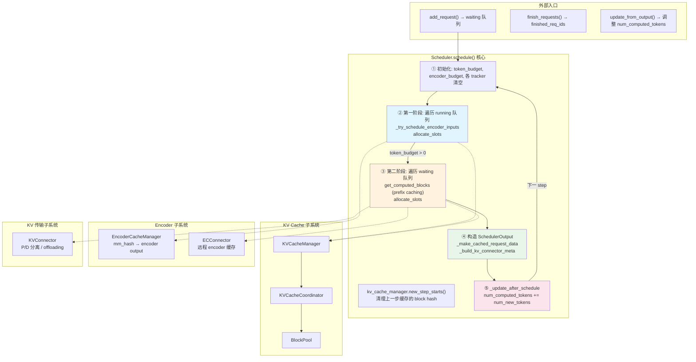
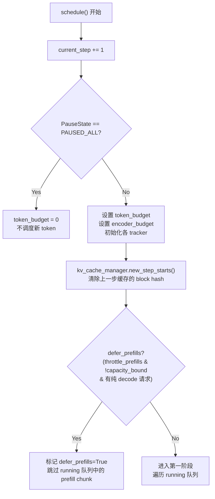
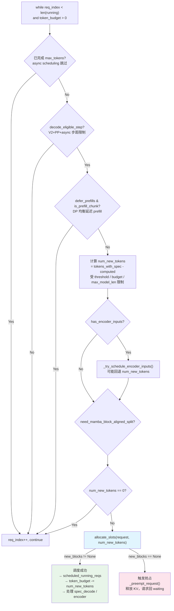
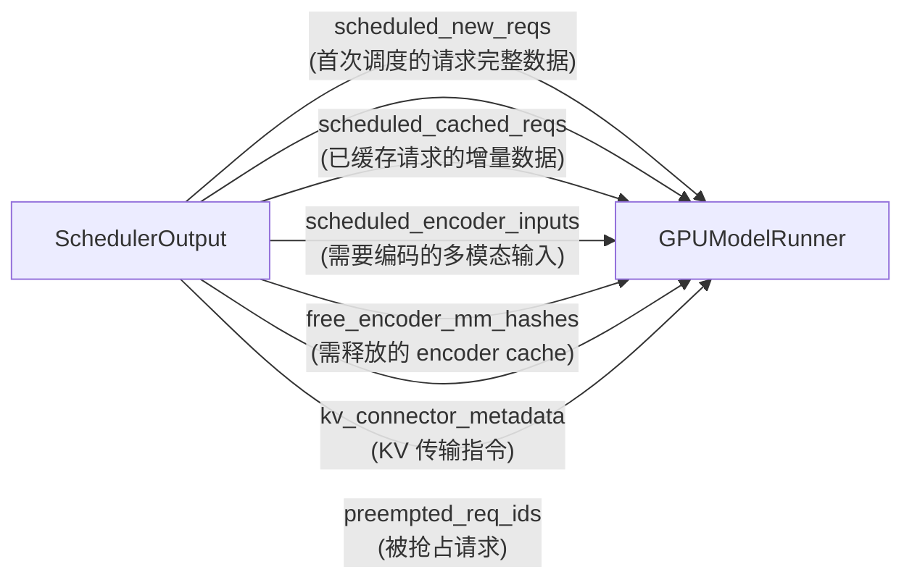
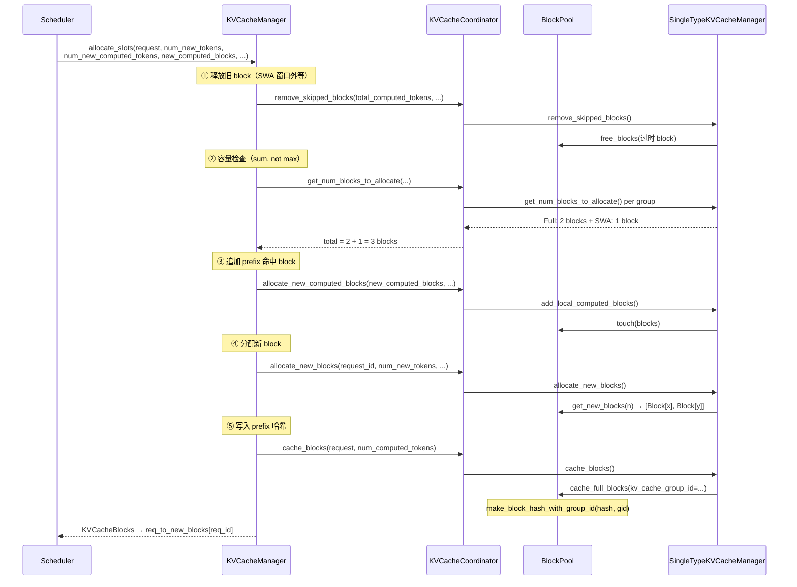
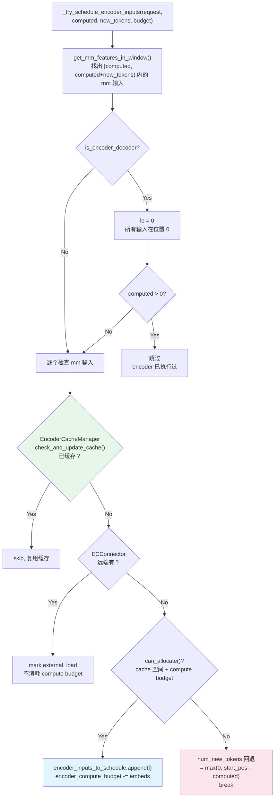
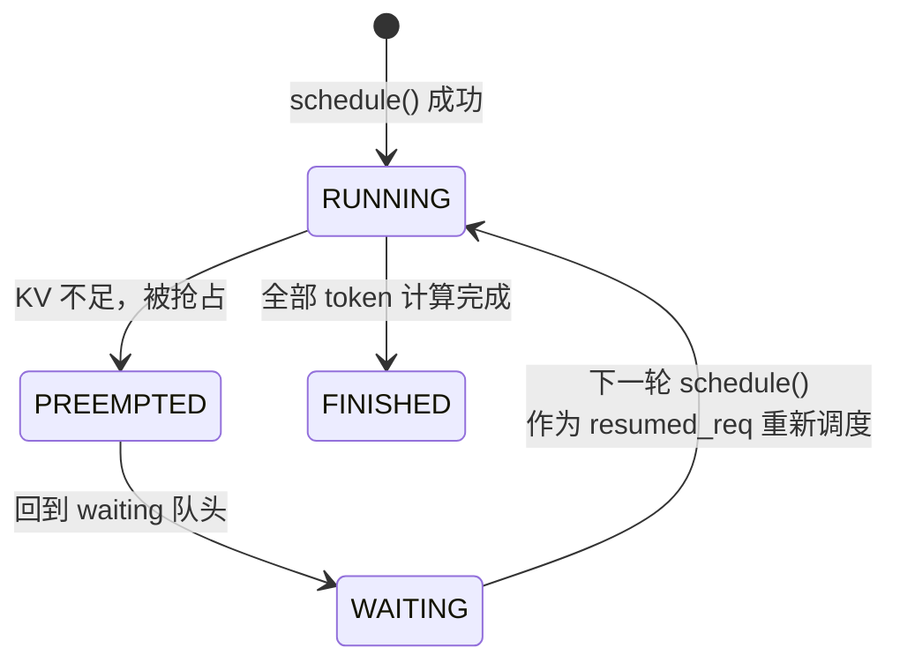
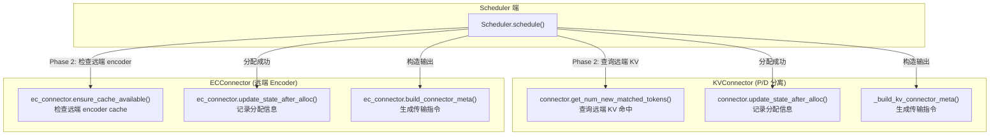
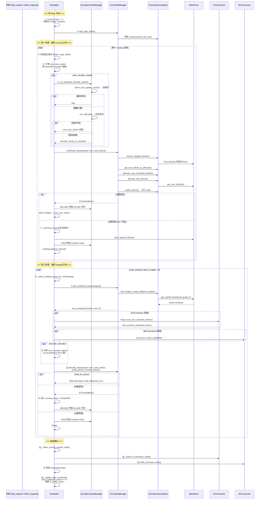

# vLLM V1 Scheduler 调度流程深度解剖

> **Mermaid 图渲染**：GitHub / GitLab 原生支持；VS Code 安装 "Markdown Preview Mermaid Support" 插件；**PyCharm 安装 "Mermaid" 插件"（Settings → Plugins → 搜索 Mermaid）即可在预览中渲染。

## 目录

1. [前置知识：设计思想与核心概念](#1-前置知识设计思想与核心概念)
2. [全景架构概览](#2-全景架构概览)
3. [调度器成员变量全景表](#3-调度器成员变量全景表)
4. [调度主流程逐段解剖](#4-调度主流程逐段解剖)
   - [4.1 初始化与预算设置](#41-初始化与预算设置)
   - [4.2 第一阶段：调度 RUNNING 队列](#42-第一阶段调度-running-队列)
   - [4.3 第二阶段：调度 WAITING 队列](#43-第二阶段调度-waiting-队列)
   - [4.4 构造 SchedulerOutput](#44-构造-scheduleroutput)
   - [4.5 收尾：update_after_schedule](#45-收尾update_after_schedule)
5. [KV Cache 分配流程详解](#5-kv-cache-分配流程详解)
6. [Encoder 调度子流程](#6-encoder-调度子流程)
7. [抢占机制深度剖析](#7-抢占机制深度剖析)
8. [投机解码集成](#8-投机解码集成)
9. [KVConnector / ECConnector 集成点](#9-kvconnector--ecconnector-集成点)
10. [完整调用链时序图](#10-完整调用链时序图)
11. [关键数据结构速查表](#11-关键数据结构速查表)
12. [FAQ](#12-faq)

---

## 1. 前置知识：设计思想与核心概念

### 1.1 vLLM V1 调度器的设计哲学

vLLM V1 的调度器与传统推理框架的根本区别在于：**没有独立的 "Prefill 阶段" 和 "Decode 阶段"**。

代码注释（line 398-407）直接阐明了这一点：

> There's no "decoding phase" nor "prefill phase" in the scheduler. Each request just has the `num_computed_tokens` and `num_tokens_with_spec`. At each step, the scheduler tries to assign tokens to the requests so that each request's `num_computed_tokens` can catch up its `num_tokens_with_spec`.

**核心思想**：每个 Step 是一个"追赶"过程——所有请求（无论 prefill 还是 decode）都在同一框架下通过 `num_computed_tokens` 追赶 `num_tokens_with_spec`。

### 1.2 核心概念速览

| 概念 | 含义 | 变量 |
|------|------|------|
| **Token Budget** | 单步可调度的最大 token 总数 | `token_budget` → `self.max_num_scheduled_tokens` |
| **Compute Budget (Encoder)** | 单步可用于 encoder 计算的最大 token 数 | `encoder_compute_budget` → `self.max_num_encoder_input_tokens` |
| **Chunked Prefill** | 长 prefill 拆成多步执行，每步只处理 budget 内的 token | 通过 `num_new_tokens` 截断实现 |
| **两阶段调度** | Running 队列优先 → Waiting 队列补充 | Phase 1 + Phase 2 |
| **抢占 (Preemption)** | KV Cache 不够时踢出低优先级请求 | `_preempt_request()` |
| **Prefix Caching** | 复用已计算 token 的 KV Cache block | `get_computed_blocks()` → `find_longest_cache_hit()` |
| **延迟 Block 释放** | 同一请求的旧 block 在下次分配前才释放 | `kv_cache_manager.remove_skipped_blocks()` |

### 1.3 调度策略

- **FCFS**（默认）：按 `arrival_time` 排序，running 队列队尾抢占
- **PRIORITY**：按 `(priority, arrival_time)` 排序，抢占优先级最低的请求

---

## 2. 全景架构概览



**一句话概括**：`schedule()` 是一个单步调度函数，它分两个阶段（running → waiting）按 token budget 给请求分配计算配额，通过 `allocate_slots` 确保 KV Cache 有足够空间，最终输出 `SchedulerOutput` 给 Worker 执行。

---

## 3. 调度器成员变量全景表

**文件**: `vllm/v1/core/sched/scheduler.py:68-298`

### 3.1 配置类成员

| 变量 | 行号 | 来源 | 作用 |
|------|------|------|------|
| `self.vllm_config` | 80 | 构造参数 | 全局配置入口 |
| `self.scheduler_config` | 81 | `vllm_config.scheduler_config` | 调度器配置 |
| `self.cache_config` | 82 | `vllm_config.cache_config` | KV Cache / prefix caching 配置 |
| `self.lora_config` | 83 | `vllm_config.lora_config` | LoRA 适配器配置 |
| `self.kv_cache_config` | 84 | 构造参数 | KV Cache Group 配置 |
| `self.parallel_config` | 86 | `vllm_config.parallel_config` | 并行配置 (TP/PP/DP/CP) |
| `self.observability_config` | 88 | `vllm_config.observability_config` | 可观测性配置 |
| `self.structured_output_manager` | 94 | 构造参数 | 结构化输出 (JSON mode) 管理 |

### 3.2 容量约束类成员

| 变量 | 行号 | 含义 | 默认来源 |
|------|------|------|---------|
| `self.max_num_running_reqs` | 108 | 最大并发请求数 | `scheduler_config.max_num_seqs` |
| `self.max_num_scheduled_tokens` | 109-113 | 单步最大 token 计算量 | `max_num_scheduled_tokens` 或 `max_num_batched_tokens` |
| `self.max_model_len` | 114 | 模型最大长度 | `model_config.max_model_len` |
| `self.max_num_encoder_input_tokens` | 221-223 | 单步最大 encoder 计算量 | `MultiModalBudget.encoder_compute_budget` |
| `self.num_sampled_tokens_per_step` | 120-122 | 每请求每步采样 token 数 | 1（普通模型）/ 0（diffusion） |

### 3.3 请求队列状态

| 变量 | 行号 | 类型 | 作用 |
|------|------|------|------|
| `self.requests` | 172 | `dict[str, Request]` | 所有已知请求（req_id → Request） |
| `self.waiting` | 181 | `RequestQueue` | 等待调度的请求队列 |
| `self.skipped_waiting` | 183 | `RequestQueue` | 因约束跳过本步的 waiting 请求（下步优先） |
| `self.running` | 184 | `list[Request]` | 正在执行的请求列表 |
| `self.finished_req_ids` | 190 | `set[str]` | 两步之间结束的请求 ID |
| `self.reset_preempted_req_ids` | 193 | `set[str]` | 本轮被抢占的请求 ID |
| `self._inflight_prefills` | 298+ | `set[Request]` | 正在 prefill 中的请求集合 |

### 3.4 投机解码相关

| 变量 | 行号 | 含义 |
|------|------|------|
| `self.use_eagle` | 232 | 是否启用 EAGLE 投机解码 |
| `self.num_spec_tokens` | 233 | 投机 token 数 |
| `self.num_lookahead_tokens` | 234 | KV Cache 前瞻预留 token 数 |
| `self.dynamic_sd_lookup` | 235 | 动态投机解码的 batch_size → K 映射表 |

### 3.5 KV / Encoder 子系统

| 变量 | 行号 | 类型 | 作用 |
|------|------|------|------|
| `self.kv_cache_manager` | 262-276 | `KVCacheManager` | KV Cache 分配 & prefix caching |
| `self.encoder_cache_manager` | 225-229 | `EncoderCacheManager` 或子类 | 多模态 encoder 输出缓存 |
| `self.connector` | 127 | `KVConnector` or `None` | P/D 分离 / KV offloading |
| `self.ec_connector` | 158-162 | `ECConnector` or `None` | 远程 encoder 缓存 |
| `self.block_size` | 167 | `int` | Scheduler 粒度的 block_size |
| `self.needs_kv_cache_zeroing` | 296 | `bool` | 新 block 是否需要置零 |

### 3.6 调度状态

| 变量 | 行号 | 含义 |
|------|------|------|
| `self.current_step` | 286, 397 | 当前调度步数，每 `schedule()` +1 |
| `self.policy` | 175 | `SchedulingPolicy.FCFS` 或 `PRIORITY` |
| `self.use_pp` | 282 | 是否使用 Pipeline Parallelism |
| `self.use_v2_model_runner` | 283 | 是否使用 V2 Model Runner |
| `self.prefill_capacity_bound` | 290 | DP prefill 均衡：上轮是否满载 |
| `self.defer_block_free` | 130, 152 | 是否延迟 block 释放 |
| `self.sched_step_seq` | 1129 | defer_block_free 下的调度序列号 |
| `self.has_mamba_layers` | 295 | 模型是否含 Mamba 层 |
| `self.need_mamba_block_aligned_split` | 297-298 | Mamba 是否需要 block 对齐 |
| `self.is_encoder_decoder` | 95 | 是否为 encoder-decoder 模型 |

---

## 4. 调度主流程逐段解剖

**文件**: `vllm/v1/core/sched/scheduler.py:396-1134`

### 4.1 初始化与预算设置（line 396-438）

```python
self.current_step += 1    # 步数递增

# 初始化本步的 tracker
scheduled_new_reqs: list[Request] = []
scheduled_resumed_reqs: list[Request] = []
scheduled_running_reqs: list[Request] = []
preempted_reqs: list[Request] = []

req_to_new_blocks: dict[str, KVCacheBlocks] = {}
num_scheduled_tokens: dict[str, int] = {}
token_budget = self.max_num_scheduled_tokens       # ← Token 预算
encoder_compute_budget = self.max_num_encoder_input_tokens  # ← Encoder 预算
scheduled_spec_decode_tokens: dict[str, list[int]] = {}
```

**两个核心预算**：
- `token_budget`：限制本步所有请求的 token 总数
- `encoder_compute_budget`：限制本步所有 encoder 输入的总 token 数

**DP Prefill 均衡**（line 434-438）：在非 cadence 对齐的 step 中，如果上轮未满载（`prefill_capacity_bound == False`），则延迟 prefill 计算到 cadence 对齐步，让 decode 填充当前步。



### 4.2 第一阶段：调度 RUNNING 队列（line 440-634）



#### 4.2.1 跳过条件（line 445-471）

请求在本轮被跳过的 4 种情况：

| 条件 | 原因 | 处理 |
|------|------|------|
| `num_computed_tokens + 2 - output_placeholders >= max_tokens` | 已生成完、不需要再多一步 | `continue` |
| `current_step < next_decode_eligible_step` | V2+PP+async：步距限制 | `continue` |
| `defer_prefills and is_prefill_chunk` | DP prefill 均衡 | `continue` |
| `num_new_tokens == 0` | Encoder budget / cache 不足 / Mamba 对齐 | `continue` |

#### 4.2.2 num_new_tokens 计算（line 473-489）

```python
num_new_tokens = (
    request.num_tokens_with_spec          # prompt + output + spec tokens
    + request.num_output_placeholders      # draft token 占位
    - request.num_computed_tokens          # 已计算 token
)
# 受三重限制：
num_new_tokens = min(num_new_tokens, long_prefill_token_threshold)  # 长 prefill 截断
num_new_tokens = min(num_new_tokens, token_budget)                   # 预算限制
num_new_tokens = min(num_new_tokens, max_model_len - computed - 1)   # 长度限制
```

对于 **decode 阶段**：`num_tokens_with_spec ≈ num_computed_tokens + 1`，所以 `num_new_tokens = 1`（每个 decode 请求计算 1 个新 token）。
对于 **prefill 阶段**：`num_new_tokens` 可能很大，会被 budget 截断，形成 chunked prefill。

#### 4.2.3 allocate_slots 与抢占（line 532-578）

```python
while True:
    new_blocks = self.kv_cache_manager.allocate_slots(
        request, num_new_tokens, num_lookahead_tokens=self.num_lookahead_tokens
    )
    if new_blocks is not None:
        break  # 分配成功
    
    # 分配失败 → 抢占
    if self.policy == SchedulingPolicy.PRIORITY:
        preempted_req = max(self.running, key=lambda r: (r.priority, r.arrival_time))
    else:  # FCFS
        preempted_req = self.running.pop()  # 队尾（最新）
    
    self._preempt_request(preempted_req, scheduled_timestamp)
    preempted_reqs.append(preempted_req)
    
    if preempted_req == request:
        break  # 自己是唯一可抢的 → 本轮无法调度
```

**关键**：FCFS 策略下从 running 队尾抢占（最新请求），PRIORITY 策略下抢占优先级最低的请求。被抢占的请求的 encoder 预算会被恢复（line 559-569）。

#### 4.2.4 调度成功后的记录（line 584-634）

```python
scheduled_running_reqs.append(request)
req_to_new_blocks[request_id] = new_blocks
num_scheduled_tokens[request_id] = num_new_tokens
token_budget -= num_new_tokens

# Encoder 相关
if encoder_inputs_to_schedule:
    scheduled_encoder_inputs[request_id] = encoder_inputs_to_schedule
    for i in encoder_inputs_to_schedule:
        self.encoder_cache_manager.allocate(request, i)  # 预留缓存空间
    encoder_compute_budget = new_encoder_compute_budget

# LoRA 记录
if self.lora_config:
    scheduled_loras.add(req.lora_request.lora_int_id)
```

---

### 4.3 第二阶段：调度 WAITING 队列（line 636-1021）

**前置条件**（line 637）：只有**没有发生抢占**时才调度 waiting 队列。抢占意味着 running 已满，无需再拉新请求。

```mermaid
flowchart TD
    PRECOND{"preempted_reqs 为空?<br/>pause_state == UNPAUSED?"}
    PRECOND -->|No| SKIP["跳过 waiting 调度"]
    PRECOND -->|Yes| LOOP_W["while (waiting or skipped_waiting)<br/>and token_budget > 0"]
    
    LOOP_W --> CHECK_MAX{"running + streaming_waiting<br/>&lt; max_num_running_reqs?"}
    CHECK_MAX -->|No| BREAK["break<br/>并发数已满"]
    CHECK_MAX -->|Yes| SELECT["_select_waiting_queue_for_scheduling()<br/>从 waiting / skipped_waiting 取头部请求"]
    SELECT --> PROMOTE{"状态阻塞?<br/>WAITING_FOR_FSM / WAITING_FOR_REMOTE_KVS"}
    PROMOTE -->|无法解除| SKIP_W["跳过, 加入 skipped_waiting"]
    PROMOTE -->|可解除| LORA{"LoRA 约束检查<br/>max_loras 未超?"}
    LORA -->|超限| SKIP_W
    LORA -->|OK| COMPUTE["get_computed_blocks()<br/>查询 prefix caching 命中"]
    COMPUTE --> KV_EXT{"KVConnector?<br/>检查远端 KV 是否可用"}
    KV_EXT -->|不可用| SKIP_W
    KV_EXT -->|可用| EC_EXT{"ECConnector?<br/>检查远端 encoder cache"}
    EC_EXT -->|不可用| SKIP_W
    EC_EXT -->|可用| CALC["计算 num_new_tokens / num_encoder_tokens"]
    CALC --> ALLOC["allocate_slots(...)<br/>含 prefix blocks + new blocks + encoder tokens"]
    ALLOC -->|None (失败)| BREAK
    ALLOC -->|成功| ADD["加入 running<br/>req.status = RUNNING<br/>num_computed_tokens = total_computed"]
    ADD --> ENC_ALLOC["Encoder cache allocate<br/>ECConnector update"]
    
    style ALLOC fill:#e1f5fe
    style COMPUTE fill:#fff3e0
    style ADD fill:#e8f5e9
```

#### 4.3.1 Prefix Caching 查询（line 687-784）

对于 `num_computed_tokens == 0` 的新请求，需要查询 prefix caching：

```python
# 1. 查询本地 prefix caching（BlockPool hash 表）
new_computed_blocks, num_new_local_computed_tokens = \
    self.kv_cache_manager.get_computed_blocks(request)

# 2. 查询远端 KV（P/D 分离场景）
if self.connector is not None:
    num_external_computed_tokens = self.connector.get_num_new_matched_tokens(...)

# 3. 合计
num_computed_tokens = num_new_local_computed_tokens + num_external_computed_tokens
```

> **Hybrid 模型特殊路径**（line 689-722）：对于含 Mamba 层的 hybrid 模型，使用 `find_longest_cache_hit_per_group()` 获取每个 group 的命中 token 数，以 FA 命中长度作为 `num_new_local_computed_tokens`，避免重复传输 FA block。

#### 4.3.2 Cross-Attention Block 分配（line 883-893）

```python
if self.is_encoder_decoder and request.has_encoder_inputs and encoder_inputs_to_schedule:
    num_encoder_tokens = sum(
        request.get_num_encoder_embeds(i) for i in encoder_inputs_to_schedule
    )
```

Encoder-decoder 模型需要为 cross-attention 分配 KV Cache block。`num_encoder_tokens` 决定了 cross-attention block 的数量。

#### 4.3.3 Async KV Load 路径（line 797-967）

当远端 KV 需要异步加载时：

```python
if load_kv_async:
    num_new_tokens = 0                      # 不分配本地计算
    request.status = RequestStatus.WAITING_FOR_REMOTE_KVS  # 标记等待状态
    step_skipped_waiting.prepend_request(request)
    self._inflight_prefills.add(request)
    request.num_computed_tokens = num_computed_tokens  # 预设 computed tokens
    continue  # 等待远程 KV 加载完成
```

#### 4.3.4 分配失败处理（line 917-924）

```python
if new_blocks is None:
    # Encoder cache 回滚
    if request.has_encoder_inputs:
        self.encoder_cache_manager.free(request)
    break  # 终止 waiting 调度
```

与 running 队列不同，waiting 队列分配失败会直接 `break` 终止本阶段，不会触发抢占。

---

### 4.4 构造 SchedulerOutput（line 1045-1134）

```python
scheduler_output = SchedulerOutput(
    scheduled_new_reqs=new_reqs_data,           # 首次调度的请求
    scheduled_cached_reqs=cached_reqs_data,     # 已缓存的请求（只发 diff）
    num_scheduled_tokens=num_scheduled_tokens,  # {req_id: n_tokens}
    total_num_scheduled_tokens=total_num_scheduled_tokens,
    scheduled_spec_decode_tokens=scheduled_spec_decode_tokens,
    scheduled_encoder_inputs=scheduled_encoder_inputs,
    num_common_prefix_blocks=num_common_prefix_blocks,  # Cascade attention
    preempted_req_ids=self.reset_preempted_req_ids,
    finished_req_ids=self.finished_req_ids,
    free_encoder_mm_hashes=self.encoder_cache_manager.get_freed_mm_hashes(),
    new_block_ids_to_zero=new_block_ids_to_zero,
    num_spec_tokens_to_schedule=num_spec_tokens_to_schedule,
)

# 构建 KVConnector 元数据
if self.connector:
    scheduler_output.kv_connector_metadata = self._build_kv_connector_meta(...)

# 构建 ECConnector 元数据
if self.ec_connector:
    scheduler_output.ec_connector_metadata = self.ec_connector.build_connector_meta(...)
```

**SchedulerOutput 数据流**：



### 4.5 收尾：update_after_schedule（line 1164-1211）

```python
def _update_after_schedule(self, scheduler_output):
    for req_id, num_scheduled_token in num_scheduled_tokens.items():
        request = self.requests[req_id]
        # ① 推进 computed tokens（实际计算在 worker 完成后可能被修正）
        request.num_computed_tokens += num_scheduled_token
        # ② 更新 prefill_chunk 标志
        request.is_prefill_chunk = request.num_computed_tokens < request.num_tokens
        # ③ prefill 完成 → 移出 _inflight_prefills
        if not request.is_prefill_chunk:
            self._inflight_prefills.discard(request)
    
    # ④ 清空步间状态
    self.finished_req_ids = set()
    self.reset_preempted_req_ids = set()
```

**关键**：`num_computed_tokens` 在调度后**立即递增**，不等 worker 执行完成。如果后续 speculative tokens 被拒绝，会在 `update_from_output()` 中回退。

---

## 5. KV Cache 分配流程详解



**5 个步骤**：释放旧 block → 容量预估 → 追加 prefix 命中 → 分配新 block → 写入哈希

---

## 6. Encoder 调度子流程



详见 [Encoder 集成机制报告](encoder_integration.md) 第 4 节。

---

## 7. 抢占机制深度剖析



### 7.1 抢占触发条件

**只在 running 队列调度阶段触发**（line 532-578）。当 `allocate_slots()` 返回 `None` 时：

1. `new_blocks = self.kv_cache_manager.allocate_slots(...)` → `None`
2. 选择抢占目标（FCFS: 队尾 `self.running.pop()` / PRIORITY: `max(priority, arrival_time)`）
3. `_preempt_request(preempted_req)`
4. 如果被抢占的就是当前请求自身 → 本轮无法调度

### 7.2 _preempt_request 内部（line 1140-1162）

```python
def _preempt_request(self, request, timestamp):
    self._free_request_blocks(request)           # 释放 KV Cache block
    self.encoder_cache_manager.free(request)      # 释放 encoder cache
    self._inflight_prefills.discard(request)      # 移除 prefill 跟踪
    request.status = RequestStatus.PREEMPTED
    request.num_computed_tokens = 0               # 重置计算进度
    request.num_preemptions += 1
    self.waiting.prepend_request(request)         # 回到 waiting 队头
    self.reset_preempted_req_ids.add(request_id)
```

### 7.3 Encoder Budget 恢复（line 559-569）

当被抢占的请求已在当前步分配了 encoder 输入时，需要恢复 encoder budget：

```python
if preempted_encoder_inputs:
    num_embeds_to_restore = sum(
        preempted_req.get_num_encoder_embeds(i)
        for i in preempted_encoder_inputs
    )
    encoder_compute_budget += num_embeds_to_restore
```

---

## 8. 投机解码集成

### 8.1 EAGLE 模式

```python
# _try_schedule_encoder_inputs 中 shift_computed_tokens = 1
# EAGLE 需要在当前位置多看 1 个 token 来确定 encoder 需求

# 调度后清理
request.spec_token_ids = []  # 清空本轮已用的 spec token
```

### 8.2 动态投机解码

```python
if self.dynamic_sd_lookup is not None:
    num_spec_tokens_to_schedule = self.dynamic_sd_lookup[len(num_scheduled_tokens)]
```

根据 batch size 动态选择最优的 K 值。

### 8.3 Decode Padding（line 814-826）

```python
# 新 decode 请求 pad 到统一 spec size 以保持完整 CUDA Graph
if num_new_tokens == 1 and (running_reqs and not prefill_scheduled):
    num_new_tokens = 1 + self.num_spec_tokens
    pad_spec_decode = True
```

---

## 9. KVConnector / ECConnector 集成点



---

## 10. 完整调用链时序图



---

## 11. 关键数据结构速查表

| 数据结构 | 文件 | 关键字段 | 作用 |
|---------|------|---------|------|
| `Scheduler` | `sched/scheduler.py:68` | 见 §3 全景表 | 核心调度器 |
| `SchedulerOutput` | `sched/output.py:181` | `scheduled_new_reqs`, `scheduled_cached_reqs`, `num_scheduled_tokens`, `scheduled_encoder_inputs`, `free_encoder_mm_hashes` | 单步调度结果 |
| `CachedRequestData` | `sched/output.py:132` | `req_ids`, `new_token_ids`, `new_block_ids`, `num_computed_tokens` | 已缓存请求的增量数据 |
| `NewRequestData` | `sched/output.py:37` | `req_id`, `block_ids`, `prompt_token_ids`, `mm_features` | 新请求的完整数据 |
| `Request` | `vllm/v1/request.py` | `num_computed_tokens`, `num_tokens_with_spec`, `mm_features`, `status`, `block_hashes` | 单个请求的完整状态 |
| `RequestQueue` | `vllm/v1/request_queue.py` | `peek_request()`, `pop_request()`, `prepend_request()` | FCFS / PRIORITY 策略队列 |
| `RequestStatus` | `vllm/v1/request.py` | WAITING, RUNNING, PREEMPTED, FINISHED, WAITING_FOR_REMOTE_KVS, WAITING_FOR_FSM, WAITING_FOR_STREAMING_REQ | 请求生命周期状态 |
| `SchedulingPolicy` | `vllm/v1/request_queue.py` | FCFS, PRIORITY | 调度策略枚举 |
| `PauseState` | `sched/interface.py` | UNPAUSED, PAUSED_ALL | 暂停状态控制 |
| `KVCacheBlocks` | `kv_cache_manager.py:30` | `blocks: tuple[Sequence[KVCacheBlock], ...]` | 多 Group 的 block 分配结果 |
| `SchedulerInterface` | `sched/interface.py` | `schedule()`, `add_request()`, `finish_requests()` | 调度器抽象接口 |

---

## 12. FAQ

**Q1: 调度器如何实现 Chunked Prefill？**

> 没有专门的 chunked prefill 模块。`num_new_tokens = tokens_with_spec - computed` 在 prefill 阶段是一个很大的值，但受到 `token_budget` 和 `long_prefill_token_threshold` 的限制被截断，剩余的 token 在下个 step 继续。连续多个 step 自然形成了 "chunked" 效果。下个 step 中 `num_computed_tokens` 已经被 `_update_after_schedule` 推进，所以剩余 token 继续从上次的断点开始。

**Q2: 为什么 running 分配失败就抢占，waiting 分配失败就 break？**

> Running 请求已经在执行中，如果因 KV 不足而让它们停滞，会阻塞整个 pipeline。抢占一个低优先级 running 请求可以让出空间。Waiting 请求还没开始执行，如果 KV 不足，就不启动它，等下个 step 再试。

**Q3: num_computed_tokens 什么时候被回退？**

> 投机解码场景下：如果 draft tokens 被拒绝，`update_from_output()` 会把 `num_computed_tokens` 回退到实际生成的 token 数。此外，被抢占的请求 `num_computed_tokens` 被重置为 0。

**Q4: token_budget 和 encoder_compute_budget 是两个独立的预算吗？**

> 是。`token_budget` 限制 decoder 计算的总 token 数，`encoder_compute_budget` 限制 encoder 计算的总 token 数。一个请求可能消耗 encoder budget（图片编码）但不消耗 token budget（encoder 输出直接替代 text embedding），也可能不消耗两者（纯 decode）。

**Q5: 为什么 waiting 调度要在"没有抢占"的条件下执行？**

> 抢占意味着 running 队列中有请求因 KV 不足被踢出。此时 running 队列的容量紧张，再拉新请求只会加剧竞争。等下一轮 without preemptions 再拉新请求。

**Q6: `skipped_waiting` 队列的作用是什么？**

> 当 waiting 请求因临时约束（等待 FSM、等待远程 KV、LoRA 超限等）无法调度时，不丢弃它，而是放入 `skipped_waiting`，下一轮优先调度。这避免了每次都重复检查那些暂时无法调度的请求。

---

*报告生成日期: 2026年7月*
*分析的代码基线: vllm-project/vllm v0.25.1*
