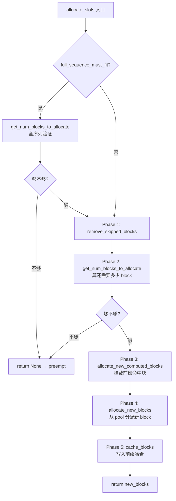
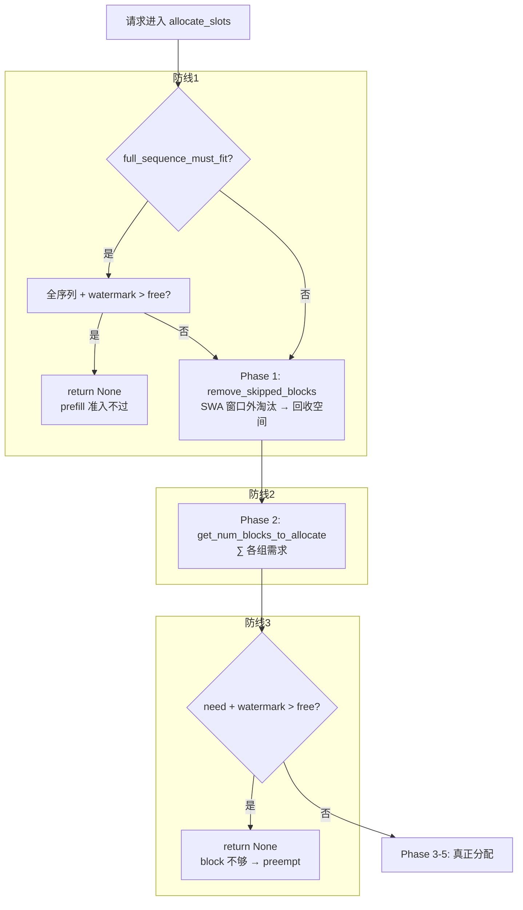
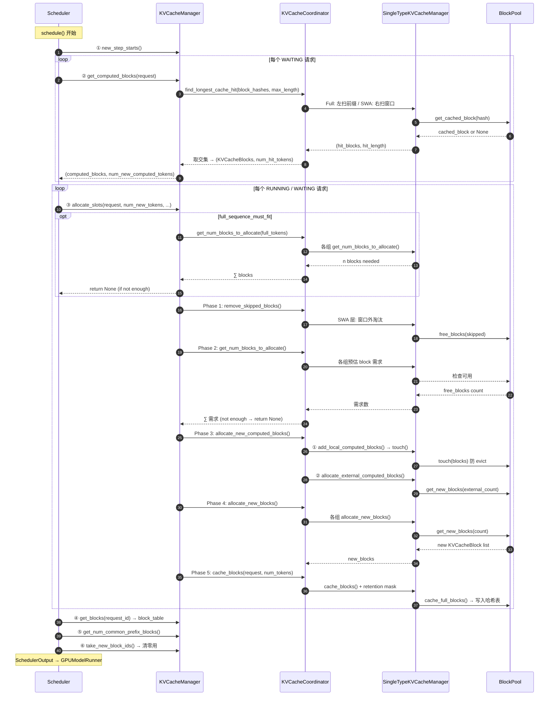

# Scheduler ↔ KVCacheManager 交互全链路深度解剖

## 目录
1. [全景架构概览](#1-全景架构概览)
2. [三层架构：Scheduler → Manager → Coordinator → SingleType](#2-三层架构)
3. [一个调度步内的完整调用序列](#3-一个调度步内的完整调用序列)
4. [核心方法 `allocate_slots` 深度解剖](#4-核心方法-allocate_slots-深度解剖)
5. [参数溯源：每个参数从哪里来](#5-参数溯源每个参数从哪里来)
6. [准入控制：三层防线](#6-准入控制三层防线)
7. [各类 Manager 如何被 Coordinator 调用](#7-各类-manager-如何被-coordinator-调用)
8. [完整调用链时序图](#8-完整调用链时序图)
9. [关键数据结构速查表](#9-关键数据结构速查表)

---

## 1. 全景架构概览

```mermaid
graph TD
    subgraph "调度层"
        S[Scheduler<br/>schedule()]
    end
    subgraph "KV Cache 管理层"
        KM[KVCacheManager<br/>allocate_slots()]
        KC[KVCacheCoordinator<br/>协调多 group]
        F[FullAttentionManager]
        SW[SlidingWindowManager]
        M[MambaManager]
        CA[CrossAttentionManager]
    end
    subgraph "资源层"
        BP[(BlockPool<br/>物理 block 池 + 前缀哈希)]
    end

    S -->|① 查前缀缓存| KM
    S -->|② 分配 slots| KM
    S -->|③ 获取 block_table| KM
    S -->|④ 释放 finished 请求| KM
    KM --> KC
    KC --> F
    KC --> SW
    KC --> M
    KC --> CA
    F --> BP
    SW --> BP
    M --> BP
    CA --> BP
```

三层设计：
1. **Scheduler** 负责调度策略（谁先跑、跑多少 token）
2. **KVCacheManager + Coordinator** 负责 KV cache 容量管理和前缀缓存协调
3. **BlockPool** 负责物理 block 的分配/释放/前缀哈希

---

## 2. 三层架构

```
Scheduler (scheduler.py)
  │
  ├─ owns: KVCacheManager (kv_cache_manager.py)
  │          │
  │          └─ owns: KVCacheCoordinator (kv_cache_coordinator.py)
  │                    │
  │                    └─ owns: N × SingleTypeKVCacheManager
  │                              │
  │                              └─ share: BlockPool
  │
  └─ 调度循环中调用 KV cache 方法
```

Coordinator 有三种变体（由 `get_kv_cache_coordinator()` 选）：
- **`KVCacheCoordinatorNoPrefixCache`** — enable_caching=False
- **`UnitaryKVCacheCoordinator`** — 仅 1 个 KV cache group
- **`HybridKVCacheCoordinator`** — 多个 KV cache group（如 full + SWA）

---

## 3. 一个调度步内的完整调用序列

`Scheduler.schedule()` 中对 KV cache 的调用顺序：

```
schedule()
 │
 ├─① new_step_starts()                           ← 每步开始，通知所有 manager
 │     └─ MambaManager 清 cached_blocks_this_step
 │
 ├─② get_computed_blocks(request)                ← WAITING 请求首次调度
 │     └─ coordinator.find_longest_cache_hit()
 │         ├─ Full: 左扫 → 首 miss 即停
 │         ├─ SWA:  右扫 → 需连续 N 块
 │         └─ 取交集（hybrid 模型）
 │     返回: (KVCacheBlocks, num_new_computed_tokens)
 │
 │  [可选] KV Connector → num_external_computed_tokens
 │
 ├─③ allocate_slots(request, num_new_tokens, ...)  ← ★核心★ 每请求都调用
 │     │
 │     ├─ [可选] full_sequence_must_fit 全序列准入检查
 │     │     └─ get_num_blocks_to_allocate(full_tokens)
 │     │        不够 → return None → 触发 preempt
 │     │
 │     ├─ Phase 1: remove_skipped_blocks()
 │     │     └─ SWA: 窗口外 block 淘汰回收空间
 │     │
 │     ├─ Phase 2: get_num_blocks_to_allocate()
 │     │     └─ ∑ 各 group 需要的 block 数
 │     │        不够 → return None
 │     │
 │     ├─ Phase 3: allocate_new_computed_blocks()  ← 挂载前缀命中块
 │     │     └─ 两阶段：①各group touch → ②外部分配
 │     │
 │     ├─ Phase 4: allocate_new_blocks()           ← 分配全新 block
 │     │     └─ block_pool.get_new_blocks()
 │     │
 │     └─ Phase 5: cache_blocks()                  ← 写入前缀哈希
 │           └─ block_pool.cache_full_blocks()
 │
 ├─④ get_blocks(request_id)                       ← 拿完整 block_table
 │
 ├─⑤ get_num_common_prefix_blocks()               ← Cascade Attention
 │
 └─⑥ take_new_block_ids()                         ← 需要 worker 清零的 ID
```

---

## 4. 核心方法 `allocate_slots` 深度解剖

**文件**: `vllm/v1/core/kv_cache_manager.py` 第 248—464 行

### 4.1 方法签名

```python
def allocate_slots(
    self,
    request: Request,                        # 请求对象
    num_new_tokens: int,                     # 本步要算的新 token 数（decode=1, prefill=chunk）
    num_new_computed_tokens: int = 0,        # 前缀缓存命中数（从 get_computed_blocks）
    new_computed_blocks: KVCacheBlocks | None = None,  # 命中的 block 列表
    num_lookahead_tokens: int = 0,           # 推测解码 draft token 数
    num_external_computed_tokens: int = 0,   # P/D KV 传输的外部 token 数
    delay_cache_blocks: bool = False,        # 异步传输时延迟写缓存
    num_encoder_tokens: int = 0,             # encoder-decoder 模型的 encoder token
    full_sequence_must_fit: bool = False,    # 首次 prefill 须验证全序列
    reserved_blocks: int = 0,                # 为 in-flight 序列预留的 block 数
    has_scheduled_reqs: bool = True,         # 当前步是否已有调度（控制 watermark）
) -> KVCacheBlocks | None:
```

### 4.2 Block 布局

```
┌─────────────┬──────────────┬────────────┬─────────┬────────────┐
│  <  comp  > │ < new_comp > │ < ext_comp>│ < new > │ < lkhd >   │
└─────────────┴──────────────┴────────────┴─────────┴────────────┘
                                                │< to be computed >│
└──────────────────────────────────────────────────────────────────┘
                              │           <  to be allocated  >    │
└──────────────────────────────────────────────────────────────────┘

comp      = request.num_computed_tokens     已计算过的 token
new_comp  = num_new_computed_tokens          本次前缀缓存命中
ext_comp  = num_external_computed_tokens     外部缓存（P/D 场景）
new       = num_new_tokens                   本步要算的新 token
lkhd      = num_lookahead_tokens             推测解码预留
```

### 4.3 三阶段分配



---

## 5. 参数溯源：每个参数从哪里来

| 参数 | 来源 | 说明 |
|------|------|------|
| `request` | Scheduler 调度队列 | 待调度的 Request 对象 |
| `num_new_tokens` | Scheduler 按 token_budget 分配 | decode=1, prefill=chunk_size |
| `num_new_computed_tokens` | ② `get_computed_blocks()` 返回值 | 本次前缀命中的 token 数 |
| `new_computed_blocks` | ② `get_computed_blocks()` 返回值 | 命中的 KVCacheBlock 列表（per group） |
| `num_lookahead_tokens` | `self.num_lookahead_tokens` | 推测解码配置 |
| `num_external_computed_tokens` | `connector.get_num_new_matched_tokens()` | P/D KV connector 返回 |
| `delay_cache_blocks` | `load_kv_async` | 异步 KV 传输时 = True |
| `num_encoder_tokens` | `request.get_num_encoder_embeds()` | encoder-decoder 模型 |
| `full_sequence_must_fit` | `self.scheduler_reserve_full_isl` | 配置项 |
| `reserved_blocks` | `_inflight_prefill_reserved_blocks()` | 异步 load 场景预留 |
| `has_scheduled_reqs` | `bool(self.running)` | 控制 watermark 是否生效 |

### 参数向下流动：以 `get_num_blocks_to_allocate` 为例

```
Scheduler
  │  num_new_tokens, num_encoder_tokens
  ▼
KVCacheManager.allocate_slots()
  │  num_tokens_need_slot = total_computed_tokens + num_new_tokens + num_lookahead_tokens
  │  num_tokens_main_model = total_computed_tokens + num_new_tokens
  ▼
Coordinator.get_num_blocks_to_allocate()
  │  ├─ CrossAttention: pass num_encoder_tokens instead of num_tokens
  │  └─ 其他: pass num_tokens, new_computed_blocks[i], total_computed_tokens, ...
  │  return ∑ (各 group 的 block 需求)   ← 加法！各 pool 独立
  ▼
SingleTypeKVCacheManager.get_num_blocks_to_allocate()
  │  ├─ Full:  ceil(num_tokens / block_size)  - 已分配的
  │  ├─ SWA:  同上，但受窗口上限约束 + admission_cap
  │  └─ 考虑 CoW partial hit → +1
```

---

## 6. 准入控制：三层防线



Scheduler 收到 `allocate_slots` 返回 `None` → 触发 preempt：

```python
# scheduler.py
new_blocks = self.kv_cache_manager.allocate_slots(request, num_new_tokens, ...)
if new_blocks is not None:
    break  # 可以调度
# 无法调度 → 抢占最低优先级请求
preempted_req = max(self.running, key=lambda r: (...))
self._preempt_request(preempted_req)
# 释放 block 后重试
```

---

## 7. 各类 Manager 如何被 Coordinator 调用

Coordinator 遍历 `self.single_type_managers`，依次调用每个 manager：

| Coordinator 方法 | 内部行为 |
|---|---|
| `get_num_blocks_to_allocate()` | 对每个 manager 调用，结果 **addition**（各 pool 独立） |
| `remove_skipped_blocks()` | 对每个 manager 调用，Full 层 = noop, SWA = 淘汰窗口外 |
| `allocate_new_computed_blocks()` | **两阶段**：先全部 touch() 防 evict → 再分配 external |
| `allocate_new_blocks()` | 对每个 manager 调用 `allocate_new_blocks()` |
| `cache_blocks()` | 对每个 manager 调用，SWA 加 `retention_interval` 稀疏过滤 |

### CrossAttentionManager 的特殊处理

```python
# 在 get_num_blocks_to_allocate 和 allocate_new_blocks 中都会判断:
if isinstance(manager, CrossAttentionManager):
    # 传 num_encoder_tokens（非 num_tokens）
    # 传 [] 作为 new_computed_blocks（不参与前缀缓存）
    # CrossAttention 是一次性静态分配
```

---

## 8. 完整调用链时序图



---

## 9. 关键数据结构速查表

| 数据结构 | 关键字段 | 作用 |
|---------|---------|------|
| `Request` | `num_tokens`, `num_computed_tokens`, `block_hashes` | 请求级别 token 状态和 hash 链 |
| `KVCacheBlocks` | `blocks: tuple[list[KVCacheBlock], ...]` | 跨 group 的 block 分配结果 |
| `KVCacheBlock` | `block_id`, `ref_cnt`, `block_hash`, `is_null` | 单个物理 block |
| `BlockPool` | `blocks: list[KVCacheBlock]`, `hash_block_size` | 物理 block 池 + 前缀哈希表 |
| `SingleTypeKVCacheManager` | `req_to_blocks`, `num_cached_block`, `block_size` | 单 group 的 block 跟踪 |
| `KVCacheCoordinator` | `single_type_managers`, `scheduler_block_size` | 协调多 group |

### Request 中的关键 token 计数

| 字段 | 含义 | 示例 |
|------|------|------|
| `num_prompt_tokens` | 原始 prompt token 数 | 1000 |
| `num_tokens` | 当前总 token 数（含 output） | 1032 |
| `num_computed_tokens` | 已 forward 的 token 数 | 1031 |

---

## 快速问题解答

**Q: 为什么 `get_num_blocks_to_allocate` 是加法不是取 max？**
A: 各 group 的 block pool 物理独立——Full 层的 block 不能给 SWA 层用，因此总需求量 = ∑ 各组需求。

**Q: `allocate_new_computed_blocks` 为什么分两阶段？**
A: 防止死锁：Phase 1 对**所有** group batch touch 防止 evict，Phase 2 再分配 external block。如果串行，group0 的 external 分配可能 evict group1 还没 touch 的前缀块。

**Q: 为什么 CrossAttention 不参与前缀缓存？**
A: Encoder 状态是请求内唯一的（图片/音频不同），跨请求不共享，缓存无意义。且是一次性静态分配，不需要增量扩容。
