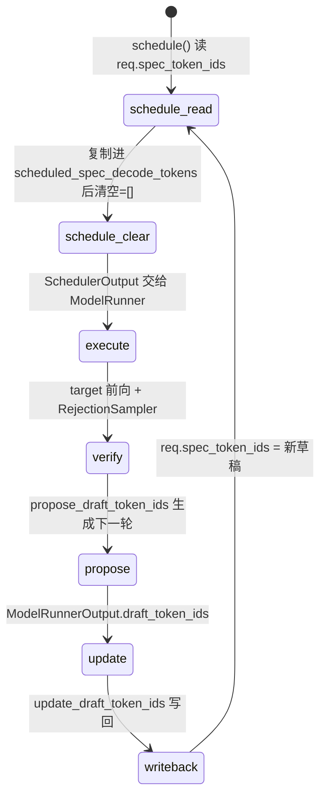
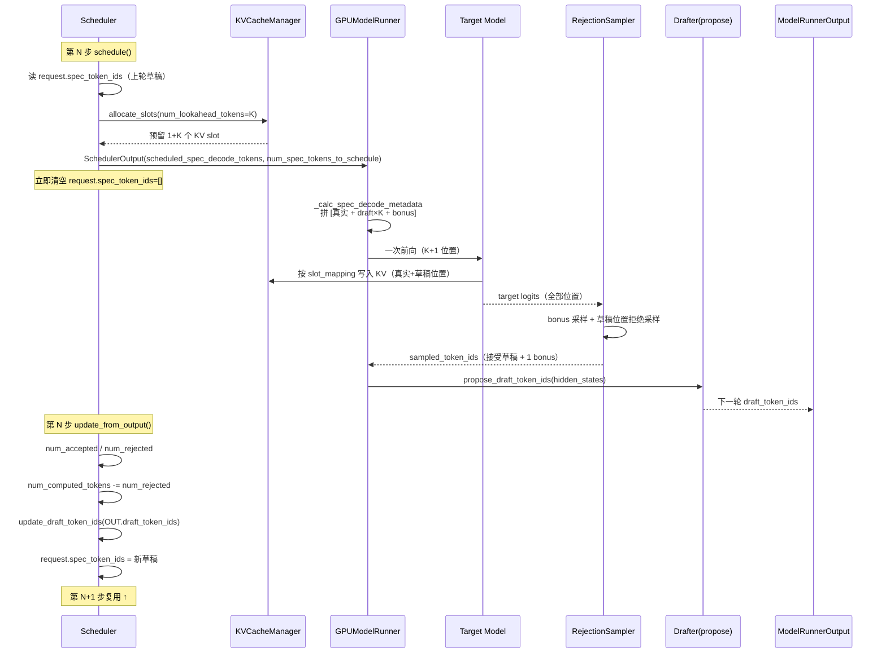

# vLLM v1 投机解码（Speculative Decoding）深度解剖（v0.25.1）

> 本文档聚焦一条主线：**调度分配多少 KV slot → 何时写入 KV cache → draft 如何生成 → 如何验证 → 如何闭环回灌**。
> 覆盖配置层、调度层、执行层、proposer 家族、rejection sampler，并给出端到端时序图。

## 目录
- [0. 前置知识：设计思想与核心概念](#0-前置知识设计思想与核心概念)
- [1. 全景架构概览](#1-全景架构概览)
- [2. Layer 1：配置层 SpeculativeConfig](#2-layer-1配置层-speculativeconfig)
- [3. Layer 2：调度层 —— slot 分配与草稿中转](#3-layer-2调度层--slot-分配与草稿中转)
- [4. Layer 3：执行层 —— 拼 input、target 前向、draft 生成、验证](#4-layer-3执行层--拼-inputtarget-前向draft-生成验证)
- [5. Layer 4：Proposer 家族](#5-layer-4proposer-家族)
- [6. Layer 5：RejectionSampler 验证数学](#6-layer-5rejectionsampler-验证数学)
- [7. Layer 6：回灌闭环 update_draft_token_ids](#7-layer-6回灌闭环-update_draft_token_ids)
- [8. 完整调用链时序图](#8-完整调用链时序图)
- [9. 关键数据结构速查表](#9-关键数据结构速查表)
- [10. FAQ：用户原始疑问逐条解答](#10-faq用户原始疑问逐条解答)

---

## 0. 前置知识：设计思想与核心概念

**问题**：自回归解码每生成一个 token 都要跑一次完整大模型前向，受限于显存带宽（memory-bound），GPU 算力大量闲置。投机解码的核心思想是：

> 用小/快的 **draft（提议）模型** 一次猜出 K 个 future token，把它们和已接受的 token 拼在一起，让 **target（大）模型一次前向同时验证这 K 个位置**。验证通过的就全部接受，省掉 K-1 次独立前向。

**无损保证（lossless）**：通过 **rejection sampling（拒绝采样）** 数学保证——最终输出分布与"不用投机、纯 target 逐 token 采样"完全一致。即使 draft 全错，target 也能靠 **bonus token**（自己额外采的 1 个兜底 token）继续推进，绝不比朴素解码慢（最多多一次前向）。

**两类 proposer**（来自官方文档对比）：

| 类别 | 方法 | 特点 |
|------|------|------|
| 基于模型 | EAGLE / EAGLE3 / MTP / Draft Model / PARD / MLP | 收益高，需额外权重 |
| 无模型 | N-gram / Suffix Decoding | 零额外负载，轻量，高峰期不增负担 |

**一个 step 内 token 构成**（K = num_speculative_tokens）：
- 每个 decode 请求在本步要算 `1（已接受/真实）+ K（草稿）` 个位置的 logits，共 `K+1` 个。
- 其中前 K 个位置验证 draft，最后 1 个位置是 **bonus**（target 自己采样，保证进度不卡）。

---

## 1. 全景架构概览

```mermaid
graph TD
    subgraph CFG["配置层"]
        SC[SpeculativeConfig<br/>num_speculative_tokens / method / draft_model_config]
    end
    subgraph SCH["调度层 Scheduler"]
        SCH1[schedule()<br/>① allocate_slots(num_lookahead_tokens)<br/>② 收集 req.spec_token_ids → scheduled_spec_decode_tokens<br/>③ 立即清空 req.spec_token_ids=[]]
        SCH2[update_from_output()<br/>④ 计算 num_accepted/num_rejected<br/>⑤ 回退 num_computed_tokens]
        SCH3[update_draft_token_ids()<br/>⑥ 把新草稿写回 req.spec_token_ids]
    end
    subgraph EXE["执行层 GPUModelRunner"]
        E1[_calc_spec_decode_metadata<br/>拼 logits_indices / target / bonus]
        E2[Target Model Forward<br/>一次性验证 K+1 位置, KV 在此写入]
        E3[RejectionSampler.forward<br/>接受/拒绝 + bonus]
        E4[propose_draft_token_ids<br/>调用 drafter.propose 生成下一轮草稿]
    end
    subgraph PROP["Proposer 家族 vllm/v1/spec_decode"]
        P1[EagleProposer]
        P2[DraftModelProposer]
        P3[NgramProposer / GPU]
        P4[MedusaProposer]
        P5[SuffixDecodingProposer]
    end

    SC --> SCH1
    SCH1 -->|SchedulerOutput| E1
    E1 --> E2 --> E3
    E3 --> E4
    E4 --> P1 & P2 & P3 & P4 & P5
    E3 -->|ModelRunnerOutput| SCH2
    SCH2 --> SCH3
    SCH3 -.->|下一轮 req.spec_token_ids| SCH1
```

**一句话职责**：
- 调度层只做两件事：① 多预留 `num_lookahead_tokens` 个 KV slot（给草稿占位）；② 把上一轮产出的草稿 `spec_token_ids` 原样中转给执行层，并清空自己这边的暂存。
- 执行层负责：拼出"真实 token + 草稿 token"的连续 input，一次前向，验证，再生成下一轮草稿。
- 闭环由 `update_draft_token_ids` 把新草稿写回 `Request.spec_token_ids`，下一轮 `schedule()` 再读出来。

---

## 2. Layer 1：配置层 SpeculativeConfig

**文件**：`vllm/config/speculative.py`，类 `SpeculativeConfig`（约 L79–1277）。

### 2.1 关键字段

| 字段 | 行号 | 说明 |
|------|------|------|
| `num_speculative_tokens: int` | L86 | 核心 K 值，每步最多投机几个 token |
| `method` | L92 | `eagle/eagle3/mtp/draft_model/ngram/ngram_gpu/medusa/suffix/custom_class/dspark/dflash` 等 |
| `draft_model_config: ModelConfig` | L181 | `__post_init__` 阶段构造（L627–964），ngram 直接复用 target 配置 |
| `num_speculative_tokens_per_batch_size` | L173 | 动态 SD：按 batch size 选不同 K |
| `draft_sample_method` | L278 | `greedy`（取 argmax）或 `probabilistic`（用完整 draft 分布做拒绝采样） |
| `rejection_sample_method` | L211 | `standard/synthetic/block` |

### 2.2 `num_lookahead_tokens` 的来源（调度器侧）

调度器在 `__init__` 里根据 method 设定 `self.num_lookahead_tokens`，**这就是"多分配几个 KV slot"的答案**：

```python
233:        self.num_spec_tokens = vllm_config.num_speculative_tokens
234:        self.num_lookahead_tokens = 0
...
243:        if speculative_config.use_eagle():
245:            self.num_lookahead_tokens = self.num_spec_tokens
246:        if speculative_config.uses_draft_model():
247:            self.num_lookahead_tokens = self.num_spec_tokens
248:        if speculative_config.use_dflash():
252:            self.num_lookahead_tokens = self.num_spec_tokens + 1   # 多 1 个(infill 风格)
253:        if speculative_config.use_dspark():
257:            self.num_lookahead_tokens = self.num_spec_tokens
```

> **要点**：普通 decode 每步只新增 1 个 token 的 KV；投机解码每步要为"已接受 token + K 个草稿"预留空间，所以需要 `num_lookahead_tokens` 个额外 slot。这些 slot 在 `schedule()` 时就预先分配好（见 Layer 2）。

---

## 3. Layer 2：调度层 —— slot 分配与草稿中转

**文件**：`vllm/v1/core/sched/scheduler.py`

### 3.1 ① 分配 KV slot（含 lookahead 占位）

在 decode 调度循环里，`allocate_slots` 传入 `num_lookahead_tokens`：

```python
567:        with record_function_or_nullcontext("schedule: allocate_slots"):
568:            while True:
569:                new_blocks = self.kv_cache_manager.allocate_slots(
570:                    request,
571:                    num_new_tokens,
572:                    num_lookahead_tokens=self.num_lookahead_tokens,   # ← 关键：多预留 K 个 slot
573:                )
```

- `num_new_tokens` = `request.num_tokens_with_spec + num_output_placeholders - num_computed_tokens`（L502）。
- 加上 `num_lookahead_tokens` 后，KV cache 管理器会为"草稿可能写入的位置"也预留 block。即便本轮草稿最终被拒绝，这些 slot 也已占好，避免运行时再分配。
- **写入 KV cache 的时机**：KV 不是在调度阶段写，而是在**执行层 target model 前向时**由 attention 按 `slot_mapping` 写入（见 Layer 3 的 E2）。调度只负责"预留物理 block"。

> **陷阱**：异步 KV 加载时（L929）会临时把 `effective_lookahead_tokens` 置 0，等 load 完再补分配，避免本地/远端 block 数错配。

### 3.2 ② 收集草稿并中转给执行层

```python
630:        # -- 投机解码: 提取本轮参预测的 spec token ids --
631:        # Speculative decode related.
632:        if request.spec_token_ids:
633:            num_scheduled_spec_tokens = (
634:                num_new_tokens + request.num_computed_tokens
635:                - request.num_tokens - request.num_output_placeholders
636:            )
639:            if num_scheduled_spec_tokens > 0:
640:                spec_token_ids = request.spec_token_ids
641:                if len(spec_token_ids) > num_scheduled_spec_tokens:
642:                    spec_token_ids = spec_token_ids[:num_scheduled_spec_tokens]
643:                scheduled_spec_decode_tokens[request.request_id] = spec_token_ids
644:
645:            # New spec tokens will be set in `update_draft_token_ids` before the
646:            # next step when applicable.
647:            request.spec_token_ids = []     # ← 立即清空！spec_token_ids 是一次性暂存
```

- `request.spec_token_ids` **不是历史累积**，是上一轮 `update_draft_token_ids` 写回的"待验证草稿"。
- 调度器把它复制到 `scheduled_spec_decode_tokens` 字典，放进 `SchedulerOutput` 交给 model runner。
- **读完后立刻清空**（L647），所以它是"一次性暂存桶"，不会无限膨胀。

### 3.3 放进 SchedulerOutput

```python
1159:        scheduler_output = SchedulerOutput(
...
1164:            scheduled_spec_decode_tokens=scheduled_spec_decode_tokens,
...
1175:            num_spec_tokens_to_schedule=num_spec_tokens_to_schedule,   # 动态 SD 的 K
1176:        )
```

---

## 4. Layer 3：执行层 —— 拼 input、target 前向、draft 生成、验证

**文件**：`vllm/v1/worker/gpu_model_runner.py`

### 4.1 拼 input：把草稿接在真实 token 后面

`_calc_spec_decode_metadata`（L2798）把每个请求的 token 序列排成 `[真实token..., draft1, draft2, ..., draftK, bonus]`。

```python
2798:    def _calc_spec_decode_metadata(
2799:        self, num_draft_tokens, cu_num_scheduled_tokens,
2800:    ) -> SpecDecodeMetadata:
...
2815:        num_sampled_tokens = num_draft_tokens + 1      # 每请求 K+1 个要算 logits 的位置
...
2824:        # logits_indices: target 要算所有 K+1 个位置的 logits
2824:        logits_indices = np.repeat(cu_num_scheduled_tokens - num_sampled_tokens, num_sampled_tokens)
...
2831:        bonus_logits_indices = cu_num_sampled_tokens - 1   # 每个请求最后一个位置 = bonus
2840:        target_logits_indices = np.repeat(cu_num_sampled_tokens - num_sampled_tokens, num_draft_tokens)
```

三种索引（以例子 `[draft=3, 0, 2, 0, 1]` 说明）：

| 索引 | 含义 | 例子 |
|------|------|------|
| `logits_indices` | target 前向要算 logits 的全部位置（真实+草稿+bonus） | `[0,1,2,3, 103..106, 206,207,208]` |
| `target_logits_indices` | 其中要被"验证"的草稿位置 | `[0,1,2, 5,6, 9]` |
| `bonus_logits_indices` | 每个请求最后 1 个位置，target 自己采样 | `[3,4, 7,8, 10]` |

> 关键：**target 模型一次前向就把 K+1 个位置的 logits 全算出来**，草稿的 KV 也在这一次前向里写入 KV cache（对应 L572 预留的 lookahead slot）。

### 4.2 验证 + 生成下一轮草稿（同一步内顺序）

执行顺序（在 `sample_tokens` / `_sample` 之后）：

1. **RejectionSampler.forward**（见 Layer 6）：用 target logits + draft probs + bonus 做拒绝采样，产出最终 `sampled_token_ids`（含被接受的草稿 + 1 个 bonus）。
2. **propose_draft_token_ids**（L4913）：用刚刚算出的 hidden states 调 `self.drafter.propose(...)` 生成**下一轮**的草稿，放进 `ModelRunnerOutput.draft_token_ids`。

```python
4913:    def propose_draft_token_ids(self, scheduler_output, sampled_token_ids,
4914:        sampling_metadata, hidden_states, sample_hidden_states,
4915:        aux_hidden_states, spec_decode_metadata, common_attn_metadata, slot_mappings):
...
4936:            draft_token_ids = self.drafter.propose(     # ngram
4937:                num_spec_tokens_to_schedule, sampled_token_ids,
4938:                self.input_batch.num_tokens_no_spec, self.input_batch.token_ids_cpu,
4939:                slot_mappings=slot_mappings)
...
5019:            draft_token_ids = self.drafter.propose(     # medusa
5020:                num_speculative_tokens=num_spec_tokens_to_schedule,
5021:                target_hidden_states=hidden_states, ...)
```

---

## 5. Layer 4：Proposer 家族

**目录**：`vllm/v1/spec_decode/`，统一接口 `propose(...)` → 返回 `list[list[int]]` 或 Tensor。

| Proposer | 文件 | 生成方式 |
|----------|------|----------|
| `EagleProposer` | `eagle.py` | 用 target 最后一层 hidden state + 上轮草稿 embedding，过轻量 eagle head 自回归出 K 个草稿 |
| `DraftModelProposer` | `draft_model.py` | 独立小模型，以当前序列为输入自回归出 K 个草稿 |
| `NgramProposer` / `NgramProposerGPU` | `ngram_proposer*.py` | 无模型：在已生成 token 里匹配 n-gram 后缀，预测重复模式 |
| `MedusaProposer` | `medusa.py` | 多头并行预测不同深度的 token（树状草稿） |
| `SuffixDecodingProposer` | `suffix_decoding.py` | 在 prompt/历史里找 suffix 匹配 |
| `Gemma4Proposer` / `Step3p5MTPProposer` / `DFlashProposer` | `gemma4.py` / `step3p5.py` / `dflash.py` | 各 MTP/变体的实现 |
| `ExtractHiddenStatesProposer` | `extract_hidden_states.py` | 仅抽取 hidden states 供外部 proposer |
| 自定义 | `custom_class_proposer.py` | `method="custom_class"`，用户自带 `propose` |

> 所有 proposer 的 `propose` 输出就是"下一轮要验证的草稿 token ids"，由 `propose_draft_token_ids` 收集，最终经 `ModelRunnerOutput.draft_token_ids` 回灌调度器（Layer 7）。

---

## 6. Layer 5：RejectionSampler 验证数学

**文件**：`vllm/v1/sample/rejection_sampler.py`

### 6.1 forward 流程（L88–197）

```python
121:        bonus_logits_indices = metadata.bonus_logits_indices
122:        target_logits_indices = metadata.target_logits_indices
...
129:        bonus_logits = logits[bonus_logits_indices]
130:        bonus_sampler_output = self.sampler(logits=bonus_logits, predict_bonus_token=True)
143:        bonus_token_ids = bonus_sampler_output.sampled_token_ids     # target 自己采的兜底
...
148:        raw_target_logits = logits[target_logits_indices]            # 草稿位置上的 target 分布
...
169:        output_token_ids = rejection_sample(
170:            metadata.draft_token_ids,        # draft 提议的 token
171:            metadata.num_draft_tokens,
173:            metadata.cu_num_draft_tokens,
174:            draft_probs,                     # draft 模型给出的概率（probabilistic 模式）
175:            target_logits,                   # target 在草稿位置的分布
176:            bonus_token_ids,                 # 兜底 token
177:            sampling_metadata, ...)
```

### 6.2 拒绝采样核心思想（无损保证）

对每个草稿位置 i，draft 提议 token `x`，draft 概率 `q(x)`，target 概率 `p(x)`：
- 以概率 `min(1, p(x)/q(x))` **接受** `x`；
- 否则**拒绝**，并从修正分布 `(p - q)+ / Z` 中重采样一个 token（保证整体仍服从 p 分布）。

一旦某个位置被拒绝，**后续所有草稿位置全部作废**（自回归依赖被破坏），由 bonus token 接上继续。因此每步至少推进 1 个 token（bonus），最多推进 K+1 个（全接受）。

> **为什么无损**：修正分布保证接受序列的边际分布严格等于 target 的 p。贪心模式下（draft_sample_method=greedy），退化为"draft 全对则全接受，否则从 target 贪心取"。

---

## 7. Layer 6：回灌闭环 update_draft_token_ids

**文件**：`vllm/v1/core/sched/scheduler.py`

### 7.1 update_from_output：统计接受/拒绝，回退 num_computed_tokens

```python
1654:        scheduled_spec_token_ids = scheduler_output.scheduled_spec_decode_tokens.get(req_id)
1659:        if (scheduled_spec_token_ids and (generated_token_ids or ...)
1660:            and request.async_tokens_to_discard == 0):
1664:            num_draft_tokens = len(scheduled_spec_token_ids)
1665:            num_sampled = self.num_sampled_tokens_per_step
1666:            num_accepted = max(len(generated_token_ids) - num_sampled, 0)
1667:            num_rejected = num_draft_tokens - num_accepted
1673:            if request.num_computed_tokens > 0:
1674:                request.num_computed_tokens -= num_rejected   # 被拒绝的草稿位置不计入"已算"
1677:            if request.num_output_placeholders > 0:
1678:                request.num_output_placeholders -= num_rejected
```

- `generated_token_ids` 来自 `ModelRunnerOutput`（已含接受草稿 + bonus）。
- 拒绝的草稿位置对应的 KV slot 在后续步会被覆盖/释放，这里先把 `num_computed_tokens` 回退，保证调度器账本正确。

### 7.2 update_draft_token_ids：写回下一轮草稿

```python
2020:    def update_draft_token_ids(self, draft_token_ids: DraftTokenIds) -> None:
2021:        for req_id, spec_token_ids in zip(draft_token_ids.req_ids, draft_token_ids.draft_token_ids):
2025:            request = self.requests.get(req_id)
2026:            if request is None or request.is_finished():
2027:                continue
2030:            if request.is_prefill_chunk:
2032:                request.spec_token_ids = []   # prefill chunk 不做投机
2033:                continue
2036:            # Add newly generated spec token ids to the request.
2040:            request.spec_token_ids = spec_token_ids    # ← 闭环：写回 Request
```

- `draft_token_ids` 来自 `ModelRunnerOutput.draft_token_ids`（即 Layer 4 里 `propose` 的产物）。
- 写回 `request.spec_token_ids`，**下一轮 `schedule()` 在 L632 又会把它读出来中转** —— 完成闭环。



---

## 8. 完整调用链时序图



---

## 9. 关键数据结构速查表

| 数据结构 | 关键字段 | 作用 |
|---------|---------|------|
| `SpeculativeConfig` | `num_speculative_tokens`, `method`, `draft_model_config` | 配置 K 值与 proposer 类型 |
| `Scheduler.num_lookahead_tokens` | int | 每步多预留的 KV slot 数 |
| `Request.spec_token_ids` | `list[int]` | 待验证草稿（一次性暂存，schedule 后清空） |
| `SchedulerOutput.scheduled_spec_decode_tokens` | `dict[req_id, list[int]]` | 中转给执行层的草稿 |
| `SpecDecodeMetadata` | `draft_token_ids`, `target_logits_indices`, `bonus_logits_indices`, `logits_indices` | 执行层拼 input / 验证的索引 |
| `RejectionSampler.forward` 入参 | `draft_probs`, `logits`, `bonus_token_ids` | 验证三要素 |
| `ModelRunnerOutput.draft_token_ids` | `DraftTokenIds` | 回灌下一轮草稿 |
| `num_sampled_tokens_per_step` | int | 普通模型=1；扩散模型=0（影响接受数计算） |

---

## 10. FAQ：用户原始疑问逐条解答

**Q1：调度阶段需要分配多少 KV slot？**
> 普通 decode 每步分配 1 个 token 的 slot；投机解码额外多分配 `num_lookahead_tokens`（=K，dflash 为 K+1）个 slot，给草稿占位。见 `scheduler.py:569-573` 传入 `num_lookahead_tokens=self.num_lookahead_tokens`。这些 slot 在 `schedule()` 阶段就由 KVCacheManager 预留好。

**Q2：什么时候写入 KV cache？**
> **不在调度阶段写**，而是在执行层 target model 一次前向时，由 attention 按 `slot_mapping` 把"真实 token + K 个草稿 token"的 KV 全部写入。调度只负责预留物理 block。

**Q3：执行完之后怎么让草稿模型进行生成？**
> target 前向完成后，`propose_draft_token_ids`（`gpu_model_runner.py:4913`）用本步的 hidden states 调 `self.drafter.propose(...)`。`drafter` 根据 method 分派（EagleProposer 用 hidden state 过 eagle head；DraftModelProposer 跑独立小模型；NgramProposer 做后缀匹配等），产出**下一轮**要验证的 K 个草稿。

**Q4：生成完怎么验证？**
> 由 `RejectionSampler.forward`（`rejection_sampler.py:88`）完成：对草稿位置用 target 分布 `p` 与 draft 分布 `q` 做拒绝采样（接受概率 `min(1,p/q)`，拒绝则从修正分布重采），保证无损；同时每个请求额外采 1 个 **bonus token** 兜底。一旦某位置拒绝，其后草稿全作废，由 bonus 接上。

**Q5：整条链路怎么串起来（闭环）？**
> 1. 调度读 `req.spec_token_ids` → 中转进 `scheduled_spec_decode_tokens` → 清空 `req.spec_token_ids`。
> 2. 执行层拼 `[真实 + draft + bonus]` 一次前向，写 KV，RejectionSampler 验证，产出 `sampled_token_ids` + 新 `draft_token_ids`。
> 3. `update_from_output` 统计接受/拒绝、回退 `num_computed_tokens`。
> 4. `update_draft_token_ids` 把新草稿写回 `req.spec_token_ids` → 回到步骤 1。
> 闭环的"暂存桶"就是 `Request.spec_token_ids`，它每轮被读一次、清空一次、再写回一次。

**Q6：spec_token_ids 是"上一次调度记录的历史 input"吗？**
> 不是。它是**上一轮验证后由 drafter 新生成的"待验证草稿"**，调度器只做中转（读→复制→清空），本身不生成也不累积。真正的 input 拼接发生在执行层 `_calc_spec_decode_metadata`，不是调度器直接当 input ids。
