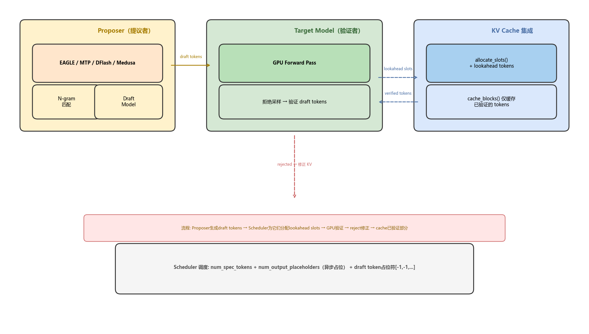
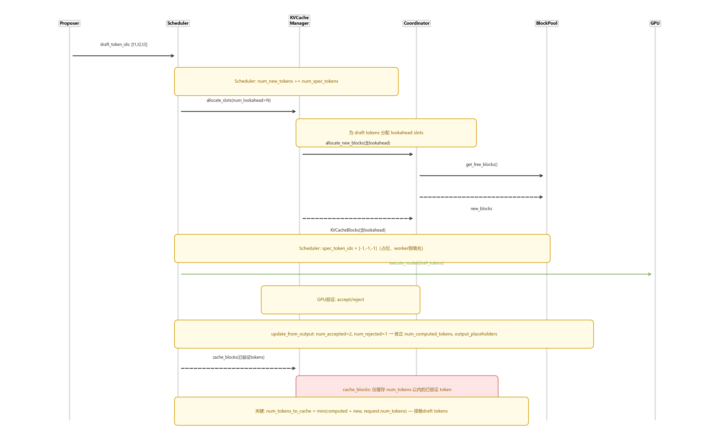
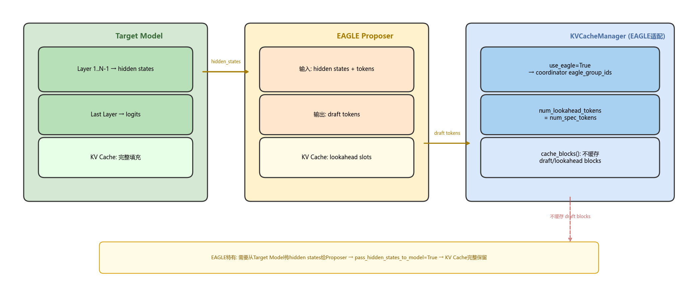

# vLLM 推测解码：如何通过改造 KV Cache Manager 集成

> 版本：vLLM V1 (2026-07)
> 核心文件：`vllm/v1/core/sched/async_scheduler.py`、`vllm/v1/core/kv_cache_manager.py`、`vllm/v1/spec_decode/`
> 前置阅读：[KV Cache Manager 骨干分析](./kv_cache_manager_backbone.md)

## 目录

- [0. 前置知识：推测解码的设计思想](#0-前置知识推测解码的设计思想)
- [1. 推测解码整体架构](#1-推测解码整体架构)
- [2. KV Cache 的三大改造点](#2-kv-cache-的三大改造点)
- [3. 推测解码的完整缓存流程](#3-推测解码的完整缓存流程)
- [4. EAGLE 的特殊集成](#4-eagle-的特殊集成)
- [5. 关键数据结构速查表](#5-关键数据结构速查表)
- [6. FAQ](#6-faq)

---

## 0. 前置知识：推测解码的设计思想

### 0.1 为什么需要推测解码？

LLM 的 decode 阶段是自回归的——每步只生成 1 个 token，GPU 计算单元利用率低。推测解码的核心思路：用一个**小模型（Proposer）先预测多个候选 token**，然后让**大模型（Target）一次性验证**——通过拒绝采样保证输出分布等价。

```
传统 Decode:  Token1 → Token2 → Token3 → Token4        (4 steps)
推测解码:     [T1,T2,T3] → 验证 → Token1,Token2,Token3    (1 step)
```

### 0.2 vLLM 支持的推测解码方案

| 方案 | 提议方式 | KV Cache 影响 |
|------|---------|--------------|
| **N-gram** | 历史 token 序列匹配 | 无额外 cache 需求 |
| **EAGLE / EAGLE3** | 利用 target model hidden states 外推 | 需要 `use_eagle=True` + hidden state 传递 |
| **MTP (Medusa-style)** | 基础模型上添加独立预测头 | 无额外 cache 需求 |
| **DFlash / DSpark** | 专用并行推测架构 | 需要 lookahead slots |
| **Draft Model** | 独立小模型 | 无额外 cache 需求 |

### 0.3 核心矛盾

推测解码需要 vLLM 在一次 forward pass 中处理**比正常 decode 更多的 token**（包括尚未验证的草稿 token），这意味着 KV Cache 需要为这些"不确定"的 token 分配 slot，但又**不能将它们写入前缀缓存**（因为可能被拒绝）。

---

## 1. 推测解码整体架构



### 1.1 Scheduler 侧的改造

推测解码对调度的改造主要体现在 `AsyncScheduler._update_after_schedule()`：

```python
# async_scheduler.py:19-44
def _update_after_schedule(self, scheduler_output):
    # 为下一轮推测解码准备占位符
    self._spec_token_placeholders = [-1] * scheduler_output.num_spec_tokens_to_schedule
    
    for req_id in scheduler_output.num_scheduled_tokens:
        request = self.requests[req_id]
        if request.is_prefill_chunk:
            continue
        
        # 关键: placeholder 机制也覆盖 spec tokens
        request.num_output_placeholders += (
            self.num_sampled_tokens_per_step + cur_num_spec_tokens
        )
        # draft token 用 -1 占位，实际值在 worker 侧填充
        request.spec_token_ids = self._spec_token_placeholders
```

### 1.2 SchedulerOutput 的扩展

```python
@dataclass
class SchedulerOutput:
    scheduled_spec_decode_tokens: dict[str, list[int]]  # req_id → draft token ids
    num_spec_tokens_to_schedule: int = 0                 # 下轮推测 token 数
    num_invalid_spec_tokens: dict[str, int] | None = None # 被拒绝的 spec token 数
```

---

## 2. KV Cache 的三大改造点

推测解码通过**三个关键改造**集成到 KVCacheManager：

### 改造 1：lookahead tokens（预留 slot）

```python
# scheduler.py — Scheduler.schedule()
num_new_tokens = (
    request.num_tokens_with_spec     # = len(prompt) + len(output) + len(spec_token_ids)
    + request.num_output_placeholders # 异步占位符（含 spec tokens）
    - request.num_computed_tokens
)
```

`num_tokens_with_spec` 包含了 spec token 的数量，因此在计算需要多少 block 时，把尚未验证的 draft tokens 也算进去了。

**在 allocate_slots 中**：

```python
# kv_cache_manager.py:254
num_lookahead_tokens: int = 0  # ← spec decode 专有参数
# ...
num_tokens_need_slot = min(
    num_tokens_main_model + num_lookahead_tokens,  # 额外请求 lookahead slot
    self.max_model_len,
)
```

### 改造 2：仅缓存已验证的 tokens

这是最关键的改造——**prefix cache 绝不允许混入未验证的 draft tokens**：

```python
# kv_cache_manager.py:453-464
# 关键代码：cache_blocks 中的 token 数量上限
num_tokens_to_cache = min(
    total_computed_tokens + num_new_tokens,
    request.num_tokens,  # ← 这里！
)
self.coordinator.cache_blocks(request, num_tokens_to_cache)
```

**为什么 `request.num_tokens` 是关键？**

```
request.num_tokens = len(prompt) + len(verified_output)  # 只包含已验证的
num_tokens_with_spec = len(prompt) + len(verified_output) + len(draft_tokens)  # 含推测
```

`cache_blocks()` 以 `request.num_tokens` 为上限——它会**自动排除**所有的 draft tokens。即使给 GPU 分配了 10 个新 block（含 lookahead），只有前 7 个（已验证）会被写入前缀缓存。

### 改造 3：EAGLE 的 use_eagle 标志

```python
# kv_cache_manager.py:139
self.use_eagle = use_eagle  # 传给 coordinator

# kv_cache_coordinator.py:100
self.eagle_group_ids: set[int] = {
    i for i, g in enumerate(kv_cache_config.kv_cache_groups)
    if isinstance(g.kv_cache_spec, FullAttentionSpec)
}
```

EAGLE 需要特别注意：它从 target model 的中间层提取 hidden states 作为 Proposer 的输入，要求 full attention 的 KV Cache 保持完整。

---

## 3. 推测解码的完整缓存流程



### Step-by-step：

```
Step 1: Proposer 生成 draft tokens
  → draft_token_ids = [t1, t2, t3]

Step 2: Scheduler 计算 num_new_tokens
  → num_new = num_tokens_with_spec + output_placeholders - num_computed
  → 包含了 draft tokens 的数量

Step 3: allocate_slots(num_lookahead=3)
  → 为 3 个 draft tokens 预留 lookahead slots
  → new_blocks 包含 lookahead 部分
  → spec_token_ids = [-1, -1, -1]  # 占位符

Step 4: GPU Forward Pass
  → 目标模型一次性验证所有 draft tokens
  → 拒绝采样算法判定 accept/reject

Step 5: update_from_output
  → 假设 accept=2, reject=1
  → num_output_placeholders -= 3  # 减去实际 token 数
  → num_computed_tokens 修正为只计算到 accept 位置

Step 6: cache_blocks(verified_tokens_only)
  → num_tokens_to_cache = min(computed + new, request.num_tokens)
  → 只有前 2 个被接受的 token 写入前缀缓存
  → 被拒绝的 token 对应的 block 不缓存！
```

### 拒绝后的缓存处理

```
假设：prompt 100 tokens → 已验证 3 个 output → draft [t4, t5, t6]
     全部接受 → accept t4, t5, t6 → bonus token t7

cache_blocks():
  num_tokens = 103  # 只有 prompt + verified
  num_new = 7       # 3 verified + 3 draft + 1 bonus
  num_tokens_to_cache = min(103 + 7, 103) = 103  # ← draft 被排除！
  → 缓存到 103 token，draft tokens 不被缓存
```

---

## 4. EAGLE 的特殊集成



### 4.1 EAGLE 为什么特殊

EAGLE 不同于 N-gram 或 Draft Model——它的 Proposer 需要**target model 的 hidden states**作为输入。这带来了三个额外要求：

| 需求 | 实现 |
|------|------|
| Hidden state 传递 | `pass_hidden_states_to_model=True` — GPUModelRunner 特殊处理 |
| KV Cache 完整性 | `use_eagle=True` → coordinator 识别 eagle_group_ids |
| 最后一层不去重 | EAGLE 需要第 N-1 层的 hidden states，不丢弃 |

### 4.2 eagle_group_ids 的作用

```python
# kv_cache_coordinator.py
self.eagle_group_ids = {i for i, g in enumerate(kv_cache_groups) 
                         if isinstance(g.kv_cache_spec, FullAttentionSpec)}
```

标记哪些 KV cache group 是 Full Attention——EAGLE 需要这些 group 保持完整缓存（不因为滑动窗口被截断）。

### 4.3 Spec token 在 worker 侧的填充

```
AsyncScheduler 下发:
  spec_token_ids = [-1, -1, -1]  # 占位符

Worker 侧执行前:
  spec_token_ids = draft_model.generate(hidden_states)  # [42, 137, 89]
  # 替换占位符为实际值
```

---

## 5. 关键数据结构速查表

| 数据结构 | 所在文件 | 关键字段 | 作用 |
|---------|---------|---------|------|
| `SchedulerOutput.scheduled_spec_decode_tokens` | `output.py:202` | `dict[str, list[int]]` | req_id → draft token ids |
| `SchedulerOutput.num_spec_tokens_to_schedule` | `output.py:250` | `int` | 下轮推测的 token 数 |
| `Request.spec_token_ids` | `request.py` | `list[int] \| None` | 当前步的 draft token ids（异步下为 [-1,...] 占位） |
| `Request.num_output_placeholders` | `request.py` | `int` | in-flight 中的未确认 token（含 spec tokens） |
| `AsyncScheduler._spec_token_placeholders` | `async_scheduler.py:16` | `list[int]` | 可复用的占位符列表 `[-1, -1, ...]` |
| `DraftTokenIds` | `outputs.py` | `req_id → list[int]` | worker 返回的草稿 token |
| `SpecDecodingStats` | `spec_decode/metrics.py` | `num_accepted`, `num_rejected` | 推测解码效果统计 |

---

## 6. FAQ

**Q1: draft tokens 被拒绝后，KV Cache 怎么处理？**

被拒绝的 token 对应的 block **不会被写入前缀缓存**（`cache_blocks` 只缓存到 `request.num_tokens`）。它们占用的物理 block 会在下次 `remove_skipped_blocks` 或 `free` 时回收。

**Q2: 为什么不给 draft tokens 也建缓存？**

因为 draft tokens 可能被拒绝——如果把它们也缓存了，后续请求可能错误复用这些不确定的 KV Cache，导致输出错误。拒绝采样保证等价性，但对缓存来说，"不确定 = 不安全"。

**Q3: lookahead tokens 和 num_new_tokens 的关系？**

```
num_new_tokens = 本次要计算的 token 数（含 draft）
num_lookahead_tokens = 额外预留的 slot（用于下轮 spec decode）
```

`allocate_slots` 会为 `num_new_tokens + num_lookahead_tokens` 分配 block，但只缓存 `min(computed + new, num_tokens)` 部分。

**Q4: EAGLE 和 N-gram 在 KV Cache 上有何不同？**

- N-gram：不需要 lookahead slots，不需要 hidden states
- EAGLE：需要 `use_eagle=True → eagle_group_ids` + `num_lookahead_tokens` + `pass_hidden_states_to_model`

**Q5: 异步调度 + 推测解码有什么额外复杂度？**

两者结合是 vLLM 最复杂的场景：
- 异步调度：Scheduler 领先 worker，状态基于假设
- 推测解码：worker 可能 accept/reject draft tokens，行为不确定
- 叠加：Scheduler 基于"假设的 accept/reject"做下一轮调度，如果实际情况不同，需要回退修正

---

*报告生成时间: 2026-07-13 | 工具: source-analyzer skill*
