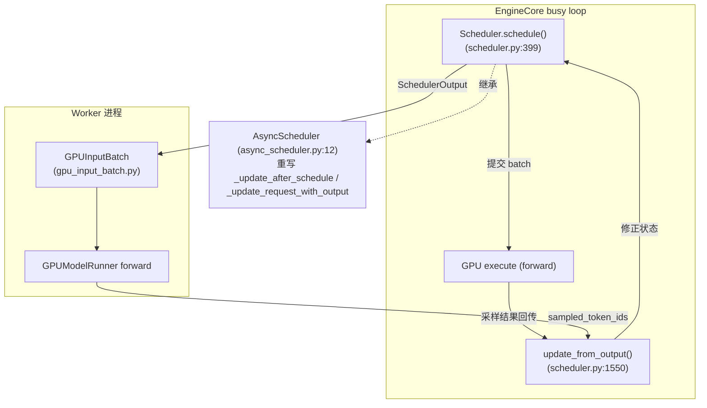
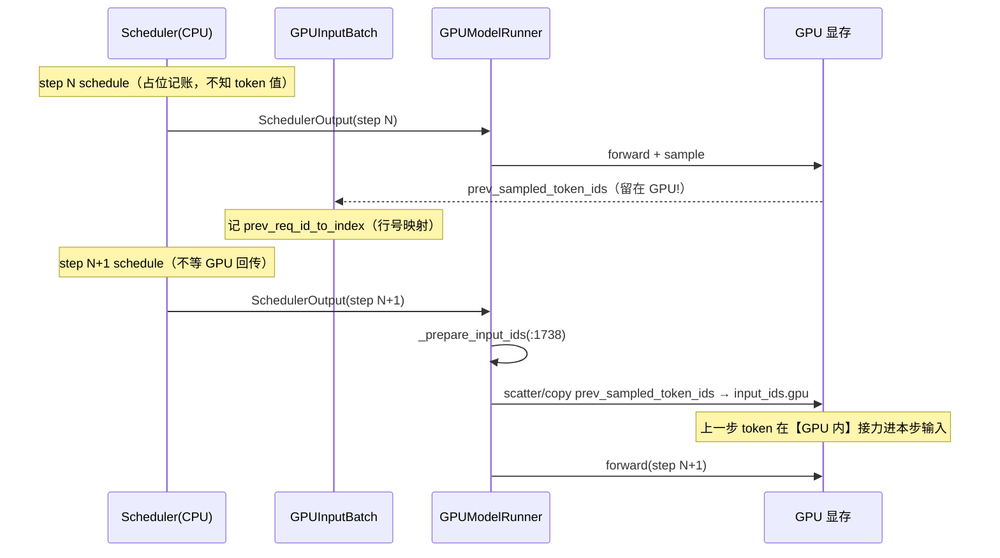
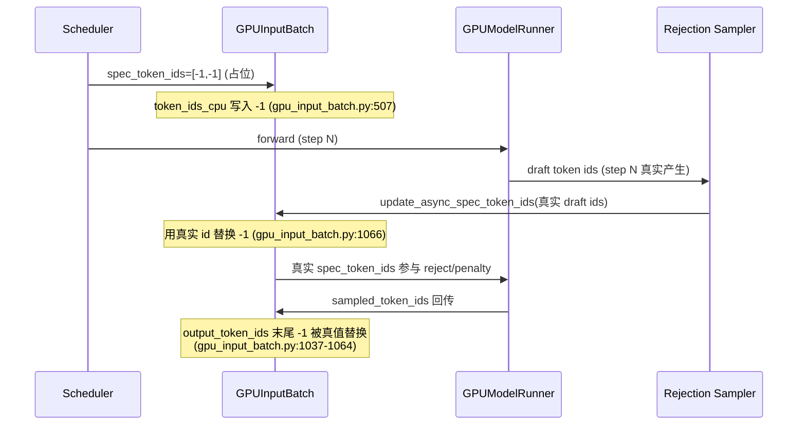
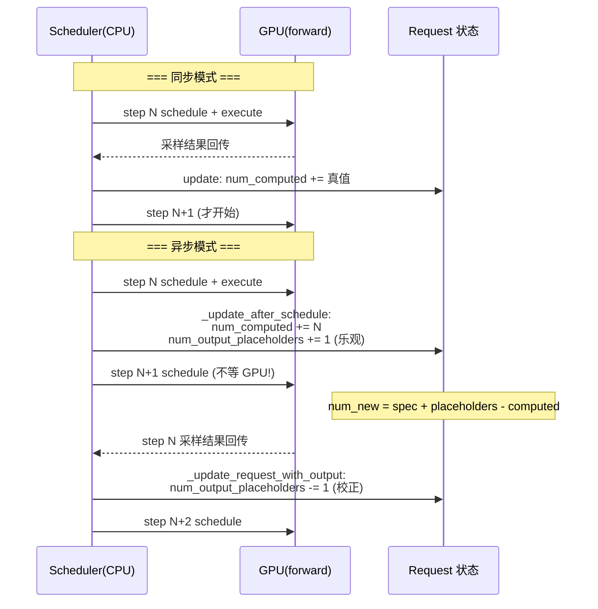

# vLLM 异步调度器（Async Scheduler）深度解剖

> 基于 `comments-on-v0.25.1` 分支源码（2026-07-17 快照）
> 调研范围：`vllm/v1/core/sched/{async_scheduler,scheduler,interface,output}.py`、`vllm/config/{scheduler,vllm}.py`、`vllm/v1/worker/gpu_input_batch.py`、`vllm/v1/request.py`
> 参考：vLLM Blog / 社区源码解析（知乎《Async Scheduler 实现原理》、官方 async_scheduler API 文档）

---

## 目录

- [0. 前置知识：为什么需要异步调度](#0-前置知识为什么需要异步调度)
- [1. 全景架构概览](#1-全景架构概览)
- [2. Layer 1：调度器接口与启用开关](#2-layer-1调度器接口与启用开关)
- [3. Layer 2：同步 Scheduler 的核心公式](#3-layer-2同步-scheduler-的核心公式)
- [4. Layer 3：AsyncScheduler 与 Placeholder Token（重点）](#4-layer-3asyncscheduler-与-placeholder-token重点)
- [4b. 执行层核心：上一步 token id 没回 CPU，decode 输入从哪来](#4b-执行层核心上一步-token-id-没回-cpudecode-输入从哪来)
- [4c. 提前调度但结果已终止（EOS / finished）怎么办](#4c-提前调度但结果已终止eos--finished-怎么办)
- [4d. CPU 如何 overlap「发新步」与「收旧步结果」](#4d-cpu-如何-overlap发新步与收旧步结果)
- [5. Worker 侧：-1 占位如何被填充](#5-worker-侧-1-占位如何被填充)
- [6. 完整调用链时序图](#6-完整调用链时序图)
- [7. 同步 vs 异步调度对比](#7-同步-vs-异步调度对比)
- [8. 关键数据结构速查表](#8-关键数据结构速查表)
- [9. 启用与配置](#9-启用与配置)
- [10. 源码文件索引](#10-源码文件索引)
- [11. 快速问题解答（FAQ）](#11-快速问题解答faq)

---

## 0. 前置知识：为什么需要异步调度

### 0.1 同步调度的瓶颈

vLLM 每个调度步（step）对应一次模型 forward。同步模式下，CPU 调度器和 GPU 是**严格串行**的：

```
step N:  schedule() → execute(GPU) → 等 GPU 算完 → update_from_output()
step N+1: schedule() → ...
```

GPU 在算 step N 时，CPU 调度器只能**干等**。GPU 算完、token 采样结果回传 CPU 后，才能开始 step N+1 的 `schedule()`。这段"CPU 空等 GPU"的间隙降低了 GPU 利用率。

### 0.2 异步调度的核心思想：重叠批次（Overlapping Batches）

异步调度让 CPU **不等 GPU 算完就提前调度下一步**。即：step N 的 forward 还在 GPU 上跑，CPU 已经算出了 step N+1 的调度决策并下发了。这样 CPU 调度和 GPU 计算在时间上重叠，隐藏了调度延迟。

**代价**：调度 step N+1 时，step N 的采样结果还没回来，调度器**不知道 step N 到底生成了几个 token**。于是它必须"猜"——这就是 **placeholder（占位）** 机制的由来。

### 0.3 一句话理解 Placeholder Token

> **Placeholder = 调度器在"真实结果还没回来"时，为即将产生的 token 提前占好的"位置 + KV 槽位"。**

它解决的根本矛盾是：**调度决策（需要知道序列里有哪些 token、占哪些位置）必须发生在 GPU 结果回来之前**。既然结果未知，就先占个位、等结果回来再填真值/再校正计数。

> ⚠️ **重要澄清（旧报告没讲清的点）**：代码里 "placeholder" 其实指**两件事**，不要混：
> - **(A) 计数型占位** `num_output_placeholders`：一个整数，表示"我已乐观预留、但还没拿到真实 token 的 output 槽位数"。纯调度记账用。
> - **(B) 字面型占位** `spec_token_ids = [-1, -1, ...]` 和 `output_token_ids` 里的 `-1`：token 的**真实 id 还没算出来**（尤其投机解码的 draft token），先用 `-1` 字面量顶着，worker 在 forward 前/采样后替换成真值。
>
> 两者都叫 placeholder，但 (A) 是"数量未知"的占位，(B) 是"值未知"的占位。下文会分别拆开讲。

### 0.4 演进

- vLLM V0：显式区分 prefill/decode，两套调度逻辑。
- vLLM V1：用 `num_tokens - num_computed_tokens` 统一公式，不再区分阶段。
- Async Scheduling：在 V1 基础上进一步让调度与 GPU 执行重叠，配合 V2 model runner + pipeline parallel 的 microbatching（一次 decode 跨 `pp_size` 步），把 GPU 利用率推满。

---

## 1. 全景架构概览

**图1：异步调度在引擎中的位置**



**关键点**：异步模式下，`schedule()` 提交 batch 后**不等待** `update_from_output()`，立刻又 `schedule()` 下一个 batch。允许多个 batch 同时在途（in-flight），由 `max_concurrent_batches > 1` 控制。

---

## 2. Layer 1：调度器接口与启用开关

### 2.1 统一契约 `SchedulerInterface`（`interface.py:36`）

`Scheduler` 和 `AsyncScheduler` 都实现此接口，方法包括 `schedule()`、`update_from_output()`、`add_request()`、`finish_requests()`。

### 2.2 启用开关

`SchedulerConfig.async_scheduling`（`config/scheduler.py:158`，默认 `None` = 自动）：

```python
# config/scheduler.py:180
def get_scheduler_cls(self):
    if self.scheduler_cls is None:
        if self.async_scheduling:
            from ...async_scheduler import AsyncScheduler
            return AsyncScheduler          # 异步
        from ...scheduler import Scheduler
        return Scheduler                  # 同步
```

`async_scheduling` 为 `None` 时由 `VllmConfig` 自动决定（`config/vllm.py:992-1040`）：若 executor 支持（V2 runner 等）则置 `True`，否则 `False`。`max_concurrent_batches` 在 `async_scheduling=True` 时自动 > 1（`config/vllm.py:492-496`），这是异步能重叠的前提。

---

## 3. Layer 2：同步 Scheduler 的核心公式

**图2：计算本步要调度的 token 数**

```mermaid
flowchart TD
    A["遍历 running 请求"] --> B["num_new = num_tokens_with_spec<br/>- num_computed_tokens"]
    B --> C{"num_new > 0 ?"}
    C -->|是| D["allocate_slots 分配 KV block"]
    C -->|否| E["跳过（已算完）"]
    D --> F["_update_after_schedule:<br/>num_computed_tokens += num_scheduled"]
```



同步模式下（`scheduler.py:502` 的简化版，无 placeholder）：

```
num_new = num_tokens_with_spec - num_computed_tokens
```

- **decode 请求**：`num_computed_tokens` 已等于"已算的 output 数"，差值为 1 → 每步算 1 个新 token。
- **prefill 请求**：差值 = 剩余 prompt token 数 → 可能很大，被 `long_prefill_token_threshold` / `token_budget` 截断成 chunked prefill。

调度后 `_update_after_schedule`（`scheduler.py:1231`）把 `num_computed_tokens += num_scheduled_token`——因为同步模式下，**调度时 GPU 结果必然会在 update 前算完**，所以"已调度"就等于"将已计算"，可以放心前进。

---

## 4. Layer 3：AsyncScheduler 与 Placeholder Token（重点）

`AsyncScheduler`（`async_scheduler.py:12`）只重写 **3 个方法**，其余 128KB 调度逻辑全复用父类。它要解决的唯一问题：**调度时 GPU 结果未回来，不能像同步那样直接前进 `num_computed_tokens`**。

### 4.1 计数型占位 (A)：`num_output_placeholders`

`_update_after_schedule`（`async_scheduler.py:19`）在父类前进 `num_computed_tokens` 之后，**再乐观地多预留一批 output token**：

```python
# async_scheduler.py:38-41
cur_num_spec_tokens = len(spec_decode_tokens.get(req_id, ()))
request.num_output_placeholders += (
    self.num_sampled_tokens_per_step + cur_num_spec_tokens
)
```

含义：**"我假设这一步会新产生 `num_sampled_tokens_per_step`（decode 通常是 1）+ spec draft token 数 个 output token，先记下来，等真结果回来再扣。"**

于是异步模式计算本步 token 数时（`scheduler.py:502-506`）公式变成：

```
num_new = num_tokens_with_spec + num_output_placeholders - num_computed_tokens
                                    ^^^^^^^^^^^^^^^^^^^^^^^^
                                    加上"乐观预留"的 token
```

**为什么加它？** 因为异步下 `num_computed_tokens` 已经"超前"包含了还没确认的 token（父类无条件前进了）。`num_output_placeholders` 正好抵消这部分超前，让 `num_new` 算出来的"本步真正要新算几个"依然正确。

**校正 (A)**：当真实采样结果回来，`_update_request_with_output`（`async_scheduler.py:51`）扣减：

```python
# async_scheduler.py:67-68
request.num_output_placeholders -= len(new_token_ids)
assert request.num_output_placeholders >= 0
```

> 用具体数字走一遍（decode，每步 1 token，无 spec）：
> - step N 调度后：`num_computed_tokens` 前进到 10（`_update_after_schedule` 乐观前进，scheduler.py:1244），`num_output_placeholders` = 1（async 乐观预留，async_scheduler.py:39-41），`num_tokens_with_spec` = 10（step N-1 的输出已回传，已 append 到 `_all_token_ids`）。
> - step N+1 调度时（GPU 还没回传）：`_all_token_ids` 尚未 append step N 采出的 token（输出没回 CPU），所以 `num_tokens_with_spec` 仍是 **10**（不是 11）。`num_new = num_tokens_with_spec(=10) + placeholders(=1) - computed(=10) = 1`。
>   - **这 1 个 token 就是 step N 那个"未确认"token 的 KV 位置**（position 10）。它的 id 不在 `_all_token_ids` 里，而在 GPU 显存的 `prev_sampled_token_ids` 中——worker 做 embedding 时直接读 GPU 上的 prev_sampled_token_ids，不绕道 CPU（见 §4b）。
>   - 没有 placeholder 的话 `10 - 10 = 0`，调度器会以为"没事可干"；**+1 的 placeholder 把 `num_new` 从 0 顶到 1，逼调度器排那 1 个未确认位置**。"下一个新 token"要等这一步 forward 之后才产生，此刻根本还排不了。
> - step N 的 GPU 结果回来：`_update_request_with_output`（async_scheduler.py:62-67）把真 token append 进 `_all_token_ids`，并 `num_output_placeholders -= 1` 扣回 0；此时 `num_tokens_with_spec` 才涨到 11。

### 4.1b step N 的 GPU 结果在哪里处理（与 `schedule()` 完全解耦）

异步调度的核心就是：**GPU 结果的处理（`update_from_output`）和下一步的 `schedule()` 是两条独立路径，谁先谁后不确定。** 上一步的 token 可能要等好几步之后才回传 CPU。

**调用入口**（`vllm/v1/engine/core.py`，两个路径都走 `scheduler.update_from_output`）：

```python
# core.py:504  —— 普通 step()
engine_core_outputs = self.scheduler.update_from_output(scheduler_output, model_output)
# core.py:605  —— step_with_batch_queue()
engine_core_outputs = self.scheduler.update_from_output(scheduler_output, model_output)
```

其中 `model_output` 来自 `future.result()`（GPU 计算完成的 future）或 `sample_tokens()` 的采样结果——即 step N 的 GPU 输出。

**`Scheduler.update_from_output` 内部**（`scheduler.py:1566`）：遍历 `scheduler_output.num_scheduled_tokens`，对每个请求最终调用 `_update_request_with_output`（`scheduler.py:1697`）。**这一步才是 `_all_token_ids` 真正增长、让 `num_tokens_with_spec` 从 10 涨到 11 的地方**：

```python
# scheduler.py:1697
new_token_ids, stopped = self._update_request_with_output(request, new_token_ids)
```

**`AsyncScheduler._update_request_with_output` 的重写**（`async_scheduler.py:51-75`）做三件事，正好闭环 §4.1 的占位逻辑：

```python
def _update_request_with_output(self, request, new_token_ids):
    if request.async_tokens_to_discard > 0:        # 丢弃被抢占的陈旧帧
        request.async_tokens_to_discard -= 1
        return [], False
    # ① 父类：append_output_token_ids → _all_token_ids 增长
    #    → num_tokens_with_spec 从 10 涨到 11
    new_token_ids, stopped = super()._update_request_with_output(request, new_token_ids)
    # ② 扣回占位：num_output_placeholders -= 1（从 1 回到 0）
    request.num_output_placeholders -= len(new_token_ids)
    # ③ 把新 token 的 KV 正式写进前缀缓存
    if status_before_update == RequestStatus.RUNNING:
        self.kv_cache_manager.cache_blocks(
            request, request.num_computed_tokens - request.num_output_placeholders
        )
```

**关键时序：为什么 step N+1 调度时 `_all_token_ids` 还是 10**

```
step N:   schedule()  ──┐  (乐观前进 num_computed_tokens=10, 加 placeholder=1)
                        │  GPU 异步执行（future 挂起，不阻塞）
step N+1: schedule()  ──┘  (此时 update_from_output 还没跑 → _all_token_ids 仍是 10)
            ...
GPU 完成 → update_from_output() 才跑 → append token, num_tokens_with_spec 涨到 11
```

`schedule()` 完全可能在 `update_from_output()` 之前又被调用多次（尤其 multi-step / PP 微批场景），所以 step N+1 调度瞬间 `_all_token_ids` 仍停在 step N-1 的输出（=10），未确认 token 的 id 只在 GPU 显存 `prev_sampled_token_ids` 里——这正是 §4.1 推演里 `num_tokens_with_spec=10`（而非 11）的根本原因。

### 4.2 字面型占位 (B)：`spec_token_ids = [-1, -1, ...]`

```python
# async_scheduler.py:16, 23-25, 44
self._spec_token_placeholders = [-1] * self.num_spec_tokens   # 复用只读占位列表
...
self._spec_token_placeholders = [-1] * scheduler_output.num_spec_tokens_to_schedule
...
request.spec_token_ids = self._spec_token_placeholders   # 挂到 request 上
```

含义：**投机解码（spec decoding）下，调度 step N+1 时 draft token 的"真实 id"根本还没产生**（要等 step N 的模型 forward 才 draft 出来）。所以先用 `-1` 占着位置，worker 在 forward 前用真实 draft id 替换（`update_async_spec_token_ids`，见 §5）。

注意 `gpu_input_batch.py:503` 的注释也印证：`spec_token_ids are placeholders and will be overwritten in ...`。

### 4.3 PP Microbatching 步距（`async_scheduler.py:46-49`）

```python
if self.use_v2_model_runner:
    request.next_decode_eligible_step = self.current_step + self.pp_size
```

V2 runner + pipeline parallel 下，同一请求的两次 decode 必须间隔 `pp_size` 步（匹配 worker 侧 sampled-token 广播槽位的环形节奏）。`schedule()` 里 `scheduler.py:487` 会跳过"还没到 eligible step"的请求。

### 4.4 异步帧丢弃（`async_scheduler.py:54-59`）

`reset_prefix_cache` 强制抢占时，可能有 in-flight 的陈旧异步输出帧。`async_tokens_to_discard` 计数器（`scheduler.py:2290` 在抢占时设为 `num_output_placeholders`）逐帧 drain，每收到一帧输出就丢一帧，直到归零才恢复正常处理。

---

## 4b. 执行层核心：上一步 token id 没回 CPU，decode 输入从哪来

> §4 讲的是 **CPU 调度器如何记账**（占位）。但真正让人困惑的是执行层：decode 是自回归的，step N+1 的输入必须是 step N 采样出的 token——**token id 都还没回来，GPU 怎么算？**

### 4b.1 关键澄清：token 值从没缺席，只是没绕道 CPU

"上一步 token id 没生成" 是**误解**。准确说法是：**采样结果没有回传到 CPU 调度器**。token 值本身在 step N 的 GPU forward + 采样后就存在了，而且**一直留在 GPU 显存里**（`prev_sampled_token_ids`），vLLM **不做 D2H（GPU→CPU）拷贝再传回**。

异步调度把两件事**解耦**：

| 职责 | 谁做 | 需要 token 真值？ |
| --- | --- | --- |
| **调度决策**（几个 token、占哪些 position、分哪些 KV block） | CPU 调度器 | ❌ 用 placeholder 记账即可（§4） |
| **数据衔接**（上一步 token 喂给这一步 forward） | GPU / worker | ✅ 需要，但值就在 GPU 上，原地拷 |

### 4b.2 数据流（带行号）

> **先回答你的两个疑问：**
>
> **② step N+1 的 `input_batch` 怎么会有上一步的 `prev_sampled_token_ids`？**
> 因为 `self.input_batch` 是 `GPUModelRunner` 的**持久成员对象（Persistent Batch）**：在 runner `__init__` 时创建**一次**，之后每个 step 只**增量更新它的槽位**（增删请求、改字段），**从不重建实例**。所以"上一步的 batch"和"这一步的 batch"是**同一个 Python 对象**——不存在"上一步的 input_batch 传给这一步"，它压根没换过。
> 因此 step N 末尾 `self.input_batch.prev_sampled_token_ids = <GPU张量>` 挂上去后，step N+1 读到的就是同一个字段（带 `prev_` 前缀是站在"下一步"视角的命名：对 step N 是"刚采的"，对 step N+1 就是"上一步的"）。
>
> **① 采样结果不是放在自己 batch 上吗？**
> 对，就是放在**自己这个持久 batch** 上——`self.input_batch.prev_sampled_token_ids = sampled_token_ids`（`gpu_model_runner.py:3712`）。它**不做 D2H 拷贝**，GPU 张量原地留着，只是把引用记在 batch 的字段里。名字里的 `prev_` 是给下一步看的，对当前步它就是"刚采的 token"。

**① step N 采样后：token 留 GPU，存为 `prev_sampled_token_ids`**

```python
# gpu_model_runner.py:3710-3713（普通异步路径）
if self.input_batch.prev_sampled_token_ids is None:
    assert sampled_token_ids.shape[-1] == 1
    self.input_batch.prev_sampled_token_ids = sampled_token_ids   # GPU 张量，不下 CPU
self.input_batch.prev_req_id_to_index = { req_id: i for ... }     # 上一步 batch 各请求行号
```
（PP 场景在 `:4772` 广播后赋值；spec decode 在 `:4870` 赋值。）

**② step N+1 准备输入：`_prepare_input_ids`（gpu_model_runner.py:1738）——核心**

```python
# :1755
if self.input_batch.prev_sampled_token_ids is None:
    self.input_ids.copy_to_gpu(...)   # 同步/首步：从 CPU 拷
    return
# 否则是异步 decode：这些请求在 input_ids_cpu 里【没有真值】，
# 需要在 GPU 上从 prev_sampled_token_ids 拷进 input_ids
```

两条拷贝路径：

```python
# 快路径（:1827）：batch 未变、无重排 —— 一次 slice 拷贝
self.input_ids.gpu[:num_common_tokens].copy_(
    self.input_batch.prev_sampled_token_ids[:num_common_tokens, 0], non_blocking=True)

# 一般路径（:1839）：batch 有增删/重排 —— 按 prev_positions 映射 scatter
self.input_ids.gpu.scatter_(
    dim=0, index=sampled_tokens_index_tensor,
    src=self.input_batch.prev_sampled_token_ids[prev_common_req_indices_tensor, 0])
```

**③ `prev_positions` 映射（`_compute_prev_positions` :1726）**：把"本步 batch 第 i 行"映射到"上一步 batch 行号"，`-1` = 新请求（新请求有正常 prompt 输入，不走这套）。解决两步之间 batch 顺序变化（请求结束/加入）的对齐问题。

### 4b.3 时序图



### 4b.4 一句话总结

> **CPU 用占位"排班"，GPU 用 `prev_sampled_token_ids → input_ids` 的显存内拷贝"接力"真实 token。** 自回归的数据依赖由 worker 的 `_prepare_input_ids` 在 GPU 上保证，CPU 调度器全程没碰过 token 的值。附带好处：省掉 sampled token 的 D2H+H2D 往返，token 在 GPU 上原地衔接，这也是异步调度更快的原因之一。

---

## 4c. 提前调度但结果已终止（EOS / finished）怎么办

> 异步下确实会发生：step N 提前调度了 step N+1，但 step N 的 GPU 结果回来发现是 EOS / 请求已 finished。这一节讲正确性兜底——**结果不会污染输出，有两道保险，GPU 可能多算一帧但被丢弃**。

### 4c.1 防护 1（调度器侧，主保险）：`update_from_output` 跳过已 finished 请求

```python
# scheduler.py:1634-1643
request = self.requests.get(req_id)
if request is None or request.is_finished():
    # The request is already finished. This can happen if the
    # request is aborted while the model is executing it (e.g.,
    # in pipeline parallelism or in async scheduling).
    continue   # step N+1 的采样结果直接被忽略，不追加到 output
```

时序（step N 的 output 回来时）：
1. step N 采样出 EOS → `_update_request_with_output` 把请求标 `FINISHED`，加入 `finished_req_ids`。
2. 下一个 `schedule()` 该请求已不在 running 队列，**不会再被调度**。
3. 但 step N+1 的 forward **已在 GPU 上跑完**（当时提前排了班）。等它的 output 回来，`update_from_output` 发现 `request.is_finished()` → 直接 `continue`，那帧采样结果**被丢弃**。

> 代价：GPU 确实"白算"了一帧（step N+1 的 forward），但结果不进序列、不回客户端。这是异步调度极低概率的代价，换来整体更低的调度延迟。

### 4c.2 防护 2（worker 侧，防 token 串味）：`discard_request_mask`

即使 step N+1 被提前排进 batch 并 forward，worker 在采样后会**主动把"不该采样"请求的 token 清零**：

```python
# gpu_model_runner.py:2054-2059（_prepare_inputs 阶段，forward 之前就标记）
self.discard_request_mask.np[:num_reqs] = (
    self.optimistic_seq_lens_cpu[:num_reqs].numpy() < num_tokens_np
)
```

语义：`optimistic_seq_lens`（调度时乐观假设会接受那么多 token）< 请求真实长度 → 说明该请求其实该停了，标记 `discard`。采样后：

```python
# 投机路径 prepare_next_token_ids_padded (llm_base_proposer.py:1064-1071)
# 被标记的请求不取 sampled token，改用 backup token（= 它最后一个已知 token）
self.backup_next_token_ids.np[i] = requests[...].get_token_id(
    gpu_input_batch.num_tokens_no_spec[i] - 1)
```

同时 `prev_req_id_to_index` 的构建（`gpu_model_runner.py:4776`）会**跳过被 discard 的请求**，彻底切断"被丢弃 token → 下一步 `prev_sampled_token_ids`"的传播链。

### 4c.3 一句话总结

> **EOS 这类"提前调度但应终止"不会出错**：调度器用 `is_finished()` 在 `update_from_output` 里丢掉多余帧；worker 用 `discard_request_mask` 把该停请求的采样结果清零、并切断它到下一步 `prev_sampled_token_ids` 的传播。GPU 可能多算一帧，但结果不进序列、不串 token，正确性由这两层保证。

---

## 4d. CPU 如何 overlap「发新步」与「收旧步结果」

> 异步调度的引擎循环核心：CPU 既要 `schedule` 新步，又要 `update_from_output` 处理上一步结果。这两件事如何 overlap？答案是 **batch queue（批队列）流水线**，而非同一次 step 内串行。

### 4d.1 同步 vs 异步的 step 形态

同步 `step()`（`core.py:479`）严格串行：

```python
scheduler_output = self.scheduler.schedule(...)            # 发
future = self.model_executor.execute_model(..., non_block=True)
model_output = ...                                          # 隐含等回
engine_core_outputs = self.scheduler.update_from_output(...)# 收
```

异步走 `step_with_batch_queue`（`core.py:519`），其注释明确三步：

```
1. 先尝试 schedule 一个新 batch，直接返回（不阻塞等结果）
2. 仅当队列满 / 没新请求可排，才阻塞等最早的 batch 完成
3. 拿到结果后才 update_from_output
```

### 4d.2 关键结构：`batch_queue`（FIFO 双端队列）

每 `schedule` 一个新步，`execute_model(non_block=True)` 返回一个 **Future**（`uniproc_executor.py:26` `AsyncOutputFuture`），连同 `scheduler_output` 一起 `appendleft` 入队：

```python
# core.py:547-581
scheduler_output = self.scheduler.schedule(...)
exec_future = self.model_executor.execute_model(scheduler_output, non_block=True)  # 不阻塞!
...
batch_queue.appendleft((future, scheduler_output, exec_future))
if len(batch_queue) < self.batch_queue_size and has_requests:
    return None, model_executed   # ← 不阻塞，立刻回来再排下一个新步
```

只有队列满（`batch_queue_size`）或没新请求时，才 `batch_queue.pop()` 取**最早**的 Future，`future.result()` 阻塞等 GPU 结果，再 `update_from_output`（`core.py:590-607`）。

### 4d.3 流水线时序

```
时间 →
GPU:    [step N 算]   [step N+1 算]   [step N+2 算]   ...
CPU圈1: schedule N+1 ── 入队,return(不阻塞)
CPU圈2: schedule N+2 ── 入队,return
CPU圈3: 队列满 → pop N 的 future.result() → update_from_output(N)
CPU圈4: schedule N+3 ── 入队 ...
```

"处理上一步结果"（`update_from_output`）与"调度新一步"（`schedule`）**不在同一次 step 调用里串行**，而是被队列错开到不同圈次。GPU 跑 N+1/N+2 时，CPU 正把 N 的结果收回来记账——这就是 overlap。

### 4d.4 两个细节

- **`max_concurrent_batches == batch_queue_size`**：队列容量 = 同时在途 batch 数上限。未满时一直只发不收，满了才被迫阻塞收一个再发。
- **structured output / draft token 例外**（`core.py:568` `deferred_scheduler_output`）：需等上一步结果才能采样时，当前 `scheduler_output` 暂存为 deferred，等收回上一步结果后再采样——这是 overlap 中少数"必须串行"的情况（采样依赖上一步 token 值）。

### 4d.5 一句话总结

> **overlap 不是"同一时刻 CPU 又发又收"，而是用 batch queue 把"发新步"和"收旧步结果"拆成流水线上的不同圈次**：CPU 发的时候不等（Future 入队即返回），GPU 后台跑；队列满了 CPU 才转去收最早的那个，收完再发。CPU 调度开销与 GPU 计算始终重叠。

---

## 5. Worker 侧：-1 占位如何被填充

**图3：字面占位 -1 的替换流程**



### 5.1 draft token 的 -1 替换

`update_async_spec_token_ids`（`gpu_input_batch.py:1066`）在 rejection sampler 用 draft token 做 penalty/bad_words 计算前，把 `spec_token_ids` 里的 `-1` 换成上一步真实产生的 draft id。

### 5.2 output token 的 -1 替换

`_update_output_token_ids`（`gpu_input_batch.py:1037-1064`）：若 `output_token_ids` 末尾是 `-1`（说明是异步乐观占位），用 `sampled_token_ids` 的真值从第一个 `-1` 起覆盖：

```python
# gpu_input_batch.py:1054-1063
first_placeholder = len(req_output_token_ids)
while first_placeholder > 0 and req_output_token_ids[first_placeholder-1] == -1:
    first_placeholder -= 1
num_placeholders = len(req_output_token_ids) - first_placeholder
num_to_replace = min(num_sampled_ids, num_placeholders)
req_output_token_ids[first_placeholder:] = new_ids   # 真值覆盖 -1
```

> 这里还处理了"占位数量可能比实际采样多（乐观）或少（kv-load 失败丢弃）"的情况：`min(num_sampled_ids, num_placeholders)` 取较小值，避免越界。

---

## 6. 完整调用链时序图

**图4：同步 vs 异步一步对比（含 placeholder 流转）**



---

## 7. 同步 vs 异步调度对比

| 维度 | 同步 (Scheduler) | 异步 (AsyncScheduler) |
| --- | --- | --- |
| 执行流水线 | step N 完成 → 更新 → 调度 N+1 | step N 下发后立即调度 N+1 |
| GPU 利用率 | step 间有 CPU 空等间隙 | 调度与执行重叠，利用率更高 |
| 状态准确性 | `num_computed_tokens` 始终准确 | 含乐观占位，暂时超前 |
| 核心额外字段 | 无 | `num_output_placeholders`(A)、`spec_token_ids=[-1]`(B)、`async_tokens_to_discard`、`next_decode_eligible_step` |
| 投机解码 | draft id 调度时已可知 | draft id 用 `-1` 占位，worker 填充 |
| 启用条件 | 默认（不支持异步时） | `async_scheduling=True` + `max_concurrent_batches>1`（V2 runner） |

**核心公式对比：**

```
同步:   num_new = num_tokens_with_spec                  - num_computed_tokens
异步:   num_new = num_tokens_with_spec + num_output_placeholders - num_computed_tokens
                                      ^^^^^^^^^^^^^^^^^^^^^^^^^^
                                      抵消 num_computed 的"乐观超前"
```

---

## 8. 关键数据结构速查表

| 数据结构 / 字段 | 位置 | 含义 |
| --- | --- | --- |
| `AsyncScheduler` | `async_scheduler.py:12` | 异步调度器，继承 `Scheduler`，重写 3 方法 |
| `num_output_placeholders` (A) | `request.py:141` | 乐观预留但未确认的 output token 计数 |
| `spec_token_ids = [-1,...]` (B) | `async_scheduler.py:44` | draft token 真实 id 未知时的字面占位 |
| `async_tokens_to_discard` | `request.py:142` | 需丢弃的陈旧 in-flight 异步帧计数 |
| `next_decode_eligible_step` | `request.py:146` | V2+PP+async 下下次可 decode 的步号 |
| `_update_after_schedule` | `async_scheduler.py:19` | 调度后乐观前进 + 加 placeholder |
| `_update_request_with_output` | `async_scheduler.py:51` | 结果回来后校正 placeholder / 丢弃帧 |
| `update_async_spec_token_ids` | `gpu_input_batch.py:1066` | worker 用真实 draft id 替换 -1 |
| `_update_output_token_ids` | `gpu_input_batch.py:1037` | worker 用采样真值替换 output 里的 -1 |
| `prev_sampled_token_ids` | `gpu_input_batch.py:296` | 上一步采样 token 的 **GPU 张量**（不下 CPU），供下一步接力 |
| `prev_req_id_to_index` | `gpu_input_batch.py:297` | req_id → 上一步 batch 行号，供跨步对齐 |
| `_prepare_input_ids` | `gpu_model_runner.py:1738` | 把上一步 GPU 上的 token 拷进本步 input_ids（异步 decode 核心） |
| `_compute_prev_positions` | `gpu_model_runner.py:1726` | 本步行 → 上一步行 的映射（-1=新请求） |
| `update_from_output` 跳过 finished | `scheduler.py:1634` | 已 finished 请求（含异步提前调度产生的多余帧）直接 continue 丢弃 |
| `discard_request_mask` | `gpu_model_runner.py:2054` | 标记"该停不该采样"的请求，采样后清零其 token |
| `prepare_next_token_ids_padded` | `llm_base_proposer.py:1064` | 被 discard 请求改用 backup token，不取 sampled |
| `step_with_batch_queue` | `core.py:519` | 异步引擎循环：batch queue 把"发新步"与"收旧步"错开 |
| `execute_model(non_block=True)` | `core.py:491` | 返回 Future，CPU 不阻塞等 GPU |
| `AsyncOutputFuture` | `uniproc_executor.py:26` | Future 包装，`.result()` 才阻塞取 GPU 输出 |
| `batch_queue.appendleft` | `core.py:575` | 新步 Future 入队；未满即 return（只发不收） |
| `batch_queue.pop()` + `future.result()` | `core.py:590` | 队列满才阻塞收最早结果 → update_from_output |

---

## 9. 启用与配置

异步调度默认在支持的执行器（V2 runner）上**自动开启**。如需显式控制：

```python
# SchedulerConfig (config/scheduler.py:158)
async_scheduling: bool | None = None   # None=自动；True=强制开；False=关
```

对应 `max_concurrent_batches`（`config/vllm.py:492`）在 `async_scheduling=True` 时自动 > 1，决定同时在途的 batch 数。也可通过 `scheduler_cls` 自定义调度器类（但必须继承 `AsyncScheduler` 而非 `Scheduler`，否则异步被禁用、性能下降）。

---

## 10. 源码文件索引

| 文件 | 职责 |
| --- | --- |
| `vllm/v1/core/sched/interface.py:36` | `SchedulerInterface` 统一契约 |
| `vllm/v1/core/sched/scheduler.py:68` | `Scheduler` 同步核心（~128KB） |
| `vllm/v1/core/sched/scheduler.py:399` | `schedule()` 主循环 |
| `vllm/v1/core/sched/scheduler.py:502` | 异步 token 数公式（含 `num_output_placeholders`） |
| `vllm/v1/core/sched/scheduler.py:1231` | 基类 `_update_after_schedule`（前进 `num_computed_tokens`） |
| `vllm/v1/core/sched/async_scheduler.py:12` | `AsyncScheduler`（重写 3 方法） |
| `vllm/v1/request.py:141` | `num_output_placeholders` 等异步字段定义 |
| `vllm/v1/worker/gpu_input_batch.py:1037` | output `-1` 占位替换 |
| `vllm/v1/worker/gpu_input_batch.py:1066` | `update_async_spec_token_ids`（-1→真实 draft） |
| `vllm/v1/worker/gpu_input_batch.py:296` | `prev_sampled_token_ids` GPU 张量缓存 |
| `vllm/v1/worker/gpu_model_runner.py:1738` | `_prepare_input_ids`：上一步 token 在 GPU 内接力进 input_ids |
| `vllm/v1/worker/gpu_model_runner.py:1726` | `_compute_prev_positions`：跨步 batch 行号映射 |
| `vllm/v1/worker/gpu_model_runner.py:3712` | 采样后把 token 存为 `prev_sampled_token_ids`（留在 GPU） |
| `vllm/config/scheduler.py:158` | `async_scheduling` 开关 |
| `vllm/config/scheduler.py:180` | `get_scheduler_cls()` 选择 Scheduler/AsyncScheduler |
| `vllm/config/vllm.py:992` | `async_scheduling` 自动决策逻辑 |

---

## 11. 快速问题解答（FAQ）

**Q1：Placeholder token 到底是什么？一句话。**
A：调度器在 GPU 真实结果还没回来时，为"即将产生但还不知道数量/值"的 token 提前占好的位置与 KV 槽位。它有两种形式：(A) 计数 `num_output_placeholders`（数量未知）；(B) 字面 `-1`（`spec_token_ids` / `output_token_ids` 里，值未知）。

**Q2：为什么 decode 每步才 1 个 token，还要 placeholder？**
A：因为异步下调度 N+1 时，N 的采样结果未回传。调度器必须"假设 N 产生了 1 个 token"才能正确安排 N+1 的位置，否则它不知道序列已经到哪了。placeholder 就是那个"假设"。

**Q3：`num_output_placeholders` 会算错吗？**
A：暂时的"超前"是设计预期。当真实结果回来（`_update_request_with_output`）会扣减，并有 `assert >= 0`。社区早期确实发现过相关边界 bug，但机制本身是正确的"假设→校正"模式。

**Q4：`-1` 字面占位和 KV offloading 的"等待 KV"是一回事吗？**
A：**不是**。`-1` 占位属于**投机解码 / 异步调度**（token 的 id 或数量未知）。而 KV offloading 的 `WAITING_FOR_REMOTE_KVS` 是另一套机制（KV 块还在从 CPU/磁盘异步加载、未就绪）。两者都涉及"异步等待"，但等待的对象完全不同：一个是 token 值，一个是 KV 数据。

**Q5：AsyncScheduler 和 Scheduler 的 `schedule()` 有什么不同？**
A：完全一样，`AsyncScheduler` 直接继承父类的 `schedule()`。区别只在调度**之后**：`_update_after_schedule` 多做了乐观占位。所以它被称为"薄层"（仅 76 行）。

**Q6：什么时候会用到 `spec_token_ids=[-1]`？**
A：仅在**投机解码 + 异步调度**组合下。调度 step N+1 时，N 的 draft token 还没产生，draft id 未知，故用 `-1` 占位；worker 在 forward 前用 N 真实产生的 draft id 替换（`update_async_spec_token_ids`）。
