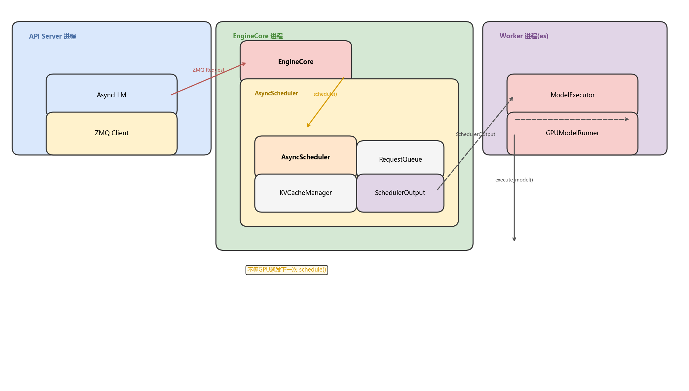
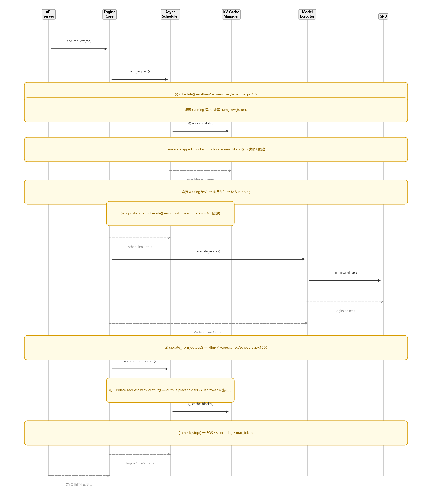
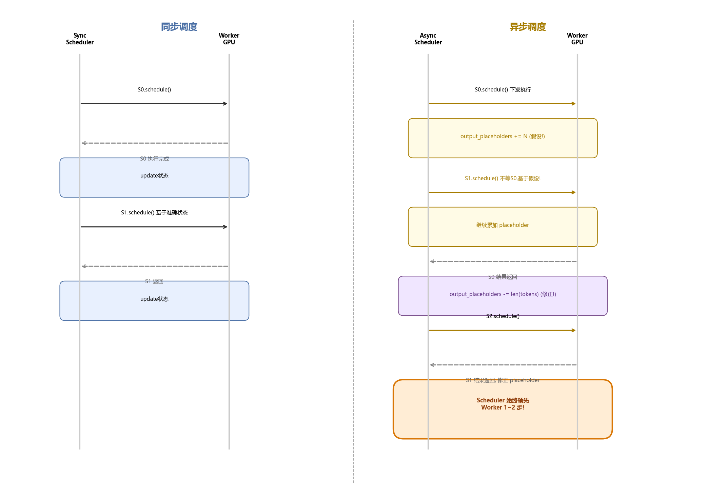

# vLLM Async Scheduler 深度解剖

> 版本：vLLM V1 (main branch, 2026-07)
> 核心文件：`vllm/v1/core/sched/`

## 目录

- [0. 前置知识：设计思想与核心概念](#0-前置知识设计思想与核心概念)
- [1. 全景架构概览](#1-全景架构概览)
- [2. Layer 1: SchedulerInterface —— 调度器的统一契约](#2-layer-1-schedulerinterface--调度器的统一契约)
- [3. Layer 2: Scheduler —— 同步调度核心引擎](#3-layer-2-scheduler--同步调度核心引擎)
- [4. Layer 3: AsyncScheduler —— 异步调度薄层](#4-layer-3-asyncscheduler--异步调度薄层)
- [5. 完整调用链时序图](#5-完整调用链时序图)
- [6. 同步 vs 异步调度对比](#6-同步-vs-异步调度对比)
- [7. 关键数据结构速查表](#7-关键数据结构速查表)
- [8. FAQ：快速问题解答](#8-faq快速问题解答)

---

## 0. 前置知识：设计思想与核心概念

### 0.1 为什么需要异步调度？

传统 vLLM 的**同步调度**模式下，执行流程是严格串行的：

```
step N: schedule() → execute(GPU) → 等待GPU完成 → update_from_output() 
step N+1: schedule() → execute(GPU) → ...
```

每个 step 之间，CPU 调度器必须**等待 GPU 执行完毕**才能发起下一次调度。这意味着 GPU 计算期间 CPU 空闲等待，GPU 利用率有间隙。

**异步调度的核心思想**：在 GPU 还在执行 step N 时，CPU 调度器**不等结果就直接发起 step N+1 的调度**，将 CPU 调度和 GPU 执行流水线化，隐藏 GPU 延迟。

### 0.2 核心矛盾：状态不确定性

异步调度的代价是：调度 step N+1 时，step N 的结果还没回来，调度器**不知道 step N 生成了几个 token**。这意味着 `num_computed_tokens`、`output_token_ids` 等关键字段是**不确定的**。

解决方案：**假设 → 修正（Assume → Correct）** 模式。

- **调度时**：假设 step N 会生成 N 个 token，提前更新 `num_output_placeholders`（占位符）
- **结果返回时**：用真实生成的 token 数减去 placeholder，修正状态

### 0.3 关键设计决策

| 决策 | 内容 |
|------|------|
| **继承而非重写** | `AsyncScheduler` 只重写 3 个方法，其余复用 `Scheduler` 的 128KB 逻辑 |
| **Placeholder 机制** | `num_output_placeholders` 追踪 in-flight 中的未确认 token |
| **PP microbatching** | V2 runner 下，同一请求的两次 decode 间隔必须 ≥ `pp_size` 步 |
| **投机解码加成** | 异步模式下，spec token 先用 `[-1, -1, ...]` 占位，worker 侧实际执行 |

### 0.4 业界演进

- vLLM V0：显式区分 prefill/decode 阶段，调度逻辑分两套
- vLLM V1：用 `num_tokens - num_computed_tokens` 统一公式，不再显式区分阶段
- Async scheduling 进一步增强 GPU 利用率，配合 chunked prefill 和 spec decoding
- 社区反馈：当前实现仍较复杂，有 bug，改进方向是调度器只维护 `num_output_tokens`

---

## 1. 全景架构概览

### 架构图



**关键交互**:
- API Server → ZMQ → EngineCore：发送 add_request
- EngineCore busy loop：`schedule() → execute() → update_from_output()` 循环
- **AsyncScheduler 在 schedule() 后不等 GPU，直接发下一次 schedule()**

---

## 2. Layer 1: SchedulerInterface —— 调度器的统一契约

**文件**: `vllm/v1/core/sched/interface.py`（248 行）

### 2.1 接口定义

```python
class SchedulerInterface(ABC):
    @abstractmethod
    def schedule(self, throttle_prefills: bool = False) -> SchedulerOutput: ...
    @abstractmethod
    def update_from_output(self, scheduler_output, model_runner_output) -> dict: ...
    @abstractmethod
    def add_request(self, request: Request) -> None: ...
    @abstractmethod
    def finish_requests(self, request_ids, finished_status) -> list: ...
```

这是调度器的**抽象契约**，Scheduler 和 AsyncScheduler 都实现此接口。关键方法注释（`interface.py:52-81`）：

> "The scheduling decision is made at the iteration level. Each scheduling step corresponds to a single forward pass of the model. Essentially, the scheduler produces a dictionary of {req_id: num_tokens} that specifies how many tokens to process for each request."

### 2.2 PauseState

```python
class PauseState(enum.IntEnum):
    UNPAUSED = 0   # 正常调度
    PAUSED_NEW = 1 # 不调度新请求，running 继续
    PAUSED_ALL = 2 # 完全暂停
```

用于热更新、权重切换等场景。

---

## 3. Layer 2: Scheduler —— 同步调度核心引擎

**文件**: `vllm/v1/core/sched/scheduler.py`（~128 KB，3000+ 行）

### 3.1 核心设计

> 不区分 prefill/decode 阶段，用统一公式 `num_tokens_with_spec - num_computed_tokens` 自动适配两者

```python
# scheduler.py:432-443
def schedule(self, throttle_prefills=False) -> SchedulerOutput:
    # 统一公式：
    # num_tokens_with_spec = len(prompt) + len(output_ids) + len(spec_token_ids)
    # num_new = num_tokens_with_spec + output_placeholders - num_computed_tokens
    
    # prefill 中的请求: output_ids=0 → num_new = 还需预填充的 token 数（可能 > 1）
    # decode 中的请求: 上一轮的 output token 还没 compute → num_new = 1
```

### 3.2 schedule() 流程

```python
# scheduler.py:432
def schedule(self, throttle_prefills=False):
    # ① 计算 token_budget
    token_budget = self.max_num_scheduled_tokens
    
    # ② 先调度 running 请求（优先级高于 waiting）
    for req in self.running:
        num_new_tokens = min(
            req.num_tokens_with_spec + req.num_output_placeholders 
            - req.num_computed_tokens,
            long_prefill_token_threshold,
            token_budget
        )
        # 分配 KV cache blocks
        new_blocks = self.kv_cache_manager.allocate_slots(req, num_new_tokens)
        if new_blocks is None:
            # 资源不足 → 抢占最低优先级 running 请求
            preempt()
    
    # ③ 再调度 waiting 请求
    for req in self.waiting:
        num_new_tokens = min(num_tokens - num_computed_tokens, ...)
        new_blocks = self.kv_cache_manager.allocate_slots(req, num_new_tokens)
        if new_blocks is not None:
            self.running.append(req)  # 移入 running
        # waiting 请求资源不足 → 跳过（不抢占 running）
    
    # ④ 构造 SchedulerOutput
    return SchedulerOutput(
        scheduled_new_reqs=...,      # 首次调度的请求
        scheduled_cached_reqs=...,   # 非首次，只发 diff
        num_scheduled_tokens=...,
        ...
    )
```

### 3.3 请求三态

| 状态 | 存放位置 | 含义 |
|------|---------|------|
| RUNNING | `self.running` | 正在被调度的请求 |
| WAITING | `self.waiting` 尾部 | 新请求或等待资源的请求 |
| PREEMPTED | `self.waiting` 头部 | 被抢占的 running 请求（优先级最高） |

### 3.4 抢占策略

当 running 请求需要更多 block 但资源不足时：
- **PRIORITY 策略**：抢占 running 中优先级最低的
- **FCFS 策略**：抢占 running 末尾的
- 被抢占请求标记为 PREEMPTED，放入 waiting 队列头部（保持最高优先级）

### 3.5 update_from_output()

```python
# scheduler.py:1550
def update_from_output(self, scheduler_output, model_runner_output):
    # 从 ModelRunnerOutput 中提取：
    sampled_token_ids = model_runner_output.sampled_token_ids
    logprobs = model_runner_output.logprobs
    # ...
    
    # 逐请求处理：
    for req_id in num_scheduled_tokens:
        new_token_ids = sampled_token_ids[req_id]
        new_token_ids, stopped = self._update_request_with_output(req, new_token_ids)
        # 检查 stop 条件（EOS, stop string, max_tokens）
```

---

## 4. Layer 3: AsyncScheduler —— 异步调度薄层

**文件**: `vllm/v1/core/sched/async_scheduler.py`（**仅 76 行**）

### 4.1 核心：只重写 3 个方法

```python
class AsyncScheduler(Scheduler):
    # ① _update_after_schedule() —— 假设生成
    # ② _update_request_with_output() —— 实际修正
    # ③ __init__() —— 初始化 placeholder
```

所有其他调度逻辑（schedule()、抢占、KV cache、encoder、spec decode）全部复用父类。

### 4.2 Placeholder 的 "假设 → 修正" 全流程

```
Step 0: schedule()
  → _update_after_schedule():
      request.num_output_placeholders += num_sampled_tokens + num_spec_tokens
      # "假设" 生成了这些 token

Step 1: schedule()（不等 Step 0 完成！）
  → 基于 S0 的假设状态继续调度
  → _update_after_schedule() 再次累加 placeholder

--- Step 0 GPU 执行完毕 ---

update_from_output():
  → _update_request_with_output():
      request.num_output_placeholders -= len(new_token_ids)
      # "修正"：实际生成了多少 token，就减去多少 placeholder
      assert request.num_output_placeholders >= 0
```

### 4.3 投机解码下的占位

```python
# async_scheduler.py:19-44
def _update_after_schedule(self, scheduler_output):
    self._spec_token_placeholders = [-1] * num_spec_tokens  # 用 -1 占位
    for req_id in scheduler_output.num_scheduled_tokens:
        request.num_output_placeholders += self.num_sampled_tokens_per_step
        request.spec_token_ids = self._spec_token_placeholders  # [-1, -1, ...]
```

调度时不知道 draft token 的实际 id，用 -1 占位。Worker 侧在执行前替换为真实值，执行后根据 accept/reject 结果修正 placeholder。

### 4.4 PP Microbatching 对齐

```python
if self.use_v2_model_runner:
    request.next_decode_eligible_step = self.current_step + self.pp_size
```

同一请求两次 decode 之间必须间隔 `pp_size` 步，以匹配 worker 侧的广播 slot 环节奏。

### 4.5 异步 tokens 丢弃

```python
def _update_request_with_output(self, request, new_token_ids):
    if request.async_tokens_to_discard > 0:
        request.async_tokens_to_discard -= 1
        return [], False  # 丢弃这一帧的输出
    # ... normal processing
```

`reset_prefix_cache` 强制抢占时，可能有 in-flight 的异步输出帧需要丢弃，逐帧 drain 直到计数器归零。

---

## 5. 完整调用链时序图



---

## 6. 同步 vs 异步调度对比

### 时序对比图



### 特性对比表

| 维度 | 同步调度 (Scheduler) | 异步调度 (AsyncScheduler) |
|------|---------------------|--------------------------|
| **执行流水线** | step N 完成 → 更新状态 → 调度 N+1 | step N 下发后立即调度 N+1 |
| **GPU 利用率** | step 间有等待间隙 | 调度与执行重叠，利用率更高 |
| **状态准确性** | `num_computed_tokens` 始终准确 | 部分是假设值（placeholder） |
| **代码复杂度** | 低（Scheduler 占主导） | 高（需要假设→修正循环） |
| **额外字段** | 无 | `num_output_placeholders`, `async_tokens_to_discard`, `next_decode_eligible_step` |
| **投机解码** | draft token 在调度时已知 | draft token 用 [-1] 占位，worker 侧填充 |
| **适用场景** | 通用、稳定 | 追求极致吞吐，配合 V2 runner + PP |

**核心公式对比**：

```
同步调度: num_new = num_tokens_with_spec - num_computed_tokens
异步调度: num_new = num_tokens_with_spec + output_placeholders - num_computed_tokens
                   ^^^^^^^^^^^^^^^^^^^^^^^^
                   加上 in-flight 假设 token
```

---

## 7. 关键数据结构速查表

| 数据结构 | 所在文件 | 关键字段 | 作用 |
|---------|---------|---------|------|
| `SchedulerOutput` | `output.py:183` | `scheduled_new_reqs`, `scheduled_cached_reqs`, `num_scheduled_tokens`, `finished_req_ids` | schedule() 的返回值，包含本轮调度的所有信息 |
| `NewRequestData` | `output.py:33` | `req_id`, `prompt_token_ids`, `block_ids`, `num_computed_tokens`, `sampling_params` | 首次调度的请求的**全量**信息 |
| `CachedRequestData` | `output.py:114` | `req_ids`, `new_block_ids`, `num_computed_tokens`, `num_output_tokens` | 非首次调度的请求的**增量**信息（减少通信） |
| `GrammarOutput` | `output.py:268` | `structured_output_request_ids`, `grammar_bitmask` | 结构化输出的语法约束位掩码 |
| `SchedulerInterface` | `interface.py:36` | (抽象类) | 调度器统一契约，Scheduler 和 AsyncScheduler 都实现 |
| `PauseState` | `interface.py:22` | `UNPAUSED=0`, `PAUSED_NEW=1`, `PAUSED_ALL=2` | 调度器暂停状态枚举 |
| `SchedulingPolicy` | `request_queue.py` | `FCFS`, `PRIORITY` | 请求队列调度策略 |
| `RequestQueue` | `request_queue.py` | `add_request()`, `pop_next()`, `prepend_request()` | 等待队列抽象（FCFS/优先权） |
| `KVCacheBlocks` | `kv_cache_manager.py` | `blocks: tuple[Sequence[KVCacheBlock], ...]` | 跨 group 的 KV cache block 分配结果 |

### Request 关键字段（异步特有）

| 字段 | 类型 | 含义 |
|------|------|------|
| `num_output_placeholders` | `int` | in-flight 中尚未确认的 token 数（异步核心字段） |
| `async_tokens_to_discard` | `int` | 需要丢弃的异步输出帧数（reset_prefix_cache 后） |
| `next_decode_eligible_step` | `int` | PP microbatching 下，下次可调度的 step 编号 |
| `num_computed_tokens` | `int` | 已计算的 token 数（异步下包含 placeholder，不准确！） |
| `num_tokens_with_spec` | `int` | `len(prompt) + len(output) + len(spec_token_ids)` |

---

## 8. FAQ：快速问题解答

**Q1: AsyncScheduler 和 Scheduler 的 schedule() 方法有什么不同？**

没有不同。`AsyncScheduler.schedule()` 直接用父类的，区别在调度**之后**：`_update_after_schedule()` 会设置 placeholder。

**Q2: placeholder 会导致状态错误吗？**

会，但会在 `update_from_output()` 时修正。如果修正不及时，可能导致多调一个 step（浪费计算）或少调一个 step（延迟）。社区已发现 3 个相关 bug。

**Q3: 什么时候用 AsyncScheduler 而不是 Scheduler？**

当 `use_v2_model_runner=True` 时自动启用 AsyncScheduler。它需要 V2 runner 的 PP microbatching 支持。

**Q4: num_output_placeholders 可以为负吗？**

不可以。代码中有 `assert num_output_placeholders >= 0`。如果为负说明假设值比实际值小（不太可能，因为假设偏大），或者修正逻辑有 bug。

**Q5: 异步调度和投机解码如何交互？**

投机解码让异步调度更复杂，因为 worker 可能 accept/reject draft tokens。Scheduler 调度时不知道哪些会被接受，所以：
- spec_token_ids 先用 `[-1, -1, ...]` 占位
- worker 执行后返回实际 accept/reject 结果
- `update_from_output()` 根据 accept 数量修正 placeholder

**Q6: 抢占在异步模式下有什么特殊处理？**

被抢占的请求可能有 in-flight 输出帧。通过 `async_tokens_to_discard` 计数器逐帧丢弃，直到 drain 完毕才恢复正常处理。

---

## 文件索引

| 文件 | 大小 | 核心内容 |
|------|------|---------|
| `vllm/v1/core/sched/interface.py` | 9.5 KB | `SchedulerInterface`, `PauseState` |
| `vllm/v1/core/sched/scheduler.py` | 128.7 KB | `Scheduler` — 核心调度逻辑 |
| `vllm/v1/core/sched/async_scheduler.py` | 3.5 KB | `AsyncScheduler` — 异步调度扩展 |
| `vllm/v1/core/sched/output.py` | 10.5 KB | `SchedulerOutput`, `NewRequestData`, `CachedRequestData` |
| `vllm/v1/core/sched/request_queue.py` | 7.0 KB | `RequestQueue`, `SchedulingPolicy` |
| `vllm/v1/core/sched/utils.py` | 4.2 KB | `check_stop()`, `remove_all()` |

---

*报告生成时间: 2026-07-13 | 工具: source-analyzer skill + draw.io MCP*
