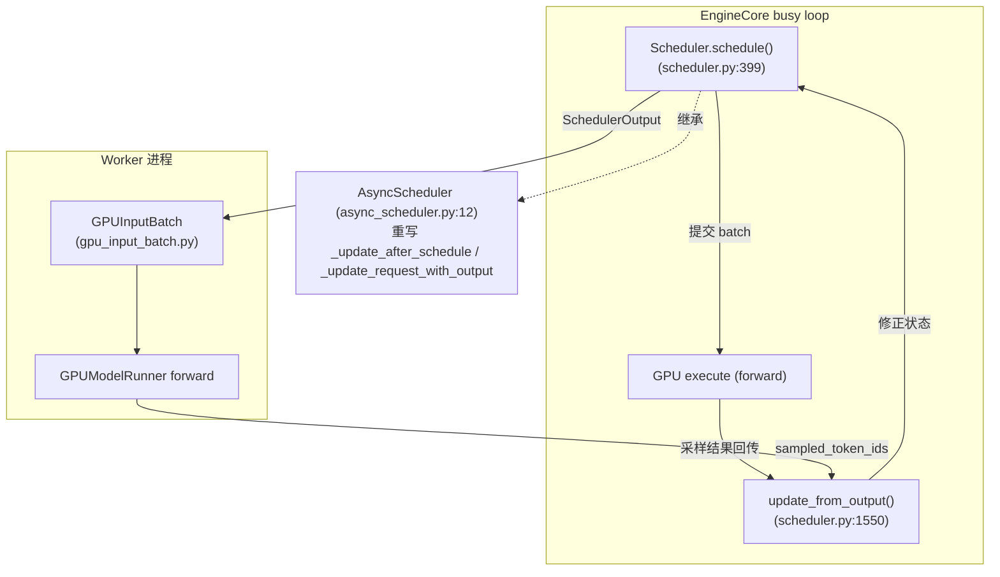
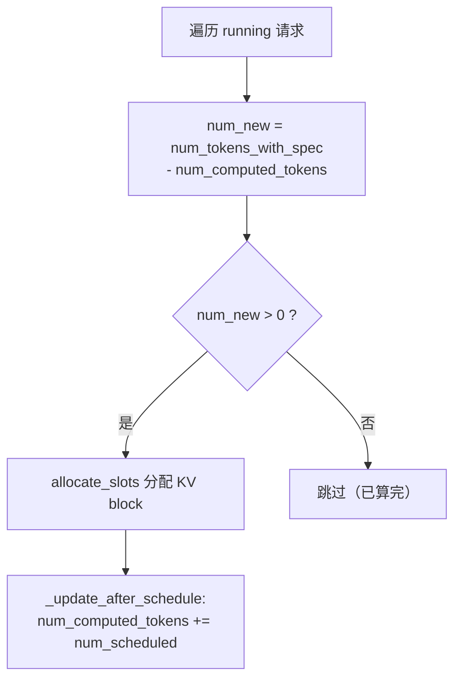
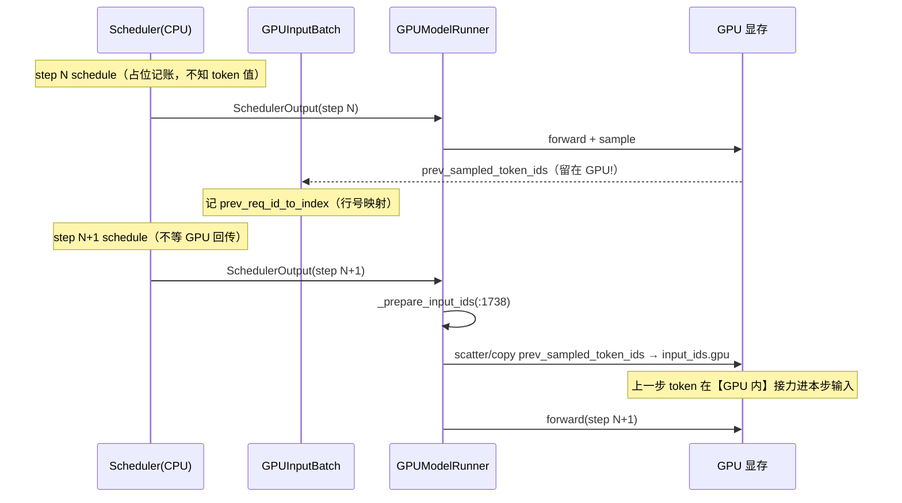
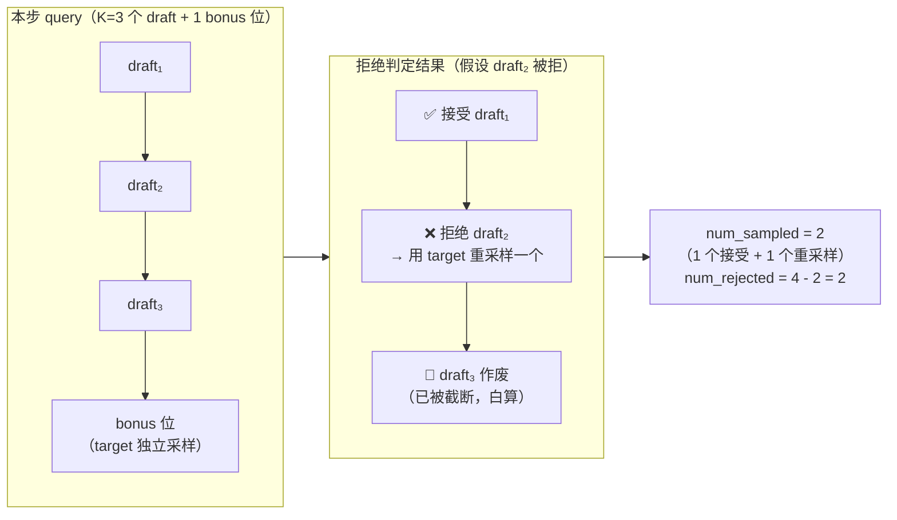
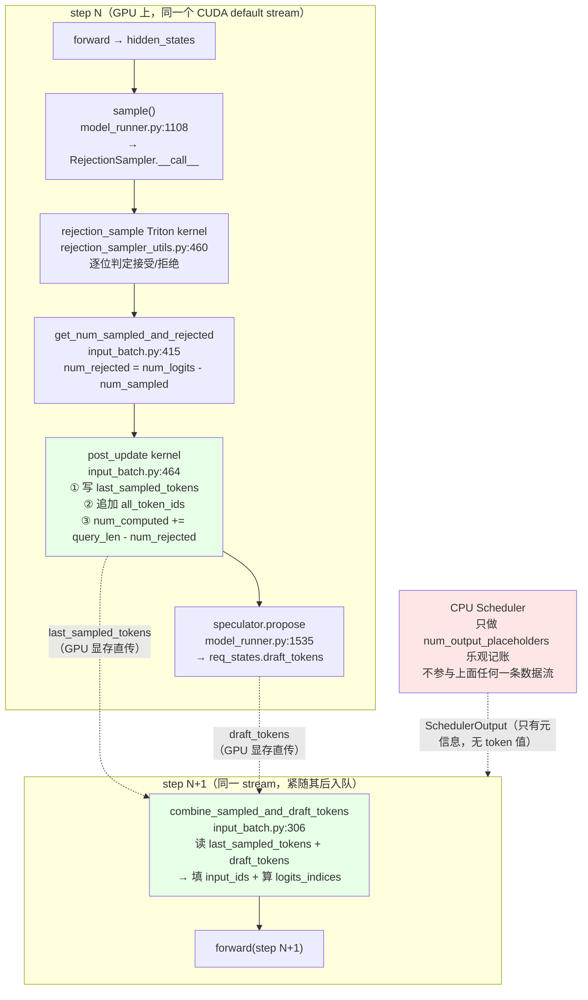
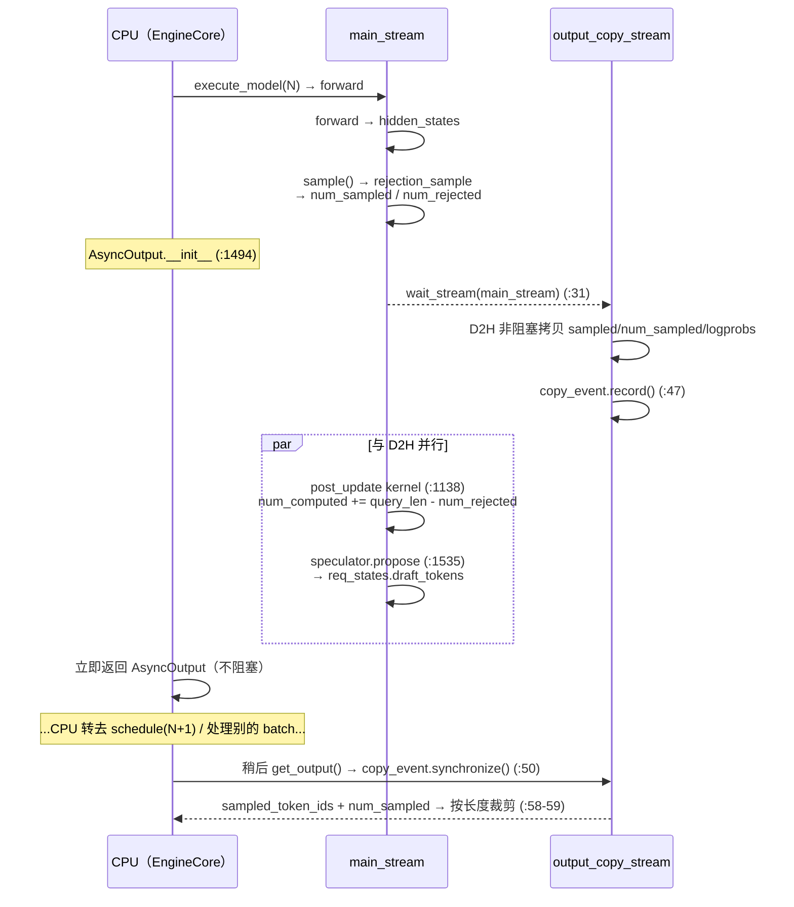
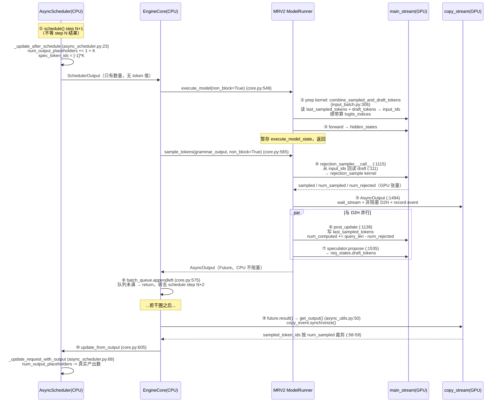
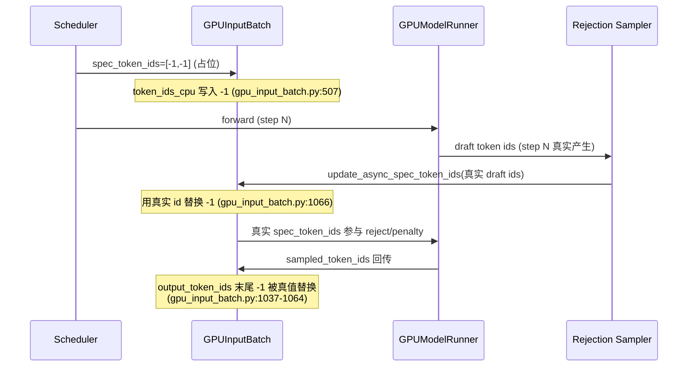
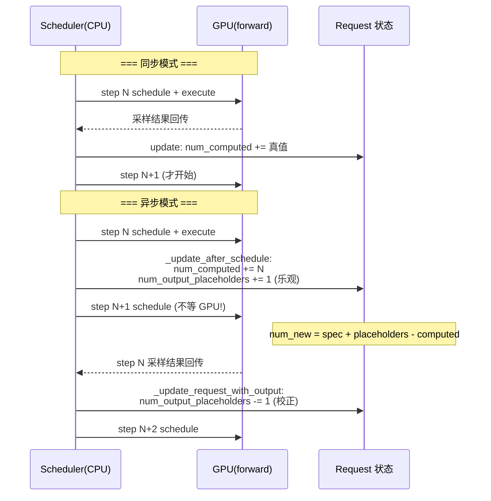

# vLLM 异步调度器（Async Scheduler）深度解剖

> 基于 `comments-on-v0.25.1` 分支源码（2026-07-17 快照）
> 调研范围：`vllm/v1/core/sched/{async_scheduler,scheduler,interface,output}.py`、`vllm/config/{scheduler,vllm}.py`、`vllm/v1/worker/gpu_input_batch.py`、`vllm/v1/request.py`、`vllm/v1/engine/core.py`
> **MRV2 路径追加（§4f~§4j）**：`vllm/v1/worker/gpu/{model_runner,input_batch,states,async_utils}.py`、`vllm/v1/worker/gpu/spec_decode/{rejection_sampler,rejection_sampler_utils}.py`
> 参考：vLLM Blog《Model Runner V2》(https://vllm.ai/blog/mrv2, 2026-03-24)「Async 优先设计」一节、Leviathan et al. 2023 (arXiv:2211.17192) 投机采样、Sun et al. 2024 (arXiv:2403.10444) block verification、社区源码解析

---

## 目录

- [0. 前置知识：为什么需要异步调度](#0-前置知识为什么需要异步调度)
- [1. 全景架构概览](#1-全景架构概览)
- [2. Layer 1：调度器接口与启用开关](#2-layer-1调度器接口与启用开关)
- [3. Layer 2：同步 Scheduler 的核心公式](#3-layer-2同步-scheduler-的核心公式)
- [3b. 具象推演：同步模式下"第一个请求为何不再被调度"](#3b-具象推演同步模式下第一个请求为何不再被调度)
- [3c. 抢占与 in-flight output 竞态：迟到的结果落到已被抢占的请求上](#3c-抢占与-in-flight-output-竞态迟到的结果落到已被抢占的请求上)
- [4. Layer 3：AsyncScheduler 与 Placeholder Token（重点）](#4-layer-3asyncscheduler-与-placeholder-token重点)
- [4b. 执行层核心：上一步 token id 没回 CPU，decode 输入从哪来](#4b-执行层核心上一步-token-id-没回-cpudecode-输入从哪来)
- [4b.5 上一步采样 token 的完整生命周期：赋值 → 使用 → 交接](#4b5-上一步采样-token-的完整生命周期赋值--使用--交接)
- [4b.5.4 关键澄清：使用点为什么能安全读（无需等上一步 fwd 结束）](#4b54-关键澄清使用点为什么能安全读无需等上一步-fwd-结束)
- [4c. 提前调度但结果已终止（EOS / finished）怎么办](#4c-提前调度但结果已终止eos--finished-怎么办)
- [4d. CPU 如何 overlap「发新步」与「收旧步结果」](#4d-cpu-如何-overlap发新步与收旧步结果)
- [4e. 读源码避坑：V1 GPUInputBatch vs V2 InputBatch](#4e-读源码避坑v1-gpuinputbatch-vs-v2-inputbatch)
- [4f. Rejection Sampling 是什么：从投机解码讲起](#4f-rejection-sampling-是什么从投机解码讲起)
- [4f.4 ⚠️ 易错点：generated_token_ids 的 token 顺序（accepted 在前、bonus 在末尾）](#4f4-️-易错点generated_token_ids-的-token-顺序accepted-在前bonus-在末尾)
- [4g. 「prep kernel 直接消费 GPU 产生的 rejection sampling 结果」到底指什么](#4g-prep-kernel-直接消费-gpu-产生的-rejection-sampling-结果到底指什么)
- [4h. 独立 CUDA stream：每步输出如何与主计算流解耦](#4h-独立-cuda-stream每步输出如何与主计算流解耦)
- [4i. 三方集成全景：async scheduler × MRV2 × 投机解码](#4i-三方集成全景async-scheduler--mrv2--投机解码)
- [4j. 例外：结构化输出 + 投机解码下的 deferred sampling](#4j-例外结构化输出--投机解码下的-deferred-sampling)
- [5. Worker 侧：-1 占位如何被填充](#5-worker-侧-1-占位如何被填充)
- [6. 完整调用链时序图](#6-完整调用链时序图)
- [7. 同步 vs 异步调度对比](#7-同步-vs-异步调度对比)
- [8. 关键数据结构速查表](#8-关键数据结构速查表)
- [9. 启用与配置](#9-启用与配置)
- [10. 源码文件索引](#10-源码文件索引)
- [11. 快速问题解答（FAQ）](#11-快速问题解答faq)

---

## 0. 前置知识：为什么需要异步调度

### 0.1 同步调度的瓶颈

vLLM 每个调度步（step）对应一次模型 forward。同步模式下，CPU 调度器和 GPU 是**严格串行**的：

```
step N:  schedule() → execute(GPU) → 等 GPU 算完 → update_from_output()
step N+1: schedule() → ...
```

GPU 在算 step N 时，CPU 调度器只能**干等**。GPU 算完、token 采样结果回传 CPU 后，才能开始 step N+1 的 `schedule()`。这段"CPU 空等 GPU"的间隙降低了 GPU 利用率。

### 0.2 异步调度的核心思想：重叠批次（Overlapping Batches）

异步调度让 CPU **不等 GPU 算完就提前调度下一步**。即：step N 的 forward 还在 GPU 上跑，CPU 已经算出了 step N+1 的调度决策并下发了。这样 CPU 调度和 GPU 计算在时间上重叠，隐藏了调度延迟。

**代价**：调度 step N+1 时，step N 的采样结果还没回来，调度器**不知道 step N 到底生成了几个 token**。于是它必须"猜"——这就是 **placeholder（占位）** 机制的由来。

### 0.3 一句话理解 Placeholder Token

> **Placeholder = 调度器在"真实结果还没回来"时，为即将产生的 token 提前占好的"位置 + KV 槽位"。**

它解决的根本矛盾是：**调度决策（需要知道序列里有哪些 token、占哪些位置）必须发生在 GPU 结果回来之前**。既然结果未知，就先占个位、等结果回来再填真值/再校正计数。

> ⚠️ **重要澄清（旧报告没讲清的点）**：代码里 "placeholder" 其实指**两件事**，不要混：
> - **(A) 计数型占位** `num_output_placeholders`：一个整数，表示"我已乐观预留、但还没拿到真实 token 的 output 槽位数"。纯调度记账用。
> - **(B) 字面型占位** `spec_token_ids = [-1, -1, ...]` 和 `output_token_ids` 里的 `-1`：token 的**真实 id 还没算出来**（尤其投机解码的 draft token），先用 `-1` 字面量顶着，worker 在 forward 前/采样后替换成真值。
>
> 两者都叫 placeholder，但 (A) 是"数量未知"的占位，(B) 是"值未知"的占位。下文会分别拆开讲。

### 0.4 演进

- vLLM V0：显式区分 prefill/decode，两套调度逻辑。
- vLLM V1：用 `num_tokens - num_computed_tokens` 统一公式，不再区分阶段。
- Async Scheduling：在 V1 基础上进一步让调度与 GPU 执行重叠，配合 V2 model runner + pipeline parallel 的 microbatching（一次 decode 跨 `pp_size` 步），把 GPU 利用率推满。

---

## 1. 全景架构概览

**图1：异步调度在引擎中的位置**



**关键点**：异步模式下，`schedule()` 提交 batch 后**不等待** `update_from_output()`，立刻又 `schedule()` 下一个 batch。允许多个 batch 同时在途（in-flight），由 `max_concurrent_batches > 1` 控制。

---

## 2. Layer 1：调度器接口与启用开关

### 2.1 统一契约 `SchedulerInterface`（`interface.py:36`）

`Scheduler` 和 `AsyncScheduler` 都实现此接口，方法包括 `schedule()`、`update_from_output()`、`add_request()`、`finish_requests()`。

### 2.2 启用开关

`SchedulerConfig.async_scheduling`（`config/scheduler.py:158`，默认 `None` = 自动）：

```python
# config/scheduler.py:180
def get_scheduler_cls(self):
    if self.scheduler_cls is None:
        if self.async_scheduling:
            from ...async_scheduler import AsyncScheduler
            return AsyncScheduler          # 异步
        from ...scheduler import Scheduler
        return Scheduler                  # 同步
```

`async_scheduling` 为 `None` 时由 `VllmConfig` 自动决定（`config/vllm.py:992-1040`）：若 executor 支持（V2 runner 等）则置 `True`，否则 `False`。`max_concurrent_batches` 在 `async_scheduling=True` 时自动 > 1（`config/vllm.py:492-496`），这是异步能重叠的前提。

---

## 3. Layer 2：同步 Scheduler 的核心公式

**图2：计算本步要调度的 token 数**



同步模式下（`scheduler.py:502` 的简化版，无 placeholder）：

```text
num_new = num_tokens_with_spec - num_computed_tokens
```

- **decode 请求**：`num_computed_tokens` 已等于"已算的 output 数"，差值为 1 → 每步算 1 个新 token。
- **prefill 请求**：差值 = 剩余 prompt token 数 → 可能很大，被 `long_prefill_token_threshold` / `token_budget` 截断成 chunked prefill。

调度后 `_update_after_schedule`（`scheduler.py:1231`）把 `num_computed_tokens += num_scheduled_token`——因为同步模式下，**调度时 GPU 结果必然会在 update 前算完**，所以"已调度"就等于"将已计算"，可以放心前进。

### 3b. 具象推演：同步模式下"第一个请求为何不再被调度"

> 用 `tests/v1/core/test_scheduler.py` 的 `test_preempt_during_execution`（`:962-1004`）这个真实测试，把"同步调度必须等 output 回来"讲透。该测试配置：`num_blocks=11`（block 0 是 null block，实际可用 10），`block_size=16`，两个 `num_tokens=80` 的请求 → 每个占 `80/16 = 5` 个 block。

**第一步：调度 requests[0]（`:975-979`）**

```python
scheduler.add_request(requests[0])
scheduler_output0 = scheduler.schedule()
assert len(scheduler_output0.num_scheduled_tokens) == 1
assert len(scheduler_output0.scheduled_new_reqs[0].block_ids[0]) == 5
```

- requests[0] 是纯 prompt，prefill 一步算完（80 token 没超 `max_num_batched_tokens=100`）。
- `schedule()` 后它进入 `running`，`num_computed_tokens` 前进到 80，KV 占了 5 个 block（剩 5 个）。

**第二步：调度 requests[1]，而 requests[0] 在 running 但"没新活"**

```python
scheduler.add_request(requests[1])          # :984 此时才加入第二个
scheduler_output1 = scheduler.schedule()    # :985 发生在 update_from_output(:998) 之前！
assert len(scheduler_output1.num_scheduled_tokens) == 1   # 只有 requests[1]
assert len(scheduler_output1.scheduled_new_reqs[0].block_ids[0]) == 5
```

- 此刻 requests[0] **已经算完 prefill**，正处在"等 model output 回灌"的间隙。
- 对 requests[0] 算 `num_new_tokens`（`scheduler.py:502`）：`num_computed_tokens(=80) - num_computed_tokens(=80) = 0` → **没有新 token 需要前向，本轮不参与调度**。
- 而 requests[1] 刚加入 waiting、还没被调度过 → 需要 prefill → 故 `scheduler_output1` 里只有它一个，分走剩余 5 个 block。

**关键点**：这一步 `schedule()`（`:985`）发生在 `update_from_output`（`:998`）**之前**。requests[0] 的 1 个 sampled token 还没回灌，所以它的 `_output_token_ids` 仍是 80 长、`num_computed_tokens` 还是 80，自然"无新 token 可算"。**这正是同步调度的硬约束：GPU 结果没回来，调度器就不知道序列推进到哪了，无法继续排这一步。**

**第三步：output 回来后，requests[0] 才以 decode 身份重新出现**

```python
model_runner_output0 = ModelRunnerOutput(req_ids=[requests[0].request_id],
    sampled_token_ids=[[0]], ...)        # :990 构造 output
scheduler.update_from_output(scheduler_output0, model_runner_output0)  # :998
_ = scheduler.schedule()                 # :1002 这一步 requests[0] 才会被再调度
```

- `update_from_output` 把 token `0` 追加进 requests[0]，其 `num_computed_tokens` 从 80 涨到 81。
- 下一轮 `schedule()`（`:1002`）时 requests[0] 的 `num_new_tokens = 81 - 80 = 1` → 需要再多 1 个 block，但 KV 已被 requests[0]+requests[1] 占满（5+5=10）→ **触发抢占 requests[1]**（`:1003-1004` 断言 `running` 只剩 requests[0]）。

**与 async scheduler 的对照（这就是 §4.1 的核心）**

> 同步模式下，第二步（`:985`）requests[0] 之所以"消失"，是因为 `num_new_tokens = 0`（output 未回灌，`num_computed_tokens` 仍 80）。
> 而 **AsyncScheduler 用 `num_output_placeholders` 骗过这个公式**（`async_scheduler.py:55`）：调度完 step N 后立即 `+1`（假设会产出 1 个 token），于是 step N+1 算 `num_new = spec + placeholders(=1) - computed(=80) = 1 > 0` → requests[0] **在 output 还没回来时就继续被调度**，与 GPU 前向重叠。
> 等 `update_from_output`（`async_scheduler.py:87`）真把 token 写回，再 `num_output_placeholders -= 1` 扣回，保证账本不超。
> **一句话**：同步模式"等 output 回来才排下一步"→ 第一个请求卡在间隙；异步模式"提前占位 → 不等就排"→ 第一个请求在间隙里也被排了，从而 overlap。本测试就是同步那条路径的精确反例。

### 3c. 抢占与 in-flight output 竞态：迟到的结果落到已被抢占的请求上

> 承接 §3b 的同一个测试 `test_preempt_during_execution`（`tests/v1/core/test_scheduler.py:962-1021`）的**后半段**。§3b 讲的是"调度器排不排得上"，本节讲的是"排上去、飞在 GPU 上的那一批，结果回来时请求已经被抢占了怎么办"。这是 async / PP / `max_concurrent_batches > 1` 场景下的**常态竞态**，测试注释 `:982-983` 明确点出了这一点。

#### 3c.1 竞态时间线

| 步骤 | 事件 | requests[1] 状态 |
|---|---|---|
| `:985` | `schedule()` 产出 `scheduler_output1`，requests[1] 被调度、分 5 block、下发 GPU | RUNNING（**in-flight**） |
| `:1003` | 又一次 `schedule()`，requests[0] decode 需新 block，KV 已满 → **抢占 requests[1]** | PREEMPTED |
| `:1016` | `scheduler_output1` 对应的 output 此时才回来，调 `update_from_output` | PREEMPTED，但仍要吃下这个 output |

```python
1002:    # ⚠️ 会抢占请求1
1003:    _ = scheduler.schedule()
1004:    assert len(scheduler.running) == 1
1005:    assert scheduler.running[0] == requests[0]
1006:    assert requests[1].status == RequestStatus.PREEMPTED
1007:
1008:    model_runner_output1 = ModelRunnerOutput(
1009:        req_ids=[requests[1].request_id],       # 抢占前那一步的 in-flight 结果
1011:        sampled_token_ids=[[42]],
1015:    )
1016:    scheduler.update_from_output(scheduler_output1, model_runner_output1)
1017:
1018:    # The second request (that is preempted) should be updated with the
1019:    # sampled token id.
1020:    assert len(requests[1].output_token_ids) == 1
1021:    assert requests[1].output_token_ids[0] == 42   # ← token 必须保住
```

在异步调度下，GPU 上同时飞着多个 batch，调度器已经往前跑了若干步，某个早先 batch 的结果姗姗来迟——而这期间该请求完全可能已被抢占。**这不是异常路径，是必然会发生的路径。**

#### 3c.2 核心原则：抢占只回收 KV，绝不丢 token

`_preempt_request`（`vllm/v1/core/sched/scheduler.py:1211-1233`）：

```python
1211:    def _preempt_request(self, request: Request, timestamp: float) -> None:
1217:        assert request.status == RequestStatus.RUNNING, (
1218:            "Only running requests can be preempted"
1219:        )
1220:        self._free_request_blocks(request)      # 释放 KV block（可再生的中间产物）
1221:        self.encoder_cache_manager.free(request)
1222:        self._inflight_prefills.discard(request)
1223:        request.status = RequestStatus.PREEMPTED
1224:        request.num_computed_tokens = 0          # 计算进度清零 → 将来整段重新 prefill
1225:        if request.spec_token_ids:
1226:            request.spec_token_ids = []          # 丢弃草稿（见 spec_decode.md）
1227:        request.num_preemptions += 1
1232:        self.waiting.prepend_request(request)    # 插回 waiting 队首（优先恢复）
1233:        self.reset_preempted_req_ids.add(request.request_id)
```

**关键：它没有触碰 `request._output_token_ids`。**

抢占丢弃的是「已算出的 KV 缓存」和「计算进度」——这些都是**可以用算力重新换回来**的中间产物。而 token 序列是模型真实产出的不可再生真值，一旦丢弃就是"丢字"，输出直接错乱。所以 `:1016` 把 token `42` 追加进一个 PREEMPTED 请求，是**完全合法且必须**的行为。

> 这就是抢占（preemption / recompute）的定义：**牺牲算力换显存，绝不牺牲输出正确性。**

#### 3c.3 `update_from_output` 的三处容错设计

被抢占的 requests[1] 走进 `:1633` 那个主循环时，有三处专为此竞态设计的保护：

**① 存活性检查：PREEMPTED 不等于"已消失"**（`scheduler.py:1638-1647`）

```python
1638:            request = self.requests.get(req_id)
1639:            if request is None or request.is_finished():
1640:                # The request is already finished. This can happen if the
1641:                # request is aborted while the model is executing it (e.g.,
1642:                # in pipeline parallelism or in async scheduling).
1647:                continue
```

判据是 `request is None`（已彻底移除）或 `is_finished()`（已终止），**不是** `status == RUNNING`。PREEMPTED 请求仍在 `self.requests` 字典里、也没 finished（它还要重跑），因此**正常继续处理，不会被 skip**。注释里 "in pipeline parallelism or in async scheduling" 正是本节场景的同源竞态。

**② `num_computed_tokens` 减法的下界保护**（`scheduler.py:1673-1674`）

```python
1668:                # num_computed_tokens represents the number of tokens
1669:                # processed in the current step, considering scheduled
1670:                # tokens and rejections. If some tokens are rejected,
1671:                # num_computed_tokens is decreased by the number of rejected
1672:                # tokens.
1673:                if request.num_computed_tokens > 0:
1674:                    request.num_computed_tokens -= num_rejected
```

投机解码回灌时要按拒绝数回退 `num_computed_tokens`。但抢占已把它清成 `0`（`:1224`），若无 `> 0` 守卫就会减成负数、污染后续所有调度计算。这行**不是巧合的防御性代码，就是为 stale output 兜底的**。同理下一行 `num_output_placeholders` 也有相同守卫（`:1677`）。

**③ stop 时按"抢占前状态"分流移除队列**（`scheduler.py:1785-1788`、`:1834-1836`）

这是最能说明"框架确实认真处理了这个竞态"的一处：

```python
1696:            status_before_stop = request.status      # 先快照状态
...
1777:            if stopped:
1781:                finished = self._handle_stopped_request(request)
1785:                if status_before_stop == RequestStatus.RUNNING:
1786:                    stopped_running_reqs.add(request)
1787:                else:
1788:                    stopped_preempted_reqs.add(request)   # ← 被抢占的走这条
...
1831:        # Remove the stopped requests from the running and waiting queues.
1832:        if stopped_running_reqs:
1833:            self.running = remove_all(self.running, stopped_running_reqs)
1834:        if stopped_preempted_reqs:
1835:            # This is a rare case and unlikely to impact performance.
1836:            self.waiting.remove_requests(stopped_preempted_reqs)
```

若这个迟到的 output 恰好触发了 stop（EOS / 长度上限），请求需要被摘出队列。但**被抢占的请求此刻躺在 `waiting` 队列里，不在 `running` 里**——若统一去 `self.running` 删就会失配。`status_before_stop` 快照正是为了区分这两条移除路径。`:1835` 的注释自称 "rare case"，说的就是本节这个竞态。

> 对照 §4c「提前调度但结果已终止（EOS / finished）怎么办」：那里处理的是"结果回来发现该停了"，这里叠加了"而且请求还已经被抢占了"，两个竞态可以同时发生，`status_before_stop` 就是它们的交汇点。

#### 3c.4 最终状态与代价

`:1016` 执行完后，requests[1] 的状态是：

| 字段 | 值 | 说明 |
|---|---|---|
| `status` | `PREEMPTED` | 抢占状态保持不变，output 回灌不改变它 |
| `num_computed_tokens` | `0` | 抢占清零，KV 全丢 |
| `_output_token_ids` | `[42]` | **token 保住了**（`:1020-1021` 断言） |
| 所在队列 | `waiting` 队首 | `prepend_request`，优先恢复 |
| `num_preemptions` | `1` | 计数用于统计与调度决策 |

等 KV 腾出空间被重新调度时，它会从头 prefill **81 个 token**（80 个 prompt + 1 个已输出的 `42`）重建 KV，然后从第 82 个位置继续 decode。

> **代价是重算，正确性无损。** 用户视角完全无感——他不会丢掉已经收到的 `42`，只是后续 token 会稍慢一点到达。

#### 3c.5 小结：这个测试在守护什么

`:1008-1021` 这段不是随手写的，它是一道**回归护栏**，锁定了三条不变量：

1. 抢占只回收 KV 与计算进度，**不动 token 序列**；
2. `update_from_output` 必须能安全消费"目标请求已被抢占"的 stale output；
3. 若该 output 触发 stop，移除操作必须走 `waiting` 而非 `running`。

若哪天有人"优化"成「抢占即丢弃其 in-flight output」，或把存活性检查收紧成 `status == RUNNING`，这个测试会立刻变红。

**与异步调度的关系**：同步模式下这个竞态只在 PP（`max_concurrent_batches > 1`）时出现；而**开启 async scheduling 后它成为常规路径**——因为 async 的本质就是"让多个 batch 同时在飞"，飞行期间发生抢占的概率大大提高。因此本节的三处容错，是 async scheduler 能够安全工作的**必要前提**之一。

---

## 4. Layer 3：AsyncScheduler 与 Placeholder Token（重点）

`AsyncScheduler`（`async_scheduler.py:12`）只重写 **3 个方法**，其余 128KB 调度逻辑全复用父类。它要解决的唯一问题：**调度时 GPU 结果未回来，不能像同步那样直接前进 `num_computed_tokens`**。

### 4.1 计数型占位 (A)：`num_output_placeholders`

`_update_after_schedule`（`async_scheduler.py:19`）在父类前进 `num_computed_tokens` 之后，**再乐观地多预留一批 output token**：

```python
# async_scheduler.py:38-41
cur_num_spec_tokens = len(spec_decode_tokens.get(req_id, ()))
request.num_output_placeholders += (
    self.num_sampled_tokens_per_step + cur_num_spec_tokens
)
```

含义：**"我假设这一步会新产生 `num_sampled_tokens_per_step`（decode 通常是 1）+ spec draft token 数 个 output token，先记下来，等真结果回来再扣。"**

于是异步模式计算本步 token 数时（`scheduler.py:502-506`）公式变成：

```
num_new = num_tokens_with_spec + num_output_placeholders - num_computed_tokens
                                    ^^^^^^^^^^^^^^^^^^^^^^^^
                                    加上"乐观预留"的 token
```

**为什么加它？** 因为异步下 `num_computed_tokens` 已经"超前"包含了还没确认的 token（父类无条件前进了）。`num_output_placeholders` 正好抵消这部分超前，让 `num_new` 算出来的"本步真正要新算几个"依然正确。

**校正 (A)**：当真实采样结果回来，`_update_request_with_output`（`async_scheduler.py:51`）扣减：

```python
# async_scheduler.py:67-68
request.num_output_placeholders -= len(new_token_ids)
assert request.num_output_placeholders >= 0
```

> 用具体数字走一遍（decode，每步 1 token，无 spec）：
> - step N 调度后：`num_computed_tokens` 前进到 10（`_update_after_schedule` 乐观前进，scheduler.py:1244），`num_output_placeholders` = 1（async 乐观预留，async_scheduler.py:39-41），`num_tokens_with_spec` = 10（step N-1 的输出已回传，已 append 到 `_all_token_ids`）。
> - step N+1 调度时（GPU 还没回传）：`_all_token_ids` 尚未 append step N 采出的 token（输出没回 CPU），所以 `num_tokens_with_spec` 仍是 **10**（不是 11）。`num_new = num_tokens_with_spec(=10) + placeholders(=1) - computed(=10) = 1`。
>   - **这 1 个 token 就是 step N 那个"未确认"token 的 KV 位置**（position 10）。它的 id 不在 `_all_token_ids` 里，而在 GPU 显存的 `prev_sampled_token_ids` 中——worker 做 embedding 时直接读 GPU 上的 prev_sampled_token_ids，不绕道 CPU（见 §4b）。
>   - 没有 placeholder 的话 `10 - 10 = 0`，调度器会以为"没事可干"；**+1 的 placeholder 把 `num_new` 从 0 顶到 1，逼调度器排那 1 个未确认位置**。"下一个新 token"要等这一步 forward 之后才产生，此刻根本还排不了。
> - step N 的 GPU 结果回来：`_update_request_with_output`（async_scheduler.py:62-67）把真 token append 进 `_all_token_ids`，并 `num_output_placeholders -= 1` 扣回 0；此时 `num_tokens_with_spec` 才涨到 11。

### 4.1b step N 的 GPU 结果在哪里处理（与 `schedule()` 完全解耦）

异步调度的核心就是：**GPU 结果的处理（`update_from_output`）和下一步的 `schedule()` 是两条独立路径，谁先谁后不确定。** 上一步的 token 可能要等好几步之后才回传 CPU。

**调用入口**（`vllm/v1/engine/core.py`，两个路径都走 `scheduler.update_from_output`）：

```python
# core.py:504  —— 普通 step()
engine_core_outputs = self.scheduler.update_from_output(scheduler_output, model_output)
# core.py:605  —— step_with_batch_queue()
engine_core_outputs = self.scheduler.update_from_output(scheduler_output, model_output)
```

其中 `model_output` 来自 `future.result()`（GPU 计算完成的 future）或 `sample_tokens()` 的采样结果——即 step N 的 GPU 输出。

**`Scheduler.update_from_output` 内部**（`scheduler.py:1566`）：遍历 `scheduler_output.num_scheduled_tokens`，对每个请求最终调用 `_update_request_with_output`（`scheduler.py:1697`）。**这一步才是 `_all_token_ids` 真正增长、让 `num_tokens_with_spec` 从 10 涨到 11 的地方**：

```python
# scheduler.py:1697
new_token_ids, stopped = self._update_request_with_output(request, new_token_ids)
```

**`AsyncScheduler._update_request_with_output` 的重写**（`async_scheduler.py:51-75`）做三件事，正好闭环 §4.1 的占位逻辑：

```python
def _update_request_with_output(self, request, new_token_ids):
    if request.async_tokens_to_discard > 0:        # 丢弃被抢占的陈旧帧
        request.async_tokens_to_discard -= 1
        return [], False
    # ① 父类：append_output_token_ids → _all_token_ids 增长
    #    → num_tokens_with_spec 从 10 涨到 11
    new_token_ids, stopped = super()._update_request_with_output(request, new_token_ids)
    # ② 扣回占位：num_output_placeholders -= 1（从 1 回到 0）
    request.num_output_placeholders -= len(new_token_ids)
    # ③ 把新 token 的 KV 正式写进前缀缓存
    if status_before_update == RequestStatus.RUNNING:
        self.kv_cache_manager.cache_blocks(
            request, request.num_computed_tokens - request.num_output_placeholders
        )
```

**关键时序：为什么 step N+1 调度时 `_all_token_ids` 还是 10**

```
step N:   schedule()  ──┐  (乐观前进 num_computed_tokens=10, 加 placeholder=1)
                        │  GPU 异步执行（future 挂起，不阻塞）
step N+1: schedule()  ──┘  (此时 update_from_output 还没跑 → _all_token_ids 仍是 10)
            ...
GPU 完成 → update_from_output() 才跑 → append token, num_tokens_with_spec 涨到 11
```

`schedule()` 完全可能在 `update_from_output()` 之前又被调用多次（尤其 multi-step / PP 微批场景），所以 step N+1 调度瞬间 `_all_token_ids` 仍停在 step N-1 的输出（=10），未确认 token 的 id 只在 GPU 显存 `prev_sampled_token_ids` 里——这正是 §4.1 推演里 `num_tokens_with_spec=10`（而非 11）的根本原因。

### 4.2 字面型占位 (B)：`spec_token_ids = [-1, -1, ...]`

```python
# async_scheduler.py:16, 23-25, 44
self._spec_token_placeholders = [-1] * self.num_spec_tokens   # 复用只读占位列表
...
self._spec_token_placeholders = [-1] * scheduler_output.num_spec_tokens_to_schedule
...
request.spec_token_ids = self._spec_token_placeholders   # 挂到 request 上
```

含义：**投机解码（spec decoding）下，调度 step N+1 时 draft token 的"真实 id"根本还没产生**（要等 step N 的模型 forward 才 draft 出来）。所以先用 `-1` 占着位置，worker 在 forward 前用真实 draft id 替换（`update_async_spec_token_ids`，见 §5）。

注意 `gpu_input_batch.py:503` 的注释也印证：`spec_token_ids are placeholders and will be overwritten in ...`。

### 4.3 PP Microbatching 步距（`async_scheduler.py:46-49`）

```python
if self.use_v2_model_runner:
    request.next_decode_eligible_step = self.current_step + self.pp_size
```

V2 runner + pipeline parallel 下，同一请求的两次 decode 必须间隔 `pp_size` 步（匹配 worker 侧 sampled-token 广播槽位的环形节奏）。`schedule()` 里 `scheduler.py:487` 会跳过"还没到 eligible step"的请求。

### 4.4 异步帧丢弃（`async_scheduler.py:54-59`）

`reset_prefix_cache` 强制抢占时，可能有 in-flight 的陈旧异步输出帧。`async_tokens_to_discard` 计数器（`scheduler.py:2290` 在抢占时设为 `num_output_placeholders`）逐帧 drain，每收到一帧输出就丢一帧，直到归零才恢复正常处理。

---

## 4b. 执行层核心：上一步 token id 没回 CPU，decode 输入从哪来

> §4 讲的是 **CPU 调度器如何记账**（占位）。但真正让人困惑的是执行层：decode 是自回归的，step N+1 的输入必须是 step N 采样出的 token——**token id 都还没回来，GPU 怎么算？**

### 4b.1 关键澄清：token 值从没缺席，只是没绕道 CPU

"上一步 token id 没生成" 是**误解**。准确说法是：**采样结果没有回传到 CPU 调度器**。token 值本身在 step N 的 GPU forward + 采样后就存在了，而且**一直留在 GPU 显存里**（`prev_sampled_token_ids`），vLLM **不做 D2H（GPU→CPU）拷贝再传回**。

异步调度把两件事**解耦**：

| 职责 | 谁做 | 需要 token 真值？ |
| --- | --- | --- |
| **调度决策**（几个 token、占哪些 position、分哪些 KV block） | CPU 调度器 | ❌ 用 placeholder 记账即可（§4） |
| **数据衔接**（上一步 token 喂给这一步 forward） | GPU / worker | ✅ 需要，但值就在 GPU 上，原地拷 |

### 4b.2 数据流（带行号）

> **先回答你的两个疑问：**
>
> **② step N+1 的 `input_batch` 怎么会有上一步的 `prev_sampled_token_ids`？**
> 因为 `self.input_batch` 是 `GPUModelRunner` 的**持久成员对象（Persistent Batch）**：在 runner `__init__` 时创建**一次**，之后每个 step 只**增量更新它的槽位**（增删请求、改字段），**从不重建实例**。所以"上一步的 batch"和"这一步的 batch"是**同一个 Python 对象**——不存在"上一步的 input_batch 传给这一步"，它压根没换过。
> 因此 step N 末尾 `self.input_batch.prev_sampled_token_ids = <GPU张量>` 挂上去后，step N+1 读到的就是同一个字段（带 `prev_` 前缀是站在"下一步"视角的命名：对 step N 是"刚采的"，对 step N+1 就是"上一步的"）。
>
> **① 采样结果不是放在自己 batch 上吗？**
> 对，就是放在**自己这个持久 batch** 上——`self.input_batch.prev_sampled_token_ids = sampled_token_ids`（`gpu_model_runner.py:3712`）。它**不做 D2H 拷贝**，GPU 张量原地留着，只是把引用记在 batch 的字段里。名字里的 `prev_` 是给下一步看的，对当前步它就是"刚采的 token"。

**① step N 采样后：token 留 GPU，存为 `prev_sampled_token_ids`**

```python
# gpu_model_runner.py:3710-3713（普通异步路径）
if self.input_batch.prev_sampled_token_ids is None:
    assert sampled_token_ids.shape[-1] == 1
    self.input_batch.prev_sampled_token_ids = sampled_token_ids   # GPU 张量，不下 CPU
self.input_batch.prev_req_id_to_index = { req_id: i for ... }     # 上一步 batch 各请求行号
```
（PP 场景在 `:4772` 广播后赋值；spec decode 在 `:4870` 赋值。）

**② step N+1 准备输入：`_prepare_input_ids`（gpu_model_runner.py:1738）——核心**

```python
# :1755
if self.input_batch.prev_sampled_token_ids is None:
    self.input_ids.copy_to_gpu(...)   # 同步/首步：从 CPU 拷
    return
# 否则是异步 decode：这些请求在 input_ids_cpu 里【没有真值】，
# 需要在 GPU 上从 prev_sampled_token_ids 拷进 input_ids
```

两条拷贝路径：

```python
# 快路径（:1827）：batch 未变、无重排 —— 一次 slice 拷贝
self.input_ids.gpu[:num_common_tokens].copy_(
    self.input_batch.prev_sampled_token_ids[:num_common_tokens, 0], non_blocking=True)

# 一般路径（:1839）：batch 有增删/重排 —— 按 prev_positions 映射 scatter
self.input_ids.gpu.scatter_(
    dim=0, index=sampled_tokens_index_tensor,
    src=self.input_batch.prev_sampled_token_ids[prev_common_req_indices_tensor, 0])
```

**③ `prev_positions` 映射（`_compute_prev_positions` :1726）**：把"本步 batch 第 i 行"映射到"上一步 batch 行号"，`-1` = 新请求（新请求有正常 prompt 输入，不走这套）。解决两步之间 batch 顺序变化（请求结束/加入）的对齐问题。

### 4b.3 时序图



### 4b.4 一句话总结

> **CPU 用占位"排班"，GPU 用 `prev_sampled_token_ids → input_ids` 的显存内拷贝"接力"真实 token。** 自回归的数据依赖由 worker 的 `_prepare_input_ids` 在 GPU 上保证，CPU 调度器全程没碰过 token 的值。附带好处：省掉 sampled token 的 D2H+H2D 往返，token 在 GPU 上原地衔接，这也是异步调度更快的原因之一。

### 4b.5 上一步采样 token 的完整生命周期：赋值 → 使用 → 交接

> 你原话的困惑点——"last sample token 到底在**什么时候被赋值、被用到、被交接**"——前面几节把 V1 的 `prev_sampled_token_ids` 和 V2 的 `last_sampled_tokens` 混着讲，确实没把"一次 token 从被采样到被喂回"的三阶段串成一条线。这里**按路径拆开**，把每个阶段对应的行号、字段、触发时机一次讲清。

> **通用前提（两条路径都成立）**：异步调度下，step N 采出的 token **不回传 CPU**，而是**留在 GPU 显存的某个持久缓冲区里**，供 step N+1 的 forward 直接读取。所以这个 token 只有三个关键动作：
> 1. **赋值（produce）**：step N 采样后，把 `sampled_token_ids` 写进那个持久缓冲区。
> 2. **使用（consume）**：step N+1 准备 `input_ids` 时，从那个缓冲区把 token 拷进 `input_ids.gpu`，作为本次 decode 的输入。
> 3. **交接（handover）**：持久缓冲区是"同一个对象跨步存在"的（V1 挂在持久 batch、V2 挂在 `req_states`），所以"赋值"和"使用"天然就是同一块 GPU 显存在两步之间**交接**，无需拷贝到 CPU 再传回。

#### 4b.5.1 V1 路径：`prev_sampled_token_ids`（持久 batch 上的 GPU 张量）

**① 赋值点 —— step N 采样后**

```python
# vllm/v1/worker/gpu_model_runner.py:3706-3717
# Cache the sampled tokens on the GPU and avoid CPU sync.
# These will be copied into input_ids in the next step
# when preparing inputs.
if self.input_batch.prev_sampled_token_ids is None:
    assert sampled_token_ids.shape[-1] == 1
    self.input_batch.prev_sampled_token_ids = sampled_token_ids   # ← 赋值：GPU 张量，不下 CPU
self.input_batch.prev_req_id_to_index = {                         # 同时记"上一步各 req 行号"
    req_id: i
    for i, req_id in enumerate(self.input_batch.req_ids)
    if i not in invalid_req_indices_set
}
```

- **触发时机**：step N 的 `forward + sample` 完成后，在采样结果处理分支里。
- **写的是什么**：`sampled_token_ids`，形状 `[num_reqs, 1]` 的 GPU 张量。
- **关键注释原文**："Cache the sampled tokens on the GPU and avoid CPU sync. These will be copied into input_ids in the next step when preparing inputs." —— 这句话就是"被用到"的承诺。
- **`prev_req_id_to_index`** 是交接的"行号对照表"：step N+1 的 batch 顺序可能变了（请求结束/加入），用它把"本步第 i 行"映射到"上一步第几行"。

**② 使用点 —— step N+1 准备 input_ids**

```python
# vllm/v1/worker/gpu_model_runner.py:1755-1765（_prepare_input_ids 开头）
if self.input_batch.prev_sampled_token_ids is None:
    # 同步/首步：从 CPU 拷 input_ids_cpu
    self.input_ids.copy_to_gpu(total_num_scheduled_tokens)
    return
# 异步 decode：这些 decode 请求在 input_ids_cpu 里【没有真值】
# 必须从 GPU 上的 prev_sampled_token_ids 拷进 input_ids.gpu
```

接下去两条拷贝路径（都在GPU内，无 D2H）：

```python
# 快路径（:1827）：batch 未变、无重排 —— 一次 slice 拷贝
self.input_ids.gpu[:num_common_tokens].copy_(
    self.input_batch.prev_sampled_token_ids[:num_common_tokens, 0], non_blocking=True)

# 一般路径（:1839）：batch 有增删/重排 —— 按 prev_positions 映射 scatter
self.input_ids.gpu.scatter_(
    dim=0, index=sampled_tokens_index_tensor,
    src=self.input_batch.prev_sampled_token_ids[prev_common_req_indices_tensor, 0])
```

- **触发时机**：step N+1 的 `_prepare_input_ids`（`gpu_model_runner.py:1738`），在 forward 之前。
- **读的是什么**：上一步赋值的同一个 `prev_sampled_token_ids` GPU 张量。
- **`prev_positions`**（`_compute_prev_positions :1726`）把"本步第 i 行"映射到"上一步 batch 行号"（`-1` = 新请求，新请求有正常 prompt 输入，不走这套）。

**③ 交接点 —— 同一 GPU 张量跨步存在**

- `prev_sampled_token_ids` 是 `GPUInputBatch` 的字段（`gpu_input_batch.py:296`），而 `self.input_batch` 在 runner `__init__` 创建一次、之后每步只增量更新，**从不重建实例**（详见 §4b.2、§4e）。所以 step N 末尾赋值、step N+1 读取的是**同一个 Python 对象的同一个 GPU 张量**——这就是"交接"的本质：**没有 D2H/H2D，只是 GPU 显存里一个引用被下一步直接读**。
- **何时清空**：新请求（prefill 首步）走 `copy_to_gpu` 分支，此时 `prev_sampled_token_ids` 必须为 `None` 才走同步分支。它在 `gpu_model_runner.py:4512` 被显式置 `None`（例如 batch 结构大变、需要重建输入映射时），保证"新请求首步不走 GPU 接力、而是从 CPU 拷真值"。

**V1 小结（一句话）**：step N 采样后 → `input_batch.prev_sampled_token_ids = sampled_token_ids`（GPU，:3712）→ step N+1 `_prepare_input_ids` 从该张量 `copy_/scatter_` 进 `input_ids.gpu`（:1827/:1839）→ 因为是同一个持久 batch 对象，跨步天然交接。

#### 4b.5.2 V2 路径：`req_states.last_sampled_tokens`（per-request GPU 状态）

> V2 的 `InputBatch` 是无状态 dataclass（见 §4e），不承载跨步状态。所以 V2 把"上一步 token"放在 **model runner 的 `req_states`**（`gpu/states.py`）上，而不是 batch 上。

**① 赋值点 —— step N 采样后，写在 Triton kernel 里**

```python
# vllm/v1/worker/gpu/states.py:71-75 —— 缓冲区定义
# Last sampled tokens.
# ⚠️ 用于记录上一次调度生成的 token ids，方便 async schedule 提前调度时读取上次输出
self.last_sampled_tokens = torch.zeros(
    self.max_num_reqs, 1, dtype=torch.int64, device=device)   # GPU 张量，跨步持久
```

```python
# vllm/v1/worker/gpu/model_runner.py:1136-1147 —— post_update 写回
post_update(
    idx_mapping,
    self.req_states.num_computed_tokens.gpu,
    self.req_states.last_sampled_tokens,   # ← 作为输出指针传入 kernel
    output_bin_counts,
    sampled_tokens, num_sampled, num_rejected,
    query_start_loc,
    self.req_states.all_token_ids.gpu,
    self.req_states.total_len.gpu,
)
```

```python
# vllm/v1/worker/gpu/input_batch.py:488-492 —— kernel 内部真正写入
if num_sampled > 0:
    token_id = tl.load(sampled_tokens_ptr + req_id * sampled_tokens_stride + num_sampled - 1)
    tl.store(last_sampled_tokens_ptr + req_state_idx, token_id)   # ← 赋值：写最后一个 sampled token
    tl.store(total_len_ptr + req_state_idx, total_len + num_sampled)
```

- **触发时机**：step N 采样后，`post_update`（model_runner.py:1136）被调用，在 GPU kernel 里把"本请求采出的最后一个 token"写进 `last_sampled_tokens[req_state_idx]`。
- **写的是什么**：每个请求 1 个 token（`[max_num_reqs, 1]`）。
- **`req_states` 是跨步持久对象**：`states.py` 里分配的 `last_sampled_tokens` 是 model runner 长期持有的 GPU 缓冲区，不随每步重建——这就是 V2 的交接点。

**② 使用点 —— step N+1 准备 input_ids，走 `combine_sampled_and_draft_tokens`**

```python
# vllm/v1/worker/gpu/model_runner.py:991-1005 —— decode 填 input_ids
# Some input token ids are directly read from the last sampled tokens
# and draft tokens.
# ⚠️ decode：把生成 token（last_sampled_tokens + draft tokens）填进 input_ids
logits_indices = combine_sampled_and_draft_tokens(
    self.input_buffers.input_ids,
    idx_mapping,
    self.req_states.last_sampled_tokens,   # ← 使用：读上一步的 token
    query_start_loc,
    seq_lens,
    self.req_states.prefill_len.gpu,
    self.req_states.draft_tokens,
    cu_num_logits,
    total_num_logits,
    self.model_state.num_new_sampled_tokens_per_step,
)
```

```python
# vllm/v1/worker/gpu/input_batch.py:349-352 —— kernel 内部读取
# 把生成 token（last_sampled_tokens）填进 input_ids
token_id = tl.load(last_sampled_tokens_ptr + req_state_ix)
# ... 写进 input_ids 对应槽位
```

- **触发时机**：step N+1 的 `_prepare_inputs` 阶段（forward 之前），调用 `combine_sampled_and_draft_tokens` 构造本步 `input_ids`。
- **读的是什么**：上一步 `post_update` 写进 `last_sampled_tokens` 的同一个 GPU 张量。
- 投机解码下，`last_sampled_tokens` 还被 `propose_draft_token_ids`（model_runner.py:1541）当作 draft 的输入参考——这是"使用"的另一个消费者。

**③ 交接点 —— `req_states` 跨步持久**

- `last_sampled_tokens` 在 `states.py:73` 一次性分配，model runner 全程持有。step N 写入、step N+1 读取的是同一块 GPU 显存，**与 V1 同理：没有 D2H/H2D，跨步靠"同一块持久缓冲区"交接**。
- 与 V1 的区别仅在于**状态归属**：V1 挂在持久 batch 对象（`prev_sampled_token_ids`），V2 挂在 `req_states`（`last_sampled_tokens`）。

**V2 小结（一句话）**：step N 采样后 → `post_update` kernel 写 `req_states.last_sampled_tokens[req_idx]`（input_batch.py:492）→ step N+1 `combine_sampled_and_draft_tokens` 从该张量读进 `input_ids`（model_runner.py:994-997）→ `req_states` 跨步持久，天然交接。

#### 4b.5.3 两条路径的"赋值/使用/交接"对照表

| 阶段 | V1（`prev_sampled_token_ids`） | V2（`req_states.last_sampled_tokens`） |
| --- | --- | --- |
| **缓冲区定义** | `gpu_input_batch.py:296`（持久 batch 字段） | `gpu/states.py:73`（req_states 字段） |
| **① 赋值（produce）** | `gpu_model_runner.py:3712`（`prev_sampled_token_ids = sampled_token_ids`） | `gpu/input_batch.py:492`（kernel `tl.store` 写最后一个 token） |
| 赋值触发时机 | step N 采样后、结果处理分支 | step N 采样后、`post_update` 调用（model_runner.py:1136） |
| **② 使用（consume）** | `gpu_model_runner.py:1827 / :1839`（`copy_/scatter_` 进 `input_ids.gpu`） | `gpu/model_runner.py:994-997`（`combine_sampled_and_draft_tokens` 读进 `input_ids`） |
| 使用触发时机 | step N+1 `_prepare_input_ids`（:1738） | step N+1 `_prepare_inputs`（decode 填 input_ids） |
| **③ 交接（handover）** | 同一个持久 `input_batch` 对象的 GPU 张量，跨步直接读 | 同一个持久 `req_states` 的 GPU 张量，跨步直接读 |
| 何时走 CPU 拷贝（不走接力） | `prev_sampled_token_ids is None` 时（新请求首步 / :4512 置 None） | prefill 请求本就有 CPU 侧 prompt，不依赖该缓冲区 |

#### 4b.5.4 关键澄清：使用点为什么能安全读——无需"等上一步 fwd 结束"

> 最容易被误解的环节：V2 路径 `gpu/model_runner.py:991-1007` 的 `combine_sampled_and_draft_tokens` 从 `last_sampled_tokens` 读 token 填进 `input_ids`，**此时上一步（step N）的 forward 在 GPU 上可能还没算完**。那读到的不会是脏数据吗？答案是**不会脏，且这里确实没有任何显式同步**（`torch.cuda.synchronize` / event wait 都没有）。它靠的是下面三层隐式保证，而不是"等上一步 fwd 完成"这个动作。

**① worker 进程内 GPU 任务串行入同一个 default stream**

V2 runner 的 `execute_model`（`gpu/model_runner.py:1156`）是**一个 Python 调用内部**完成"准备输入 → forward → 采样 → 写 `last_sampled_tokens`"全流程的：

```python
# 同一次 execute_model(N) 调用内，GPU 任务按此顺序入 default stream：
execute_model(N):
  prepare_inputs  ──► :991 读 last_sampled_tokens(N-1) 填 input_ids
  model(**model_inputs) ──► :1392 forward
  sample ──► post_update(:1136) 写 last_sampled_tokens(N)   # 真正写入在 gpu/input_batch.py:492
```

两次 `execute_model`（step N、step N+1）在**同一个 worker 进程的同一个 CUDA default stream** 上排队。CUDA stream 内的 kernel **严格按入队顺序执行**——stream 不会让 step N+1 的 `combine_sampled_and_draft_tokens`（读，:994）跑到 step N 的 `post_update`（写，:492）前面去。

所以"上一步 fwd 没结束"要修正为：**异步调度指 CPU 调度器不等 GPU，但同一 worker 往 GPU 投的任务始终是 stream 顺序的**。step N+1 的读 kernel 在 stream 里天然排在 step N 的写 kernel 之后，GPU 自己保证"先写后读"。

**② `last_sampled_tokens` 按 req_state_idx 分槽，不会自我覆盖**

`last_sampled_tokens` 是 per-request 持久缓冲（`gpu/states.py:73`，形状 `[max_num_reqs, 1]`），按 `req_state_idx` 索引。step N 采样后把"第 N 步生成的 token"写进该请求的槽位（`:492`），step N+1 准备输入时读的是**同一个槽位里 step N 写的值**——这是正确的"接力"，而非"读自己正在算的"。唯一的竞态（同请求 N 未写、N+1 就提前读）已被 ① 的 stream 顺序排除。

**③ 真正的"跨步解耦"发生在 CPU↔GPU 边界，不在 GPU 流内部**

你担心的"CPU 不等 GPU 就排了下一步"没错，但**解耦发生在 CPU 调度器与 worker 之间**（`batch_queue` + Future，见 §4d），不是 worker 内部。worker 收到 `scheduler_output(N+1)` 时只是把该 step 的 GPU 任务追加到 stream 末尾——此时 step N 的 GPU 任务还在 stream 里排着（可能正在算，也可能算完了），但**无论哪种，它在队列里都在 step N+1 的读 kernel 之前**。

换言之：**异步重叠的是"CPU 调度"与"GPU 计算"，worker 内部 GPU 任务从来都是顺序的**。所以这段代码不需要、也不应该去"等上一步 fwd 结束"——那样反而会破坏 overlap。

**④ 例外：PP（流水线并行）下的跨 stage 接力**

单卡 / DP 下上面的保证成立。但 **PP + async** 时 first-stage worker 与 last-stage worker 之间**没有直接的 token 通道**，last stage 采样出的 token 要靠 `update_from_output` 经 scheduler 发回（见 V1 路径 `gpu_model_runner.py:3719-3723` 那段 `NOTE(woosuk)`）。V2 + PP 下 `last_sampled_tokens` 的接力靠 `next_decode_eligible_step`（`request.py:146`，PP microbatching 步距 `pp_size`）错开：保证 last-stage 写完若干步后 first-stage 才读，避免跨 stage 竞态。这部分比单卡复杂，是 §4b.5.2 的边界情形。

> **一句话**：`:991` 读 `last_sampled_tokens` 时确实没"等上一步 fwd 结束"，**也不需要等**。因为 worker 进程的 GPU 任务全在同一个 CUDA default stream 上**按入队顺序串行执行**：step N 的 `post_update`（写，`:492`）必然排在 step N+1 的 `combine_sampled_and_draft_tokens`（读，`:994`）之前。异步重叠只发生在 CPU 调度器与 GPU 计算之间（batch queue + Future），**worker 内部 GPU 流始终有序**，所以读到的一定是已写好的上一帧 token，不会脏。

> **一句话总览**：无论 V1 还是 V2，"上一步采样 token"都在 step N 采样后**被赋值到一块跨步持久的 GPU 缓冲区**，在 step N+1 准备输入时**被读取进 `input_ids`**，交接靠的就是"这块缓冲区和 batch/req_states 一起跨步存在、不重建、不下 CPU"。CPU 调度器全程不参与 token 值的搬运，这正是异步调度能 overlap 且更快的根因之一。

---

## 4c. 提前调度但结果已终止（EOS / finished）怎么办

> 异步下确实会发生：step N 提前调度了 step N+1，但 step N 的 GPU 结果回来发现是 EOS / 请求已 finished。这一节讲正确性兜底——**结果不会污染输出，有两道保险，GPU 可能多算一帧但被丢弃**。

### 4c.1 防护 1（调度器侧，主保险）：`update_from_output` 跳过已 finished 请求

```python
# scheduler.py:1634-1643
request = self.requests.get(req_id)
if request is None or request.is_finished():
    # The request is already finished. This can happen if the
    # request is aborted while the model is executing it (e.g.,
    # in pipeline parallelism or in async scheduling).
    continue   # step N+1 的采样结果直接被忽略，不追加到 output
```

时序（step N 的 output 回来时）：
1. step N 采样出 EOS → `_update_request_with_output` 把请求标 `FINISHED`，加入 `finished_req_ids`。
2. 下一个 `schedule()` 该请求已不在 running 队列，**不会再被调度**。
3. 但 step N+1 的 forward **已在 GPU 上跑完**（当时提前排了班）。等它的 output 回来，`update_from_output` 发现 `request.is_finished()` → 直接 `continue`，那帧采样结果**被丢弃**。

> 代价：GPU 确实"白算"了一帧（step N+1 的 forward），但结果不进序列、不回客户端。这是异步调度极低概率的代价，换来整体更低的调度延迟。

### 4c.2 防护 2（worker 侧，防 token 串味）：`discard_request_mask`

即使 step N+1 被提前排进 batch 并 forward，worker 在采样后会**主动把"不该采样"请求的 token 清零**：

```python
# gpu_model_runner.py:2054-2059（_prepare_inputs 阶段，forward 之前就标记）
self.discard_request_mask.np[:num_reqs] = (
    self.optimistic_seq_lens_cpu[:num_reqs].numpy() < num_tokens_np
)
```

语义：`optimistic_seq_lens`（调度时乐观假设会接受那么多 token）< 请求真实长度 → 说明该请求其实该停了，标记 `discard`。采样后：

```python
# 投机路径 prepare_next_token_ids_padded (llm_base_proposer.py:1064-1071)
# 被标记的请求不取 sampled token，改用 backup token（= 它最后一个已知 token）
self.backup_next_token_ids.np[i] = requests[...].get_token_id(
    gpu_input_batch.num_tokens_no_spec[i] - 1)
```

同时 `prev_req_id_to_index` 的构建（`gpu_model_runner.py:4776`）会**跳过被 discard 的请求**，彻底切断"被丢弃 token → 下一步 `prev_sampled_token_ids`"的传播链。

### 4c.3 一句话总结

> **EOS 这类"提前调度但应终止"不会出错**：调度器用 `is_finished()` 在 `update_from_output` 里丢掉多余帧；worker 用 `discard_request_mask` 把该停请求的采样结果清零、并切断它到下一步 `prev_sampled_token_ids` 的传播。GPU 可能多算一帧，但结果不进序列、不串 token，正确性由这两层保证。

---

## 4d. CPU 如何 overlap「发新步」与「收旧步结果」

> 异步调度的引擎循环核心：CPU 既要 `schedule` 新步，又要 `update_from_output` 处理上一步结果。这两件事如何 overlap？答案是 **batch queue（批队列）流水线**，而非同一次 step 内串行。

### 4d.1 同步 vs 异步的 step 形态

同步 `step()`（`core.py:479`）严格串行：

```python
scheduler_output = self.scheduler.schedule(...)            # 发
future = self.model_executor.execute_model(..., non_block=True)
model_output = ...                                          # 隐含等回
engine_core_outputs = self.scheduler.update_from_output(...)# 收
```

异步走 `step_with_batch_queue`（`core.py:519`），其注释明确三步：

```
1. 先尝试 schedule 一个新 batch，直接返回（不阻塞等结果）
2. 仅当队列满 / 没新请求可排，才阻塞等最早的 batch 完成
3. 拿到结果后才 update_from_output
```

### 4d.2 关键结构：`batch_queue`（FIFO 双端队列）

每 `schedule` 一个新步，`execute_model(non_block=True)` 返回一个 **Future**（`uniproc_executor.py:26` `AsyncOutputFuture`），连同 `scheduler_output` 一起 `appendleft` 入队：

```python
# core.py:547-581
scheduler_output = self.scheduler.schedule(...)
exec_future = self.model_executor.execute_model(scheduler_output, non_block=True)  # 不阻塞!
...
batch_queue.appendleft((future, scheduler_output, exec_future))
if len(batch_queue) < self.batch_queue_size and has_requests:
    return None, model_executed   # ← 不阻塞，立刻回来再排下一个新步
```

只有队列满（`batch_queue_size`）或没新请求时，才 `batch_queue.pop()` 取**最早**的 Future，`future.result()` 阻塞等 GPU 结果，再 `update_from_output`（`core.py:590-607`）。

### 4d.3 流水线时序

```
时间 →
GPU:    [step N 算]   [step N+1 算]   [step N+2 算]   ...
CPU圈1: schedule N+1 ── 入队,return(不阻塞)
CPU圈2: schedule N+2 ── 入队,return
CPU圈3: 队列满 → pop N 的 future.result() → update_from_output(N)
CPU圈4: schedule N+3 ── 入队 ...
```

"处理上一步结果"（`update_from_output`）与"调度新一步"（`schedule`）**不在同一次 step 调用里串行**，而是被队列错开到不同圈次。GPU 跑 N+1/N+2 时，CPU 正把 N 的结果收回来记账——这就是 overlap。

### 4d.4 两个细节

- **`max_concurrent_batches == batch_queue_size`**：队列容量 = 同时在途 batch 数上限。未满时一直只发不收，满了才被迫阻塞收一个再发。
- **structured output / draft token 例外**（`core.py:568` `deferred_scheduler_output`）：需等上一步结果才能采样时，当前 `scheduler_output` 暂存为 deferred，等收回上一步结果后再采样——这是 overlap 中少数"必须串行"的情况（采样依赖上一步 token 值）。

### 4d.5 一句话总结

> **overlap 不是"同一时刻 CPU 又发又收"，而是用 batch queue 把"发新步"和"收旧步结果"拆成流水线上的不同圈次**：CPU 发的时候不等（Future 入队即返回），GPU 后台跑；队列满了 CPU 才转去收最早的那个，收完再发。CPU 调度开销与 GPU 计算始终重叠。

---

## 4e. 读源码避坑：V1 `GPUInputBatch` vs V2 `InputBatch`

> 你打开 `vllm/v1/worker/gpu/input_batch.py` 想找 `prev_sampled_token_ids` 却找不到——因为那不是同一个类。这两个同名结构在 V1 / V2 两条 model runner 路径下职责完全不同，混淆会直接卡住阅读。

### 4e.1 两个同名但不同的 InputBatch

| 维度 | V1 `GPUInputBatch` | V2 `InputBatch` |
| --- | --- | --- |
| 文件 | `vllm/v1/worker/gpu_input_batch.py` | `vllm/v1/worker/gpu/input_batch.py` |
| 类型 | 有状态的持久 batch 类（持有 dict、`prev_*` 状态字段） | 纯 `@dataclass`，只装预分配的 GPU 缓冲区 |
| 角色 | V1 `gpu_model_runner.GPUModelRunner` 的 `self.input_batch`：`__init__` 创建一次、每步增量更新 | V2 `gpu/model_runner.GPUModelRunner` 的 `ExecuteModelState.input_batch`：每步重新构造（`ExecuteModelState` NamedTuple，model_runner.py:1671） |
| 有 `prev_sampled_token_ids`？ | ✅ 有（`gpu_input_batch.py:296`） | ❌ 没有 |

### 4e.2 V1：上一步 token 接力在 `GPUInputBatch.prev_sampled_token_ids`

V1 路径（§4b 讲的就是这套）：step N 采样后把 token 张量存为 `self.input_batch.prev_sampled_token_ids`（`gpu_model_runner.py:3712`，留在 GPU、不下 CPU）；step N+1 的 `_prepare_input_ids`（`gpu_model_runner.py:1738`）从该张量拷进 `input_ids.gpu`。`prev_req_id_to_index`（`gpu_input_batch.py:297`）做跨步 batch 行号对齐。

### 4e.3 V2：上一步 token 接力在 `req_states.last_sampled_tokens`，不在 InputBatch 上

V2 的 `InputBatch` 是**无状态** dataclass（你看到的 `input_batch.py:36-183` 那堆 `torch.Tensor` 字段），不承载跨步状态。V2 把"上一步采样的 token"存在 model runner 的 **per-request 状态 `req_states.last_sampled_tokens`** 里：

- 采样后：`post_update(...)` 把 `sampled_tokens` 写进 `self.req_states.last_sampled_tokens`（`gpu/model_runner.py:1139`）。
- 下一步 decode：把 `last_sampled_tokens`（+ draft tokens）直接填进 `input_ids`，通过 `combine_sampled_and_draft_tokens(...)`（`gpu/model_runner.py:994-997`），无需 `prev_sampled_token_ids` 中转。

> 一句话：V1 的"上一步 token"挂在**持久 batch 对象**上（`prev_sampled_token_ids`）；V2 的挂在 **per-request 状态 `req_states`** 上（`last_sampled_tokens`）。两者都实现了"异步 decode 不把 token 绕回 CPU"的 GPU 内接力，只是状态归属不同——所以你不会在 V2 的 `InputBatch` 里找到 `prev_sampled_token_ids`。

### 4e.4 为什么容易混淆 & 阅读建议

- 名字都叫 `InputBatch` / `input_batch`，但目录不同（`gpu_input_batch.py` vs `gpu/input_batch.py`）。
- 本文 §4b / §8 表格引用的 `gpu_input_batch.py:296` 全部是 **V1** 路径；做 V2 阅读应改查 `gpu/model_runner.py` 的 `req_states.last_sampled_tokens`。
- 启用开关 `use_v2_model_runner`（config/vllm.py 相关）决定走 V2；`async_scheduler.py:63-66` 的 `next_decode_eligible_step` 也只在 V2 下生效（PP microbatching）。

---

## 4f. Rejection Sampling 是什么：从投机解码讲起

> MRV2 官方博客说"prep kernel 可以直接消费 GPU 产生的 rejection sampling 结果"。要理解这句话，得先搞清 **rejection sampling 结果到底是什么、为什么下一步的输入准备必须消费它**。

### 4f.1 一句话定义

> **Rejection Sampling（拒绝采样）= 投机解码的"验收环节"：小模型（drafter）一口气猜了 K 个 token，大模型（target）一次 forward 同时验证这 K 个位置 + 多算 1 个 bonus 位置，然后逐位判定"接受/拒绝"，第一个被拒的位置就截断，后面的全丢。**

它的产出不是"新采了什么 token"这么简单，而是**"这一步到底几个 token 算数"**——这个数字**只有 GPU 知道**，CPU 在调度下一步时还不知道。这正是它跟异步调度强绑定的原因。

### 4f.2 为什么叫"拒绝"采样：数学动机

投机解码有一个硬约束：**加速不能改变输出分布**。设 target 分布为 `p(x)`，draft 分布为 `q(x)`，直接用 draft 采样的 token 会偏离 `p`。经典 speculative sampling（Leviathan et al. 2023）用如下规则修正：

```
对 draft 采出的 token x：
  以概率 min(1, p(x)/q(x)) 接受
  否则拒绝，并从修正分布 norm(max(0, p - q)) 重新采样
```

可以证明这样得到的样本**严格服从 `p`**。所以"加速"是免费的（数学上无损）。

vLLM V2 的 Triton kernel 实现了这个判定，且转成对数形式避免溢出：

```python
# vllm/v1/worker/gpu/spec_decode/rejection_sampler_utils.py:587-626
# _rejection_kernel 内，非 greedy（temperature > 0）分支
else:
    # Speculative decoding (Leviathan et al., 2023): https://arxiv.org/abs/2211.17192
    # -1 is used for padded draft token ids that should be rejected.
    is_valid_draft = draft_sampled >= 0            # -1 是 padding 的 draft，直接拒
    draft_sampled = tl.maximum(0, draft_sampled)   # 防越界访存
    target_logprob, draft_logprob, target_lse, draft_lse = (
        _compute_global_logprobs_and_logsumexp(...)   # 分块算 log p(x) 和 log q(x)
    )
    if SYNTHETIC_MODE:
        rate = tl.load(synthetic_conditional_rates_ptr + i)   # 压测用：合成接受率
        accepted &= u < rate
    else:
        # Probability ratio test: p(x) > u * q(x)
        # Equivalent log form: log_p(x) > log(u) + log_q(x)
        # ⚠️ 这就是"拒绝采样"判据本体：u ~ Uniform(0,1)
        accepted &= target_logprob > tl.log(u) + draft_logprob
    accepted &= is_valid_draft
    tl.store(sampled_ptr + req_idx * sampled_stride + i, draft_sampled)
accepted_length += accepted   # ⚠️ 关键：累计"接受了几个"
```

**greedy（temperature == 0）分支更简单**——不需要概率比值，draft 只要跟 target 的 argmax 一致就接受：

```python
# rejection_sampler_utils.py:564-586
if is_greedy:
    # Greedy sampling. Accept IFF draft matches target argmax.
    # NOTE: Target argmax is stored directly so that resampling
    # can be skipped upon rejection.
    target_argmax = _compute_global_target_argmax(...)
    if SYNTHETIC_MODE:
        rate = tl.load(synthetic_conditional_rates_ptr + i)
        accepted &= (u < rate) & (draft_sampled >= 0)
    else:
        accepted &= target_argmax == draft_sampled    # ⚠️ 判据：draft == target argmax
    tl.store(
        sampled_ptr + req_idx * sampled_stride + i,
        draft_sampled if accepted else target_argmax,   # 拒绝时直接写 target argmax，省一次重采样
    )
```

> **注意一个常被误解的点**：`u` 不是每次 kernel 调用现取的随机数，而是 `tl_rand32(seed, pos)`——**用 (seed, position) 作为输入的无状态 RNG**（`rejection_sampler_utils.py:534`）。这跟 §MRV2 的 Gumbel-Max 采样器是同一套设计哲学：**无状态 in-kernel RNG，不维护 RNG 状态、不需要 CPU 参与、可复现**。

`accepted_length` 最终被写出（`:628`）：

```python
# rejection_sampler_utils.py:628
tl.store(rejected_steps_ptr + req_idx, accepted_length)
```

### 4f.3 关键：`num_sampled` 与 `num_rejected` 是怎么算出来的

**图5：一次投机解码步的 token 布局与拒绝判定**



`num_rejected` 的定义**极其直白**——就是"这一步的 logits 位置数减去实际产出的 token 数"：

```python
# vllm/v1/worker/gpu/input_batch.py:415-441
@triton.jit
def _get_num_sampled_and_rejected_kernel(
    num_sampled_ptr, num_rejected_ptr, seq_lens_ptr,
    cu_num_logits_ptr, idx_mapping_ptr, prefill_len_ptr,
):
    batch_idx = tl.program_id(0)
    req_state_idx = tl.load(idx_mapping_ptr + batch_idx)

    seq_len = tl.load(seq_lens_ptr + batch_idx)
    prefill_len = tl.load(prefill_len_ptr + req_state_idx)
    is_chunked_prefilling = seq_len < prefill_len      # chunked prefill 中间块：不产 token

    num_sampled = tl.load(num_sampled_ptr + batch_idx)
    num_sampled = tl.where(is_chunked_prefilling, 0, num_sampled)  # prefill 中间块归零
    tl.store(num_sampled_ptr + batch_idx, num_sampled)

    logits_start = tl.load(cu_num_logits_ptr + batch_idx)
    logits_end = tl.load(cu_num_logits_ptr + batch_idx + 1)
    num_logits = logits_end - logits_start             # 本请求本步的验证位数 = K + 1

    # ⚠️ 核心公式：拒绝数 = 验证位数 - 实际产出 token 数
    num_rejected = num_logits - num_sampled
    num_rejected = tl.where(is_chunked_prefilling, 0, num_rejected)
    tl.store(num_rejected_ptr + batch_idx, num_rejected)
```

调用点在 rejection sampler 的末尾：

```python
# vllm/v1/worker/gpu/spec_decode/rejection_sampler.py:146-152
num_sampled, num_rejected = get_num_sampled_and_rejected(
    num_sampled,
    input_batch.seq_lens,
    input_batch.cu_num_logits,
    input_batch.idx_mapping,
    self.sampler.req_states.prefill_len.gpu,
)
```

### 4f.4 V2 `RejectionSampler` 的完整输入输出

**文件**：`vllm/v1/worker/gpu/spec_decode/rejection_sampler.py`（类定义 `:43`，主入口 `__call__` 在 `:101`，注意**不是 `forward`**，它不是 `nn.Module`）。

```python
# rejection_sampler.py:101-160（精简 + 中文注释）
def __call__(self, logits, input_batch, draft_logits=None) -> SamplerOutput:
    num_nans = get_num_nans(logits) if self.sampler.compute_nans else None

    # ⚠️ 妙点：draft token 不是单独参数传进来的，而是【从 input_ids 里回读】
    #    因为 combine_sampled_and_draft_tokens 早就把 draft 写进 input_ids 了（见 §4g）
    draft_sampled = input_batch.input_ids[input_batch.logits_indices]   # :111
    pos = input_batch.positions[input_batch.logits_indices]             # :112

    processed_logits = self.sampler.apply_sampling_params(              # :113 温度/惩罚/bias
        logits, input_batch.expanded_idx_mapping, input_batch.idx_mapping_np,
        pos, draft_sampled, input_batch.expanded_local_pos,
    )
    sampled, num_sampled = rejection_sample(                            # :121 Triton 拒绝采样
        processed_logits, draft_logits, draft_sampled,
        input_batch.cu_num_logits, pos,
        input_batch.idx_mapping, input_batch.expanded_idx_mapping,
        input_batch.expanded_local_pos,
        self.sampler.sampling_states.temperature.gpu,
        self.sampler.sampling_states.seeds.gpu,                          # 无状态 RNG 种子
        self.num_speculative_steps, self.synthetic_conditional_rates,
        use_fp64=self.sampler.use_fp64_gumbel,
        use_block_verification=self.use_block_verification,
    )
    logprobs_tensors = self._get_logprobs_tensors(...)                  # :137
    num_sampled, num_rejected = get_num_sampled_and_rejected(...)       # :146 见 §4f.3

    return SamplerOutput(                                               # :154
        sampled_token_ids=sampled,      # [num_reqs, K+1] int64，GPU 张量
        logprobs_tensors=logprobs_tensors,
        num_nans=num_nans,
        num_sampled=num_sampled,        # [num_reqs] int32 —— 本步真正产出几个 token
        num_rejected=num_rejected,      # [num_reqs] int32 —— 本步白算了几个位置
    )
```

**调用点**（`gpu/model_runner.py:1108-1122`）——普通采样和拒绝采样在这里二选一：

```python
# vllm/v1/worker/gpu/model_runner.py:1108-1122  def sample(...)
if input_batch.num_draft_tokens == 0 or self.rejection_sampler is None:
    assert self.sampler is not None
    sampler_output = self.sampler(logits, input_batch)        # 无投机：普通 Gumbel 采样
else:
    # Rejection sampling for spec decoding.
    assert self.rejection_sampler is not None
    assert self.speculator is not None
    sampler_output = self.rejection_sampler(
        logits, input_batch,
        # Draft logits are needed for probabilistic rejection sampling.
        self.speculator.draft_logits,        # 仅 probabilistic 模式需要 q(x)
    )
return sampler_output, sampler_output.num_sampled, sampler_output.num_rejected
```

### 4f.4 ⚠️ 易错点：`generated_token_ids` 的 token 顺序（accepted 在前、bonus 在末尾）

> 这是一处**真实源码注释曾写反、已修正**的坑。Scheduler 侧消费投机解码输出时，极易把 `generated_token_ids`（即 `sampled_token_ids[req_index]`）里"哪段是 sampled、哪段是 accepted"搞反。

**结论（铁证）**：在投机解码一步里，`generated_token_ids` 的顺序是

```
[ 验证过的草稿 token（accepted/recover 结果），… ，bonus_token ]
  ←—————— 前 num_accepted 个 ——————→    ←— 最后 num_sampled(=1) 个 —→
```

即 **accepted（对上一轮草稿的验证结果）在前，sampled/bonus（本轮真正采样出的新 token）在末尾**。

**证据链**（三处源码互相印证）：

1. **Rejection Sampler 内核写盘顺序**（`vllm/v1/sample/rejection_sampler.py:830-845`）：
   ```python
   830:            if accepted:
   831:                token_id = draft_token_id            # 接受 → 写原位置（前段）
   832:            else:
   833:                rejected = True
   834:                token_id = tl.load(recovered_token_ids_ptr + start_idx + pos)
   835:            tl.store(
   836:                output_token_ids_ptr + req_idx * (max_spec_len + 1) + pos, token_id
   837:            )
   838:
   839:    if not rejected:
   840:        # If all tokens are accepted, append the bonus token.
   841:        bonus_token_id = tl.load(bonus_token_ids_ptr + req_idx)
   842:        tl.store(
   843:            output_token_ids_ptr + req_idx * (max_spec_len + 1) + num_draft_tokens,
   844:            bonus_token_id,                         # ← bonus 写在最后一位置
   845:        )
   ```
   前 `num_draft_tokens` 个位置写草稿验证结果，第 `num_draft_tokens` 位（末尾）写 bonus。

2. **`parse_output` 只过滤、不重排**（`rejection_sampler.py:280-281`）：按 `valid_mask` 把被拒绝的 `PLACEHOLDER` 去掉后直接 `tolist()`，**保持原顺序**——所以过滤后的 list 仍是"accepted… 在前、bonus 在末尾"。

3. **Scheduler 侧公式隐含此布局**（`vllm/v1/core/sched/scheduler.py:1675-1677`，已修正注释）：
   ```python
   1675:                num_sampled = self.num_sampled_tokens_per_step   # 非 diffusion = 1
   1676:                num_accepted = max(len(generated_token_ids) - num_sampled, 0)
   1677:                num_rejected = num_draft_tokens - num_accepted
   ```
   `num_accepted = 总长 - num_sampled` 正是"去掉末尾那 1 个 bonus = 前面的 accepted 数"。**若真如旧注释所说'sampled 在前'，这公式会把前 1 个 sampled 误算进 accepted，逻辑直接崩**——所以公式正确、旧注释（`scheduler.py:1671-1673` 原版"前一半是 num_sampled、后一半是 num_accepted"）写反了，已改为正确描述。

> **实践含义**：在 `update_from_output` 里回退 `num_computed_tokens` / `num_output_placeholders` 时，`num_rejected` 的推导依赖"末尾那 1 个才是新采样的"这一事实。任何想把顺序改成"bonus 在前"的重构，都必须同步改 `:1676` 的减法和 reject sampler 的写盘位置，否则投机解码的接受统计会错。

### 4f.5 ⚠️ V1 与 V2 的根本差异：`-1` 占位 vs 计数张量

这是理解"为什么 MRV2 能原生支持 async + spec"的**最关键一点**：

| | V1 `vllm/v1/sample/rejection_sampler.py` | V2 `vllm/v1/worker/gpu/spec_decode/rejection_sampler.py` |
| --- | --- | --- |
| 类型 | `nn.Module`，`forward()` | 普通类，`__call__()`（`:43` / `:101`） |
| 输出形状 | `[batch, max_spec_len+1]`，**未接受位填 `PLACEHOLDER_TOKEN_ID = -1`** | `sampled [num_reqs, K+1]` + **`num_sampled` / `num_rejected` 计数张量** |
| "几个 token 算数"怎么表达 | **靠 `-1` 哨兵值**，必须 `parse_output()` 拷回 CPU 逐个过滤 | **靠一个 GPU 上的 int32 张量**，无需拷回 |
| 是否强制 CPU 同步 | ✅ 是（`.cpu()` 才知道长度） | ❌ 否，全程留在 GPU |

> **这就是官方博客那句话的技术内核**：V1 用 `-1` 哨兵表达"长度"，而**长度信息只有搬回 CPU 才能用**——这是一个必然的 CPU-GPU 同步点，跟异步调度的"零同步"目标直接冲突。V2 改用 **`num_sampled` / `num_rejected` 两个 GPU 上的计数张量**，长度成了 GPU 上的普通数据，可以被下一个 Triton kernel 当参数直接读——**这才叫"prep kernel 直接消费 GPU 产生的 rejection sampling 结果"**。

---

## 4g. 「prep kernel 直接消费 GPU 产生的 rejection sampling 结果」到底指什么

> 官方原话：*"由于 MRV2 的输入准备在设备侧运行，prep kernel 可以直接消费 GPU 产生的 rejection sampling 结果。"* 这句话有**两个具体的消费者**，分别在"采样后"和"下一步输入准备时"。

### 4g.1 消费者一：`post_update` kernel —— 用 `num_rejected` 回退 `num_computed_tokens`

**问题背景**：调度器在调度这一步时，**乐观地假设 K 个 draft 全部会被接受**，于是把 `num_computed_tokens` 按"query_len 全算数"往前推了。但真实情况是拒绝了 `num_rejected` 个——那些位置的 KV 虽然算出来了，但**对应的 token 作废**，`num_computed_tokens` 必须**回退**。

这个回退**不是 CPU 做的，是 GPU kernel 直接做的**：

```python
# vllm/v1/worker/gpu/input_batch.py:464-522  _post_update_kernel（完整逻辑 + 中文注释）
@triton.jit
def _post_update_kernel(
    idx_mapping_ptr, num_computed_tokens_ptr, last_sampled_tokens_ptr,
    output_bin_counts_ptr, output_bin_counts_stride,
    sampled_tokens_ptr, sampled_tokens_stride,
    num_sampled_ptr,          # ⚠️ 来自 rejection sampling
    num_rejected_ptr,         # ⚠️ 来自 rejection sampling
    query_start_loc_ptr, all_token_ids_ptr, all_token_ids_stride, total_len_ptr,
):
    req_id = tl.program_id(0)
    req_state_idx = tl.load(idx_mapping_ptr + req_id)
    if req_state_idx < 0:
        return                                # 负索引 = 该槽位跳过（discard）

    total_len = tl.load(total_len_ptr + req_state_idx)
    num_sampled = tl.load(num_sampled_ptr + req_id)     # ← 消费点①

    # ① 写"上一步采样 token"接力缓冲：取本请求本步产出的【最后一个】 token
    if num_sampled > 0:
        token_id = tl.load(
            sampled_tokens_ptr + req_id * sampled_tokens_stride + num_sampled - 1
        )
        tl.store(last_sampled_tokens_ptr + req_state_idx, token_id)   # :492 §4b.5.2 的赋值点
        tl.store(total_len_ptr + req_state_idx, total_len + num_sampled)

    # ② 把本步产出的 num_sampled 个 token 全部追加进 all_token_ids（GPU 侧的序列表）
    for i in range(num_sampled):
        token_id = tl.load(sampled_tokens_ptr + req_id * sampled_tokens_stride + i)
        tl.store(
            all_token_ids_ptr + req_state_idx * all_token_ids_stride + total_len + i,
            token_id,
        )
        if output_bin_counts_ptr is not None:      # 顺带维护 repetition penalty 的计数
            token_ptr = (output_bin_counts_ptr
                         + req_state_idx * output_bin_counts_stride + token_id)
            count = tl.load(token_ptr)
            tl.store(token_ptr, count + 1)

    # ③ ⚠️ 核心：用 num_rejected 修正 num_computed_tokens
    if query_start_loc_ptr is None:
        query_len = 0
    else:
        query_start = tl.load(query_start_loc_ptr + req_id)
        query_end = tl.load(query_start_loc_ptr + req_id + 1)
        query_len = query_end - query_start            # 本步实际 forward 了几个位置
    num_rejected = tl.load(num_rejected_ptr + req_id)  # ← 消费点②

    computed_delta = query_len - num_rejected          # 真正"算数"的位置数
    if computed_delta != 0:
        num_computed = tl.load(num_computed_tokens_ptr + req_state_idx)
        tl.store(num_computed_tokens_ptr + req_state_idx, num_computed + computed_delta)
```

**`computed_delta = query_len - num_rejected` 就是全部秘密**：GPU 自己算出"这一步到底往前推进了多少"，然后**在 GPU 上原地修正 `num_computed_tokens`**。CPU 调度器完全不参与这个修正——它那边有自己的乐观记账（`num_output_placeholders`，§4.1），等结果异步回来再对账。

对比一下**无投机**的版本（`input_batch.py:566-579`），只有 `+= query_len`，没有回退项：

```python
# vllm/v1/worker/gpu/input_batch.py:566-579  _post_update_num_computed_tokens_kernel
query_len = query_end - query_start
num_computed = tl.load(num_computed_tokens_ptr + req_state_idx)
tl.store(num_computed_tokens_ptr + req_state_idx, num_computed + query_len)  # 无 num_rejected
```

**调用点**（`gpu/model_runner.py:1124-1149`，`postprocess_sampled`）：

```python
# vllm/v1/worker/gpu/model_runner.py:1138-1149
post_update(
    idx_mapping,
    self.req_states.num_computed_tokens.gpu,   # ← 被 num_rejected 修正的目标
    self.req_states.last_sampled_tokens,       # ← §4b.5.2 的接力缓冲
    output_bin_counts,
    sampled_tokens,
    num_sampled,                               # ← rejection sampling 结果
    num_rejected,                              # ← rejection sampling 结果
    query_start_loc,
    self.req_states.all_token_ids.gpu,
    self.req_states.total_len.gpu,
)
```

### 4g.2 消费者二：`combine_sampled_and_draft_tokens` —— 下一步的输入准备 kernel

上一节是"采样后收尾"。真正被官方叫做 **prep kernel**（输入准备 kernel）的，是**下一步**构造 `input_ids` 的这个：

```python
# vllm/v1/worker/gpu/input_batch.py:306-367  _combine_sampled_and_draft_tokens_kernel
@triton.jit
def _combine_sampled_and_draft_tokens_kernel(
    input_ids_ptr, idx_mapping_ptr,
    last_sampled_tokens_ptr,    # ← 上一步 post_update 写的（消费 rejection 结果的产物）
    query_start_loc_ptr, seq_lens_ptr, prefill_len_ptr,
    draft_tokens_ptr, draft_tokens_stride,   # ← 上一步 speculator.propose 写的
    cu_num_logits_ptr, logits_indices_ptr,
    BLOCK_SIZE: tl.constexpr,
    NUM_NEW_SAMPLED_TOKENS: tl.constexpr = 1,   # bonus token 数：AR=1，diffusion=0
):
    batch_idx = tl.program_id(0)
    req_state_idx = tl.load(idx_mapping_ptr + batch_idx)

    # 本请求本步有几个验证位：num_logits = num_draft_tokens + bonus
    cu_num_logits_start = tl.load(cu_num_logits_ptr + batch_idx)
    cu_num_logits_end = tl.load(cu_num_logits_ptr + batch_idx + 1)
    num_logits = cu_num_logits_end - cu_num_logits_start
    num_draft_tokens = num_logits - NUM_NEW_SAMPLED_TOKENS

    # 只计算尾部部分的 logits，记录尾部的 indices（省显存：不对全 query 算 logits）
    block = tl.arange(0, BLOCK_SIZE)
    query_end = tl.load(query_start_loc_ptr + batch_idx + 1)
    logits_start = query_end - num_logits
    tl.store(logits_indices_ptr + cu_num_logits_start + block,
             logits_start + block, mask=block < num_logits)

    seq_len = tl.load(seq_lens_ptr + batch_idx)
    prefill_len = tl.load(prefill_len_ptr + req_state_idx)
    if seq_len <= prefill_len:
        return    # prefill 阶段：input_ids 里是真实 prompt，没有 sampled/draft 要填

    # ① 把生成 token（上一步采样结果）填进 input_ids —— §4b.5.2 的使用点
    first_logit_seq_pos = seq_len - num_logits
    if NUM_NEW_SAMPLED_TOKENS > 0 and first_logit_seq_pos >= prefill_len:
        last_token_id = tl.load(last_sampled_tokens_ptr + req_state_idx)
        tl.store(input_ids_ptr + logits_start, last_token_id)

    # ② 把 draft tokens 填进 input_ids（本步要验证的 K 个猜测）
    if num_draft_tokens > 0:
        mask = block < num_draft_tokens
        draft_tokens = tl.load(
            draft_tokens_ptr + req_state_idx * draft_tokens_stride + block, mask=mask)
        tl.store(input_ids_ptr + query_end - num_draft_tokens + block,
                 draft_tokens, mask=mask)
```

**这个 kernel 同时做三件事，全在 GPU 上、零 CPU 参与**：
1. 写 `input_ids` 的"上一步生成 token"槽位（读 `last_sampled_tokens`）；
2. 写 `input_ids` 的"draft token"槽位（读 `req_states.draft_tokens`）；
3. **顺带算出 `logits_indices`**——即"本步只需要对哪些位置算 logits"，这是 rejection sampler `:111-112` 回读 draft 的索引依据。

调用点：

```python
# vllm/v1/worker/gpu/model_runner.py:994-1005
# Some input token ids are directly read from the last sampled tokens
# and draft tokens.
logits_indices = combine_sampled_and_draft_tokens(
    self.input_buffers.input_ids,
    idx_mapping,
    self.req_states.last_sampled_tokens,   # ← 上一步 post_update kernel 写的
    query_start_loc,
    seq_lens,
    self.req_states.prefill_len.gpu,
    self.req_states.draft_tokens,          # ← 上一步 speculator.propose 写的
    cu_num_logits,
    total_num_logits,
    self.model_state.num_new_sampled_tokens_per_step,
)
```

### 4g.3 ⭐ 闭环：为什么这套设计"原生支持 async + spec"

**图6：rejection sampling 结果在 GPU 上的完整闭环（零 CPU 同步）**



**三句话总结**：

1. **rejection sampling 的结果（`num_sampled` / `num_rejected` / `sampled_tokens`）从产生到消费，全程是 GPU 张量**，没有任何一步需要 `.cpu()`。
2. **消费者有两个**：采样后的 `post_update`（用 `num_rejected` 回退 `num_computed_tokens`、写 `last_sampled_tokens`），和下一步的 `combine_sampled_and_draft_tokens`（读 `last_sampled_tokens` + `draft_tokens` 填 `input_ids`）。
3. **CPU 调度器不知道也不需要知道"接受了几个"**——它用 `num_output_placeholders` 乐观记账（§4.1），等 `AsyncOutput` 异步把结果送回来再对账扣减（§4.1b）。**GPU 侧的账本（`req_states.num_computed_tokens`）和 CPU 侧的账本（`request.num_computed_tokens`）是两套独立账本，各自自洽，最后靠 `update_from_output` 对齐。**

> ⚠️ 对照 §4f.5：如果还是 V1 那套 `-1` 哨兵，第 ③ 步的 `num_rejected` 根本拿不到（要先 `.cpu()` 数 `-1` 的个数），那就必须在采样后插一个 CPU 同步点——**异步调度的 overlap 立刻被打断**。这就是官方说"MRV2 原生支持异步调度与投机解码的组合"的实质含义。

---

## 4h. 独立 CUDA stream：每步输出如何与主计算流解耦

> 官方原话：*"每步的输出通过独立的 CUDA stream 异步传输到 CPU，与主计算流完全解耦。"* 这一节讲这个 stream 在哪、怎么同步。

### 4h.1 两个 stream

```python
# vllm/v1/worker/gpu/model_runner.py:152
self.output_copy_stream = torch.cuda.Stream(self.device)   # ⚠️ 专用于输出 D2H 的独立流

# vllm/v1/worker/gpu/model_runner.py:399
@property
def main_stream(self) -> torch.cuda.Stream: ...            # 主计算流（forward/sample 都在这）
```

### 4h.2 `AsyncOutput`：在独立流上发起非阻塞 D2H

```python
# vllm/v1/worker/gpu/async_utils.py:12-47（含中文注释）
class AsyncOutput(AsyncModelRunnerOutput):
    def __init__(self, model_runner_output, sampler_output,
                 num_sampled_tokens, main_stream, copy_stream):
        # NOTE(woosuk): We must retain references to the GPU tensors,
        # as the copy operations are performed on a different CUDA stream than
        # the one where the tensors were created.
        # ⚠️ 必须持有 GPU 张量引用：拷贝发生在另一个 stream 上，
        #    若这边提前释放，主流可能复用显存导致读到脏数据
        self.model_runner_output = model_runner_output
        self.sampler_output = sampler_output
        self.num_sampled_tokens = num_sampled_tokens
        # Blocking (sleep) event to avoid busy-polling the CUDA driver lock.
        # ⚠️ blocking=True：等待时让线程睡眠而非自旋，避免抢占 CUDA driver 锁
        self.copy_event = torch.cuda.Event(blocking=True)

        with stream(copy_stream, main_stream):        # 切到 copy_stream
            copy_stream.wait_stream(main_stream)      # ⚠️ ①：等主流把采样算完（stream 间依赖）

            # 全部 non_blocking=True 的 D2H，排在 copy_stream 上
            self.sampled_token_ids = async_copy_to_np(sampler_output.sampled_token_ids)
            self.logprobs_tensors = (sampler_output.logprobs_tensors.to_cpu_nonblocking()
                                     if sampler_output.logprobs_tensors is not None else None)
            self.num_nans = (async_copy_to_np(sampler_output.num_nans)
                             if sampler_output.num_nans is not None else None)
            self.num_sampled_tokens_np = async_copy_to_np(num_sampled_tokens)
            self.prompt_logprobs_dict = {...}
            self.copy_event.record(copy_stream)       # ⚠️ ②：记录"拷完了"事件
```

**三个关键点**：

| 机制 | 行号 | 作用 |
| --- | --- | --- |
| `copy_stream.wait_stream(main_stream)` | `:31` | **stream 间依赖**：让 copy_stream 上后续 kernel 等主流的采样完成。这是 GPU 侧的等待，**CPU 不阻塞**。 |
| `non_blocking=True` 的 D2H（`async_copy_to_np` `:109-110`） | `:33-46` | 拷贝命令入 copy_stream 队列后**立刻返回 CPU**，不等拷完 |
| `copy_event.record(copy_stream)` | `:47` | 打一个事件戳，供后面 `get_output()` 精确等待 |

**真正阻塞的地方只有一处**——CPU 真要读结果时：

```python
# vllm/v1/worker/gpu/async_utils.py:49-60
def get_output(self) -> ModelRunnerOutput:
    self.copy_event.synchronize()          # ⚠️ 唯一的 CPU 阻塞点，且是 blocking-sleep 不自旋
    sampled_token_ids: list[list[int]] = self.sampled_token_ids.tolist()
    num_sampled_tokens: list[int] = self.num_sampled_tokens_np.tolist()
    for token_ids, num_tokens in zip(sampled_token_ids, num_sampled_tokens):
        del token_ids[num_tokens:]         # ⚠️ 用 num_sampled 裁掉被拒绝的尾部！
    self.model_runner_output.sampled_token_ids = sampled_token_ids
    ...
```

> ⭐ **注意 `:58-59` 这两行**：CPU 拿到的 `sampled_token_ids` 是 `[num_reqs, K+1]` 的**定长**数组，靠 `num_sampled_tokens`（同样异步拷回来的）把每行**裁到真实长度**。这正是 §4f.5 说的"V2 用计数张量取代 `-1` 哨兵"在 CPU 侧的收尾——**CPU 也不需要扫 `-1`，直接按长度截断**。

### 4h.3 ⭐ 巧妙的排序：先起 D2H，再做 postprocess

```python
# vllm/v1/worker/gpu/model_runner.py:1493-1523
# Start async output copy here so that it can overlap with speculator proposal.
async_output = AsyncOutput(                      # :1494 —— 先发起 D2H
    model_runner_output=model_runner_output,
    sampler_output=sampler_output,
    num_sampled_tokens=num_sampled,
    main_stream=self.main_stream,
    copy_stream=self.output_copy_stream,
)
...
# Postprocess results and update request states.
# NOTE: This is intentionally done after creating the AsyncOutput,
# ensuring that `copy_event` is recorded before calling postprocess.
# This sequencing may slightly reduce latency as async D2H copy does not
# need to wait for the postprocess to finish.
self.postprocess_sampled(                        # :1517 —— 后做 GPU 侧记账
    input_batch.idx_mapping, sampler_output.sampled_token_ids,
    num_sampled, num_rejected, input_batch.query_start_loc,
)
```

**为什么这个顺序重要**：`copy_stream.wait_stream(main_stream)` 只等**当时主流上已排队的**任务。如果先做 `postprocess_sampled`（`post_update` kernel）再建 `AsyncOutput`，那 D2H 就得多等 `post_update` 跑完；反过来先建 `AsyncOutput`，D2H 只等到 sampling 为止，**能和后面的 `post_update` + `speculator.propose` 并行跑**。这是一个实打实的延迟优化。

**图7：三条 GPU 时间线的重叠**



---

## 4i. 三方集成全景：async scheduler × MRV2 × 投机解码

> 你的三个问题——"async scheduler 怎么跟投机解码集成""async scheduler 怎么跟 MRV2 集成""投机解码怎么跟 MRV2 集成"——本质是**同一个三方集成的三个切面**。这一节合起来答。

### 4i.1 切面一：async scheduler ↔ 投机解码

**耦合点：`num_output_placeholders` 要把 draft token 也算进去。**

```python
# vllm/v1/core/sched/async_scheduler.py:51-61
cur_num_spec_tokens = len(spec_decode_tokens.get(req_id, ()))
# The request will generate num_sampled_tokens_per_step new tokens
# plus num_spec_tokens in this scheduling step.
request.num_output_placeholders += (
    self.num_sampled_tokens_per_step + cur_num_spec_tokens   # ⚠️ bonus + K 个 draft
)
# Add placeholders for the new draft/spec tokens.
# We will update the actual spec token ids in the worker process.
request.spec_token_ids = self._spec_token_placeholders        # [-1] * K
```

**这里是"最乐观"的假设**：假设 K 个 draft **全部被接受**，再加 1 个 bonus，所以预留 `1 + K` 个 output 槽位。真实接受数由 GPU 的 rejection sampling 决定（§4f.3），必然 `≤ 1 + K`。**多预留的部分在结果回来时扣掉**：

```python
# vllm/v1/core/sched/async_scheduler.py:87-88
request.num_output_placeholders -= len(new_token_ids)   # new_token_ids 长度 = 真实 num_sampled
assert request.num_output_placeholders >= 0             # 乐观预留 ≥ 真实产出，不会下溢
```

> ⭐ **这个 `assert` 就是"乐观假设→GPU 校正→CPU 对账"三步走的正确性证明**：因为 rejection sampling 只会**拒绝**（减少），不会凭空多产 token，所以真实产出恒 ≤ 乐观预留，扣减必然非负。

同时，**KV 槽位也要按最乐观预留**——`num_lookahead_tokens`（`scheduler.py:245-257`）决定 `allocate_slots` 时多留几个 block 槽，保证 K 个 draft 的 KV 有地方写。被拒绝的那些 KV 只是"白写了"，槽位下一步会被覆盖。

### 4i.2 切面二：async scheduler ↔ MRV2

**耦合点 A：`execute_model` / `sample_tokens` 拆成两阶段，Future 从 `sample_tokens` 产生。**

MRV2 把一步拆成两个可独立调用的方法：

| 方法 | 行号 | 职责 | 返回 |
| --- | --- | --- | --- |
| `execute_model` | `gpu/model_runner.py:1156` | 更新状态 → 准备输入（GPU kernel）→ forward，**结果暂存 `self.execute_model_state`** | `IntermediateTensors \| None` |
| `sample_tokens` | `gpu/model_runner.py:1426` | 取出 `execute_model_state` → sample/rejection sample → 建 `AsyncOutput` → postprocess → propose draft | `AsyncOutput \| ModelRunnerOutput \| None` |

引擎循环里分别 `non_block=True` 调用：

```python
# vllm/v1/engine/core.py:549-567
exec_future = self.model_executor.execute_model(scheduler_output, non_block=True)  # 阶段1
...
grammar_output = self.scheduler.get_grammar_bitmask(scheduler_output)
future = self.model_executor.sample_tokens(grammar_output, non_block=True)         # 阶段2
```

**为什么要拆**：结构化输出（grammar bitmask）需要在 forward **之后**、sample **之前**注入。拆成两阶段后，forward 可以先跑起来，bitmask 的计算与它 overlap。见 §4j。

**耦合点 B：`next_decode_eligible_step`（PP microbatching 步距）。**

```python
# vllm/v1/core/sched/async_scheduler.py:63-66
if self.use_v2_model_runner:
    request.next_decode_eligible_step = self.current_step + self.pp_size
```

```python
# vllm/v1/core/sched/scheduler.py:487
if self.current_step < request.next_decode_eligible_step:
    continue      # 还没到该请求的下一个可 decode 步，跳过
```

只在 V2 下生效（`scheduler.py:283` `self.use_v2_model_runner = vllm_config.use_v2_model_runner`）。原因见 §4b.5.4 ④：PP 下 last-stage 采样的 token 要靠广播回 first-stage，必须错开 `pp_size` 步保证写在读之前。

### 4i.3 切面三：投机解码 ↔ MRV2

**耦合点：draft token 的生产与消费全在 `req_states.draft_tokens` 这块 GPU 缓冲区上完成。**

```python
# vllm/v1/worker/gpu/states.py:82
self.draft_tokens = torch.zeros(...)     # [max_num_reqs, num_speculative_steps]，跨步持久
```

**生产端**（step N 末尾，`sample_tokens` 内）：

```python
# vllm/v1/worker/gpu/model_runner.py:1535-1549
draft_tokens = self.speculator.propose(
    input_batch, attn_metadata, slot_mappings_by_layer,
    spec_hidden_states, aux_hidden_states,
    num_sampled,                            # ⚠️ 消费 rejection 结果：知道接受到哪
    num_rejected,                           # ⚠️ 同上
    self.req_states.last_sampled_tokens,    # ⚠️ 从哪个 token 往后猜
    self.req_states.next_prefill_tokens,
    self.sampler.sampling_states.temperature.gpu,
    self.sampler.sampling_states.seeds.gpu,
    mm_inputs=mm_inputs,
)
self.req_states.draft_tokens[input_batch.idx_mapping] = draft_tokens   # 写回持久缓冲
```

> 注意 `propose` 也把 `num_sampled` / `num_rejected` 当输入——**drafter 需要知道"上一轮接受到第几个"才能从正确的位置继续猜**。这是 rejection sampling 结果的**第三个消费者**。

**消费端**（step N+1 开头，`combine_sampled_and_draft_tokens`，§4g.2）：从 `req_states.draft_tokens` 读出来填进 `input_ids`。

**验证端**（step N+1 采样时）：rejection sampler **不接收 draft 参数**，而是从 `input_ids` 回读（`rejection_sampler.py:111`）——因为 prep kernel 已经把它写进去了。

**⚠️ 关键结论：V2 路径下 `spec_token_ids = [-1]` 的字面占位（§4.2）在 worker 侧基本失去作用。**

- **V1**：调度器发 `[-1, -1, ...]`，worker 用 `update_async_spec_token_ids`（`gpu_input_batch.py:1066`）把 `-1` 换成真实 draft id。
- **V2**：真实 draft id **从来没离开过 GPU**（`req_states.draft_tokens`），worker 根本不需要从 `SchedulerOutput` 里读 draft 值。调度器发的 `-1` **只起"数量"的作用**（告诉 worker 这步要验证几个位置，用于算 `cu_num_logits`），值本身被忽略。
- 唯一例外是**结构化输出**：grammar bitmask 必须知道 draft 的**真实值**才能算，所以要走 `take_draft_token_ids()` 把 draft 拷回 CPU——见 §4j。

### 4i.4 三方集成完整时序图

**图8：async + MRV2 + 投机解码 一步完整时序**



---

## 4j. 例外：结构化输出 + 投机解码下的 deferred sampling

> §4d.4 提过一句"structured output / draft token 例外"，这里展开——**这是整套异步流水线里唯一"必须串行"的地方**。

### 4j.1 为什么必须串行

grammar bitmask（约束哪些 token 合法）的计算需要知道**当前已生成的 token 序列**。投机解码下，本步要验证的 K 个 draft token 也需要各自的 bitmask，而 **draft token 的真实值要等上一步的 `propose` 结果**。所以：

> **结构化输出 + 投机解码时，算 bitmask 必须等上一步的 draft token 拷回 CPU** ——这是异步流水线上一个无法消除的依赖。

### 4j.2 调度器侧：打标记

```python
# vllm/v1/core/sched/async_scheduler.py:43-46
# 若请求使用结构化输出且其仍有占位符，本步标记为"有待定结构化输出 token"
scheduler_output.pending_structured_output_tokens |= (
    request.use_structured_output and request.num_output_placeholders > 0
)
```

语义：**"这个请求用了结构化输出，而且还有未确认的 in-flight token"** → 本步的 bitmask 算不了。

### 4j.3 引擎侧：deferred 分支

```python
# vllm/v1/engine/core.py:558-575
if not scheduler_output.pending_structured_output_tokens:
    # We aren't waiting for any tokens, get any grammar output
    # and sample immediately.
    grammar_output = self.scheduler.get_grammar_bitmask(scheduler_output)
    future = self.model_executor.sample_tokens(grammar_output, non_block=True)  # 正常路径
else:
    # We need to defer sampling until we have processed the model output
    # from the prior step.
    deferred_scheduler_output = scheduler_output      # ⚠️ 暂存，本步不 sample

if not deferred_scheduler_output:
    batch_queue.appendleft((future, scheduler_output, exec_future))
    if len(batch_queue) < self.batch_queue_size and (...):
        return None, model_executed        # 未 defer 才能"只发不收"提前返回
```

注意：**走 defer 分支时不会提前 `return`**，必然落到下面的 `batch_queue.pop()` + `future.result()`（`core.py:590-595`）**阻塞等上一步结果**。

### 4j.4 收到上一步结果后，补做 sampling

```python
# vllm/v1/engine/core.py:612-630
if deferred_scheduler_output:
    # When draft tokens are used with structured output, validate them
    # before computing the grammar bitmask for the deferred request.
    if self.check_for_draft_tokens:
        draft_token_ids = self.model_executor.take_draft_token_ids()   # ⚠️ 把 draft 从 GPU 拷回 CPU
        if draft_token_ids is not None:
            # Update the draft token ids in the scheduler output to
            # filter out the invalid spec tokens, which will be padded
            # with -1 and skipped by the grammar bitmask computation.
            self.scheduler.update_draft_token_ids_in_output(
                draft_token_ids, deferred_scheduler_output    # 用真值替换 [-1] 占位
            )
    # We now have the tokens needed to compute the bitmask for the
    # deferred request. Get the bitmask and call sample tokens.
    grammar_output = self.scheduler.get_grammar_bitmask(deferred_scheduler_output)
    future = self.model_executor.sample_tokens(grammar_output, non_block=True)
    batch_queue.appendleft((future, deferred_scheduler_output, exec_future))
```

**`take_draft_token_ids()`**（`gpu/model_runner.py:1566`）→ `self.draft_tokens_handler.get_draft_tokens()`，就是 §4i.3 说的"唯一需要把 draft 拷回 CPU 的场景"。

### 4j.5 一句话总结

> **结构化输出 + 投机解码是异步流水线的"串行点"**：bitmask 依赖 draft 的真实值，draft 真实值只在 GPU 上，所以必须 `take_draft_token_ids()` 拷回 CPU。vLLM 的处理是把这一步的 `sample_tokens` **推迟（defer）到收完上一步结果之后**，`execute_model`（forward）仍然照常提前发出去——**forward 与调度的 overlap 保住了，只有 sampling 被推迟**。这也是 §4i.3 说"V2 下 `-1` 占位基本失效，唯一例外是结构化输出"的具体落点。

---

## 5. Worker 侧：-1 占位如何被填充

**图3：字面占位 -1 的替换流程**



### 5.1 draft token 的 -1 替换

`update_async_spec_token_ids`（`gpu_input_batch.py:1066`）在 rejection sampler 用 draft token 做 penalty/bad_words 计算前，把 `spec_token_ids` 里的 `-1` 换成上一步真实产生的 draft id。

### 5.2 output token 的 -1 替换

`_update_output_token_ids`（`gpu_input_batch.py:1037-1064`）：若 `output_token_ids` 末尾是 `-1`（说明是异步乐观占位），用 `sampled_token_ids` 的真值从第一个 `-1` 起覆盖：

```python
# gpu_input_batch.py:1054-1063
first_placeholder = len(req_output_token_ids)
while first_placeholder > 0 and req_output_token_ids[first_placeholder-1] == -1:
    first_placeholder -= 1
num_placeholders = len(req_output_token_ids) - first_placeholder
num_to_replace = min(num_sampled_ids, num_placeholders)
req_output_token_ids[first_placeholder:] = new_ids   # 真值覆盖 -1
```

> 这里还处理了"占位数量可能比实际采样多（乐观）或少（kv-load 失败丢弃）"的情况：`min(num_sampled_ids, num_placeholders)` 取较小值，避免越界。

---

## 6. 完整调用链时序图

**图4：同步 vs 异步一步对比（含 placeholder 流转）**



---

## 7. 同步 vs 异步调度对比

| 维度 | 同步 (Scheduler) | 异步 (AsyncScheduler) |
| --- | --- | --- |
| 执行流水线 | step N 完成 → 更新 → 调度 N+1 | step N 下发后立即调度 N+1 |
| GPU 利用率 | step 间有 CPU 空等间隙 | 调度与执行重叠，利用率更高 |
| 状态准确性 | `num_computed_tokens` 始终准确 | 含乐观占位，暂时超前 |
| 核心额外字段 | 无 | `num_output_placeholders`(A)、`spec_token_ids=[-1]`(B)、`async_tokens_to_discard`、`next_decode_eligible_step` |
| 投机解码 | draft id 调度时已可知 | draft id 用 `-1` 占位，worker 填充 |
| 启用条件 | 默认（不支持异步时） | `async_scheduling=True` + `max_concurrent_batches>1`（V2 runner） |

**核心公式对比：**

```text
同步:   num_new = num_tokens_with_spec                  - num_computed_tokens
异步:   num_new = num_tokens_with_spec + num_output_placeholders - num_computed_tokens
                                     ^^^^^^^^^^^^^^^^^^^^^^^^^^
                                     抵消 num_computed 的"乐观超前"
```

---

## 8. 关键数据结构速查表

| 数据结构 / 字段 | 位置 | 含义 |
| --- | --- | --- |
| `AsyncScheduler` | `async_scheduler.py:12` | 异步调度器，继承 `Scheduler`，重写 3 方法 |
| `num_output_placeholders` (A) | `request.py:141` | 乐观预留但未确认的 output token 计数 |
| `spec_token_ids = [-1,...]` (B) | `async_scheduler.py:44` | draft token 真实 id 未知时的字面占位 |
| `async_tokens_to_discard` | `request.py:142` | 需丢弃的陈旧 in-flight 异步帧计数 |
| `next_decode_eligible_step` | `request.py:146` | V2+PP+async 下下次可 decode 的步号 |
| `_update_after_schedule` | `async_scheduler.py:19` | 调度后乐观前进 + 加 placeholder |
| `_update_request_with_output` | `async_scheduler.py:51` | 结果回来后校正 placeholder / 丢弃帧 |
| `update_async_spec_token_ids` | `gpu_input_batch.py:1066` | worker 用真实 draft id 替换 -1 |
| `_update_output_token_ids` | `gpu_input_batch.py:1037` | worker 用采样真值替换 output 里的 -1 |
| `prev_sampled_token_ids` **(V1)** | `gpu_input_batch.py:296` | V1 上一步采样 token 的 **GPU 张量**（不下 CPU），供下一步接力。V2 无此字段。**赋值点**：`gpu_model_runner.py:3712`；**使用点**：`gpu_model_runner.py:1827/:1839`；**置 None**：`:4512` |
| `prev_req_id_to_index` **(V1)** | `gpu_input_batch.py:297` | V1 req_id → 上一步 batch 行号，供跨步对齐。V2 无此字段 |
| `req_states.last_sampled_tokens` **(V2)** | `gpu/states.py:73`（定义） / `gpu/input_batch.py:492`（赋值 kernel） / `gpu/model_runner.py:994`（使用） | V2 的"上一步 token"接力点：per-request 持久 GPU 状态。采样后由 `post_update` kernel 写入最后一个 token，下一步 `combine_sampled_and_draft_tokens` 读进 input_ids（见 §4b.5.2、§4e） |
| `_post_update_kernel` | `gpu/input_batch.py:464` | V2 采样后写回 kernel：`tl.store(last_sampled_tokens_ptr...)`（:492）是 last_sampled_tokens 的**赋值点** |
| `combine_sampled_and_draft_tokens` | `gpu/input_batch.py:370` | V2 把 `last_sampled_tokens` + draft tokens 填进 `input_ids` 的 kernel 封装，是 last_sampled_tokens 的**使用点**（model_runner.py:994 调用） |
| `_prepare_input_ids` | `gpu_model_runner.py:1738` | V1 把上一步 GPU 上的 token 拷进本步 input_ids（异步 decode 核心，见 §4b.5.1） |
| `_compute_prev_positions` | `gpu_model_runner.py:1726` | 本步行 → 上一步行 的映射（-1=新请求） |
| `update_from_output` 跳过 finished | `scheduler.py:1634` | 已 finished 请求（含异步提前调度产生的多余帧）直接 continue 丢弃 |
| `discard_request_mask` | `gpu_model_runner.py:2054` | 标记"该停不该采样"的请求，采样后清零其 token |
| `prepare_next_token_ids_padded` | `llm_base_proposer.py:1064` | 被 discard 请求改用 backup token，不取 sampled |
| `step_with_batch_queue` | `core.py:519` | 异步引擎循环：batch queue 把"发新步"与"收旧步"错开 |
| `execute_model(non_block=True)` | `core.py:491` | 返回 Future，CPU 不阻塞等 GPU |
| `AsyncOutputFuture` | `uniproc_executor.py:26` | Future 包装，`.result()` 才阻塞取 GPU 输出 |
| `batch_queue.appendleft` | `core.py:575` | 新步 Future 入队；未满即 return（只发不收） |
| `batch_queue.pop()` + `future.result()` | `core.py:590` | 队列满才阻塞收最早结果 → update_from_output |
| **—— 以下为 rejection sampling / MRV2 投机集成（§4f~§4j）——** | | |
| `RejectionSampler` **(V2)** | `gpu/spec_decode/rejection_sampler.py:43`（类）/ `:101`（`__call__`） | V2 拒绝采样器，**非 `nn.Module`**。输入 target logits + `InputBatch` + 可选 draft_logits；输出 `SamplerOutput(sampled, num_sampled, num_rejected, ...)` |
| `_rejection_kernel` | `gpu/spec_decode/rejection_sampler_utils.py:460` | 逐位接受/拒绝判定 Triton kernel。greedy 分支 `:564`（draft==target argmax）；概率分支 `:587`（`log p > log u + log q`，`:624`）；`accepted_length` 写出在 `:628` |
| `tl_rand32(seed, pos)` | `rejection_sampler_utils.py:534` | **无状态 in-kernel RNG**：随机数由 (seed, position) 决定，无需 CPU 参与、可复现 |
| `num_sampled` | `gpu/sample/output.py`（`SamplerOutput` 字段）/ 产生于 `rejection_sampler.py:121` | `[num_reqs] int32`，**本步该请求真正产出几个 token**（接受数 + 1 个重采样/bonus） |
| `num_rejected` | 产生于 `gpu/input_batch.py:439` | `[num_reqs] int32`，`= num_logits - num_sampled`，**本步白算了几个位置** |
| `get_num_sampled_and_rejected` | `gpu/input_batch.py:415`（kernel）/ `:444`（封装） | 计算 `num_rejected`，并把 chunked-prefill 中间块的两个计数都归零（`:432/:440`） |
| `_post_update_kernel` **消费点** | `gpu/input_batch.py:464` | ⭐ **rejection 结果消费者①**：`:492` 写 `last_sampled_tokens`；`:495-500` 追加 `all_token_ids`；**`:519 computed_delta = query_len - num_rejected`** 回退 `num_computed_tokens` |
| `post_update` 调用点 | `gpu/model_runner.py:1138`（在 `postprocess_sampled` `:1124` 内） | 传入 `num_sampled` / `num_rejected` 的地方 |
| `post_update_num_computed_tokens` | `gpu/input_batch.py:566`（kernel）/ `:582` | **无投机**版本：只 `+= query_len`，无 `num_rejected` 回退项 |
| `_combine_sampled_and_draft_tokens_kernel` **prep kernel** | `gpu/input_batch.py:306`（kernel）/ `:370`（封装）/ `model_runner.py:994`（调用） | ⭐ **rejection 结果消费者②**：`:352-353` 填上一步 token；`:357-367` 填 draft token；`:335-339` 顺带算 `logits_indices` |
| `logits_indices` | `gpu/input_batch.py:335`（产生）/ `rejection_sampler.py:111-112`（使用） | "只对尾部这些位置算 logits"的索引；rejection sampler 靠它**从 `input_ids` 回读 draft token** |
| `req_states.draft_tokens` | `gpu/states.py:82`（定义）/ `model_runner.py:1549`（写）/ `input_batch.py:359`（读） | `[max_num_reqs, K]` 跨步持久 GPU 缓冲，draft token 全程不下 CPU |
| `speculator.propose` | `gpu/model_runner.py:1535` | ⭐ **rejection 结果消费者③**：drafter 需要 `num_sampled`/`num_rejected` 才知道"从哪继续猜" |
| `output_copy_stream` | `gpu/model_runner.py:152`（创建）/ `:399` `main_stream` | 输出 D2H 专用的**独立 CUDA stream** |
| `AsyncOutput` | `gpu/async_utils.py:12` | 在 copy_stream 上发起非阻塞 D2H：`:31 wait_stream`、`:33-46 non_blocking 拷贝`、`:47 record event` |
| `AsyncOutput.get_output` | `gpu/async_utils.py:49` | 唯一 CPU 阻塞点 `:50 copy_event.synchronize()`；`:58-59` 用 `num_sampled` **按长度裁剪**（取代 V1 扫 `-1`） |
| `AsyncOutput` 创建先于 postprocess | `gpu/model_runner.py:1494` vs `:1517` | 有意排序：先发 D2H 再做 `post_update`/`propose`，让拷贝与它们并行（`:1513-1516` 注释） |
| `execute_model` / `sample_tokens` **(V2 两阶段)** | `gpu/model_runner.py:1156` / `:1426` | MRV2 把一步拆两阶段，forward 与 grammar bitmask 计算得以 overlap |
| `pending_structured_output_tokens` | `async_scheduler.py:44`（打标记）/ `core.py:559`（判断） | 结构化输出 + 未确认 token → 本步 bitmask 算不了 |
| `deferred_scheduler_output` | `core.py:545/571/612` | 推迟 sampling 到收完上一步结果之后；`:616 take_draft_token_ids()` 把 draft 拷回 CPU 算 bitmask |
| `take_draft_token_ids` | `gpu/model_runner.py:1566` | V2 下**唯一**需要把 draft token 拷回 CPU 的场景（仅结构化输出） |

---

## 9. 启用与配置

异步调度默认在支持的执行器（V2 runner）上**自动开启**。如需显式控制：

```python
# SchedulerConfig (config/scheduler.py:158)
async_scheduling: bool | None = None   # None=自动；True=强制开；False=关
```

对应 `max_concurrent_batches`（`config/vllm.py:492`）在 `async_scheduling=True` 时自动 > 1，决定同时在途的 batch 数。也可通过 `scheduler_cls` 自定义调度器类（但必须继承 `AsyncScheduler` 而非 `Scheduler`，否则异步被禁用、性能下降）。

---

## 10. 源码文件索引

| 文件 | 职责 |
| --- | --- |
| `vllm/v1/core/sched/interface.py:36` | `SchedulerInterface` 统一契约 |
| `vllm/v1/core/sched/scheduler.py:68` | `Scheduler` 同步核心（~128KB） |
| `vllm/v1/core/sched/scheduler.py:399` | `schedule()` 主循环 |
| `vllm/v1/core/sched/scheduler.py:502` | 异步 token 数公式（含 `num_output_placeholders`） |
| `vllm/v1/core/sched/scheduler.py:1231` | 基类 `_update_after_schedule`（前进 `num_computed_tokens`） |
| `vllm/v1/core/sched/async_scheduler.py:12` | `AsyncScheduler`（重写 3 方法） |
| `vllm/v1/request.py:141` | `num_output_placeholders` 等异步字段定义 |
| `vllm/v1/worker/gpu_input_batch.py:1037` | output `-1` 占位替换 |
| `vllm/v1/worker/gpu_input_batch.py:1066` | `update_async_spec_token_ids`（-1→真实 draft） |
| `vllm/v1/worker/gpu_input_batch.py:296` | `prev_sampled_token_ids` GPU 张量缓存 |
| `vllm/v1/worker/gpu_model_runner.py:1738` | `_prepare_input_ids`：上一步 token 在 GPU 内接力进 input_ids |
| `vllm/v1/worker/gpu_model_runner.py:1726` | `_compute_prev_positions`：跨步 batch 行号映射 |
| `vllm/v1/worker/gpu_model_runner.py:3712` | 采样后把 token 存为 `prev_sampled_token_ids`（留在 GPU） |
| `vllm/config/scheduler.py:158` | `async_scheduling` 开关 |
| `vllm/config/scheduler.py:180` | `get_scheduler_cls()` 选择 Scheduler/AsyncScheduler |
| `vllm/config/vllm.py:992` | `async_scheduling` 自动决策逻辑 |
| **—— MRV2（V2 model runner）投机 + 异步路径 ——** | |
| `vllm/v1/worker/gpu/spec_decode/rejection_sampler.py:43` | V2 `RejectionSampler` 类（`__call__` 在 `:101`） |
| `vllm/v1/worker/gpu/spec_decode/rejection_sampler_utils.py:460` | `_rejection_kernel`：接受/拒绝判定核心（greedy `:564` / 概率 `:587`） |
| `vllm/v1/worker/gpu/spec_decode/rejection_sampler_utils.py:864` | `rejection_sample()` 入口封装 |
| `vllm/v1/worker/gpu/input_batch.py:306` | `_combine_sampled_and_draft_tokens_kernel`：**prep kernel**，填 input_ids + 算 logits_indices |
| `vllm/v1/worker/gpu/input_batch.py:415` | `_get_num_sampled_and_rejected_kernel`：`num_rejected = num_logits - num_sampled` |
| `vllm/v1/worker/gpu/input_batch.py:464` | `_post_update_kernel`：写 `last_sampled_tokens` + **用 `num_rejected` 回退 `num_computed_tokens`**（`:519`） |
| `vllm/v1/worker/gpu/input_batch.py:566` | `_post_update_num_computed_tokens_kernel`：无投机版本（无回退项） |
| `vllm/v1/worker/gpu/states.py:73` | `last_sampled_tokens` 定义 |
| `vllm/v1/worker/gpu/states.py:82` | `draft_tokens` 定义（`[max_num_reqs, K]` 跨步持久） |
| `vllm/v1/worker/gpu/async_utils.py:12` | `AsyncOutput`：独立 copy_stream 上的非阻塞 D2H |
| `vllm/v1/worker/gpu/async_utils.py:49` | `get_output()`：唯一 CPU 阻塞点 + 按 `num_sampled` 裁剪 |
| `vllm/v1/worker/gpu/async_utils.py:113` | `stream()` 轻量上下文管理器（避开 `current_stream` 查询开销） |
| `vllm/v1/worker/gpu/model_runner.py:152` | `output_copy_stream` 创建 |
| `vllm/v1/worker/gpu/model_runner.py:994` | prep kernel 调用点（`combine_sampled_and_draft_tokens`） |
| `vllm/v1/worker/gpu/model_runner.py:1090` | `sample()`：普通采样 vs 拒绝采样分派（`:1108`） |
| `vllm/v1/worker/gpu/model_runner.py:1124` | `postprocess_sampled()` → `post_update`（`:1138`） |
| `vllm/v1/worker/gpu/model_runner.py:1156` | V2 `execute_model`（阶段1：prep + forward） |
| `vllm/v1/worker/gpu/model_runner.py:1426` | V2 `sample_tokens`（阶段2：sample + AsyncOutput + propose） |
| `vllm/v1/worker/gpu/model_runner.py:1494` | `AsyncOutput` 创建（有意先于 postprocess） |
| `vllm/v1/worker/gpu/model_runner.py:1535` | `speculator.propose`：消费 `num_sampled`/`num_rejected` 产出新 draft |
| `vllm/v1/worker/gpu/model_runner.py:1566` | `take_draft_token_ids()`：结构化输出时把 draft 拷回 CPU |
| `vllm/v1/core/sched/async_scheduler.py:44` | `pending_structured_output_tokens` 标记 |
| `vllm/v1/core/sched/async_scheduler.py:55` | `num_output_placeholders += 1 + K`（乐观假设 draft 全接受） |
| `vllm/v1/core/sched/scheduler.py:120` | `num_sampled_tokens_per_step` 定义 |
| `vllm/v1/core/sched/scheduler.py:283` | `use_v2_model_runner` 来源 |
| `vllm/v1/core/sched/scheduler.py:487` | `next_decode_eligible_step` 跳过判断 |
| `vllm/v1/engine/core.py:559` | 结构化输出 defer 判断 |
| `vllm/v1/engine/core.py:612` | deferred sampling 补做分支 |

---

## 11. 快速问题解答（FAQ）

**Q1：Placeholder token 到底是什么？一句话。**
A：调度器在 GPU 真实结果还没回来时，为"即将产生但还不知道数量/值"的 token 提前占好的位置与 KV 槽位。它有两种形式：(A) 计数 `num_output_placeholders`（数量未知）；(B) 字面 `-1`（`spec_token_ids` / `output_token_ids` 里，值未知）。

**Q2：为什么 decode 每步才 1 个 token，还要 placeholder？**
A：因为异步下调度 N+1 时，N 的采样结果未回传。调度器必须"假设 N 产生了 1 个 token"才能正确安排 N+1 的位置，否则它不知道序列已经到哪了。placeholder 就是那个"假设"。

**Q3：`num_output_placeholders` 会算错吗？**
A：暂时的"超前"是设计预期。当真实结果回来（`_update_request_with_output`）会扣减，并有 `assert >= 0`。社区早期确实发现过相关边界 bug，但机制本身是正确的"假设→校正"模式。

**Q4：`-1` 字面占位和 KV offloading 的"等待 KV"是一回事吗？**
A：**不是**。`-1` 占位属于**投机解码 / 异步调度**（token 的 id 或数量未知）。而 KV offloading 的 `WAITING_FOR_REMOTE_KVS` 是另一套机制（KV 块还在从 CPU/磁盘异步加载、未就绪）。两者都涉及"异步等待"，但等待的对象完全不同：一个是 token 值，一个是 KV 数据。

**Q5：AsyncScheduler 和 Scheduler 的 `schedule()` 有什么不同？**
A：完全一样，`AsyncScheduler` 直接继承父类的 `schedule()`。区别只在调度**之后**：`_update_after_schedule` 多做了乐观占位。所以它被称为"薄层"（仅 76 行）。

**Q6：什么时候会用到 `spec_token_ids=[-1]`？**
A：仅在**投机解码 + 异步调度**组合下。调度 step N+1 时，N 的 draft token 还没产生，draft id 未知，故用 `-1` 占位；worker 在 forward 前用 N 真实产生的 draft id 替换（`update_async_spec_token_ids`）。

**Q7：异步下每次调度都"提前排"，模型结果什么时候处理？会不会只发不收？**
A：不会。引擎循环 `step_with_batch_queue`（`core.py:519`）用 `batch_queue`（容量 = `max_concurrent_batches`，`core.py:196/202`）把"发新步"和"收旧步结果"错开：队列未满时只 `schedule()`+`execute_model(non_block=True)` 入队、`return` 不阻塞（看起来"一直在调度"）；**一旦队列满**，循环必落到 `batch_queue.pop()` 取最早 Future、`future.result()` 阻塞、`update_from_output` 记账（`core.py:590-607`）。所以在途步数有上界，step N 的结果一定在后续某轮被处理。详见 §4d。

**Q8：打开 `input_batch.py` 找不到 `prev_sampled_token_ids` 是怎么回事？**
A：你看的是 **V2 的 `InputBatch` dataclass**（`vllm/v1/worker/gpu/input_batch.py`），它是无状态缓冲区集合，不承载跨步状态。`prev_sampled_token_ids` 是 **V1 `GPUInputBatch`**（`vllm/v1/worker/gpu_input_batch.py:296`）的字段。V2 把"上一步 token"接力放在 `req_states.last_sampled_tokens`（`gpu/model_runner.py:1139`）上。详见 §4e。

**Q9：V2 路径 `gpu/model_runner.py:991` 读 `last_sampled_tokens` 填 `input_ids` 时，上一步的 forward 可能还没在 GPU 上算完，读到的不会是脏数据吗？**
A：**不会脏，且这里没有任何显式同步**。原因有三层（详见 §4b.5.4）：(1) 同一个 worker 进程把 step N 和 step N+1 的 GPU 任务都追加到**同一个 CUDA default stream**，stream 内 kernel 严格按入队顺序执行，所以 step N 的 `post_update`（写 `last_sampled_tokens`，`gpu/input_batch.py:492`）必然排在 step N+1 的 `combine_sampled_and_draft_tokens`（读，`:994`）之前——GPU 自己保证"先写后读"；(2) `last_sampled_tokens` 按 `req_state_idx` 分槽，step N+1 读的是 step N 写进同一槽位的那个值，是正确的接力而非读自己正在算的；(3) 异步重叠只发生在 **CPU 调度器与 GPU 计算之间**（`batch_queue` + Future，§4d），worker 内部 GPU 流始终有序，所以这段代码不需要、也不应该去"等上一步 fwd 结束"。唯一例外是 **PP + async** 跨 stage 场景，此时靠 `next_decode_eligible_step`（`request.py:146`）错开 last-stage 写与 first-stage 读。

> ⚠️ 注意与 §4h 的 `output_copy_stream` **不要混**：那是**输出 D2H 专用的第二条 stream**，只承载"采样结果拷回 CPU"，不参与计算依赖；本题说的"同一个 default stream"指的是主计算流 `main_stream`。两者通过 `copy_stream.wait_stream(main_stream)`（`async_utils.py:31`）建立单向依赖。

**Q10：什么是 rejection sampling 结果？一句话。**
A：**投机解码里"这一步到底几个 token 算数"的判定结果**，具体是三个 GPU 张量：`sampled_token_ids [num_reqs, K+1]`（候选 token）、`num_sampled [num_reqs]`（真正产出几个）、`num_rejected [num_reqs]`（白算了几个位置，`= num_logits - num_sampled`，`gpu/input_batch.py:439`）。drafter 一口气猜了 K 个，target 一次 forward 验证 K+1 个位置，逐位判定接受/拒绝，第一个被拒的位置截断、后面全丢。详见 §4f。

**Q11：为什么"prep kernel 要消费 rejection sampling 结果"？不消费会怎样？**
A：因为调度时**乐观假设 K 个 draft 全接受**，`num_computed_tokens` 被往前多推了。真实拒绝了 `num_rejected` 个，这个前进量必须回退——`_post_update_kernel` 的 `computed_delta = query_len - num_rejected`（`gpu/input_batch.py:519`）就是干这个的。此外 drafter 也要知道"上一轮接受到第几个"才能继续猜（`model_runner.py:1541-1542`）。总共有**三个消费者**：`post_update`（回退计数 + 写 `last_sampled_tokens`）、`combine_sampled_and_draft_tokens`（下一步填 `input_ids`）、`speculator.propose`（继续猜）。详见 §4g。

**Q12：为什么 MRV2 能"原生支持异步 + 投机"，V1 不行？**
A：**核心差异是"长度信息怎么表达"**（§4f.5）。V1 的 rejection sampler 用 `PLACEHOLDER_TOKEN_ID = -1` 填未接受位，"实际几个 token"必须把张量 `.cpu()` 回来扫 `-1` 才知道——**这是一个强制 CPU-GPU 同步点，直接打断异步 overlap**。V2 改用 `num_sampled` / `num_rejected` 两个 GPU 上的 int32 计数张量表达长度，于是长度成了普通 GPU 数据，可以被下一个 Triton kernel 当参数直接读，全程零同步。这就是官方说"prep kernel 可以直接消费 GPU 产生的 rejection sampling 结果"的实质。

**Q13：`num_output_placeholders` 加 `1 + K` 会不会加多了？**
A：会"加多"，但这是**有意的乐观**，且**保证不会加少**。`async_scheduler.py:55` 假设 K 个 draft 全部被接受再加 1 个 bonus。rejection sampling 只会**拒绝**（减少产出），不会凭空多产 token，所以真实产出恒 `≤ 1 + K`。结果回来时 `num_output_placeholders -= len(new_token_ids)`（`:87`）扣减，`assert >= 0`（`:88`）永远成立。多预留的 KV 槽位（`num_lookahead_tokens`，`scheduler.py:245-257`）下一步会被覆盖，只是"白写"不会出错。

**Q14：输出到底怎么"通过独立 CUDA stream 异步传输到 CPU"？**
A：`gpu/model_runner.py:152` 创建了专用的 `output_copy_stream`。`AsyncOutput.__init__`（`gpu/async_utils.py:12`）里三步：① `copy_stream.wait_stream(main_stream)`（`:31`）建立 stream 间依赖，等主流采样完——这是 **GPU 侧的等待，CPU 不阻塞**；② 一串 `non_blocking=True` 的 D2H 入 copy_stream 队列后立刻返回（`:33-46`）；③ `copy_event.record(copy_stream)`（`:47`）打事件戳。CPU 真要读时才 `copy_event.synchronize()`（`:50`，且用 `blocking=True` 的 Event 避免自旋抢 driver 锁）。**巧妙点**：`AsyncOutput` 有意创建在 `postprocess_sampled` **之前**（`model_runner.py:1494` vs `:1517`），这样 D2H 只等到 sampling 为止，能和后面的 `post_update` + `speculator.propose` 并行跑（`:1513-1516` 有注释说明）。详见 §4h。

**Q15：V2 下 `spec_token_ids = [-1]` 还有用吗？**
A：**基本失去了"占位待填值"的作用，只剩"表达数量"的作用**。V1 里 worker 要用 `update_async_spec_token_ids`（`gpu_input_batch.py:1066`）把 `-1` 换成真实 draft id；V2 里 draft id **从来没离开过 GPU**（`req_states.draft_tokens`，`gpu/states.py:82`），worker 直接从那块缓冲区读，压根不看 `SchedulerOutput` 里的值。调度器发的 `-1` 只用来告诉 worker"这步要验证几个位置"（算 `cu_num_logits`）。**唯一例外是结构化输出**：grammar bitmask 必须知道 draft 的真实值，此时才走 `take_draft_token_ids()`（`model_runner.py:1566`）把 draft 拷回 CPU，用 `update_draft_token_ids_in_output`（`core.py:621`）替换 `-1`。详见 §4i.3、§4j。

**Q16：异步流水线里有没有"必须串行"的地方？**
A：有一处——**结构化输出 + 投机解码**。grammar bitmask 依赖 draft token 的真实值，而 draft 真实值只在 GPU 上。处理方式是 **defer sampling**：`async_scheduler.py:44` 打 `pending_structured_output_tokens` 标记，`core.py:559` 判断后把 `scheduler_output` 存进 `deferred_scheduler_output`（`:571`）**本步不 sample**，等 `batch_queue.pop()` 收完上一步结果后（`:612`）再 `take_draft_token_ids()` → 算 bitmask → `sample_tokens()`。**注意 `execute_model`（forward）仍然照常提前发出去**（`:549`），只有 sampling 被推迟——forward 与调度的 overlap 保住了。详见 §4j。

**Q17：async scheduler、MRV2、投机解码这三者到底怎么两两耦合的？**
A：三个切面（§4i）：
- **async ↔ 投机**：`num_output_placeholders += 1 + K`（`async_scheduler.py:55`），乐观假设 draft 全接受；KV 槽位按 `num_lookahead_tokens` 多留。
- **async ↔ MRV2**：① MRV2 把一步拆成 `execute_model`（`:1156`，prep+forward）和 `sample_tokens`（`:1426`，sample+AsyncOutput+propose）两阶段，各自 `non_block=True` 调用产生 Future；② `next_decode_eligible_step = current_step + pp_size`（`async_scheduler.py:63-66`）仅 V2 生效，用于 PP microbatching 对齐。
- **投机 ↔ MRV2**：draft token 全生命周期在 `req_states.draft_tokens` 这块跨步持久 GPU 缓冲上——`speculator.propose` 写（`:1549`）、prep kernel 读填 `input_ids`（`input_batch.py:359`）、rejection sampler 再从 `input_ids` 回读验证（`rejection_sampler.py:111`）。**闭环全在 GPU 上，CPU 不碰 token 值。**

---

*本文档 §4f~§4j 与 FAQ Q9~Q17 于 2026-07-31 补充，对齐 vLLM 官方博客《Model Runner V2》(https://vllm.ai/blog/mrv2) 中"Async 优先设计"一节，所有行号基于分支 `comments-on-v0.25.1` 实际源码核对。*
