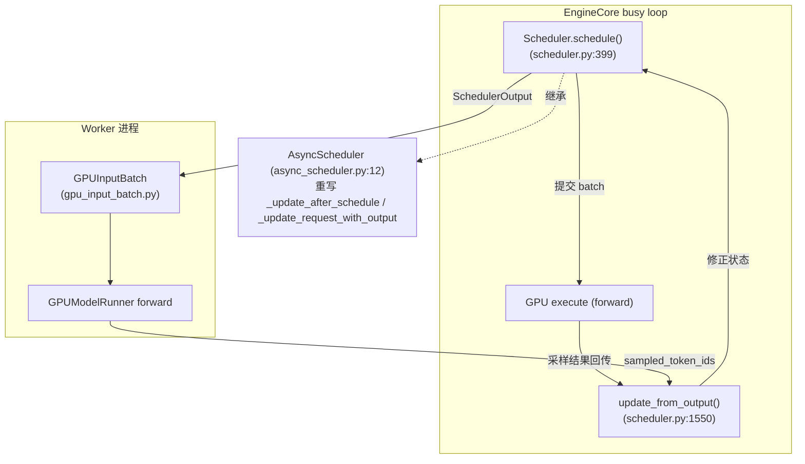
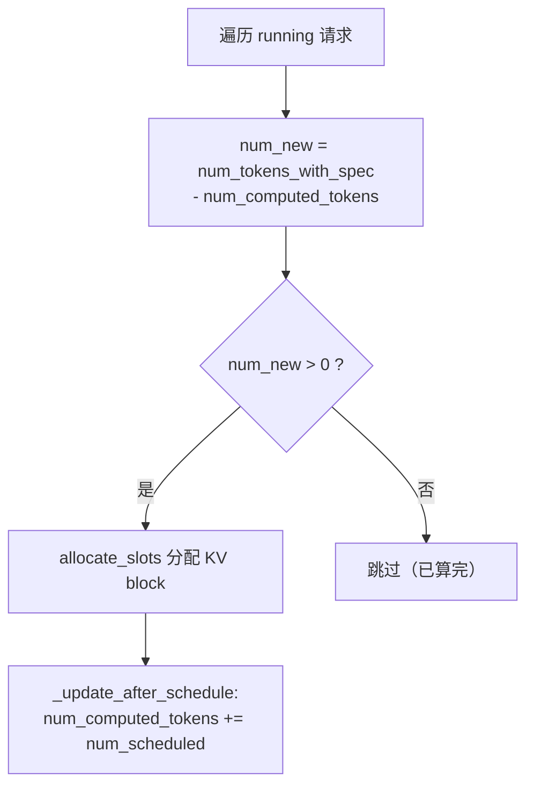
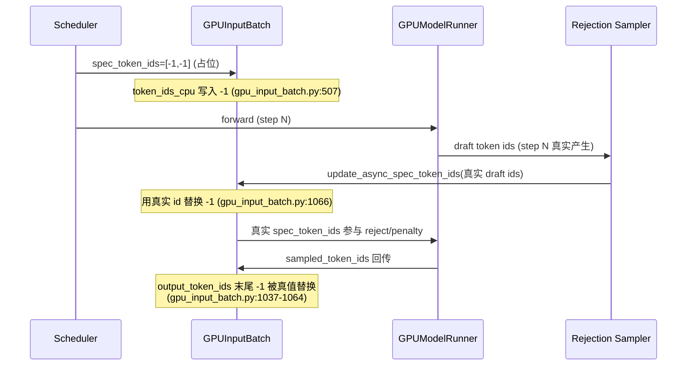
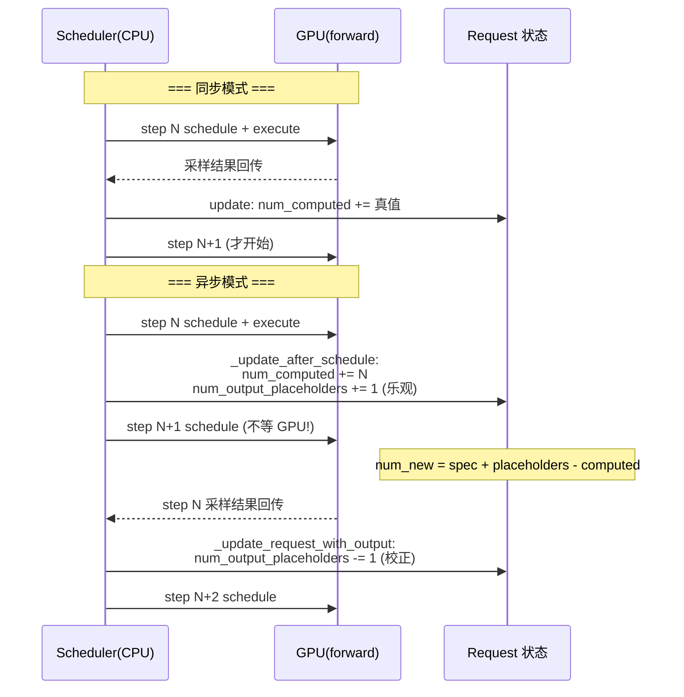

# vLLM 异步调度器（Async Scheduler）深度解剖

> 基于 `comments-on-v0.25.1` 分支源码（2026-07-17 快照）
> 调研范围：`vllm/v1/core/sched/{async_scheduler,scheduler,interface,output}.py`、`vllm/config/{scheduler,vllm}.py`、`vllm/v1/worker/gpu_input_batch.py`、`vllm/v1/request.py`
> 参考：vLLM Blog / 社区源码解析（知乎《Async Scheduler 实现原理》、官方 async_scheduler API 文档）

---

## 目录

- [0. 前置知识：为什么需要异步调度](#0-前置知识为什么需要异步调度)
- [1. 全景架构概览](#1-全景架构概览)
- [2. Layer 1：调度器接口与启用开关](#2-layer-1调度器接口与启用开关)
- [3. Layer 2：同步 Scheduler 的核心公式](#3-layer-2同步-scheduler-的核心公式)
- [4. Layer 3：AsyncScheduler 与 Placeholder Token（重点）](#4-layer-3asyncscheduler-与-placeholder-token重点)
- [5. Worker 侧：-1 占位如何被填充](#5-worker-侧-1-占位如何被填充)
- [6. 完整调用链时序图](#6-完整调用链时序图)
- [7. 同步 vs 异步调度对比](#7-同步-vs-异步调度对比)
- [8. 关键数据结构速查表](#8-关键数据结构速查表)
- [9. 启用与配置](#9-启用与配置)
- [10. 源码文件索引](#10-源码文件索引)
- [11. 快速问题解答（FAQ）](#11-快速问题解答faq)

---

## 0. 前置知识：为什么需要异步调度

### 0.1 同步调度的瓶颈

vLLM 每个调度步（step）对应一次模型 forward。同步模式下，CPU 调度器和 GPU 是**严格串行**的：

```
step N:  schedule() → execute(GPU) → 等 GPU 算完 → update_from_output()
step N+1: schedule() → ...
```

GPU 在算 step N 时，CPU 调度器只能**干等**。GPU 算完、token 采样结果回传 CPU 后，才能开始 step N+1 的 `schedule()`。这段"CPU 空等 GPU"的间隙降低了 GPU 利用率。

### 0.2 异步调度的核心思想：重叠批次（Overlapping Batches）

异步调度让 CPU **不等 GPU 算完就提前调度下一步**。即：step N 的 forward 还在 GPU 上跑，CPU 已经算出了 step N+1 的调度决策并下发了。这样 CPU 调度和 GPU 计算在时间上重叠，隐藏了调度延迟。

**代价**：调度 step N+1 时，step N 的采样结果还没回来，调度器**不知道 step N 到底生成了几个 token**。于是它必须"猜"——这就是 **placeholder（占位）** 机制的由来。

### 0.3 一句话理解 Placeholder Token

> **Placeholder = 调度器在"真实结果还没回来"时，为即将产生的 token 提前占好的"位置 + KV 槽位"。**

它解决的根本矛盾是：**调度决策（需要知道序列里有哪些 token、占哪些位置）必须发生在 GPU 结果回来之前**。既然结果未知，就先占个位、等结果回来再填真值/再校正计数。

> ⚠️ **重要澄清（旧报告没讲清的点）**：代码里 "placeholder" 其实指**两件事**，不要混：
> - **(A) 计数型占位** `num_output_placeholders`：一个整数，表示"我已乐观预留、但还没拿到真实 token 的 output 槽位数"。纯调度记账用。
> - **(B) 字面型占位** `spec_token_ids = [-1, -1, ...]` 和 `output_token_ids` 里的 `-1`：token 的**真实 id 还没算出来**（尤其投机解码的 draft token），先用 `-1` 字面量顶着，worker 在 forward 前/采样后替换成真值。
>
> 两者都叫 placeholder，但 (A) 是"数量未知"的占位，(B) 是"值未知"的占位。下文会分别拆开讲。

### 0.4 演进

- vLLM V0：显式区分 prefill/decode，两套调度逻辑。
- vLLM V1：用 `num_tokens - num_computed_tokens` 统一公式，不再区分阶段。
- Async Scheduling：在 V1 基础上进一步让调度与 GPU 执行重叠，配合 V2 model runner + pipeline parallel 的 microbatching（一次 decode 跨 `pp_size` 步），把 GPU 利用率推满。

---

## 1. 全景架构概览

**图1：异步调度在引擎中的位置**



**关键点**：异步模式下，`schedule()` 提交 batch 后**不等待** `update_from_output()`，立刻又 `schedule()` 下一个 batch。允许多个 batch 同时在途（in-flight），由 `max_concurrent_batches > 1` 控制。

---

## 2. Layer 1：调度器接口与启用开关

### 2.1 统一契约 `SchedulerInterface`（`interface.py:36`）

`Scheduler` 和 `AsyncScheduler` 都实现此接口，方法包括 `schedule()`、`update_from_output()`、`add_request()`、`finish_requests()`。

### 2.2 启用开关

`SchedulerConfig.async_scheduling`（`config/scheduler.py:158`，默认 `None` = 自动）：

```python
# config/scheduler.py:180
def get_scheduler_cls(self):
    if self.scheduler_cls is None:
        if self.async_scheduling:
            from ...async_scheduler import AsyncScheduler
            return AsyncScheduler          # 异步
        from ...scheduler import Scheduler
        return Scheduler                  # 同步
```

`async_scheduling` 为 `None` 时由 `VllmConfig` 自动决定（`config/vllm.py:992-1040`）：若 executor 支持（V2 runner 等）则置 `True`，否则 `False`。`max_concurrent_batches` 在 `async_scheduling=True` 时自动 > 1（`config/vllm.py:492-496`），这是异步能重叠的前提。

---

## 3. Layer 2：同步 Scheduler 的核心公式

**图2：计算本步要调度的 token 数**



同步模式下（`scheduler.py:502` 的简化版，无 placeholder）：

```
num_new = num_tokens_with_spec - num_computed_tokens
```

- **decode 请求**：`num_computed_tokens` 已等于"已算的 output 数"，差值为 1 → 每步算 1 个新 token。
- **prefill 请求**：差值 = 剩余 prompt token 数 → 可能很大，被 `long_prefill_token_threshold` / `token_budget` 截断成 chunked prefill。

调度后 `_update_after_schedule`（`scheduler.py:1231`）把 `num_computed_tokens += num_scheduled_token`——因为同步模式下，**调度时 GPU 结果必然会在 update 前算完**，所以"已调度"就等于"将已计算"，可以放心前进。

---

## 4. Layer 3：AsyncScheduler 与 Placeholder Token（重点）

`AsyncScheduler`（`async_scheduler.py:12`）只重写 **3 个方法**，其余 128KB 调度逻辑全复用父类。它要解决的唯一问题：**调度时 GPU 结果未回来，不能像同步那样直接前进 `num_computed_tokens`**。

### 4.1 计数型占位 (A)：`num_output_placeholders`

`_update_after_schedule`（`async_scheduler.py:19`）在父类前进 `num_computed_tokens` 之后，**再乐观地多预留一批 output token**：

```python
# async_scheduler.py:38-41
cur_num_spec_tokens = len(spec_decode_tokens.get(req_id, ()))
request.num_output_placeholders += (
    self.num_sampled_tokens_per_step + cur_num_spec_tokens
)
```

含义：**"我假设这一步会新产生 `num_sampled_tokens_per_step`（decode 通常是 1）+ spec draft token 数 个 output token，先记下来，等真结果回来再扣。"**

于是异步模式计算本步 token 数时（`scheduler.py:502-506`）公式变成：

```
num_new = num_tokens_with_spec + num_output_placeholders - num_computed_tokens
                                    ^^^^^^^^^^^^^^^^^^^^^^^^
                                    加上"乐观预留"的 token
```

**为什么加它？** 因为异步下 `num_computed_tokens` 已经"超前"包含了还没确认的 token（父类无条件前进了）。`num_output_placeholders` 正好抵消这部分超前，让 `num_new` 算出来的"本步真正要新算几个"依然正确。

**校正 (A)**：当真实采样结果回来，`_update_request_with_output`（`async_scheduler.py:51`）扣减：

```python
# async_scheduler.py:67-68
request.num_output_placeholders -= len(new_token_ids)
assert request.num_output_placeholders >= 0
```

> 用具体数字走一遍（decode，每步 1 token，无 spec）：
> - step N 调度后：`num_computed_tokens` 前进到 10，`num_output_placeholders` = 1（乐观预留 1）。
> - step N+1 调度时（GPU 还没回传）：`num_new = num_tokens_with_spec(=11) + placeholders(=1) - computed(=10) = 2`？不——实际 `num_tokens_with_spec` 此时已包含那个未确认 token，所以 `num_new = 11+1-10 = 2` 表示"再算 1 个新 token + 确认之前的 1 个"。核心就是：**placeholder 让调度器能"看得到"还没回传的那 1 个 token，从而正确安排后续位置。**
> - step N 的 GPU 结果回来：真生成了 1 个 token → `num_output_placeholders` 扣回 0。

### 4.2 字面型占位 (B)：`spec_token_ids = [-1, -1, ...]`

```python
# async_scheduler.py:16, 23-25, 44
self._spec_token_placeholders = [-1] * self.num_spec_tokens   # 复用只读占位列表
...
self._spec_token_placeholders = [-1] * scheduler_output.num_spec_tokens_to_schedule
...
request.spec_token_ids = self._spec_token_placeholders   # 挂到 request 上
```

含义：**投机解码（spec decoding）下，调度 step N+1 时 draft token 的"真实 id"根本还没产生**（要等 step N 的模型 forward 才 draft 出来）。所以先用 `-1` 占着位置，worker 在 forward 前用真实 draft id 替换（`update_async_spec_token_ids`，见 §5）。

注意 `gpu_input_batch.py:503` 的注释也印证：`spec_token_ids are placeholders and will be overwritten in ...`。

### 4.3 PP Microbatching 步距（`async_scheduler.py:46-49`）

```python
if self.use_v2_model_runner:
    request.next_decode_eligible_step = self.current_step + self.pp_size
```

V2 runner + pipeline parallel 下，同一请求的两次 decode 必须间隔 `pp_size` 步（匹配 worker 侧 sampled-token 广播槽位的环形节奏）。`schedule()` 里 `scheduler.py:487` 会跳过"还没到 eligible step"的请求。

### 4.4 异步帧丢弃（`async_scheduler.py:54-59`）

`reset_prefix_cache` 强制抢占时，可能有 in-flight 的陈旧异步输出帧。`async_tokens_to_discard` 计数器（`scheduler.py:2290` 在抢占时设为 `num_output_placeholders`）逐帧 drain，每收到一帧输出就丢一帧，直到归零才恢复正常处理。

---

## 5. Worker 侧：-1 占位如何被填充

**图3：字面占位 -1 的替换流程**



### 5.1 draft token 的 -1 替换

`update_async_spec_token_ids`（`gpu_input_batch.py:1066`）在 rejection sampler 用 draft token 做 penalty/bad_words 计算前，把 `spec_token_ids` 里的 `-1` 换成上一步真实产生的 draft id。

### 5.2 output token 的 -1 替换

`_update_output_token_ids`（`gpu_input_batch.py:1037-1064`）：若 `output_token_ids` 末尾是 `-1`（说明是异步乐观占位），用 `sampled_token_ids` 的真值从第一个 `-1` 起覆盖：

```python
# gpu_input_batch.py:1054-1063
first_placeholder = len(req_output_token_ids)
while first_placeholder > 0 and req_output_token_ids[first_placeholder-1] == -1:
    first_placeholder -= 1
num_placeholders = len(req_output_token_ids) - first_placeholder
num_to_replace = min(num_sampled_ids, num_placeholders)
req_output_token_ids[first_placeholder:] = new_ids   # 真值覆盖 -1
```

> 这里还处理了"占位数量可能比实际采样多（乐观）或少（kv-load 失败丢弃）"的情况：`min(num_sampled_ids, num_placeholders)` 取较小值，避免越界。

---

## 6. 完整调用链时序图

**图4：同步 vs 异步一步对比（含 placeholder 流转）**



---

## 7. 同步 vs 异步调度对比

| 维度 | 同步 (Scheduler) | 异步 (AsyncScheduler) |
| --- | --- | --- |
| 执行流水线 | step N 完成 → 更新 → 调度 N+1 | step N 下发后立即调度 N+1 |
| GPU 利用率 | step 间有 CPU 空等间隙 | 调度与执行重叠，利用率更高 |
| 状态准确性 | `num_computed_tokens` 始终准确 | 含乐观占位，暂时超前 |
| 核心额外字段 | 无 | `num_output_placeholders`(A)、`spec_token_ids=[-1]`(B)、`async_tokens_to_discard`、`next_decode_eligible_step` |
| 投机解码 | draft id 调度时已可知 | draft id 用 `-1` 占位，worker 填充 |
| 启用条件 | 默认（不支持异步时） | `async_scheduling=True` + `max_concurrent_batches>1`（V2 runner） |

**核心公式对比：**

```
同步:   num_new = num_tokens_with_spec                  - num_computed_tokens
异步:   num_new = num_tokens_with_spec + num_output_placeholders - num_computed_tokens
                                      ^^^^^^^^^^^^^^^^^^^^^^^^^^
                                      抵消 num_computed 的"乐观超前"
```

---

## 8. 关键数据结构速查表

| 数据结构 / 字段 | 位置 | 含义 |
| --- | --- | --- |
| `AsyncScheduler` | `async_scheduler.py:12` | 异步调度器，继承 `Scheduler`，重写 3 方法 |
| `num_output_placeholders` (A) | `request.py:141` | 乐观预留但未确认的 output token 计数 |
| `spec_token_ids = [-1,...]` (B) | `async_scheduler.py:44` | draft token 真实 id 未知时的字面占位 |
| `async_tokens_to_discard` | `request.py:142` | 需丢弃的陈旧 in-flight 异步帧计数 |
| `next_decode_eligible_step` | `request.py:146` | V2+PP+async 下下次可 decode 的步号 |
| `_update_after_schedule` | `async_scheduler.py:19` | 调度后乐观前进 + 加 placeholder |
| `_update_request_with_output` | `async_scheduler.py:51` | 结果回来后校正 placeholder / 丢弃帧 |
| `update_async_spec_token_ids` | `gpu_input_batch.py:1066` | worker 用真实 draft id 替换 -1 |
| `_update_output_token_ids` | `gpu_input_batch.py:1037` | worker 用采样真值替换 output 里的 -1 |

---

## 9. 启用与配置

异步调度默认在支持的执行器（V2 runner）上**自动开启**。如需显式控制：

```python
# SchedulerConfig (config/scheduler.py:158)
async_scheduling: bool | None = None   # None=自动；True=强制开；False=关
```

对应 `max_concurrent_batches`（`config/vllm.py:492`）在 `async_scheduling=True` 时自动 > 1，决定同时在途的 batch 数。也可通过 `scheduler_cls` 自定义调度器类（但必须继承 `AsyncScheduler` 而非 `Scheduler`，否则异步被禁用、性能下降）。

---

## 10. 源码文件索引

| 文件 | 职责 |
| --- | --- |
| `vllm/v1/core/sched/interface.py:36` | `SchedulerInterface` 统一契约 |
| `vllm/v1/core/sched/scheduler.py:68` | `Scheduler` 同步核心（~128KB） |
| `vllm/v1/core/sched/scheduler.py:399` | `schedule()` 主循环 |
| `vllm/v1/core/sched/scheduler.py:502` | 异步 token 数公式（含 `num_output_placeholders`） |
| `vllm/v1/core/sched/scheduler.py:1231` | 基类 `_update_after_schedule`（前进 `num_computed_tokens`） |
| `vllm/v1/core/sched/async_scheduler.py:12` | `AsyncScheduler`（重写 3 方法） |
| `vllm/v1/request.py:141` | `num_output_placeholders` 等异步字段定义 |
| `vllm/v1/worker/gpu_input_batch.py:1037` | output `-1` 占位替换 |
| `vllm/v1/worker/gpu_input_batch.py:1066` | `update_async_spec_token_ids`（-1→真实 draft） |
| `vllm/config/scheduler.py:158` | `async_scheduling` 开关 |
| `vllm/config/scheduler.py:180` | `get_scheduler_cls()` 选择 Scheduler/AsyncScheduler |
| `vllm/config/vllm.py:992` | `async_scheduling` 自动决策逻辑 |

---

## 11. 快速问题解答（FAQ）

**Q1：Placeholder token 到底是什么？一句话。**
A：调度器在 GPU 真实结果还没回来时，为"即将产生但还不知道数量/值"的 token 提前占好的位置与 KV 槽位。它有两种形式：(A) 计数 `num_output_placeholders`（数量未知）；(B) 字面 `-1`（`spec_token_ids` / `output_token_ids` 里，值未知）。

**Q2：为什么 decode 每步才 1 个 token，还要 placeholder？**
A：因为异步下调度 N+1 时，N 的采样结果未回传。调度器必须"假设 N 产生了 1 个 token"才能正确安排 N+1 的位置，否则它不知道序列已经到哪了。placeholder 就是那个"假设"。

**Q3：`num_output_placeholders` 会算错吗？**
A：暂时的"超前"是设计预期。当真实结果回来（`_update_request_with_output`）会扣减，并有 `assert >= 0`。社区早期确实发现过相关边界 bug，但机制本身是正确的"假设→校正"模式。

**Q4：`-1` 字面占位和 KV offloading 的"等待 KV"是一回事吗？**
A：**不是**。`-1` 占位属于**投机解码 / 异步调度**（token 的 id 或数量未知）。而 KV offloading 的 `WAITING_FOR_REMOTE_KVS` 是另一套机制（KV 块还在从 CPU/磁盘异步加载、未就绪）。两者都涉及"异步等待"，但等待的对象完全不同：一个是 token 值，一个是 KV 数据。

**Q5：AsyncScheduler 和 Scheduler 的 `schedule()` 有什么不同？**
A：完全一样，`AsyncScheduler` 直接继承父类的 `schedule()`。区别只在调度**之后**：`_update_after_schedule` 多做了乐观占位。所以它被称为"薄层"（仅 76 行）。

**Q6：什么时候会用到 `spec_token_ids=[-1]`？**
A：仅在**投机解码 + 异步调度**组合下。调度 step N+1 时，N 的 draft token 还没产生，draft id 未知，故用 `-1` 占位；worker 在 forward 前用 N 真实产生的 draft id 替换（`update_async_spec_token_ids`）。
