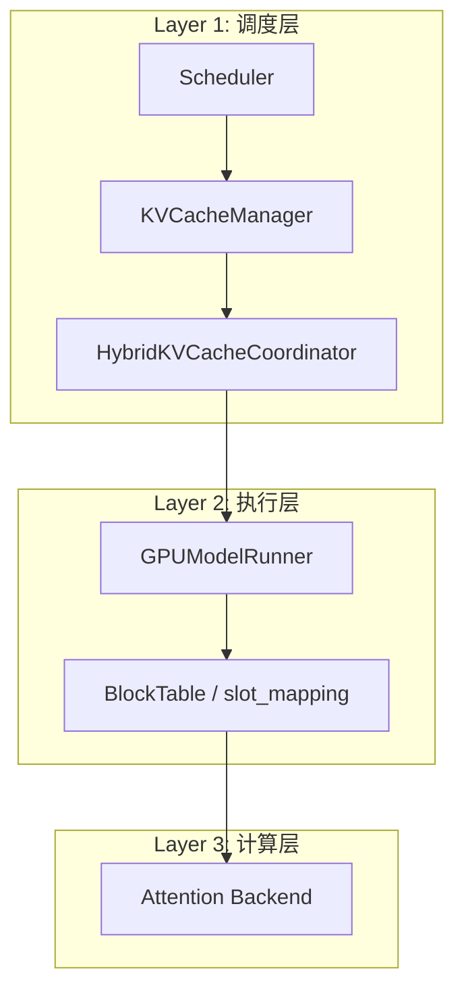
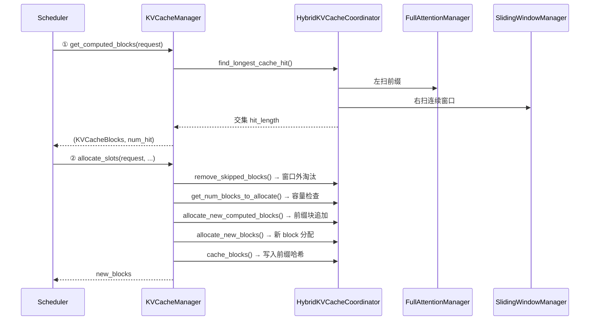

---
name: source-analyzer
description: 深度阅读源码，生成图文并茂的 Markdown 分析报告。结合代码探索、调用链追踪、Mermaid 架构图/时序图/流程图/对比表，按"全景架构→逐层解剖→关键数据结构→完整时序"结构输出。当用户要求"分析XX原理/源码"、"解剖XX机制"、"写XX分析报告"、"XX是怎么实现的"时使用。
---

# Source Analyzer（源码原理分析报告生成器）

## Overview

深度分析源码模块，生成图文并茂的中文 Markdown 分析报告。核心流程：**网上调研学思想 → 源码探索追踪调用链 → 专业 diagrams 架构图 → 逐层深度解剖 → 完整调用链时序图**。报告要能让"小白"看懂原理，让"老手"快速定位关键路径。

## When To Use

- 用户要求"分析/解剖/理解 XX 模块的实现原理"
- 用户想要了解某个子系统的完整调用链
- 用户需要一份可视化的架构分析文档

## 与 code-commenter 的分工

| | source-analyzer | code-commenter |
|---|---|---|
| 产物 | 独立 `.md` 分析报告 | 源码内注释 |
| 配图 | **Mermaid 图**（架构图/时序图/流程图） | ASCII box-drawing 图 |
| 存放 | `.codebuddy/analysis/` | 原源码文件中 |
| 触发 | "分析XX原理" "解剖XX机制" | "加注释" "注释这个类" |

## Workflow

按顺序执行 7 个阶段，**不要跳过任何阶段**。

### Phase 0: 知识前置学习（必做）

**在阅读源码之前**，先用 `web_search` + `web_fetch` 搜索并阅读相关文章：

1. 搜索模块的设计思想、核心概念、为什么需要这个组件
2. 阅读社区深度文章（CSDN、掘金、知乎、博客园等），理解"为什么这么设计"
3. 了解常见方案对比、演进历史、已知问题与 tradeoff
4. 整理关键知识点，作为后续源码阅读的"地图"

**目标**：先有思想地图，再看代码落地，理解深度远超直接看代码。

### Phase 1: 全景探索

用 `code-explorer` subagent 全面搜索相关代码：

1. 找到所有相关文件（目录结构、关键类、接口）
2. 追踪调用链：谁创建对象、谁调用核心方法、数据如何流转
3. 记录关键数据结构及其字段含义
4. 梳理模块间依赖关系（scheduler / cache / attention / worker / connector 等）

**输出**: 模块全景图 + 核心文件清单

### Phase 2: 架构总览

输出报告的 **"全景架构概览"** 章节，包含：

1. **Mermaid 图直接嵌入 markdown**（`graph TD`/`flowchart`、`sequenceDiagram`——GitHub/VS Code/多数渲染器原生支持，无需外部文件）
2. 一句话概括每个模块的职责
3. 关键数据流的高层描述

> **画图首选 Mermaid**：直接写在 markdown 代码块中（```` ```mermaid ````），渲染零依赖。如需可编辑的 .drawio 文件，再用 draw.io MCP（`open_drawio_xml` / `open_drawio_mermaid`）生成附件。

Mermaid 备用示例（轻量场景）：



### Phase 3: 逐层深度解剖

对每一层，输出：

1. **Mermaid 流程图/时序图** 展示该层内部逻辑
2. **关键代码段引用**（文件 + 行号，用 ` ```py:line:file ` 格式）
3. **设计决策说明**（为什么这样设计、有什么取舍）
4. **边界/陷阱标注**（?? 容易出错的地方）

示例时序图（Mermaid `sequenceDiagram`）:



### Phase 4: 关键数据结构速查表

用 Markdown 表格总结核心数据结构：

| 数据结构 | 关键字段 | 作用 |
|---------|---------|------|
| KVCacheBlocks | blocks: tuple[Sequence[KVCacheBlock], ...] | 跨 group 的 block 分配结果 |
| CommonAttentionMetadata | block_table_tensor, slot_mapping | 传给后端的 KV cache 寻址信息 |
| ... | ... | ... |

### Phase 5: 完整调用链时序图

输出报告的核心卖点——**一个覆盖全流程的 Mermaid 时序图**：

- 从 Scheduler 开始到 Attention 计算结束
- 标注每个步骤的编号 ①~?
- 标注每个步骤对应的文件和函数

### Phase 6: 对比总结（按需）

如果被分析的系统有多个可比的实现/分支：

1. **对比表格**（Mermaid 或 Markdown 表格）
2. 各自的适用场景和性能特征
3. 如何选择

如果没有可比实现，跳过此节。

---

## 报告结构模板

按以下固定结构输出到 `.codebuddy/analysis/<topic>.md`:

```
# <主题>深度解剖

## 目录（自动生成锚点链接）

## 0. 前置知识：设计思想与核心概念
   - 网上调研总结（为什么要这个模块？解决了什么问题？）
   - 核心设计思想（关键 tradeoff、为什么选这个方案）
   - 演进历史 / 相关方案对比

## 1. 全景架构概览
   - Mermaid 架构图（graph TD / flowchart）
   - 一句话说明每层职责

## 2. Layer 1: <名称> 深度解剖
   - Mermaid 流程图/时序图
   - 关键代码引用
   - 设计决策

## 3. Layer 2: <名称> 深度解剖
   ...

## N. 完整调用链时序图
   - 端到端 Mermaid sequenceDiagram（标注步骤编号 ①~N）

## N+1. 关键数据结构速查表

## N+2. 快速问题解答（FAQ）
```

---

## 画图规范

**生成 PNG 图片，用 `` 嵌入 markdown**（兼容 GitHub、VS Code、PyCharm 等所有渲染器）。

### 画图流程

1. 用 `matplotlib` 编写 Python 脚本绘制架构图/时序图/流程图
2. 运行脚本生成 `.png` 文件到 `diagrams/` 子目录
3. 在报告中使用 `` 引用

> 配置中文字体：`plt.rcParams['font.sans-serif'] = ['Microsoft YaHei', 'SimHei']`

### Mermaid 参考（轻量速写）

先用 Mermaid 语法构思图的结构，再转换为 matplotlib 绘制：

| 图类型 | 语法 | 用途 |
|-------|------|------|
| `graph TD` / `flowchart TB` | `A-->B`, `subgraph` | 模块架构、分层关系 |
| `sequenceDiagram` | `participant`, `->>`, `-->>`, `Note` | 调用链时序 |
| `stateDiagram-v2` | `[*]`, `-->` | 状态流转 |
| `classDiagram` | `class`, `<|--` | 类关系 |

要求:
- 每个图有标题和编号
- 节点用中文标注
- 关键数据流标注方向（`→` `↓` `↑`）
- 不要过度复杂，一个图说清一件事

### 补充：draw.io MCP（按需）

如需生成可编辑的 .drawio 文件，使用 `open_drawio_xml`（架构图）或 `open_drawio_mermaid`（时序图），工具已在环境配置。

| 图类型 | 用途 | 关键语法 |
|-------|------|---------|
| `graph TD` / `flowchart` | 模块架构、分层关系 | `subgraph`, `-->` |
| `sequenceDiagram` | 调用链时序 | `participant`, `->>`, `-->>` |
| `stateDiagram-v2` | 状态流转 | `[*]`, `-->` |
| `classDiagram` | 类关系 | `class`, `<|--` |

要求:
- 每个图有标题和编号
- 节点用中文标注
- 关键数据流标注方向（`→` `↓` `↑`）
- 不要过度复杂，一个图说清一件事

---

## 铁律（Hard Rules）

1. **先调研再读码**：Phase 0（web_search + web_fetch）必须执行，先理解思想再看实现
2. **调用链必须基于真实代码探索**，调用 `code-explorer` subagent 查清对端文件 + 函数 + 行号
3. **图直接嵌入 markdown**：架构图/时序图用 Mermaid 代码块，GitHub/VS Code 原生渲染零依赖
4. **图不要过度复杂**——一个图说清一件事，复杂流程拆成多个子图
5. **语言用简体中文**
6. **必须产出报告文件**：最终产物输出到 `.codebuddy/analysis/<topic>.md`
