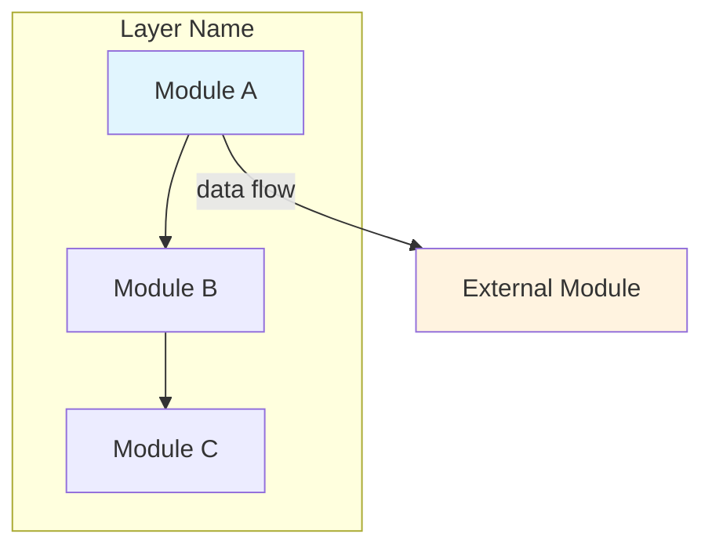
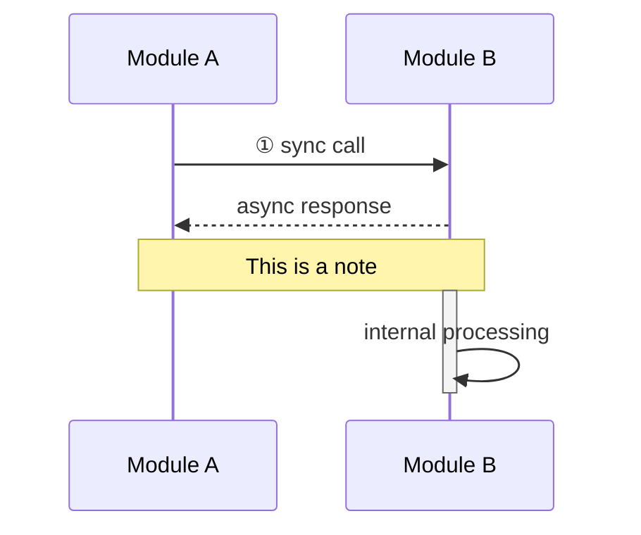
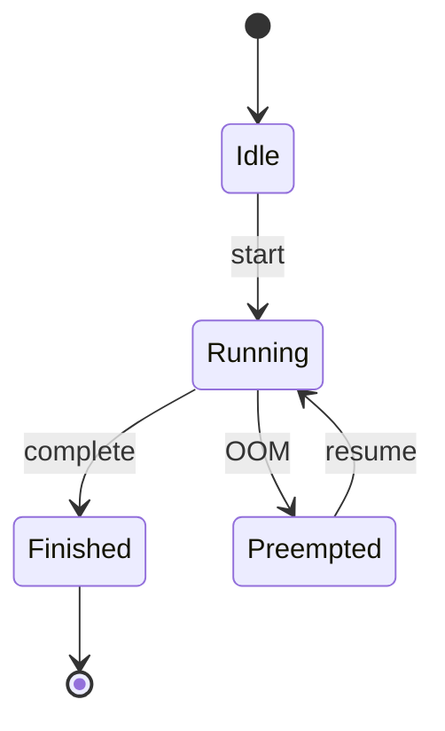
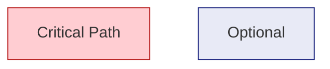
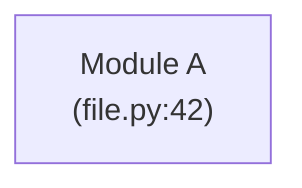

# Mermaid 语法快速参考

用于源码分析报告的各种 Mermaid 图表语法。

## 1. 架构图 / 流程图 (`flowchart` / `graph`)

最常用的图，用于展示模块分层和交互关系。



关键语法：
- `graph TD` = 从上到下，`graph LR` = 从左到右
- `subgraph "Title" ... end` = 分组框
- `A -->|label| B` = 带标签的箭头
- `A --> B` = 实线箭头，`A -.-> B` = 虚线箭头

## 2. 时序图 (`sequenceDiagram`)

展示调用链的时间顺序。



关键语法：
- `participant X as "Display Name"` = 定义参与者
- `->>` = 同步调用，`-->>` = 异步响应
- `activate`/`deactivate` = 激活/停用生命线
- `Note over A,B: text` = 跨参与者注释

## 3. 状态流转图 (`stateDiagram-v2`)

展示对象的状态迁移。



## 4. 对比表格

Mermaid 不支持原生表格，用 Markdown 表格替代：

```markdown
| | Implementation A | Implementation B |
|---|---|---|
| Feature 1 | ✅ | ❌ |
| Performance | Fast | Slow |
| Memory | High | Low |
```

## 5. 特殊小技巧

### 节点样式（颜色）


### 引用换行


### 避免过度复杂
- 超过 10 个节点 → 考虑拆成多个子图
- 箭头太多 → 检查是否真的需要全部展示
- 一个时序图不要超过 8 个 participant
